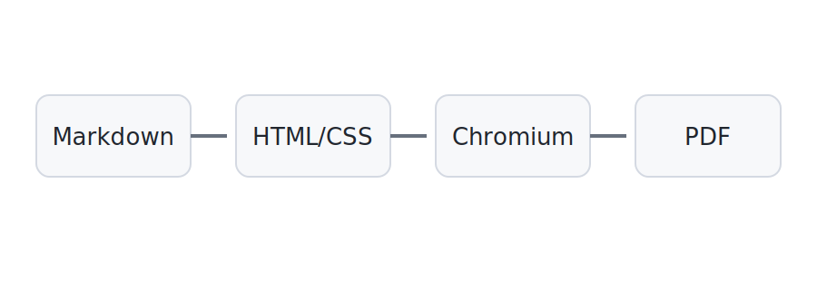

# PDF 渲染回归测试

这份文档用于检查中文、英文、公式、代码、表格、图片、列表与分页规则。

## 行内公式与块级公式

行内公式：\( E = mc^2 \)，概率表达式：\( P(A \mid B) = \frac{P(AB)}{P(B)} \)。

块级公式：

\[
\begin{aligned}
f(x) &= \int_{0}^{x} e^{-t^2}\,dt \\
A^{-1} &= \frac{1}{|A|}A^{*} \\
P(X=k) &= \binom{n}{k}p^k(1-p)^{n-k}
\end{aligned}
\]

导数与变限积分公式：

\[
\boxed{F'(x)=f\bigl(\beta(x)\bigr)\beta'(x)-f\bigl(\alpha(x)\bigr)\alpha'(x)}
\]

\[
\begin{aligned}
F'(x)&=\sqrt{\ln(1+x)}\,\mathrm e^{\ln(1+x)}\frac{1}{1+x}\\
&\quad-\sqrt{2x}\,\mathrm e^{2x}\cdot 2
\end{aligned}
\]

中文长分式视觉回归：

\[
\text{芯片总数}
=
\frac{\text{目标字数}}{\text{单片字数}}
\times
\frac{\text{目标字长}}{\text{单片字长}}
\]

带编号的宽矩阵公式不得与编号重叠：

\[
AA^{-1}=I,
\qquad
A\begin{bmatrix}x_1&\cdots&x_n\end{bmatrix}
=
\begin{bmatrix}e_1&\cdots&e_n\end{bmatrix},
\qquad
A\begin{bmatrix}x_1&x_2&x_3\end{bmatrix}
=
\begin{bmatrix}
1&0&0\\
0&1&0\\
0&0&1
\end{bmatrix}.
\tag{2.19}
\]

超宽未编号公式应在页面宽度内自动缩放：

\[
\begin{bmatrix}
1&0&0\\
0&1&0\\
0&0&1
\end{bmatrix}
\begin{bmatrix}x_1\\x_2\\x_3\end{bmatrix}
+
\begin{bmatrix}
2&-1&4\\
0&3&5\\
7&2&1
\end{bmatrix}
\begin{bmatrix}y_1\\y_2\\y_3\end{bmatrix}
=
\begin{bmatrix}b_1\\b_2\\b_3\end{bmatrix}
\]

## 提示块

> [!NOTE] 渲染检查
> 这里检查 Obsidian 风格提示块能否在打印页面中正常显示，并允许较长内容合理分页。

## 图片



## 代码块

```typescript
type BuildStatus =
  | 'queued'
  | 'running'
  | 'success'
  | 'failure'
  | 'publish_failed';

interface BuildResult {
  id: string;
  status: BuildStatus;
  outputs: string[];
}

export function summarize(result: BuildResult): string {
  const outputText = result.outputs.length > 0
    ? result.outputs.join(', ')
    : 'no output';

  return `${result.id}: ${result.status}; ${outputText}`;
}

const examples: BuildResult[] = Array.from({ length: 24 }, (_, index) => ({
  id: `task-${String(index + 1).padStart(2, '0')}`,
  status: index % 5 === 0 ? 'failure' : 'success',
  outputs: [`result-${index + 1}.pdf`]
}));

for (const example of examples) {
  console.log(summarize(example));
}
```

## 长表格

| 序号 | 模块 | 检查目标 | 预期结果 |
|---:|---|---|---|
| 1 | Markdown | 标题与段落 | 排版稳定 |
| 2 | KaTeX | 行内公式 | 不错位 |
| 3 | KaTeX | 多行公式 | 不裁切 |
| 4 | Shiki | TypeScript | 正常高亮 |
| 5 | 图片 | SVG | 成功加载 |
| 6 | 表格 | 表头 | 跨页重复 |
| 7 | 表格 | 单元格 | 单行不拆分 |
| 8 | 列表 | 无序列表 | 缩进正确 |
| 9 | 列表 | 有序列表 | 编号正确 |
| 10 | Callout | 提示块 | 样式正确 |
| 11 | 分页 | 长代码 | 允许分页 |
| 12 | 分页 | 长表格 | 允许分页 |
| 13 | 中文 | CJK 字体 | 字形完整 |
| 14 | 英文 | Latin 字体 | 字形完整 |
| 15 | 链接 | 外部链接 | 可读 |
| 16 | 强调 | 粗体与斜体 | 层次清晰 |
| 17 | 行距 | 正文行距 | 稳定 |
| 18 | 页脚 | 页码 | 正常显示 |
| 19 | 书签 | 标题层级 | 生成大纲 |
| 20 | 背景 | 打印背景 | 保持纯白 |
| 21 | 边距 | A4 页面 | 不溢出 |
| 22 | 输出 | HTML | 文件有效 |
| 23 | 输出 | PDF | 文件有效 |
| 24 | 资源 | 本地路径 | 解析正确 |
| 25 | 公式 | 分式 | 上下不裁切 |
| 26 | 公式 | 根式 | 字形完整 |
| 27 | 公式 | 极限 | 位置正确 |
| 28 | 代码 | 长行 | 自动换行 |
| 29 | 表格 | 长文本 | 合理折行 |
| 30 | 整体 | 回归测试 | 构建成功 |
| 31 | 公式 | 中文长分式 | 细线且布局稳定 |
| 32 | 公式 | 宽矩阵与编号 | 编号不重叠 |
| 33 | 公式 | 超宽表达式 | 自动缩放到页内 |

## 列表

- 第一项
  - 嵌套项目
  - 另一个嵌套项目
- 第二项
- 第三项

1. 准备 Markdown。
2. 校验公式和资源。
3. 渲染 HTML。
4. 使用 Chromium 生成 PDF。
5. 校验产物。
