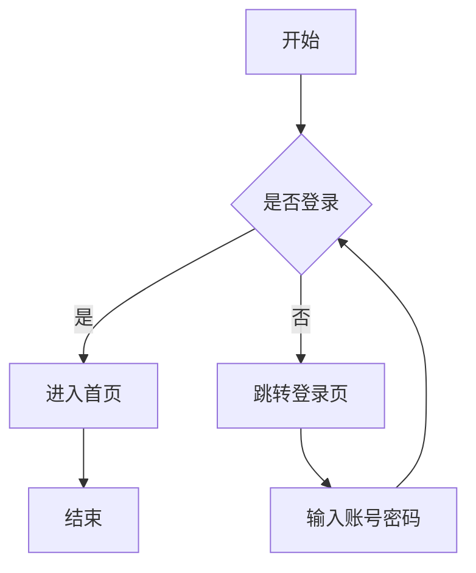
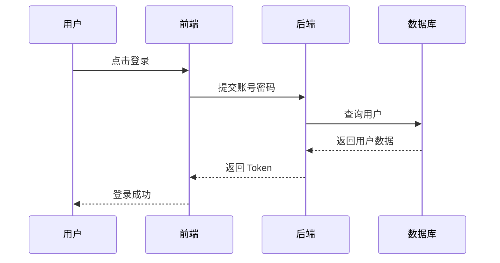
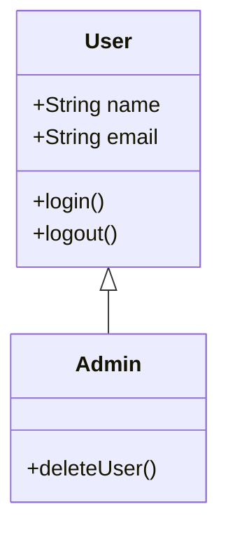

# Markdown 渲染综合测试文档

## 1. 标题层级测试

# 一级标题 H1

## 二级标题 H2

### 三级标题 H3

#### 四级标题 H4

##### 五级标题 H5

###### 六级标题 H6

---

## 2. 普通文本与强调

这是一段普通文本，用来测试 Markdown 的基础段落渲染效果。
这是同一段中的强制换行。

这是新的一段。

**这是加粗文本**

*这是斜体文本*

***这是加粗加斜体文本***

~~这是删除线文本~~

`这是行内代码`

普通文字中混合行内代码：使用 `npm install` 安装依赖，然后运行 `npm run dev` 启动项目。

---

## 3. 引用测试

> 这是一级引用。
>
> 引用中可以包含多段文字。
>
> > 这是嵌套引用。
> >
> > 嵌套引用中也可以包含 **加粗**、*斜体* 和 `代码`。

---

## 4. 无序列表

* 第一项
* 第二项

  * 第二项的子项 A
  * 第二项的子项 B

    * 更深一层
    * 更深一层
* 第三项

---

## 5. 有序列表

1. 第一步：初始化项目
2. 第二步：安装依赖
3. 第三步：编写代码

   1. 编写前端页面
   2. 编写后端接口
   3. 编写测试用例
4. 第四步：部署上线

---

## 6. 任务列表

* [x] 支持标题
* [x] 支持表格
* [x] 支持代码高亮
* [ ] 支持复杂数学公式
* [ ] 支持导出 PDF
* [ ] 支持自动生成目录

---

## 7. 链接测试

这是一个普通链接：[OpenAI](https://openai.com)

这是一个带标题的链接：[GitHub](https://github.com "代码托管平台")

这是一个自动链接：[https://example.com](https://example.com)

---

## 8. 图片测试


---

## 9. 分割线测试

---

---

---

---

## 10. 表格测试

| 编号 | 姓名 |  科目 | 分数 | 是否通过 |
| -: | :- | :-: | -: | :--: |
|  1 | 张三 |  数学 | 95 |   是  |
|  2 | 李四 |  英语 | 86 |   是  |
|  3 | 王五 | 计算机 | 78 |   是  |
|  4 | 赵六 |  政治 | 59 |   否  |

---

## 11. 更复杂的表格

| 模块       | 功能               |  状态 | 说明                   |
| :------- | :--------------- | :-: | :------------------- |
| Markdown | 标题、列表、引用         |  ✅  | 基础语法正常               |
| 代码块      | 多语言高亮            |  ✅  | 测试 Python、Java、C++ 等 |
| 数学公式     | 行内与块级公式          |  ✅  | 使用 LaTeX 渲染          |
| 表格       | 对齐、长文本           |  ✅  | 测试单元格换行与宽度           |
| HTML     | details、kbd、mark |  ✅  | 部分平台支持不同             |

---

## 12. 数学公式测试

行内公式测试：函数 ( f(x)=x^2+2x+1 ) 可以写成 ( f(x)=(x+1)^2 )。

块级公式测试：

[
E = mc^2
]

多行公式测试：

[
\begin{aligned}
a^2+b^2 &= c^2 \
x &= \frac{-b \pm \sqrt{b^2-4ac}}{2a}
\end{aligned}
]

极限测试：

[
\lim_{n\to\infty}\left(1+\frac{1}{n}\right)^n=e
]

积分测试：

[
\int_0^1 x^2,dx=\frac{1}{3}
]

矩阵测试：

[
A=
\begin{bmatrix}
1 & 2 & 3 \
4 & 5 & 6 \
7 & 8 & 9
\end{bmatrix}
]

分段函数测试：

[
f(x)=
\begin{cases}
x^2, & x\ge 0 \
-x, & x<0
\end{cases}
]

---

## 13. 脚注测试

这是一段带脚注的文字。[^note1]

这也是一个脚注示例。[^note2]

[^note1]: 这是第一个脚注内容。

[^note2]: 这是第二个脚注内容，可以包含 **加粗** 和 `代码`。

---

## 14. HTML 混合测试

<details>
<summary>点击展开详情</summary>

这里是折叠内容。

* 支持列表
* 支持 **加粗**
* 支持 `代码`

</details>

<br>

<mark>这是高亮文本</mark>

<br>

键盘按键测试：<kbd>Ctrl</kbd> + <kbd>C</kbd>

<br>

居中文本测试：

<div align="center">

**这是一段居中的文字**

</div>

---

## 15. 代码块高亮测试：Python

```python
from dataclasses import dataclass
from typing import List


@dataclass
class Student:
    name: str
    scores: List[int]

    def average(self) -> float:
        if not self.scores:
            return 0.0
        return sum(self.scores) / len(self.scores)


students = [
    Student("Alice", [95, 88, 92]),
    Student("Bob", [76, 81, 79]),
]

for student in students:
    print(f"{student.name}: {student.average():.2f}")
```

---

## 16. 代码块高亮测试：JavaScript

```javascript
const users = [
  { id: 1, name: "Alice", active: true },
  { id: 2, name: "Bob", active: false },
  { id: 3, name: "Carol", active: true },
];

const activeUsers = users
  .filter((user) => user.active)
  .map((user) => user.name.toUpperCase());

console.log(activeUsers);
```

---

## 17. 代码块高亮测试：TypeScript

```typescript
type UserRole = "admin" | "editor" | "viewer";

interface User {
  id: number;
  name: string;
  role: UserRole;
}

function canEdit(user: User): boolean {
  return user.role === "admin" || user.role === "editor";
}

const user: User = {
  id: 1,
  name: "Tom",
  role: "admin",
};

console.log(canEdit(user));
```

---

## 18. 代码块高亮测试：Java

```java
import java.util.ArrayList;
import java.util.List;

public class Main {
    public static void main(String[] args) {
        List<String> languages = new ArrayList<>();
        languages.add("Java");
        languages.add("Python");
        languages.add("Go");

        for (String language : languages) {
            System.out.println(language);
        }
    }
}
```

---

## 19. 代码块高亮测试：C

```c
#include <stdio.h>

int factorial(int n) {
    if (n <= 1) {
        return 1;
    }
    return n * factorial(n - 1);
}

int main(void) {
    int n = 5;
    printf("factorial(%d) = %d\n", n, factorial(n));
    return 0;
}
```

---

## 20. 代码块高亮测试：C++

```cpp
#include <iostream>
#include <vector>
#include <algorithm>

int main() {
    std::vector<int> nums = {5, 2, 9, 1, 7};

    std::sort(nums.begin(), nums.end());

    for (int num : nums) {
        std::cout << num << " ";
    }

    return 0;
}
```

---

## 21. 代码块高亮测试：C Sharp

```csharp
using System;
using System.Collections.Generic;

public class Program
{
    public static void Main()
    {
        var names = new List<string> { "Alice", "Bob", "Carol" };

        foreach (var name in names)
        {
            Console.WriteLine($"Hello, {name}!");
        }
    }
}
```

---

## 22. 代码块高亮测试：Go

```go
package main

import "fmt"

type User struct {
	Name string
	Age  int
}

func main() {
	user := User{Name: "Tom", Age: 21}
	fmt.Printf("%s is %d years old\n", user.Name, user.Age)
}
```

---

## 23. 代码块高亮测试：Rust

```rust
#[derive(Debug)]
struct User {
    name: String,
    age: u8,
}

fn main() {
    let user = User {
        name: String::from("Tom"),
        age: 21,
    };

    println!("{:?}", user);
}
```

---

## 24. 代码块高亮测试：Kotlin

```kotlin
data class User(val name: String, val age: Int)

fun main() {
    val users = listOf(
        User("Alice", 20),
        User("Bob", 22)
    )

    users.forEach { user ->
        println("${user.name} is ${user.age} years old")
    }
}
```

---

## 25. 代码块高亮测试：Swift

```swift
struct User {
    let name: String
    let age: Int
}

let user = User(name: "Tom", age: 21)

print("\(user.name) is \(user.age) years old")
```

---

## 26. 代码块高亮测试：PHP

```php
<?php

class User {
    public string $name;
    public int $age;

    public function __construct(string $name, int $age) {
        $this->name = $name;
        $this->age = $age;
    }

    public function greet(): string {
        return "Hello, " . $this->name;
    }
}

$user = new User("Tom", 21);
echo $user->greet();

?>
```

---

## 27. 代码块高亮测试：Ruby

```ruby
class User
  attr_reader :name, :age

  def initialize(name, age)
    @name = name
    @age = age
  end

  def greet
    "Hello, #{@name}"
  end
end

user = User.new("Tom", 21)
puts user.greet
```

---

## 28. 代码块高亮测试：SQL

```sql
CREATE TABLE students (
    id INTEGER PRIMARY KEY,
    name VARCHAR(100) NOT NULL,
    score INTEGER CHECK (score >= 0 AND score <= 100),
    created_at TIMESTAMP DEFAULT CURRENT_TIMESTAMP
);

INSERT INTO students (name, score)
VALUES
    ('Alice', 95),
    ('Bob', 82),
    ('Carol', 76);

SELECT
    name,
    score,
    CASE
        WHEN score >= 90 THEN '优秀'
        WHEN score >= 60 THEN '及格'
        ELSE '不及格'
    END AS level
FROM students
ORDER BY score DESC;
```

---

## 29. 代码块高亮测试：Bash

```bash
#!/usr/bin/env bash

set -e

PROJECT_NAME="markdown-test"

echo "Creating project: ${PROJECT_NAME}"

mkdir -p "${PROJECT_NAME}/src"
cd "${PROJECT_NAME}"

touch README.md
echo "# Markdown Test" > README.md

echo "Done."
```

---

## 30. 代码块高亮测试：PowerShell

```powershell
$ProjectName = "markdown-test"

New-Item -ItemType Directory -Path $ProjectName -Force
Set-Location $ProjectName

New-Item -ItemType File -Path "README.md" -Force
Set-Content -Path "README.md" -Value "# Markdown Test"

Write-Host "Project created successfully."
```

---

## 31. 代码块高亮测试：JSON

```json
{
  "name": "markdown-render-test",
  "version": "1.0.0",
  "private": true,
  "scripts": {
    "dev": "vite --host 0.0.0.0",
    "build": "vite build",
    "preview": "vite preview"
  },
  "dependencies": {
    "react": "latest",
    "typescript": "latest"
  }
}
```

---

## 32. 代码块高亮测试：YAML

```yaml
name: Markdown Render Test

on:
  push:
    branches:
      - main

jobs:
  build:
    runs-on: ubuntu-latest

    steps:
      - name: Checkout repository
        uses: actions/checkout@v4

      - name: Setup Node
        uses: actions/setup-node@v4
        with:
          node-version: 22

      - name: Install dependencies
        run: npm install

      - name: Build project
        run: npm run build
```

---

## 33. 代码块高亮测试：HTML

```html
<!doctype html>
<html lang="zh-CN">
  <head>
    <meta charset="UTF-8" />
    <title>Markdown Test</title>
  </head>
  <body>
    <main>
      <h1>标题</h1>
      <p>这是一段 HTML 文本。</p>
      <button type="button">点击</button>
    </main>
  </body>
</html>
```

---

## 34. 代码块高亮测试：CSS

```css
:root {
  font-family: system-ui, -apple-system, BlinkMacSystemFont, "Segoe UI", sans-serif;
  line-height: 1.6;
}

body {
  margin: 0;
  padding: 2rem;
  background: #f7f7f7;
}

.card {
  max-width: 720px;
  margin: 0 auto;
  padding: 1.5rem;
  border-radius: 16px;
  background: white;
  box-shadow: 0 8px 24px rgba(0, 0, 0, 0.08);
}
```

---

## 35. 代码块高亮测试：XML

```xml
<?xml version="1.0" encoding="UTF-8"?>
<bookstore>
  <book id="1">
    <title>Computer Science</title>
    <author>Tom</author>
    <price>59.90</price>
  </book>
</bookstore>
```

---

## 36. 代码块高亮测试：Markdown 原文

````markdown
# 示例标题

这是一段 **Markdown** 文本。

- 项目 A
- 项目 B
- 项目 C

```python
print("Hello, Markdown!")
````

````

---

## 37. 代码块高亮测试：Dockerfile

```dockerfile
FROM node:22-alpine

WORKDIR /app

COPY package.json package-lock.json ./

RUN npm ci

COPY . .

EXPOSE 3000

CMD ["npm", "run", "dev"]
````

---

## 38. 代码块高亮测试：TOML

```toml
[package]
name = "markdown-test"
version = "0.1.0"
edition = "2021"

[dependencies]
serde = "1"
tokio = { version = "1", features = ["full"] }
```

---

## 39. 代码块高亮测试：INI

```ini
[database]
host=localhost
port=5432
username=admin
password=secret

[server]
debug=true
workers=4
```

---

## 40. 代码块高亮测试：正则表达式

```regex
^[A-Za-z0-9._%+-]+@[A-Za-z0-9.-]+\.[A-Za-z]{2,}$
```

---

## 41. 代码块高亮测试：Mermaid 流程图



---

## 42. 代码块高亮测试：Mermaid 时序图



---

## 43. 代码块高亮测试：Mermaid 类图



---

## 44. 代码块高亮测试：Diff

```diff
function add(a, b) {
-  return a - b;
+  return a + b;
}

console.log(add(1, 2));
```

---

## 45. 代码块高亮测试：纯文本

```text
这是一段纯文本代码块。
它不会进行语法高亮。
适合展示日志、输出结果、配置说明等内容。
```

---

## 46. 日志文本测试

```log
[2026-07-02 21:00:01] INFO  Server started at http://localhost:3000
[2026-07-02 21:00:03] WARN  Cache miss: user:1001
[2026-07-02 21:00:05] ERROR Failed to connect database
[2026-07-02 21:00:06] INFO  Retry connection
```

---

## 47. 嵌套 Markdown 测试

1. 第一层列表

   > 列表中的引用内容。

   ```python
   def hello():
       print("hello from nested code block")
   ```

2. 第二层列表

   | 字段         | 类型       | 说明   |
   | :--------- | :------- | :--- |
   | id         | integer  | 主键   |
   | name       | string   | 名称   |
   | created_at | datetime | 创建时间 |

3. 第三层列表

   [
   a_n = \frac{1}{n}
   ]

---

## 48. 特殊字符测试

反斜杠：\

星号：*

下划线：_

反引号：`

井号：#

中括号：[ ]

小括号：( )

大括号：{ }

竖线：|

---

## 49. 转义与非转义对比

非转义加粗：**加粗**

转义加粗：**不加粗**

非转义列表：

* 项目

转义列表：

- 不会变成列表

---

## 50. Emoji 测试

😀 😁 😂 🤖 🚀 ✅ ❌ ⚠️ 📌 📚 🧠 💻 🧪 🎯

---

## 51. 警告块风格测试

> [!NOTE]
> 这是 Note 提示块，部分 Markdown 渲染器支持。

> [!TIP]
> 这是 Tip 提示块，适合写技巧。

> [!IMPORTANT]
> 这是 Important 提示块。

> [!WARNING]
> 这是 Warning 警告块。

> [!CAUTION]
> 这是 Caution 注意块。

---

## 52. 长段落测试

这是一段较长的文字，用来观察 Markdown 渲染器在处理长文本时的行宽、换行、段落间距和字体效果。Markdown 的优势在于它足够简洁，既可以被人直接阅读，也可以被程序转换成网页、PDF、Word 或其他格式。对于学习笔记、技术文档、项目说明、算法总结和课程复习资料来说，Markdown 是一种非常适合长期维护的文本格式。

---

## 53. 中英文混排测试

这是中文 text mixed with English words and inline code `console.log()` 的测试。

机器学习中的 ( KNN )、( SVM )、( CNN )、( PCA ) 都是常见算法。

---

## 54. 折叠答案测试

<details>
<summary>点击查看答案</summary>

答案是：

[
\begin{aligned}
f(x) &= x^2 + 2x + 1 \
&= (x+1)^2
\end{aligned}
]

所以最小值为 ( 0 )，此时 ( x=-1 )。

</details>

---

## 55. 小测题格式测试

### 题目 1

设函数 ( f(x)=x^2-2x+1 )，求 ( f(x) ) 的最小值。

A. ( -1 )
B. ( 0 )
C. ( 1 )
D. ( 2 )

<details>
<summary>答案与解析</summary>

正确答案：B

因为：

[
f(x)=x^2-2x+1=(x-1)^2
]

所以 ( f(x)\ge 0 )，最小值为 ( 0 )。

</details>

---

## 56. Callout 与代码混合测试

> [!EXAMPLE]
> 下面是一段 Python 快速排序代码：

```python
def quick_sort(arr):
    if len(arr) <= 1:
        return arr

    pivot = arr[0]
    left = [x for x in arr[1:] if x <= pivot]
    right = [x for x in arr[1:] if x > pivot]

    return quick_sort(left) + [pivot] + quick_sort(right)


print(quick_sort([5, 3, 8, 4, 2]))
```

---

## 57. 文件树测试

```text
project-root/
├── README.md
├── package.json
├── src/
│   ├── main.ts
│   ├── App.tsx
│   └── components/
│       └── Header.tsx
├── public/
│   └── favicon.ico
└── docs/
    └── guide.md
```

---

## 58. API 文档格式测试

### 获取用户信息

`GET /api/users/{id}`

#### 请求参数

| 参数 | 类型     |  必填 | 说明    |
| :- | :----- | :-: | :---- |
| id | string |  是  | 用户 ID |

#### 响应示例

```json
{
  "id": "1001",
  "name": "Tom",
  "role": "admin",
  "createdAt": "2026-07-02T21:00:00+09:00"
}
```

---

## 59. 算法笔记格式测试

### 二分查找

适用条件：数组有序。

时间复杂度：( O(\log n) )

空间复杂度：( O(1) )

```python
def binary_search(nums, target):
    left = 0
    right = len(nums) - 1

    while left <= right:
        mid = left + (right - left) // 2

        if nums[mid] == target:
            return mid
        elif nums[mid] < target:
            left = mid + 1
        else:
            right = mid - 1

    return -1
```

---

## 60. 结尾测试

这是最后一段内容。

**如果你能正常看到标题、表格、公式、代码高亮、折叠块、Mermaid 图和任务列表，说明 Markdown 渲染效果比较完整。**
