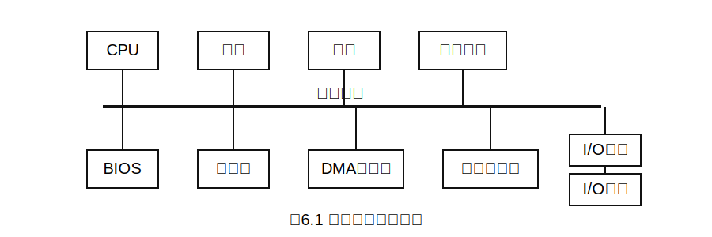
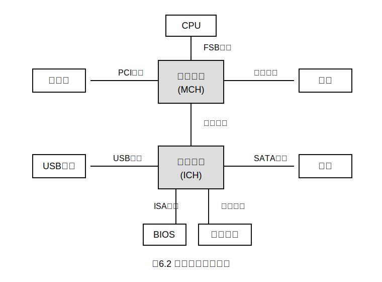
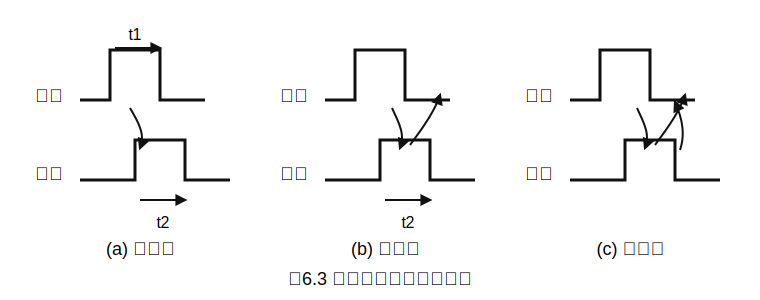

> 当前进度：已完成计算机组成原理 PDF 第 6 章全部可见正文内容整理。本轮阅读和处理 PDF 第 31-32 页，对应教材页第 284-285 页，补充完成 6.2 总线事务和定时，重点包括非突发传输、突发传输、串行/并行传输、同步定时、异步定时、半同步定时和分离式定时。PDF 第 33 页已进入第七章，因此第六章笔记已完成。
>
> 下次任务：本章已完成，无需继续推进；后续可进入计算机组成原理 PDF 第 7 章笔记整理。

# 第六章 总线

第六章围绕“总线”展开。总线是连接计算机各部件的公共信息通道，重点通常不在复杂推导，而在**概念辨析、性能指标计算、传输方式和定时方式比较**。选择题很容易把“数据总线传什么”“地址线决定什么”“串行一定慢不慢”“并行一定快不快”等问题混在一起考。

本章复习时可以抓住两条主线：

1. **为什么需要总线**：为了减少部件之间直接连线的数量，让多个部件能通过一组公共线路交换信息。
2. **总线带来的矛盾**：共享总线会降低连线复杂度，但会带来竞争、仲裁、带宽瓶颈、时序协调等问题。

## 6.1 总线概述

早期计算机中，各部件之间通过专用连线直接互连，这种方式也称为**分散连接**。随着 I/O 设备种类和数量增多，分散连接方式会让连线数量急剧增加，系统扩展、维护和标准化都变得困难。

因此，现代计算机逐步采用**总线连接方式**：用一组公共信息传输线路连接多个功能部件，各部件在不同时间共享这组线路完成数据、地址、控制信息的交换。

总线的核心特征可以概括为：

| 特征 | 含义 | 考试理解 |
|---|---|---|
| 分时性 | 同一时刻通常只允许一个部件向总线发送信息 | 多个发送方要通过仲裁或约定分时使用总线 |
| 共享性 | 多个部件都挂接在总线上，并可接收总线上的信息 | 降低连线数量，但也容易形成瓶颈 |

> 考点追踪：总线相关的概念与特点（2016、2017）

理解总线时，不要只把它想成“一根线”。更准确地说，总线是一组线路及其协议的组合，包括传输哪些信息、一次传多少位、谁先使用、何时发送、何时接收等规则。

### 6.1.1 总线的分类

总线可以从不同角度分类。对考研来说，最重要的是按**位置和连接对象**分类，以及系统总线内部按**传输信息内容**分类。

**1. 内部总线**

内部总线也称片内总线，指芯片内部的总线，用于 CPU 芯片内部各寄存器之间，以及寄存器与 ALU 之间的数据传送。

内部总线的特点是距离短、速度快、受 CPU 内部结构约束明显。它更多服务于 CPU 内部的数据通路，不直接用于连接主存和外部设备。

**2. 系统总线**

系统总线用于连接计算机系统中的各功能部件，如 CPU、主存和 I/O 接口。按照所传输信息的内容不同，系统总线通常分为三类：

| 类型 | 主要作用 | 方向特点 | 容易混淆点 |
|---|---|---|---|
| 数据总线 | 在各部件之间传输数据信息 | 通常双向 | “数据”不只包括操作数，也可能包括指令、状态字、中断类型号等 |
| 地址总线 | 指出要访问的主存单元或 I/O 端口地址 | 通常单向，由 CPU 发出 | 位数决定可寻址空间大小 |
| 控制总线 | 传输控制、状态、应答和时序协调信号 | 单根线方向可不同，整体可看作双向信号集合 | 不要简单说控制总线一定单向或一定双向 |

> 考点追踪：数据总线上传输的内容（2011）

数据总线的位数反映 CPU 一次能够并行传送的数据位数。例如，若数据总线宽度为 32 位，则一次并行传输可传送 32 bit 数据。这里的“数据”是广义数据，不限于算术运算中的操作数。

地址总线的位数决定系统最大可寻址空间。例如，若地址总线有 16 位，且每个地址对应 1B 存储单元，则最大可寻址空间为：

\[
2^{16}=65536\text{B}=64\text{KB}
\]

控制总线用于传输各种控制和协调信号，如时钟、复位、总线请求/允许、中断请求/响应、读/写命令、传输确认等。控制总线由多根控制信号线组成，不同信号线的方向可能不同，因此要按具体信号分析。

**3. I/O 总线**

I/O 总线用于连接主机与内部各类 I/O 控制器，例如显卡、网卡等。它通常采用标准化的内部总线协议，典型标准包括 PCI、AGP、PCI Express 等。

I/O 总线强调主机内部扩展能力，核心作用是让不同厂商的外设控制器能够按照统一规范接入系统。

**4. 通信总线**

通信总线用于主机与外部 I/O 设备之间，或不同计算机系统之间的通信。由于传输距离、传输速率、电气规范等要求不同，通信总线更强调接口标准和通信协议，典型代表包括 RS-232、USB 等。

本小节要特别注意两个层次：

1. **系统总线内部三分法**：数据总线、地址总线、控制总线。
2. **从连接范围看总线**：内部总线、系统总线、I/O 总线、通信总线。

### 6.1.2 常见的总线标准

总线标准是国际上制定的、用于互连计算机各功能模块的规范，本质上是一组接口协议。总线标准规定了连接方式、信号含义、时序、电气特性、传输宽度、传输速率等内容。

> 说明：PDF 脚注指出，本节“常见的总线标准”内容自 2021 年统考大纲中删除，仅供学习参考。复习时应以理解典型标准的分类和特征为主，不必死记大量英文全称。

> 考点追踪：总线标准的英文缩写（2010）

常见总线标准可以按“系统总线、局部总线、设备总线、串行/并行”等维度整理：

| 总线标准 | 英文含义或常用名称 | 主要特点 | 归类理解 |
|---|---|---|---|
| ISA | Industry Standard Architecture | 早期系统总线标准，速度低，CPU 占用率高，占用较多中断资源 | 系统总线、并行总线 |
| EISA | Extended Industry Standard Architecture | ISA 的扩展，支持多主控器和突发传送，兼容 ISA | 系统总线、并行总线 |
| VESA | Video Electronics Standards Association | 32 位局部总线标准，面向高速图像数据传输 | 局部总线、并行总线 |
| PCI | Peripheral Component Interconnect | 32 位或 64 位高性能外围总线，常用于显卡、声卡、网卡等扩展卡 | 局部总线、并行总线 |
| AGP | Accelerated Graphics Port | 面向图形卡的高速接口，允许显卡高效访问系统主存 | 局部总线、并行总线 |
| PCI-E | PCI-Express | 高速串行点对点连接，由多条通道组成，支持全双工通信 | 局部总线、串行总线 |
| RS-232C | 串行通信接口标准 | 用于 DTE 与 DCE 之间的串行二进制通信 | 设备总线、串行总线 |
| USB | Universal Serial Bus | 通用串行总线，支持即插即用、热插拔、多设备级联 | 设备总线、串行总线 |
| PCMCIA | Personal Computer Memory Card International Association | 主要用于笔记本电脑扩展卡 | 设备总线、并行总线 |
| IDE/ATA | Integrated Drive Electronics / ATA | 连接主板与硬盘、光驱的传统并行接口 | 设备总线、并行总线 |
| SCSI | Small Computer System Interface | 高性能系统级设备接口，常用于服务器硬盘等 | 设备总线、并行总线 |
| SATA | Serial ATA | IDE/ATA 的串行替代标准，采用高速串行传输 | 设备总线、串行总线 |

> 考点追踪：区分设备总线和局部总线（2013）

局部总线强调**靠近 CPU 的高速扩展通路**，常用于显卡等高速部件；设备总线强调**外部或内部设备接口标准**，常用于硬盘、USB 设备等外设连接。

> 考点追踪：PCI-E 总线的特点（2017）

PCI-E 与传统 PCI 的关键区别在于：PCI 是并行总线，而 PCI-E 是高速串行点对点连接。PCI-E 可由多条通道组成，如 x1、x4、x8、x16，并支持全双工通信。考试中若出现“串行但高速”“点对点”“多通道”“全双工”，通常要联想到 PCI-E。

> 考点追踪：USB 总线的特点（2012）

USB 是通用串行总线，主要面向外部 I/O 设备，常见特点包括即插即用、热插拔、支持多设备连接、使用方便。不要把 USB 误判为并行总线。

### 6.1.3 总线的性能指标

总线性能指标主要用于衡量总线传输能力。重点不在死记概念，而在区分“时钟频率、工作频率、总线宽度、总线带宽”之间的关系。

**1. 总线传输周期**

总线传输周期是完成一次完整总线事务的总时间，例如一次读操作或一次写操作所需的时间。它通常由若干个总线时钟周期组成，因此也可简称为总线周期。

**2. 总线时钟频率**

总线时钟频率是总线基础时钟信号的频率，也就是总线时钟周期的倒数。早期总线的时钟可能与 CPU 时钟同步，但随着 CPU 速度提高，现代总线时钟通常独立于 CPU 时钟。

**3. 总线工作频率**

总线工作频率指总线每秒能够完成的有效数据传输次数。它不一定等于总线时钟频率。

例如，某些总线在一个时钟周期内可以传输 2 次、4 次甚至更多次数据，则总线工作频率可以达到时钟频率的 2 倍、4 倍等。

**4. 总线宽度**

总线宽度指总线中数据线的条数，决定每次能够并行传输的数据位数。例如，16 位总线一次可并行传输 16 bit，也就是 2B。

**5. 总线带宽**

总线带宽指总线在单位时间内所能传输的最大数据量，也称最大数据传输率。计算时应使用：

\[
\text{总线带宽}=\text{总线宽度}\times\text{总线工作频率}
\]

如果总线宽度以 bit 为单位，则要换算为 Byte：

\[
\text{总线带宽}=\frac{\text{总线宽度(bit)}}{8}\times\text{总线工作频率}
\]

> 考点追踪：总线带宽的分析与计算（2009、2013、2014、2018—2020、2024、2025）

例如，若总线时钟频率为 11MHz，每个时钟周期可传送 2 次数据，则总线工作频率为：

\[
11\text{MHz}\times 2=22\text{MHz}
\]

若总线宽度为 16 位，即 2B，则总线带宽为：

\[
2\text{B}\times 22\times 10^6=44\text{MB/s}
\]

这里要注意，计算带宽时不能只看两个设备之间一次通信的“有效速率”，而应依据总线的物理参数和传输机制，如总线宽度、时钟频率、每周期传输次数等。

**6. 总线复用**

总线复用指同一组信号线在不同时间段传输不同类型的信息。例如，地址线和数据线复用时，前一阶段传输地址，后一阶段传输数据。

总线复用的优点是减少引脚数量、降低硬件成本；缺点是不同信息要分时传输，控制更复杂，传输效率可能下降。

**7. 总线寻址能力**

总线寻址能力由地址线位数决定。若地址线有 \(n\) 位，且按字节编址，则最大可寻址空间为：

\[
2^n\text{B}
\]

例如，16 位地址线可表示 \(2^{16}=65536\) 个不同地址，若每个地址对应 1B，则最大寻址空间为 64KB。

本小节最重要的三个指标是：**总线宽度、总线工作频率、总线带宽**。带宽计算题往往会把“时钟频率”和“工作频率”分开给出，读题时必须先确认每个时钟周期传输几次数据。

### 6.1.4 总线的结构

总线结构是指计算机系统中各功能部件之间通过总线连接的组织方式。总线结构直接影响系统整体性能、扩展能力和瓶颈位置。

从发展过程看，总线结构经历了从**简单共享**到**分层并行**，再到更高集成和专用高速互连的演变。其核心目标始终是：提高带宽、降低延迟、减少通信冲突。

**1. 早期共享总线结构：单总线结构**

早期计算机常采用单总线结构：CPU、主存储器和各类 I/O 设备都挂接在同一条系统总线上。



单总线结构的优点是实现简单、成本低、扩展直观；缺点是所有设备共享同一条总线，任意两个部件通信都可能占用总线，容易产生频繁的传输冲突。

在单总线结构中，CPU 访问主存、I/O 设备传输数据、DMA 控制器访存等操作都要竞争系统总线，因此系统吞吐率受总线带宽限制明显。当高速外设不断增加时，单总线很难满足数据吞吐需求。

**2. 双总线结构**

为了缓解 CPU 与主存之间的通信压力，可以引入双总线结构，即在系统中增设一条专用的存储总线，使 CPU 与主存之间的数据交换独立于 I/O 通路。

这种结构的改进点在于：CPU 与主存的通信不必总是和 I/O 操作竞争同一条总线，访存效率有所提高。

但它仍然存在明显问题：I/O 设备若要与主存交换数据，通常仍要通过 CPU 中转，CPU 可能成为新的性能瓶颈。

**3. 三总线结构**

进一步改进的三总线结构增加了 DMA 总线，允许高速 I/O 设备通过 DMA 控制器直接与主存通信，无须 CPU 逐字节干预。

这种结构能显著提高 I/O 吞吐能力，尤其适合磁盘、网络等大批量数据传输场景。但传统总线固有的共享和广播特性仍然会限制系统并发性和可扩展性。

**4. 传统分层总线：南北桥结构**

为突破早期共享总线的性能瓶颈，主流 PC 系统逐步转向分层次的多总线结构。传统代表是南北桥结构。



南北桥结构将系统划分为两个主要功能区域：

| 部件 | 英文名称 | 主要连接对象 | 功能定位 |
|---|---|---|---|
| 北桥芯片 | Memory Controller Hub，MCH | CPU、主存、显卡 | 高速枢纽，负责高带宽数据传输 |
| 南桥芯片 | I/O Controller Hub，ICH | USB、SATA、以太网、低速外设、扩展槽等 | I/O 控制器集线器，负责管理低速或中速 I/O 接口 |

在这种结构中，CPU 与北桥之间的互连通道称为前端总线，即 FSB，也称系统总线。CPU 通过 FSB 连接北桥，再经由北桥分别与主存和显卡通信。

各类 I/O 设备通过各自设备控制器连接到南桥，北桥与南桥之间通过专用桥间总线互连，最终形成从 I/O 到 CPU、主存的完整数据通路。

南北桥结构的本质是把高速访存与显示通路、低速 I/O 通路分层组织，减少所有设备共用单一总线带来的冲突。不过，跨层通信仍要经过桥接芯片，桥间带宽和桥接延迟也可能成为新的瓶颈。
## 6.2 总线事务和定时

本节讨论总线一次传输到底怎样发生，以及不同设备如何在时间上配合。总线不是“有线就能传”，而是要解决三个问题：**谁使用总线、一次怎样传、双方什么时候发和收**。

从考试角度看，本节重点是区分几组概念：非突发传输与突发传输、串行传输与并行传输、同步定时与异步定时。它们经常以选择题形式出现，也可能和总线带宽计算结合。

### 6.2.1 总线事务

总线事务是指主设备和从设备之间通过总线完成一次完整信息交换的过程。一次总线事务通常包含地址、命令、数据和响应等环节，其中主设备负责发起事务，从设备根据地址和控制信号作出响应。

为了理解总线事务，可以把它拆成“先说明访问谁，再说明做什么，最后传输数据”。例如 CPU 读主存时，大致过程是：CPU 给出主存地址和读命令，主存准备数据，数据稳定后送到数据总线，CPU 接收数据并结束本次事务。

**1. 非突发传输**

> 考点追踪：非突发传输的时间分析（2023）

非突发传输方式下，每次只传输一个数据单元，通常是一个总线宽度的数据。每次传输都要独立经历完整流程：发送地址、等待从设备准备数据、传输数据。

这种方式可以概括为：**一次地址，一次数据**。如果连续访问多个相邻地址，也必须重复发送地址，导致地址开销大、总线利用率较低。

例如连续读 4 个相邻数据时，非突发传输的逻辑是：

```text
发送地址 A      -> 传输数据 D[A]
发送地址 A+1    -> 传输数据 D[A+1]
发送地址 A+2    -> 传输数据 D[A+2]
发送地址 A+3    -> 传输数据 D[A+3]
```

因此，非突发传输适合零散访问，但不适合连续块数据传输。

**2. 突发传输**

> 考点追踪：突发传输的特点与时间分析（2012—2014）

突发传输方式用于高速传输连续成块的数据。事务开始时，主设备只发送数据块的首地址；随后在不释放总线的前提下，连续传送多个数据单元。后续地址通常由硬件自动递增生成，例如首地址、首地址加 1、首地址加 2 等。

这种方式可以概括为：**一次地址，多次数据**。

```text
发送首地址 A -> 连续传输 D[A], D[A+1], D[A+2], D[A+3], ...
```

突发传输的核心优势是减少重复发送地址的开销，显著提高有效带宽。它广泛用于高速存储器访问场景，例如 SDRAM 行读取、Cache 块填充等。

非突发传输和突发传输的区别可以这样记：

| 比较项 | 非突发传输 | 突发传输 |
|---|---|---|
| 地址发送 | 每传一个数据都要重新发送地址 | 只发送首地址，后续地址自动递增 |
| 数据传输 | 一次事务通常只传一个数据单元 | 一次事务连续传多个数据单元 |
| 总线占用 | 每次事务较短，但重复开销多 | 一次占用较长，但有效带宽高 |
| 适用场景 | 零散访问 | 连续块访问、Cache 块填充、高速存储器访问 |

**3. 串行传输与并行传输**

数据在线上的物理传输可采用串行或并行两种方式。

串行传输方式是数据按比特位依次顺序传输，通常只使用一条双向线路或两条单向线路。它的优点是引脚少、布线简单、抗干扰能力强，适合长距离通信，如 USB、PCIe、SATA 等。

在串行传输中，还可按时序协调方式分为同步串行通信和异步串行通信。

同步串行通信由发送方时钟直接控制接收方时钟，实现位同步。收发双方时钟严格一致，通常只在数据块首尾添加开始和结束标记。它的传输效率较高，但硬件实现复杂、成本较高。

> 考点追踪：异步串行通信方式的特点（2016）

异步串行通信中，收发双方使用独立时钟，不要求严格同步。每个字符独立传输，通常用起始位标志开始，用停止位标志结束。线路空闲时保持逻辑 1；发送字符时先发送逻辑 0 作为起始位，接收方检测到该低电平后开始接收数据。数据位一般从低位到高位逐位发送，数据位之后可选择发送一位奇偶校验位，最后发送停止位。

异步串行通信的典型格式可抽象为：

```text
空闲状态(1) -> 起始位(0) -> 数据位 -> 可选校验位 -> 停止位(1)
```

并行传输方式是利用多条数据线同时传输多个比特位，例如 32 位、64 位总线可在一个传输周期内并行传输多个比特。理论上并行传输一周期即可完成一个字的传输，短距离内延迟低、吞吐高。

但并行传输并不总是比串行传输更快。频率升高后，多条并行线之间的信号串扰、时序偏移和布线复杂度会成为瓶颈，导致并行总线工作频率难以继续提高。现代高速接口常通过提高串行频率、多通道并行化和全双工传输来获得更高总带宽。

> 注意：并行传输并不总是比串行传输更快。受电气特性影响，并行总线的工作频率难以持续提高；串行传输可通过提高频率等方式获得更高总带宽，因此现代高速接口多采用串行化设计。

### 6.2.2 总线定时

总线定时是指总线上主设备与从设备在交换数据时，用于协调双方操作时序的控制协议。其实质是一种时序规则，用来规定发送方何时发、接收方何时收、等待条件如何判断、传输何时结束。

> 考点追踪：各种总线定时方式的特点（2015、2021）

常见总线定时方式包括同步定时、异步定时、半同步定时和分离式定时。

**1. 同步定时方式**

同步定时方式采用系统统一的时钟信号协调发送方和接收方的传送关系。时钟产生相等的时间间隔，每个时间间隔构成一个总线周期，每次数据传送在一个总线周期内完成。由于使用统一时钟，所有操作必须严格在固定周期内完成，总线周期连续运行。

优点：传送速度快，具有较高的传输速率，总线控制逻辑简单。

缺点：主、从设备之间属于强制性同步，所有操作严格受时钟节拍约束；缺乏应答或握手机制，无法根据从设备实际状态动态调整节拍，可靠性相对较低。

适用场景：适用于总线长度较短，并且连接各部件存取时间比较接近的系统。

**2. 异步定时方式**

异步定时方式不依赖统一时钟信号，而是通过主、从设备之间的握手信号实现定时控制。主设备发出“请求”信号；从设备准备就绪后，发出“回答”信号。

优点：总线周期长度可变，能可靠连接工作速度差异较大的设备，自适应性强。

缺点：控制过程复杂，需要额外握手信号和状态判断，每次信号交互都有延迟，因此整体传输速率较低。

根据“请求”和“回答”信号的撤销是否互锁，异步定时可分为三类：不互锁、半互锁和全互锁。



| 类型 | 请求撤销条件 | 回答撤销条件 | 特点 |
|---|---|---|---|
| 不互锁方式 | 主设备发出请求后，在预设时延后自行撤销请求 | 从设备收到请求后立即回答，并在预设时延后自行撤销回答 | 双方无互锁关系，速度快但可靠性最低 |
| 半互锁方式 | 主设备必须收到回答后才能撤销请求 | 从设备发出回答后，无须确认请求是否撤销，在预设时延后自动撤销回答 | 请求撤销受回答约束，可靠性高于不互锁 |
| 全互锁方式 | 主设备必须收到回答后才能撤销请求 | 从设备必须确认请求已撤销后，才撤销回答 | 双方完全互锁，可靠性最高但速度较慢 |

适用场景：适用于连接速度差异大、对可靠性要求较高而对速率要求不苛刻的系统。

**3. 半同步定时方式**

半同步定时方式结合了同步与异步的优点。地址、命令和数据的发送严格参照系统时钟前沿，接收方通常在时钟后沿进行识别；同时增加一条 `Wait` 信号线，允许慢速从设备反馈准备状态。

主设备在时钟上升沿检测 `Wait` 信号状态。若 `Wait` 无效，表示数据未就绪，主设备插入等待周期；直到 `Wait` 有效，才从数据线读取数据。

优点：在统一时钟下工作，控制比异步方式简单，可靠性较高。

缺点：系统时钟频率受最慢设备限制，整体速度不高。

适用场景：适用于包含多种速度差异较大设备、但性能要求不高的简单系统。

同步、异步、半同步三种方式都属于“独占式事务模型”：从主设备发起请求到传送结束，总线全程被该事务占用。问题在于，从设备准备数据期间，总线也被占用但处于空闲等待状态，造成资源浪费。

**4. 分离式定时方式**

分离式定时方式把一个总线事务拆分为两个独立子阶段：请求阶段和应答阶段。两个阶段之间总线可以释放出来，允许其他主设备使用总线。

这种方式的思想是：主设备先发出访问请求，然后释放总线；从设备准备好数据后，再重新获得总线并返回结果。这样可以避免在等待从设备响应时长期占用总线，提高总线利用率。

它适用于总线事务响应时间较长、系统中存在多个主设备、希望提高并发度和总线利用率的场景。

本节的核心比较可以总结为：

| 定时方式 | 是否统一时钟 | 是否握手 | 周期长度 | 速度 | 可靠性/适应性 | 典型适用 |
|---|---|---|---|---|---|---|
| 同步定时 | 是 | 否 | 固定 | 快 | 较低 | 短总线、设备速度接近 |
| 异步定时 | 否 | 是 | 可变 | 较慢 | 高 | 速度差异大的设备 |
| 半同步定时 | 是 | 借助 `Wait` | 可插入等待周期 | 中等或偏低 | 较高 | 设备速度不一致的简单系统 |
| 分离式定时 | 不强调统一时钟 | 可按阶段控制 | 拆分为请求和应答阶段 | 利用率高 | 适合并发 | 多主设备、长响应事务 |

复习时可以用一句话抓住区别：**同步靠统一时钟，异步靠握手，半同步靠时钟加等待，分离式靠拆分事务释放总线**。
