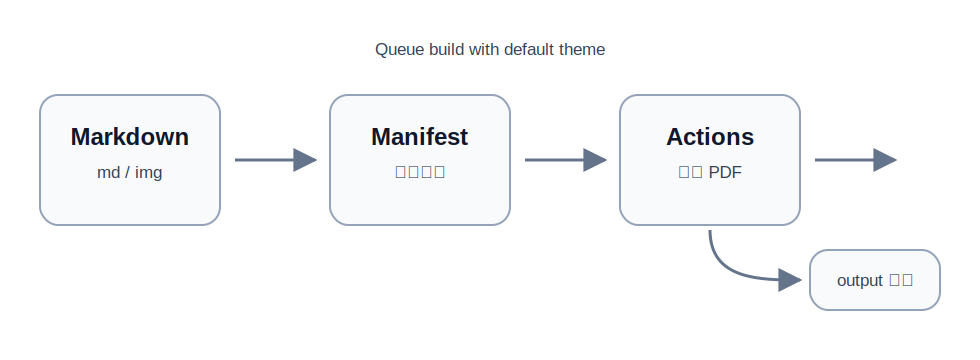

# Markdown 默认主题综合测试

这份文档用于测试 PDF 项目在**默认主题**下对常见 Markdown 内容的渲染效果。内容包含中文、英文、数学公式、表格、任务列表、引用、代码块、Obsidian 风格语法、Callout、图片和分页场景。

## 1. 基础排版

普通段落可以混合 **加粗**、*斜体*、***加粗斜体***、`行内代码`、==高亮文本==，也可以包含链接：https://example.com。

中文段落用于观察行高、字重、段间距和自动换行：前后端协同项目通常包含前端控制台、云函数、数据库、队列、浏览器插件执行器、日志系统和状态机。PDF 样式需要在长文本、短文本和混合标点下保持可读。

### 1.1 列表

无序列表：

- 前端：React、Vite、TypeScript
- 后端：Cloudflare Worker、Hono、Supabase
- 队列：Upstash Redis、QStash
- 输出：PDF、HTML、构建日志

有序列表：

1. 编写 Markdown。
2. 写入 manifest 队列。
3. GitHub Actions 构建 PDF。
4. 发布到 `output` 分支。

任务列表：

- [x] 支持标题和段落
- [x] 支持表格和代码块
- [x] 支持数学公式
- [ ] 继续补充真实项目文档

## 2. 表格

| 模块 | 作用 | 关注点 |
|---|---|---|
| Dashboard | 总览系统状态 | 今日任务、失败率、执行器在线数 |
| Tasks | 管理任务 | 队列、重试、幂等、超时 |
| Events | 记录事件 | 创建、分派、确认、完成 |
| Logs | 排查问题 | 请求 ID、耗时、错误堆栈 |

## 3. 数学公式

行内公式示例：样本均值记为 \( \bar X = \frac{1}{n}\sum_{i=1}^{n}X_i \)，当样本独立同分布时有 \( E(\bar X)=\mu \)。

块级公式示例：

\[
\begin{aligned}
D(\bar X) &= D\left(\frac{1}{n}\sum_{i=1}^{n}X_i\right) \\
&= \frac{1}{n^2}\sum_{i=1}^{n}D(X_i) \\
&= \frac{\sigma^2}{n}.
\end{aligned}
\]

## 4. 引用与 Callout

普通引用：

> 可靠的 PDF 构建流程应该做到：输入明确、构建可复现、输出可检查、失败可追踪。

Obsidian 风格 Callout：

> [!NOTE] 默认主题说明
> 本段用于测试项目对 Callout 的增强渲染。这里没有在 manifest 中手动指定 `theme`，用于验证默认主题是否生效。

> [!WARNING] 注意事项
> 如果图片路径、数学公式或表格样式出现问题，应该优先检查构建日志和输出 HTML。

## 5. 代码块

TypeScript 示例：

```ts
export type TaskStatus = 'queued' | 'running' | 'succeeded' | 'failed';

export interface WorkflowTask {
  id: string;
  title: string;
  status: TaskStatus;
  retryCount: number;
}

export function shouldRetry(task: WorkflowTask): boolean {
  return task.status === 'failed' && task.retryCount < 3;
}
```

SQL 示例：

```sql
create table workflow_events (
  id uuid primary key default gen_random_uuid(),
  task_id uuid not null,
  event_type text not null,
  payload jsonb not null default '{}'::jsonb,
  created_at timestamptz not null default now()
);
```

## 6. 图片与资源路径

下面是一张 SVG 测试图，用于验证 Markdown 图片路径在队列合并构建中能否正确改写。



## 7. 长内容与换页

下面的内容用于观察跨页时标题、段落、表格和代码块是否出现裁切。

### 7.1 项目说明

一个可维护的自动化系统通常需要把“任务状态”和“消息投递”拆开理解。数据库记录的是事实状态，队列负责调度执行，前端实时订阅只能说明“有变化推送出去”，不能证明“用户界面已经收到并处理”。因此，关键状态更新应该由服务端根据幂等键、执行结果和数据库事务来确认。

### 7.2 幂等与确认

为了避免重复执行，可以给任务分配稳定的 `task_id` 和 `idempotency_key`。云函数每次处理前先检查任务当前状态，如果已经是 `succeeded` 或已经存在相同幂等键的结果，就直接返回已有结果，而不是重新执行副作用操作。

### 7.3 小结

- Realtime 适合通知“数据变了”。
- 队列适合保证“任务会被投递和重试”。
- 数据库适合保存“最终状态和幂等记录”。
- PDF 构建适合用 manifest 明确输入、输出、主题和消费策略。
