当前进度：已完成计算机组成原理 PDF 文档第1页至第35页内容。第一章和第二章已按当前源 PDF 可见内容整理完成；已确认 PDF 文档第36页进入第三章，故本 act 正文范围已结束。当前源 PDF 在第一章部分以及第二章后半部分存在印刷页跳页，已按实际可见页面整理，不凭空补写缺失内容。

下次任务：第1章和第2章内容已完成；后续仅需按工作流要求交付本文件夹与压缩包，并进入后续 act。

# 第一章 计算机系统概述

【考纲内容】

（一）计算机系统层次结构

- 计算机系统的基本组成
- 计算机硬件的基本组成
- 计算机软件和硬件的关系
- 计算机系统的工作原理：“存储程序”的方式；高级语言程序与机器语言程序的转换；程序和指令的执行过程

（二）计算机性能指标

- 吞吐量
- 响应时间
- CPU 时钟周期
- 主频
- CPI
- CPU 执行时间
- MIPS
- MFLOPS
- GFLOPS
- TFLOPS
- PFLOPS
- EFLOPS
- ZFLOPS

【复习提示】

本章作为计算机组成原理的概述，旨在建立对计算机系统整体结构与核心概念的初步认识。其中涉及的基本原理与性能指标，是理解后续章节的基础。初学时若对某些概念理解尚浅，无须过度担忧；随着课程的深入，这些知识将在具体上下文中逐渐明晰。

在学习本章时，建议思考以下问题：

1. 主频高的 CPU 一定比主频低的 CPU 性能更高吗？为什么？
2. 翻译程序、汇编程序、编译程序与解释程序有何区别？各自的特征是什么？
3. 不同级别的编程语言所编写的程序有何差异？哪一类语言可被硬件直接执行？

建议在学习过程中尝试回答这些问题，本章末尾将提供参考答案。

## 1.1 计算机发展历程

> 注：加“*”章节表示非统考大纲要求内容或已从统考大纲中删除的内容，仅供学习参考。

### 1.1.1 计算机硬件的发展

1. **计算机的四代变化**

从 1946 年世界上第一台电子数字计算机 ENIAC（Electronic Numerical Integrator And Computer）问世以来，计算机的发展已经历了四代。

1）**第一代计算机（1946—1957 年）——电子管时代。** 其特点是：逻辑元件采用电子管；使用机器语言编程；主存储器采用延迟线或磁鼓，容量极小；体积庞大、成本高昂；运算速度较低，一般仅为每秒几千次至几万次。

2）**第二代计算机（1958—1964 年）——晶体管时代。** 其特点是：逻辑元件采用晶体管；运算速度提升至每秒几万次至几十万次；主存储器使用磁芯存储器；计算机软件开始发展，出现了高级语言及其编译程序，并形成了操作系统的雏形。

3）**第三代计算机（1965—1971 年）——中小规模集成电路时代。** 其特点是：逻辑元件采用中小规模集成电路；半导体存储器逐步取代磁芯存储器；高级语言迅速普及，操作系统进一步成熟，出现了分时操作系统。

4）**第四代计算机（1972 年至今）——超大规模集成电路时代。** 其特点是：逻辑元件采用大规模和超大规模集成电路，微处理器由此诞生；并行处理、流水线、高速缓存和虚拟存储器等关键技术被广泛应用于该代计算机。

2. **计算机元件的更新换代**

1）**摩尔定律。** 在价格不变的前提下，集成电路上可容纳的晶体管数量约每 18 个月翻一番，从而推动性能显著提升。这意味着，18 个月后以相同价格购买的处理器，其理论性能潜力约为当前产品的两倍。这一定律深刻揭示了信息技术的快速发展节奏。

2）**半导体存储器的发展。** 1970 年，美国仙童半导体公司研制出首个较大容量的半导体存储器。此后，单芯片存储容量从 1KB、4KB、16KB、64KB、256KB，逐步发展到 1MB、4MB、16MB、64MB、256MB、1GB，并已进入 TB 级别。

3）**微处理器的发展。** 自 1971 年 Intel 公司推出首款微处理器 Intel 4004 以来，微处理器不断演进，包括 Intel 8008（8 位）、Intel 8086（16 位）、Pentium（32 位）、Core i7（64 位）等。其中，32 位、64 位指的是机器字长（简称字长），即 CPU 通用寄存器的宽度，它决定了单次整数运算可处理的数据位数以及可直接寻址的内存空间大小。

### 1.1.2 计算机软件的发展

计算机软件技术的蓬勃发展，为计算机系统的发展做出了重要贡献。

计算机语言的演进经历了面向机器的机器语言和汇编语言，逐步发展到更接近人类表达方式的高级语言。高级语言极大地推动了软件产业的进步，其中包括用于科学与工程计算的 FORTRAN、支持结构化程序设计的 Pascal、面向对象的 C++，以及具有跨平台特性的 Java 等。

与此同时，各类系统软件也取得了长足进展，对计算机系统的功能完善与高效运行起到了关键作用，其中尤以操作系统为代表，如 Windows、UNIX、Linux 等。

## 1.2 计算机系统层次结构

### 1.2.1 计算机系统的组成

一个完整的计算机系统由硬件与软件组成。硬件指有形的物理装置，即计算机系统中的各类物理部件；软件则是在硬件上运行的程序及其相关的数据与文档。

计算机系统的实际性能，在很大程度上取决于软件对硬件资源的利用效率，而该效率的实现依赖于硬件所提供的能力。因此，计算机系统设计必须合理划分软硬件的功能边界。一般而言，对于使用频繁且硬件实现成本较低的功能，宜由硬件实现，以显著提升整体效率。

### 1.2.2 计算机硬件

1. **冯·诺依曼机的基本思想**

> 考点追踪：冯·诺依曼机的特点（2019）

冯·诺依曼在研究 EDVAC 机时首次提出了“存储程序”的思想，奠定了现代计算机的基本结构。基于这一思想的计算机统称为冯·诺依曼机，其主要特点如下：

1）采用“存储程序”的工作方式：将编制好的程序和初始数据预先存入主存储器，计算机启动后能自动、连续地取指并执行，直至程序结束，无须人工干预。

2）硬件系统由运算器、控制器、存储器、输入设备和输出设备五大部件组成。

3）指令和数据在存储器中以相同形式存放，仅凭内容无法区分，但计算机应能识别它们。

4）指令和数据均采用二进制编码表示。

5）指令由操作码和地址码组成，其中操作码指明操作类型，地址码指出操作数的地址。

2. **计算机的功能部件**

现代计算机将运算器、控制器和各类寄存器高度集成，形成一块称为中央处理器（Central Processing Unit，CPU）的芯片。完整的计算机硬件系统主要包含以下部件：中央处理器、存储器、输入/输出控制器、外部设备，以及用于协调这些部件协同工作的总线。

（1）**中央处理器**

中央处理器（CPU）是计算机系统中负责指令执行的核心部件。其传统基本组成部分为运算器和控制器；在现代处理器架构中，这两部分被系统地组织为数据通路与控制单元。

数据通路是执行实际运算的硬件通路，其核心包括算术逻辑单元（ALU）和通用寄存器组。ALU 负责完成所有算术与逻辑运算；通用寄存器组则为 ALU 提供操作数并暂存运算结果，是实现高速数据访问的关键。此外，数据通路还包含多路选择器、内部互连通路等组件，用于在各个部件间高效传送数据。

控制单元负责协调整个 CPU 的工作。它从存储器中取出指令并译码，随后根据指令语义生成一系列精确的控制信号，指挥数据通路中的各部件（例如，选择源寄存器、配置 ALU 功能、启动运算并在正确时序下完成结果写回），从而确保指令有序、高效地执行。

（2）**存储器**

按访问特性，存储器通常分为内存与外存。现代内存由主存和高速缓存（Cache）组成；但由于 Cache 是后期引入的，传统上“内存”仅指主存。在冯·诺依曼结构中，主存作为核心的工作存储器，用于存放待执行的程序和数据。外存则包括两类：一是可与主存交换数据的磁盘、固态硬盘等，二是用于长期备份的海量存储设备（如磁带、光盘等）。

（3）**外部设备和设备控制器**

外部设备简称外设，也称 I/O 设备（I/O 是 Input/Output 的缩写）。外设通常由物理功能部件（如打印头、鼠标滚轮或按键等）和设备控制器组成，二者在功能或物理实现上往往相互分离：前者负责实际的输入/输出操作，后者则负责与主机通信并控制前者的工作。

外设通过设备控制器连接到主机上，各种设备控制器统称 I/O 控制器或 I/O 接口。例如，键盘接口、显示控制器（简称显卡）、网络控制器（简称网卡）等都是设备控制器。

（4）**总线**

总线是计算机中用于在各个部件之间传输信息的公共通路。CPU、主存和 I/O 接口通过总线互连；其中，CPU 和 I/O 接口内部均包含寄存器，部分还集成了高速缓存。

图 1.1 展示了一个典型的多总线计算机硬件系统。CPU 作为核心，内含控制器、ALU、寄存器堆和总线接口部件。CPU 通过处理器总线，并经由 I/O 桥接器与主存和 I/O 设备通信；主存通过存储器总线，并经由 I/O 桥接器与 CPU 和 I/O 设备相连；各类 I/O 设备则通过其控制器（如 USB 控制器、显示适配器）接入 I/O 总线。按功能划分，ALU 属于数据处理部件，负责对寄存器中的数据进行运算；主存和磁盘属于存储部件，分别承担临时存储与长期存储任务；而所有总线、桥接器、接口及控制器共同构成系统的互连结构，负责全系统的数据传输与协调。

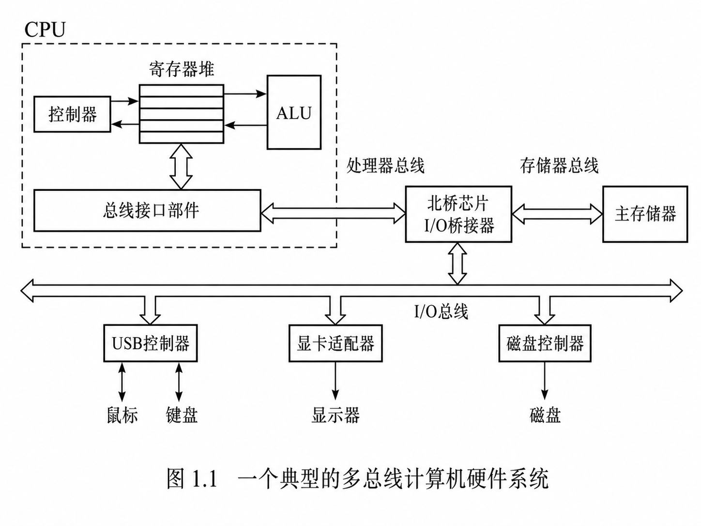

### 1.2.3 计算机软件

1. **系统软件和应用软件**

软件按其功能可分为系统软件和应用软件。

系统软件是一组保障计算机系统高效、正确运行的基础软件，用于管理和调度系统资源，为用户及应用程序提供基础服务。典型的系统软件包括：操作系统（OS）、数据库管理系统（DBMS）、语言处理程序、网络与分布式软件系统、标准库程序、服务性程序等。

应用软件是指用户为解决特定应用领域问题而开发的程序，例如科学计算、工程设计、数据统计与信息处理等领域的专用软件。

2. **软件和硬件的逻辑功能等价性**

在计算机中，最基本的操作（如算术与逻辑运算）通常由硬件直接实现，而更复杂的功能则可由软件完成。对于某一特定功能，既可采用硬件实现，又可通过软件实现；从用户视角看，在相同规范下，二者在逻辑功能上是等价的。这一性质称为软/硬件逻辑功能的等价性。

例如，浮点运算既可由专用浮点运算器硬件实现，又可通过软件子程序模拟；在相同输入和数值规范（如 IEEE 754）下，二者产生一致的数值结果，但硬件实现的效率通常远高于软件。

软/硬件逻辑功能的等价性是计算机系统设计的重要依据。如何合理划分软/硬件的功能边界，是计算机体系结构研究的核心问题之一。在系统设计过程中，必须综合考虑设计目标、成本效益与技术可行性等因素，明确哪些功能由硬件承担，哪些功能由软件实现。

### 1.2.4 计算机系统的层次结构

如图 1.2 所示，计算机系统采用多级层次结构，通过逐层抽象隔离复杂的硬件实现与高层应用需求。从用户的应用问题到物理器件，每层都向上提供简洁的接口，向下依赖更底层的功能实现。这种分层设计不仅明确了软/硬件的职责边界，还使系统开发和维护得以并行高效进行。

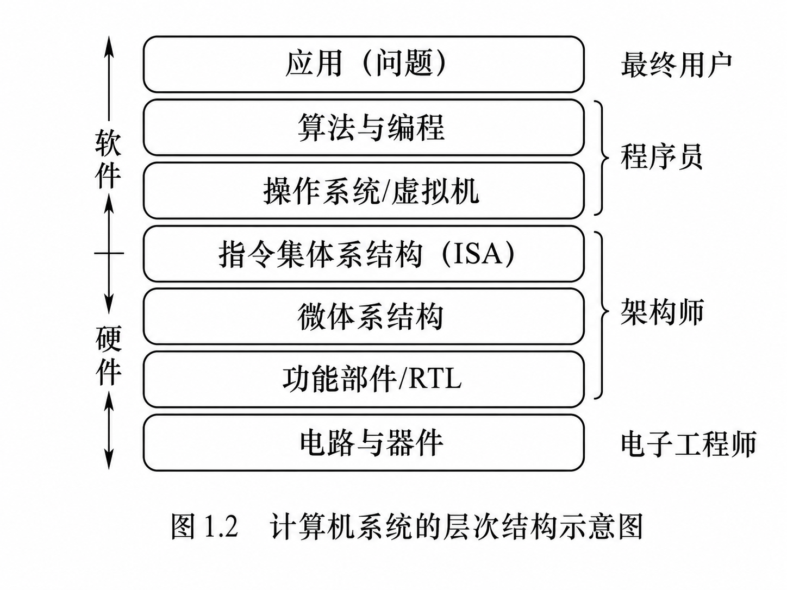

1. **算法和编程**

解决应用问题需要先将其抽象为一个正确的算法描述。随后，程序员将该算法用编程语言编写成程序。与自然语言不同，编程语言语法严谨、无二义性，能够精确描述计算机的执行顺序。

（1）**编程语言**

编程语言可分为高级语言与低级语言。高级语言独立于计算机底层硬件结构，是主流软件开发语言；低级语言则紧密依赖机器结构，特指机器语言及其符号化形式——汇编语言。

> 考点追踪：三种编程语言的特点（2015、2024）

1）**机器语言。** 又称二进制代码语言，由 0 和 1 组成的指令序列构成。程序员需要熟记每条指令的二进制编码。它是计算机唯一能直接识别和执行的语言。

2）**汇编语言。** 采用英文助记符（如 mov、add）或其缩写代替二进制指令，显著提升了可读性与记忆性。但汇编程序不能被硬件直接执行，必须通过一个称为汇编程序的系统软件的翻译，将其转换为机器语言程序后，才能在计算机上运行。

3）**高级语言。** 如 C、C++、Java 等，允许程序员以接近自然语言的方式描述问题求解过程，极大提高了开发效率。高级语言程序通常需经编译程序处理：或先编译为汇编语言，再经汇编生成机器语言；或直接编译为目标机器的机器语言程序。

（2）**翻译程序**

> 考点追踪：各种翻译程序的概念（2016）

高级语言源程序必须转换为机器语言程序才能被计算机直接执行，用于完成该转换的系统软件称为翻译程序。转换后生成的程序称为目标程序。翻译程序主要分为以下三类：

1）**汇编程序（汇编器）：** 将汇编语言源程序翻译为机器语言目标程序。

2）**解释程序（解释器）：** 逐条翻译并立即执行高级语言源程序语句，不生成独立的目标程序。

3）**编译程序（编译器）：** 将高级语言源程序一次性翻译为汇编语言或机器语言目标程序。

2. **操作系统**

所有的语言处理系统都必须在操作系统提供的运行环境中执行；操作系统通过对计算机硬件及其底层结构的抽象，构建出一台可供程序员使用的虚拟机。

3. **指令集体系结构**

指令集体系结构（Instruction Set Architecture，ISA）是计算机软件/硬件之间的关键接口，它从程序员和编译器的视角，完整地定义了软件可直接使用的硬件功能。主要包括：指令格式、操作类型、寻址方式，以及可访问的寄存器等硬件资源。

因此，ISA 构成了软件所能“感知”到的计算机功能视图，也被称为软件可见部分。我们编写的机器语言程序，本质上就是一串严格遵循该 ISA 规定的指令序列；而硬件执行程序的过程，就是逐条解释并完成这些指令所规定操作的过程。

4. **微体系结构**

微体系结构（又称微架构）是处理器内部的硬件组织方式，用于实现 ISA 定义的功能。若说 ISA 定义了处理器“做什么”，那么微体系结构就决定了处理器“怎么做”。其核心设计包括数据通路组织、控制单元实现、流水线级数、缓存层次结构以及分支预测机制等。

例如，加法操作既可以通过串行进位加法器实现，也可以通过超前进位加法器实现，甚至可以借助专用 SIMD 单元实现。这些都属于微体系结构的范畴。相同 ISA 可对应多种不同的微构架。以 Intel x86 为例，不同代际的处理器（如 Core、Skylake、Alder Lake）通常遵循同一套 ISA 规范，但内部组织方式差异明显，这体现了微架构的多样性与演进性。

### 1.2.5 计算机系统的不同用户

根据用户使用计算机完成任务的性质，可将用户划分为以下四类角色。

1. **最终用户**：直接操作应用程序完成特定任务的人员，如使用办公软件、浏览网页等的人。他们通过操作系统提供的界面与计算机交互，无须了解底层技术细节。

2. **系统管理员**：负责配置、管理和维护计算机系统，确保系统稳定高效运行的人员。主要职责包括安装软/硬件、管理用户账户、数据备份与系统升级等。

3. **应用程序员**：使用高级语言开发应用软件，以满足最终用户在办公、娱乐等领域特定需求的人员。

4. **系统程序员**：设计并开发操作系统、编译器、数据库管理系统等核心系统软件的人员。

在实际使用中，同一用户可能在不同场景下承担多种角色。例如，一名计算机专业的学生：网上购物时是最终用户，管理磁盘和备份数据时是系统管理员，编写应用程序作业时是应用程序员，参与操作系统开发时则是系统程序员。

计算机系统采用层次化结构构建，不同用户正是依据各自角色工作在系统相应的抽象层级之上。图 1.3 展示了计算机系统的层次与各层用户。

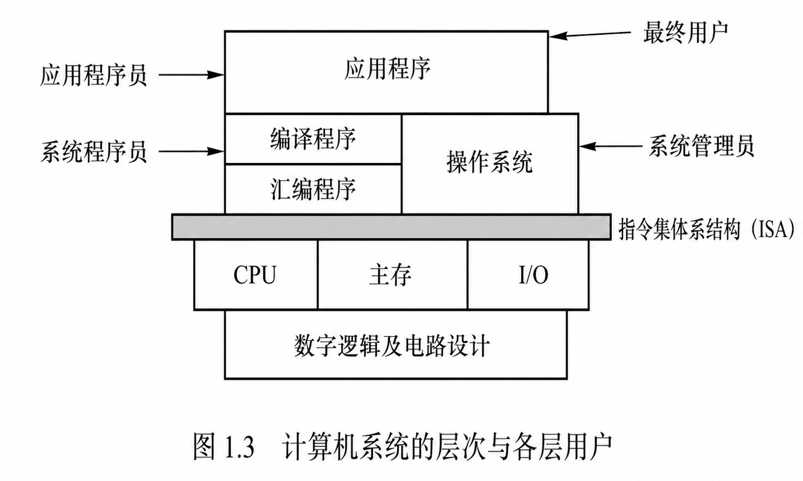

指令集体系结构（ISA）位于计算机软/硬件的交界处，是硬件功能的集中体现，也是软件执行的基础。ISA 以下为硬件层，包括 CPU、主存和 I/O 设备等物理组件；ISA 以上为软件层，涵盖系统软件与应用软件。不同用户工作在以 ISA 为基础逐层构建的抽象层次上。

系统程序员工作在机器语言层面，直接面向 ISA；系统管理员工作在操作系统层面；应用程序员（高级语言程序员）工作在高级语言层面；最终用户通过应用程序完成任务，处于最上层。在计算机系统中，下层机器的结构特性对上层用户通常是“透明”的。例如，ISA 之下的硬件实现细节对高级语言程序员是透明的，他们无须了解底层机制即可进行开发。

### 1.2.6 计算机系统的工作原理

1. **“存储程序”工作方式**

“存储程序”工作方式规定：在程序执行前，需将其包含的指令和数据预先加载到主存储器中；一旦启动，计算机便无须人工干预，自动逐条取出并执行指令。程序的执行是一个周而复始的指令执行过程。每条指令的执行通常包括以下步骤：从主存储器中取指令（地址由程序计数器 PC 提供）、对指令译码、取操作数、执行操作，并将结果写回存储器。

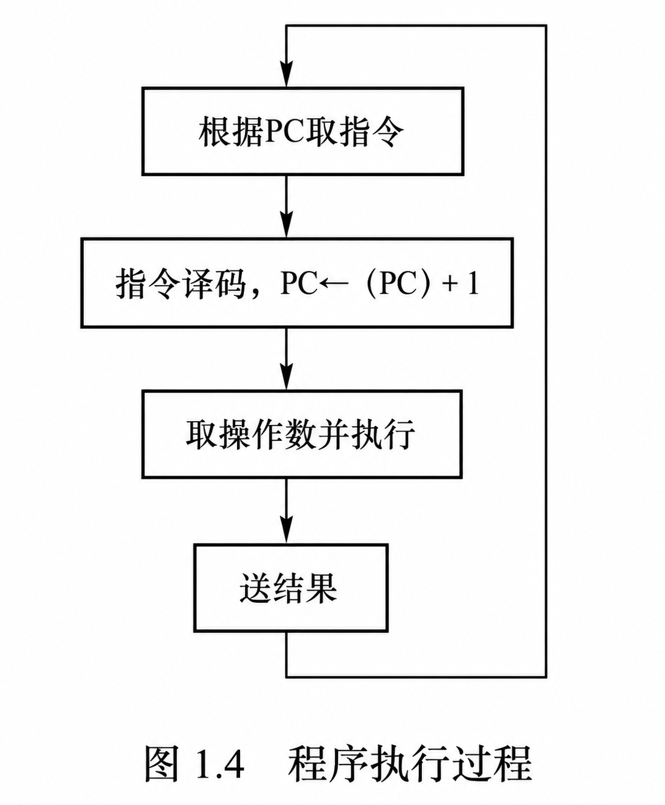

程序开始执行前，先将第一条指令的地址存入程序计数器（PC）。取指令时，CPU 使用 PC 的内容作为地址访问主存储器。在每条指令执行的最后阶段，系统根据指令类型更新 PC：

- 若为顺序指令，则下一条指令地址为当前 PC 值加上指令长度；
- 若为跳转指令，则下一条指令地址为指令中指定的目标地址。

随后，CPU 根据更新后的 PC 从主存储器中取出下一条待执行的指令，从而实现指令流的自动连续执行。

2. **从源程序到可执行文件**

> 考点追踪：翻译过程的四个阶段（2022）

在计算机中编写的 C 语言程序，必须经过编译与链接过程，转换为一系列低级机器指令，并按特定格式封装为可执行目标文件，最终以二进制形式存储于磁盘。以 UNIX 系统中的 GCC 编译器为例，给定源程序文件 hello.c，系统通过四个阶段生成可执行文件 hello，如图 1.5 所示。

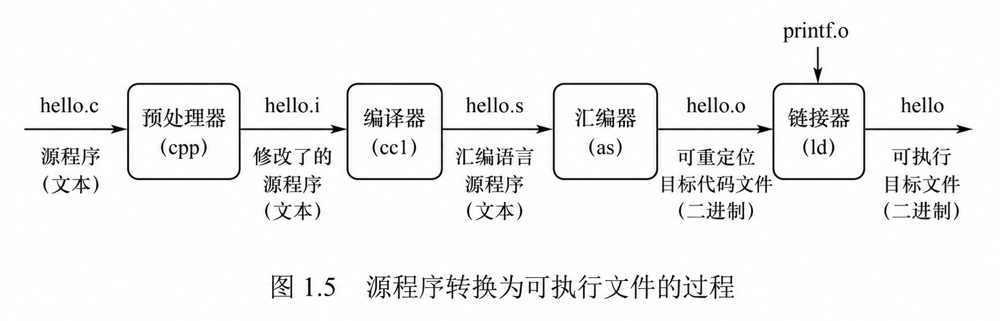

1）**预处理阶段**：预处理器（cpp）处理源文件中以 # 开头的预处理指令，如将 `#include <stdio.h>` 替换为对应头文件的完整内容，生成预处理后的 C 文件 hello.i。

2）**编译阶段**：编译器（cc1）将 hello.i 翻译为汇编程序 hello.s，其中每条语句以文本形式描述一条低级机器指令。

3）**汇编阶段**：汇编器（as）将 hello.s 转换为机器语言指令，生成可重定位目标文件 hello.o。

4）**链接阶段**：链接器（ld）将 hello.o 与所需的其他目标文件或库文件（如 printf.o）合并，完成地址重定位与符号解析，最终生成可执行目标文件 hello。

## 1.3 计算机性能指标

### 1.3.1 常用性能指标与相关计算

当前源 PDF 的文档第8页直接进入性能指标的后半部分，可见内容从 IPS、CPU 执行时间、MIPS、FLOPS 与基准程序开始。

1. **IPS**

IPS（Instructions Per Second）表示每秒执行多少条指令，其计算式为：

\[
\mathrm{IPS}=\frac{\text{主频}}{\text{平均 CPI}}
\]

2. **CPU 执行时间**

CPU 执行时间表示运行一个程序所花费的时间。

> 考点追踪：CPU 执行时间的相关计算（2012、2013、2014、2017、2022、2023）

CPU 执行时间可表示为：

\[
\text{CPU 执行时间}=\frac{\text{CPU 时钟周期数}}{\text{主频}}=\frac{\text{指令条数}\times \mathrm{CPI}}{\text{主频}}
\]

上式表明，若用执行时间衡量 CPU 性能，则 CPU 性能取决于三个因素：**指令条数、CPI 和主频**。三者之间存在制约关系。例如，采用更复杂的指令集（如 CISC）可能会减少程序所需的指令条数，但往往导致 CPU 控制逻辑更复杂，从而延长时钟周期、限制主频提升。反之，精简指令集（如 RISC）虽然可能会增加程序所需的指令条数，但有助于缩短时钟周期、提高主频。

【例 1.1】假定计算机 M1 和 M2 具有相同的指令集体系结构，M1 的主频为 2GHz，程序 P 在 M1 上的运行时间为 10s。M2 采用新技术可使主频大幅提升，但其平均 CPI 也增加到 M1 的 1.5 倍。问 M2 的主频至少提升到多少，才能使程序 P 在 M2 上的运行时间缩短为 6s？

解：

程序 P 在 M1 上的时钟周期数为：

\[
10\text{s}\times 2\text{GHz}=2\times 10^{10}
\]

M2 的平均 CPI 为 M1 的 1.5 倍，因此程序 P 在 M2 上的时钟周期数为：

\[
1.5\times 2\times 10^{10}=3\times 10^{10}
\]

若程序 P 在 M2 上的运行时间为 6s，则 M2 所需主频至少为：

\[
\frac{3\times 10^{10}}{6\text{s}}=5\text{GHz}
\]

因此，M2 的主频需要达到 M1 的 2.5 倍，但程序实际运行时间仅由 10s 缩短为 6s，性能提升为 M1 的约 1.67 倍。

3. **MIPS**

MIPS（Million Instructions Per Second）表示每秒执行多少百万条指令。

> 考点追踪：MIPS 相关的计算（2012、2013）

\[
\mathrm{MIPS}=\frac{\text{指令条数}}{\text{CPU 执行时间}\times 10^6}=\frac{\text{主频}}{\mathrm{CPI}\times 10^6}
\]

MIPS 用于不同机器间的性能比较时存在明显缺陷：不同机器的指令集架构各异，指令功能强度往往不同。例如，M1 中一条指令完成的操作，在 M2 上可能需要多条指令实现；同时，各机器的 CPI 与时钟周期也不同，导致同一条指令的实际执行时间差异明显。

4. **FLOPS**

FLOPS（Floating-point Operations Per Second）表示每秒执行的浮点运算次数。

> 考点追踪：浮点运算指标的概念（2011、2021）

- MFLOPS（Million FLOPS）：百万（\(10^6\)）次浮点运算/秒。
- GFLOPS（Giga FLOPS）：十亿（\(10^9\)）次浮点运算/秒。
- TFLOPS（Tera FLOPS）：万亿（\(10^{12}\)）次浮点运算/秒。
- PFLOPS（Peta FLOPS）：千万亿（\(10^{15}\)）次浮点运算/秒。
- EFLOPS（Exa FLOPS）：百亿亿（\(10^{18}\)）次浮点运算/秒。
- ZFLOPS（Zetta FLOPS）：十万亿亿（\(10^{21}\)）次浮点运算/秒。

> 注意：在描述存储容量、文件大小等时，K、M、G、T 通常基于 2 的幂次，例如 \(1\mathrm{KB}=2^{10}\mathrm{B}\)；而在描述速率、频率等时，K、M、G、T 通常基于 10 的幂次，例如 \(1\mathrm{kb/s}=10^3\mathrm{b/s}\)。习惯上，前者用大写 K，后者用小写 k；其他前缀（M、G 等）均为大写，具体含义需结合上下文判断。

5. **基准程序**

基准程序（Benchmarks）是一组专门用于性能评测的典型程序，旨在模拟真实应用场景下的负载，从而较为准确地反映系统在实际使用中的运行效率。当前源 PDF 本页在“通过在不同机器上运行相同的基准程……”处截断，后续内容未在当前 PDF 的连续页面中出现。

## 1.4 本章小结及疑难点

### 1.4.1 翻译程序、汇编程序、编译程序和解释程序

当前源 PDF 的文档第9页为第一章末尾的疑难点说明，但该页开头承接了前一缺失页内容。可见内容要点如下。

编译程序将高级语言源程序一次性全部翻译为目标程序（如机器码或汇编代码），生成可独立执行的文件；源程序不变时，无须重复编译。

解释程序逐条读取源程序语句，将其翻译成机器指令并立即执行，通常不生成可存储的目标程序，其执行过程是“边翻译边执行”。

汇编程序是一种特殊的翻译程序，它将汇编语言源程序翻译为机器语言程序。

编译程序与汇编程序的区别在于：若源语言为高级语言（如 C、Java），目标语言为低级语言（如汇编语言或机器语言），则称为编译程序；若源语言为汇编语言，目标语言为机器语言，则称为汇编程序。

### 1.4.2 什么是透明性

透明性并不是指“什么都能看见”。在计算机领域，透明性是指从某类用户的视角无法感知某一事物或属性的存在，这与日常生活中“透明可见”的含义恰好相反。

例如，对高级语言程序员而言，指令的格式、机器结构、数据格式等都是透明的；而对汇编语言或机器语言程序员而言，这些细节则不是透明的。CPU 中的指令寄存器（IR）、存储器地址寄存器（MAR）和存储器数据寄存器（MDR），对所有程序员均透明。

### 1.4.3 计算机体系结构和计算机组成的区别与联系

计算机体系结构是指程序员可见的机器属性，包括指令集、数据类型、寻址方式等，属于抽象层面的定义。

计算机组成则是体系结构的具体实现，涉及硬件如何完成取指、译码、执行等操作，包含大量对程序员透明的细节。例如，是否提供乘法指令属于体系结构问题；而采用何种电路（如阵列乘法器或移位相加）实现该指令，则属于组成问题。

因此，两台机器可以具有相同体系结构，但组成方式不同，从而在性能与成本上呈现显著差异。

### 1.4.4 基准程序执行得越快说明机器的性能越好吗

一般而言，基准程序的执行速度可以反映机器性能；但单一程序通常只覆盖特定工作负载，难以全面代表系统整体性能，因为不同程序对计算、访存、I/O 等资源的需求各异。

# 第二章 数据的表示和运算

【考纲内容】

（一）数制与编码

- 进位计数制及其相互转换
- 定点数的编码表示

（二）运算方法和运算电路

- 基本运算部件：加法器；算术逻辑单元（ALU）
- 加/减运算：补码加/减运算器；标志位的生成
- 乘/除运算：乘/除运算的基本原理；乘法电路和除法电路的基本结构

（三）整数的表示和运算

- 无符号整数的表示和运算
- 有符号整数的表示和运算

（四）浮点数的表示和运算

- 浮点数的表示
- IEEE 754 标准
- 浮点数的加/减运算

【复习提示】

本章内容较为繁杂。由于计算机采用二进制表示数据，其表示与运算机制不同于日常使用的十进制，理解起来有一定难度。纵观历年统考真题，C 语言中 unsigned、short、int、long、float、double 等基本数据类型的表示范围、运算规则、溢出判断，以及类型转换、IEEE 754 浮点数的表示、特点与加减运算，均为考查重点，需要牢固掌握。

学习本章时，建议思考以下问题：

1. 在计算机中，为什么要采用二进制来表示数据？
2. 计算机在字长足够的情况下，是否能够精确表示整个数轴？若不能，请举例说明。
3. 字长相同的情况下，浮点数和定点数的表示范围与精度有什么区别？
4. 用移码表示浮点数的阶码有什么好处？

建议在学习过程中尝试回答这些问题，本章末尾将提供参考答案。

## 2.1 数制与编码

### 2.1.1 进位计数制及其相互转换

> 考点追踪：采用二进制编码的原因（2018）

在计算机系统内部，所有信息均采用二进制进行编码，主要原因如下：

1. 二进制只有两个状态，只需使用具有两种稳定物理状态的器件即可表示每一位，硬件实现成本较低。例如，可用高电平和低电平分别表示 1 和 0。
2. 二进制的 1 和 0 恰好对应逻辑值“真”和“假”，为计算机实现逻辑运算和程序中的条件判断提供了直接支持。
3. 二进制的运算规则极为简单，可通过基本的逻辑门电路高效实现各类算术与逻辑操作。

1. **进位计数制**

常用的进位计数制包括十进制、二进制、八进制和十六进制。十进制是日常生活中最常用的计数制，而计算机内部主要使用二进制，并常借助八进制和十六进制来简化表示。

在进位计数制中，基数是指每个数位所能使用的不同数码的个数。例如，十进制的基数为 10，数码为 0～9，计数时遵循“逢十进一”的规则。以十进制数 101 为例，百位的 1 表示 100，个位的 1 表示 1，二者数值不同，是因为每一位的实际值等于该数码乘以其所在位置的位权。

一个进制数的数值，等于各数码与其对应位权的乘积之和。一个 \(r\) 进制数

\[
( K_nK_{n-1}\cdots K_0K_{-1}\cdots K_{-m})_r
\]

的数值可表示为：

\[
K_n r^n+K_{n-1}r^{n-1}+\cdots+K_0r^0+K_{-1}r^{-1}+\cdots+K_{-m}r^{-m}
=\sum_{i=-m}^{n}K_i r^i
\]

其中，\(r\) 是基数，\(r^i\) 是第 \(i\) 位的位权，\(K_i\) 是第 \(i\) 位的数码，取值范围为 \(0,1,\ldots,r-1\)。

常见进制的特点如下：

| 进制 | 基数 | 数码 | 进位规则 | 典型标记 |
|---|---:|---|---|---|
| 二进制 | 2 | 0、1 | 逢二进一 | 后缀 B |
| 八进制 | 8 | 0～7 | 逢八进一 | 后缀 O |
| 十进制 | 10 | 0～9 | 逢十进一 | 后缀 D，通常省略 |
| 十六进制 | 16 | 0～9、A～F，其中 A～F 表示 10～15 | 逢十六进一 | 后缀 H，或前缀 0x |

由于 \(8=2^3\)，每 3 位二进制数恰好对应 1 位八进制数；由于 \(16=2^4\)，每 4 位二进制数恰好对应 1 位十六进制数。因此，二进制与八进制、十六进制之间的转换十分方便。

2. **不同进制数之间的相互转换**

（1）**二进制数转换为八进制数和十六进制数**

对于一个既有整数部分又有小数部分的二进制数，转换时以小数点为界分别处理：

- 整数部分：从小数点向左分组。转八进制时每 3 位一组，转十六进制时每 4 位一组。若最左侧不足 3 位或 4 位，则在高位补 0。
- 小数部分：从小数点向右分组。转八进制时每 3 位一组，转十六进制时每 4 位一组。若最右侧不足 3 位或 4 位，则在低位补 0。
- 分组完成后，将每组二进制数直接转换为对应的八进制或十六进制数码即可。

【例 2.1】将二进制数 \((1111000010.01101)_2\) 转换为八进制数和十六进制数。

解：

转换为八进制时，每 3 位分为一组：

```text
二进制：001 111 000 010 . 011 010
八进制：  1   7   0   2 .   3   2
```

因此，

\[
(1111000010.01101)_2=(1702.32)_8
\]

转换为十六进制时，每 4 位分为一组：

```text
二进制：0011 1100 0010 . 0110 1000
十六进制：  3    C    2 .   6    8
```

因此，

\[
(1111000010.01101)_2=(3C2.68)_{16}
\]

反过来，将八进制数或十六进制数转换为二进制数时，只需将每位数码分别转换为对应的 3 位或 4 位二进制数；必要时应去掉整数最高位或小数最低位无意义的 0。八进制数与十六进制数之间的转换通常先转换为二进制数，再转换为目标进制，这是最直接且不易出错的方法。

（2）**任意进制数转换为十进制数**

任意进制数转换为十进制数，可采用按权展开相加法：将各位数码与其对应位权相乘，再求和。

例如，

\[
(11011.1)_2=1\times 2^4+1\times 2^3+0\times 2^2+1\times 2^1+1\times 2^0+1\times 2^{-1}=27.5
\]

（3）**十进制数转换为任意进制数**

> 考点追踪：十进制小数转换为二进制小数（2021、2022）

通常采用基数乘除法，并对整数部分和小数部分分别处理：

1. 整数部分使用**除基取余法**：不断除以目标进制的基数，记录余数，直到商为 0；最先得到的余数为最低位，最后得到的余数为最高位。
2. 小数部分使用**乘基取整法**：不断乘以目标进制的基数，记录整数部分，直到小数部分为 0 或达到所需精度；最先得到的整数为最高位，最后得到的整数为最低位。
3. 最终将两部分转换结果拼接，即得到目标进制数。

【例 2.2】将十进制数 123.6875 转换为二进制数。

解：

整数部分使用除 2 取余法：

```text
123 ÷ 2 = 61  余 1  ← 最低位
 61 ÷ 2 = 30  余 1
 30 ÷ 2 = 15  余 0
 15 ÷ 2 =  7  余 1
  7 ÷ 2 =  3  余 1
  3 ÷ 2 =  1  余 1
  1 ÷ 2 =  0  余 1  ← 最高位
```

因此，整数部分 \(123=(1111011)_2\)。

小数部分使用乘 2 取整法：

```text
0.6875 × 2 = 1.3750  取整 1  ← 最高位
0.3750 × 2 = 0.7500  取整 0
0.7500 × 2 = 1.5000  取整 1
0.5000 × 2 = 1.0000  取整 1  ← 最低位
```

因此，小数部分 \(0.6875=(0.1011)_2\)。最终得到：

\[
123.6875=(1111011.1011)_2
\]

> 注意：关于除基取余法和乘基取整法，建议结合 \(r\) 进制数的数值定义公式理解，避免死记硬背。并非所有十进制小数都能用有限位二进制小数精确表示。一个十进制小数能被有限位二进制小数精确表示，当且仅当它可以表示成 \(k/2^n\) 的形式。例如，\(0.3=3/10\)，而 \(10\) 不是 2 的幂（其质因数包含 5），因此无法用有限位二进制小数精确表示。相反，任何有限二进制小数都对应一个分母为 2 的幂的分数，因此总能精确地转换为十进制小数。这一特性在浮点数的表示与运算中尤为重要。

### 2.1.2 定点数的编码表示

1. **真值和机器数**

在日常生活中，数值通常用“+”或“-”号表示正负（正号常省略），如 +15、-8。这类带有符号的数称为**真值**，即机器数所代表的实际数值。

在计算机中，数的符号与数值部分需要统一编码。通常用 0 表示正，用 1 表示负。这种将符号数字化后的编码表示形式称为**机器数**。

例如，机器数 0,101（逗号仅用于分隔符号位和数值位）表示真值 +5。

2. **机器数的定点表示**

根据小数点位置是否固定，计算机中的数值表示可分为定点表示和浮点表示。本节讨论定点表示。

定点表示用于表示定点小数和定点整数：

1）**定点小数**：约定小数点固定在符号位之后、数值部分最高位之前。若数据

\[
X=x_0.x_1x_2\cdots x_n
\]

其中，\(x_0\) 为符号位，\(x_1\sim x_n\) 为数值位，\(x_1\) 为最高有效位，则其表示形式如图 2.1 所示。

2）**定点整数**：约定小数点固定在数值部分最低位之后。若数据

\[
X=x_0x_1x_2\cdots x_n
\]

其中，\(x_0\) 为符号位，\(x_1\sim x_n\) 为数值位，\(x_n\) 为最低有效位，则其表示形式如图 2.2 所示。

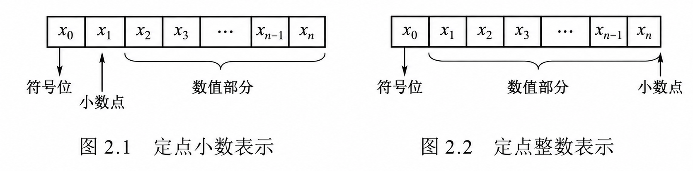

事实上，在机器内部并没有真正的小数点，只是人为约定了小数点的位置。因此，在定点数的编码和运算中，无须区分该数表示小数还是整数，只需关注符号位和数值位即可。

定点数的编码表示法主要有四种：**原码、补码、反码和移码**。

3. **原码、补码、反码、移码**

（1）**原码表示法**

原码用机器数的最高位表示数的符号，其余各位表示数的绝对值。若字长为 \(n+1\)，则原码定义为：

\[
[x]_{原}=\begin{cases}
0,x, & 0\le x<2^n \\
2^n-x=2^n+|x|, & -2^n<x\le 0
\end{cases}
\]

其中，\(x\) 为真值，字长为 \(n+1\)。

例如，若字长为 8 位，\(x_1=+1110\)，\(x_2=-1110\)，则：

\[
[x_1]_{原}=0,0001110
\]

\[
[x_2]_{原}=2^7+1110=1,0001110
\]

对于 \(n+1\) 位原码整数，其表示范围为：

\[
-(2^n-1)\le x\le 2^n-1
\]

即原码的整数表示范围关于原点对称。

> 注意：零的原码表示有正零和负零两种形式，即 \([+0]_{原}=0,0000000\)，\([-0]_{原}=1,0000000\)。

原码的优点是：与真值的对应关系简单、直观，转换方便；用原码实现乘除运算比较方便。

原码的缺点是：零的表示不唯一，存在 \(+0\) 和 \(-0\) 两种编码；用原码实现加减运算比较复杂。

（2）**补码表示法**

补码表示法的加法和减法运算均可通过加法统一实现。正数的补码与原码相同；负数的补码等于模（\(n+1\) 位补码的模为 \(2^{n+1}\)）与该负数绝对值之差。补码定义为：

\[
[x]_{补}=\begin{cases}
0,x, & 0\le x<2^n \\
2^{n+1}+x=2^{n+1}-|x|, & -2^n\le x<0
\end{cases}\pmod{2^{n+1}}
\]

等价地，无论 \(x\) 是正数还是负数，都可写成：

\[
[x]_{补}=2^{n+1}+x\quad (-2^n\le x<2^n,\ \bmod\ 2^{n+1})
\]

例如，若字长为 8 位，\(x_1=+1010\)，\(x_2=-1101\)，则：

\[
[x_1]_{补}=0,0001010
\]

\[
[x_2]_{补}=2^8-|x_2|=1,1110011
\]

> 考点追踪：补码的表示范围（2010、2013、2014、2022）

对于 \(n+1\) 位补码整数，其表示范围为：

\[
-2^n\le x\le 2^n-1
\]

补码比原码多表示一个负数，即 \(-2^n\)。

几个特殊值的 \(n+1\) 位补码如下：

1）\([+0]_{补}=[-0]_{补}=0,00\cdots0\)（全 0），零的补码表示是唯一的。

2）\([-1]_{补}=2^{n+1}-1=1,11\cdots1\)（全 1）。

3）最大正整数：\([2^n-1]_{补}=0,11\cdots1\)（符号位为 0，数值位全 1）。

4）最小负整数：\([-2^n]_{补}=1,00\cdots0\)（符号位为 1，数值位全 0）。

**模运算。** 在模运算中，一个数与它除以“模”后得到的余数是等价的。如 \(A\)、\(B\)、\(M\) 满足

\[
A=B+K\times M
\]

其中 \(K\) 为整数，则记为：

\[
A\equiv B\pmod M
\]

即 \(A\)、\(B\) 除以 \(M\) 后的余数相同。在补码运算中：

\[
[A]_{补}-[B]_{补}=[A]_{补}+M-[B]_{补}
\]

而

\[
M-[B]_{补}=[-B]_{补}
\]

因此，补码能够借助加法运算实现减法运算。

> 考点追踪：补码和真值的相互转换（2020、2023）

**真值转换为补码：** 对于正数，与原码的方式一样；对于负数，符号位取 1，其余各位由其绝对值“按位取反，末位加 1”得到。

**补码转换为真值：** 若符号位为 0，则直接读作正数；若符号位为 1，则真值为负数，其绝对值由补码数值部分“按位取反，末位加 1”得到。

**变形补码。** 为便于溢出检测，可采用双符号位的补码表示，又称变形补码。双符号位中，00 表示正数，11 表示负数。若总位数为 \(n+2\)（高 2 位为符号位，其余为数值位），则变形补码定义为：

\[
[x]_{变补}=\begin{cases}
00,x, & 0\le x<2^n \\
2^{n+2}+x=2^{n+2}-|x|, & -2^n\le x<0
\end{cases}\pmod{2^{n+2}}
\]

在双符号位中，左符表示真正的符号位，右符用于判断“溢出”。

（3）**反码表示法**

反码可视为从原码转换为补码的中间表示形式。正数的反码与其原码相同；负数的反码由其原码的数值部分按位取反（末位不加 1）得到。

反码的不足很明显：零的表示不唯一，存在 \(+0\) 和 \(-0\) 两种编码；表示范围与相同字长的原码相同，比补码少一个最小负数 \(-2^n\)。因此，反码在计算机中极少使用。

（4）**移码表示法**

移码主要用于表示浮点数的阶码，也可用于表示整数。其核心思想是将真值 \(x\) 加上一个固定偏置值，使数轴整体右移。设字长为 \(n+1\) 位，偏置值通常取 \(2^n\)，则移码定义为：

\[
[x]_{移}=2^n+x\quad (-2^n\le x<2^n)
\]

> 注意：在 IEEE 754 标准的浮点数中，\(k\) 位阶码的偏置值为 \(2^{k-1}-1\)，如 8 位阶码的偏置值为 127。

例如，若字长为 8 位，偏置值为 \(2^7\)，\(x_1=+10101\)，\(x_2=-10101\)，则：

\[
[x_1]_{移}=2^7+10101=1,0010101
\]

\[
[x_2]_{移}=2^7+(-10101)=0,1101011
\]

移码（设字长为 \(n+1\)，偏置值为 \(2^n\)）的主要特点如下：

1）零的表示唯一：\([+0]_{移}=[-0]_{移}=2^n+0=1,00\cdots0\)（\(n\) 个 0）。

2）在相同字长下，移码与补码仅符号位相反，即将补码的最高位取反即可得到移码。

3）移码全 0 时，对应真值的最小值 \(-2^n\)；移码全 1 时，对应真值的最大值 \(2^n-1\)。

4）移码保持真值大小顺序：移码值越大，对应真值越大，便于阶码比较。

四种编码表示的总结如下：

1）正数的原码、反码、补码相同；移码则不同。

2）原码与反码在数轴上关于原点对称，二者都存在 \(+0\) 与 \(-0\)。

3）补码与移码的表示不对称，零的表示唯一，并且比原码和反码多表示一个负数 \(-2^n\)。

4）原码可直观比较大小，因为其数值部分即绝对值；而负数的补码和反码不能像原码那样直观判断。不过，在同为负数的前提下，补码或反码的数值部分越大，其真值也越大。

### 2.1.3 整数的表示

1. **无符号整数的表示**

> 考点追踪：机器码与补码、无符号数之间的转换（2021）

当所有二进制位均用于表示数值（无符号位）时，该编码称为无符号整数，简称无符号数。此时，数值隐含为非负整数。

由于无须保留符号位，在相同字长下，无符号整数能表示的最大值大于有符号整数。无符号整数适用于仅涉及非负整数且结果不会产生负值的场景，例如地址运算或指针表示。

例如，8 位无符号整数的最小值为 0000 0000，即 0；最大值为 1111 1111，即 \(2^8-1=255\)，表示范围为 0～255。而 8 位有符号整数（补码表示）的最小值为 1000 0000，即 \(-2^7=-128\)，最大值为 0111 1111，即 \(2^7-1=127\)，表示范围为 -128～127。

2. **有符号整数的表示**

有符号整数通过在数值位前增设一位符号位（0 表示正、1 表示负）来表示正负。虽然原码、反码和补码均可用于表示有符号整数，但现代计算机统一采用补码，原因如下：

1）零的表示唯一，没有 \(+0\) 与 \(-0\) 之分。

2）符号位可以与数值位一同参与运算，使加减法统一为加法操作。

3）表示范围更大，比原码和反码多表示一个最小负数。

因此，\(n\) 位有符号整数（补码）的表示范围为：

\[
-2^{n-1}\sim 2^{n-1}-1
\]

### 2.1.4 C 语言中的整数类型及类型转换

统考大纲要求考生具备分析高级程序设计语言（如 C 语言）中相关问题的能力，其中变量之间的类型转换是高频考点，需要深入掌握。

1. **C 语言中的整型数据类型**

> 考点追踪：int 型数据的表示范围（2017、2019、2024）

C 语言提供了多种整型类型，其具体长度依赖于编译器和目标平台。常见情况如下：

- 短整型：short（或 short int），通常为 16 位。
- 整型：int，通常为 32 位。
- 长整型：long（或 long int），在 32 位系统中为 32 位，在 64 位系统中通常为 64 位。

在上述类型前添加 unsigned 关键字，可定义对应的无符号类型，如 unsigned int、unsigned short 等。若未显式指定 signed 或 unsigned，则默认为有符号类型。

字符型 char 通常为 8 位，是一种特殊的整型，通常可按无符号整数解释。

在现代系统中，所有有符号整型均以补码形式存储；无符号整型则将全部位用于表示非负数值。因此，在相同位宽下，二者的取值范围不同。

2. **整数数据的类型转换**

定点数在类型转换过程中，若涉及字长变化，则会触发两种基本操作：位截断与位扩展。

1）**位截断**：当长类型转换为短类型时，系统直接丢弃高位，仅保留低位部分。由于目标类型的表示范围较小，截断可能导致数值发生变化，且具有较强的隐蔽性。

> 考点追踪：零扩展和符号扩展的应用（2012、2021、2024）

2）**位扩展**：当短类型转换为长类型时，系统通过填充高位来保持数值语义不变。具体扩展方式取决于源数据的符号性：

- 零扩展：用于无符号数，在高位补 0。
- 符号扩展：用于补码表示的有符号数，高位重复填充符号位。

C 语言支持通过强制类型转换实现不同类型间的转换，其语法为：

```c
TYPE b = (TYPE)a;
```

转换结果是一个 TYPE 类型的值。根据源类型与目标类型的字长和符号性，可分为以下三种情况。

> 考点追踪：整型类型的相互转换（2011、2016、2019、2024）

（1）**长类型转换为短类型：位截断**

转换规则：保留低位，丢弃高位。

考虑如下代码片段：

```c
int x = 165537, u = -34991;      // int 型为 32 位
short y = (short)x, v = (short)u; // short 型为 16 位
printf("x=%d, y=%d\n", x, y);
printf("u=%d, v=%d\n", u, v);
```

运行结果如下：

```text
x=165537, y=-31071
u=-34991, v=30545
```

其中，\(x\)、\(y\)、\(u\)、\(v\) 的十六进制表示分别为 0x000286A1、0x86A1、0xFFFF7751、0x7751。可见，当长类型转换为短类型时，系统直接截断高位，仅保留低位部分。

由于目标类型的数值范围较小，这种位截断可能导致结果与原值在语义上不一致。例如，\(x=165537\) 超出了 16 位有符号整数的最大值 32767，截断后的位模式被解释为 -31071。这并非运算溢出，而是位截断引起的语义变化。需要注意的是，此类转换不会像运算溢出那样产生硬件异常或错误报告，因此具有很强的隐蔽性。

（2）**相同字长的转换：仅改变解释方式**

转换规则：二进制位模式保持不变，仅重新解释其含义。

考虑如下代码片段：

```c
short x = -4321;
unsigned short y = (unsigned short)x;
printf("x=%d, y=%u\n", x, y);
```

运行结果如下：

```text
x=-4321, y=61215
```

有符号数 \(x\) 为负数，而无符号数 \(y\) 只能表示非负值。从输出结果看，\(y\) 的值似乎与 \(x\) 毫无关联；但将二者转换为二进制形式后，可观察到：short 型强制转换为 unsigned short 型后，所有二进制位均保持不变，\(x\) 按补码规则解释为有符号数，而 \(y\) 则按无符号规则解释。

表 2.1 展示了 \(x\) 与 \(y\) 的位级表示对比。

| 变量 | 值 | 15 | 14 | 13 | 12 | 11 | 10 | 9 | 8 | 7 | 6 | 5 | 4 | 3 | 2 | 1 | 0 |
|---|---:|---:|---:|---:|---:|---:|---:|---:|---:|---:|---:|---:|---:|---:|---:|---:|---:|
| x | -4321 | 1 | 1 | 1 | 0 | 1 | 1 | 1 | 1 | 0 | 0 | 0 | 1 | 1 | 1 | 1 | 1 |
| y | 61215 | 1 | 1 | 1 | 0 | 1 | 1 | 1 | 1 | 0 | 0 | 0 | 1 | 1 | 1 | 1 | 1 |

这表明：相同字长的整型类型转换不改变位模式，仅改变对这些位的解释方式。

（3）**短类型转换为长类型：位扩展**

转换规则：若源数据为有符号数，则执行符号扩展；若源数据为无符号数，则执行零扩展。

## 2.2 运算方法和运算电路

### 2.2.1 基本运算部件

从当前 PDF 可见位置看，本节进入运算电路部分：ALU 可执行与、或、非、异或等逻辑运算，以及移位、求补等操作。**ALU 的核心部件是加法器**。

1. **一位全加器**

全加器（FA）是最基本的加法单元，有三个输入：加数位 \(A_i\)、加数位 \(B_i\) 与来自低位的进位 \(C_{i-1}\)；有两个输出：本位和 \(S_i\) 以及向高位的进位 \(C_i\)。

其逻辑表达式如下：

\[
\begin{aligned}
S_i &= A_i \oplus B_i \oplus C_{i-1} \\
C_i &= A_iB_i + (A_i \oplus B_i)C_{i-1}
\end{aligned}
\]

其中，\(S_i\) 的含义是：当 \(A_i\)、\(B_i\)、\(C_{i-1}\) 中有奇数个 1 时，\(S_i=1\)，否则 \(S_i=0\)。

一位全加器的逻辑结构及逻辑符号如下图所示。

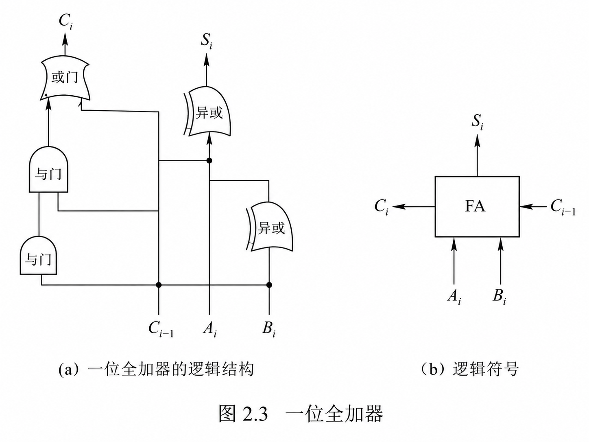

2. **串行进位加法器**

将 \(n\) 个全加器级联，可构成 \(n\) 位串行进位加法器，又称行波进位加法器。其特点是：**进位信号逐级传递**，每一级的进位输出直接作为下一级的进位输入。

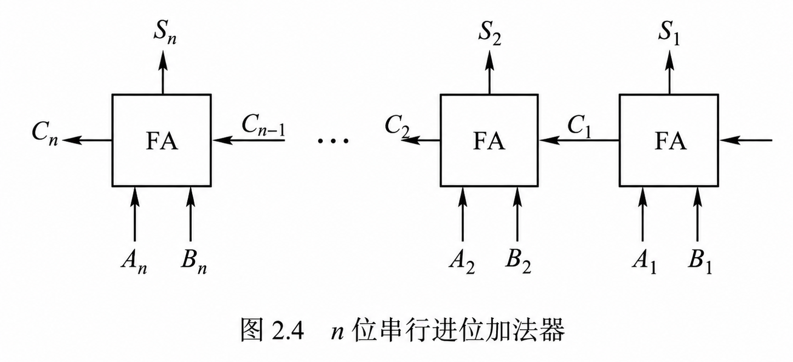

图 2.4 中的加法器实现两个 \(n\) 位二进制数逐位相加的功能。设：

\[
\begin{aligned}
A &= A_nA_{n-1}\cdots A_1 \\
B &= B_nB_{n-1}\cdots B_1
\end{aligned}
\]

逐位相加后得到和：

\[
S = S_nS_{n-1}\cdots S_1
\]

以及最终进位 \(C_n\)。例如，当 \(A=1111\)、\(B=0001\)（4 位）时，输出 \(S=0000\)、\(C_4=1\)。由于位数固定，结果实际为模 \(2^n\) 的加法，溢出部分被丢弃。

在串行进位加法器中，总运算延迟主要由进位信号从最低位传到最高位的时间决定。位数越多，进位链越长，延迟越大。因此，缩短进位传递路径是提升加法器性能的关键。

3. **并行进位加法器**

并行进位，也称先行进位。并行进位加法器能显著提升加法运算速度，因为它能以几乎同时生成所有进位信号的方式工作，而不是逐级传递进位。

为实现这一目标，\(n\) 个一位全加器连接到一个 \(n\) 位先行进位逻辑部件（CLA 部件），由 CLA 部件几乎同时生成所有进位信号。因此，对于较大位数的数据处理，并行进位加法器效率高于串行进位加法器。

图 2.5 展示了一个 4 位全先行进位加法器。随着加法器位数增加，电路设计复杂度也会提高，此处不再详述。

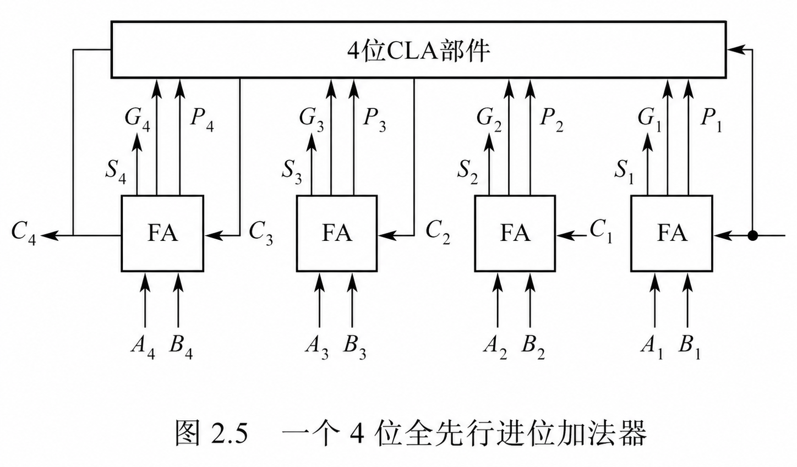

4. **带标志加法器**

对于 \(n\) 位加法器，除了得到运算结果外，还要关注加法运算过程中是否发生溢出、结果的正负性、结果是否为零等信息。这些信息对程序的执行控制非常关键。

因此，在 \(n\) 位加法器的基础上，可增加额外逻辑电路，使其不仅支持计算和、差，还能生成以下标志位：

- **OF**：溢出标志。
- **CF**：进位/借位标志。
- **SF**：符号标志。
- **ZF**：零标志。

每个标志占 1 位。图 2.6 展示了用全加器实现 \(n\) 位带标志加法器的电路示意。

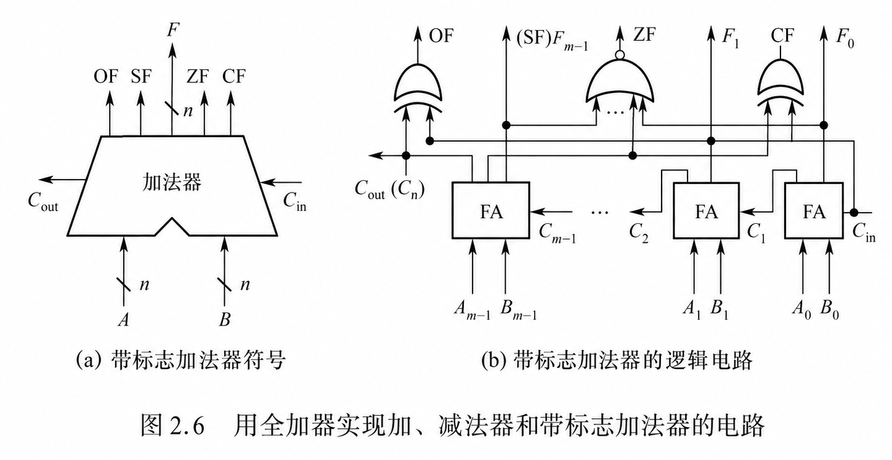

在图 2.6 中：

- 溢出标志 OF 通过检测最高有效位的进位输入 \(C_{n-1}\) 与进位输出 \(C_n\) 是否不同来决定，即 \(OF=C_n\oplus C_{n-1}\)。OF 用于判断有符号数加法运算是否溢出：\(OF=1\) 表示溢出，\(OF=0\) 表示未溢出。
- 符号标志 SF 等于结果的最高有效位，即 \(SF=F_{n-1}\)，用于指示有符号数加法运算结果的正负性：\(SF=0\) 表示结果为正，\(SF=1\) 表示结果为负。
- 零标志 ZF 在结果所有位均为 0 时置为 1，用于指示加减运算结果是否为零：\(ZF=1\) 表示结果为 0，\(ZF=0\) 表示结果非 0。
- 进位/借位标志 CF 用于判断无符号数的加减运算是否发生溢出或借位：\(CF=1\) 表示发生进位或借位，\(CF=0\) 表示未发生。

5. **算术逻辑单元（ALU）**

ALU 是一种功能较强的组合逻辑电路，能够执行多种算术运算与逻辑运算。其中，加法和减法由带标志加法器直接完成；乘法和除法通常通过 ALU 配合控制逻辑，以多次加减和移位的方式迭代实现。此外，ALU 还能执行与、或、非等基本逻辑运算。

ALU 的基本结构如下：\(A\) 和 \(B\) 为两个 \(n\) 位操作数输入端，\(C_{in}\) 为进位输入端，\(ALUop\) 为操作控制信号，用于选择 ALU 执行的具体功能。例如，当 \(ALUop\) 选择加法时，ALU 输出：

\[
F=A+B+C_{in}
\]

\(ALUop\) 的位数决定了可支持的操作类型数量。例如，3 位 \(ALUop\) 最多可支持 8 种不同操作。

图 2.7 给出 ALU 的基本结构；图 2.8 给出一位 ALU 的结构，可完成“与”“或”“加法”三种操作。其中，加法由一个全加器实现，逻辑运算由专用门电路并行计算，最终通过多路选择器（MUX）根据 \(ALUop\) 选择输出结果。由于有 3 种操作，\(ALUop\) 至少需要 2 位。

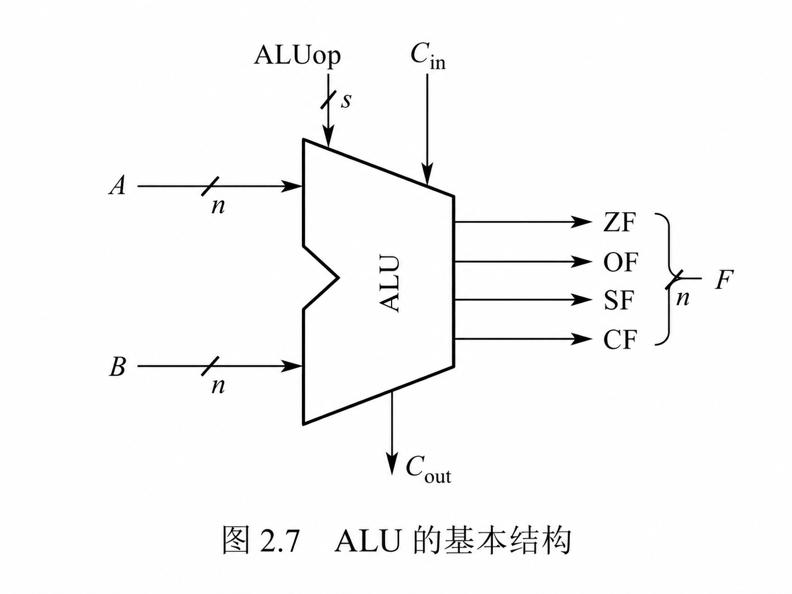

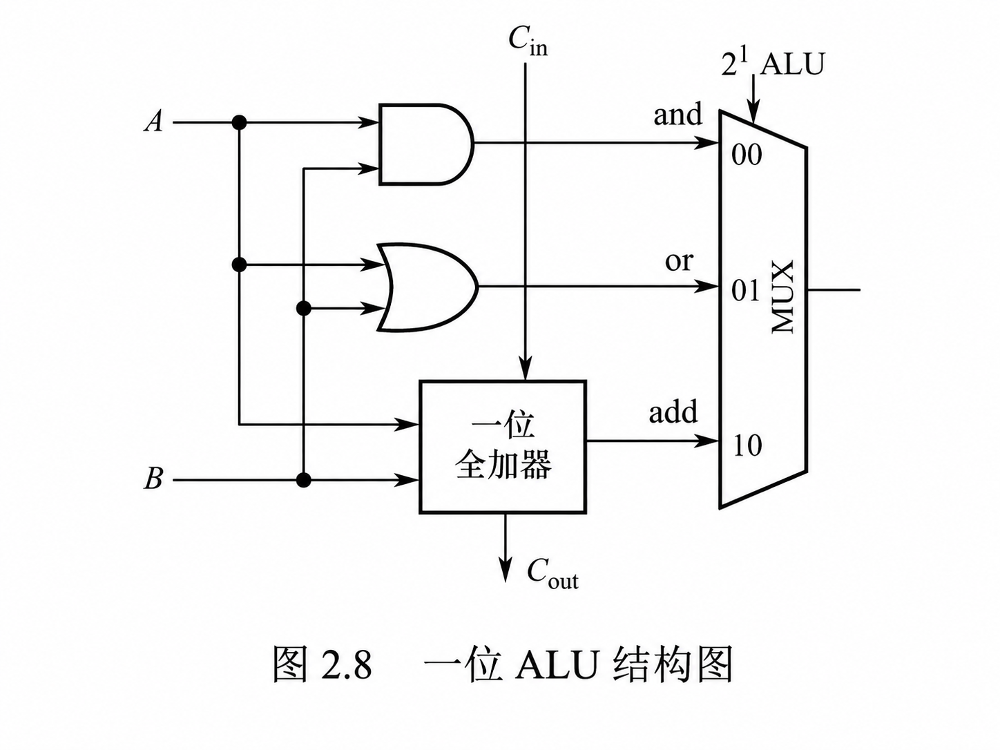

### 2.2.2 定点数的移位运算

当计算机中没有乘/除运算电路时，可以通过加法和移位相结合的方法实现乘/除运算。对于任意二进制整数：

- 左移一位，若未发生溢出，相当于乘以 2（类似于十进制数左移一位相当于乘以 10）。
- 右移一位，若忽略因移出而舍去的末位尾数，相当于除以 2。

根据操作数类型不同，移位运算可分为逻辑移位和算术移位。

1. **逻辑移位**

> 考点追踪：逻辑移位运算（2018）

逻辑移位将操作数视为无符号整数。其规则如下：

- 左移时，高位移出，低位补 0；若高位的 1 移出，则发生溢出。
- 右移时，低位移出，高位补 0。

例如，4 位无符号数 \(0001\)（\(+1\)）左移一位变为 \(0010\)（\(+2\)），相当于乘以 2，未溢出；\(0001\) 右移一位变为 \(0000\)（0），相当于除以 2 并舍弃小数部分。又如，\(1000\)（\(+8\)）左移一位变为 \(0000\)（0），相当于乘以 2，但结果超出了 4 位无符号数的表示范围，发生溢出。

2. **算术移位**

> 考点追踪：算术移位运算（2012、2017、2018）

算术移位需要考虑符号位的问题，即将操作数视为有符号整数。有符号整数采用补码表示，因此，对有符号整数的移位操作应采用补码算术移位方式。

算术移位的规则如下：

- 左移时，高位移出，低位补 0。若移出的高位与原符号位不同（左移后符号位改变），则发生溢出。
- 右移时，低位移出，高位补符号位。若低位的 1 移出，则影响精度。

例如，4 位补码 \(0010\)（\(+2\)）左移一位变为 \(0100\)（\(+4\)），未溢出；\(1001\)（\(-7\)）左移一位变为 \(0010\)，符号由负变正，表明发生溢出（因为 \(-14\) 超出了 4 位补码的表示范围）。又如，\(1001\)（\(-7\)）右移一位变为 \(1100\)（\(-4\)），保留了符号位，但丢失了最低有效位，影响精度。

### 2.2.3 定点数的加减运算

1. **补码加减运算**

> 考点追踪：补码的加减运算（2009、2011、2017、2025）

补码加减运算规则简单，易于硬件实现。补码加减运算的公式如下（设字长为 \(n+1\)）：

\[
\begin{aligned}
[A+B]_{补} &= [A]_{补} + [B]_{补} \pmod{2^{n+1}} \\
[A-B]_{补} &= [A]_{补} + [-B]_{补} \pmod{2^{n+1}}
\end{aligned}
\]

补码运算具有以下特点：

1）按二进制加法规则运算，逢二进一。

2）若做加法，则两个数的补码直接相加；若做减法，则将被减数与减数的负数补码相加。

3）符号位与数值位一同参与运算，结果的符号位由运算自然得出。

4）运算结果自动截断为 \(n+1\) 位，即模 \(2^{n+1}\)，高位进位被丢弃，结果仍为补码形式。

**例 2.3** 设字长为 8 位（含 1 位符号位），\(A=15\)、\(B=24\)，求 \([A+B]_{补}\) 和 \([A-B]_{补}\)。

解：

\[
\begin{aligned}
A &= +0001111,\quad B=+0011000 \\
[A]_{补} &= 00001111 \\
[B]_{补} &= 00011000 \\
[-B]_{补} &= 11101000
\end{aligned}
\]

因此：

\[
\begin{aligned}
[A+B]_{补} &= [A]_{补} + [B]_{补} \\
&= 00001111 + 00011000 \\
&= 00100111
\end{aligned}
\]

符号位为 0，真值为 \(+39\)。

\[
\begin{aligned}
[A-B]_{补} &= [A]_{补} + [-B]_{补} \\
&= 00001111 + 11101000 \\
&= 11110111
\end{aligned}
\]

符号位为 1，真值为 \(-9\)。

2. **溢出判别方法**

> 考点追踪：补码运算的溢出判断（2010、2011、2014、2018、2021、2025）

补码加减运算仅在同号相加或异号相减时可能发生溢出。例如，两个正数相加结果为负，或一个负数减去一个正数结果为正。常用的溢出判别方法有以下三种。

（1）**采用一位符号位**

减法运算在机器中是用加法器实现的，因此加法和减法均可统一视为两个补码数相加。溢出仅发生在参与运算的两个数符号相同，而结果符号与之不同的情况下。

设参与运算的两个操作数的符号位分别为 \(A_s\) 和 \(B_s\)，运算结果的符号位为 \(S_s\)，则溢出逻辑表达式为：

\[
V=A_sB_s\overline{S_s}+\overline{A_s}\,\overline{B_s}S_s
\]

（2）**采用一位符号位并结合进位情况**

设符号位（最高位）产生的进位为 \(C_n\)，最高数值位（次高位）产生的进位为 \(C_{n-1}\)。若 \(C_n\) 与 \(C_{n-1}\) 不同，则表示溢出。溢出逻辑表达式为：

\[
V=C_n\oplus C_{n-1}
\]

（3）**采用双符号位**

使用两个符号位 \(S_{s1}S_{s2}\)，其中 \(S_{s1}\) 为高位符号位。若两个符号位不同，则表示溢出。

\(S_{s1}S_{s2}\) 的各种情况如下：

- \(S_{s1}S_{s2}=00\)：结果为正数，无溢出。
- \(S_{s1}S_{s2}=01\)：结果正溢出。
- \(S_{s1}S_{s2}=10\)：结果负溢出。
- \(S_{s1}S_{s2}=11\)：结果为负数，无溢出。

溢出逻辑表达式为：

\[
V=S_{s1}\oplus S_{s2}
\]

在上述三种方法中，若 \(V=0\)，则表示无溢出；若 \(V=1\)，则表示有溢出。

3. **加减运算电路**

> 考点追踪：补码加法器的实现原理（2011）

在计算机中，无论是无符号数还是有符号数的加减运算，均采用同一套硬件电路实现，即“一套电路，两种语义”。图 2.9 所示为一个加减运算部件。

输入端包括两个 \(n\) 位操作数 \(X\) 和 \(Y\)，以及一个控制信号 \(Sub\)。其中，\(Y\) 分成两路：一路直接接入二选一多路选择器（MUX），另一路经过反相器后接入 MUX。这样，控制信号 \(Sub\) 不仅决定选择 \(Y\) 还是 \(\overline{Y}\) 送入加法器，还在执行减法时作为最低位的进位输入。输出端包括 \(n\) 位运算结果 \(F\) 以及各类标志位。

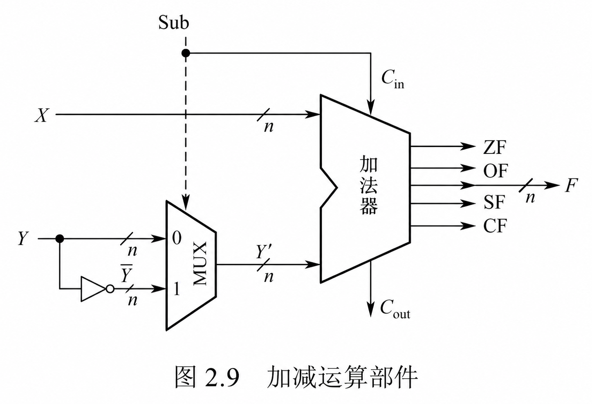

（1）**加法运算的工作原理**

无论是无符号数还是补码表示的有符号数，其加法均通过同一加法器电路完成。当执行加法操作时，\(Sub=0\)，电路实现过程如下：

- 输入：\(X\) 直接接入加法器的一端；\(Y\) 接入 MUX。
- 控制信号：\(Sub=0\)，同时作为加法器的最低位进位输入 \(C_{in}=0\)。
- 运算：MUX 在 \(Sub=0\) 时选择 \(Y\) 直接通过，加法器执行 \(X+Y+C_{in}\)，即 \(X+Y\)，输出 \(n\) 位结果 \(F\) 和进位输出 \(C_{out}\)，并生成状态标志位。

语义解释如下：

1）若 \(X\)、\(Y\) 被视为无符号数，则结果：

\[
F=(X+Y)\bmod 2^n
\]

当 \(X+Y\ge 2^n\) 时，产生进位 \(C_{out}=1\)，表示发生无符号溢出；此时，标志 \(CF=C_{out}\) 反映进位状态。

2）若 \(X\)、\(Y\) 被视为有符号数（\([X]_{补}\)、\([Y]_{补}\)），则结果：

\[
F=[X+Y]_{补}
\]

此时，若两个操作数同号而结果异号（如正 + 正 = 负），则表示有符号溢出，由溢出标志 OF 指示。

（2）**减法运算的工作原理**

无论是无符号数还是补码表示的有符号数，其减法也通过同一加法器电路实现。当执行减法操作时，\(Sub=1\)，电路实现过程如下：

- 输入：\(X\) 直接接入加法器的一端；\(Y\) 接入 MUX。
- 控制信号：\(Sub=1\)，同时作为加法器的最低位进位输入 \(C_{in}=1\)。
- 运算：MUX 在 \(Sub=1\) 时选择反相后的 \(Y\) 输出，加法器执行 \(X+\overline{Y}+C_{in}\)，即 \(X+\overline{Y}+1\)，输出 \(n\) 位结果 \(F\) 和进位输出 \(C_{out}\)，并生成状态标志位。

语义解释如下：

1）若 \(X\)、\(Y\) 被视为无符号数，则该运算等价于计算：

\[
X-Y+2^n
\]

也就是模 \(2^n\) 运算。

- 若 \(X\ge Y\)，则 \(X-Y+2^n\ge 2^n\)，有进位 \(C_{out}=1\)，舍去高位后 \(F=X-Y\)，表示无借位（结果非负）。
- 若 \(X<Y\)，则 \(0<X-Y+2^n<2^n\)，无进位 \(C_{out}=0\)，表示有借位（结果为负，超出 \(n\) 位无符号数范围），发生无符号溢出。此时，标志 \(CF=\overline{C_{out}}\) 反映借位状态。

2）若 \(X\)、\(Y\) 被视为有符号数（\([X]_{补}\)、\([Y]_{补}\)），则该运算等价于：

\[
F=[X-Y]_{补}=[X]_{补}+[-Y]_{补}
\]

若运算导致结果超出 \(n\) 位补码表示范围（例如，正减负得负，或负减正得正），则发生有符号溢出，由溢出标志 OF 指示。

> 注意：运算器本身无法识别所处理的二进制串是有符号数还是无符号数。例如，\(0-1=00\cdots0+11\cdots1=11\cdots1\)。若解释为有符号数，对应值为 \(-1\)，结果正确；若解释为无符号数，对应值为 \(2^n-1\)（\(n\) 位无符号数的最大值），与数学结果不符。这类易混点是统考极易考查的内容。

（3）**各类标志位的含义**

> 考点追踪：各类标志位的分析（2011、2018、2022—2024）

可通过状态标志位来区分有符号数与无符号数的运算结果。PDF 第21页至第22页给出的标志位含义如下：

- **零标志 ZF**：当结果 \(F=0\) 时，\(ZF=1\)；否则 \(ZF=0\)。对无符号数和有符号数均有意义。
- **溢出标志 OF**：用于判断有符号数运算是否发生溢出。可由符号位进位与最高数值位进位异或得到，即 \(OF=C_n\oplus C_{n-1}\)。对无符号数运算无意义，即无法依据 OF 判断无符号数运算是否溢出。例如，无符号加法 \(010+011=101\)，虽然 \(OF=1\)，但结果并未溢出。


- **符号标志 SF**：等于结果 \(F\) 的最高位（符号位）。仅对有符号数有意义。

> 考点追踪：CF 标志位的作用（2024）

- **进/借位标志 CF**：用于表示无符号数运算中的进位或借位情况，用来判断是否溢出，仅对无符号数有意义。
  - 加法运算（\(Sub=0\)）时，\(CF=1\) 表示有进位，即发生上溢，\(CF=C_{out}\)。例如，无符号加法 \(110+011\) 产生进位。
  - 减法运算（\(Sub=1\)）时，\(CF=1\) 表示有借位，即不够减，\(CF\) 等于 \(C_{out}\) 取反。综合可得：

\[
CF=Sub\oplus C_{out}
\]

例如，无符号数减法 \(000-111\) 产生借位，结果发生溢出，\(CF=1\)。

（4）**无符号数大小的比较**

在无符号数运算中，零标志 **ZF** 和进/借位标志 **CF** 是判断大小关系的关键。设 \(A\) 和 \(B\) 为两个无符号数，执行 \(A-B\) 后，可根据 \(ZF\) 和 \(CF\) 判断 \(A\) 与 \(B\) 的大小。

- 若 \(A=B\)：如 \(011-011=000\)，结果为零，\(ZF=1\)，无借位，\(CF=0\)。
- 若 \(A>B\)：如 \(010-001=001\)，结果非零，\(ZF=0\)，无借位，\(CF=0\)。
- 若 \(A<B\)：如 \(000-001=(1)000-001=111\)，结果非零，\(ZF=0\)，有借位，\(CF=1\)。

综上，判断规则为：

- 当 \(ZF=1\) 时，无须检查 \(CF\)，说明 \(A=B\)。
- 当 \(ZF=0\) 且 \(CF=0\) 时，说明 \(A>B\)。
- 当 \(CF=1\) 时，此时 \(ZF\) 必为 0，无须额外检查，说明 \(A<B\)。

（5）**有符号数大小的比较**

在有符号数运算中，零标志 **ZF**、溢出标志 **OF** 和符号标志 **SF** 共同用于判断大小关系。设 \(A\) 和 \(B\) 为两个有符号数，执行 \([A]_补-[B]_补\) 后，可根据 \(ZF\)、\(OF\)、\(SF\) 判断 \(A\) 与 \(B\) 的大小。

- 若 \(A=B\)：如 \([A]_补-[B]_补=011-011=(1)000\)，得 \(ZF=1\)，\(OF=0\)，\(SF=0\)。
- 若 \(A>B\)：
  - 无溢出示例：\([A]_补-[B]_补=010-001=001\)，得 \(ZF=0\)，\(OF=0\)，\(SF=0\)。
  - 有溢出示例：\([A]_补-[B]_补=011-101=011+011=110\)，得 \(ZF=0\)，\(OF=1\)，\(SF=1\)。
- 若 \(A<B\)：
  - 无溢出示例：\([A]_补-[B]_补=000-001=000+111=111\)，得 \(ZF=0\)，\(OF=0\)，\(SF=1\)。
  - 有溢出示例：\([A]_补-[B]_补=101-011=101+101=(1)010\)，得 \(ZF=0\)，\(OF=1\)，\(SF=0\)。

综上，判断规则如下：

- 当 \(ZF=1\) 时，说明 \(A=B\)。
- 当 \(ZF=0\) 且 \(OF=SF\)（或 \(OF\oplus SF=0\)）时，说明 \(A>B\)。
- 当 \(ZF=0\) 且 \(OF\ne SF\)（或 \(OF\oplus SF=1\)）时，说明 \(A<B\)。

> 注意：当 \(ZF=0\) 且未发生溢出时，即 \(OF=0\)，若 \(SF=0\)，则表示结果非负，说明 \(A>B\)；若 \(SF=1\)，则表示结果为负，说明 \(A<B\)。当发生溢出时，即 \(OF=1\)，若 \(SF=1\)，则必然是正数减去负数发生溢出导致结果为负，说明 \(A>B\)；若 \(SF=0\)，则必然是负数减去正数发生溢出导致结果为正，说明 \(A<B\)。

4. **原码的加减运算（了解）**

在原码加减运算中，需要将符号位与数值位分开处理，规则较为复杂。

1）**加法规则**：遵循“同号求和，异号求差”的原则，先判断两个操作数的符号。

- 若符号相同，则数值位相加，结果符号位不变；若数值位相加时最高位产生进位，则发生溢出。
- 若符号不同，则用绝对值较大的数减去绝对值较小的数，结果符号位与绝对值较大的数相同。

2）**减法规则**：先将减数的符号取反，再将被减数与符号取反后的减数按原码加法进行运算。

> 注意：由于原码加减法需要先比较两个数的绝对值大小，再决定执行加法还是减法，控制逻辑复杂，难以用单一加法器高效实现。因此，现代计算机普遍采用补码进行加减运算，以简化硬件设计。

### 2.2.4 定点数的乘除运算

1. **乘法运算**

（1）**原码乘法的运算原理**

原码乘法的特点是符号位与数值位分别处理，其运算过程分为两步：

1. 乘积的符号位由两个乘数的符号位异或得到。
2. 乘积的数值位是两个乘数绝对值的乘积。

数值位的乘法可归结为两个无符号数的相乘。以下是两个无符号数相乘的手算过程：

```text
        1 1 0 1        被乘数 X = x4x3x2x1 = 1101 (13)
      × 1 0 1 1        乘数   Y = y4y3y2y1 = 1011 (11)
      ---------
        1 1 0 1        X × y1 × 2^0        X × 1
      1 1 0 1          X × y2 × 2^1        X × 1 左移 1 位
    0 0 0 0            X × y3 × 2^2        X × 0 左移 2 位
  1 1 0 1              X × y4 × 2^3        X × 1 左移 3 位
  ----------------
  1 0 0 0 1 1 1 1      乘积 = 143
```

上述过程可写成数学推导式：

\[
X\times Y=X\times(y_4\times2^3+y_3\times2^2+y_2\times2^1+y_1\times2^0)
\]

也可写为迭代形式：

\[
X\times Y=\{[(X\times y_4)\times2+X\times y_3]\times2+X\times y_2\}\times2+X\times y_1
\]

> 考点追踪：乘法运算的原理及分析（2020、2024）

在硬件实现中，通常采用部分积和移位的方式将上述求和过程转换为迭代形式。设乘数 \(Y=y_n\cdots y_2y_1\)，其中 \(y_1\) 为最低位，定义部分积序列 \(P_0,P_1,\cdots,P_n\) 如下：

\[
\begin{aligned}
P_0&=0\\
P_1&=(P_0+X\times y_1) >> 1\\
P_2&=(P_1+X\times y_2) >> 1\\
&\cdots\\
P_n&=(P_{n-1}+X\times y_n) >> 1
\end{aligned}
\]

其中，“\(>>1\)”表示逻辑右移一位。需要注意的是，这里的右移是位操作的一部分，而非数学上的除法；所有中间结果均在 \(2n\) 位存储空间中保留完整精度。经过 \(n\) 次迭代后，最终得到的 \(2n\) 位部分积 \(P_n\) 即为乘积 \(X\times Y\) 的完整二进制表示。因此，乘法运算可通过加法和移位实现。

为了保证精度，部分积需要使用 \(2n\) 位寄存器存储。原码乘法的过程可归纳为：

1. 被乘数和乘数均取绝对值，作为无符号整数参与运算，结果的符号位为 \(x_s\oplus y_s\)。
2. 初始化部分积 \(P_0=0\)，从乘数最低位 \(y_1\) 开始，将当前部分积 \(P_{i-1}\) 加上 \(Xy_i\)，然后逻辑右移 1 位。重复此步骤 \(n\) 次，最终所得的 \(2n\) 位部分积即为数值乘积。

（2）**无符号整数的乘法运算电路**

> 考点追踪：乘法运算电路中控制逻辑的作用（2020）

图 2.10 展示了一个 32 位无符号数乘法运算器的逻辑结构。该电路采用加法与移位相结合的方法来完成乘法运算，其设计思想源自手算乘法的基本原理。

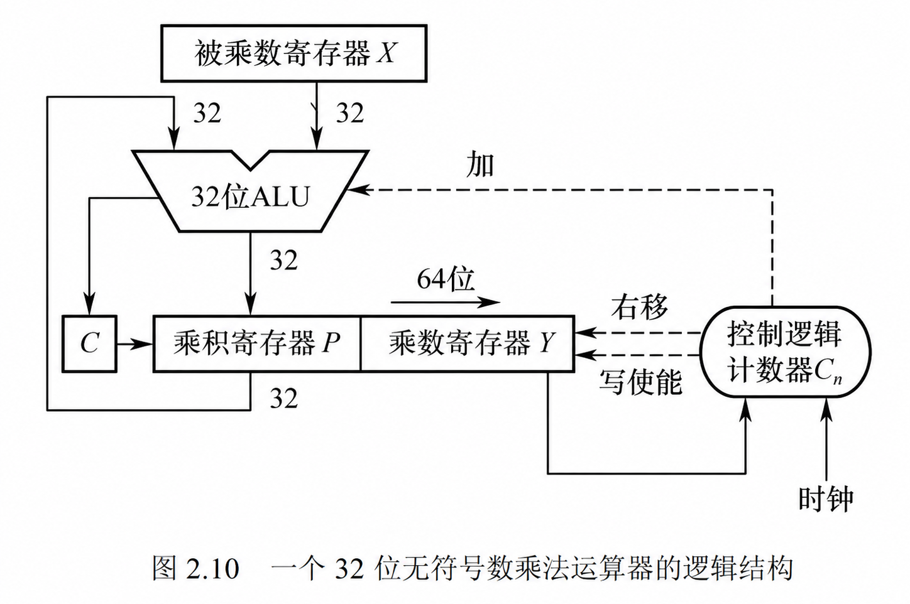

其主要组成部分及工作原理如下。

1）**初始化**

- **被乘数寄存器 \(X\)**：存储 32 位被乘数 \(X\)，在整个乘法过程中保持不变。
- **乘数寄存器 \(Y\)**：初始时存储 32 位乘数 \(Y\)。
- **乘积寄存器 \(P\)**：初始化为 0，用于存放累加的部分积（高 32 位结果）。
- **计数器 \(C_n\)**：初始化为 \(n\)（本例为 32），表示需要进行 \(n\) 次迭代。

2）**执行过程（循环 \(n\) 次）**

1. **判断**：将乘数寄存器 \(Y\) 的最低位送入控制逻辑。
2. **加法操作**：若 \(Y\) 的最低位为 1，则将当前部分积 \(P\) 加上被乘数 \(X\)，并将进位存入进位触发器 \(C\)；若 \(Y\) 的最低位为 0，则执行空操作。
3. **移位操作**：将 \(C\)、\(P\) 和 \(Y\) 视为一个整体，执行一次逻辑右移。具体来说，进位 \(C\) 移入 \(P\) 的最高位；\(P\) 的最低位移入 \(Y\) 的最高位；\(Y\) 的最低位被丢弃。
4. **更新计数器**：计数器 \(C_n\) 减 1。若 \(C_n\ne0\)，则继续下一轮迭代，否则算法结束。

> 考点追踪：无符号数乘法指令的溢出判断（2019、2020）

3）**结果与溢出判断**

- **最终结果**：64 位乘积结果存储在寄存器对 \([P:Y]\) 中，其中 \(P\) 为高 32 位，\(Y\) 为低 32 位。
- **溢出判断**：若高 32 位结果 \(P\) 不为 0，则表明乘积超出了 32 位无符号数的表示范围，发生溢出。此时，处理器将溢出标志 OF 与进位标志 CF 同时置 1。

4）**溢出处理**

溢出处理属于软件层面的操作，通过检查 CF 或 OF 标志位即可判断是否发生溢出。若检测到溢出，则可在乘法指令后插入一条溢出自陷指令，自动触发异常处理程序，以处理错误（如报告错误、转为高精度计算等）。对于不要求结果精确性的应用，程序员可选择忽略溢出。

（3）**有符号整数的乘法运算电路**

有符号整数采用补码表示，其乘法需要同时处理符号与数值。A. D. Booth 提出的 Booth 算法让符号位与数值位统一参与运算，直接生成补码形式的乘积，且对正数和负数一视同仁。

图 2.11 所示为 32 位补码一位乘法器的逻辑结构，其整体架构与图 2.10 中的无符号乘法器非常相似，主要区别在于控制逻辑。

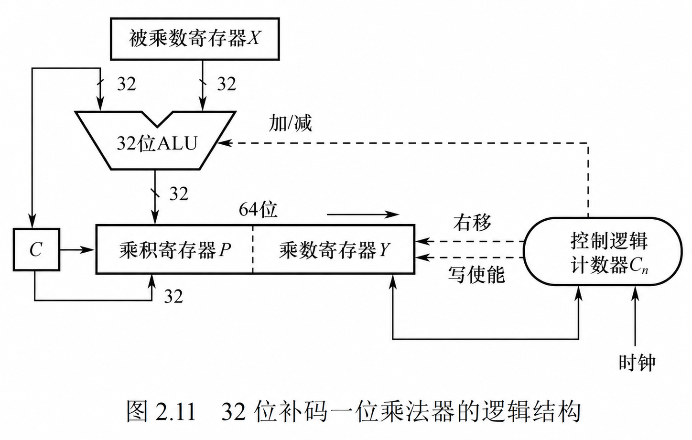

Booth 算法的数学推导较为复杂，通常不在考研考查范围内，因此本节仅介绍其实现结构，不深入讨论其背后的原理。

其主要组成部分及工作原理如下。

1）**初始化**

- **被乘数寄存器 \(X\)**：存储 32 位被乘数，在整个乘法过程中保持不变。
- **乘积寄存器 \(P\)**：初始化为 0，用于存放累加的部分积（高 32 位结果）。
- **乘数寄存器 \(Y\)**：初始时存储 32 位乘数；在其右侧附加一个辅助位 \(y_{-1}\)，且初始化为 0。
- **计数器 \(C_n\)**：初始化为 \(n\)（本例为 32），表示需要进行 \(n\) 次迭代。

2）**执行过程（循环 \(n\) 次）**

1. **判断**：将 \(Y\) 的最低位 \(y_0\) 与辅助位 \(y_{-1}\) 组合形成两位二进制码，送入控制逻辑。
2. **加减法**：若组合为 10，则执行 \(P=P-X\)（减去被乘数）；若组合为 01，则执行 \(P=P+X\)（加上被乘数）；若为 00 或 11，则执行空操作。
3. **移位**：将 \(P\)、\(Y\) 和辅助位 \(y_{-1}\) 视为一个整体，执行一次算术右移。具体来说，\(P\) 的最低位移入 \(Y\) 的最高位；\(Y\) 的最低位移入辅助位 \(y_{-1}\)；原辅助位 \(y_{-1}\) 被丢弃。
4. **循环控制**：计数器 \(C_n\) 减 1。若 \(C_n\ne0\)，则继续下一轮迭代，否则算法结束。

> 考点追踪：有符号数乘法指令的溢出判断（2021）

3）**结果与溢出判断**

- **最终结果**：64 位乘积存储在寄存器对 \([P:Y]\) 中，其中 \(P\) 为高 32 位，\(Y\) 为低 32 位。
- **溢出判断**：若高 32 位结果 \(P\) 不是低 32 位结果 \(Y\) 的符号扩展，即 \(P\) 的所有位不等于 \(Y\) 的符号位，则判定为溢出。此时，处理器将溢出标志 OF 与进位标志 CF 同时置 1。

4）**溢出处理**

有符号乘法的溢出处理同样由软件完成。执行有符号乘法指令（如 imul）后，应检查 OF 标志位：若发生溢出，则可通过条件跳转进入错误处理程序，或者利用溢出自陷机制由硬件自动触发异常处理程序，以确保程序健壮性；若已知操作数不会导致溢出，也可选择忽略该标志。

（4）**乘法运算的三种实现方式**

1）**迭代式乘法器**：即前文所述的经典实现结构，由 ALU、移位器、寄存器和控制逻辑构成。通过多次迭代完成乘法，每次迭代处理一位乘数。若一次 ALU 运算和一次移位各需 1 个时钟周期，则完成 \(n\) 位乘法约需 \(2n\) 个时钟周期。

2）**阵列乘法器**：一种全并行的快速乘法器。所有部分积同时生成，并以二维阵列形式组织，再通过加法器网络逐级压缩求和，从而直接得到最终乘积。由于整个数据通路为组合逻辑，只要时钟周期足够长，就可在单个时钟周期内完成一次乘法运算。

3）**移位-加减法**：利用移位与加法（或减法）的组合来模拟乘法运算。例如，乘以 13 可分解为 \(X\ll3+X\ll2+X\)。该方法硬件成本最低，但运算速度最慢。

2. **除法运算**

在进行定点数除法运算之前，需要先对被除数和除数的取值进行预判，以识别异常或确定结果是否为零。具体规则如下：

1. 若被除数为 0、除数不为 0，或 \(|被除数|<|除数|\)，则商为 0，余数等于被除数。
2. 若除数为 0，则发生“除数为 0”异常。
3. 若被除数和除数均为 0，则发生除法错误异常。

仅当被除数和除数均不为 0 且 \(|被除数|\ge |除数|\) 时，才进入正式的除法计算过程。

（1）**无符号整数的除法运算原理**

> 考点追踪：除法运算的异常及处理（2025）

无符号整数除法与乘法类似，也是一种基于移位与加减的迭代过程，但流程更为复杂。下面以两个无符号数为例，说明手算除法步骤。

```text
              0 1 1 1
        ----------------
0 0 1 0 ) 0 0 0 0 1 1 1 1
              0 0 1 0
              -------
              0 0 1 1
              0 0 1 0
              -------
              0 0 1 1
              0 0 1 0
              -------
              0 0 0 1

被除数 X = 15 = 1111 = 0000 1111
除数   Y = 2  = 0010
商         = 0111 = 7
余数       = 0001 = 1
```

在手算二进制除法中，为便于从最高位开始逐位试商，通常按固定位宽书写被除数，并在高位补 0（例如将 4 位的 1111 写成 00001111），这些前导零不改变数值大小。具体步骤如下：

1. 取被除数的高 \(n\) 位部分（与除数同宽）作为初始部分被除数，与除数相减。若够减，则上商 1，并将差值作为中间余数；若不够减，则上商 0，中间余数即为该部分被除数。
2. 将被除数的下一位“带下来”，拼接到当前余数末尾，形成新的 \(n\) 位部分被除数；再与除数相减，确定下一位商。如此重复，直到所有位处理完毕。

手算中在被除数前补 0 主要是为了便于对齐和观察；硬件设计采用类似的策略，将 \(n\) 位被除数高位补 0 扩展为 \(2n\) 位，以支持统一的迭代过程。

（2）**无符号整数的除法运算电路**

> 考点追踪：除法运算器的结构（2025）

图 2.12 所示为一个 32 位除法逻辑结构图。为了适应逐位试商的迭代过程，需要将被除数加载到一个 64 位寄存器中（高 32 位为 0，低 32 位为实际被除数）。一般而言，\(n\) 位无符号数除法采用一个 \(2n\) 位的被除数（高位补 0）除以一个 \(n\) 位的除数，产生 \(n\) 位的商和 \(n\) 位的余数。

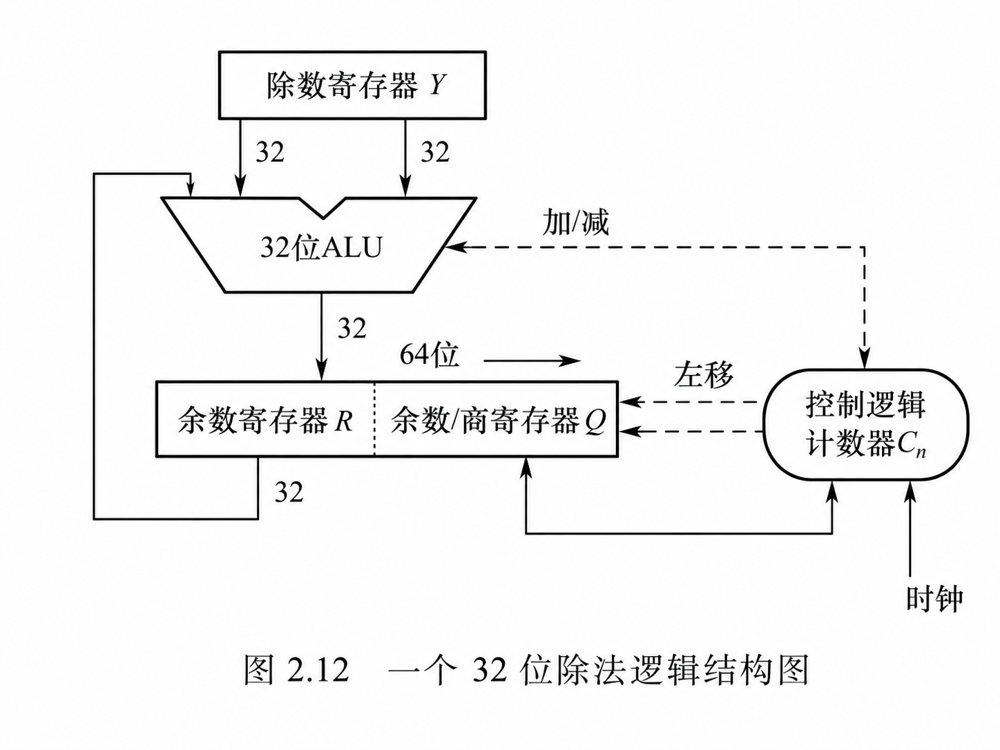

下面介绍其主要组成部分及其工作原理。

1）**初始化**

- **除数寄存器 \(Y\)**：存储 \(n\) 位除数，在整个除法过程中保持不变。
- **余数/商寄存器 \(Q\)**：初始时存储 \(n\) 位被除数；在迭代过程中逐步生成 \(n\) 位商。
- **余数寄存器 \(R\)**：初始化为 0，用于暂存中间余数。
- **计数器 \(C_n\)**：初始化为 \(n\)，表示需要执行 \(n\) 轮迭代。
- **异常预检**：若除数为 0，则立即触发“除零错误”异常，停止除法运算；若被除数 \(<\) 除数，则商 \(=0\)，余数 \(=\) 被除数，无须进入执行过程。


2）**执行过程（循环 \(n\) 次）**

1. **移位**：将 \(R\) 与 \(Q\) 视为一个整体，执行一次逻辑左移。具体来说，\(R\) 的最高位被移出（通常丢弃），\(Q\) 的最高位移入 \(R\) 的最低位，\(Q\) 的最低位空出以接收新商位。
2. **试商与减法**：计算 \([R]-[Y]\)。若结果大于或等于 0，则当前商位为 1，并将差值写回 \(R\)；若结果小于 0，则当前商位为 0，并执行 \([R]+[Y]\) 恢复余数（撤销减法）。
3. **循环控制**：计数器 \(C_n\) 减 1。若 \(C_n\ne0\)，则继续下一轮迭代；否则算法结束。

3）**最终结果**

最终的 \(n\) 位商存储在寄存器 \(Q\) 中，\(n\) 位余数存储在寄存器 \(R\) 中。

4）**异常处理**

当检测到“除数为 0”时，除法器立即停止运算，并置位“除零”异常标志。该异常通常由硬件自动捕获，并通过中断向量表跳转至预设的异常处理程序。

> 注意：两个 \(n\) 位无符号数相除不会发生溢出。因为被除数最大为 \(2^n-1\)，最小的非零除数为 1，此时商为最大值 \(2^n-1\)，恰好可用 \(n\) 位无符号数表示。

（3）**补码除法运算的工作原理**

补码作为有符号整数的标准表示形式，其除法运算需要同时处理符号与数值。补码除法让符号位与数值位统一参与运算，商的符号在运算过程中自然生成。对于两个 \(n\) 位补码数相除，被除数需要先进行符号扩展至 \(2n\) 位；若被除数为 \(2n\) 位，除数为 \(n\) 位，则无须扩展。

由于补码除法涉及有符号数的比较、加减和移位，试商规则比无符号除法更复杂。按考试大纲要求，只需掌握其基本实现，底层原理可参见教材。补码除法的硬件结构与图 2.12 所示的无符号除法电路基本一致，下面结合该图说明其基本工作过程。

> 考点追踪：除法运算器的初始化步骤（2025）

1）**初始化**

- **除数寄存器 \(Y\)**：存储 \(n\) 位除数，在整个除法过程中保持不变。
- **余数/商寄存器 \(Q\)**：初始时存储 \(n\) 位被除数；在迭代过程中逐步生成 \(n\) 位商。
- **余数寄存器 \(R\)**：所有位都初始化为被除数的符号位，即完成符号扩展。
- **计数器 \(C_n\)**：初始化为 \(n\)，表示需要执行 \(n\) 轮迭代。
- **异常预检**：若除数为 0，则立即触发“除零错误”异常，停止除法运算；若 \(|被除数|<|除数|\)，则商 \(=0\)，余数 \(=\) 被除数，无须进入执行过程。

2）**执行过程（循环 \(n\) 次）**

1. **移位**：将 \(R\) 与 \(Q\) 视为一个整体，执行一次算术左移。
2. **试商与加减法**：根据当前 \([R]\) 与 \([Y]\) 的关系，通过加法或减法信号以确定当前商位。由于涉及有符号数的恢复机制，具体判定规则较复杂，此处不展开。
3. **循环控制**：计数器 \(C_n\) 减 1。若 \(C_n\ne0\)，则继续下一轮迭代；否则算法结束。

3）**最终结果**

最终的商存储在 \(Q\) 中，余数（符号与被除数相同）存储在 \(R\) 中。

4）**异常处理**

当检测到除数为 0 或发生商溢出时，除法器立即停止运算，并置位相应异常标志。该异常的捕获和处理方式与无符号除法类似。值得注意的是，在两个 \(n\) 位补码除法中，商溢出只有一种情形：被除数为最大负数 \(-2^{n-1}\)，且除数为 \(-1\)，此时结果 \(2^{n-1}\) 无法用 \(n\) 位补码表示。

## 2.3 浮点数的表示和运算

浮点数通常可表示为

\[
N=(-1)^S\times M\times R^E
\]

其中，\(S\)（取值 0 或 1）决定浮点数的符号；\(M\) 是一个非负的定点小数，称为尾数，通常用原码表示；\(E\) 是一个定点整数，称为阶码（或指数），通常采用偏置表示（一种移码形式）；\(R\) 是基数，通常隐含约定为 2、4 或 16。可见，浮点数由**符号、尾数和阶码**三部分组成。

IEEE 754 浮点数标准采用 \(R=2\)，规定了统一的浮点数表示格式。不同计算机所用的浮点数表示格式可能各不相同。图 2.13 给出了一种典型的 32 位浮点数格式示例。

```text
图 2.13 一种典型的 32 位浮点数格式示例

位号：  0     1 ...... 7    8 ................ 31
       +-----+------------+----------------------+
字段：  | 符号 |    阶码    |         尾数         |
       +-----+------------+----------------------+
        1 位     7 位             24 位
```

其中，第 0 位为符号 \(S\)；第 1～7 位为阶码 \(E\)，采用偏置值为 64 的移码表示；第 8～31 位为 24 位尾数 \(M\)，以二进制原码小数表示，基数 \(R\) 为 2。在这种格式中，阶码的值决定小数点的实际位置；阶码位数决定浮点数的表示范围；尾数位数决定数值精度。

### 2.3.1 IEEE 754 标准的浮点数

1. **IEEE 754 标准的浮点数格式**

> 考点追踪：IEEE 754 单精度数大小的比较（2014）

现代系统普遍采用 IEEE 754 浮点数标准。该标准定义了两种常用格式：32 位单精度浮点数（float 型）和 64 位双精度浮点数（double 型），其基数隐含为 2。

图 2.14 可整理为如下位段表：

| 格式 | 符号位 \(s\) | 阶码位 \(e\) | 尾数位 \(f\) |
|---|---:|---:|---:|
| 32 位单精度格式 | 1 位 | 8 位 | 23 位 |
| 64 位双精度格式 | 1 位 | 11 位 | 52 位 |

32 位单精度格式包含 1 位符号 \(s\)、8 位阶码 \(e\) 和 23 位尾数 \(f\)；64 位双精度格式包含 1 位符号 \(s\)、11 位阶码 \(e\) 和 52 位尾数 \(f\)。基数隐含为 2，尾数用原码表示。

对于规格化的二进制浮点数，尾数的最高位恒为 1。为提高精度，IEEE 754 不显式存储该位，而是将其隐含在小数点之前，称为**隐藏位**。因此，单精度格式的 23 位尾数实际提供 24 位有效数字，双精度格式的 52 位尾数实际提供 53 位有效数字。

例如，\((12)_{10}=(1100)_2\)，规格化后为 \(1.1\times2^3\)，其中小数点前的“1”不实际存储，尾数 \(f\) 仅保存小数部分“100···0”。

IEEE 754 标准的阶码采用移码表示，但偏置值并不是通常 \(n\) 位移码所用的 \(2^{n-1}\)，而是 \(2^{n-1}-1\)。因此，单精度和双精度格式的偏置值分别为 127 和 1023。上例中，指数真值为 3，因此在单精度格式中，阶码为 \(127+3=130=(82H)\)；在双精度格式中，阶码为 \(1023+3=1026=(402H)\)。

IEEE 754 标准的规格化单精度浮点数真值为

\[
(-1)^s\times 1.f\times 2^{e-127}
\]

规格化双精度浮点数的真值为

\[
(-1)^s\times 1.f\times 2^{e-1023}
\]

其中，规格化单精度浮点数的阶码 \(e\) 的取值范围为 1～254（8 位，全 0 和全 1 保留用于特殊值）；规格化双精度浮点数的阶码 \(e\) 的取值范围为 1～2046（11 位，保留用途相同）。

2. **IEEE 754 格式浮点数的表示范围**

> 考点追踪：IEEE 754 浮点数的表示范围和有效位（2017、2018、2024）

IEEE 754 规格化浮点数的表示范围如下表所示。

| 格式 | 最小值 | 最大值 |
|---|---|---|
| 单精度 | \(e=1, f=0\)，\(1.0\times2^{1-127}=2^{-126}\) | \(e=254, f=1.111\cdots\)，\(1.111\cdots\times2^{254-127}=2^{127}\times(2-2^{-23})\) |
| 双精度 | \(e=1, f=0\)，\(1.0\times2^{1-1023}=2^{-1022}\) | \(e=2046, f=1.111\cdots\)，\(1.111\cdots\times2^{2046-1023}=2^{1023}\times(2-2^{-52})\) |

当浮点运算结果的绝对值超过最大规格化数时，发生**上溢**（也称溢出），可分为：

- **正上溢**：若结果为正且大于最大规格化正数。
- **负上溢**：若结果为负且小于最小规格化负数（绝对值过大）。

IEEE 754 对上溢的处理规则为：将结果设为 \(+\infty\) 或 \(-\infty\)，并置位浮点溢出异常标志。IEEE 754 规定，默认情况下不触发异常中断，程序继续执行，除非显式开启此类异常响应。

当运算结果的绝对值小于最小规格化正数但不为零时，发生**下溢**，可分为：

- **正下溢**：若结果为正，且处在 0 到最小规格化正数之间。
- **负下溢**：若结果为负，且处在最大规格化负数到 0 之间。

对下溢的处理采用渐进下溢机制：若结果落在非规格化数可表示范围内，则以非规格化形式存储，保留部分有效精度；若结果过于接近零（舍入后为零），则存储为 \(+0\) 或 \(-0\)，并置位浮点下溢异常标志。同样，默认不响应下溢异常，程序继续运行，除非显式启用异常处理。

IEEE 754 标准的单精度浮点数表示范围如图 2.15 所示。

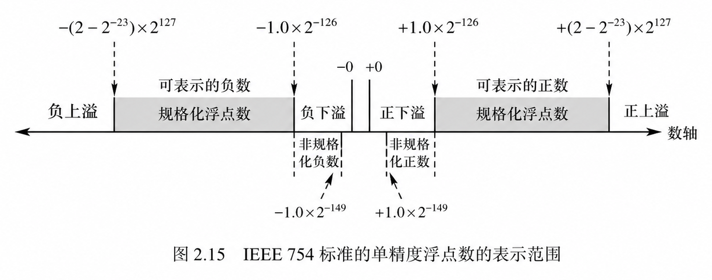

3. **几种特殊的 IEEE 754 浮点数**

> 考点追踪：IEEE 754 标准中的特殊浮点数（2017、2023）

在 IEEE 754 标准中，当阶码全为 0 或全为 1 时，浮点数具有特殊含义。

| 值的类型     | 单精度符号 |    单精度阶码 |     单精度尾数 | 单精度值               | 双精度符号 |     双精度阶码 |     双精度尾数 | 双精度值                |
| -------- | ----: | -------: | --------: | ------------------ | ----: | --------: | --------: | ------------------- |
| 正零       |     0 |        0 |         0 | 0                  |     0 |         0 |         0 | 0                   |
| 负零       |     1 |        0 |         0 | \(-0\)             |     1 |         0 |         0 | \(-0\)              |
| 正无穷大     |     0 | 255（全 1） |         0 | \(\infty\)         |     0 | 2047（全 1） |         0 | \(\infty\)          |
| 负无穷大     |     1 | 255（全 1） |         0 | \(-\infty\)        |     1 | 2047（全 1） |         0 | \(-\infty\)         |
| 无定义数（非数） | 0 或 1 | 255（全 1） | \(f\ne0\) | NaN                | 0 或 1 | 2047（全 1） | \(f\ne0\) | NaN                 |
| 非规格化正数   |     0 |        0 | \(f\ne0\) | \(2^{-126}(0.f)\)  |     0 |         0 | \(f\ne0\) | \(2^{-1022}(0.f)\)  |
| 非规格化负数   |     1 |        0 | \(f\ne0\) | \(-2^{-126}(0.f)\) |     1 |         0 | \(f\ne0\) | \(-2^{-1022}(0.f)\) |

特殊值解释如下：

1. **全 0 阶码全 0 尾数：\(+0/-0\)**。符号 \(s\) 决定正负，通常情况下 \(+0\) 和 \(-0\) 是等效的。
2. **全 1 阶码全 0 尾数：\(+\infty/-\infty\)**。\(+\infty\) 在数值上大于所有有限数，\(-\infty\) 小于所有有限数。引入无穷大数的目的是在发生异常时继续程序执行，而不是直接中断程序。例如，在除数为 0 发生异常情况下仍能继续执行。
3. **全 1 阶码非 0 尾数：NaN（Not a Number）**。表示一个没有定义的数，称为非数。
4. **全 0 阶码非 0 尾数：非规格化数**。非规格化数的特点是阶码为全 0，不使用隐藏位，尾数字段不全为 0。因此，单精度和双精度浮点数的指数分别为 \(-126\) 和 \(-1022\)。非规格化数用于实现渐进下溢，填补 0 与最小规格化数之间的数值间隙。

> 考点追踪：实数与 IEEE 754 浮点数的相互转换（2011、2013、2020、2022、2023、2025）

【例 2.5】将十进制数 \(-8.25\) 转换为 IEEE 754 单精度浮点数格式表示。

解：IEEE 754 单精度浮点数的偏置值是 127，尾数最高位的“1”是被隐藏的。先将 \(-8.25\) 转换为二进制：

\[
-8.25=-(1000.01)_2=-(1.00001)_2\times2^3
\]

尾数部分取小数点后的 23 位，即 00001 后补 0 至 23 位；再计算阶码 \(E\)，\(E-127=3\)，因此 \(E=130\)，转换为二进制为 1000 0010。

IEEE 754 单精度浮点数格式为：符号（1 位）+ 阶码（8 位）+ 尾数（23 位），即

```text
1; 1000 0010; 0000 1000 0000 0000 0000 000
```

因此，其单精度浮点数格式表示为

```text
1100 0001 0000 0100 0000 0000 0000 0000 = C104 0000H
```

【例 2.6】求 IEEE 754 单精度浮点数 \(C640\ 0000H\) 的值是多少。

解：先将 \(C640\ 0000H\) 按二进制展开为

```text
1100 0110 0100 0000 0000 0000 0000 0000
```

按 IEEE 754 单精度浮点数格式划分如下：

| 符号 | 阶码 | 尾数 |
|---:|---|---|
| 1 | 1000 1100 | 100 0000 0000 0000 0000 000 |

因此，符号 \(=1\) 表示负数；阶码真值为

\[
(1000\ 1100)_2-(0111\ 1111)_2=(0000\ 1101)_2=13
\]

尾数真值为 \(1+(0.1)_2=1.5\)（注意，尾数含隐藏位 1）。因此，该单精度浮点数的值为

\[
-1.5\times2^{13}
\]

### 2.3.2 浮点数的加减运算

浮点数运算的特点是阶码与尾数分开处理。浮点数加减运算分为以下几个步骤。

> 考点追踪：float 型能否通过左移实现乘以 2 运算（2017）；浮点数的加减运算（2009）

1. **对阶**

对阶的目的是使两个操作数的小数点位置对齐，即令它们的阶码相等，以便尾数可以直接相加减。对阶的原则是：**小阶向大阶看齐**，即将阶码较小数的尾数右移，右移位数等于两阶码差的绝对值。

对于 IEEE 754 标准的浮点数，对阶时需要进行移码减法运算，以求得阶码差。尾数右移时，仅移动数值位，符号位不参与移位；对于规格化数，隐藏位 1 会随尾数右移而进入小数部分，空出的高位补 0。为保证运算精度，移出的低位不应丢弃，而应保留并参与后续尾数运算。

> 注意：若采用大阶向小阶看齐，则需将尾数左移，导致最高有效位被移出，造成不可逆的精度错误。

2. **尾数加减**

由于 IEEE 754 标准采用定点原码小数表示尾数，因此尾数加减运算实质上是定点原码小数的加减运算，应根据相应规则执行。对于规格化数，在运算前还需要将隐藏位还原到尾数部分，形成完整的 \(1.f\) 形式。此外，对阶过程中为保持精度而保留的附加位也要参与尾数加减运算。

3. **尾数规格化**

为在浮点运算中最大限度保留有效数字，需要对运算结果进行规格化处理。所谓规格化，是指通过调整尾数与阶码，使浮点数的尾数满足最高有效位为 1 的形式。

IEEE 754 规格化尾数的形式为 \(1.\times\cdots\times\)。尾数相加减后可能出现两类非规格化结果：

\[
1.\times\cdots\times + 1.\times\cdots\times = 1\times.\cdots\times
\]

\[
1.\times\cdots\times - 1.\times\cdots\times = 0.00\cdots01\times\cdots\times
\]

1）**右规**：当结果为 \(1\times.\cdots\times\) 时，需要进行右规。尾数每右移一位，阶码加 1。尾数右移时，最高位 1 被移到小数点前一位作为隐藏位；最后一位移出时，需要考虑舍入。

2）**左规**：当结果为 \(0.00\cdots01\times\cdots\times\) 时，需要进行左规。尾数每左移一位，阶码减 1。可能需要左规多次，直到将第一位 1 移至小数点左边。

> 注意：左规一次相当于乘以 2，右规一次相当于除以 2；需要右规时，只需进行一次。

4. **舍入**

在对阶和右规过程中，尾数右移可能导致低位丢失。为保证精度，移出的低位通常被保留用于中间计算，最终结果需通过舍入处理，还原为标准的 IEEE 754 格式。

IEEE 754 定义了四种可选的舍入模式。

1）**就近舍入（默认方式）**：选择最接近真实值的可表示数。若真实值恰好位于两个可表示数的正中间，则选择尾数最低有效位为 0 的那个（偶数）。具体规则如下：

- 若保护位 \(=0\)，直接舍去。
- 若保护位 \(=1\)，且舍入位 \(=1\) 或粘滞位 \(=1\)，则尾数加 1。
- 若保护位 \(=1\)、舍入位 \(=0\)、粘滞位 \(=0\)，则在尾数末位为奇数时向其加 1，以符合向偶数舍入的要求。

例如，运算后得到浮点数的临时尾数 \(M_1\)，舍入过程如下：

\[
M_1=1.1011\ 0011\ 1100\ 1100\ 1101\ 010\ \underline{1}\ 0\ 1
\]

下划线部分为保留的 23 位尾数，其后依次为保护位、舍入位、粘滞位。由于保护位 \(=1\)、舍入位 \(=0\)、粘滞位 \(=1\)，结果属于非中间值，需要向尾数加 1。加 1 后的 23 位尾数为

```text
1011 0011 1100 1100 1101 011
```

若运算后得到临时尾数 \(M_2\)，舍入过程如下：

\[
M_2=1.1011\ 0011\ 1100\ 1100\ 1101\ 010\ \underline{1}\ 0\ 0
\]

由于保护位 \(=1\)、舍入位 \(=0\)、粘滞位 \(=0\)，结果恰好位于两个可表示数的正中间。此时尾数最低有效位为偶数，无须加 1。最终的 23 位尾数保持为

```text
1011 0011 1100 1100 1101 010
```

2）**正向舍入**：朝数轴 \(+\infty\) 方向舍入，即选择数值更大的可表示数。

3）**负向舍入**：朝数轴 \(-\infty\) 方向舍入，即选择数值更小的可表示数。

4）**截断法**：直接截取所需位数，丢弃后面的所有位，实现最为简单。对正数或负数来说，都是选择更接近原点的那个可表示数，也称为朝原点舍入。

5. **溢出判断**

> 考点追踪：浮点数运算时的溢出判断（2015）

在尾数规格化或舍入过程中，可能对阶码进行加减操作，因此需要判断指数是否溢出。在 IEEE 754 中，浮点数的溢出由阶码是否超出可表示范围决定；尾数溢出可通过右规修正，而真正的溢出仅发生在阶码上溢或下溢时。

1）**上溢判断**：尾数相加后若结果 \(\ge 2\)，或舍入时尾数末位加 1 引发进位（如 \(1.111\cdots+1=10.000\cdots\)），则均需右规：尾数右移一位，阶码加 1。若原阶码已为最大正规格化值（单精度阶码字段为 11111110，对应真值 \(+127\)），加 1 后变为 11111111（该编码保留用于表示无穷大或 NaN），则视为指数上溢，通常引发异常。

2）**下溢判断**：左规时尾数左移，阶码减 1。若阶码真值减至低于最小正规格化值（单精度为 \(-126\)，双精度为 \(-1022\)），则进入非规格化数范围（阶码字段为 0）。若结果进一步小于最小可表示非规格化数（如 \(2^{-149}\) 或 \(2^{-1074}\)），则视为指数下溢，通常将结果置为机器零。

【例 2.7】设 \(x\) 和 \(y\) 为 float 型变量，\(x=10.5\)，\(y=-120.625\)，请给出 \(x+y\) 的计算过程。

解：


\(x=10.5=(1010.1)_2=(1.0101)_2\times2^3\)。其 IEEE 754 单精度表示：符号位为 0；阶码为 \(3+127=130\)，即 1000 0010；机器数（注意隐含尾数最高位）为

```text
0;1000 0010;010 1000 0000 0000 0000 000
```

\(y=-120.625=-(1111000.101)_2=-(1.111000101)_2\times2^6\)。其 IEEE 754 单精度表示：符号位为 1；阶码为 \(6+127=133\)，即 1000 0101；机器数为

```text
1;1000 0101;111 0001 0100 0000 0000 000
```

1）**对阶**。求阶差 \(E_x-E_y=-3\)。故将 \(x\) 的尾数右移 3 位，阶码调整为 \(E_y=133\)。对阶后，\(x\) 的尾数变为

```text
0.0010 1010 0000 0000 0000 000 000
```

其中末尾的 000 为保留的附加位，此时无隐藏位。

2）**尾数相加**。

```text
  0.0010 1010 0000 0000 0000 000 000
+(-1.1110 0010 1000 0000 0000 000 000)
= -1.1011 1000 1000 0000 0000 000 000
```

注意：附加位参与运算，但不会存储。

3）**规格化**。尾数相加结果为

\[
-1.1011100010\cdots \times 2^6
\]

已是规格化形式。

4）**舍入**。单精度尾数保留 23 位，附加位全为 0，按就近舍入规则，直接截断。因此，\(x+y\) 的机器数为

```text
1;1000 0101;101 1100 1000 0000 0000 000
```

其真值为

\[
-(1.101110001)_2\times2^6=-(1101110.001)_2=-110.125
\]

### 2.3.3 C 语言中的浮点数类型

> 考点追踪：不同类型数据转换后数值的变化（2010）

C 语言中的 float 型和 double 型分别对应 IEEE 754 单精度和双精度浮点数。long double 型通常对应扩展双精度格式，其长度和格式依赖于编译器与目标平台。在 C 语言中，表达式中的赋值、运算或比较操作会触发自动类型转换，常见的转换序列为 char→int→long→double 和 float→double，这些转换通常由范围和精度较低的类型向更高者进行，一般不会丢失信息。

当不同类型的数据混合运算时，遵循类型提升原则：较低类型自动转换为较高类型。例如，long 与 int 运算时，先将 int 转换为 long，然后进行运算，结果为 long；float 与 double 运算时，先将 float 转换为 double，结果为 double。这类由编译器自动完成的转换称为隐式类型转换。

> 考点追踪：int 和 float 型的精度和范围分析（2017）

1）int 转 float 时，虽然不会发生溢出，但由于 float 尾数（含隐藏位）仅 24 位有效，而 int 为 32 位，当整数值的二进制有效位超过 24 位时，需做舍入处理，导致精度损失。

2）int 或 float 转 double 时，因 double 的有效位更多，通常能精确表示原值。

3）double 转 float 时，一方面 float 的表示范围较小，大数值转换时可能发生溢出；另一方面 float 的尾数有效位变少，高精度数据转为低精度会引入误差。

4）float 或 double 转 int 时，由于 int 没有小数部分，小数部分被直接丢弃（向零截断）；同时，若浮点数值超出 int 的表示范围，则会发生整数溢出。

不同数据类型之间的转换常隐藏不易察觉的精度损失或溢出风险，编程时需格外谨慎。

### 2.3.4 数据的宽度和存储

1. **数据的宽度和单位**

在计算机中，比特（bit，也称位，符号为 b）是最小的信息单位，表示一个二进制位（0 或 1）；字节（byte，符号为 B）是基本的存储和寻址单位，1 字节 \(=8\) 比特。随着信息规模增大，常在 B（字节）或 b（位）的前面加前缀以表示更大的容量，如 KB、MB、GB 等。在传统计算机系统中，这些前缀通常按 2 的幂定义，如 \(1\text{KB}=2^{10}\text{B}=1024\text{B}\)。

此外，字（word）也是常用的数据组织单位。它是由体系结构定义的逻辑单位，通常用于表示整数、地址等基本数据类型的宽度，其长度因架构而异，常见的有 2、4 或 8 字节。

字不同于字长（也称机器字长）：CPU 内部整数运算的数据通路宽度，通常等于通用寄存器的宽度。字长反映计算机一次能处理的整数数据的位数，是衡量机器性能的重要指标。日常所说的“32 位机”或“64 位机”，其中的 32 或 64 即指字长。例如，在 Intel x86 架构中，自 80386 起字长为 32 位（32 位机），但其体系结构仍将 16 位定义为一个字，32 位称为双字。这表明：字是架构层面的约定，而字长体现的是硬件的实际处理能力。

2. **数据的“大端方式”和“小端方式”存储**

在存储数据时，数据从低位到高位可以按从左到右排列，也可以按从右到左排列。因此，不宜用最左或最右来表征数据的最高位或最低位，通常使用最低有效字节（LSB）和最高有效字节（MSB）分别表示数据的最低位和最高位。例如，在 32 位计算机中，一个 int 型变量 \(i\) 的机器数为 01 23 45 67H，其最高有效字节 MSB 为 01H，最低有效字节 LSB 为 67H。

> 考点追踪：数据的大小端存储（2016、2018、2019、2024、2025）

现代计算机普遍采用字节编址，即每个地址对应 1 字节。不同类型的数据占用不同字节数（如 int 和 float 占 4 字节，double 占 8 字节），而程序中每个变量仅分配一个起始地址。假设变量 \(i\) 的地址为 0800H，那么其 4 个字节 01H、23H、45H、67H 将占据连续的 4 个内存单元。这些字节在内存中的排列方式分为两种（见图 2.16）。

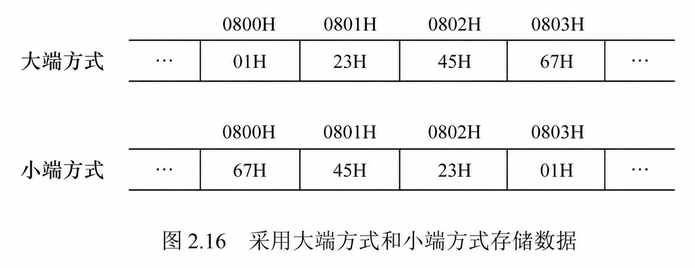

> 考点追踪：根据存放顺序判断大小端方式（2019、2023）

1）**大端方式（big endian）**：MSB 存储在低地址，LSB 存储在高地址，字节顺序与数值的标准十六进制书写顺序一致。

2）**小端方式（little endian）**：LSB 存储在低地址，MSB 存储在高地址，字节顺序与标准书写顺序相反。

在分析机器代码时，需特别注意字节顺序。例如，以下是由反汇编器生成的一行代码：

```text
4004d3: 01 05 64 94 04 08    add eax, 0x08049464
```

其中，4004d3 是指令地址，01 05 64 94 04 08 是指令的机器码，add eax,0x08049464 是其汇编形式。指令的第二个操作数是立即数 0x08049464，其在内存中按地址递增顺序存储为：64H、94H、04H、08H。由于低地址存放的是 LSB（64H），高地址存放的是 MSB（08H），符合小端方式的特征。将这 4 个字节按小端规则重组，即可得到正确的立即数 0x08049464。因此，在阅读小端机器代码时，需要将连续字节按逆序组合才能还原其逻辑数值。

3. **数据按“边界对齐”方式存储**

在字长为 32 位的系统中，边界对齐要求数据的存储地址是其对齐值（通常等于该类型大小，单位：字节）的整数倍：字节可位于任意地址，半字地址须为 2 的倍数，字地址须为 4 的倍数。满足此条件时，CPU 可通过一次访存读取完整数据；否则，若数据跨越两个存储单元，则需两次访存并拼接字节，显著降低效率。为满足对齐要求，编译器会在必要时填充空白字节。这种“以空间换时间”的策略虽然略微增加内存占用，但能大幅提升访问速度。

例如，数据序列“字节 1、字节 2、字节 3、半字 1、半字 2、半字 3、字 1”按边界对齐与非对齐方式存储的格式分别如图 2.17 和图 2.18 所示。

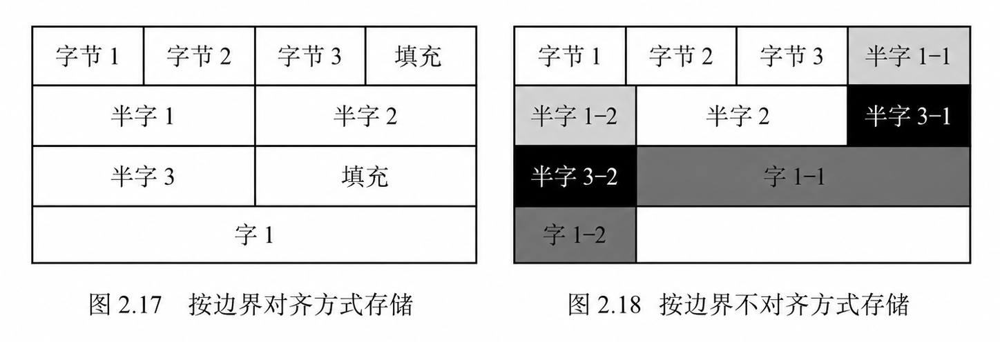

> 考点追踪：结构体的小端、边界对齐存储（2012、2020）

C 语言中，struct 型的内存布局遵循以下对齐规则：

1）每个成员的起始地址必须是其对齐值的整数倍。例如，char 的对齐值为 1，short 为 2，int 为 4。

2）整个结构体的大小必须是其最大成员对齐值的整数倍，不足时在尾部填充。这能保证每个结构体成员的起始地址均满足对齐要求。

先看两个例子（基于 32 位 x86 环境，GCC 编译器）：

```c
struct A{              struct B{
    int a;                 char b;
    char b;                int a;
    short c;               short c;
};                     };
```

结果却是：\(\text{sizeof}(A)=8\)，\(\text{sizeof}(B)=12\)。

设 B 从地址 0x0000 开始，成员 b 的对齐值是 1，其存放地址符合 \(0x0000\%1=0\)；成员 a 的对齐值是 4，需对齐到 4 字节边界，故起始于 0x0004，占据 0x0004～0x0007；成员 c 的对齐值是 2，起始于 0x0008，占据 0x0008～0x0009。此外，结构体长度必须是最大对齐值（4）的整数倍，当前大小 10 字节，需填充至 12 字节（0x000A～0x000B）。

设 A 也从地址 0x0000 开始，成员 a 的对齐值是 4，存放在 0x0000～0x0003；成员 b 的对齐值是 1，存放在 0x0004；成员 c 的对齐值是 2，为满足“起始地址%对齐值=0”的条件，只能存放在 0x0006～0x0007，总大小为 8 字节，无须尾部填充。

精简指令集计算机（RISC）普遍采用边界对齐，以支持高效的指令流水线。

## 2.4 本章小结及疑难点（源 PDF 可见片段）

源 PDF 第 35 页为第二章末尾“本章小结及疑难点”的可见片段。由于前一部分在当前 PDF 中不可见，以下仅整理该页可见内容。

关于定点或整数运算的可见片段：在 \(n\) 位运算中，若结果只保留低 \(n\) 位（即结果对 \(2^n\) 取模），舍去高位，会导致截断后的值不等于真实结果，这种现象称为**无符号溢出**。在运算器中，通常通过进位标志（CF）来检测无符号溢出。

3. **对于位数相同的定点数和浮点数，可表示的浮点数个数比定点数多吗？**

不是。\(n\) 位编码最多表示 \(2^n\) 个不同的比特模式。定点数（如 \(n\) 位补码）通常能表示 \(2^n\) 个互异的有效数值；浮点数中，部分编码用于表示 \(+0\)、\(-0\) 和 NaN 等特殊值，实际可表示的有效实数个数少于 \(2^n\)。因此，在相同位数下，定点数通常能表示更多有效数值。

4. **现代计算机中是否要考虑原码加减运算？如何实现？**

现代计算机一般不实现原码加减运算。尽管 IEEE 754 浮点数的尾数采用原码表示，但尾数本身是无符号的，符号由独立的符号位表示。在加减运算时，硬件根据操作数符号和运算类型，将尾数作为无符号整数送入通用 ALU 进行加或减运算，结果符号由控制逻辑生成。

因此，浮点尾数运算本质上是无符号整数运算，无须原码加减机制。

---

> 当前进度：已完成计算机组成原理 PDF 第3章和第4章的全部可见正文内容整理，已处理至 PDF 第74页末尾 4.6“常见问题和易混淆知识点”，并已确认 Markdown 内容按 PDF 顺序拼接、图片引用与 img 文件夹一致。
>
> 下次任务：第3章和第4章笔记整理已完成；后续可进行最终人工复核、转换 PDF 或合并到完整 408 笔记。

# 第三章 存储系统

【考纲内容】

1. 存储器的分类。
2. 层次化存储器的基本结构。
3. 半导体随机存储器（RAM）：SRAM、DRAM、Flash 存储器。
4. 主存储器：DRAM 芯片和内存条、多模块存储器、主存储器和 CPU 之间的连接。
5. 外部存储器：磁盘存储器、固态硬盘（SSD）。
6. 高速缓冲存储器（Cache）：Cache 的基本原理；Cache 和主存储器之间的映射方式；Cache 中主存块的替换算法；Cache 写策略。
7. 虚拟存储器：虚拟存储器的基本概念；页式虚拟存储器的基本原理、页表、地址转换、TLB（快表）；段式虚拟存储器的基本原理；段页式虚拟存储器的基本原理。

【复习提示】

本章是历年命题重点，特别是有关 Cache 和虚拟存储器的考点容易出综合题。此外，存储器的特点、存储器的扩展（芯片选择、连接方式、地址范围等）、交叉存储器、Cache 的相关计算与替换算法、虚拟存储器与 TLB 也容易出选择题。学习本章时，应在掌握基本原理的基础上，多结合习题反复训练，以加深巩固。同时，还需要掌握存在 Cache 和 TLB 的计算机中地址翻译与 Cache 映射问题，也建议结合《操作系统》存储管理复习。

学习本章时，建议思考以下问题：

1. 存储器系统为何要分这些层次？计算机如何管理这些层次？
2. 影响 Cache 性能的因素有哪些？
3. 虚拟存储系统的页面设置得大一些好还是设置得小一些好？

## 3.1 存储器概述

### 3.1.1 存储器的分类

存储器种类繁多，可以从不同角度进行分类。

1. **按存储元件分类**

存储元件需具备两个可以区分的稳定物理状态，以分别表示二进制数 0 和 1。常用的存储元件主要有半导体器件、磁性材料和光介质。

- 半导体器件利用电荷或电压状态存储信息，构成半导体存储器，如 DRAM、SRAM。
- 磁性材料通过磁化方向表示数据，用于磁表面存储器，如硬盘、磁带。
- 光介质依靠反射率或相变特性记录信息，构成光存储器，如光盘。

2. **按存取方式分类**

> 考点追踪：存储器的分类及特点（2011）

1）**随机存取存储器（RAM）**：可对任意存储单元进行读/写，且存取时间与物理位置无关。其优点是读/写灵活、使用方便，半导体存储器属于此类，常用于主存或高速缓存。

2）**顺序存取存储器**：信息按顺序存放和读出，存取时间取决于数据在介质中的位置，通常以记录块为单位编址。典型代表是磁带，特点是容量大但速度慢。

3）**直接存取存储器**：兼具随机访问和顺序访问的特点。访问时先直接定位到目标区域，再按顺序读取数据。典型代表是传统机械磁盘。

4）**相联存储器**：按内容而非地址进行存取。查找速度快且与存储位置无关，但成本高、容量小，主要用于快表（TLB）、路由表等小容量高速查找场景。

3. **按信息的可更改性分类**

按信息的可更改性，可分为可读可写存储器和只读存储器（Read-Only Memory，ROM）。ROM 中的信息在正常工作时只能读取，通常不可修改，但某些类型（如 E2PROM、Flash）支持特定条件下的重写。RAM 属于可读可写存储器，与 ROM 一样，通常采用随机存取方式。

4. **按信息的可保存性分类**

1）**易失性存储器**：断电后信息立即丢失，如 RAM。

2）**非易失性存储器**：断电后信息仍能保持，如 ROM、Flash 存储器、磁盘和光盘等。

此外，若读取操作会破坏存储单元中的原有信息，则称为破坏性读出，读出后需立即执行再生操作以恢复数据；若读取不改变原内容、无需再生，则称为非破坏性读出。

### 3.1.2 主存储器的组成和基本操作

图 3.1 是主存储器（Main Memory，MM）的基本组成框图。其中，由大量用于存储二进制数 0 或 1 的记忆单元（也称存储元）构成的存储矩阵（也称存储体、存储阵列）是存储器的核心部件。每个记忆单元是一种具有两种稳定物理状态、能够表示 0 和 1 的器件。

为了访问存储体中的信息，必须对存储单元编号（编址）。编址单位是指具有相同地址的一组记忆单元，称为一个存储单元。现代计算机普通采用字节编址方式，即每个地址对应 1 字节（8 位）数据。

> 考点追踪：MAR 和 MDR 位数的决定关系、寻址范围的计算（2021）

当 CPU 执行指令需要访问主存时，首先将目标地址送入存储器地址寄存器（MAR），并通过地址线传至主存的地址寄存器；地址译码器据此选中对应的存储单元。同时，CPU 通过控制线向主存发送读/写控制信号。

- 若为写操作，CPU 将待写入的数据送入存储器数据寄存器（MDR），在控制电路作用下，经数据线写入选中单元。
- 若为读操作，主存将选中单元的内容经数据线送至 MDR。

MDR 的位数等于数据线宽度，MAR 的位数等于地址线位数。图中数据线为 64 位，因此在字节编址下每次可并行存取 8 个字节（64 位 ÷ 8 位/字节 = 8 字节）。地址线的位数决定了主存的最大可寻址范围。例如，36 位地址的寻址范围为 0～\(2^{36}-1\)，共 \(2^{36}\) 个字节（64GB）。

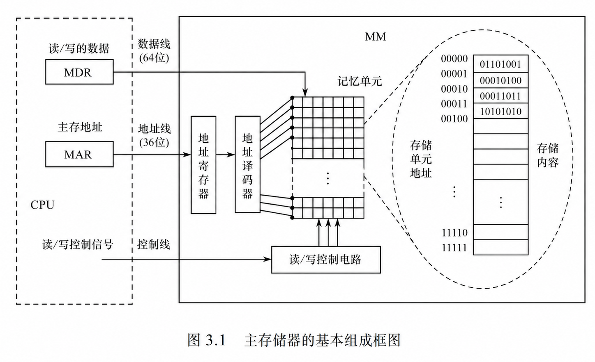

### 3.1.3 存储器的层次化结构

为缓解存储系统在容量、速度与成本之间的矛盾，现代计算机普通采用多级存储器结构（见图 3.2）。从上至下，各层存储器的单位价格逐渐降低，存取速度变慢，容量增大，CPU 访问频率也相应降低。

该层次结构主要体现为两个关键层级：**Cache-主存层**和**主存-辅存层**。其中，Cache 和主存可直接与 CPU 交换信息；辅存则需通过主存间接与 CPU 通信；主存作为枢纽，能与 CPU、Cache 及辅存双向交换数据（见图 3.3）。

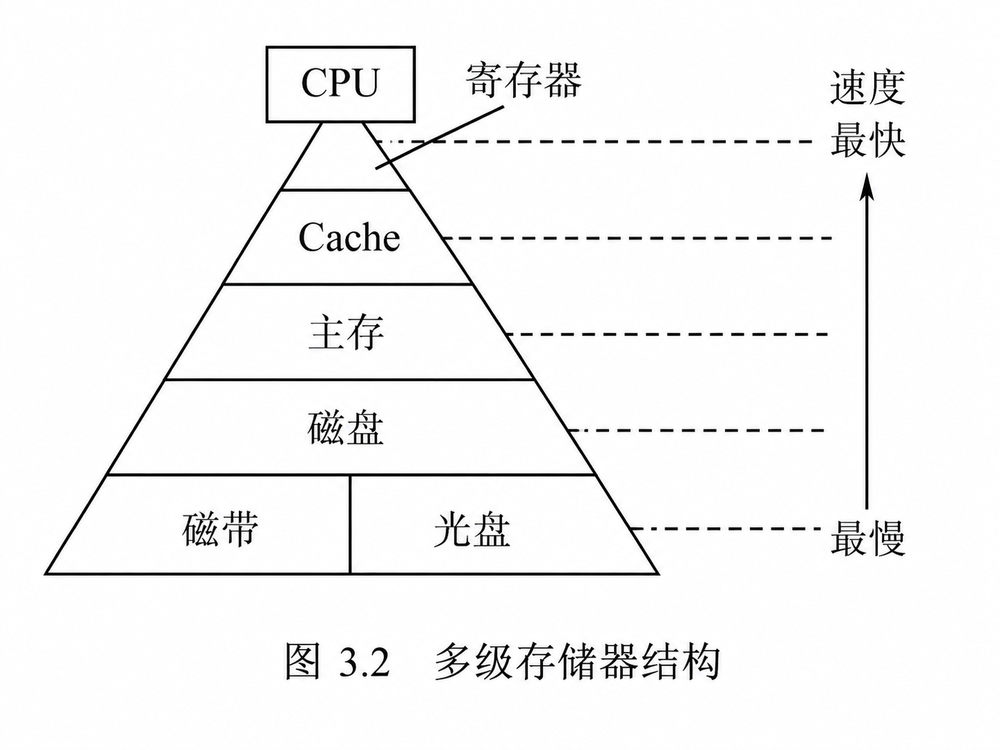

CPU 访问数据时，按 Cache → 主存 → 辅存的顺序逐级查找：若所需数据不在上层，则从下层逐级调入；先从磁盘读入主存，再从主存取数到 Cache。从 CPU 视角看，Cache-主存层的速度接近 Cache，而容量和单位成本接近主存；主存-辅存层的速度接近主存，而容量和单位成本接近辅存。

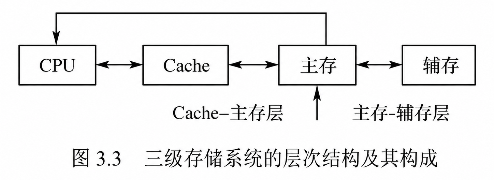

两层机制的主要目标和实现方式不同：

1. **Cache-主存层**用于缓解 CPU 与主存速度不匹配问题，数据调度由硬件自动完成，对所有程序员透明。
2. **主存-辅存层**用于解决存储容量不足问题，数据调度由硬件与操作系统协同完成，对应用程序员透明。

随着主存-辅存层不断发展，逐渐形成了虚拟存储系统。在该系统中，程序员使用的地址空间（虚拟地址空间）远大于实际主存容量，程序可按更大的逻辑地址空间进行编写。

> 注意：在 Cache-主存层和主存-辅存层中，上一层的内容始终是下一层内容的子集副本，即 Cache 中的数据来自主存，主存中的数据来自辅存。
### 3.1.4 存储器的主要性能指标

存储器性能通常从容量、速度、成本等方面衡量。对主存而言，地址线数量决定可寻址的存储单元个数，数据线宽度决定一次并行读/写的数据位数。

1. **存储容量**

存储容量表示存储器能够存放的二进制信息总量，通常可表示为：

\[
\text{存储容量}=\text{存储单元个数}\times \text{存储字长}
\]

若存储器按字节编址，则地址个数就是可访问字节数；若按字编址，则每个地址对应一个存储字。

2. **单位成本**

单位成本表示每位或每字节存储空间对应的成本。存储层次越靠近 CPU，速度越快但单位成本越高；越靠近外存，容量越大但速度越慢。

3. **存取时间**

存取时间是完成一次读/写操作所需的时间。其中，读出时间是指从主存接收到有效地址到数据有效输出的时间；写入时间是指从主存接收到有效地址到数据成功写入指定单元的时间。

4. **存取周期**

存取周期又称读/写周期，表示连续两次独立访问存储器之间所需的最小时间间隔。由于一次访问结束后，存储器内部还可能需要恢复、刷新或稳定，因此存取周期通常不小于存取时间。

5. **存储器带宽**

存储器带宽表示单位时间内存储器能够传送的信息量，常用位/秒或字节/秒表示。它不仅与存取周期有关，也与数据总线宽度和一次传输的数据位数有关。

## 3.2 半导体随机存储器

### 3.2.1 SRAM 和 DRAM

半导体随机存储器主要包括 SRAM 和 DRAM。二者均支持随机访问，且都属于易失性存储器；不同点在于其基本存储元件、刷新需求、读出是否破坏原信息、速度、集成度和成本等方面。

SRAM 通常用触发器保存信息，信息只要不断电即可保持，不需要刷新；读出不会破坏原信息，速度快，但集成度低、成本高，常用于高速缓存。DRAM 用电容保存信息，电容上的电荷会随时间泄漏，因此需要刷新；读出操作具有破坏性，读出后必须再生，速度相对较慢，但集成度高、成本低，常用于主存。

存储芯片通常由存储矩阵、地址译码器、I/O 电路、片选控制线、读/写控制线等部分组成。

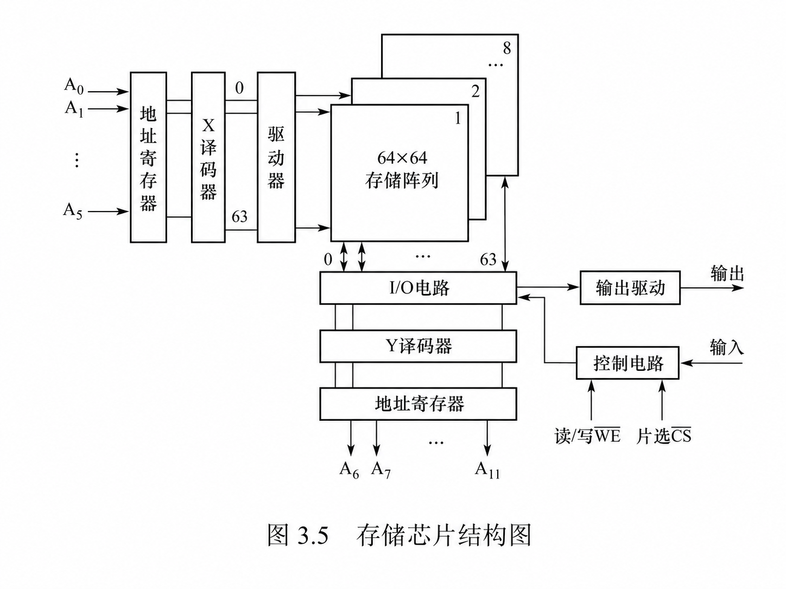

4）**片选控制线**。单个存储芯片容量有限，通常无法满足计算机对主存容量的需求，因此需要将多个芯片组合扩展。在访问某个存储字时，必须“选中”该存储字所在的芯片，而其他芯片不被选中，所以需要片选控制信号，经片选控制线传输。

5）**读/写控制线**。根据 CPU 发出的读/写命令，通过读/写控制线选中单元执行相应操作。

4. **DRAM 芯片的关键技术**

（1）**地址引脚复用技术**

图 3.6 给出了一个 4M×4 位 DRAM 芯片的逻辑结构图。该芯片共有 11 个地址引脚 \(A_0\sim A_{10}\)，在行选通信号 \(\overline{RAS}\) 和列选通信号 \(\overline{CAS}\) 的控制下，分时复用传送行地址和列地址。数据端口有 4 个引脚 \(D_1\sim D_4\)，因此每个芯片可同时读/写 4 位数据。\(\overline{WE}\) 为读/写控制信号，低电平表示写操作；\(\overline{OE}\) 为输出使能信号，低电平有效，高电平时断开输出驱动。

该芯片内部存储阵列采用三维结构，总容量为 \(2048\times 2048\times 4\) 位，即 4M×4 位。因此，行地址和列地址各需 11 位，共 4 个位平面；在任意行与列的交叉点上，4 个位平面上的数据被同时读/写。

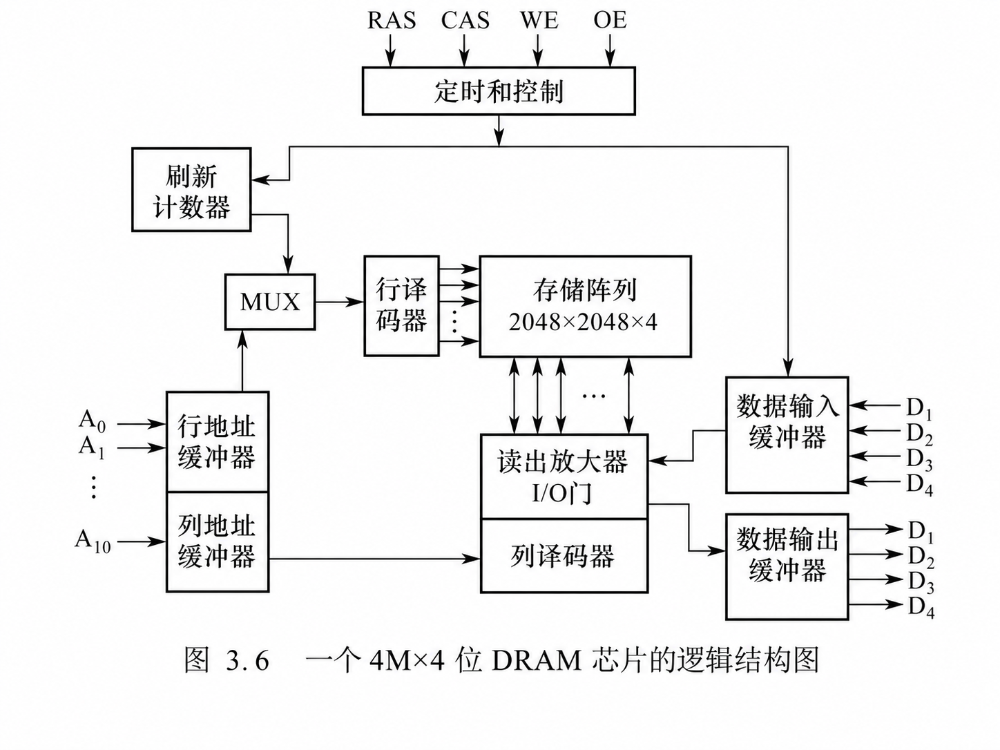

> 考点追踪：DRAM 芯片地址引脚复用技术（2014）

DRAM 芯片容量较大，所需地址位数较多。为减少芯片地址引脚数量，通常采用地址引脚复用技术：行地址和列地址通过相同的引脚分两次先后输入，从而使地址引脚数量减少一半。

（2）**刷新机制与阵列设计优化**

DRAM 芯片需要定期刷新以维持所存信息。刷新时，仅向芯片提供行地址和 \(\overline{RAS}\) 信号，即可选中某一行的所有存储单元并执行读操作。由于 DRAM 采用破坏性读出，每次读取后必须立即再生：若读出为 0，则将电容充分放电；若读出为 1，则重新充电。

对于图 3.6 所示的 \(2048\times 2048\times 4\) 存储阵列，只需进行 2048 次刷新操作即可完成全芯片刷新。刷新按整行进行，无须列地址。芯片内部集成一个刷新计数器，可自动产生刷新所需的行地址，其位数与行地址位数相同。行地址缓冲器与刷新计数器通过多路选择器（MUX）共享通往行译码器的地址通路。刷新周期定义为对某一特定行完成一次刷新后，到下一次对该行再次刷新的时间间隔。

> 考点追踪：DRAM 芯片行、列设计优化原则（2018）

若一个 DRAM 芯片的存储容量为 \(2^n\times b\) 位，其存储阵列的行数为 \(r\)，列数为 \(c\)，则满足 \(2^n=r\times c\)。整个阵列的地址位数为 \(n\)，其中行地址占 \(\log_2 r\) 位，列地址占 \(\log_2 c\) 位。由于 DRAM 采用地址引脚复用技术，引脚数量由行、列地址位数中较大者决定。为了最小化地址引脚数，应使 \(r\) 与 \(c\) 尽可能接近。此外，DRAM 按行刷新，行数越少，刷新开销越低，因此通常还需满足 \(r\le c\)。综合考虑，常将阵列设计为行数略小于或等于列数的近似正方形结构。

（3）**缓存机制与突发传输**

> 考点追踪：DRAM 芯片行缓冲器容量的计算（2022）

图 3.7 展示了一个 DRAM 芯片的简化示意图。该芯片容量为 16×8 位，存储阵列为 4 行×4 列。由于采用地址引脚复用技术，仅需 2 根地址线，分时传送 2 位行地址和 2 位列地址。每个存储单元包含 8 位数据，因此需要 8 根数据线。

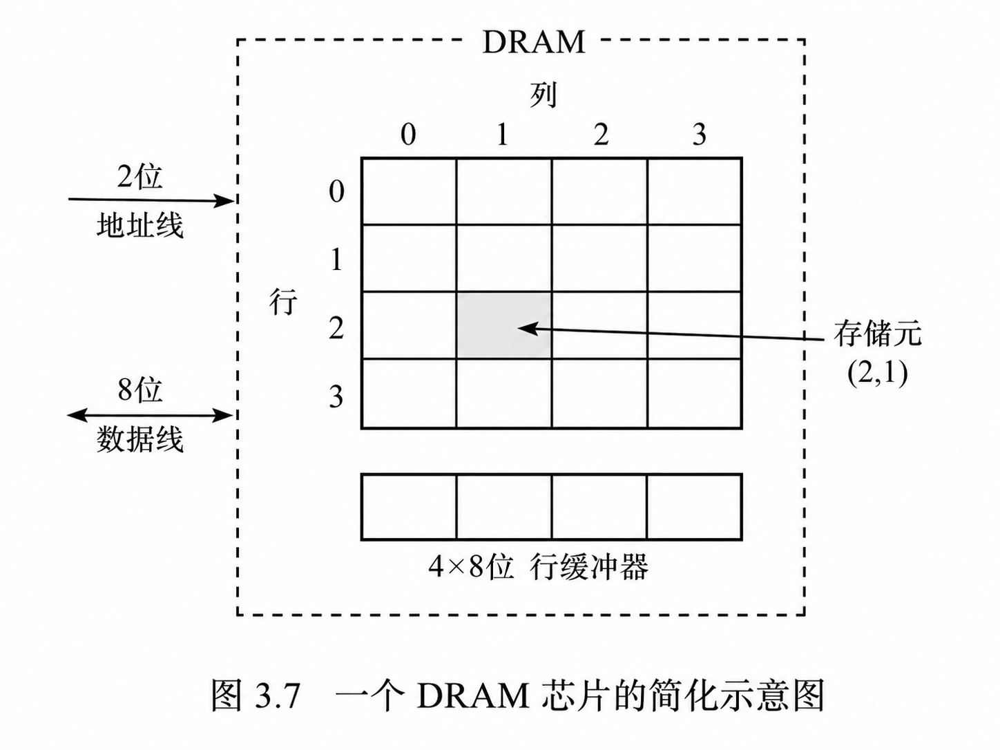

芯片内部设有一个行缓冲器（通常由 SRAM 实现），用于缓存被选中行中所有列的数据。其容量等于一行中所有存储单元的数据总量，即：

\[
\text{行缓冲器容量}=\text{列数}\times\text{每个存储单元的位数}
\]

例如图 3.7 中，行缓冲器容量为 \(4\times 8=32\) 位。当某一行被选中后，该行全部数据被一次性加载到行缓冲器中，后续可以在每个时钟周期连续输出一个存储单元的数据（8 位），从而支持突发传输。也就是说，在寻址阶段给出首地址，随后连续读取多个相邻存储单元的数据，可显著提高有效带宽。

5. **同步 DRAM**

目前更广泛使用的是 SDRAM（同步 DRAM）。与传统异步 DRAM 不同，SDRAM 的数据读/写操作与系统时钟同步，能够以 CPU—主存总线的较高速率运行。在连续访问同一行（页）内的数据时，可实现突发传输，显著减少甚至避免插入等待状态。

在异步 DRAM 中，CPU 发出地址和控制信号后，必须等待一段不确定的延迟时间才能获得数据或完成写入；在此期间，CPU 不断轮询存储器状态信号，无法执行其他任务，从而降低整体执行效率。SDRAM 在系统时钟驱动下工作，它将 CPU 发出的地址和控制信号锁存，并在预设的若干时钟周期后返回数据或完成写入，使 CPU 无须等待，可在延迟期间执行其他指令，从而显著提升系统性能。

6. **SRAM 和 DRAM 的比较**

表 3.1 总结了 SRAM 和 DRAM 的主要特点。

| 特点 | SRAM | DRAM |
|---|---|---|
| 存储信息 | 触发器 | 电容 |
| 破坏性读出 | 非 | 是 |
| 需要刷新 | 不需要 | 需要 |
| 送行列地址 | 同时送 | 分两次送（复用） |
| 运行速度 | 快 | 慢 |
| 集成度 | 低 | 高 |
| 存储成本 | 高 | 低 |
| 主要用途 | 高速缓存 | 主机内存 |

### 3.2.2 非易失性存储器

1. **只读存储器（ROM）的特点**

> 考点追踪：RAM 和 ROM 的区别（2010）

RAM 与 ROM 均支持随机访问，但 ROM 属于非易失性存储器，具有两个显著优点：一是结构简单，位密度高于 SRAM 等可读/写存储器；二是断电后数据不丢失，可靠性高。

根据制造工艺和可编程性，ROM 可分为掩模式 ROM（MROM）、一次可编程 ROM（PROM）和可擦除可编程 ROM（EPROM）等类型。MROM 由厂商固化，用户不可更改；PROM 允许用户进行一次性编程；EPROM 虽支持多次编程，但每次擦除需用紫外线照射整片芯片，且擦写次数有限、写入速度慢，难以满足主存对高速随机读/写的要求，因此无法替代 RAM。

2. **Flash 存储器**

> 考点追踪：Flash 存储器的特点（2012）

计算机中许多固定信息需要长期保存在非易失性存储器中，如系统启动所需的 BIOS（Basic Input/Output System）。早期 BIOS 固化在 MROM 或 EPROM 中，无法更新；现代主板通常采用 Flash 存储器存储 BIOS，用户可通过厂商提供的工具直接在系统中擦除并重写。

Flash 存储器（又称闪存）是在 EPROM 基础上发展而来的非易失性存储器，兼具 ROM 与 RAM 的部分优点：断电后信息可长期保存；支持电擦除与在线重写，无须紫外线照射等特殊设备；读取速度接近 RAM。但其写入速度明显较慢，读/写性能不对称。

3. **固态硬盘（SSD）**

固态硬盘（Solid State Drive，SSD）是基于 Flash 存储器构建的存储设备，由控制单元和存储单元（Flash 存储器芯片阵列）组成。它继承了 Flash 存储器的重要特性，非易失、无机械部件、读取速度快。相比传统硬盘，SSD 具有读/写速度快、功耗低、抗震性强等优势；缺点是价格较高，且写入寿命受限于 Flash 存储器的擦写次数。

### 3.2.3 多模块存储器

多模块存储器是一种空间并行技术，通过多个结构完全相同的存储模块并行工作来提高存储器吞吐率。由于 CPU 的速度远高于存储器，若能在一个存取周期内连续获得多条指令或多个数据字，便可更充分利用 CPU 资源，提高系统性能。多体交叉存储器正是基于这一思想设计的。

根据模块间地址分配方式不同，多模块存储器可分为连续编址和交叉编址两种结构。

1. **连续编址方式**

连续编址方式采用高位地址作为模块号（或体号），低位地址作为模块内地址（或体内地址）。如图 3.8 所示，存储器共有 4 个模块 \(M_0\sim M_3\)，每个模块有 \(n\) 个单元，各模块地址范围依次排列。

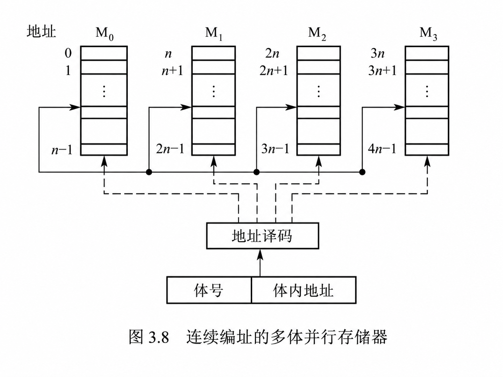

在连续编址方式下，低位的体内地址总是被送到由高位体号确定的模块内进行译码。访问一个连续主存块时，总是先在一个模块内访问，直到该模块访问完成后才转到下一个模块访问。由于 CPU 按顺序访问存储模块，各模块不能并行访问，因此无法提高存储器的吞吐率。

> 注意：模块内的地址是连续的，存取方式仍是串行存取，因此这种存储器本质上仍属于顺序存储器。

2. **交叉编址（低位交叉）方式**

> 考点追踪：交叉存储器中数据的存放方式（2017）

交叉编址方式采用低位地址作为模块号（体号），高位地址作为模块内地址。假设有 \(m\) 个模块，每个模块含 \(k\) 个存储单元，则模块编号由地址对 \(m\) 取模决定，即：

\[
\text{模块号}=\text{单元地址}\bmod m
\]

如图 3.9 所示，单元 \(0,m,\cdots,(k-1)m\) 位于模块 \(M_0\)；单元 \(1,m+1,\cdots,(k-1)m+1\) 位于模块 \(M_1\)，其余依此类推。

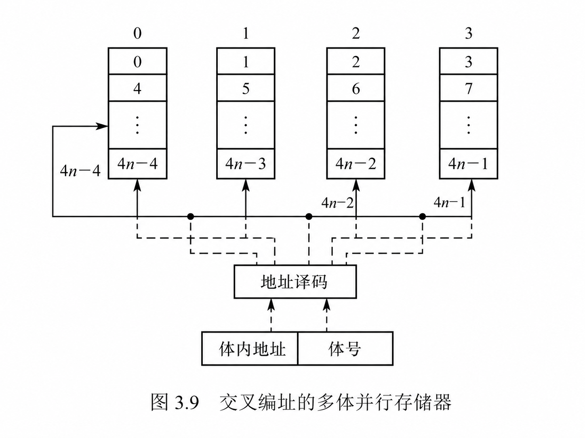

在交叉编址方式下，连续地址的数据被依次分布到不同模块中，程序或数据块在物理上是“交叉存放”的。采用这种方式的多模块存储器称为交叉存储器。通过多个结构完全相同的存储模块并行工作，该设计能够在访问连续地址时显著提高存储器的吞吐率。

交叉存储器可以采用轮流启动或同时启动两种方式。

（1）**轮流启动方式**

若每个模块一次读/写的位数正好等于数据总线位数，模块的存取周期为 \(T\)，总线周期为 \(r\)，则为实现轮流启动方式，存储器交叉模块数应满足：

\[
m=\frac{T}{r}
\]

## 3.3 主存储器和 CPU 之间的连接

### 3.3.1 主存储器的扩展

在实际组成主存时，单片存储芯片往往不能同时满足系统对**数据位数**和**存储单元数**的要求，因此需要通过多片存储芯片扩展主存。扩展方法主要包括位扩展、字扩展以及字位同时扩展。PDF 第43页给出了位扩展法和字扩展法的连接示意。

1. **位扩展法**

位扩展用于增加存储字的长度，适用于 **CPU 数据总线宽度大于单个芯片数据位宽** 的情况。通过并联多个芯片，使总数据位宽与 CPU 数据总线匹配。

连接方式如下：

- 各芯片的地址线并联，接到系统地址总线对应位。
- 各芯片的片选线和读/写控制线并联，接到系统对应控制线。
- 各芯片的数据线分别连接到系统数据总线的不同位。
- 所有芯片同时工作，共同提供一个完整的存储字。

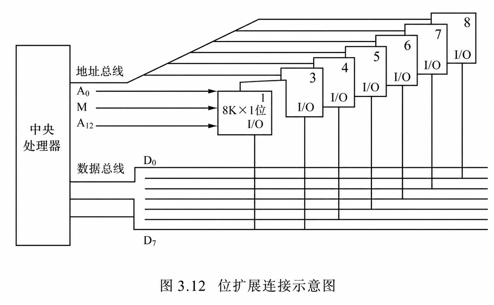

例如，用 8 片 8K×1 位 RAM 芯片构成 8K×8 位存储器时，8 片芯片的地址线 \(A_{12}\sim A_0\)、片选线和读/写控制线均并接在一起；每片芯片的数据线依次对应 CPU 数据总线的一位，从而 8 片芯片同时输出或写入 8 位数据。

2. **字扩展法**

字扩展用于增加存储单元的数量，即扩大地址空间；适用于**单片芯片的数据位宽已经满足系统要求，而地址空间不够**的情况。此时，系统数据总线宽度等于芯片数据位宽，而系统地址总线位数多于单片芯片地址线位数。

连接方式如下：

- 各芯片的地址线连接到系统地址总线的低位。
- 各芯片的数据线、读/写控制线并联到系统总线。
- 系统地址总线的高位送入译码器，由译码器输出片选信号。
- 每一时刻只有一个芯片被选中，各芯片分时工作。

> 考点追踪：字扩展（或字位扩展）后存储芯片的地址范围（2010，2016）

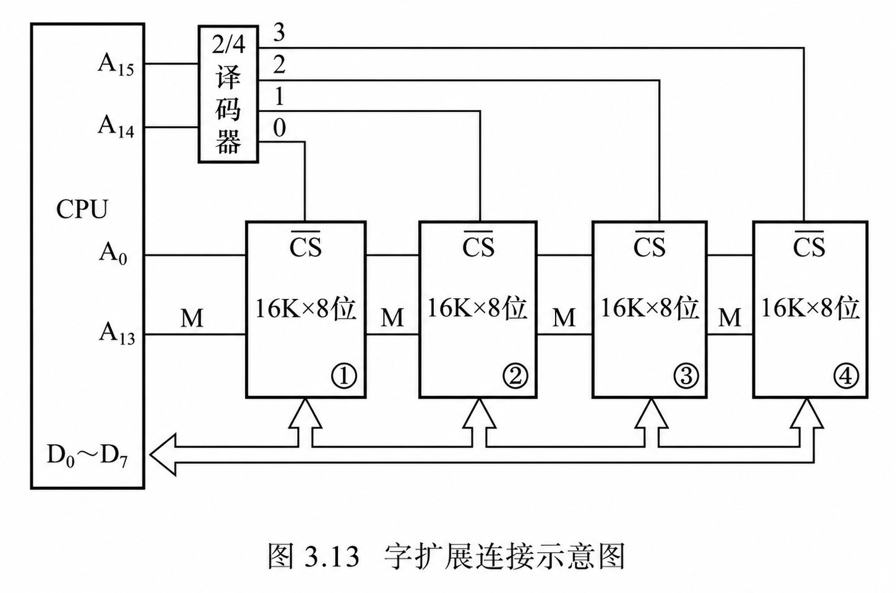

例如，用 4 片 16K×8 位 RAM 芯片构成 64K×8 位存储器时，所有芯片的数据线 \(D_0\sim D_7\) 并联至系统数据总线；地址线 \(A_{15}\)、\(A_{14}\) 作为高位地址输入 2/4 译码器，产生 4 个片选信号。片选关系和地址范围如下：

| 高位地址 \(A_{15}A_{14}\) | 被选芯片 | 最低地址 | 最高地址 |
|---|---|---|---|
| 00 | 第 1 片 | 0000000000000000 | 0011111111111111 |
| 01 | 第 2 片 | 0100000000000000 | 0111111111111111 |
| 10 | 第 3 片 | 1000000000000000 | 1011111111111111 |
| 11 | 第 4 片 | 1100000000000000 | 1111111111111111 |

由此可见，字扩展的核心是：**低位地址定位芯片内部单元，高位地址通过译码器选择具体芯片**。

## 3.4 外部存储器

### 3.4.1 磁盘存储器

1. **磁盘的存储区域**

磁盘由多个记录面组成，每个记录面含若干同心磁道，每条磁道又划分为若干扇区。

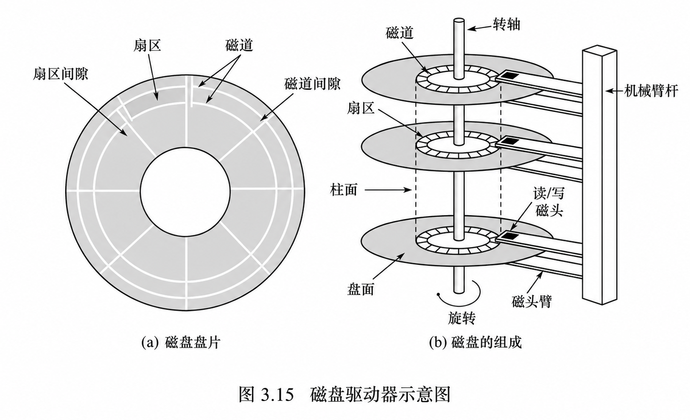

磁盘存储区域中的几个基本概念如下：

- **记录面数**：表示磁头数量，每个磁头负责一个记录面的数据读/写。
- **柱面数**：表示单个记录面上的磁道数量。所有记录面上编号相同的磁道构成一个柱面。
- **扇区数**：表示每条磁道所包含的扇区数量。扇区是磁盘读/写的最小单位。

相邻的磁道和扇区之间通常用间隙隔开，以防止读/写错误。扇区按固定圆心角划分，因此从外圈到内圈，位密度逐渐增加；磁盘的存储能力受限于最内圈的最大记录密度。

2. **磁盘高速缓存**

磁盘高速缓存（Disk Cache）是在内存中开辟的一部分空间，用于暂存待写入磁盘的数据。

磁盘常以**簇**为单位进行写操作，簇由若干连续扇区组成。使用磁盘高速缓存有两个作用：

- 减少频繁的小块写入，提高写操作效率。
- 若中间结果在写回磁盘前又被再次使用，可直接从缓存读取，减少磁盘访问。

3. **磁记录原理**

磁记录的基本原理是：当磁头和磁性记录介质发生相对运动时，通过电磁转换实现数据的读/写。

在编码方法上，系统按照特定规则，把二进制数据序列转换为磁层中对应的磁化翻转状态序列，使读/写控制电路能够高效、可靠地完成信号转换。

4. **磁盘的性能指标**

（1）**记录密度**

记录密度指单位面积上可存储的二进制数据量，常用道密度、位密度和面密度表示。

- **道密度**：沿磁盘半径方向单位长度上的磁道数。
- **位密度**：单条磁道单位长度上可记录的二进制位数。
- **面密度**：位密度与道密度的乘积，反映单位面积的存储能力。

（2）**磁盘容量**

磁盘容量分为非格式化容量和格式化容量。

- **非格式化容量**：磁记录表面可利用的磁化单元总数。


\[
\text{非格式化容量}=\text{记录面数}\times\text{柱面数}\times\text{每磁道磁化单元数}
\]

- **格式化容量**：按特定格式组织后实际可用的存储容量。


\[
\text{格式化容量}=\text{记录面数}\times\text{柱面数}\times\text{每道扇区数}\times\text{每扇区字节数}
\]

由于需要预留扇区间隙、同步字段等格式开销，因此：


\[
\text{非格式化容量}>\text{格式化容量}
\]

（3）**响应时间与存取时间**

> 考点追踪：磁盘存取时间的计算（2013，2015，2022）

磁盘处理一次读/写请求的完整过程包括：请求排队、控制器解析以及寻道、旋转等待和数据传输。因此，总响应时间为：


\[
\text{响应时间}=\text{排队延迟}+\text{控制器时间}+\text{寻道时间}+\text{旋转等待时间}+\text{数据传输时间}
\]

其中，**寻道时间 + 旋转等待时间 + 数据传输时间**也称为存取时间，是衡量磁盘性能的核心指标。

- **寻道时间**：磁头移动到目标磁道所需的时间。平均寻道时间通常取最大寻道时间的一半。
- **旋转等待时间**：目标扇区旋转到磁头下方所需的时间。平均旋转等待时间等于磁盘旋转半周的时间。
- **数据传输时间**：读出或写入一个扇区所需的时间，取决于磁盘转速和数据密度。

（4）**数据传输率**

数据传输率指磁盘在单位时间内向主机传送的数据量，单位为 B/s。若磁盘转速为每秒转数 \(r\)，单位磁道容量为 \(N\) 字节，则最大数据传输率为：

\[
D_r=rN
\]

5. **磁盘地址**

> 考点追踪：磁盘地址结构的计算（2022）

主机向磁盘控制器发送寻址信息。磁盘地址通常由三部分组成：


\[
\text{磁盘地址}=\text{柱面（磁道）号}+\text{盘面（磁头）号}+\text{扇区号}
\]

例如，若磁盘有 16 个盘面，每个盘面有 256 个磁道，每个磁道划分为 16 个扇区，则每个扇区的地址可用 16 位二进制代码表示，其中：

| 字段 | 位数 |
|---|---:|
| 柱面号 | 8 位 |
| 盘面号 | 4 位 |
| 扇区号 | 4 位 |

6. **磁盘的工作过程**

磁盘的主要操作包括寻址、读盘和写盘。每种操作对应一个控制字。磁盘工作时，首先读取控制字，然后执行相应控制操作。由于磁盘是机械式部件，因此其读/写操作按串行方式执行。

7. **磁盘阵列**

RAID（独立冗余磁盘阵列）是指将多个独立的物理磁盘组合成一个逻辑磁盘，使数据在多个物理盘上交叉分割存储并行访问，从而获得更高的存储性能、可靠性与安全性。

> 考点追踪：提高 RAID 可靠性的措施（2013）

在 RAID1～RAID5 等方案中，当任意磁盘发生故障时，可以随时拔出损坏磁盘并插入新盘，系统仍能恢复或维持数据完整性，从而显著提升可靠性。

RAID 的常见分级如下：

| 级别 | 含义 |
|---|---|
| RAID0 | 无冗余、无校验的磁盘阵列 |
| RAID1 | 镜像磁盘阵列 |
| RAID2 | 采用海明码进行纠错的磁盘阵列 |
| RAID3 | 位交叉奇偶校验的磁盘阵列 |
| RAID4 | 块交叉奇偶校验的磁盘阵列 |
| RAID5 | 无独立校验盘的分布式奇偶校验磁盘阵列 |

RAID0 将连续的多个数据块交替存放在不同物理磁盘的扇区中，利用多个磁盘交叉并行读/写，即条带化技术。它不仅扩展了存储容量，还显著提高了存取速度，但不具备容错能力。

RAID1 通过两个磁盘同步进行读/写操作，互为镜像备份。当一个磁盘故障时，可从另一磁盘完整读取数据；但这种方案的有效容量会减半，即两盘仅相当于一盘使用。

综上，RAID 主要通过以下方式提高存储系统性能和可靠性：

- 通过多磁盘并行工作提高数据传输速率。
- 通过并行存取大幅提高存储系统吞吐量。
- 通过镜像实现高可用性。
- 通过校验机制提高容错能力。

### 3.4.2 固态硬盘

固态硬盘（SSD）是一种基于闪存技术的存储设备。其存储介质与 U 盘类似，但容量更大、存取性能更优。一个 SSD 由一个或多个闪存芯片以及闪存翻译层组成；其中，闪存芯片替代了传统磁盘中的机械驱动器。
## 3.5 高速缓冲存储器

### 3.5.1 程序访问的局部性原理

Cache 利用程序访问的局部性提高存储系统性能。PDF 此处通过二维数组访问顺序说明：程序功能相同，但数组元素在主存中的存放顺序与访问顺序不同，会导致空间局部性和 Cache 命中情况存在显著差异。

程序 B 按列访问二维数组：

```text
程序B访问方向：
a[0][0], a[1][0], …, a[2047][0];
a[0][1], a[1][1], …, a[2047][1]; …
```

访问顺序与数组在主存中的存放顺序不一致。若 Cache 块的交换单位小于 8KB，则每次访问几乎都会落在不同的 Cache 行中，空间局部性较差。两个程序中，数组 `a` 的时间局部性均较差，因为每个数组元素仅被访问一次。

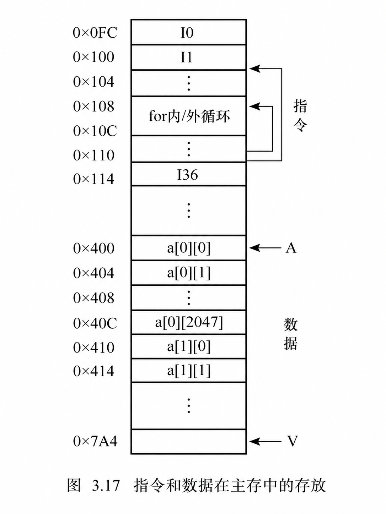

> 考点追踪：程序中指令 Cache 的命中率分析（2014）

对于 `for` 循环体的指令访问，程序 A 与程序 B 的局部性表现相同。因为循环体内的指令在内存中连续存放、顺序执行，空间局部性良好；整个循环执行次数为 2048×2048 次，时间局部性也良好。

综上，尽管程序 A 与程序 B 功能完全相同，但由于内外循环顺序不同，导致对数组 `a` 的访问空间局部性存在巨大差异，进而造成实际执行效率显著不同。

### 3.5.2 Cache 的基本工作原理

为便于 Cache 与主存交换信息，Cache 和主存都被划分为大小相等的块。Cache 块也称 Cache 行，每块由若干字节组成，块的长度称为块长，也称行长。由于 Cache 容量远小于主存容量，因此 Cache 中的块数要远少于主存中的块数，Cache 中只保存主存中最近活跃的若干块副本。系统可按照某种策略预测 CPU 在未来一段时间内待访存的数据，并将其装入 Cache。

1. **Cache 的访问过程**

> 考点追踪：Cache 命中对 CPU 执行时间影响的分析（2013，2015）

图 3.18 给出了典型的 Cache 访问流程。CPU 执行程序时，每当需要从主存取指令或读/写数据，首先访问 Cache。

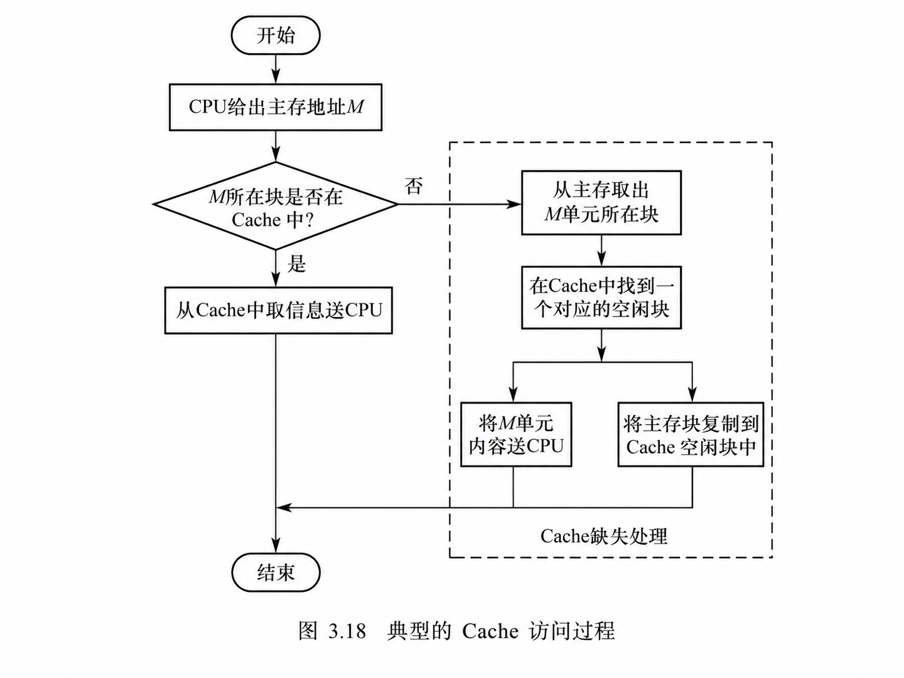

- 若所需信息已经在 Cache 中，称为 **Cache 命中**，CPU 可直接从 Cache 读取或写入，无须访问主存。
- 若未命中，也称缺失，则需要从主存中把该地址所在的一个主存块整体调入 Cache，并将该块写入某个 Cache 行。若 Cache 已满，则按替换算法选择被替换块。随后 CPU 再从 Cache 中取得所需数据。

整个访问过程包括命中判断、块调入、替换等操作，必须在单条指令执行周期内完成，因此通常完全由硬件实现。Cache 机制对程序员透明。

上述访问过程是“先查 Cache，未命中再访主存”的方式。部分系统采用“并行访问”策略，即同时查询 Cache 和主存；若 Cache 命中，则提前终止主存访问。考试中通常不涉及这种并行访问策略。

2. **Cache 的命中率分析**

> 考点追踪：Cache 命中率的分析与计算（2009，2025）

CPU 所需访问的信息已经在 Cache 中的概率称为 **Cache 命中率**。设程序执行期间，Cache 命中次数为 \(N_c\)，访问主存的次数为 \(N_m\)（未命中次数），则命中率 \(H\) 定义为：

\[
H=\frac{N_c}{N_c+N_m}
\]

命中时，CPU 直接从 Cache 读取数据，耗时为命中时间 \(T_c\)，也就是访问 Cache 的时间。未命中时，需要先从主存读取包含目标数据的一个主存块并送入 Cache，再将所需数据送至 CPU，总耗时为 \(T_m+T_c\)。其中，\(T_m\) 称为块失效损失，即从主存调入一个块所需的时间。

因此，Cache-主存系统的平均访问时间 \(T_a\) 为：

\[
T_a=HT_c+(1-H)(T_m+T_c)=T_c+(1-H)T_m
\]

> 考点追踪：Cache 缺失率对主存带宽的影响（2012）

**例 3.2** 设 Cache 的速度是主存的 5 倍，且 Cache 的命中率为 95%，采用 Cache 后，存储器性能提升多少？假设系统先访问 Cache，未命中时才访问主存。

解：设 Cache 的存取时间为 \(t\)，则主存的存取时间为 \(5t\)。系统的平均访问时间为：

\[
T=0.95t+0.05(t+5t)=1.25t
\]

也可等价理解为：

\[
T=\text{命中时的访问时间}+\text{缺失时的访存开销}\times\text{缺失率}
=t+0.05\times5t=1.25t
\]

采用 Cache 后，存储器性能提升为原来的：

\[
\frac{5t}{1.25t}=4
\]

根据 Cache 的访问过程可知，学习 Cache 结构需要重点解决以下问题：

1. **数据查找**：如何快速判断所需数据是否在 Cache 中。
2. **地址映射**：主存块如何存放在 Cache 中，以及如何将主存地址转换为 Cache 地址。
3. **替换策略**：当 Cache 已满时，采用何种策略选择被替换的 Cache 行。
4. **写入策略**：如何在保证主存与 Cache 数据一致性的前提下，尽可能提高写操作效率。

### 3.5.3 Cache 和主存的映射方式

由于 Cache 行数远少于主存块数，Cache 只能存放主存中部分块的副本。为识别每个 Cache 行对应哪个主存块，需要为每行设置一个标记位，用于记录其主存块号；同时设置一位有效位，用于指示该行数据是否有效。系统启动或复位时，所有 Cache 行均无效；只有当主存块被装入某 Cache 行后，其有效位才置为 1。

地址映射是指将主存地址空间按一定规则映射到 Cache 地址空间，即决定主存块如何装入 Cache。常见的映射方式有直接映射、全相联映射和组相联映射。

1. **直接映射**

主存中的每一块只能装入 Cache 中唯一指定的位置。若该位置已有内容，则发生块冲突，原块被无条件替换，因此无须替换算法。直接映射实现简单，但灵活性差，即使 Cache 中其他行空闲，也不能用于存放该主存块，因此块冲突概率最高，空间利用率最低。

> 考点追踪：直接映射的地址结构及映射关系的分析（2010，2011，2015）

直接映射关系可表示为：

\[
\text{Cache 行号}=\text{主存块号}\bmod \text{Cache 总行数}
\]

设 Cache 共有 \(2^c\) 行，主存共有 \(2^m\) 块。则主存的第 0 块、第 \(2^c\) 块、第 \(2^{c+1}\) 块等均映射到 Cache 的第 0 行；主存的第 1 块、第 \(2^c+1\) 块、第 \(2^{c+1}+1\) 块等均映射到 Cache 的第 1 行，以此类推。

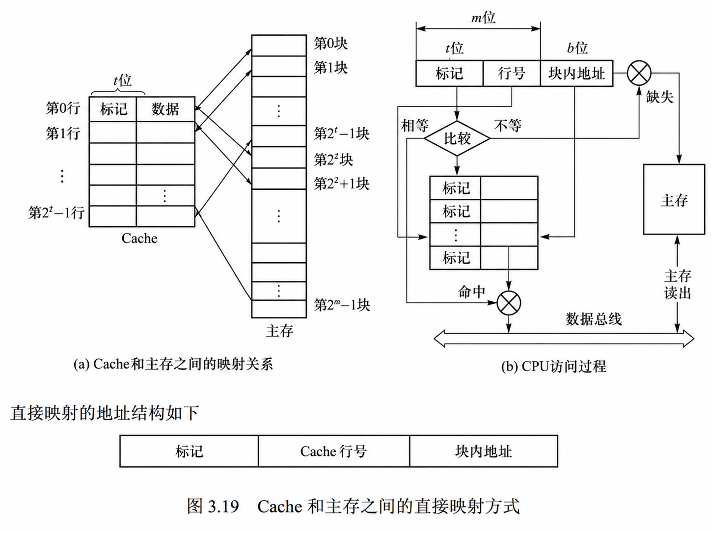

由此可见，主存块号的低 \(c\) 位即为其对应的 Cache 行号。为标识来源，每个 Cache 行还需要设置长度为 \(t=m-c\) 的标记。当某主存块调入 Cache 后，将其块号的高 \(t\) 位写入对应 Cache 行的标记字段中。

直接映射的地址结构如下：

| 标记 | Cache 行号 | 块内地址 |
|---|---|---|

CPU 访问过程如下：根据访存地址中的 \(c\) 位确定 Cache 行，将该 Cache 行中的标记与主存地址的高 \(t\) 位进行比较。若标记相等且有效位为 1，则 Cache 命中，根据地址低位的块内地址从该 Cache 行中读取数据；若标记不等或有效位为 0，则 Cache 未命中，CPU 需从主存读取该地址所在块，将其装入对应 Cache 行，置有效位为 1，更新标记为地址高 \(t\) 位，并将所需数据送至 CPU。

2. **全相联映射**

主存中的每一块可以装入 Cache 中的任何位置。每行的标记用于指出该行来自主存的哪一块，因此 CPU 访存时需要与所有 Cache 行的标记进行比较。

全相联映射的优点是：

1. Cache 块的冲突概率低。
2. 只要 Cache 中还有空闲行，就不会发生冲突。
3. Cache 空间利用率高。
4. Cache 命中率高。

全相联映射的缺点是：

1. 标记比较速度较慢。
2. 实现成本较高，通常需要使用按内容寻址的相联存储器。

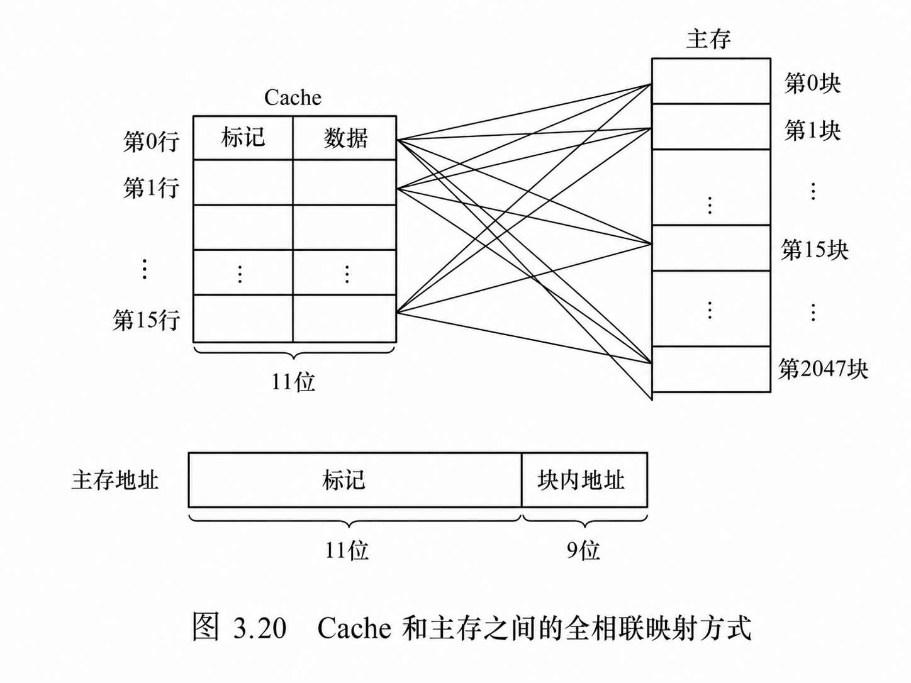

全相联映射的地址结构如下：

| 标记 | 块内地址 |
|---|---|

CPU 访问过程如下：首先将主存地址的高位标记与 Cache 各行的标记进行比较。若有一个相等且对应有效位为 1，则 Cache 命中，此时根据块内地址从该 Cache 行中取出信息；若都不相等或有效位为 0，则 Cache 未命中，此时 CPU 从主存中读出该地址所在的一块信息装入 Cache 中的任意一个空闲行，置有效位为 1，并设置标记，同时将所需数据送至 CPU。

> 考点追踪：根据地址结构和比较器数量判断映射方式（2018）

通常为每个 Cache 行都设置一个比较器，比较器位数等于标记字段长度。访存时根据标记字段内容访问 Cache 行中的主存块，因此其查找过程是一种按内容访问的存取方式，属于相联存储器。这种方式的时间开销和硬件开销都较大，不适合大容量 Cache。

3. **组相联映射**

> 考点追踪：组相联映射的原理（2009，2016，2018～2020，2023）

将 Cache 划分为 \(Q\) 个大小相等的组，每个主存块只能映射到固定组中的任意一行，即组间采用直接映射，组内采用全相联映射。组相联映射是直接映射与全相联映射的折中方案。

当 \(Q=1\) 时，整个 Cache 只有一个组，退化为全相联映射；当 \(Q=\text{Cache 总行数}\) 且每组仅 1 行时，退化为直接映射。设每组包含 \(r\) 个 Cache 行，则称为 \(r\) 路组相联映射。

随着路数 \(r\) 增大，组内可选位置越多，块冲突概率越低，但所需比较器数量和控制逻辑也越复杂。合理选择 \(r\)，可在硬件成本接近直接映射的同时，获得接近全相联映射的性能。

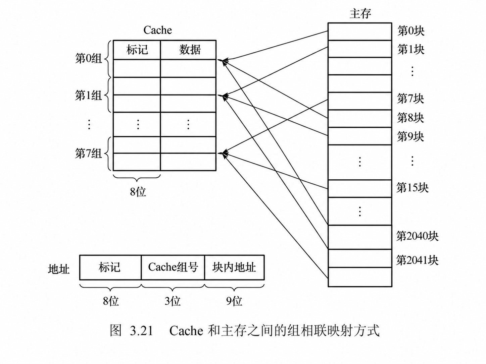

> 考点追踪：组相联映射的地址结构及映射关系的分析（2025）

组相联映射关系可表示为：

\[
\text{Cache 组号}=\text{主存块号}\bmod \text{Cache 组数}(Q)
\]

组相联映射的地址结构如下：

| 标记 | 组号 | 块内地址 |
|---|---|---|

> 考点追踪：组相联映射的访问过程及 Cache 缺失处理过程（2020）

CPU 访存过程如下：

1. 根据访存地址中的组号字段确定目标 Cache 组。
2. 将该组内所有 Cache 行的标记与主存地址的高位标记并行比较。
3. 若某行标记匹配且有效位为 1，则 Cache 命中，根据块内地址从该行读取数据。
4. 若所有行均不匹配或匹配行的有效位为 0，则 Cache 未命中，CPU 从主存读取该地址所在块，将其装入该组中任意一个空闲行；若无空闲行，则按替换算法选择一行。随后置有效位为 1，写入标记，并将所需数据送至 CPU。

> 考点追踪：组相联映射中比较器的个数和位数（2022）

直接映射中每块仅对应一个唯一的 Cache 行，因此只需设置 1 个比较器；而 \(r\) 路组相联映射需要在同一组的 \(r\) 个 Cache 行中进行比较，因此需设置 \(r\) 个比较器。

在 Cache 容量和主存块大小固定的条件下，三种映射方式的特性对比如下：

| 对比项 | 直接映射 | 组相联映射 | 全相联映射 |
|---|---|---|---|
| 命中率 | 最低 | 介于两者之间 | 最高 |
| 判断开销与访问时间 | 最小、最快 | 介于两者之间 | 最大、最慢 |
| 标记存储开销 | 最少 | 介于两者之间 | 最多 |

### 3.5.4 Cache 中主存块的替换算法

在全相联映射或组相联映射中，当 Cache 要装入一个新的主存块而 Cache 行或 Cache 组已经装满时，需要通过替换算法选择被替换的 Cache 行。直接映射中，每个主存块只能映射到唯一的 Cache 行，因此对应行被占用时只能直接覆盖旧块，无须替换算法。

常用替换算法如下。

1. **随机（RAND）算法**：随机选择一个 Cache 行进行替换。实现简单，但没有利用程序访问的局部性原理，命中率通常较低。
2. **先进先出（FIFO）算法**：替换最早装入的 Cache 行。实现较容易，但未考虑局部性原理，最早装入的块可能仍是当前频繁访问的块，因此命中率不高。

> 考点追踪：组相联映射中 LRU 算法的命中率分析（2012，2021）

3. **最近最少使用（LRU）算法**：基于程序访问的局部性原理，优先替换最近最久未被访问的 Cache 行。通常其命中率高于 FIFO，是本节重点。

> 考点追踪：LRU 替换及其位数的计算（2018，2020）

在硬件实现中，LRU 算法为每组 Cache 维护一组计数器（常称 LRU 替换位），用于记录各 Cache 行的相对访问顺序。LRU 位数取决于组内路数：2 路组相联需要 1 位 LRU 位，4 路组相联需要 2 位 LRU 位。

PDF 中给出的例子为：采用 4 路组相联，5 个主存块 \(1,2,3,4,5\) 映射到同一 Cache 组，访问序列为 \(1,2,3,4,5,1,2,3,4,5\)。表中左侧数字表示对应 Cache 行的 LRU 计数值，右侧数字表示主存块号。

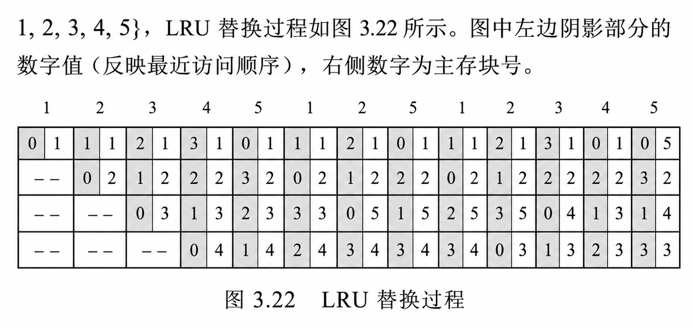

计数器的更新规则如下：

1. **命中时**：命中行的计数器清零；比其低的计数器加 1；其余不变。
2. **未命中且有空闲行时**：新装入行的计数器置 0；其他非空闲行全加 1。
3. **未命中且无空闲行时**：替换计数值最大的行；新装入行的计数器置 0；其余全加 1。

当被频繁访问的主存块数量超过 Cache 每组可容纳的行数时，可能导致连续缺失。例如，若访问序列为 \(1,2,3,4,5,1,2,3,4,5,\ldots\)，而 Cache 每组只有 4 行，则每次访问第 5 个块都会逐出下一次将被访问的块，使命中率趋近于 0，这种现象称为抖动。

4. **最不经常使用（LFU）算法**：替换一段时间内累计访问次数最少的 Cache 行。每行设置一个计数器，新行装入时计数器初始化为 0，每次访问该行时计数器加 1；替换时选择计数值最小的行。LFU 与 LRU 的思想不同：LRU 关注最近是否用过，LFU 关注总共用了多少次。

### 3.5.5 Cache 的一致性问题

由于 Cache 中的内容是主存块的副本，当对 Cache 执行写操作时，必须采用合适的写策略，使 Cache 与主存数据保持一致。根据写操作是否命中 Cache，可分为写命中和写不命中两类。

1. **Cache 写命中的处理方法**

> 考点追踪：直写法的原理及特点（2015，2020）

（1）**全写法（直写法，Write Through）**

当 CPU 对 Cache 写命中时，数据同时写入 Cache 和主存。由于主存始终与 Cache 保持同步，因此替换 Cache 块时可以直接覆盖，无须写回。该方法实现简单，能保证主存数据的实时正确性，但每次写操作都需要访问主存，降低了系统性能。

为缓解直写法的性能开销，可以在 Cache 与主存之间设置写缓冲（Write Buffer）。CPU 将数据同时写入 Cache 和写缓冲，写缓冲再异步地把数据写入主存。写缓冲可缓解 CPU 与主存之间的速度差异，但容量有限；当写缓冲已满时，CPU 仍需等待。

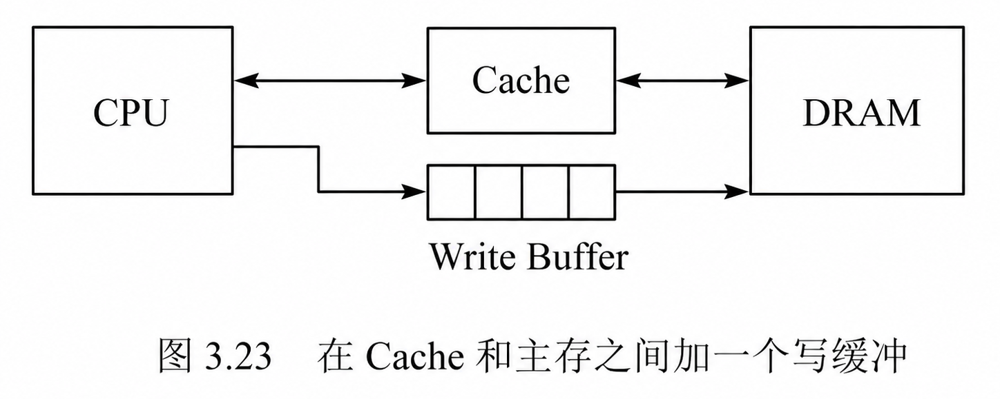

> 考点追踪：回写法的原理及应用（2018，2020）

（2）**回写法（Write Back）**

当 CPU 对 Cache 写命中时，只把数据写入 Cache，不立即写入主存。只有当该 Cache 块被替换出 Cache 时，才写回主存。这种方法减少了主存访问次数，提高了 Cache 效率，但存在数据不一致的风险。

为判断替换时是否需要写回主存，每个 Cache 行设置一个修改位（又称脏位）：

- 脏位为 1：表示该行数据已经被修改，替换时必须写回主存。
- 脏位为 0：表示该行数据与主存一致，替换时可以直接覆盖。

需要注意：直写法无须脏位，因为主存始终同步；回写法必须设置脏位。

2. **Cache 写不命中的处理方法**

（1）**写分配法（Write Allocate）**

当发生写不命中时，先将数据写入主存的对应单元，然后将该主存块调入 Cache 的一个空闲行中。该方法利用了程序的空间局部性，但每次写不命中都要把主存块加载到 Cache 中。

（2）**非写分配法（Not-Write-Allocate）**

当发生写不命中时，直接将数据写入主存，不把主存块调入 Cache。

### 3.5.6 Cache 容量的计算举例

计算 Cache 总容量时，需要同时考虑 Cache 行的数据部分和每行的标记信息，即：

\[
\text{Cache 总容量}= (\text{每行标记位数}+\text{每行数据位数})\times \text{Cache 总行数}
\]

> 考点追踪：Cache 标记信息的分析（2015，2021）

每行的标记信息通常包括：有效位、标记位、脏位和 LRU 替换位。其中，有效位和标记位是所有 Cache 必须包含的；脏位在采用回写策略时存在；LRU 替换位在使用 LRU 算法时存在，其位数取决于组内行数。图 3.24 展示了不同映射方式下 Cache 各字段的组成与分布。

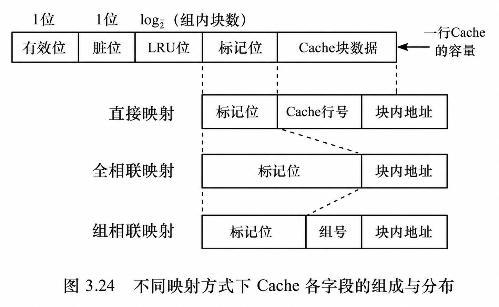

> 考点追踪：标记位分析及总容量的计算（2010，2021）

**例 3.3** 假设某计算机的主存地址空间大小为 256MB，按字节编址，其数据 Cache 有 8 个 Cache 行，行长为 64B。请回答：

1. 若不考虑脏位和替换算法控制位，并采用直接映射方式，求该数据 Cache 的总容量。
2. 若采用直接映射方式，主存地址为 3200（十进制）的主存块对应的 Cache 行号是多少？若采用 2 路组相联映射，对应的 Cache 组号及可能的行号是多少？
3. 以直接映射方式为例，简述访存过程（设访存地址为 0123456H）。

解：

1. 主存地址位数为 28 位，因为主存地址空间为 256MB，即 \(2^{28}B\)。块内地址位数为 6 位，因为 \(64B=2^6B\)。Cache 行号为 3 位，因为 Cache 行数为 8，即 \(2^3\)。因此标记位数为 \(28-6-3=19\) 位。每行含 1 位有效位和 19 位标记位，共 20 位标记信息；每行数据部分为 \(64B=512\) 位。因此：

\[
\text{Cache 总容量}=8\times(512+1+19)=4256\text{ 位}
\]

2. 主存地址 3200 对应的主存块号为：

\[
3200B/64B=50
\]

直接映射中，Cache 共有 8 行，因此：

\[
50\bmod 8=2
\]

所以对应 Cache 行号为 2。

若采用 2 路组相联映射，则 Cache 共有 8 行、每组 2 行，因此共有 4 组。组号为：

\[
50\bmod 4=2
\]

所以该块可映射到第 2 组中的任意一行，对应 Cache 行号为 4 或 5。

3. 在直接映射方式中，28 位主存地址可划分为 19 位标记位、3 位块号、6 位块内地址。访存地址 0123456H 中，0000 0001 0010 0011 010 为标记位，001 为块号，010110 为块内地址。访问时，根据行号 010 访问 Cache 第 2 行，比较其标记与地址高 19 位，并检查有效位；若匹配且有效位为 1，则命中，按块内地址 010110 读取数据并送至 CPU；否则未命中，从主存读取该块，写入 Cache 第 2 行，更新标记为地址高 19 位，并置有效位为 1。

思考：若第 1 问采用 2 路组相联映射，则 Cache 总容量的计算还需结合主存与 Cache 的划分关系，推导 2 路组相联映射下的主存地址结构，并简述其访存过程。

### 3.5.7 Cache 的应用

（1）**分离 Cache**

> 考点追踪：采用分离的指令与数据 Cache 的目的（2014）

随着指令流水技术的发展，现代处理器通常将指令 Cache 和数据 Cache 分开设计，形成分离 Cache。其核心目的在于降低取指访问与数据访存之间的冲突，使 CPU 在流水执行过程中能够更好地并行完成取指和读/写数据操作。

## 3.6 虚拟存储器

### 3.6.2 页式虚拟存储器

1. **页表**

图 3.27 是一个页表示例。页表中常见字段如下：

- **有效位**（也称装入位）：表示对应虚页是否已经调入主存。若为 1，表示该页已在主存；若为 0，表示未调入，页表项通常保存该页在外存（如磁盘）中的地址。
- **物理页号**：记录该虚页调入主存后所在的物理页框号。
- **脏位**（也称修改位）：表示页面是否被修改过。在采用回写策略的虚拟存储系统中，置换页面时根据脏位决定是否需要将其写回磁盘。
- **引用位**（也称使用位）：记录页面是否被访问过，主要用于实现基于使用历史的页面替换算法，如 Clock 或 LRU 算法。

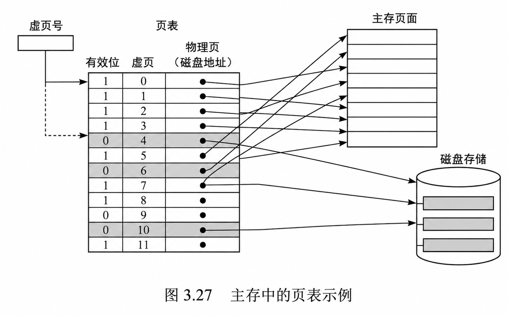

> 考点追踪：数组的分页存放、缺页分析与处理过程（2014，2019，2023，2025）

以图 3.27 的页表为例，若 CPU 访问第 1 页，有效位为 1，说明该页已驻留主存，地址转换部件将虚拟地址转换为物理地址，CPU 即可访问对应物理页中的数据。若访问第 5 页，有效位为 0，则发生缺页异常，系统调用缺页处理程序。该程序根据页表项中的外存地址，将该页从磁盘调入一个空闲的物理页框；若主存已满，则需选择一个页面进行置换。由于系统采用回写策略，换出页面时根据脏位决定是否写回磁盘。缺页处理完成后，更新页表中的相应项。

页式虚拟存储器的优点是：页面大小固定，页表结构简单，调入操作方便。缺点是：程序大小通常不是页长的整数倍，导致最后一页产生内部碎片；此外，页是物理划分单位，缺乏逻辑意义，因此在程序模块化、保护和共享方面不如段式虚拟存储器灵活。

2. **地址转换**

> 考点追踪：虚拟地址结构的分析（2011，2019，2021，2024）

程序生成的地址是虚拟地址，CPU 执行指令时必须先将虚拟地址转换为物理地址，才能访问主存中的指令或数据。虚拟地址分为两部分：高位为虚页号，低位为页内偏移；物理地址同样分为高位物理页号和低位页内偏移。由于页面大小相同，两者的页内偏移完全一致。虚拟地址到物理地址的转换通过页表实现，页表是一张存放在主存中的虚页号与物理页号的映射表。

> 考点追踪：虚拟地址与物理地址的转换（2011，2013，2018，2022）

系统通过页表基址寄存器指向当前进程的页表起始地址。地址转换时，首先从虚拟地址中提取虚页号，并与页表基址相加得到页表项地址；然后查询页表项。若该页表项有效位为 1，则从中取出物理页号，并与虚拟地址中的页内偏移拼接，形成最终物理地址；若有效位为 0，则发生缺页异常，需要由操作系统进行缺页处理。页式虚拟存储器的地址变换过程如图 3.28 所示。

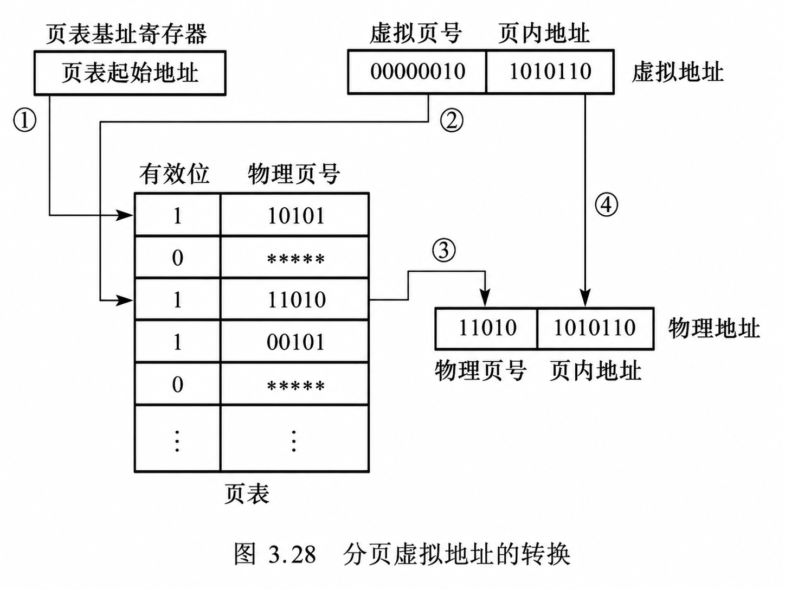

3. **快表（TLB）**

由地址转换过程可知，每次访存都需要先访问主存中的页表以获得物理页号，再访问主存取得实际数据，因此采用虚拟存储机制后，平均访存次数增加，性能下降。

> 考点追踪：TLB 的硬件实现（2018），TLB 和 Cache 的比较（2020）

根据程序访问的局部性原理，在一段时间内 CPU 往往集中访问少数页面。若这些页面对应的页表项缓存在由高速 SRAM 构成的快表（TLB）中，则可在地址转换时避免访问主存中的页表，从而显著提升效率。相应地，主存中的页表常被称为慢表（Page）。

> 考点追踪：TLB 映射方式、地址划分与标记字段的分析（2016，2021）

TLB 的工作原理类似于 Cache，通常采用全相联或组相联映射。TLB 表项包含虚拟页号（作为标记）和对应的物理页号及控制位（如有效位、脏位等）。在全相联映射下，TLB 标记即为完整的虚拟页号；在组相联映射下，虚拟页号的高位作为标记，低位作为组索引。

4. **具有 TLB 和 Cache 的多级存储系统**

> 考点追踪：具有 TLB 的虚拟存储系统的地址变换过程（2024）

图 3.29 为一个具有 TLB 和 Cache 的多级存储系统，其中 Cache 采用 2 路组相联映射方式。CPU 给出一个 32 位的虚拟地址，TLB 采用全相联结构，每项均配备一个比较器。地址转换时，将虚拟地址中的虚页号与所有 TLB 项的标记字段并行比较；若某一项匹配且有效位为 1，则 TLB 命中，直接从中获取实页号，完成地址转换。若 TLB 未命中，则需访问主存中的页表（慢表）以获取对应的页表项，完成地址转换后再将其装入 TLB；若 TLB 已满，则需执行替换算法。

获得物理地址后，Cache 根据映射方式将其划分为标记、组号和块内地址三个字段。首先利用组号定位到对应的 Cache 组，再将该组中各 Cache 行的标记字段与物理地址的标记字段并行比较；若某一行匹配且有效位为 1，则 Cache 命中，再根据块内地址取出对应数据并送至 CPU。

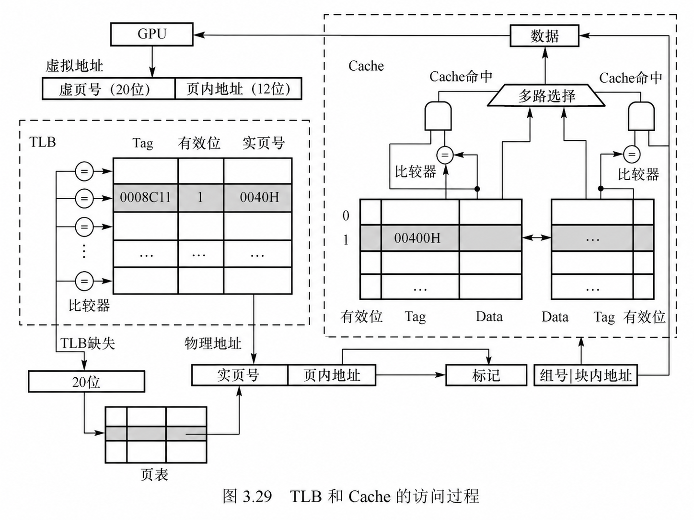

通过 TLB 缓存频繁访问的页表项，系统避免了每次地址转换都访问主存页表，从而在引入虚拟存储器的同时，几乎不降低访存性能。
5. **TLB、Page、Cache 三种缺失的可能组合**

> 考点追踪：TLB、Cache 和 Page 缺失组合的分析（2010）

一次 CPU 访存可能涉及 TLB、页表（Page）、Cache、主存和磁盘等多个层次。CPU 访存过程中可能出现三类缺失：

1. **TLB 缺失**：要访问的虚页号不在 TLB 中。
2. **Cache 缺失**：要访问的主存块不在 Cache 中。
3. **Page 缺失**：要访问的页面不在主存中。

TLB 是页表项的缓存，因此 Page 缺失时，TLB 必然缺失。Cache 是主存的副本，因此 Page 缺失时，Cache 中也不可能有对应数据。带 TLB 的虚拟存储器 CPU 访存过程如图 3.30 所示。

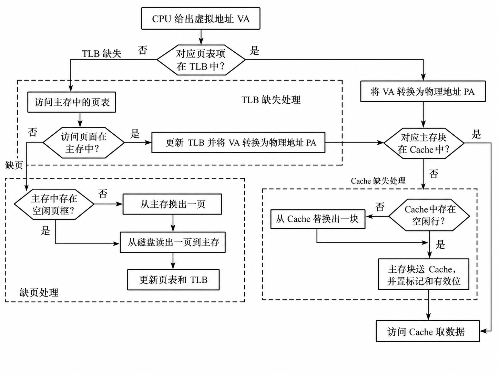

TLB、Page、Cache 三种缺失的可能组合如下表。

| 序号 | TLB | Page | Cache | 说明 |
|---|---|---|---|---|
| 1 | 命中 | 命中 | 命中 | TLB 命中则 Page 一定命中，信息在主存，就可能在 Cache 中。 |
| 2 | 命中 | 命中 | 缺失 | TLB 命中则 Page 一定命中，信息在主存，也可能不在 Cache 中。 |
| 3 | 缺失 | 命中 | 命中 | TLB 缺失但 Page 可能命中，信息在主存，就可能在 Cache 中。 |
| 4 | 缺失 | 命中 | 缺失 | TLB 缺失但 Page 可能命中，信息在主存，也可能不在 Cache 中。 |
| 5 | 缺失 | 缺失 | 缺失 | TLB 缺失则 Page 也可能缺失，信息不在主存，也一定不在 Cache 中。 |

由表可得：

1. 第 1 种组合最好，TLB 和 Cache 均命中，无须访问主存。
2. 第 2 种和第 3 种组合都需要访问一次主存。
3. 第 4 种组合需要访问两次主存。
4. 第 5 种组合发生“缺页异常”，需要访问磁盘，并至少访问两次主存。

其中，Cache 缺失处理由硬件自动完成；缺页处理由操作系统通过“缺页异常处理程序”完成，具体步骤包括调入所需页面、更新页表等。TLB 缺失既可用硬件处理，也可用软件处理。

> 注意：在《操作系统考研复习指导》的第 3 章中，也介绍了同时具有 TLB 和 Cache 的存储系统中虚实地址转换的实例，读者可结合该内容进行学习。

### 3.6.3 段式虚拟存储器

段式虚拟存储器中的段是按照程序的逻辑结构划分的，各个段的长度因程序而异。虚拟地址分为两部分：**段号**和**段内地址**。虚拟地址到物理地址的变换由段表实现。

段表是程序的逻辑段与其在主存中存放位置的对照表。每行记录某个段的段号、有效位、段起点和段长等信息。由于段的长度可变，段表中必须给出各段的起始地址与段长。

CPU 根据虚拟地址访问时，先从虚拟地址中提取段号，并根据段表基址地址找到对应的段表项；然后检查该段表项的有效位：

1. 若有效位为 1，表示该段已调入主存，则从段表中读出该段在主存中的起始地址，再与段内地址相加，得到对应的物理地址。
2. 若有效位为 0，表示该段不在主存中，需要进行相应处理。

段式虚拟存储器的地址变换过程如图 3.31 所示。

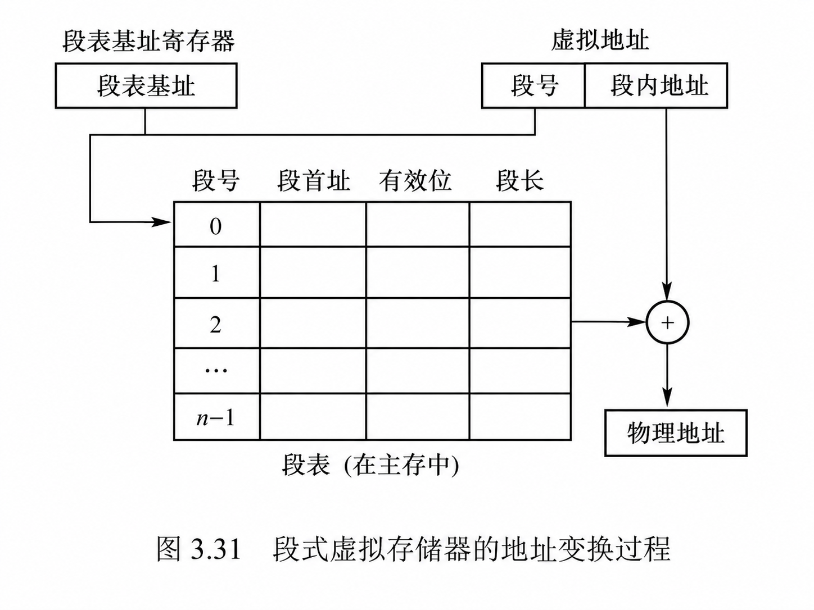

段式虚拟存储器的优点是：段的边界与程序的自然逻辑边界一致，具有良好的逻辑独立性，便于程序的编译、管理、修改和保护，也便于实现多道程序间的段共享。缺点是：段长度可变，主存分配困难，段间容易产生外部碎片，难以有效利用主存，造成存储空间浪费。

### 3.6.4 段页式虚拟存储器

在段页式虚拟存储器中，程序先按逻辑结构分段，每段再划分为固定大小的页；主存空间也划分为大小相等的页。程序对主存的调入和调出仍以页为基本交换单位。

段页式系统中，每个程序对应一个段表，每段对应一个页表。虚拟地址由三部分组成：段号、段内页号和页内地址。CPU 根据虚拟地址访问时：

1. 先用段号查找段表，获得该段对应页表的起始地址。
2. 再以段内页号为索引访问页表，取出实页号。
3. 最后将实页号与页内地址拼接，形成物理地址。

段页式虚拟存储器兼具页式和段式的优点：既支持按段进行共享和保护，又避免了段式存储的外部碎片问题。缺点是地址变换过程中需要两次查表，系统开销较大。

### 3.6.5 虚拟存储器与 Cache 的比较

> 考点追踪：虚拟存储器与 Cache 的比较（2024）

虚拟存储器与 Cache 既有相同之处，又有不同之处。

1. **相同之处**

1）最终目标都是提高系统性能，两者都体现了容量、速度、价格的折中。

2）都把数据划分为小信息块作为基本交换单位，只是虚拟存储器的页通常比 Cache 块大得多。

3）都涉及地址映射、替换算法和更新策略等问题。

4）都基于局部性原理，采用“快速缓存”思想，把活跃数据放在高速部件中。

2. **不同之处**

1）Cache-主存层主要用于提升访问速度，使系统访问速度接近 Cache；主存-辅存层主要用于扩展可用存储容量，使程序员看到的地址空间和单位价格接近辅存，而访问速度接近主存。

2）Cache 与主存之间的信息调度由硬件自动完成，对程序员透明；主存与辅存之间的信息调度通过虚拟存储技术实现，该技术结合软件与硬件。程序员使用远大于物理内存的虚拟地址空间编程；程序运行时，由硬件和操作系统协同完成虚拟地址到物理地址的转换。

## 3.8 常见问题和易混淆知识点

1. **Cache 行的大小和命中率之间有什么关系？**

当 Cache 行较大时，能够更好地利用空间局部性，把更多相关数据一次性调入 Cache，从而提高命中率。但行长并不是越大越好：

1）行长过大会增加缺失损失，即未命中时需要从主存读取更多数据，传输时间更长。

2）在 Cache 总容量固定的情况下，行长增大会导致 Cache 行数减少，降低地址映射的灵活性，反而可能降低命中率。

反之，行长过小虽然使缺失代价较小，但难以有效利用空间局部性，命中率通常偏低。因此需要在空间局部性、缺失损失和 Cache 行数之间折中选择。

2. **发生取指令 Cache 缺失的处理过程是什么？**

当发生取指令 Cache 缺失时，系统按以下步骤处理：

1）保持程序计数器不变，确保缺失处理完成后能重新获取同一条指令。

2）根据 PC 指向的地址，从主存读取该指令所在主存块。

3）将该指令所在主存块调入 Cache，并更新对应 Cache 行的有效位和标记位。

4）重新从 Cache 中取指并继续执行。

# 第四章 指令系统

【考纲内容】

1. 指令格式的基本概念。
2. 指令格式。
3. 寻址方式。
4. 数据的对齐和大小端存放方式。
5. CISC 和 RISC 的基本概念。
6. 高级语言程序与机器级代码之间的对应：编译器、汇编器与链接器的基本概念；选择结构语句的机器级表示；循环结构语句的机器级表示；过程（函数）调用对应的机器级表示。

【复习提示】

指令系统是表征一台计算机性能的重要因素，应掌握各种寻址方式的特点及有效地址的计算，三种偏移寻址（相对寻址、基址寻址和变址寻址）的地址计算方法，以及 CISC 与 RISC 的特点与区别。

2022 年大纲新增机器级表示相关内容，而机器级代码题型在历年统考中多次出现，需要具备读懂汇编代码的能力。本章知识点既可能出选择题，也可能结合其他章节出有关指令的综合题。指令格式、机器指令、寻址方式与 CPU 指令执行过程密切相关，需要重点掌握。

学习本章时，建议思考以下问题：

1. 什么是指令？什么是指令系统？为什么要引入指令系统？
2. 一般来说，指令由哪些部分组成？各部分的作用是什么？
3. 对一个指令系统而言，寻址方式多少会带来什么影响？

## 4.1 指令系统

### 4.1.1 指令集体系结构

> 考点追踪：指令集体系结构（ISA）的内容（2022，2025）

机器指令（简称指令）是指示计算机执行某种操作的命令。一台计算机所有指令的集合构成该机的指令系统，也称指令集。指令系统是指令集体系结构（Instruction Set Architecture，ISA）中最核心的部分。ISA 完整定义了软件与硬件之间的接口，是机器语言或汇编语言程序员必须掌握的基础。

ISA 规定的内容主要包括：

1. 指令格式、寻址方式、操作类型，以及各操作所需操作数的个数、类型和寻址约束。
2. 操作数的数据类型，以及是按大端还是小端方式存放。
3. 程序可访问的寄存器编号、数量和位数，存储空间的大小及编址方式。
4. 程序员可见的控制状态，如程序计数器、条件码的定义与行为等。

ISA 规定了机器级程序的格式，因此机器语言或汇编语言程序员必须熟悉所用机器的 ISA。通常，大多数程序员使用高级语言（如 C/C++/Java）编程，抽象层较高，隐藏了许多机器级细节；这降低了程序员直接利用硬件结构优化程序性能的可能。若能充分理解 ISA 及底层硬件特性，就更有可能开发出性能更好的程序。

### 4.1.2 指令的基本格式

一条指令是机器语言中的一个语句，由一组有意义的二进制代码组成。其基本格式如下：

| 操作码字段 | 地址码字段 |
|---|---|
| OP | A |

其中，**操作码**指明指令应执行的操作及功能，是识别指令、理解其作用以及确定地址码含义的关键。例如，指出该指令是算术加法或减法、程序转移或返回等。**地址码**给出被操作信息（指令或数据）的地址，包括源操作数地址、目的操作数地址、转移目标地址，或者给出寄存器号、立即数等。

指令字长是指一条指令所包含的二进制位数，取决于操作码长度、地址码长度及地址码个数。在一个指令系统中：

1. 若所有指令字长相等，称为**定长指令字结构**。定长指令取指和译码简单，有利于流水线实现。
2. 若指令字长随功能而异，称为**变长指令字结构**。由于主存通常按字节编址，因此指令字长通常为字节的整数倍。

根据指令中操作数地址码数目的不同，可将指令分为以下几种格式。

> 考点追踪：根据指令格式及相关编码条件组合成机器代码（2015）

1. **零地址指令**

零地址指令只包含操作码，无显式地址。格式如下：

| OP |
|---|

零地址指令常见于两种情况：

1）无操作数指令，如空操作、停机、关中断等。

2）用于堆栈计算机的运算指令。其操作数隐含地从栈顶和次栈顶弹出，运算结果压回栈顶。

2. **一地址指令**

一地址指令格式如下：

| OP | A1 |
|---|---|

其具体形式由操作码确定，常见有两种：

1）**单操作数指令**：按 A1 地址读取操作数，执行 OP 操作后结果存回 A1。指令含义可写为：

	destination: A1
	operation: OP(A1) -> A1

例如加 1、减 1、求反、求补、移位等。

2）**累加器型双操作数指令**：A1 为源操作数地址，另一操作数隐含在 ACC 中，结果存入 ACC。指令含义可写为：

	destination: ACC
	operation: (ACC) OP (A1) -> ACC

若地址码均为主存地址，则完成一条一地址指令需要 3 次访存：取指 1 次、取数 1 次、存结果 1 次。

3. **二地址指令**

二地址指令格式如下：

| OP | A1 | A2 |
|---|---|---|

指令含义为：

	destination: A1
	operation: (A1) OP (A2) -> A1

在二地址指令中，A1 为目的操作数地址（兼结果地址），A2 为源操作数地址。若地址码均为主存地址，则完成一条二地址指令需要 4 次访存：取指 1 次、取两个操作数 2 次、存结果 1 次。

4. **三地址指令**

三地址指令格式如下：

| OP | A1 | A2 | A3（结果） |
|---|---|---|---|

指令含义为：

	destination: A3
	operation: (A1) OP (A2) -> A3

在三地址指令中，A1 和 A2 为两个源操作数地址，A3 为结果地址。若地址码均为主存地址，则完成一条三地址指令需要 4 次访存：取指 1 次、取两个操作数 2 次、存结果 1 次。

### 4.1.3 定长操作码指令格式

> 考点追踪：定长操作码的指令条数（2015）

定长操作码指令在指令字的最高位部分分配固定定位数表示操作码。一个 n 位操作码字段的指令系统最多可表示 \(2^n\) 条指令。定长操作码有利于简化硬件设计并提高译码速度。在字长为 32 位或更长的系统中，这种格式较常用。

### 4.1.4 扩展操作码指令格式

> 考点追踪：扩展操作码的设计与分析（2017，2021，2022）

为了在有限的指令字长内支持丰富的指令种类，常采用可变长度操作码，即指令的操作码字段位数不固定，并分散在指令的不同位置。这会增加指令译码和分析的难度，使控制器设计更复杂。最常见的变长操作码方法是**扩展操作码**。

扩展操作码的基本思想是：操作码长度随地址码数的减少而增加，不同地址数的指令具有不同长度的操作码，从而有效缩短指令字长。

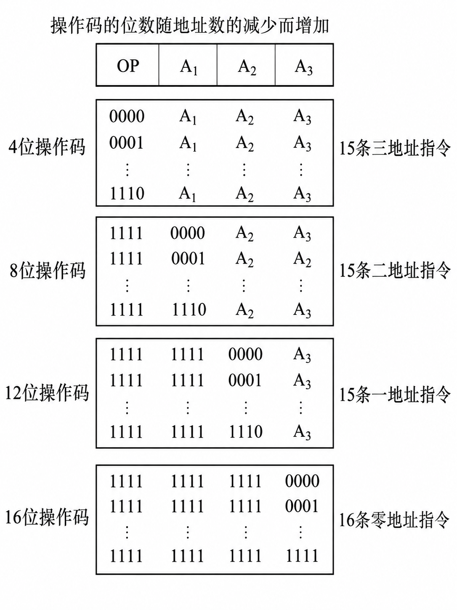

图 4.1 所示指令字长为 16 位，其中 4 位为基本操作码字段 OP，另有 3 个 4 位地址字段 A1、A2 和 A3。若 4 位基本操作码全部用于三地址指令，则最多支持 16 条指令；实际使用 15 条三地址指令，保留 1111 作为扩展操作码。对于二地址指令，保留 1111 1111 作为扩展操作码，共 15 条；对于一地址指令，保留 1111 1111 1111 作为扩展操作码，共 15 条；零地址指令共 16 条。

除了图中安排外，还可形成其他扩展方式。例如可形成 15 条三地址指令、12 条二地址指令、63 条一地址指令和 16 条零地址指令，共 106 条指令。具体扩展方案需要按题目条件分析。

设计扩展操作码指令格式时，必须注意以下两点：

1. 不允许短操作码成为长操作码的前缀，即短操作码不能与长操作码的前面部分相同。
2. 各指令的操作码一定不能重复。

通常情况下，对使用频率高的指令分配较短的操作码，对使用频率低的指令分配较长的操作码，从而尽可能减少指令译码和分析的时间。

## 4.2 寻址方式

指令中的地址码字段所包含的地址称为**形式地址**，记为地址字段中的内容 A。形式地址 A 不代表操作数的真实地址，真实地址需要通过寻址方式由形式地址计算得出，称为**有效地址**，记为 EA。

不同寻址方式下，地址字段位数的含义不同：

1. 若为立即寻址，则形式地址的位数决定了操作数的取值范围。
2. 若为直接寻址，则形式地址的位数决定了可寻址的存储空间大小。
3. 若为寄存器寻址，则形式地址的位数决定了可用通用寄存器的最大数量。
4. 若为寄存器间接寻址，则寄存器的位数决定了可寻址空间大小。

> 注意：
> 
> \(A\) 表示地址 A 处所存放的内容，A 可以是寄存器编号或内存地址。

### 4.2.2 常见的数据寻址方式

1. **隐含寻址**

隐含寻址是指指令中不显式给出操作数地址，而将操作数地址隐含在特定寄存器中。例如，在累加器型结构中，单地址指令只显式指定一个操作数地址，另一个操作数默认来自累加器 ACC，运算结果通常仍存回 ACC。

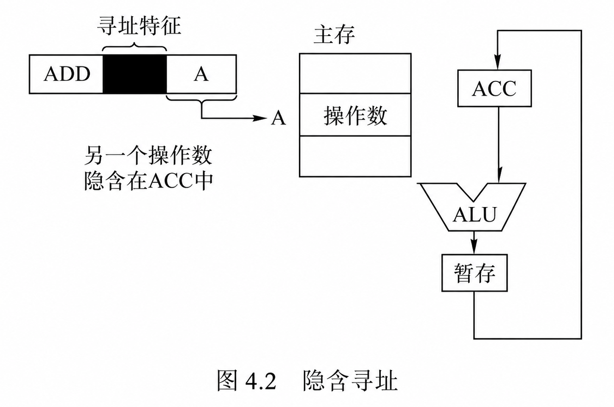

隐含寻址的优点是可以有效缩短指令字长；缺点是依赖存储隐含操作数的硬件，如 ACC。

2. **立即（数）寻址**

> 考点追踪：立即寻址的概念（2023）

立即寻址中，指令的形式地址字段并不表示操作数的地址，而是直接存放操作数本身，称为**立即数**，通常用补码形式表示。立即寻址特征常用 `#` 表示，A 即为立即数。

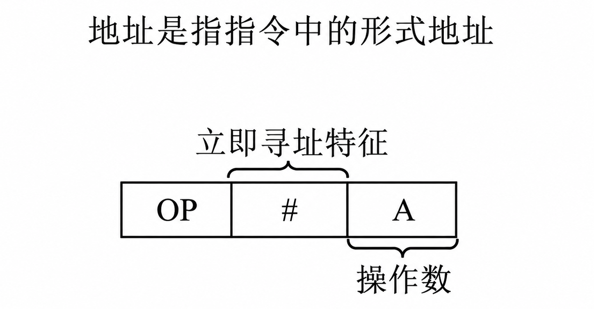

立即寻址的优点是操作数已经包含在指令中，执行阶段不需要访问存储器，因此指令执行速度最快；缺点是立即数的大小受限于形式地址字段位数，寻址范围非常有限。

3. **直接寻址**

> 考点追踪：地址位数与直接寻址范围的关系（2010，2021）

直接寻址是指指令中的形式地址 A 就是操作数的真实地址 EA，即：

\[
EA=A
\]

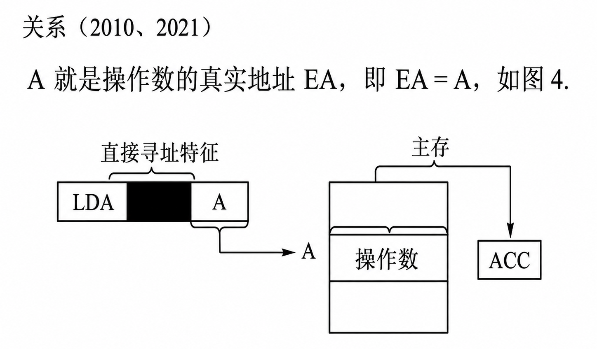

直接寻址的优点是实现简单，无须额外计算操作数地址，执行阶段只需访问一次存储器；缺点是形式地址 A 的位数限制了寻址范围，且地址固定，难以动态修改。

例如，若形式地址字段占 24 位，则直接寻址范围为：

\[
2^{24}=16M
\]

4. **间接寻址**

> 考点追踪：间接寻址 EA 的分析（2016）

间接寻址相当于直接寻址的延伸。指令中的形式地址 A 不直接给出操作数的有效地址，而是指出一个主存单元，该单元中存放操作数的有效地址，即：

\[
EA=(A)
\]

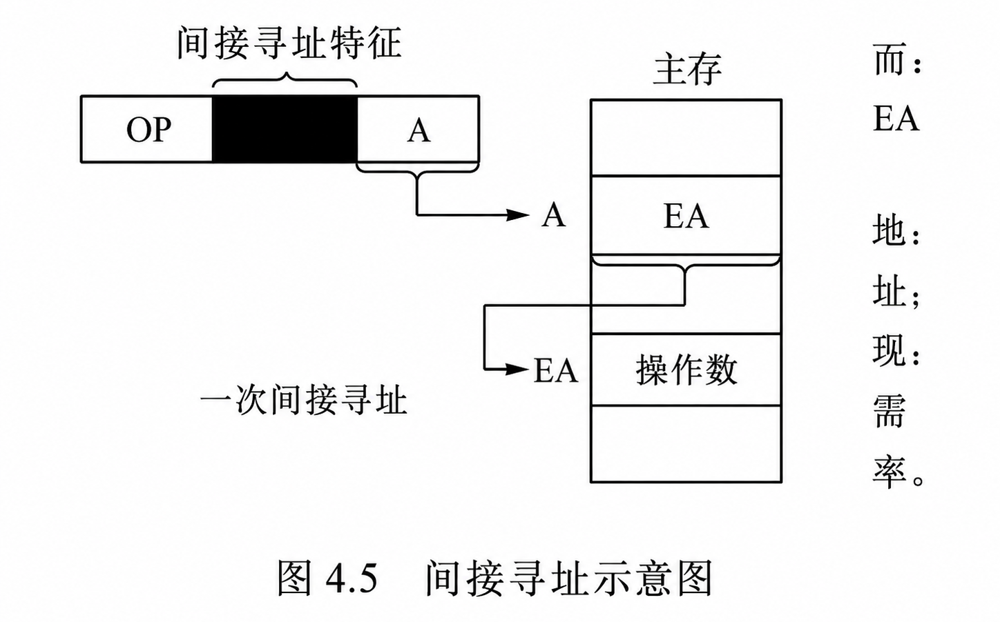

间接寻址的优点是可以扩大寻址范围，因为有效地址 EA 的位数通常大于形式地址 A 的位数，并且支持地址动态生成，如实现指针和转移表；缺点是指令执行阶段需要多次访问存储器。一次间接寻址需要 2 次访存，因此若需要兼顾寻址范围与执行效率，通常采用寄存器间接寻址。

5. **寄存器寻址**

> 考点追踪：寄存器编号位数与寄存器数量的关系（2022，2024）

寄存器寻址与直接寻址类似，但操作数存放在寄存器中。指令地址字段给出的是操作数所在寄存器的编号，即：

\[
EA=R_i
\]

操作数位于编号为 \(R_i\) 的寄存器中。

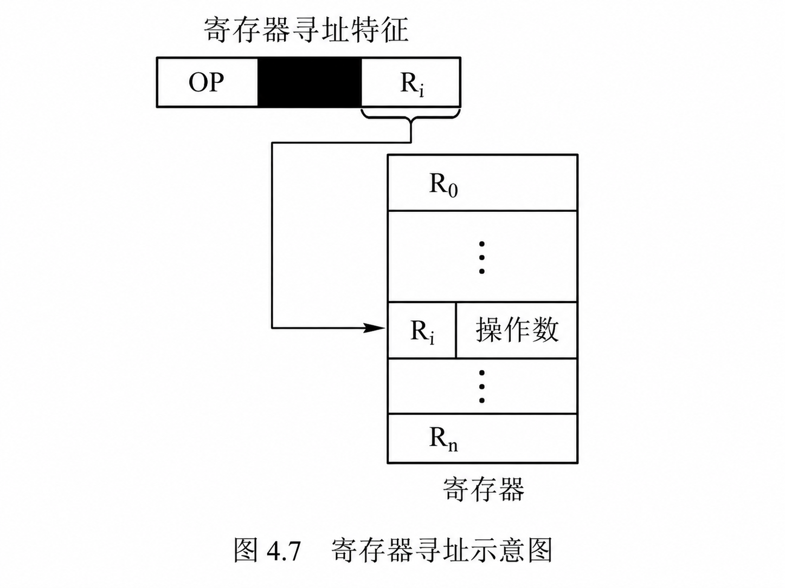

例如，若 CPU 有 32 个通用寄存器，则寄存器编号需要 5 位，因此地址字段仅需 5 位即可寻址全部寄存器。

寄存器寻址的优点是执行阶段无须访问主存，只访问寄存器，执行速度快；且寄存器数量少于主存单元，地址码位数较少，有助于缩短指令字长。缺点是寄存器成本较高，CPU 中可用寄存器数量有限。

6. **寄存器间接寻址**

> 考点追踪：寄存器间接寻址的取数操作（2010）

寄存器间接寻址结合了间接寻址和寄存器寻址的特点。指令中 \(R_i\) 所指寄存器中存放的不是操作数，而是操作数所在主存单元的地址，即：

\[
EA=(R_i)
\]

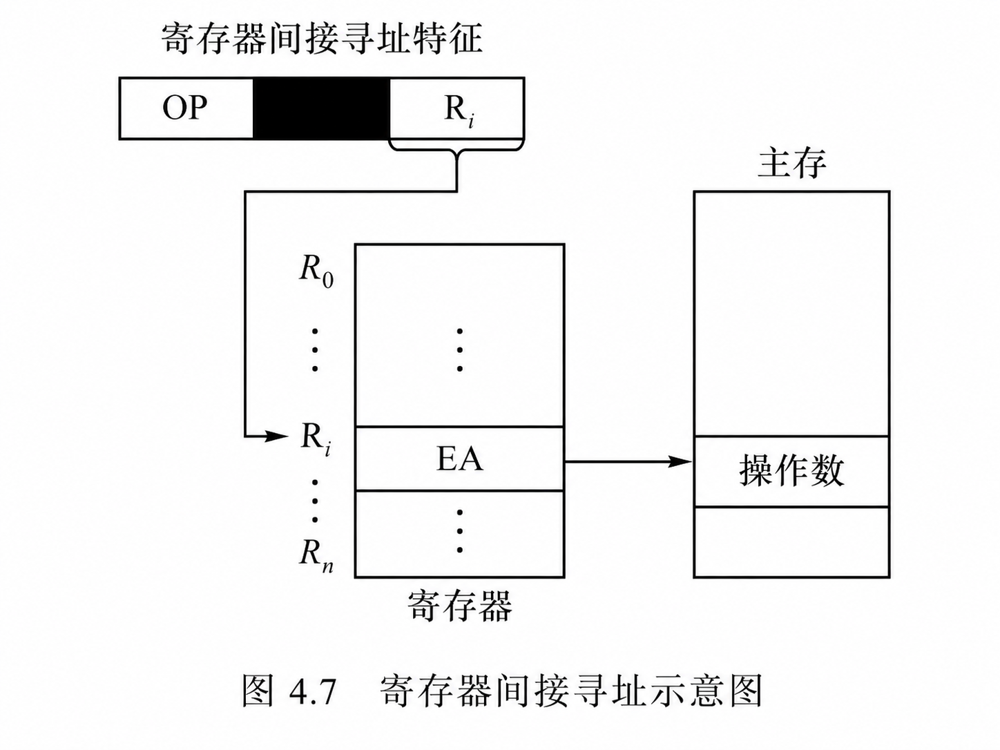

与间接寻址相比，寄存器间接寻址在执行阶段只需一次访存，减少了访存开销；同时，由于该方式使用寄存器保存有效地址，寻址范围不受形式地址字段位数限制，从而扩大了寻址范围。

与寄存器寻址相比，寄存器间接寻址执行阶段需要从主存获取操作数，增加了访存需求。

7. **相对寻址**

> 考点追踪：相对寻址的相关分析与计算（2009，2010，2013，2014，2019，2023）

相对寻址是将程序计数器 PC 的内容与指令中的形式地址 A 相加，形成转移目标地址，即：

\[
EA=(PC)+A
\]

其中，PC 为取指完成后自动更新的值，指向下一条指令的地址；A 是相对于该 PC 值的偏移量，可以为正也可以为负，通常用补码表示。

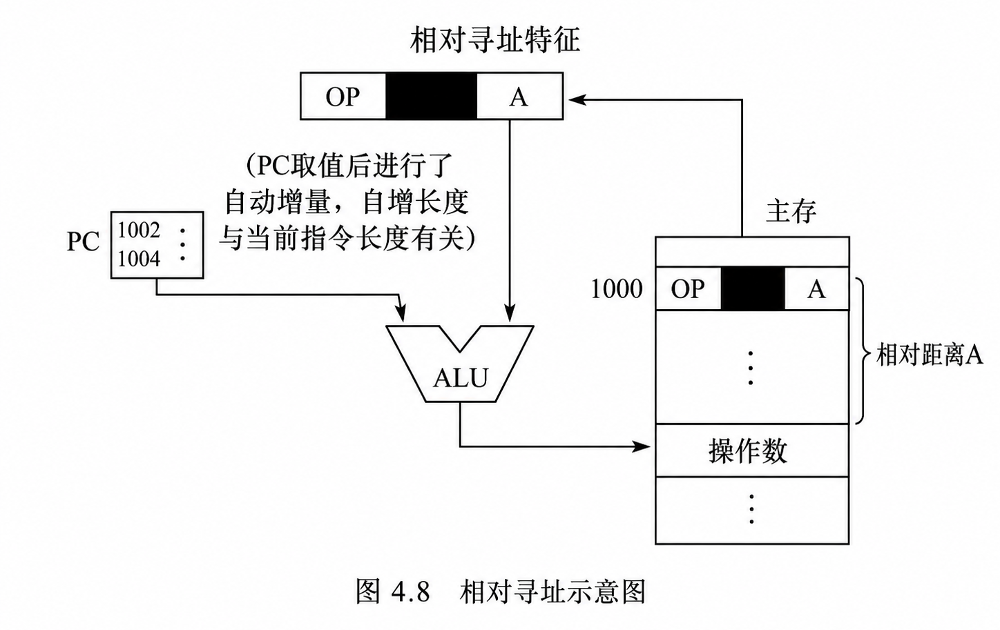

相对寻址主要用于转移类指令。形式地址 A 的位数决定了转移范围。例如，假设某机器按字节编址，指令长度为 2B。一条相对转移指令 `JMP A` 位于地址 1000H，其形式地址 \(A=0005H\)（补码表示），则取指完成后 \(PC=1002H\)，实际转移目标地址为：

\[
1002H+0005H=1007H
\]

相对寻址的优点是目标地址不是固定绝对地址，而是相对于当前指令位置的偏移。因此程序可以在内存中任意浮动而不影响转移正确性，便于实现重定位和共享代码。

8. **基址寻址**

> 考点追踪：基址寻址的 EA 的计算（2019）

基址寻址是指将基址寄存器 BR 的内容与指令中的形式地址 A 相加，形成操作数的有效地址，即：

\[
EA=(BR)+A
\]

BR 可以是专用基址寄存器，也可以是指定的通用寄存器。

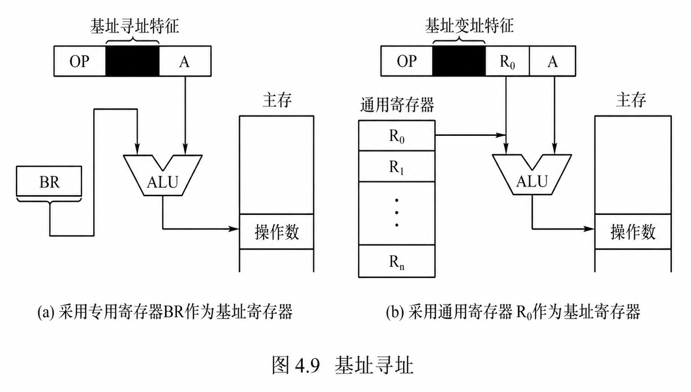

在多道程序环境下，基址寄存器的内容由操作系统设定，在程序执行期间保持不变，作为基地址；形式地址 A 作为偏移量，由用户程序指定且可根据需要变化。当使用通用寄存器作为基址寄存器时，用户可以选择哪个寄存器扮演此角色，但寄存器的内容仍由操作系统控制。

基址寻址的优点是可以扩大寻址范围，因为基址寄存器位数通常大于形式地址 A，能够访问更大的地址空间；同时可以简化编程，用户无须关注程序在主存中的具体位置，有利于多道程序设计和浮动程序实现。缺点是形式地址 A 位数较短，限制了偏移量范围。

9. **变址寻址**

> 考点追踪：变址寻址 EA 的相关计算（2013，2016，2024）

变址寻址是指将变址寄存器 IX 的内容与指令中的形式地址 A 相加，形成操作数的有效地址，即：

\[
EA=(IX)+A
\]

IX 可以是专用变址寄存器或指定的通用寄存器。

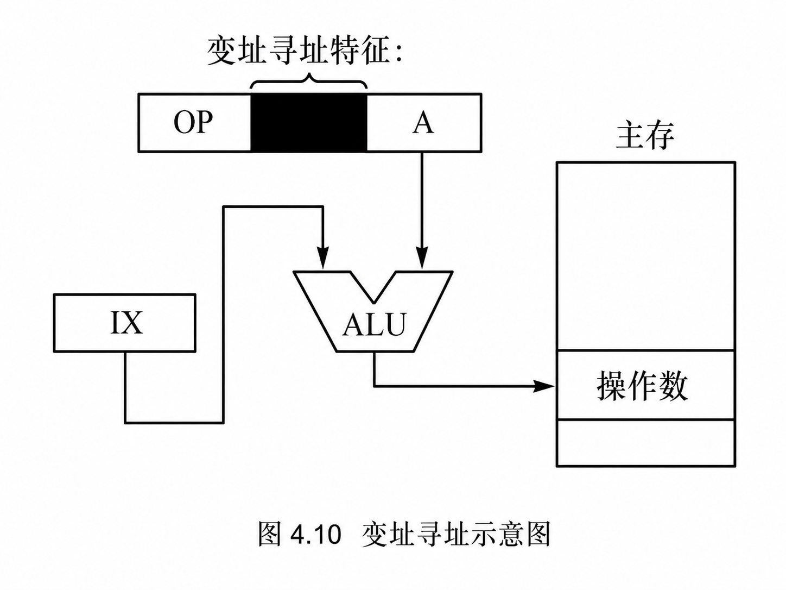

## 4.3 汇编语言和机器语言

x86 指令在考研题中更常作为默认考查对象，因此本节重点介绍 x86 汇编指令。

### 4.3.1 常用汇编指令介绍

1. **相关寄存器**

x86 处理器中有 8 个 32 位通用寄存器。为向后兼容早期的 16 位和 8 位架构，EAX、EBX、ECX、EDX 的低 16 位可分别作为独立寄存器 AX、BX、CX、DX 使用，而每个 16 位寄存器又可进一步拆分为两个 8 位寄存器，例如 AX 可分为 AH 和 AL。其中，E 表示 Extended，用来标识 32 位寄存器。

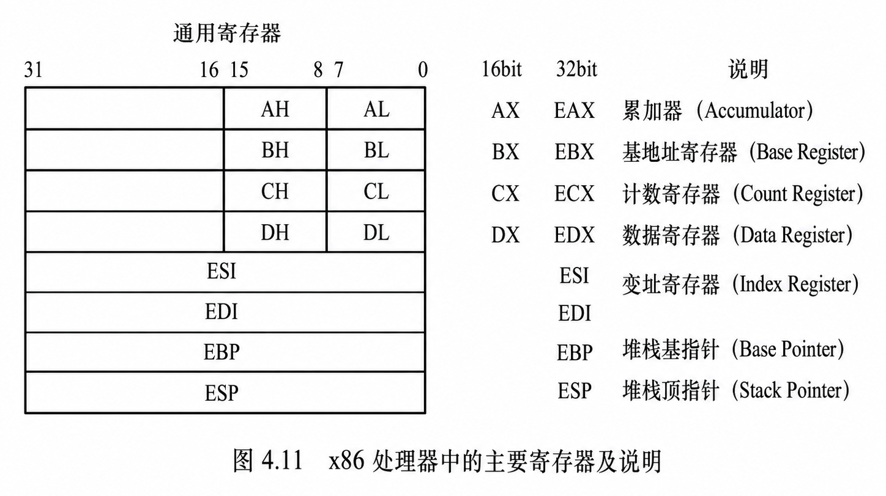

主要寄存器及用途如下：

| 16 位 | 32 位 | 说明 |
|---|---|---|
| AX | EAX | 累加器（Accumulator） |
| BX | EBX | 基地址寄存器（Base Register） |
| CX | ECX | 计数寄存器（Count Register） |
| DX | EDX | 数据寄存器（Data Register） |
| SI | ESI | 变址寄存器（Index Register） |
| DI | EDI | 变址寄存器（Index Register） |
| BP | EBP | 堆栈基指针（Base Pointer） |
| SP | ESP | 堆栈顶指针（Stack Pointer） |

除 EBP（基址指针）和 ESP（栈指针）外，其余通用寄存器的用途比较灵活。

2. **常用指令**

汇编指令通常可分为**数据传送指令**、**算术与逻辑运算指令**和**控制流指令**。下面以 Intel 格式为例介绍常用指令。下列操作数标记含义如下：

- `<reg>`：表示任意寄存器。若后缀带数字，则指定寄存器位数。例如 `<reg32>` 表示 32 位寄存器（eax、ebx、ecx、edx、esi、edi、esp 或 ebp），`<reg16>` 表示 16 位寄存器（ax、bx、cx 或 dx），`<reg8>` 表示 8 位寄存器（ah、al、bh、bl、ch、cl、dh、dl）。
- `<mem>`：表示内存地址，例如 `[eax]`、`[var+4]` 或 `dword ptr [eax+ebx]`。
- `<con>`：表示 8 位、16 位或 32 位常数。其中 `<con8>` 表示 8 位常数，`<con16>` 表示 16 位常数，`<con32>` 表示 32 位常数。

> 考点追踪：分析汇编指令对应的二进制代码（2010）

x86 指令采用变长编码，其操作码通常为 1 字节，但整条指令长度可变。同一指令如 `mov`，由于操作数类型或寄存器不同，可能对应多种机器码编码。例如：

```asm
mov ax, <con16>                 ; 机器码为 B8H
mov al, <con8>                  ; 机器码为 B0H
mov <reg16>, <reg16>/<mem16>    ; 机器码为 89H
mov <reg8>/<mem8>, <reg8>       ; 机器码为 8AH
mov <reg16>/<mem16>, <reg16>    ; 机器码为 8BH
```

> 考点追踪：模仿写出简单语句的机器级指令（2012）

（1）**数据传送指令**

1）`mov` 指令：将第二个操作数复制到第一个操作数中。第一个操作数可以是寄存器或内存，第二个操作数可以是寄存器、内存或常数。常见语法如下：

```asm
mov <reg>, <reg>
mov <reg>, <mem>
mov <mem>, <reg>
mov <reg>, <con>
mov <mem>, <con>
```

举例：

```asm
mov eax, ebx             ; 将 ebx 寄存器的值复制到 eax
mov byte ptr [var], 5    ; 将常数 5 存入地址 var 处的 1 字节内存单元
```

双操作数指令的两个操作数**不能同时为内存**，即 `mov` 指令不能直接从内存复制到内存。若需要在内存之间复制，应先将源内存内容加载到寄存器，再从寄存器写入目标内存。

2）`push` 指令：将操作数压入栈中，常用于函数调用和现场保护。ESP 是栈顶指针，入栈前先将 ESP 减 4（栈向低地址方向增长），再把操作数压入 ESP 所指地址。其语法如下：

```asm
push <reg32>
push <mem>
push <con32>
```

举例（栈中元素固定为 32 位）：

```asm
push eax        ; 将 eax 的值压入栈
push [var]      ; 将地址 var 处的 4 字节内容压入栈
```

3）`pop` 指令：与 `push` 指令相反，从栈中弹出数据。出栈前先将 ESP 所指地址的内容读出，再将 ESP 加 4。其语法如下：

```asm
pop eax         ; 弹出栈顶元素并存入 eax
pop [ebx]       ; 弹出栈顶元素并存入 ebx 所指的 4 字节内存地址
```

（2）**算术和逻辑运算指令**

1）`add/sub` 指令：`add` 指令将两个操作数相加，`sub` 指令将第一个操作数减去第二个操作数，结果均保存在第一个操作数中。其语法如下：

```asm
add <reg>, <reg> / sub <reg>, <reg>
add <reg>, <mem> / sub <reg>, <mem>
add <mem>, <reg> / sub <mem>, <reg>
add <reg>, <con> / sub <reg>, <con>
add <mem>, <con> / sub <mem>, <con>
```

举例：

```asm
sub eax, 10                 ; eax <- eax - 10
add byte ptr [var], 10      ; 将地址 var 处的 1 字节内容与 10 相加，结果存回该地址
```

2）`inc/dec` 指令：分别对操作数执行自增 1 或自减 1 操作。其语法如下：

```asm
inc <reg> / dec <reg>
inc <mem> / dec <mem>
```

举例：

```asm
dec eax             ; eax 值自减 1
inc dword ptr [var] ; 将地址 var 处的 4 字节内容自增 1
```

3）`imul` 指令：有符号整数乘法指令。该指令支持两种格式：

- 双操作数格式：将第二、第三操作数相乘，结果存入第一个操作数，第一个操作数必须为寄存器。
- 三操作数格式：将第二、第三操作数相乘，结果存入第一个操作数，第一个操作数必须为寄存器。

其语法如下：

```asm
imul <reg32>, <reg32>
imul <reg32>, <mem>
imul <reg32>, <reg32>, <con>
imul <reg32>, <mem>, <con>
```

举例：

```asm
imul eax, [var]       ; eax <- eax * [var]
imul esi, edi, 25     ; esi <- edi * 25
```

无符号整数乘法由 `mul` 指令实现，仅支持单操作数格式。被乘数隐含在 eax 中，乘积结果存放在 edx:eax 中。当 edx 不为 0 时，表示结果无法用 32 位无符号数表示，CPU 置 CF=1 和 OF=1。`imul` 在结果溢出时同样置 CF=1 和 OF=1。无符号乘法以 CF 判断溢出，有符号乘法以 OF 为准。

4）`idiv` 指令：有符号整数除法指令，仅指定除数。被除数为 edx:eax 组成的 64 位有符号数，其中 edx 为高 32 位，eax 为低 32 位。执行后，商存入 eax，余数存入 edx。其语法如下：

```asm
idiv <reg32>
idiv <mem>
```

举例：

```asm
idiv ebx
idiv dword ptr [var]
```

无符号整数除法指令 `div` 的格式与 `idiv` 完全一致，仅对操作数的解释不同。

5）`and/or/xor` 指令：分别执行按位与、或、异或操作，结果存入第一个操作数。其语法如下：

```asm
and <reg>, <reg> / or <reg>, <reg> / xor <reg>, <reg>
and <reg>, <mem> / or <reg>, <mem> / xor <reg>, <mem>
and <mem>, <reg> / or <mem>, <reg> / xor <mem>, <reg>
and <reg>, <con> / or <reg>, <con> / xor <reg>, <con>
and <mem>, <con> / or <mem>, <con> / xor <mem>, <con>
```

举例：

```asm
and eax, 0fH      ; 将 eax 的高 28 位置 0，低 4 位保持不变
xor edx, edx      ; 将 edx 清零
```

6）`not` 指令：按位取反指令，将操作数的每一位 0 变 1、1 变 0。其语法如下：

```asm
not <reg>
not <mem>
```

举例：

```asm
not byte ptr [var]    ; 将地址 var 处的 1 字节内容按位取反
```

7）`neg` 指令：取负指令，计算操作数的二进制补码，即取相反数。其语法如下：

```asm
neg <reg>
neg <mem>
```

举例：

```asm
neg eax    ; eax <- -eax
```

8）`shl/shr` 指令：逻辑移位指令。`shl` 为逻辑左移，`shr` 为逻辑右移。第一个操作数为被移位数，第二个操作数为移位位数。其语法如下：

```asm
shl <reg>, <con8> / shr <reg>, <con8>
shl <mem>, <con8> / shr <mem>, <con8>
shl <reg>, <cl>   / shr <reg>, <cl>
shl <mem>, <cl>   / shr <mem>, <cl>
```

举例：

```asm
shl eax, 1    ; eax 逻辑左移 1 位
shr ebx, cl   ; ebx 逻辑右移 n 位，n 为 cl 中的值
```

（3）**控制流指令**

x86 处理器通过指令指针寄存器 EIP（相当于程序计数器 PC）指示当前执行指令的地址。每条指令执行后，EIP 自动指向下一条指令。EIP 不能直接访问，但可通过控制流指令修改。程序中常用标签（label）标记指令地址。例如：

```asm
begin:  指令①
        指令②
        指令③
```

此处标签 `begin` 指向第二条指令，控制流指令可通过标签实现转移。

> 考点追踪：无条件转移指令的指令格式（2021）

1）`jmp` 指令：无条件转移到 label 标签所指示的地址继续执行。其语法如下：

```asm
jmp <label>
```

举例：

```asm
jmp begin    ; 转移到 begin 标记处执行
```

> 考点追踪：条件转移指令与标志位的结合（2013）

2）`jcondition` 指令：条件转移指令，根据程序状态字寄存器中的状态标志（如零标志 ZF、符号标志 SF 等）决定是否转移。常见指令包括：

```asm
je  <label>    ; 相等时转移（jump when equal）
jz  <label>    ; 结果为零时转移（jump when last result was zero）
jne <label>    ; 不相等时转移（jump when not equal）
jg  <label>    ; 大于时转移（jump when greater than）
jge <label>    ; 大于等于时转移（jump when greater than or equal to）
jl  <label>    ; 小于时转移（jump when less than）
jle <label>    ; 小于等于时转移（jump when less than or equal to）
```

举例：

```asm
cmp eax, ebx
jle done       ; 若 eax<=ebx，则转移到 done；否则顺序执行下一条指令
```

3）`cmp/test` 指令：`cmp` 指令执行减法运算但不保存结果，仅根据结果设置标志位；`test` 指令执行按位与运算但不保存结果，仅更新标志位，特别是 ZF。其语法如下：

```asm
cmp <reg>, <reg> / test <reg>, <reg>
cmp <reg>, <mem> / test <reg>, <mem>
cmp <mem>, <reg> / test <mem>, <reg>
cmp <reg>, <con> / test <reg>, <con>
```

`cmp` 和 `test` 指令通常与 `jcondition` 指令配合使用。例：

```asm
cmp dword ptr [var], 10    ; 将 var 处的 4 字节内容与 10 比较
jne loop                   ; 若相等则顺序执行，否则转移到 loop

test eax, eax              ; 测试 eax 是否为零
jz xxxx                    ; 若 eax 为零（ZF=1），则转移到 xxxx
```

> 考点追踪：call 指令的功能（2019）

4）`call/ret` 指令：分别用于实现子程序调用与返回。其语法如下：

```asm
call <label>
ret
```

`call` 指令会将下一条指令的地址（返回地址）压入栈，然后转移到 label 处执行；`ret` 指令从栈顶弹出返回地址，并转移到该地址继续执行。`call` 和 `ret` 是函数调用机制的核心指令。

掌握上述指令的语法与功能，有助于理解相关考题。学习高级语言程序时，也建议结合调试工具（如 GDB）查看对应的汇编代码，以加深对机器级指令的理解。

3. **汇编指令格式**

使用不同编程工具开发程序时，所用汇编格式可能不同，主要有 AT&T 格式和 Intel 格式两种。统考涉及的是 Intel 格式。二者主要区别如下：

1. AT&T 格式的指令名必须使用小写字母；Intel 格式对大小写不敏感。
2. 操作数顺序不同：AT&T 格式为“源、目的”，Intel 格式为“目的、源”。
3. AT&T 格式中，寄存器前加 `%`，立即数前加 `$`；Intel 格式中，二者均无前缀。
4. 内存寻址符号不同：AT&T 使用圆括号 `()`，Intel 使用方括号 `[]`。
5. 复杂寻址方式表示不同：AT&T 格式中的内存操作数 `disp(base, index, scale)` 分别表示偏移量、基址寄存器、变址寄存器和比例因子。例如 `8(%edx, %eax, 2)` 表示操作数地址为 `R[edx]+R[eax]*2+8`，对应 Intel 格式为 `[edx+eax*2+8]`。
6. 操作数长度指定方式不同：AT&T 格式在指令助记符后加后缀表示操作数大小，`b` 表示 byte（字节），`w` 表示 word（字）或 word ptr，`l` 表示 long（双字）；Intel 格式在内存操作数前使用 `byte ptr`、`word ptr` 或 `dword ptr` 显式指定长度。

> 注意：
> 
> 在 x86 体系结构中，32 位和 64 位都是由 16 位扩展来的，因此 word（字）始终表示 16 位。

表 4.2 所示为 AT&T 格式与 Intel 格式的指令对比。其中，`mov` 指令用于在寄存器与内存之间或寄存器之间传送数据；`lea` 指令用于将有效地址（而非内存内容）加载到寄存器。

| AT&T 格式 | Intel 格式 | 含义 |
|---|---|---|
| `mov $100, %eax` | `mov eax, 100` | `100->R[eax]` |
| `mov %eax, %ebx` | `mov ebx, eax` | `R[eax]->R[ebx]` |
| `mov %eax, (%ebx)` | `mov [ebx], eax` | `R[eax]->M[R[ebx]]` |
| `mov %eax, -8(%ebp)` | `mov [ebp-8], eax` | `R[eax]->M[R[ebp]-8]` |
| `lea 8(%edx,%eax,2), %eax` | `lea eax, [edx+eax*2+8]` | `R[edx]+R[eax]*2+8->R[eax]` |
| `movl %eax, %ebx` | `mov dword ptr [ebx], eax` | `32 位 R[eax]->M[R[ebx]]` |

注：`R[r]` 表示寄存器 r 的内容，`M[addr]` 表示主存单元 addr 的内容，箭头表示信息传送方向。

两种汇编格式的相互转换并不复杂，历年统考真题通常采用 Intel 格式。

### 4.3.2 选择语句的机器级表示

常见的选择结构语句有 `if-then`、`if-then-else` 等。编译器通过**条件码（标志位）设置指令**和**条件转移指令**实现程序中的选择结构。条件码描述最近一次算术运算或逻辑运算结果的属性，程序通过检测这些标志位决定是否执行条件分支。常用条件码包括：

- `CF`：进位标志。
- `ZF`：零标志。
- `SF`：符号标志。
- `OF`：溢出标志。

常见算术逻辑运算指令（如 `add`、`sub`、`imul`、`or`、`and`、`shl`、`inc`、`dec`、`not`、`sal` 等）在执行时会自动设置条件码。此外，`cmp` 和 `test` 是专门用于设置条件码的指令：

- `cmp` 执行相应比较，本质上类似减法 `sub`，但不保存运算结果，只根据运算结果更新标志位。
- `test` 执行相应测试，本质上类似按位与 `and`，但不保存运算结果，只根据运算结果更新标志位。

前面介绍的 `jcondition` 条件转移指令，正是根据 `ZF`、`OF` 或 `SF` 等条件码来决定是否转移。

`if-else` 语句的通用形式如下：

```c
if (test_expr)              // test_expr 为条件测试表达式
    then_statement          // 当 test_expr 为真时，执行 then_statement 语句
else
    else_statement          // 当 test_expr 为假时，执行 else_statement 语句
```

在 C 语言中，`test_expr` 是一个整数表达式，其值为 0 时表示“假”，非 0（包括负数）时表示“真”。两个分支语句（`then_statement` 或 `else_statement`）中只会执行其中一个。

这种通用形式可以翻译成如下等价的 `goto` 语句形式：

```c
t = test_expr;              // 暂存测试表达式的结果
if (!t)                     // 若条件为假（t=0）
    goto false;             // 转移至 false 标签，进入假分支
then_statement              // 真分支：仅当 t≠0 时执行
goto done;                  // 执行完真分支后，跳过假分支，转移至结束点
false:                      // 假分支入口标签
else_statement              // 假分支：仅当 t=0 时执行
done:                       // 整个 if-else 结构的结束点
```

下面以一个具体的 C 语言函数为例：

```c
int get_cont(int *p1,int *p2){
    if(p1>p2)
        return *p2;
    else
        return *p1;
}
```

已知 `p1` 和 `p2` 对应的实参已被压入调用函数的栈帧，其对应的存储地址分别为 `R[ebp]+8`、`R[ebp]+12`（`EBP` 指向当前栈帧底部），函数返回值需存放在 `eax` 中。对应的汇编代码为：

```asm
mov eax,dword ptr [ebp+8]      # R[eax]←M[R[ebp]+8]，即加载参数 p1 到 eax
mov edx,dword ptr [ebp+12]     # R[edx]←M[R[ebp]+12]，即加载参数 p2 到 edx
cmp eax,edx                    # 比较 p1 和 p2，根据结果设置条件码
jbe .L1                        # 若 p1<=p2，则转移到 L1
mov eax,dword ptr [edx]        # R[eax]←M[R[edx]]，即取 *p2 作为返回值
jmp .L2                        # 无条件转移到 L2，跳过 else 分支
.L1:
mov eax,dword ptr [eax]        # R[eax]←M[R[eax]]，即取 *p1 作为返回值
.L2:
```

`p1` 和 `p2` 是指针型参数，在 32 位机器中占 4 字节（一个 `dword`）。比较指令 `cmp` 的两个操作数都应来自寄存器，因此需要先将 `p1` 和 `p2` 对应的实参从栈中加载到寄存器。指针比较在 C 语言中按无符号整数处理，因此使用 `jbe`（无符号“小于等于”）进行条件转移。

### 4.3.3 循环语句的机器级表示

> 考点追踪：循环语句的机器级代码分析（2014、2017、2019、2023）

常见的循环结构语句有 `while`、`for` 和 `do-while`。x86 指令集中没有直接对应这些高级循环结构的指令，编译器通常通过**条件测试**（如 `cmp`、`test`）和**条件转移**（如 `je`、`jne`、`jg`、`jle` 等）指令的组合实现循环逻辑。实际上，大多数编译器会把这三种循环统一转换为类似 `do-while` 的形式。

1. **do-while 循环**

`do-while` 语句是一种“后测试”型循环，其通用形式如下：

```c
do                            // 先执行循环体，再判断循环条件
    body_statement            // body_statement 为循环体执行语句
while (test_expr);            // test_expr 为循环继续的条件表达式
```

这种结构可以直接翻译成如下条件和 `goto` 语句组合：

```c
loop:                         // 循环入口标签
body_statement                // 执行循环体语句（首次进入时必然执行）
t = test_expr;                // 计算循环条件
if (t)                        // 若条件为真（t≠0）
    goto loop;                // 跳回 loop 标签，继续下一轮迭代
```

由于循环体在条件判断之前执行，因此无论 `test_expr` 的初始值是什么，`body_statement` 至少会被执行一次。每次执行结束时，程序会重新计算 `test_expr` 的值；如果结果为真（非零），就跳回循环开头继续执行；否则顺序执行后续代码，退出循环。

2. **while 循环**

`while` 语句是一种“前测试”型循环，其通用形式如下：

```c
while (test_expr)             // test_expr 为循环判断的条件表达式
    body_statement            // 当 test_expr 为真时重复执行 body_statement 语句
```

与 `do-while` 不同，`while` 循环在第一次执行 `body_statement` 之前就会测试 `test_expr` 的值。如果初始条件为假（`test_expr=0`），那么循环体一次都不会执行。

为了用转移指令实现这一语义，编译器通常采用“先判断、再进入循环体”的策略。可以将 `while` 循环转换为一个带前置判断的 `do-while` 式结构：

```c
t = test_expr;                // 计算初始循环条件
if (!t)                       // 若初始条件为假（t=0）
    goto done;                // 跳过循环体，直接转至结束点

do
    body_statement            // 执行循环体
while (test_expr);            // 重新测试条件
done:                         // 循环结构的结束点
```

进一步展开为纯 `goto` 语句形式：

```c
t = test_expr;                // 计算初始循环条件
if (!t)                       // 若为假
    goto done;                // 跳过循环
loop:
body_statement                // 执行循环体
t = test_expr;                // 重新计算条件
if (t)                        // 若为真
goto loop;                    // 继续下一轮
done:                         // 循环结束
```

这种转换保证了 `while` 循环“先判断、后执行”的语义，同时复用了 `do-while` 的结构。

3. **for 循环**

`for` 循环是一种语法更紧凑的循环形式，其通用形式如下：

```c
for(init_expr; test_expr; update_expr)
    body_statement            // body_statement 为循环体执行语句
```

其中：

- `init_expr` 为初始化表达式，用于初始化循环计数器（如 `i=0`）。
- `test_expr` 为条件判断表达式，每次执行循环体前测试（如 `i<10`）。
- `update_expr` 为更新表达式，每次循环体执行完后执行（如 `i++`）。

从执行逻辑看，`for` 循环完全等价于下面这段 `while` 循环代码：

```c
init_expr;                    // 初始化（只执行一次）
while(test_expr){             // 每次循环前判断条件
    body_statement            // 执行循环体
    update_expr;              // 更新循环变量
}
```

因此，可以先将 `for` 循环转换为 `while` 形式，再按前述方法转换为 `goto` 语句：

```c
init_expr;                    // 执行初始化
t = test_expr;                // 测试初始条件
if (!t)                       // 若初始条件为假
    goto done;                // 跳过循环
loop:
body_statement                // 执行循环体
update_expr;                  // 执行更新操作
t = test_expr;                // 重新测试条件
if (t)                        // 若为真
goto loop;                    // 跳回循环体
done:
```

下面以一个具体的 C 语言函数为例，说明 `for` 循环如何转换为汇编代码：

```c
int sum_for(int n){
    int i;
    int result = 0;
    for(i=1;i<=n;i++)
        result += i;
    return result;
}
```

在这段代码中，`for` 循环的各个组成部分为：

```c
init_expr       i=1
test_expr       i<=n
update_expr     i++
body_statement  result += i
```

通过替换前面给出的模板中的相应位置，可以很容易将 `for` 循环转换为 `while` 或 `do-while` 循环。将这个函数翻译为 `goto` 语句代码后，不难得出其过程体的汇编代码：

```asm
mov ecx,dword ptr [ebp+8]       # R[ecx]←M[R[ebp]+8]，即加载参数 n 到 ecx
mov eax,0                       # R[eax]←0，即初始化 result=0
mov edx,1                       # R[edx]←1，即初始化 i=1
cmp edx,ecx                     # 比较 i 与 n（R[edx] 与 R[ecx]）并设置标志位
jg .L2                          # If greater，则转移到 L2
.L1:                            # 循环体入口
add eax,edx                     # R[eax]←R[eax]+R[edx]，即 result += i
add edx,1                       # R[edx]←R[edx]+1，即 i++
cmp edx,ecx                     # 再次比较 i:n
jle .L1                         # If less or equal，则转移到 L1
.L2:                            # 循环结束点
```

已知实参 `n` 已被压入调用函数的栈帧，其对应的存储地址为 `R[ebp]+8`。编译器将频繁使用的局部变量优化到寄存器中：`result` 被分配到 `eax`（同时也是返回值寄存器），`i` 被分配到 `edx`。由于 `i` 和 `n` 均为 `int` 型，判断条件 `i<=n` 属于有符号比较，因此使用 `jle` 和 `jg` 等有符号转移指令。

### 4.3.4 过程调用的机器级表示

在程序执行过程中，当一个过程（函数）调用另一个过程时，需要完成参数传递、控制转移、现场保护与返回等一系列操作。x86 架构通过 `call` 和 `ret` 指令支持这一机制。二者都属于无条件转移指令，但它们配合栈使用，实现了完整的“调用-返回”语义。

假设过程 P（调用者）调用过程 Q（被调用者），整个调用过程的执行步骤如下：

1. P 将入口参数（实参）放到 Q 能访问的位置。
2. P 执行 `call` 指令，将返回地址（`call` 的下一条指令地址）压入栈中，并转移到 Q。
3. Q 建立自己的栈帧，为局部变量分配空间，并在必要时保存某些寄存器。
4. Q 执行其主体代码。
5. Q 将返回结果放到约定位置，释放局部变量空间，并恢复之前保存的寄存器。
6. Q 执行 `ret` 指令，从栈顶弹出返回地址，并转移回 P 继续执行。

上述过程中，入口参数、返回地址、局部变量、返回结果以及需要保护的寄存器内容，都需要在内存中找到合适的存放位置。由于寄存器数量有限，且调用双方共享寄存器资源，若不加保护直接覆盖寄存器，就会导致程序出错。因此，调用约定和栈的配合非常重要。

在 x86 调用约定中，寄存器可分为两类：

- **调用者保存寄存器**：`EAX`、`ECX` 和 `EDX`。若调用者 P 希望调用后仍使用这些寄存器的值，则必须在调用前自行保存（如压入栈中），并在返回后恢复。
- **被调用者保存寄存器**：`EBX`、`ESI` 和 `EDI`。若被调用者 Q 需要使用这些寄存器，则 Q 必须在使用前保存，返回前恢复。

每个过程在执行时，都会在运行时栈中分配一块专属区域，称为**栈帧**。整个运行时栈由多个连续的栈帧组成。`EBP`（基址指针）指向当前栈帧的基址，也就是保存旧 `EBP` 的位置；`ESP`（栈指针）始终指向当前栈顶。栈从高地址向低地址增长。过程执行时，`ESP` 会随着数据入栈、出栈而动态变化，而 `EBP` 在当前过程执行期间保持不变，便于通过固定偏移访问参数和局部变量。

下面用一个简单的 C 语言程序说明过程调用的机器级实现：

```c
int add(int x, int y){
    return x+y;
}

int caller(){
    int temp1=125;
    int temp2=80;
    int sum=add(temp1,temp2);
    return sum;
}
```

经 GCC 编译后，`caller` 对应的汇编代码如下：

```asm
caller:
    push ebp                         # 保存调用者 P 的 EBP
    mov ebp,esp                      # 建立新栈帧：EBP←当前栈顶
    sub esp,24                       # 为局部变量和参数区分配 24 字节空间
    mov [ebp-12],125                 # M[R[ebp]-12]←125，即 temp1=125
    mov [ebp-8],80                   # M[R[ebp]-8]←80，即 temp2=80
    mov eax,dword ptr [ebp-8]        # R[eax]←M[R[ebp]-8]，加载 temp2
    mov [esp+4],eax                  # M[R[esp]+4]←R[eax]，将 temp2 放入参数区高地址
    mov eax,dword ptr [ebp-12]       # R[eax]←M[R[ebp]-12]，加载 temp1
    mov [esp],eax                    # M[R[esp]]←R[eax]，将 temp1 放入参数区低地址
    call add                         # 调用 add，返回值保存在 eax
    mov [ebp-4],eax                  # M[R[ebp]-4]←R[eax]，将返回值存入 sum
    mov eax,dword ptr [ebp-4]        # R[eax]←M[R[ebp]-4]，将 sum 作为返回值
    leave                            # 等价于 mov esp,ebp 和 pop ebp
    ret                              # 弹出返回地址并跳回
```

假设 `caller` 被过程 P 调用。在执行完 `sub esp,24` 后，`caller` 的栈帧已经建立，`ESP` 指向新栈顶。GCC 为 `caller` 分配了 24 字节空间。从代码可见：

- `caller` 仅使用了 `EAX`，而 `EAX` 属于调用者保存寄存器，因此它的栈帧中除了通过 `push ebp` 保存调用者 P 的旧 `EBP` 外，无须保存其他寄存器。
- `caller` 的三个局部变量 `temp1`、`temp2` 和 `sum` 均被分配在栈帧中，共占 12 字节。
- 在 `call` 指令调用 `add` 之前，`caller` 将入口参数 `temp2` 和 `temp1` 的值（80 和 125）保存到栈中。其中左参数位于较低地址，右参数位于较高地址，共占 8 字节。
- 执行 `call` 指令时，返回地址被压入栈中，占 4 字节。

因此，栈帧实际使用空间为 4 + 12 + 8 + 4 = 28 字节。然而，为了保证数据严格对齐，GCC 规定每个函数的栈帧大小必须是 16 字节的倍数，所以最终分配的栈帧大小为 32 字节，其中 4 字节未被使用，作为对齐填充。

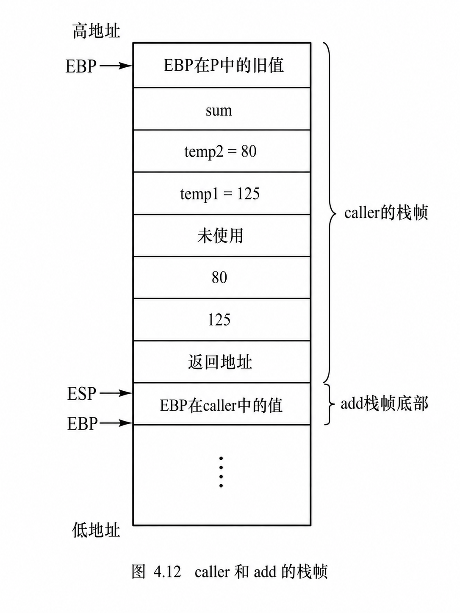

`call` 指令执行后，`add` 函数的返回值存放在 `EAX` 中。因此，`call` 后面的两条指令分别完成：将 `add` 的结果存入变量 `sum` 的存储位置，即 `mov [ebp-4],eax`；再将 `sum` 的值加载到 `EAX`，作为 `caller` 的返回值，即 `mov eax,dword ptr [ebp-4]`。

在执行 `ret` 指令之前，必须释放当前栈帧并恢复调用者 P 的基址指针。第 14 行 `leave` 指令正是用于完成这一任务，其功能等价于以下两条指令：

```asm
mov esp,ebp        # 将栈指针 ESP 设置为当前 EBP 的值，即指向保存旧 EBP 的位置
pop ebp            # 从栈中弹出旧 EBP 值，恢复过程 P 的基址指针
```

执行完这两条指令后，`EBP` 已恢复为过程 P 中的原始值，而 `ESP` 指向栈顶的返回地址。此时，`ret` 指令便可以从 `ESP` 所指位置取出该返回地址，并转移回过程 P 继续执行。

## 4.4 CISC 和 RISC 的基本概念

### 4.4.1 复杂指令系统计算机（CISC）

随着集成电路技术的发展，软件开发成本不断上升，促使设计者在指令系统中加入更多、更复杂的指令，以适应多样化的应用需求，从而形成了 CISC 架构。

> 考点追踪：CISC 的特点（2017）

CISC 的主要特点如下：

1. 指令系统庞大复杂，指令数量通常超过 200 条。
2. 指令长度不固定，指令格式和寻址方式种类繁多。
3. 多数指令均可直接访问内存。
4. 各类指令的使用频率差异显著。
5. 指令执行时间相差较大，大多数指令需要多个时钟周期才能完成。
6. 控制器多采用微程序控制，部分复杂指令难以用硬连线逻辑实现。
7. 难以通过优化编译生成高效的目标代码。

如此庞大的指令系统，对设计提出了极高要求，导致研制周期变得很长。后续研究发现，一味追求指令系统的复杂和完备程度并非提升性能的有效途径。对传统 CISC 指令系统的统计分析表明：各种指令的使用频率相差悬殊，约 80% 的程序执行仅依赖于 20% 的简单指令，而其余 80% 的复杂指令使用频率很低。基于这一观察，设计者开始尝试仅保留高频使用的简单指令，并通过它们组合实现不常用的复杂功能，由此催生了 RISC 架构。

### 4.4.2 精简指令系统计算机（RISC）

RISC 的核心思想是简化指令系统，强调“寄存器-寄存器”操作，并力求指令格式统一。

> 考点追踪：RISC 的特点（2009、2025）

RISC 的主要特点如下：

1. 仅选取使用频率最高的简单指令，复杂功能由多条简单指令组合实现。
2. 指令长度固定，指令格式和寻址方式种类较少。
3. 仅 `LOAD/STORE`（取数/存数）指令可访问内存，其余运算均在寄存器之间进行。
4. CPU 中配备大量通用寄存器。
5. 普遍采用指令流水线技术，绝大多数指令在一个时钟周期内完成。
6. 以硬布线控制为主，极少或完全不使用微程序控制。
7. 高度依赖编译程序优化，以缩短程序执行时间。

此外，在指令系统兼容性方面，CISC 架构通常支持向后兼容，即新机型包含旧机型的全部指令并加以扩展。而 RISC 由于大幅简化指令集、改变指令格式，通常无法与老机型兼容。

历史上，RISC 因高效性和简洁性曾被视为未来处理器的发展方向。然而在现实中，x86 架构凭借庞大的软件生态占据主流地位，早期大量软件均基于 CISC 设计，纯 RISC 系统难以满足兼容性需求。此外，现代 CISC 处理器已在内部融合了大量 RISC 思想，使得两者在性能上的差距日益缩小。与此同时，CISC 能提供更丰富的指令功能，这也是很多程序设计所需要的。

### 4.4.3 CISC 和 RISC 的比较

与 CISC 相比，RISC 的优势主要体现在更高效利用芯片面积。CISC 采用微程序控制，其控制存储器占 CPU 芯片面积的 50% 以上；而 RISC 采用硬布线控制，逻辑电路仅占约 10%，节省了宝贵的硅片资源。

## 4.5 指令系统相关疑难点

指令系统是指一台计算机所具有的全部机器指令的集合。引入指令系统具有双重意义：

- **对软件层面**：指令系统为程序员提供了统一的硬件抽象接口，使程序员无须直接操作物理电路或二进制编码，显著提升编程效率。
- **对硬件层面**：指令系统的格式、功能和寻址能力直接决定了处理器的微架构设计、性能潜力和适用领域。

一条典型指令由操作码和地址码两部分构成：

- **操作码**：指明指令的功能类型，如加法、转移、加载等，是 CPU 识别和执行指令的核心依据。
- **地址码**：提供操作所需的地址信息，包括操作数的存储位置、运算结果的保存地址、程序转移的目标地址或子程序的入口地址等。

通过操作码与地址码的组合，指令能够精确描述一次完整的计算或控制操作。

对一个指令系统而言，寻址方式的多少会影响编程灵活性与硬件效率。寻址方式丰富（如立即数、寄存器、直接、间接、变址、相对等）可以使程序更简洁高效，便于表达复杂的数据访问模式，但会增加指令译码逻辑的复杂度，不利于流水线调度，并可能增大控制单元面积。寻址方式过少虽能简化硬件、提升执行速度，却会限制程序表达能力，迫使程序员用多条指令模拟复杂访问，降低代码效率。

## 4.6 常见问题和易混淆知识点

1. **简述各常见指令寻址方式的特点和适用情况。**

- **立即寻址**：操作数直接放入指令，无须访存，常用于赋初值或常量。
- **直接寻址**：指令中给出操作数的内存地址，访存一次，适用于固定地址访问。
- **间接寻址**：指令给出地址的地址，需两次访存，扩大了寻址范围，易于完成子程序返回。
- **寄存器寻址**：操作数在寄存器中，指令短、速度快，适合高频运算。
- **寄存器间接寻址**：寄存器存放操作数地址，兼具灵活性与较大寻址范围。
- **基址寻址**：\(EA =\) 基址寄存器 + 偏移量，基址由系统设定，适用于多道程序的地址重定位。
- **变址寻址**：\(EA =\) 变址寄存器 + 偏移量，变址寄存器由用户控制，适合数组遍历和循环。
- **相对寻址**：\(EA = PC +\) 偏移量，主要用于转移指令。

基址寻址和变址寻址的区别：二者形成形式相同，都是 \(EA =\) 寄存器内容 + 偏移量；但基址寄存器由操作系统管理，偏移量可变；变址寄存器由程序员控制，偏移量固定。

2. **一个操作数在内存中可能占多个单元，怎样在指令中给出操作数的地址？**

现代计算机普遍采用字节编址，即每个内存单元存储 1 字节（8 位）。当操作数为多字节数据时，如 `int` 占 4 字节、`double` 占 8 字节，指令中仅给出该操作数的起始地址，也就是第一个字节的地址。CPU 根据操作数类型自动读取连续的多个字节。

3. **装入/存储（LOAD/STORE）型指令有什么特点？**

`LOAD/STORE` 是 RISC 指令系统的核心设计原则之一，其主要特点包括：

- **访存与计算分离**：只有 `LOAD`（从内存读入寄存器）和 `STORE`（从寄存器写入内存）指令能访问主存；所有运算指令（如加、减、移位）仅操作寄存器中的数据。
- **指令格式规整**：由于寄存器编号位数远少于内存地址，通过固定字段分配，可实现定长指令，极大简化译码逻辑。
- **利于流水线执行**：统一的指令长度和访存边界，使取指、译码、执行等阶段易于并行化。
- **潜在缺点**：频繁的数据搬移可能导致程序中 `LOAD/STORE` 指令比例较高，增加指令条数；但现代编译器优化和高速缓存机制可有效缓解此问题。

---

> 当前进度：已完成计算机组成原理 PDF 第 5 章和第 6 章正文、例题与典型分析的可见内容整理。本轮继续处理第 31 页下半部分至第 32 页，完成 **6.2.2 总线定时**，新增图片 **图 6.3** 已按章节顺序放入 img 文件夹。源 PDF 在第 32 页之后直接进入第 7 章，因此本 act 指定的第 5 章和第 6 章范围已整理完成。
>
> 下次任务：第 5 章和第 6 章已完成；后续只需进行最终交付与归档。

# 第五章 中央处理器

【考纲内容】

1. **CPU 的功能和基本结构**。
2. **指令执行过程**。
3. **数据通路的功能和基本结构**。
4. **控制器的功能和工作原理**。
5. **异常和中断机制**：异常和中断的基本概念；异常和中断的分类；异常和中断的检测与响应。
6. **指令流水线**：指令流水线的基本概念；指令流水线的基本实现；结构冒险、数据冒险和控制冒险的处理；超标量和动态流水线的基本概念。
7. **多处理器的基本概念**：SISD、SIMD、MIMD、向量处理器的基本概念；硬件多线程的基本概念；多核（multi-core）处理器的基本概念；共享内存多处理器（SMP）的基本概念。

【复习提示】

中央处理器是计算机的核心，也是本书的重点。其中，**数据通路的分析、指令执行阶段的节拍与控制信号的安排、流水线技术与性能分析**容易出综合题；而**各种寄存器的特点、各种指令执行的周期与特点、控制器的相关概念、流水线的相关概念**容易出选择题。

学习本章时，建议重点思考以下问题：

1. 指令和数据均存放在内存中，计算机如何从时间和空间上区分它们是指令还是数据？
2. 什么是指令周期和时钟周期？它们之间有何关系？
3. 什么是微指令？它和第 4 章谈到的指令有什么关系？
4. 什么是指令流水线？指令流水线相对于传统体系结构的优势是什么？

## 5.1 CPU 的功能和基本结构

### 5.1.1 CPU 的功能

CPU 的核心功能是**执行程序**。在程序运行过程中，可能会遇到各类异常或外部中断事件，例如译码阶段发现非法操作码、外部设备发出中断请求等。因此，CPU 不仅需要高效执行指令，还要具备检测并响应各类异常与中断的能力。

CPU 的基本功能包括：

1. **取指令并译码**：从主存中取出指令，解析操作码，并生成相应的控制信号。
2. **更新程序计数器**（Program Counter，PC）：确定下一条指令地址，以支持顺序执行或程序转移。
3. **执行算术与逻辑运算**：通过 ALU 对操作数进行算术或逻辑运算。
4. **取操作数或写结果**：访问主存或 I/O 接口，读取操作数或将运算结果写回。
5. **处理异常或中断**：检测异常或中断请求，并在必要时转入相应的处理程序。
6. **时序控制**：通过时钟信号协调各操作的执行顺序和持续时间，确保指令按序执行。

### 5.1.2 CPU 的基本结构

CPU 的内部结构由它需要完成的功能决定。为了实现完整的指令执行流程，CPU 必须包含若干关键功能部件：

1. 为支持指令控制，需要设置**程序计数器**（PC），用于存放即将执行指令的地址。
2. 为完成指令译码，需要配备**指令寄存器**（IR）暂存当前指令，并由**指令译码器**（ID）解析操作码。
3. **控制单元**（CU）综合译码结果、时序信号与状态标志，生成微操作控制信号序列，驱动各部件协同工作。
4. **算术逻辑单元**（ALU）和**通用寄存器组**（GPRs）共同构成数据通路，负责操作数的暂存与运算。
5. **中断机构**用于响应异常与外部中断请求。
6. 为协调 CPU 与主存之间的数据交换，还需要设置**存储器地址寄存器**（MAR）和**存储器数据寄存器**（MDR）。

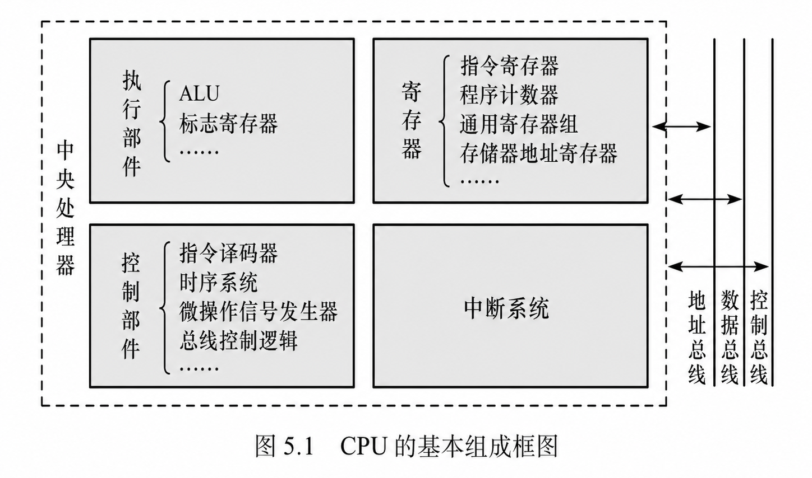

> 考点追踪：CPU 中各种寄存器的作用与特点（2013、2016、2021）

CPU 中主要寄存器和部件的作用如下：

| 名称 | 作用与特点 |
|---|---|
| 程序计数器（PC） | 存放即将执行的指令地址。顺序执行时自动递增，递增量为当前指令所占的字节数；遇到转移类指令时更新为目标地址。程序启动前，首条指令地址被装入 PC。其位数由地址总线宽度决定，反映 CPU 可直接寻址的内存空间大小。 |
| 指令寄存器（IR） | 暂存当前正在执行的指令。指令从主存取出后首先送入 IR，供指令译码器使用。其位数等于指令字长。 |
| 通用寄存器组（GPRs） | 供用户程序灵活使用，用于暂存操作数、中间结果或地址指针，减少对主存的频繁访问，提高执行效率。 |
| 标志寄存器（FR）/程序状态字寄存器（PSWR） | 保存 ALU 运算产生的状态信息，用于条件判断与转移控制。标志位通常由触发器实现，整体构成程序状态字。 |
| 存储器地址寄存器（MAR） | 存放当前要访问的主存地址。取指或数据读/写时，地址先送入 MAR，再通过地址总线传至存储器。其位数同样由地址总线宽度决定。 |
| 存储器数据寄存器（MDR） | 暂存从主存读出的数据或将要写入主存的数据，起缓冲与同步作用，缓解 CPU 与主存之间的速度差异。 |
| 指令译码器（ID） | 对 IR 中的操作码进行分析，识别指令类型，并输出对应的译码信号。 |
| 算术逻辑单元（ALU） | 执行数据运算的核心部件，完成算术与逻辑运算。运算结果送回寄存器，状态标志写入标志寄存器，供后续条件转移指令使用。 |

## 5.2 指令执行过程

### 5.2.1 指令执行的一般流程

图 5.2 给出了指令执行的一般流程。整体上，CPU 执行指令通常要经历取指、执行和中断处理等阶段：

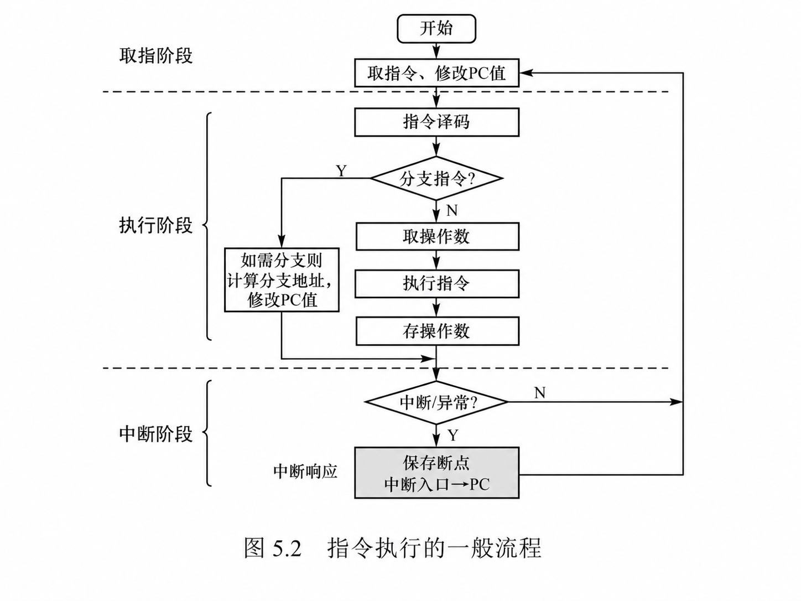

指令执行的一般流程可概括为：

1. **开始后取指并修改 PC 值**：CPU 取出当前指令，同时为后续执行准备下一条指令地址。
2. **指令译码**：译码器识别指令操作类型。
3. **判断是否为分支指令**：若为分支指令，则在需要分支时计算分支地址并修改 PC 值；若不是分支指令，则继续顺序执行。
4. **取操作数、执行指令、存操作数**：根据指令类型完成相应的数据读取、运算和结果存放。
5. **判断是否发生中断或异常**：若没有中断或异常，则进入下一条指令的取指过程；若有中断或异常，则保存断点，并将中断入口送入 PC，转去执行相应处理程序。

### 5.2.2 CPU 的时序控制

计算机的时序控制用于协调指令执行过程中各操作的先后顺序。CPU 必须按照精确的时序产生控制信号，以适应不同指令在操作步骤和执行时间上的差异。

**时钟信号是时序控制的基础**。通常由机器内部的脉冲源（如晶振）产生，经整形和分频后形成供全机同步使用的节拍信号。时钟周期的长度由数据通路中相邻状态单元之间组合逻辑的最大传播延迟决定，以确保信号在下一个时钟边沿到来前稳定。关于数据通路的介绍，见 5.3 节。

早期计算机采用“**机器周期—节拍—脉冲**”三级时序系统：

1. 一个指令周期被划分为若干机器周期，例如取指、取操作数、执行、中断响应等。
2. 每个机器周期又细分为多个节拍。
3. 必要时在节拍内插入工作脉冲，以实现更精细的时序控制。

由于不同指令的功能复杂度不同，其所需机器周期数及各周期内的节拍数也可能不同，因此三级时序系统能够支持多样化的指令需求。

随着高速缓存的广泛应用和芯片集成度的显著提升，现代处理器已大幅简化时序结构，“机器周期”这一概念逐渐淡化。CPU 内部通常由统一的系统时钟直接驱动，**一个时钟周期即对应一个节拍**，绝大多数指令可以在若干时钟周期内高效完成。

### 5.2.3 指令周期的基本概念

**指令周期**是指一条指令从主存读出到执行完成所经历的全部时间。为了便于分析，可将指令周期划分为若干阶段。

最简单的划分方法是将指令周期分为两部分：

1. **取指阶段**。
2. **执行阶段**。

更细致的划分可将指令周期分为五个阶段：

1. **取指**。
2. **译码/读寄存器**。
3. **执行/计算地址**。
4. **访存**。
5. **写回**。

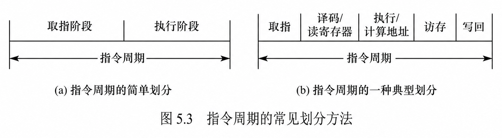

五个阶段的含义如下：

1. **取指（IF）**  
   CPU 根据 PC 的值，从主存（或指令 Cache）中读取下一条指令，并将其送入 IR。同时，PC 被更新为下一条指令的地址。顺序执行时，PC 增加当前指令的长度；若为变长指令，则需要在取指阶段初步解析其格式以确定长度；若发生分支，则目标地址将在后续阶段计算并据此更新 PC。

2. **译码/读寄存器（ID）**  
   对 IR 中的指令进行译码，识别操作码和寻址方式，并从寄存器堆中读取所需的操作数。此阶段还可能组合基址寄存器与偏移量，为后续地址计算做准备。立即数也在本阶段提取。

3. **执行/计算地址（EX）**  
   根据指令类型执行相应操作：算术或逻辑指令由 ALU 完成运算；访存类指令（如 LOAD/STORE）计算操作数在主存中的有效地址；分支指令计算目标地址并判断是否转移。此外，运算结果的状态（如零标志、进位等）通常在此阶段生成并暂存。

4. **访存（MEM）**  
   若指令需要访问主存储器（如加载数据或存储结果），则在此阶段通过数据 Cache 或主存完成读/写操作。寄存器—寄存器类指令不涉及此阶段。

5. **写回（WB）**  
   将最终结果写回寄存器堆。结果可能来自 ALU 的运算输出（执行阶段），也可能来自存储器读取的数据（访存阶段）。写回完成后，该指令的执行即告结束。

需要注意的是，指令周期的具体划分会因处理器架构而异，上述划分只是一种典型示例。实际系统还可能包含中断响应等阶段，此时 CPU 会保存断点并转移至服务程序。由于指令功能和寻址方式不同，不同指令的指令周期长度并不固定。按照实现方式，可分为**定长指令周期**（所有指令的周期长度相同）和**变长指令周期**（不同指令包含的时钟周期数可变）。现代计算机通常采用基于时钟信号定时的变长指令周期，以提高执行效率。
### 5.2.4 处理器指令执行模型

> 考点追踪：单周期和多周期 CPU 的 CPI（2016、2020、2025）

一个指令周期通常由若干依次执行的步骤组成，各步骤协同完成指令的全部功能。不同处理器对这些步骤的组织方式存在显著差异，主要可分为以下三类模型。

1. **单周期处理器**

单周期处理器为所有指令分配相同的执行时间，每条指令都在一个时钟周期内完成，故理想情况下有：

\[
CPI = 1
\]

指令之间严格串行执行，即下一条指令必须等待前一条指令完全结束后才能启动。因此，时钟周期长度由执行时间最长的指令决定。对于原本可以在更短时间内完成的指令，也要占用整个周期，导致硬件资源在部分时间内空闲，从而限制系统整体性能。

2. **多周期处理器**

多周期处理器根据指令类型动态分配执行周期数，不同指令可占用不同数量的时钟周期，因此各条指令的 CPI 可以不同，平均 CPI 通常大于 1。该方案不要求所有指令具有相同执行时间，从而提高了时钟频率和资源利用效率。但是，指令之间仍然串行执行，不能实现重叠处理。

3. **流水线处理器**

流水线处理器采用指令级并行策略，目标是在每个时钟周期完成一条指令的吞吐，理想情况下有：

\[
CPI = 1
\]

其基本思想是在每个时钟周期启动一条新指令，使多条指令在流水线中重叠执行。这样可以提高指令吞吐率，但后续还必须处理结构冒险、数据冒险、控制冒险等问题。

## 5.3 数据通路的功能和基本结构

### 5.3.2 数据通路中的基本元件

> 考点追踪：三态门、多路选择器的应用（2015、2023、2024）

数据通路中的基本元件可分为组合逻辑元件和时序逻辑元件两大类。

1. **组合逻辑元件**

组合逻辑元件的输出只取决于当前输入，不保存历史状态。图中常用虚线表示控制信号。

| 元件 | 作用 |
|---|---|
| 译码器 | 常用于操作码译码或地址码译码。对于 \( n \) 位输入，可产生 \( 2^n \) 个互斥输出。 |
| 多路选择器（MUX） | 根据控制信号 Select 从多路输入中选择一路输出。若输入路数为 \( N \)，则需要 \( \log_2 N \) 位控制信号。 |
| 三态门 | 可看作一种受控总线开关，由控制信号 EN 决定信号通断。EN 为 1 时，三态门打开，输出 out 等于输入 in；EN 为 0 时，输出呈高阻态，即断态，所连寄存器与总线断开。 |

2. **时序逻辑元件（状态元件）**

时序逻辑元件的输出不仅取决于当前输入，还依赖于电路的历史状态，因此其内部必须包含用于存储信息的记忆单元。这类元件还必须在时钟的同步控制下工作。

常见的时序逻辑元件包括各类寄存器和存储器，例如通用寄存器组、程序计数器（PC）、状态/暂存寄存器等。

数据通路的基本结构可以抽象为由**操作元件**与**状态元件**组成的序列，即：

```text
状态元件 -> 操作元件 -> 状态元件 -> 操作元件 -> 状态元件 -> ...
```

图 5.5 展示了数据通路与时钟周期之间的关系。为简化分析，假设寄存器 A 和寄存器 B 的写使能信号一直有效。当时钟上升沿到来时，两个寄存器同时锁存各自的新值。从时钟上升沿开始到寄存器 A 输出稳定的时间称为寄存器延迟 \( T_{\text{clk\_to\_q}} \)；随后数据经过组合逻辑处理，经历关键路径延迟 \( T_{\max} \)。为了确保寄存器 B 能在下一个时钟上升沿正确采样数据，其输入必须在时钟到来前至少提前 \( T_{\text{setup}} \) 保持稳定。

因此，数据通路的最小时钟周期必须满足：

\[
T_{\text{cycle}} \ge T_{\text{clk\_to\_q}} + T_{\max} + T_{\text{setup}}
\]

其中，组合逻辑延迟 \( T_{\max} \) 是关键因素。可见，在 CPU 设计中，缩短组合逻辑的关键路径延迟，是提升系统频率的重要手段。

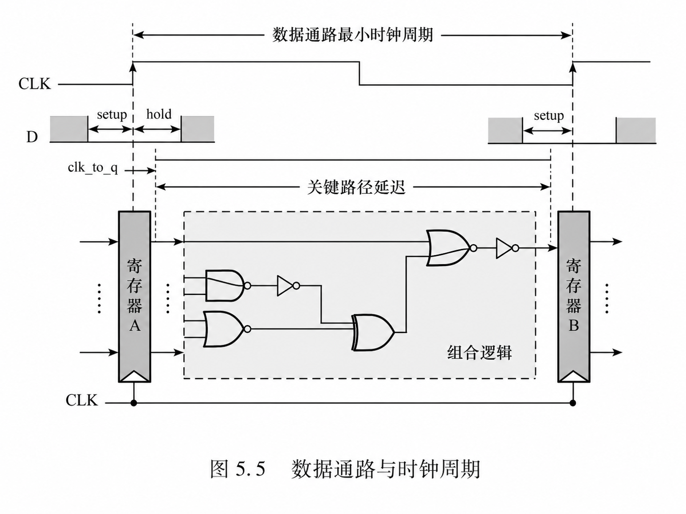

### 5.3.3 数据通路的组织与分类

数据通路可根据内部部件的连接方式和指令执行的时序组织方式进行分类。

1. **按部件连接方式划分**

（1）**总线式数据通路**

总线式数据通路将通用寄存器、ALU 和内部寄存器等主要部件连接到一条或多条 CPU 内部总线。这里的总线是**片内总线**，不同于系统总线。

根据总线数量不同，可分为：

- **单总线结构**：所有数据传输共享一条内部总线，ALU 的输入与输出都通过该总线分时传送。
- **多总线结构**：提供多条独立总线，例如分别用于两个源操作数和结果写回，以支持更高的并行度。

总线式数据通路的优点是硬件结构简洁、易于扩展；缺点是同一时刻只能传输一组数据，容易产生总线竞争。

（2）**专用数据通路**

专用数据通路采用点对点专用连线连接寄存器、ALU 等部件，而非共享总线。各数据通路可以并行传输，从而避免总线冲突。

其优点是数据传输效率高、延迟低；缺点是连线复杂、扩展性差、硬件成本高。

表 5.1 对总线式与专用数据通路的特点进行了对比。

| 对比维度 | 总线式数据通路 | 专用数据通路 |
|---|---|---|
| 结构复杂度 | 简单，部件共享总线，连线少 | 复杂，需要大量点对点专用连线 |
| 扩展灵活性 | 强，新增部件只需挂接总线 | 弱，新增部件需要重新布线 |
| 数据传输效率 | 低，同一时刻仅支持一组数据传输 | 高，多组数据可并行传输 |
| 硬件成本 | 低 | 高 |
| 性能瓶颈 | 总线带宽受限，部件增多时延迟增加 | 无总线瓶颈，性能随并行度提升 |
| 典型应用场景 | 教学模型、嵌入式微控制器 | 高性能通用处理器（如 RISC） |

2. **按时序组织方式划分**

（1）**单周期数据通路**

在单周期数据通路中，每条指令的所有操作（取指、译码、执行、访存、写回等）都在一个时钟周期内完成。时钟周期长度由最慢的指令决定，通常是访存指令。

其特点是控制简单、资源利用率低，可基于总线式或专用数据通路实现。

> 注意：单周期处理器（\( CPI = 1 \)）不能采用单总线结构的数据通路。因为单总线会将所有寄存器都连接到一条公共总线上，一个时钟周期内只允许一次操作，无法完成一条指令的所有操作。

（2）**多周期数据通路**

多周期数据通路将一条指令的执行划分为多个阶段，每个阶段在一个时钟周期内完成。典型阶段包括取指、译码与读寄存器、执行或地址计算、访存、写回等。

其特点是各阶段的结果在时钟边沿被锁存到寄存器中，时钟周期长度通常以一次存储器访问时间为基准。相比单周期设计，多周期数据通路提高了硬件复用率，并缩短了时钟周期。

（3）**流水线数据通路**

流水线数据通路将指令执行过程分解为若干独立且可重叠的阶段，不同指令在不同阶段并发推进。每个阶段由专用功能部件完成，并通过流水段寄存器隔离和传递中间结果。

其特点是时钟周期长度由最长阶段决定；理想情况下，每个周期可以完成一条指令。

### 5.3.4 单总线结构的数据通路

单总线数据通路结构简洁，所有数据传输共享同一条内部总线，同一时刻仅允许一个部件向总线输出数据，因而复杂操作必须分步进行。图 5.6 给出了一种典型的单总线数据通路结构。

> 考点追踪：数据通路中的部件及连接方式（2013、2015、2022）

在图 5.6 中，GPRs 为通用寄存器组，rs 和 rd 分别是源寄存器和目的寄存器的编号，各占 4 位，可寻址 \( 2^4 = 16 \) 个通用寄存器；Y 和 Z 为暂存寄存器，其中 Y 用于暂存从总线读取的操作数，Z 用于暂存 ALU 运算结果；FR 为标志寄存器，用于保存 ALU 运算产生的状态标志。

所有可以向内部总线输出数据的部件（如寄存器、MDR、PC 等）均通过各自的三态门与总线相连，以控制其与总线之间的通断，避免多个输出同时驱动总线造成冲突。图中的虚线表示控制信号，控制信号命名采用“部件名 + in/out”的方式：

- **in** 表示允许向该部件写入，例如 PCin 表示将内部总线上的数据写入 PC。
- **out** 表示允许该部件输出到总线，例如 PCout 表示将 PC 中的内容送至内部总线。

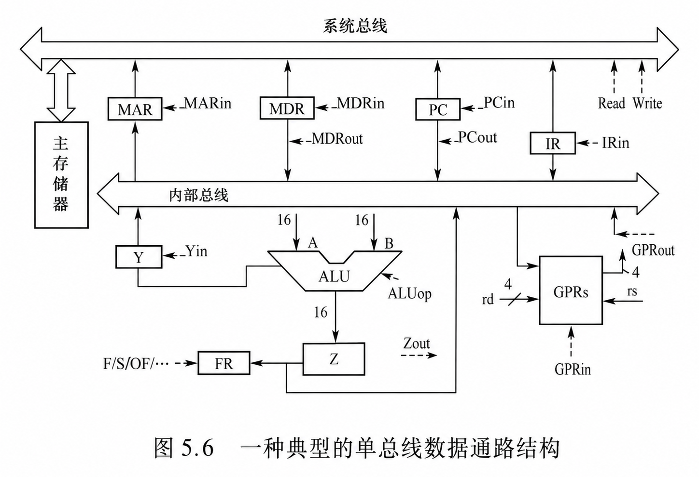

ALU 的操作类型由控制信号 ALUop 决定。若 ALUop 为 \( n \) 位，则最多支持 \( 2^n \) 种操作。以下分析中，假设 ALUop 为 3 位，并约定执行加法操作时 ALUop 的取值为 000。

单总线是一组共享的传输信号线，任何存储信息的部件在某一时刻只能有一个部件将信息发送到总线上。下面以图 5.6 所示的单总线数据通路为例，介绍两条常见指令的指令周期数据流。数据流是指令执行过程中，根据操作要求依次访问的数据序列，该序列会随指令执行阶段和指令类型变化。为简化分析，此处将指令周期分为取指和执行两个阶段。

1. **加法指令**

> 考点追踪：指令执行阶段的操作控制分析（2009、2015、2019）

加法指令的功能是：将 rs 和 rd 寄存器中的值相加，并将结果写回 rd 寄存器。

（1）**取指阶段**

根据 PC 中的内容从主存储器中取出指令代码并存放在 IR 中。假设从发出主存读命令到主存读出数据并传输到 MDR 共需 5 个时钟周期，则取指阶段的数据流如下（不考虑 PC 增量操作）。

| 时钟 | 功能 | 有效控制信号 |
|---|---|---|
| C1 | \((PC) \rightarrow MAR\) | PCout，MARin |
| C2—C6 | \(MEM(MAR) \rightarrow MDR\) | MDRin，read |
| C7 | \((MDR) \rightarrow IR\) | MDRout，IRin |

上述过程可解释为：先将 PC 的内容写入 MAR（1 个时钟周期），再读主存并将读出的数据写入 MDR（5 个时钟周期），最后将 MDR 的内容写入 IR（1 个时钟周期）。

（2）**执行阶段**

假设 rs 和 rd 寄存器的编号分别为 0001 和 0010，将两个操作数取出，送入 ALU 执行加法运算，并将运算结果送回 rd 寄存器。执行阶段的数据流如下。

| 时钟 | 功能 | 有效控制信号 |
|---|---|---|
| C8 | \((rs) \rightarrow Y\) | rs = 0001，GPRout，Yin |
| C9 | \((rs) + (rd) \rightarrow Z\) | rd = 0010，GPRout，ALUop = 000 |
| C10 | \((Z) \rightarrow rd\) | Zout，rd = 0010，GPRin |

上述执行阶段可解释为：先将 rs 寄存器中的内容写入暂存寄存器 Y（1 个时钟周期）；再将 rd 寄存器中的值取出并与 Y 暂存器中的值相加，结果送入 Z 暂存器（1 个时钟周期）；最后将暂存寄存器 Z 中的加法结果送回 rd 寄存器（1 个时钟周期）。

> 注意：在单总线数据通路中，任一时刻总线上只允许一个数据传输。由于 ALU 是无存储能力的组合逻辑电路，运算时需要两个输入同时有效，因此必须先将一个操作数经总线送入暂存寄存器 Y；下一周期再将另一个操作数送至 ALU 的另一个输入端，Y 的输出作为其中一个操作数。此外，ALU 输出不能直接连到总线，否则可能通过总线反馈至输入端，干扰运算结果，故需要暂存于暂存寄存器 Z 中。

2. **取数指令**

取数指令的功能是：将主存地址为 rs 寄存器中的值的主存单元内容取出，并送回 rd 寄存器。

（1）**取指阶段**

所有指令取指阶段的数据流都相同，此处不再赘述。

（2）**执行阶段**

假设 rs 和 rd 寄存器编号分别为 0001 和 0010，从发出主存读命令到主存读出数据并传输到 MDR 共需 5 个时钟周期，则执行阶段的数据流如下。

| 时钟 | 功能 | 有效控制信号 |
|---|---|---|
| C8 | \((rs) \rightarrow MAR\) | rs = 0001，GPRout，MARin |
| C9—C13 | \(MEM(MAR) \rightarrow MDR\) | MDRin，read |
| C14 | \((MDR) \rightarrow rd\) | MDRout，rd = 0010，GPRin |

上述过程可解释为：先将 rs 的内容写入 MAR（1 个时钟周期）；再读主存并将读出的数据写入 MDR（5 个时钟周期）；最后将 MDR 的内容写入 rd 寄存器（1 个时钟周期）。

### 5.3.5 专用结构的数据通路

本节以**单周期数据通路**为例说明专用结构数据通路的设计原理。在单周期数据通路中，每条指令的取指和执行都在一个时钟周期内完成，因此 CPU 的时钟周期必须以最耗时的指令为准。

由于单周期处理器在同一个时钟周期内不能复用某些功能部件，系统需要为频繁使用的功能单元配置多组独立实例。例如，加法器这类功能部件可能需要分别用于 PC 更新和地址计算。同时，为避免指令获取和数据访问发生冲突，指令和数据通常分别存放在独立的存储器中，使二者能够在同一时钟周期内并行访问。

完整的单周期数据通路结构较复杂。教材以 MIPS 指令系统为例，结合具体指令执行过程逐步拆解关键设计思想。这里的基本思想不仅适用于单周期模型，对多周期处理器、流水线处理器乃至更复杂的处理器结构同样具有参考意义。

1. **取指令部件的设计**

每条指令的第一步都是完成取指令并计算下一条指令地址。图 5.7 展示了取指令部件的结构示意图。

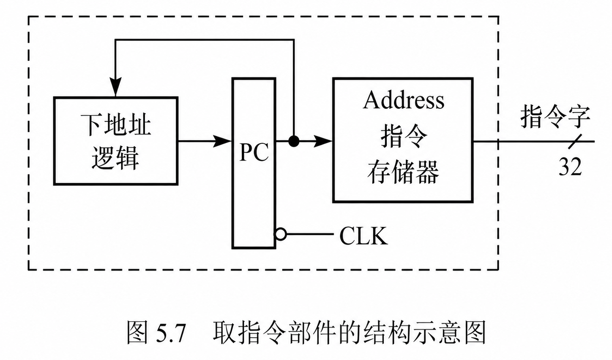

指令存储在指令存储器中，指令存储器只支持读操作。取指时，只需要提供指令地址，经过固定延迟后即可得到相应的 32 位指令字。指令地址由程序计数器 PC 提供。

取指令部件包含专用的下地址逻辑电路，用于计算并更新 PC 值，从而确定下一条指令的地址。下地址逻辑根据当前指令类型选择不同的执行路径：

- **顺序执行**：当指令为普通顺序指令时，直接计算 PC + 4，得到下一条指令地址。
- **转移执行**：对于分支或转移指令，需要根据指令类型计算转移目标地址。例如，beq 指令（相等转移）通过比较两个寄存器的内容决定是否转移，并根据偏移量计算新的 PC 值。

2. **R 型运算类指令数据通路**

R 型指令是操作数全部来自通用寄存器、运算结果也写回通用寄存器的算术/逻辑运算指令。以加法指令为例：

```text
add rd, rs, rt      # R[rs] + R[rt] -> R[rd]
```

图 5.8 展示了 R 型指令相关的数据通路。该数据通路能够对两个寄存器 Rs 和 Rt 的内容进行运算，并将结果写回 Rd 寄存器。

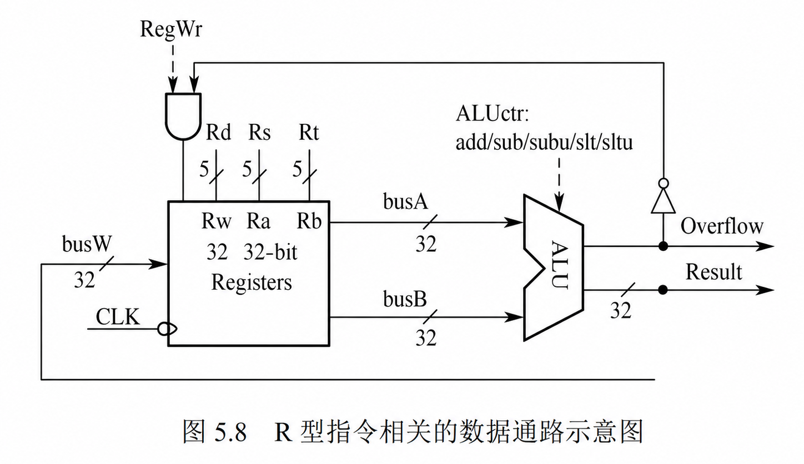

对于 add 和 sub 等指令，还需判断运算结果是否溢出。仅当没有发生溢出时，才允许将结果写回 Rd 寄存器；若发生溢出，则触发异常处理。

R 型指令中的 Rs 和 Rt 是两个源操作数寄存器的编号，Rd 是目的寄存器的编号。因此：

- 寄存器堆的两个读地址端 Ra 和 Rb 应分别与 Rs 和 Rt 相连。
- 写地址端 Rw 应与 Rd 相连。
- ALU 的运算结果通过总线 busW 连接到寄存器堆的写数据端。
- 控制信号 RegWr 作为寄存器堆的写使能信号。在 RegWr 为 1 且未溢出的情况下，运算结果才被写入寄存器堆。R 型指令执行期间，RegWr 信号应始终为 1。

ALU 的操作类型由控制信号 ALUctr 决定。若 ALU 支持 N 种不同运算，则 ALUctr 至少需要 \( \log_2 N \) 位来选择具体运算类型。

由于单周期处理器必须在一个时钟周期内完成指令，因此其数据通路中不设置指令寄存器 IR，而是直接从指令存储器中取指令并解析执行。否则，仅将指令取到 IR 就需要一个时钟周期，无法满足单周期处理器的设计要求。

3. **I 型运算指令的数据通路**

I 型运算指令（立即数运算类指令）的核心执行逻辑是：先将指令中的 16 位立即数扩展为 32 位，再将寄存器 Rs 的内容送入 ALU 运算，最后将结果写回目的寄存器 Rt。以符号加法指令为例：

```text
addi rt, rs, imm16      # R[rs] + SignExt[imm16] -> R[rt]
```

其中，SignExt[imm16] 表示对 16 位立即数进行符号扩展。

图 5.9 是在 R 型指令数据通路的基础上，增加支持 I 型指令的功能模块后形成的通用数据通路。新增模块主要包括立即数扩展器和多路选择器，该通路可同时执行 R 型和 I 型运算指令。

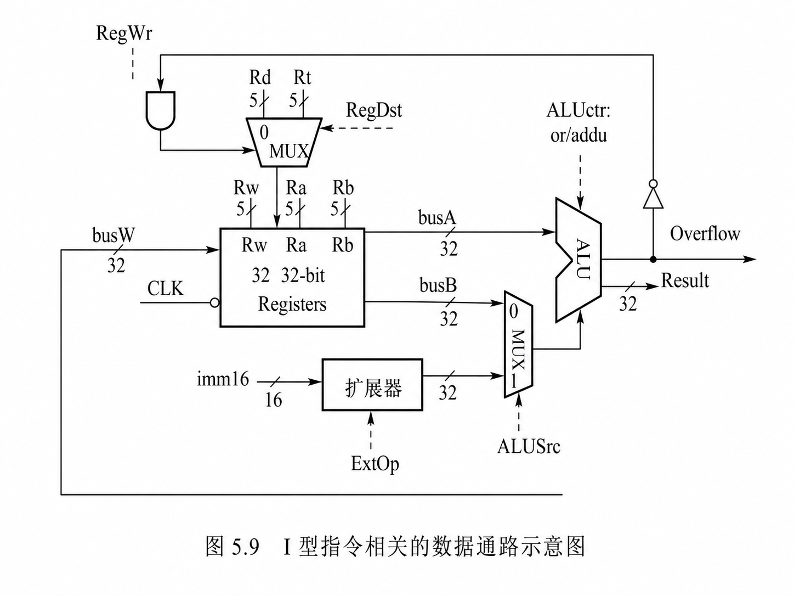

与图 5.8 相比，图 5.9 中的数据通路主要有以下三处改动：

1. **目的寄存器选择**：R 型指令使用目的寄存器 Rd，I 型指令使用目的寄存器 Rt。因此，在寄存器堆的写地址端 Rw 处增设多路选择器，由控制信号 RegDst 控制：
   - RegDst = 1 时，执行 R 型指令，选择 Rd 为目的寄存器。
   - RegDst = 0 时，执行 I 型指令，选择 Rt 为目的寄存器。
2. **立即数扩展**：I 型指令的 16 位立即数必须扩展为 32 位后才能送入 ALU。数据通路中新增立即数扩展器，输入为指令的 imm16 字段，扩展方式由控制信号 ExtOp 决定：
   - 对于算术类指令，采用符号扩展。
   - 对于按位逻辑操作指令，采用零扩展。
3. **ALU 第二操作数选择**：R 型指令的第二操作数来自寄存器 Rt，I 型指令则使用扩展后的立即数。因此，在 ALU 的第二输入端增设多路选择器，由控制信号 ALUSrc 控制：
   - ALUSrc = 0 时，执行 R 型指令，选择寄存器 Rt 的数据。
   - ALUSrc = 1 时，执行 I 型指令，选择扩展后的立即数。

4. **访存指令的数据通路**

MIPS 访存指令属于 I 型指令，需要进行立即数运算。主要包括 LOAD 和 STORE 两类：

```text
lw rt, imm16(rs)      # M[R[rs] + SignExt(imm16)] -> R[rt]
sw rt, imm16(rs)      # R[rt] -> M[R[rs] + SignExt(imm16)]
```

LOAD 和 STORE 指令的访存地址计算逻辑完全一致：先对指令中的 16 位立即数 imm16 进行符号扩展，然后将其与寄存器 Rs 的内容相加，得到访存地址。二者的区别在于数据传输方向：

- **LOAD 指令**从该地址读取 32 位数据，并将数据写入寄存器 Rt。
- **STORE 指令**将寄存器 Rt 中的 32 位数据写入该地址对应的存储单元。

图 5.10 是在图 5.9 的基础上增加支持 LOAD/STORE 指令功能模块后的数据通路示意图。该数据通路不仅能够执行 LOAD/STORE 指令，还能兼容 R 型和 I 型运算指令。

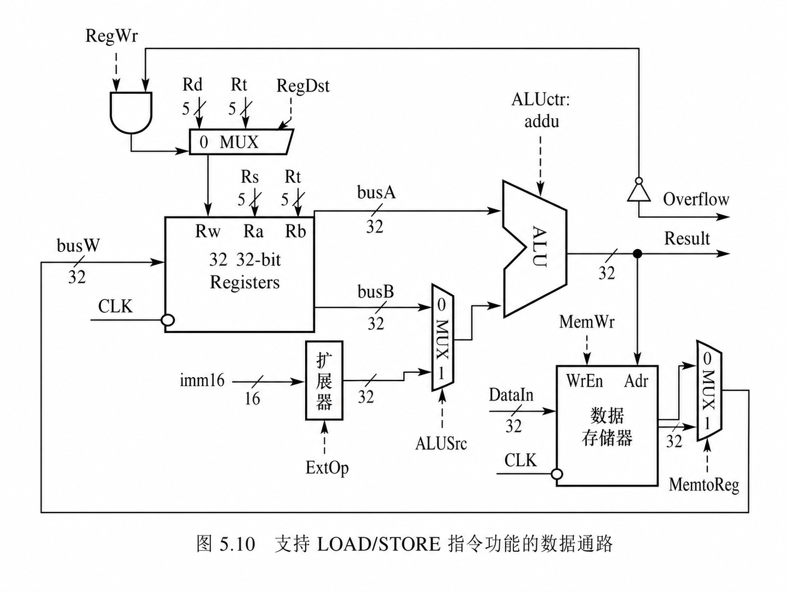

与图 5.9 相比，图 5.10 中的数据通路主要有以下两处改动：

1. **写回寄存器的数据选择**：为了处理运算类指令与 LOAD 指令写回寄存器的不同数据来源，在寄存器堆的写端口 busW 处增设多路选择器，由控制信号 MemtoReg 控制：
   - MemtoReg = 0 时，执行运算类指令，选择 ALU 的运算结果。
   - MemtoReg = 1 时，执行 LOAD 指令，选择数据存储器读出的数据。
2. **新增数据存储器模块**：为了满足 LOAD/STORE 指令对数据存储器的读/写需求，数据通路中加入数据存储器。数据存储器的地址端 Adr 直接连接到 ALU 的输出端，因为访存地址由 ALU 计算得出。STORE 指令需要将寄存器 Rt 的内容送入数据存储器的数据输入端 DataIn；是否写入由控制信号 MemWr 控制。

## 5.4 控制器的功能和工作原理

### 5.4.1 控制器的结构和功能

控制器是计算机的**指挥中心**，它的主要职责包括：

1. **取出待执行的指令并计算下一条指令的位置**：即完成取指，并更新程序计数器 PC。
2. **对指令操作码进行译码**：根据译码结果产生相应的时序信号和控制信号，协调寄存器、ALU、存储器等部件工作。
3. **管理 CPU、主存和 I/O 设备之间的数据流向**：保证各类数据通路在正确的时间被正确打开或关闭。

依据微操作控制信号的生成方式不同，控制器可分为**硬布线控制器**和**微程序控制器**。二者都包含 PC 和 IR 等基本部件，但在指令执行步骤的表现形式以及控制信号生成机制上存在本质区别。

### 5.4.2 硬布线控制器

硬布线控制器由复杂的组合逻辑电路和触发器构成，也称为**组合逻辑控制器**。它根据指令要求、当前时序和内部状态，按时间顺序生成一系列微操作控制信号，从而完成指令执行。

指令的操作码是决定控制单元 CU 行为的关键。CU 作为处理器的“指挥中心”，依据操作码生成相应控制信号，协调寄存器、ALU、存储器等硬件组件工作。

为简化 CU 的设计，通常将指令寄存器 IR 中的操作码通过译码电路转换为若干输出信号。若操作码有 \( n \) 位，则译码器可产生 \( 2^n \) 个输出信号。每种操作码译码后会唯一激活一条输出信号线，用于触发对应的控制逻辑。若将操作码译码器和节拍发生器从 CU 中分离，就可得到图 5.13 所示的简化控制单元结构。

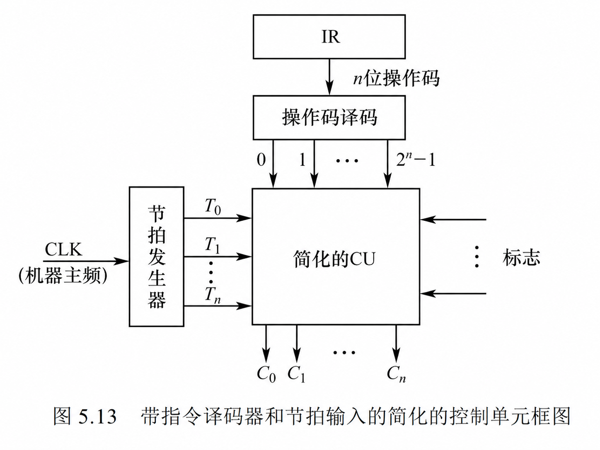

CU 的输入主要包括三类信号：

1. **操作译码器输出的指令信息**：与节拍信号共同用于生成相应微操作控制信号。
2. **时钟脉冲**：其频率即机器主频，用于划分节拍，确保控制信号按时发出。
3. **执行单元反馈的状态标志**：使 CU 能够根据 CPU 当前状态动态调整控制逻辑。

在图 5.13 中，节拍发生器在每个时钟周期内产生节拍信号，使不同的微操作控制信号 \( C_i \) 能够按序发出。由于某些指令（如条件转移）的执行不仅取决于操作码，还受状态标志影响，因此 CU 必须综合**操作码译码结果、节拍信号和状态标志**生成相应控制信号，并将控制信号发送到 CPU 内部数据通路或外部控制总线。

硬布线控制器通过组合逻辑电路实现，性能主要受限于电路延迟。设计时通常先用逻辑表达式描述各种控制信号，再经化简后实现为硬件电路。它的优点是响应速度快，但灵活性较差：修改或新增指令需要重新设计电路，复杂且耗时。随着指令系统功能增强，微操作控制信号数量急剧增加，会导致电路规模庞大、调试困难。因此，为克服这些缺点，产生了微程序设计方法。

### 5.4.3 微程序控制器

微程序控制器采用存储逻辑实现。其核心思想是：把控制器所需的微操作控制信号组织成**微指令**，并把执行每条机器指令所需的微指令序列，即**微程序**，预先存入一个专用的高速存储器中。运行时，控制器依次读取微指令，产生对应的微操作控制信号，从而完成机器指令的执行。

1. **微程序控制的基本概念**

微程序设计思想是将每条机器指令编写为一段微程序。该微程序由若干条微指令组成，每条微指令可产生一个或多个微命令。因此，执行一条机器指令的过程，本质上就是顺序执行其对应微程序的过程。这些微程序预先存放在专用的**控制存储器**（Control Memory，CM）中。

（1）**微命令与微操作**

在微程序控制的计算机中，控制部件向执行部件发出的最基本控制信号称为**微命令**，它是构成控制序列的最小单位。例如，使能某个寄存器的写入信号、打开数据通路中的控制门等，都属于微命令。

执行部件收到微命令后所执行的具体动作称为**微操作**，微命令与微操作一一对应。

微命令可分为两类：

- **相容性微命令**：可以在同一时刻同时有效，并协同完成某一功能的微命令。
- **互斥性微命令**：在同一时刻不允许同时有效的微命令。

> 注意：硬布线控制器中同样存在微命令与微操作的概念，只是其实现方式不同。

（2）**微指令与微周期**

微指令是若干微命令的集合，通常包含两个字段：

1. **操作控制字段**，又称**微操作码字段**：用于生成当前步骤所需的微操作控制信号。
2. **顺序控制字段**，又称**下址字段**：用于确定下一条微指令的地址。

微周期是执行一条微指令所需的基本时间单位，通常为一个时钟周期。

机器指令、微程序、微指令、微命令与微操作之间的层次关系如图 5.14 所示。

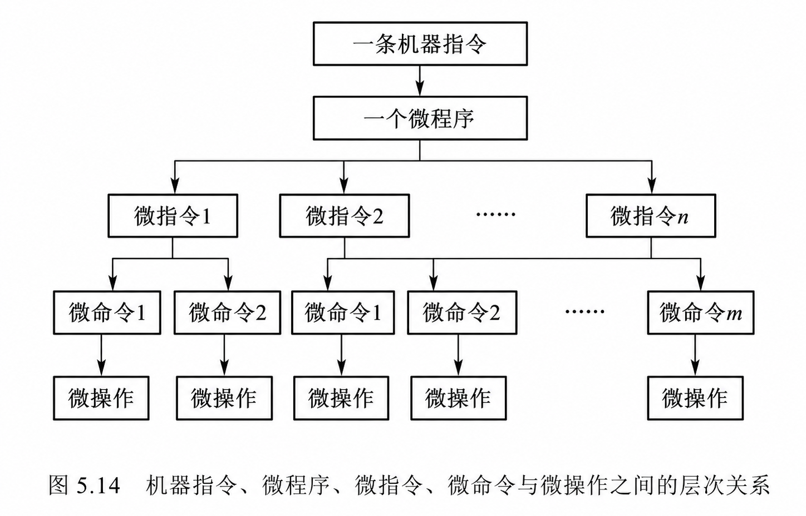

（3）**主存储器与控制存储器**

> 考点追踪：主存储器和控制存储器的区别（2017）

主存储器用于存放程序和数据，位于 CPU 外部，通常用 RAM 实现；控制存储器用于存放微程序，位于 CPU 内部，通常用 ROM 实现。控制存储器中每个存储单元的地址称为**微地址**。

为了在微程序控制器中正确访问主存和控制存储器，需要区分以下关键寄存器：

| 寄存器 | 作用 |
|---|---|
| 地址寄存器 MAR | 存放主存读/写地址。 |
| 微地址寄存器 \( \mu PC \) 或 CMAR | 存放待执行微指令在控制存储器中的微地址。 |
| 指令寄存器 IR | 存放从主存读出的当前机器指令。 |
| 微指令寄存器 \( \mu IR \) 或 CMDR | 存放从控制存储器读出的当前微指令。 |

（4）**程序与微程序**

微程序和程序是两个不同概念。程序是指令的有序集合，由软件开发者编写，用于完成特定功能，最终存放在主存或辅存中；微程序是微指令的有序集合，由计算机体系结构设计者编写，用于解释和执行机器指令，固化于控制存储器中。

微程序本质上是机器指令的**硬件级解释逻辑**。对程序员而言，微程序的存在完全透明，无须了解其内部结构。

2. **微程序控制器的组成和工作过程**

（1）**微程序控制器的基本组成**

图 5.15 展示了微程序控制器的基本结构，其主要部件包括：

1. **微地址形成部件**：根据机器指令操作码生成对应微程序的入口地址，并根据当前微指令的顺序控制字段及状态条件，产生后续微地址，保证微指令有序执行。
2. **微地址寄存器**：接收微地址形成部件提供的微地址，作为控制存储器 CM 的读地址。
3. **控制存储器**：微程序控制器的核心部件，用于存放所有机器指令对应的微程序。
4. **微指令寄存器**：暂存从 CM 中读出的微指令，并将其操作控制字段和顺序控制字段分别送至执行单元和微地址形成部件。

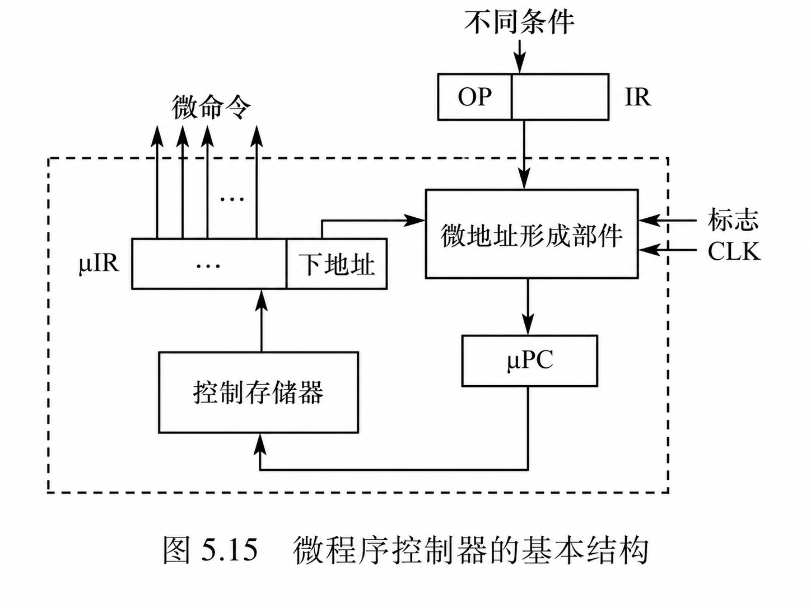

（2）**微程序控制器的工作过程**

微程序控制器的工作过程是指计算机在微程序控制下执行机器指令的流程，具体如下：

1. **执行取指令公共操作**：系统启动或每条指令执行完毕后，将取指微程序的入口地址（通常为 CM 的 0 号单元）送入 \( \mu PC \)。随后，从 CM 中读出首条取指微指令并送入 \( \mu IR \)。完成取指微程序后，从主存中取出的机器指令被存入指令寄存器 IR。
2. **生成当前指令的微程序入口地址**：根据 IR 中机器指令的操作码，微地址形成部件产生对应微程序的起始微地址，并送入 \( \mu PC \)。
3. **顺序执行微程序**：从 CM 逐条读取微指令，送入 \( \mu IR \) 并执行，直到该微程序执行完毕。
4. **返回循环**：当前机器指令对应的微程序结束后，控制器自动转移回取指微程序入口，重新开始处理下一条机器指令。

整个流程不断循环，直到整个程序执行完毕。

（3）**微程序和机器指令**

一般而言，**一条机器指令对应一个微程序**。由于所有指令的取指操作相同，可将取指操作的微命令统一编写为一个公共的取指微程序，专门负责从主存读取指令并送入 IR。

此外，还可以为间址、中断处理等公共操作分别编写独立的微程序。因此，控制存储器中存储的微程序总数为：

- 机器指令对应的微程序数；
- 取指、间址、中断等公共微程序数。

3. **微指令的编码方式**

微指令的编码方式也称微指令的控制方式，是指对微指令操作控制字段进行组织和表示的方法。其目标是在保证执行速度的前提下，尽可能缩短微指令字长，从而节省控制存储器空间。

（1）**直接编码（直接控制）方式**

如图 5.16 所示，直接编码方式无须译码。微指令的操作控制字段中，每一位直接对应一个微命令。设计微指令时，若需要发出某个微命令，只需将对应位设为 1，否则设为 0。每个微命令独立控制数据通路中的一个微操作。

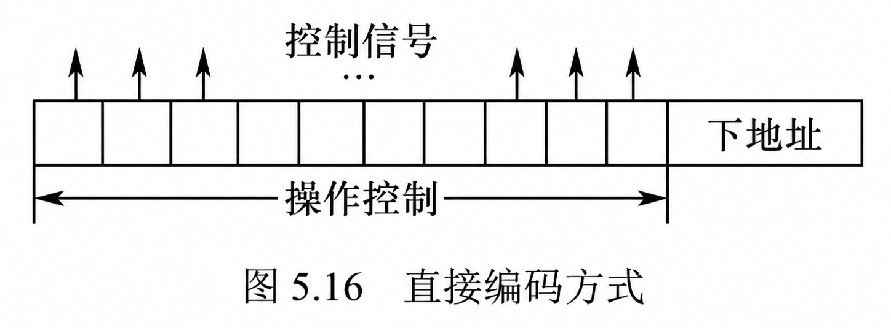

该方式的优点是结构简单、直观，微命令可并行发出，执行速度快；缺点是微指令字长过长。若有 \( n \) 个微命令，则操作控制字段需要 \( n \) 位，导致控制存储器容量急剧膨胀。

（2）**字段直接编码方式**

> 考点追踪：字段直接控制的编码方式（2012）

如图 5.17 所示，字段直接编码将操作控制字段划分为若干互斥字段。互斥性微命令被归入同一字段，相容性微命令则分配到不同字段。每个字段独立编码，经译码后在其所属的互斥微命令集中激活一个微命令。各字段之间相互独立，编码含义互不影响。

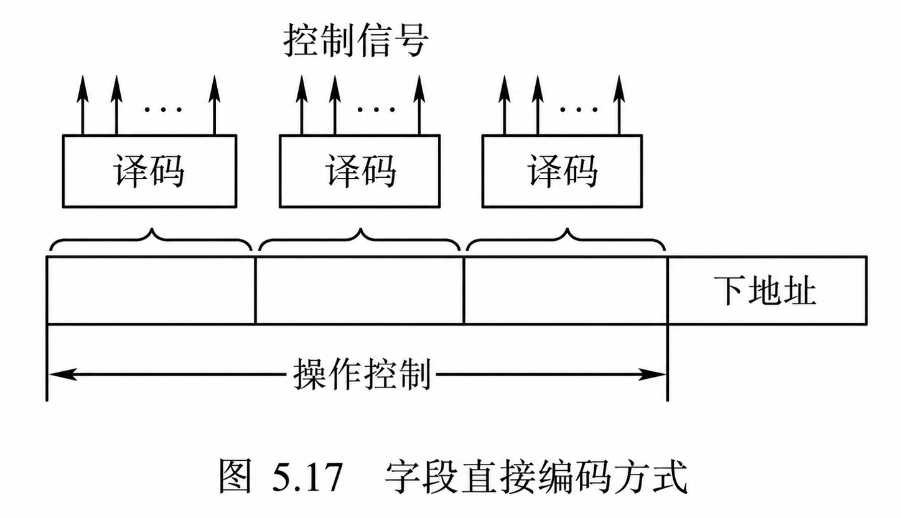

微命令字段分段需遵循以下原则：

1. 互斥性微命令应分配在同一字段，而相容性微命令应分布在不同字段。
2. 每个字段的位数不宜过多，以避免译码电路过于复杂或引入较大延迟。
3. 每个字段通常还需留出一个编码表示“本字段无操作”。例如，当字段长度为 3 位时，最多只能表示 7 个互斥微命令，通常用 000 表示无操作。

该方式显著缩短了微指令字长，但由于需要译码，执行速度略低于直接编码。

（3）**字段间接编码方式**

字段间接编码进一步压缩微指令长度。其基本思想是：某个微命令字段的实际含义由另一个字段的编码共同决定。例如，字段 A 的编码 001 本身无固定意义，只有结合字段 B 的值才能确定 001 表示加法还是写内存。

这种方式可以进一步缩短微指令字长，减少控制存储器容量需求。然而，由于译码线路更复杂，时间开销较大，因此仅适用于特定场合。

举例说明：若有两类互斥操作，分别为 ALU 操作（加、减、与、或，共 4 种）和存储器操作（读、写、取指、间址，共 4 种），共 8 个微命令。ALU 操作彼此互斥，存储器操作彼此互斥，但 ALU 与存储器操作相容，可以同时发生，例如“加法 + 写内存”。

- 直接编码需要 8 位，每位对应一个微命令。
- 字段直接编码可分为两个字段，每个字段 3 位（含无操作状态），共需 6 位。
- 字段间接编码只用一个 3 位操作字段，再增加 1 位类型字段指示其类别，总共只需 4 位。

4. **微指令的地址形成方式**

为保证微指令流的连续执行，每条微指令必须指明其下一条微指令的地址。该地址通常在当前微指令从控制存储器中取出后立即生成，可通过以下两种基本方式形成：

1. **增量方式（计数器方式）**：下条微地址由微程序计数器 \( \mu PC \) 自动加 1 生成，适用于微程序中的顺序执行段。
2. **断定方式（下址字段方式）**：在当前微指令中显式指定下条微地址。图 5.15 所示的微程序控制器即采用断定方式，微指令中包含下址字段，可直接给出下条微地址。

在实际运行中，下条微地址的确定取决于以下三种典型情形：

1. **微程序入口地址的形成**：一条机器指令从主存取出并送入 IR 后，其操作码经微地址形成部件生成对应微程序的首条微指令地址，并送入 \( \mu PC \)。
2. **顺序执行**：在无转移的微程序段中，通常采用增量方式，由 \( \mu PC + 1 \) 自动生成下条微地址；若采用断定方式，则需在每条微指令的下址字段中显式填写顺序地址。
3. **条件分支**：当需要根据状态标志或外部条件选择不同执行路径时，微地址形成部件结合当前微指令下址字段指定的转移目标地址与条件信号来确定下条微地址。

5. **微指令的格式**

微指令格式与其编码方式密切相关，通常分为**水平型微指令**和**垂直型微指令**两类。

> 考点追踪：微指令后继地址字段位数与微指令条数的关系（2014）

（1）**水平型微指令**

从编码方式看，直接编码、字段直接编码和字段间接编码都属于水平型微指令。水平型微指令的基本格式如图 5.18 所示，其操作控制字段中，每一位或每一字段直接对应一个微命令：置 1 表示有效，置 0 表示无效。

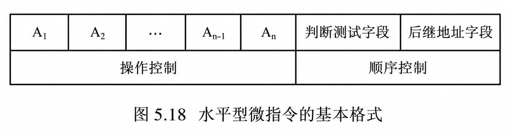

一条水平型微指令可同时定义并执行多个并行微操作。其优点是并行能力强、执行效率高、微程序短；缺点是微指令字长长，编写微程序困难。

（2）**垂直型微指令**

垂直型微指令类似机器指令结构，在微指令中设置微操作码字段，通过译码产生控制信号。其基本格式如图 5.19 所示。通常一条垂直型微指令只显式定义一个基本微操作。

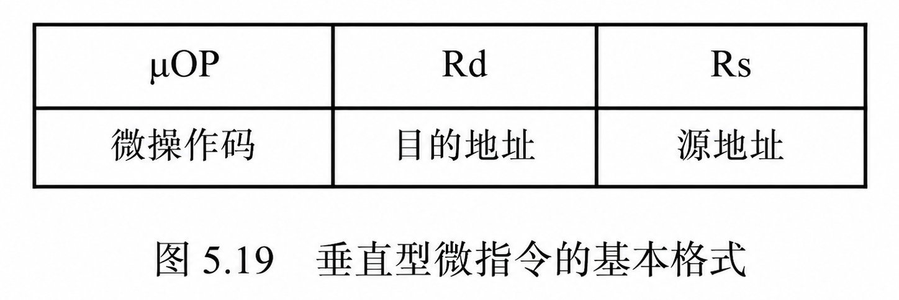

垂直型微指令的优点是微指令短、格式规整、编写微程序简单；缺点是微程序长、执行速度慢、效率低。

水平型微指令与垂直型微指令的比较如下：

1. 水平型微指令并行能力强、灵活性强、效率高；垂直型在这些方面表现较差。
2. 单条水平型微指令可完成更多工作；垂直型需要多条微指令完成同等任务，耗时更长。
3. 水平型微指令字长但编写的微程序短；垂直型微指令字长短但微程序长。
4. 水平型微指令编写微程序难度大；垂直型类似于机器指令，更易于理解和编写。
6. **硬布线控制器和微程序控制器的特点**

> 考点追踪：硬布线控制器和微程序控制器的特点（2009）

（1）**硬布线控制器的特点**

硬布线控制器的运行速度主要取决于电路延迟，因此**执行速度快**。它直接用组合逻辑电路和时序逻辑电路产生控制信号，不需要像微程序控制器那样逐条读取控制存储器中的微指令。

但硬布线控制器的控制逻辑与具体指令系统高度绑定。若要增加新指令、修改指令功能或调整控制时序，就需要重新设计控制线路，因此设计复杂、调试困难、修改不便，灵活性较差。

硬布线控制器适合指令系统较简单、追求高速执行的计算机，典型代表是 RISC 风格处理器。

（2）**微程序控制器的特点**

微程序控制器通过存放在控制存储器中的微程序来解释并执行机器指令。每条机器指令对应一段微程序，控制器按微指令序列发出微命令，从而驱动数据通路完成相应操作。

微程序控制器的优点是结构规整、设计方便、易于修改和扩展。若要增加或修改一条机器指令，通常只需调整控制存储器中的相应微程序，而不必大规模重构硬件控制线路。

其缺点是执行速度较慢，因为每执行一步微操作都可能需要访问控制存储器并读取微指令。微程序控制器更适合指令系统复杂、控制逻辑庞大的计算机，典型代表是 CISC 风格处理器。

## 5.5 异常和中断机制

### 5.5.1 异常和中断的基本概念

CPU 在执行程序时，可能会遇到正常指令流之外的事件。例如，执行指令时发现非法操作码、访存时发生缺页、除法运算时除数为 0，或外部设备请求 CPU 处理 I/O 事件。这类事件会打断原来的执行流程，使 CPU 转去执行相应的处理程序。

**异常**通常由 CPU 内部在执行当前指令时检测到，具有与当前指令密切相关的同步性。例如非法操作码、算术溢出、缺页、除数为 0 等都属于异常。

**中断**通常由 CPU 外部设备或外部事件提出，具有异步性。例如键盘输入、定时器到时、I/O 设备完成数据传输等事件都可能向 CPU 发出中断请求。

异常和中断机制的作用是：当程序执行过程中出现特殊情况时，CPU 能够保存必要现场，转入操作系统或相应服务程序处理；处理完成后，依据事件性质决定是否返回原程序继续执行、重新执行引发事件的指令，或终止当前进程。

### 5.5.2 异常和中断的分类

1. **异常的分类**

异常可分为**故障**、**自陷**和**终止**三类。

（1）**故障（Fault）**

故障通常在指令执行过程中被检测到，且与当前正在执行的指令有关。例如非法操作码、访存时发生缺页、执行除法指令时发现除数为零等，都可能触发故障。

对于可恢复的故障，例如缺页，操作系统处理完成后会把所需页面调入内存，然后返回并**重新执行引发故障的指令**。对于不可恢复的故障，例如非法指令、除零等，程序无法继续执行，通常会终止当前进程。

（2）**自陷（Trap）**

> 考点追踪：自陷的原理和性质（2020）

自陷是一种**预先安排**的事件，用于主动转入操作系统内核中的同步处理过程，也称为陷阱或陷入。它不是随机故障，而是程序通过特定指令或控制标志有意触发的异常。

典型应用包括：x86 计算机架构中的断点调试与单步跟踪机制、系统调用指令（如 syscall），以及 MIPS 架构中的条件自陷指令（如 teq）。它类似于在程序中预先设置的“陷阱”：当执行到相应指令或满足特定控制条件时，CPU 会自动转到相应处理程序。

自陷处理完成后，CPU 总是从**自陷指令的下一条指令**继续执行。故障异常和自陷异常通常属于程序性异常，也常被称为软件中断。

（3）**终止（Abort）**

终止是指在指令执行过程中发生严重的硬件故障，例如控制器出错、存储器校验错、总线错误等，使系统无法继续正常运行。此时 CPU 会转入相应的异常服务程序，通常用于记录错误信息或重启系统。

终止异常往往不是由某条特定指令直接引发，具有不可预测性，通常反映底层硬件或系统状态的严重损坏。终止异常和外中断属于硬件中断。

2. **中断的分类**

> 考点追踪：对中断和异常事件的判断（2009、2016、2020、2025）

中断是由外部设备或外部事件发起的异步请求。典型中断源包括 I/O 设备（如键盘输入）、定时器（如周期性时钟中断）等。这些设备通过专用的中断请求信号线向 CPU 提出请求。

CPU 通常在每条指令执行结束后检查中断请求线。若检测到有效中断请求，则进入中断响应周期。

按是否允许屏蔽，中断可分为：

（1）**可屏蔽中断**

可屏蔽中断通过可屏蔽中断请求线 INTR 发送。CPU 可以通过中断控制器中的中断屏蔽寄存器，有选择地屏蔽或允许某些中断源。被屏蔽的中断请求不会传送到 CPU。

（2）**不可屏蔽中断**

不可屏蔽中断通过专用的不可屏蔽中断请求线 NMI 发送，无法被软件屏蔽，通常用于处理高优先级紧急事件，例如电源掉电、内存校验错误等。NMI 能确保 CPU 及时响应这类关键故障。

异常和中断的处理流程类似，但二者存在两个重要区别：

1. **触发时机不同**：异常（如缺页、除零等）由当前执行的指令直接引发，具有同步性；中断由外部事件异步触发，与任何特定指令无关，并且不会打断当前指令的执行。
2. **检测机制不同**：异常由 CPU 内部逻辑在指令执行过程中自动检测，或由软件显式触发；中断则依赖外部硬件通过中断请求线通知 CPU，CPU 再进一步确定中断源及类型。

此外，中断还可以从其他维度分类：按服务程序入口地址的获得方式，可分为**向量中断**和**非向量中断**；按是否允许嵌套处理，可分为**单重中断**和**多重中断**。

### 5.5.3 异常和中断响应过程

当 CPU 在执行指令过程中检测到异常，或在指令边界处采样到中断请求时，会启动异常或中断响应过程。其核心目标是：**保存当前程序的断点与必要现场，转入相应处理程序，并在处理结束后根据事件性质决定是否返回原程序**。

一般而言，异常和中断响应需要完成以下工作：

1. **关中断或设置屏蔽状态**：防止在响应过程中被同级或低级中断再次打断，保证处理过程的原子性。
2. **保存断点**：保存当前程序需要返回的位置。对于中断，通常保存下一条将要执行的指令地址；对于可恢复故障，通常保存引发故障的指令地址，以便处理后重新执行。
3. **识别异常或中断源**：确定事件类型，并取得相应服务程序入口地址。向量中断可直接由硬件给出入口地址，非向量中断则需通过软件查询确定中断源。
4. **转入处理程序**：把服务程序入口地址送入 PC，CPU 开始执行异常或中断服务程序。
5. **恢复现场并返回或终止**：处理完成后，若事件可恢复，则恢复原程序现场并返回；若事件不可恢复，则终止当前进程或采取系统级恢复措施。

对于故障、自陷和终止三类异常，返回位置有所不同：

| 类型 | 处理后返回位置或结果 |
|---|---|
| 故障 | 若可恢复，通常返回并重新执行引发故障的指令。 |
| 自陷 | 处理完成后，从自陷指令的下一条指令继续执行。 |
| 终止 | 通常无法返回原程序，往往终止当前进程或重启系统。 |

## 5.6 指令流水线

### 5.6.1 指令流水线的基本概念

指令流水线将一条指令的执行过程划分为若干功能阶段，使多条指令在不同阶段上重叠执行。例如，一条指令正在执行阶段时，后一条指令可以同时进行译码，再后一条指令可以同时进行取指。这样可以提高处理器在单位时间内完成指令的数量。

流水线提高的是**指令吞吐率**，而不是单条指令本身的执行延迟。在理想情况下（无冒险、无停顿），每个时钟周期均有一条新指令进入流水线，同时有一条指令完成执行，此时每条指令的平均时钟周期数（CPI）趋近于 1。

> 考点追踪：流水线对指令集的要求（2011）

为便于高效实现指令流水线，指令集应具备以下特征：

1. **指令长度统一**：简化取指与译码逻辑，避免因变长指令导致取指周期不确定。
2. **指令格式规整**：保证源操作数寄存器字段位置固定，使译码阶段能够预先读取操作数。
3. **采用 LOAD/STORE 架构**：仅允许加载（LOAD）和存储（STORE）指令访问主存，其他指令只操作寄存器，有利于流水段功能划分与调度。
4. **数据与指令按边界对齐存放**：确保单次访存即可获取完整操作数，避免跨周期访问，保证流水段的原子性与时序规整性。

### 5.6.2 流水线的基本实现

1. **流水线设计的原则**

在单周期实现中，尽管并非所有指令都需要完整经历全部 5 个阶段，但时钟周期必须以执行时间最长的指令路径为基准。因此，单周期 CPU 的时钟频率受限于数据通路中的最长路径。

> 考点追踪：流水线时钟周期的设计（2009、2025）

流水线设计通常遵循以下原则：

1. 流水段的数量以最复杂指令所需的功能段数为准。
2. 每个流水段的时长以最耗时的操作为准。

例如，某条指令各阶段延迟如下：取指 200ps，译码 100ps，执行 150ps，访存 200ps，写回 100ps。该指令在单周期处理器中的总执行时间为 750ps。

按流水线设计原则，时钟周期需要取各段最大延迟，即 200ps。因此，每条指令从进入流水线到流出需要 5 个周期，总延迟为 1000ps，大于单周期实现的 750ps。这说明：**流水线不能缩短单条指令的执行延迟**。

但是，对于包含 \( N \) 条指令的程序，单周期处理器总耗时为 \( N \times 750\text{ps} \)，而流水线处理器总耗时为 \( (N+4) \times 200\text{ps} \)。当 \( N \) 较大时，流水线的吞吐率显著提高，整体执行效率大幅提升。

2. **流水线的逻辑结构**

每个流水段之后都需要设置一个**流水段寄存器**，用于锁存该段的输出结果，确保其能在下一个时钟周期供下一流水段使用。所有寄存器和数据存储器均采用统一时钟 CLK 同步：每来一个时钟脉冲，各段处理完成的数据便锁存至段尾寄存器，作为后续段的输入；同时，当前段接收前一段寄存器传递过来的数据，从而实现指令在流水线中的逐级推进。

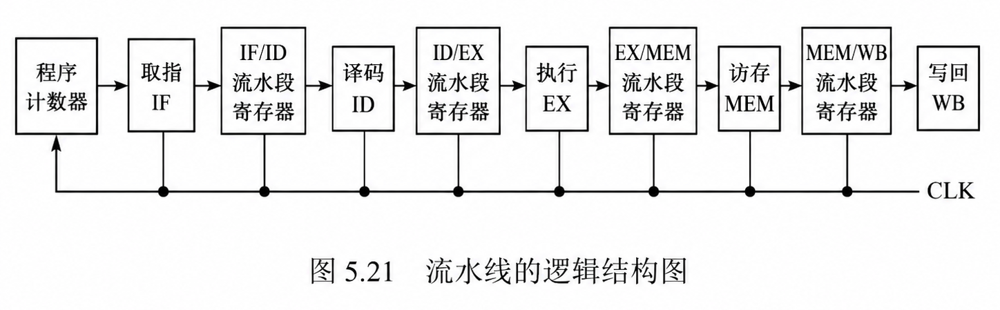

一条指令依次流经 IF、ID、EX、MEM、WB 五个流水段。当第一条指令进入 WB 段时，各流水段分别包含一条不同的指令，此时流水线达到满载状态，最多可同时有 **5 条指令**处于不同的执行阶段。

> 考点追踪：存在流水段寄存器时延的时钟周期的设计（2018）
>
> 注意：流水段寄存器本身也会引入一定时延。但在考试中，若无明确说明，则可忽略寄存器时延。

3. **流水线的时空图表示**

流水线的执行过程常用时空图直观表示，如图 5.22 所示。

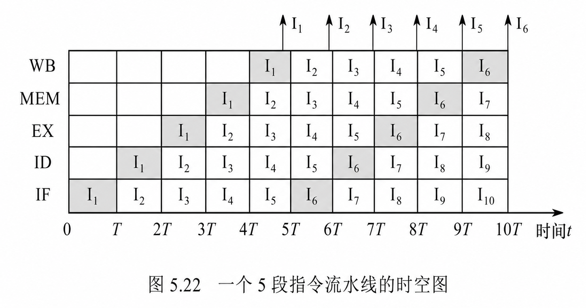

> 考点追踪：流水线执行 4 条指令所需的时钟周期数（2012）

图中，横轴表示时间（单位为时钟周期 \( T \)），纵轴表示流水段（空间）。指令 \( I_1 \) 在时刻 0 进入流水线，于时刻 \( 5T \) 完成；指令 \( I_2 \) 在时刻 \( T \) 进入流水线，于时刻 \( 6T \) 完成；以此类推。

从时刻 \( 5T \) 起，每个周期结束时均有一条指令完成。例如，到时刻 \( 10T \) 时，已有 \( I_1 \) 至 \( I_6 \) 共 6 条指令完成执行。若采用单周期实现，每条指令需约 3.75 个时钟周期，因此在 \( 10T \) 内只能完成约 2～3 条指令。由此可见，流水线通过重叠执行显著提高了指令吞吐率。

需要注意的是，流水线的高效性依赖于**连续、无中断的指令流**。程序执行天然具有顺序性和连续性，因此通常非常适合采用流水线技术。

4. **流水线的吞吐率分析**

> 考点追踪：流水线吞吐率的计算（2013）

流水线的吞吐率（Throughput，TP）是指单位时间内流水线完成的任务数（或输出结果的数量），是衡量流水线性能的重要指标。其基本定义为：

\[
TP=\frac{n}{T_k}
\]

其中，\( n \) 为任务总数，\( T_k \) 为完成这 \( n \) 个任务所需的总时间。

设流水线共有 \( k \) 段，时钟周期为 \( \Delta t \)。在理想条件下（任务连续输入、无阻塞），完成 \( n \) 个任务所需的时间为：

\[
(k+n-1)\Delta t
\]

因此，吞吐率为：

\[
TP=\frac{n}{(k+n-1)\Delta t}
\]

当任务数量 \( n \) 趋于无穷大时，启动阶段（前 \( k-1 \) 个周期）的影响可以忽略不计，此时吞吐率达到理论最大值：

\[
TP_{\max}=\frac{1}{\Delta t}
\]

### 5.6.3 MIPS 指令集的流水段分析

每条 MIPS 指令的前两个功能段相同：

1. **取指**（IFetch）：从指令存储器中取出指令，并计算下一条顺序指令地址，即更新得到 PC + 4。
2. **寄存器/译码**（Reg/Dec）：从寄存器堆中读取操作数，并对指令进行译码。

后续功能段则根据具体指令类型不同而不同。

1. **R 型指令的功能段划分**

R 型指令属于寄存器—寄存器型（RR 型）指令，其操作数和结果均位于通用寄存器中。典型 R 型指令从寄存器 Rs 和 Rt 读取源操作数，在 ALU 中完成指定运算，并将结果写入目的寄存器 Rd。

R 型指令在流水线中经过 IFetch 和 Reg/Dec 阶段后，还要进入：

- **执行**（Exec）：在 ALU 中完成运算。
- **写回**（Write）：将 ALU 的结果写入寄存器堆中的 Rd。

图 5.23 可用如下功能段表表示：

| 时钟周期 | 1 | 2 | 3 | 4 |
|---|---|---|---|---|
| R 型指令 | IFetch | Reg/Dec | Exec | Write |

2. **I 型指令的功能段划分**

I 型指令包含 16 位立即数，可用于立即数运算、内存访问或条件分支，是 RISC 处理器实现常量操作和地址计算的重要手段。

I 型运算类指令先对 16 位立即数进行符号扩展或零扩展，再与 Rs 的内容在 ALU 中运算，结果写入寄存器 Rt。其功能段划分与 R 型指令完全相同。

3. **lw 指令的功能段划分**

lw 指令的功能为：

\[
R[Rt] \leftarrow M[R[Rs]+SEXT(imm16)]
\]

即从内存中读取一个字并写入寄存器 Rt。它将 Rs 的值与符号扩展后的 16 位立即数相加，形成有效地址，再从该地址读取数据。

lw 指令在流水线中经过 IFetch 和 Reg/Dec 阶段后，还要进入：

- **执行**（Exec）：计算内存地址，即 \( R[Rs]+SEXT(imm16) \)。
- **访存**（Mem）：从数据存储器中读取一个字。
- **写回**（Write）：将读取的数据写入寄存器堆中的 Rt。

图 5.24 可用如下功能段表表示：

| 时钟周期 | 1 | 2 | 3 | 4 | 5 |
|---|---|---|---|---|---|
| lw 指令 | IFetch | Reg/Dec | Exec | Mem | Write |

4. **sw 指令的功能段划分**

sw 指令的功能为：

\[
M[R[Rs]+SEXT(imm16)] \leftarrow R[Rt]
\]

即将寄存器 Rt 中的数据写入内存。sw 指令在流水线中经过 IFetch 和 Reg/Dec 阶段后，还要进入：

- **执行**（Exec）：计算内存地址，即 \( R[Rs]+SEXT(imm16) \)。
- **访存**（Mem）：将 Rt 中的数据写入数据存储器中的指定地址。

图 5.25 可用如下功能段表表示：

| 时钟周期 | 1 | 2 | 3 | 4 |
|---|---|---|---|---|
| sw 指令 | IFetch | Reg/Dec | Exec | Mem |

5. **beq 指令的功能段划分**

beq 指令的功能为：若 \( R[Rs]=R[Rt] \)，则：

\[
PC \leftarrow PC+4+SEXT(imm16)\times 4
\]

它先比较两个寄存器的值。若相等，则转移到目标地址；否则继续顺序执行。目标地址由当前 PC 加 4 后，再加上符号扩展并左移 2 位的 16 位立即数得到。

beq 指令在流水线中经过 IFetch 和 Reg/Dec 阶段后，还要进入：

- **执行**（Exec）：比较 Rs 与 Rt，并计算分支目标地址 \( PC+4+SEXT(imm16)\times 4 \)。
- **访存**（Mem）：若比较结果相等，则将目标地址写入 PC。

需要注意的是，beq 指令的 Mem 段并非真正访问内存，而是将写 PC 操作安排在该段，以便与 lw、sw 等指令对齐。由于写 PC 的延迟小于存储器访问，因此可在 Mem 段完成。

6. **j 指令的功能段划分**

j 指令是无条件转移指令，其功能是直接将目标地址送入 PC。除两个公共功能段外，j 指令只需要一个功能段用于更新 PC，该操作可合并到 Exec 段完成：

- **执行**（Exec）：计算目标地址并更新 PC。

从上述分析可知，lw 指令最复杂，需要 5 个功能段。为统一流水线结构，其他指令通过插入“空”段（不执行实际操作的阶段）对齐至 5 段。插入空段需要遵循两个原则：

1. 每条指令对任一功能部件至多使用一次，例如同一条指令不能多次使用寄存器的写口。
2. 相同功能部件必须在固定阶段使用，例如寄存器写回总安排在第 5 阶段。

因此，R 型和 I 型运算指令在 Write 前插入空 Mem 段，使其 Write 段与 lw 指令对齐；sw 和 beq 指令在 Exec 后插入空 Write 段；j 指令插入空 Mem 和 Write 段。通过上述对齐，所有指令都适配 5 个功能段，因此该处理器可采用 5 段流水线设计。

### 5.6.4 流水线的冒险与处理

> 考点追踪：导致流水线阻塞的各种原因（2010、2025）

在指令流水线中，某些情况可能导致后续指令无法正确执行，从而引起流水线阻塞，这种现象称为**流水线冒险**。根据成因不同，流水线冒险可分为三类：**结构冒险、数据冒险和控制冒险**。

不同类型指令在各流水段中的操作如表 5.3 所示。

| 指令类型 | IF | ID | EX | MEM | WB |
|---|---|---|---|---|---|
| ALU | 取指 | 译码、读寄存器堆 | 执行 | — | 结果写回寄存器堆 |
| 取/存 | 取指 | 译码、读寄存器堆 | 计算访存有效地址 | 访存（读/写） | 将读出的数据写入寄存器堆 / — |
| 转移 | 取指 | 译码、读寄存器堆 | 计算转移目的地址，设置条件码 | 若条件成立，将转移目的地址送 PC | — |

后续分析中的流水线冲突均围绕这些操作展开。

1. **结构冒险**

> 考点追踪：解决结构冒险的办法（2016）

结构冒险又称**资源冲突**，是指不同指令在同一时刻争用同一功能部件所引发的冲突。其本质是硬件资源存在物理限制。

例如，在指令与数据共享同一存储器的系统中，第 \( i \) 条 LOAD 指令在第 4 个时钟周期处于 MEM 段，需要访问数据存储器；同时，第 \( i+3 \) 条指令在同一周期处于 IF 段，也需要取指。两者同时访问同一存储器，就会发生访存冲突。此时可以暂停后续指令的取指操作一个周期，如表 5.4 所示。若第 \( i \) 条指令不是访存指令，则其 MEM 段不访问存储器，也不会发生访存冲突。

| 指令 | 1 | 2 | 3 | 4 | 5 | 6 | 7 | 8 | 9 |
|---|---|---|---|---|---|---|---|---|---|
| LOAD 指令 | IF | ID | EX | MEM | WB |  |  |  |  |
| 指令 \( i+1 \) |  | IF | ID | EX | MEM | WB |  |  |  |
| 指令 \( i+2 \) |  |  | IF | ID | EX | MEM | WB |  |  |
| 指令 \( i+3 \) |  |  |  | 停顿 | IF | ID | EX | MEM | WB |
| 指令 \( i+4 \) |  |  |  |  | IF | ID | EX | MEM |  |

解决结构冒险的主要方法有：

1. **遵循功能部件使用原则**：确保每个功能部件在每条指令中至多使用一次，且总在固定阶段使用。例如，将寄存器写回操作统一安排在 WB 段，可避免部分结构冲突。
2. **增加硬件资源**：例如，将寄存器堆的读口与写口分离，支持在一个周期的前半拍写、后半拍读；或将指令存储器与数据存储器分离。现代处理器的 L1 Cache 通常采用指令 Cache 与数据 Cache 分离的设计，从根本上消除了取指与数据访存之间的资源竞争。

2. **数据冒险**

> 考点追踪：指令流水的数据冒险（2012、2014、2016、2019、2023）

数据冒险又称**数据相关**。其根本原因是：后面的指令用到前面指令的结果时，前面指令的结果还未产生或尚未写回。

在按序发射、按序完成的流水线中，所有数据冒险都是因为后一条指令需要读取前一条指令写结果之前的数据，这类冒险称为**写后读**（Read After Write，RAW）冲突。

> 注意：在非乱序执行的流水线中（统考常涉及这种方式），只可能出现 RAW 冲突。

考虑如下两条指令：

```text
I1  add R1,R2,R3        # (R2)+(R3) -> R1
I2  sub R4,R1,R5        # (R1)-(R5) -> R4
```

在 RAW 冲突中，I2 的源操作数 R1 正是 I1 的目的操作数。在非流水线中，I1 先写入 R1，I2 再读取 R1，顺序自然成立。但在流水线中，I2 在 ID 段就要读取 R1，而 I1 要到 WB 段才将结果写回寄存器堆，导致 I2 读取的是 R1 的旧值，如表 5.5 所示。

| 指令 | 1 | 2 | 3 | 4 | 5 | 6 |
|---|---|---|---|---|---|---|
| add | IF | ID | EX | MEM | WB（写 R1） |  |
| sub |  | IF | ID（读 R1） | EX | MEM | WB |

解决 RAW 冲突可采用以下方法。

> 考点追踪：解决数据冲突的办法（2024）

**（1）延迟执行相关指令**

将数据相关的指令及其后续指令都暂停若干时钟周期，直到前一条指令的结果可被安全读取。实现方式包括两类：由软件插入空操作（nop）指令，或由硬件自动插入气泡（阻塞）。

由表 5.5 可知，add 指令在第 5 个时钟周期才将结果写回 R1，而 sub 指令在第 3 个时钟周期就需要读取 R1，因此发生 RAW 冲突。若不采取措施，sub 指令将使用错误的旧值。为此，可让 sub 指令延迟 3 个时钟周期，使其 ID 段发生在 add 指令的 WB 段之后，如表 5.6 所示。

| 指令 | 1 | 2 | 3 | 4 | 5 | 6 | 7 | 8 | 9 |
|---|---|---|---|---|---|---|---|---|---|
| add | IF | ID | EX | MEM | WB |  |  |  |  |
| sub |  | 阻塞 | 阻塞 | 阻塞 | IF | ID | EX | MEM | WB |

此外，若寄存器堆支持在同一个时钟周期的前半拍写入、后半拍读出，则 add 指令在 WB 段写入的值可在同一个周期被 sub 指令在 ID 段读取。此时，add 指令的 WB 段与 sub 指令的 ID 段可重叠执行，从而只需要延迟 2 个时钟周期。

**（2）采用转发（旁路）技术**

转发技术通过设置相关转发通路，使后续指令无需等待前一条指令将计算结果写回寄存器堆，而是直接把前一条指令在执行阶段生成的中间结果送至 ALU 的输入端。

如表 5.7 所示，add 指令在 EX 段结束时已经计算出 R1 的新值，并暂存在 EX/MEM 流水段寄存器中；当 sub 指令进入 EX 段时，它所需的 R1 值可直接从该流水段寄存器转发至 ALU，从而保证使用的是最新结果。

| 指令 | 1 | 2 | 3 | 4 | 5 | 6 |
|---|---|---|---|---|---|---|
| add | IF | ID | EX（产生结果） | MEM | WB |  |
| sub |  | IF | ID | EX（经转发使用结果） | MEM | WB |

增加转发通路后，相邻两条运算类指令之间，以及相隔一条无关指令的两条运算类指令之间的数据相关所引发的 RAW 冲突，均可通过转发有效消除。

**（3）load-use 数据冒险的处理**

若 load 指令与其后紧邻的运算类指令存在数据相关，则无法仅靠转发技术解决，这种情况称为 **load-use 数据冒险**。考虑如下两条指令：

```text
I1  load r2,12(r1)      # M[(r1)+12] -> (r2)
I2  add  r4,r3,r2       # (r3)+(r2) -> (r4)
```

load 指令在 MEM 段结束时才从存储器读出数据，并暂存于 MEM/WB 流水段寄存器；而紧随其后的 add 指令在 EX 段就需要 r2 的值。此时，load 指令尚未完成访存，结果不可用，因此 add 指令只能读到 r2 的旧值。

对于 load-use 数据冒险，最简单的做法是在 add 指令前插入一条 nop 指令。这样，add 指令的 EX 段就能通过转发机制，从 MEM/WB 流水段寄存器中获取 load 指令的最新结果，如表 5.8 所示。更好的方法是在程序编译时进行优化，通过调整指令顺序来避免 load-use 相关的发生。

| 指令 | 1 | 2 | 3 | 4 | 5 | 6 | 7 |
|---|---|---|---|---|---|---|---|
| load | IF | ID | EX | MEM（读出数据） | WB |  |  |
| add |  | 阻塞 | IF | ID | EX（经转发使用结果） | MEM | WB |

3. **控制冒险**

> 考点追踪：分析指令之间的控制冒险（2014、2023）

指令通常按顺序执行，但在遇到转移、返回、中断或异常等事件时，程序计数器（PC）的值会被修改，导致流水线断流，这种现象称为**控制冒险**，又称**控制冲突**。

对于由分支指令引起的冲突，最简单的处理方法是推迟后续指令的执行。通常将因流水线阻塞产生的延迟时钟周期数称为**延迟损失时间片**，记作 \( C \)。例如，假设寄存器 R2 存放常数 \( N \)，R1 的初值为 1，beq 指令在 EX 段完成条件计算，但直到 MEM 段结束（第 5 个时钟周期）才确定是否更新 PC。因此，从分支指令进入流水线到转移决策完成，共产生 3 个时钟周期延迟，即 \( C=3 \)。

为避免错误执行后续指令，可在分支指令后插入 \( C \) 条 nop 指令，如下所示：

```text
I1  loop: add R1,R1,1       # (R1)+1 -> R1
I2        bne R1,R2,loop    # if (R1)!=(R2) goto loop
```

表 5.9 给出了通过插入空操作解决控制冲突的示意。

| 指令 | 1 | 2 | 3 | 4 | 5 | 6 | 7 | 8 | 9 | 10 |
|---|---|---|---|---|---|---|---|---|---|---|
| add | IF | ID | EX | MEM | WB |  |  |  |  |  |
| bne |  | IF | ID | EX | MEM | WB |  |  |  |  |
| add |  |  |  |  |  | IF | ID | EX | MEM | WB |

解决控制冒险的主要方法包括：

1. **延迟分支处理**：对于由分支指令引起的冲突，可由软件在分支指令后插入若干 nop 指令，或由硬件自动阻塞、插入气泡。插入 nop 指令的数量等于分支延迟周期数。
2. **分支预测技术**：尽早生成转移目标地址并预测转移方向，以减少流水线阻塞。静态预测采用简单规则，总是预测转移发生或不发生；动态预测根据程序运行时的转移历史动态调整预测策略，准确率更高。若预测错误，则需要清空已进入流水线的错误路径指令，并从正确目标地址重新取指。若分支延迟周期数为 3，则预测错误时将损失 3 个时钟周期。

> 注意：Cache 缺失、中断或异常的发生也会引起流水线阻塞。


### 5.6.5 高级流水线技术

高级流水线技术用于进一步提高指令级并行度。主要有两类思路：一是**多发射技术**，通过配置多个内部功能部件，使流水线在每个时钟周期能同时处理多条指令，处理器一次可发射多条指令进入流水线执行；二是**超流水线技术**，通过增加流水线级数，使更多指令在流水线中重叠执行。

1. **超标量流水线技术（动态多发射）**

> 考点追踪：超标量流水线的特性（2017）

超标量流水线要求处理器在每个时钟周期能够并发发射多条相互独立的指令，因此需要配置多个功能部件。简单的超标量处理器可按程序顺序发射指令；但为了进一步提升并行性能，现代超标量处理器通常结合动态调度技术，如动态分支预测等，支持乱序执行，即指令的实际执行顺序可以不同于程序给出的指令顺序。

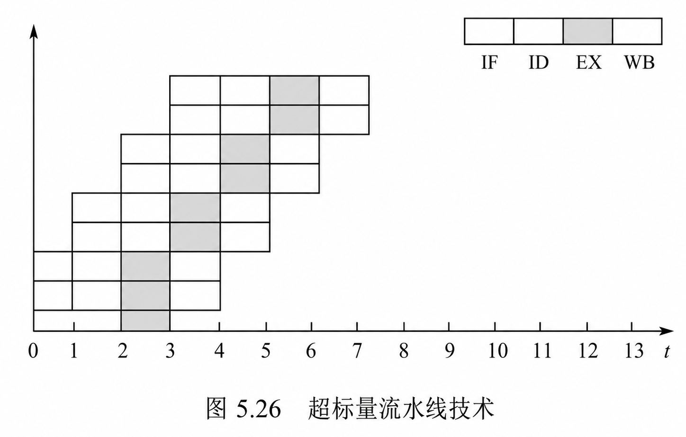

2. **超长指令字技术（静态多发射）**

超长指令字技术由编译器在编译阶段分析指令间的并行性，并将多条可并行执行的指令打包成一条超长指令字。超长指令字中包含多个操作码字段，分别控制不同的处理部件。由于并行性由软件静态确定，因此硬件控制相对简单。

## 5.7 多处理器的基本概念

### 5.7.1 SISD、SIMD、MIMD 和向量处理器的基本概念

本节可见内容强调了 SIMD 与 MIMD 的并行层次差异：**SIMD 属于数据级并行**，适用于规则、同构的数据处理；**MIMD 支持线程级或任务级并行**，并行程度更高，适用范围更广。

### 5.7.2 硬件多线程的基本概念

在传统 CPU 中，线程切换涉及保存和恢复寄存器上下文等操作，频繁切换会引入显著性能开销。为减少这一开销，硬件多线程技术应运而生。支持硬件多线程的处理器为每个线程配备独立的通用寄存器组、程序计数器（PC）等关键状态部件。线程切换时，只需激活对应线程的寄存器组，无须将上下文写入或从内存读出，从而大幅降低切换延迟。

硬件多线程主要有三种实现方式：**细粒度多线程、粗粒度多线程和同时多线程（SMT）**。

1. **细粒度多线程**

处理器在每个时钟周期切换线程，交替执行不同线程的指令。由于各线程彼此独立，其指令可能在连续周期中交替执行，有效提升功能部件的利用率。例如，在时钟周期 \( i \) 执行线程 A 的指令，在周期 \( i+1 \) 执行线程 B 的指令。

2. **粗粒度多线程**

处理器连续执行同一线程的指令序列，仅当该线程因高延迟事件（如 Cache 缺失）导致流水线阻塞时，才切换至另一线程。此时需要清空被阻塞的流水线，并为新线程重新填充流水线，因此切换开销通常大于细粒度多线程。

细粒度多线程和粗粒度多线程在同一时刻均只执行一个线程的指令，并不支持真正的指令级并行。它们的核心目标是通过线程切换隐藏长延迟操作，提高资源利用率。

3. **同时多线程**

SMT 在单个时钟周期内可以同时发射并执行来自多个不同线程的多条指令，既利用了指令级并行，又实现了线程级并行。它通常构建于支持超标量和乱序执行的现代微架构之上，通过共享执行单元、缓存等硬件资源，在维持高单线程性能的同时，显著提升整体吞吐率。

图 5.27 给出了三种硬件多线程方式的调度示例。

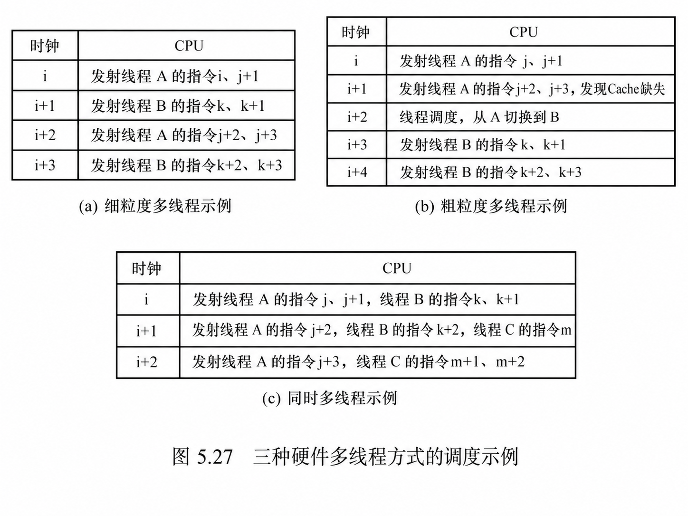

Intel 处理器中的超线程（Hyper-Threading）技术是 SMT 的典型代表。它在一个物理核心中维护两套完整的线程状态部件（包括寄存器组、程序计数器等），而高速缓存、ALU 等执行资源则由两个逻辑核心共享，从而在单核上实现接近双核的并发处理能力，实际性能提升通常为 10%～30%。

### 5.7.3 多核处理器的基本概念

多核处理器（Multi-core Processor）是指将多个独立的处理单元集成到单个 CPU 芯片中。每个处理单元称为一个核（core），也称片上多处理器。每个核心通常配有私有的 L1 Cache，有时还包括 L2；多个核心则共享更高层级的 Cache，如 L3。所有核心通过互连网络共享主存储器。

图 5.28 展示了一种简化的双核结构，其中各核心仅拥有私有缓存，不共享任何缓存层级。

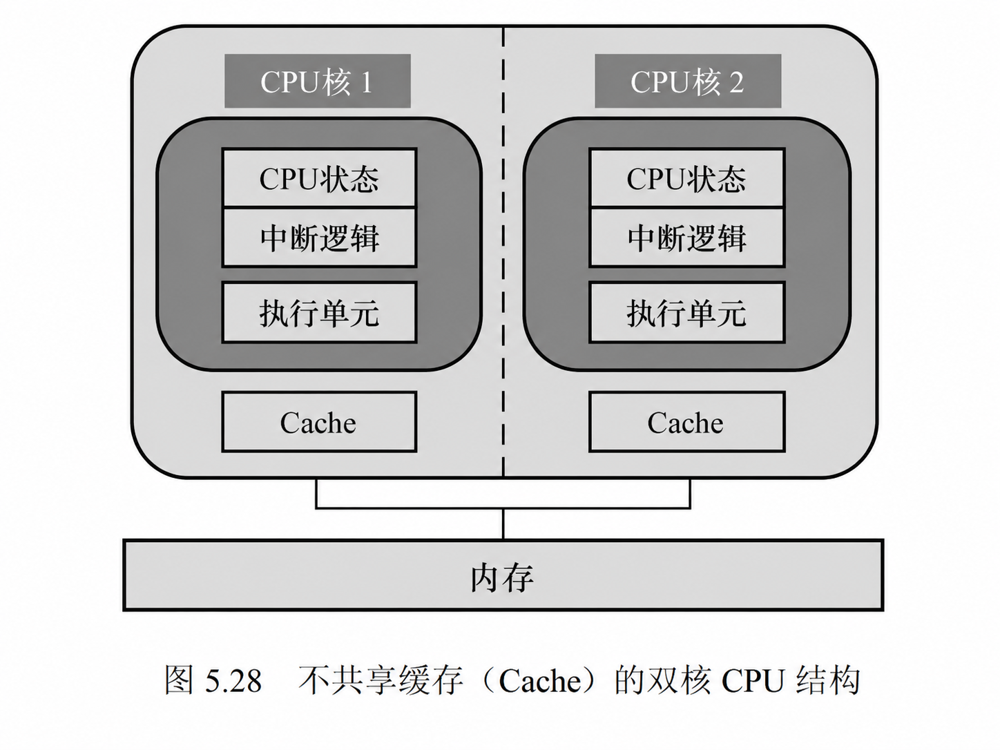

在多核系统中，要充分发挥硬件的并行计算能力，必须采用多线程或多进程模型，确保每个核心在运行时都有可执行的线程。与单核系统中的多线程不同，多核架构支持多线程在物理上同时执行：每个核心独立运行一个线程，实现真正的并行处理。而单核系统若采用细粒度或粗粒度多线程，多个线程只是以时间交替方式执行，任一时刻只有一个线程处于运行状态；若支持 SMT，则可以在单个核心上并发执行来自不同线程的多条指令。

可以用滚石头的例子理解多核与向量处理器的区别：假设需要把四块石头滚到马路对面，每块石头需要 1 分钟。单核串行处理器一次滚一块，共需 4 分钟；双核处理器相当于两名工人，每人负责两块石头，耗时 2 分钟；向量处理器则像用一根长木板同时推动四块石头，由于对所有石头执行完全相同的操作，理论上只需 1 分钟。由此可见，多核处理器通过增加处理单元数量实现任务级并行，而向量处理器通过单指令作用于多数据实现数据级并行。

### 5.7.4 共享内存多处理器的基本概念

具有共享单一物理地址空间的多处理器系统称为**共享内存多处理器**（Shared Memory multi-Processor，SMP）。在 SMP 系统中，所有 CPU 均可通过常规访存指令访问内存中的任意位置，并可通过读写共享变量进行通信。

需要注意的是，尽管物理地址空间是统一的，各 CPU 仍可在各自独立的虚拟地址空间中运行程序，操作系统负责将虚拟地址映射到统一的物理地址空间。

SMP 系统根据内存访问延迟的特性可分为两类：

- **统一存储访问（UMA）多处理器**：所有 CPU 访问任意内存单元的延迟基本相同，与发起请求的 CPU 及目标地址无关。
- **非统一存储访问（NUMA）多处理器**：内存访问延迟取决于请求 CPU 与目标内存的物理位置关系。通常，主存被划分为多个区域，分别连接到不同的 CPU。

早期计算机系统普遍采用北桥架构：内存控制器集成于北桥芯片，CPU 通过前端总线（FSB）连接北桥以访问内存。随着多核与多处理器技术的发展，多个 CPU 对前端总线的争用使其成为系统性能瓶颈。为突破这一限制，NUMA 架构应运而生，将内存控制器集成到各 CPU 内部，以降低共享总线带来的瓶颈。

## 5.8 本章小结与疑难点

### 5.8.1 微指令与指令流水线

**微指令**是微程序控制方式中的基本控制单元。控制单元发出的最基本控制信号称为**微命令**，一组用于完成特定微操作的微命令构成一条微指令；若干微指令按序排列形成微程序，用以解释并执行一条机器指令。在微程序控制器中，每条机器指令通常对应一个微程序，而该微程序由多条微指令组成，每条微指令可并行发出多个微命令。

**指令流水线**是一种将指令执行过程划分为若干有序阶段，并让多条指令的各个阶段在时间上重叠执行的技术。每个阶段由专用功能部件完成：当前一条指令进入下一阶段时，后一条指令即可进入当前阶段，从而实现功能部件的持续利用。

与非流水线结构相比，指令流水线并不缩短单条指令的执行延迟，但能显著提升单位时间内完成的指令数，即提高吞吐率。由于仅需增加少量流水段寄存器等硬件即可获得数倍的吞吐率提升，因此指令流水线成为现代处理器广泛采用的并行处理技术。

## 5.9 常见问题和易混淆知识点

### 5.9.1 流水线段数与执行速度

**问题：流水线越多，并行度就越高。是否流水段越多，指令执行越快？**

并非流水段越多，指令执行就越快。原因如下：

1. 流水段增加会引入更多流水线寄存器，其延迟会限制时钟周期的进一步缩短；同时，段数增多也导致单条指令从进入流水线到完成所需的时钟周期数增加。
2. 流水线中同时存在的指令数量随段数增加而增多。发生数据冒险或控制冒险时，流水线需要插入停顿；段数越多，潜在性能损失越显著。
3. 随着流水段数增加，用于处理结构冲突、数据冒险和控制转移的控制逻辑会急剧复杂化，不仅增加硬件开销，还可能成为新的性能瓶颈。

### 5.9.2 读后写（WAR）相关和写后写（WAW）相关

在非按序执行的流水线中，由于允许后进入流水线的指令超越先进入的指令先完成执行，因此不仅可能发生 RAW 相关，也可能发生 WAR 和 WAW 相关。

1. **读后写（Write After Read，WAR）相关**

WAR 相关是指当前指令需要先读取某寄存器的值，后续指令才应向该寄存器写入。若执行顺序颠倒，即写操作发生在读操作之前，则当前指令会读到错误的新值。

例如：

```text
I1  add R3,R1,R2        # (R1)+(R2) -> R3
I2  sub R1,R4,R5        # (R4)-(R5) -> R1
```

在 WAR 相关中，指令 I2 的目的操作数是指令 I1 的源操作数。若 I2 在 I1 读取 R1 之前写入 R1，则 I1 会错误地读到 I2 写入的新值。

2. **写后写（Write After Write，WAW）相关**

WAW 相关是指当前指令应先写入某寄存器，后续指令再写入同一寄存器，以保证最终结果为后者；若执行顺序颠倒，导致后一条指令先完成写操作，则寄存器的最终值将违背程序语义。

例如：

```text
I1  add R1,R2,R3        # (R2)+(R3) -> R1
I2  sub R1,R4,R5        # (R4)-(R5) -> R1
```

在 WAW 相关中，指令 I2 和指令 I1 的目的操作数相同。按照程序顺序，R1 的最终值应为 I2 的结果；若 I2 先写、I1 后写，则最终值会错误地变为 I1 的结果。

# 第六章 总线

【考纲内容】

1. **总线的基本概念**。
2. **总线的组成及性能指标**。
3. **总线事务和定时**。

【复习提示】

本章知识点较少，通常以选择题形式出现，尤其要掌握**总线的特点、猝发传输方式、性能指标、定时方式以及常见总线标准**。总线带宽的计算也可能结合其他章节出综合题。

学习本章时，建议思考以下问题：

1. 引入总线结构有什么好处？
2. 引入总线结构会导致什么问题？如何解决？

## 6.1 总线概述

早期计算机中，各部件通过专用连线直接互连，称为**分散连接**。随着 I/O 设备种类和数量不断增加，这种连接方式在扩展性和灵活性方面面临挑战。为提升系统的可扩展性与连接灵活性，计算机系统结构逐步演进为采用**总线连接方式**，并进一步形成各类标准化总线规范。

**总线**是一组可供多个部件分时共享的公共信息传输线路。其核心特征包括：

- **分时性**：任一时刻仅允许一个部件向总线发送信息；多个发送方需要分时使用总线。
- **共享性**：多个部件可以同时挂接在总线上，并能同时接收总线上传输的信息。

### 6.1.1 总线的分类

> 考点追踪：总线相关的概念与特点（2016、2017）

1. **内部总线**

内部总线是芯片内部的总线，也称**片内总线**，用于 CPU 芯片内部各寄存器之间以及寄存器与 ALU 之间的连接。

2. **系统总线**

系统总线是计算机系统内各功能部件（如 CPU、主存、I/O 接口）之间相互连接的总线。根据所传输信息内容的不同，系统总线可分为数据总线、地址总线和控制总线。

> 考点追踪：数据总线上传输的内容（2011）

- **数据总线**：用于在各部件之间双向传输数据信息，包括指令、操作数、状态字、中断类型号等。数据总线的位数反映 CPU 一次能够并行传送的数据位数。
- **地址总线**：用于指出要访问的主存单元或 I/O 端口的地址。地址总线是单向总线，其位数决定系统最大可寻址空间。为减少芯片引脚数量并降低成本，部分硬件架构采用地址线与数据线复用设计，此时地址信息与数据信息分时在同一组物理线路上传输。
- **控制总线**：用于传输各种协调与控制信号，以确保各部件同步、有序工作。典型信号包括时钟、复位、总线请求/允许、中断请求/响应、存储器读/写、I/O 读/写、传输确认等。控制总线由若干单向或双向信号线组成，具体构成取决于系统设计需求。

3. **I/O 总线**

I/O 总线用于连接主机与内部的各类 I/O 控制器（如显卡、网卡等），通常采用标准化内部总线协议，如 PCI、AGP、PCI Express 等。

4. **通信总线**

通信总线用于主机与外部 I/O 设备之间或不同计算机系统之间的通信。这类总线需要适应不同的传输距离、速率和电气规范，典型代表包括 RS-232、USB 等。

### 6.1.2 常见的总线标准

总线标准是国际上制定的、用于互连计算机各功能模块的规范，是构建计算机系统时必须遵循的接口协议。典型总线标准包括 ISA、EISA、VESA、PCI、AGP、PCI-Express、USB 等。它们的主要区别在于总线宽度、带宽、时钟频率、寻址能力以及是否支持突发传送等。

> 考点追踪：总线标准的英文缩写（2010）

1. **ISA**（Industry Standard Architecture，工业标准体系结构）：最早的系统总线标准，传输速率低，CPU 占用率高，占用较多中断资源。属于系统总线、并行总线。
2. **EISA**（Extended Industry Standard Architecture，扩展的 ISA）：在 ISA 基础上扩展，支持多主控器和突发传送，并完全兼容 ISA。属于系统总线、并行总线。

> 考点追踪：区分设备总线和局部总线（2013）

3. **VESA**（Video Electronics Standards Association，视频电子标准协会）：一种 32 位局部总线标准，面向多媒体 PC 对高速图像数据传输的需求而设计。属于局部总线、并行总线。局部总线是在 CPU 与 ISA 总线之间的高速扩展总线，旨在把高速外部设备（如显卡、磁盘控制器）从低速 ISA 总线迁移到更接近 CPU 的数据通路，以提升 I/O 性能。
4. **PCI**（Peripheral Component Interconnect，外部设备互连）：高性能 32 位或 64 位总线，广泛用于显卡、声卡、网卡等扩展卡。PCI 总线是与处理器时钟频率无关的高速外围总线，支持即插即用。属于局部总线、并行总线。
5. **AGP**（Accelerated Graphics Port，加速图形接口）：专为图形卡设计的高速接口，允许显卡直接高效访问系统主存，用于加速 3D 图形和视频处理。属于局部总线、并行总线。

> 考点追踪：PCI-E 总线的特点（2017）

6. **PCI-E**（PCI-Express）：采用高速串行点对点连接，由多条通道组成（如 x1、x16），支持全双工通信，传输速率远超 PCI 和 AGP。属于局部总线、串行总线。
7. **RS-232C**：一种用于数据终端设备（DTE）与数据通信设备（DCE）之间进行串行二进制通信的标准接口。属于设备总线、串行总线。

> 考点追踪：USB 总线的特点（2012）

8. **USB**（Universal Serial Bus，通用串行总线）：用于连接外部 I/O 设备，支持即插即用、热插拔和多设备级联，广泛应用于键盘、鼠标、移动存储等。属于设备总线、串行总线。
9. **PCMCIA**（Personal Computer Memory Card International Association）：主要用于笔记本电脑的扩展标准，支持即插即用。属于设备总线、并行总线。
10. **IDE**（Integrated Drive Electronics，集成设备电路）：更准确称为 ATA，是连接主板与硬盘/光驱的传统并行接口。属于设备总线、并行总线。
11. **SCSI**（Small Computer System Interface，小型计算机系统接口）：一种高性能的系统级设备接口，常用于服务器硬盘等。属于设备总线、并行总线。
12. **SATA**（Serial Advanced Technology Attachment，串行高级技术附件）：IDE/ATA 的串行替代标准，采用高速串行传输。属于设备总线、串行总线。

### 6.1.3 总线的性能指标

1. **总线传输周期**：完成一次完整总线事务（如一次读或写操作）的总时间，通常由若干总线时钟周期组成，简称总线周期。
2. **总线时钟频率**：总线基础时钟信号的频率，是总线时钟周期的倒数。早期总线的时钟与 CPU 时钟同频，随着 CPU 的快速发展，现代总线的时钟通常独立于 CPU 时钟。
3. **总线工作频率**：总线工作频率指总线各种操作的有效数据传输次数。早期总线每个时钟周期仅传输一次数据，此时总线工作频率等于时钟频率；现代总线一个时钟周期内可传送 2 次、4 次甚至更多次数据，因此总线工作频率可达时钟频率的 2 倍、4 倍等。
4. **总线宽度**：总线中数据线的条数，决定每次能够并行传输的数据位数。

> 考点追踪：总线带宽的分析与计算（2009、2013、2014、2018—2020、2024、2025）

5. **总线带宽**：总线在单位时间内所能传输的最大数据量。计算公式为：

\[
\text{总线带宽}=\text{总线宽度}\times\text{总线工作频率}
\]

例如，若某总线的时钟频率为 11MHz，每个时钟周期可传送 2 次数据，则其工作频率为 \(11\times2=22\text{MHz}\)。若总线宽度为 16 位，即 2 字节，则总线带宽为：

\[
2\times22\times10^6=44\text{MB/s}
\]

> 注意：计算带宽（最大数据传输率）时，应依据总线的物理参数（宽度、时钟频率、每周期传输次数），反映其理论峰值传输能力，无须考虑具体总线事务中的地址/命令开销或突发传输细节。仅在求平均数据传输率时，才需要分析事务时序。不能把“两个设备间一次通信的有效速率”误当作“总线带宽”。

总线最主要的性能指标为**总线宽度、总线工作频率和总线带宽**。

6. **总线复用**：同一组信号线在不同时间段传输不同类型的信息。例如，地址/数据线复用中，数据线在初期传输地址，后期传输数据。总线复用可以减少引脚数量，节省硬件成本。
7. **总线寻址能力**：由地址线的位数决定，表示 CPU 能访问的最大地址空间。例如，16 位地址线可寻址 \(2^{16}=65536\) 个存储单元；若每个单元为 1B，则最大寻址空间为 64KB。

### 6.1.4 总线的结构

总线是计算机系统中各功能部件之间传递信息的公共通道，其结构设计直接影响系统的整体性能和扩展能力。随着处理器速度不断提升，总线结构经历了从简单共享到分层并行，再到高度集成的演进过程，其核心目标始终是**提升带宽、降低延迟、突破通信瓶颈**。

1. **早期共享总线结构**

在计算机发展的早期阶段，普遍采用**单总线结构**：CPU、主存储器和各类 I/O 设备均挂接在同一条系统总线上，如图 6.1 所示。这种结构实现简单、成本低廉，但所有设备必须分时竞争总线使用权，容易导致频繁的传输冲突，效率低下，难以满足高速外设的数据吞吐需求。

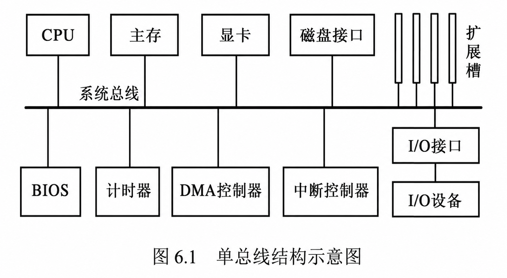

为缓解 CPU 与主存之间的通信压力，后续引入了**双总线结构**，增设一条专用的存储总线，使 CPU 与主存的数据交换独立于 I/O 通路。尽管主存访问效率有所提升，但 I/O 设备若需要与主存交换数据，仍要通过 CPU 中转，形成新的性能瓶颈。

进一步改进的**三总线结构**增加了 DMA（直接内存访问）总线，允许高速 I/O 设备通过 DMA 控制器直接与主存通信，无须 CPU 干预。这一设计显著提升了 I/O 吞吐能力。然而，传统总线固有的共享式、广播式特性，仍限制了系统的并发性和可扩展性。

2. **传统分层总线：南北桥结构**

为突破早期共享总线的性能瓶颈，主流 PC 系统逐步转向分层次的多总线结构，典型代表是 Intel 在 Pentium 4 及早期 Core 系列处理器平台上广泛采用的**南北桥结构**，如图 6.2 所示。

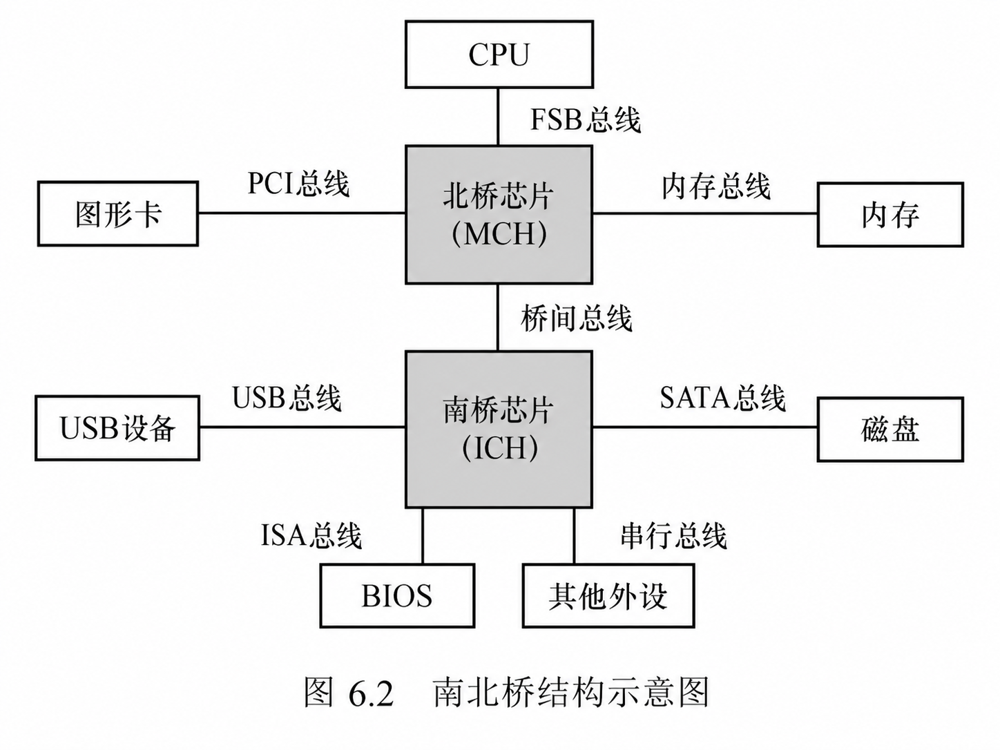

该结构将系统划分为两个功能区域：

1. **北桥芯片**（Memory Controller Hub，MCH）：作为高速枢纽，连接 CPU、主存和显卡，负责高带宽数据传输。
2. **南桥芯片**（I/O Controller Hub，ICH）：是一个 I/O 控制器集线器，负责管理 USB、SATA、以太网等低速 I/O 接口，并提供扩展槽支持。

在这一结构中，CPU 与北桥之间的互连通道称为**前端总线**（Front Side Bus，FSB），也称系统总线。CPU 通过 FSB 连接至北桥，再经由北桥分别与主存（通过存储器总线）和显卡通信；各类 I/O 设备（如 USB 设备、网卡、磁盘等）则通过各自的设备控制器接入南桥，北桥与南桥之间通过专用的桥间总线互连，最终形成从 I/O 到 CPU 和主存的完整数据通路。

尽管该结构实现了存储通路与 I/O 通路的物理分离，但传统共享总线仍会在并发性和扩展能力上形成限制。

## 6.2 总线事务和定时

### 6.2.1 总线事务

> 考点追踪：非突发传输的时间分析（2023）

1. **非突发传输方式**

非突发传输方式中，每次仅传输一个数据单元（通常为一个总线宽度的数据）。每次传输都必须独立经历完整的三阶段流程：先发送地址，等待从设备准备数据，再传输数据。因此，即使连续读取多个相邻数据，也需要重复发送地址，导致地址开销大、效率较低。

> 考点追踪：突发传输的特点与时间分析（2012—2014）

2. **突发传输方式**

突发传输方式用于高效传输连续成块的数据。事务开始时，主设备仅发送数据块的首地址；随后，在不释放总线的前提下，连续传送多个数据单元。后续地址由硬件自动递增生成（如首地址 \(+1\)、首地址 \(+2\) 等），无须重复使用地址线。

因此，在相同总线宽度和时钟频率下，突发传输省去了多次地址传送开销，显著提升了有效带宽，广泛应用于高速存储器访问（如 SDRAM 行读取、Cache 块填充）等场景。简言之，非突发方式是“**一次地址、一次数据**”，突发方式是“**一次地址、多次数据**”。

3. **串行传输与并行传输**

数据在总线上的物理传输可采用串行或并行两种方式。

**串行传输方式**按比特位依次顺序传输数据，通常仅使用一条双向线路或两条单向线路（发送/接收各一）。其优点是引脚少、布线简单、抗干扰能力强，适合长距离通信（如 USB、PCIe、SATA）。在串行传输中，根据收发双方的时序协调方式，又可分为同步串行通信和异步串行通信。

- **同步串行通信**：由发送方时钟直接控制接收方时钟，实现位同步。收发双方时钟严格一致，仅在数据块首尾添加开始和结束标记，传输效率高，但硬件实现复杂、成本较高。

> 考点追踪：异步串行通信方式的特点（2016）

- **异步串行通信**：收发双方使用独立时钟，无须严格同步。每个字符独立传输，并通过起始位（逻辑 0）标识开始，停止位（逻辑 1）标识结束。通信线路空闲时保持逻辑 1 状态；发送方先发送一个逻辑 0 作为起始位，接收方检测到该低电平后开始接收数据。数据位从最低位开始逐位发送；发送完数据位后，可选择发送一位奇偶校验位用于简单差错检测；随后发送停止位，表示该字符结束。

**并行传输方式**利用多条数据线同时传输多个比特位（如 32 位、64 位总线），理论上单周期即可完成一个字的传输，短距离内延迟低、吞吐高。但随着频率提高，信号串扰和时序偏移问题加剧，限制了工作频率的提升。因此，并行传输更适合板级或芯片级短距离通信（如早期 PCI、内存总线）。

> 注意：并行传输并不总是比串行传输更快。受限于电气特性，并行总线的工作频率难以持续提高；而串行传输可通过提升频率等方式实现更高总带宽。因此，现代高速接口多采用串行化设计。

### 6.2.2 总线定时

总线定时是指总线上主设备与从设备在交换数据时，用于协调双方操作时序的控制协议。其本质是一种**时序规则**，主要有同步、异步、半同步和分离式四种方式。

> 考点追踪：各种总线定时方式的特点（2015、2021）

1. **同步定时方式**

同步定时方式采用系统统一的时钟信号来协调发送方和接收方的传送定时关系。时钟产生相等的时间间隔，每个时间间隔构成一个总线周期，每次数据传送在一个总线周期内完成。由于采用统一时钟，所有操作必须严格在固定周期内进行，总线周期连续进行。

同步定时方式的特点如下：

- **优点**：传送速度快，具有较高的传输速率；总线控制逻辑简单。
- **缺点**：主从设备之间属于强制性同步，所有操作严格受时钟节拍约束；缺乏应答或握手机制，无法根据从设备实际状态调整时序，可靠性较差。
- **适用场景**：适用于总线长度较短，且所连接各部件的存取时间比较接近的系统。

2. **异步定时方式**

异步定时方式不依赖统一的时钟信号，而是通过主从设备之间的握手信号实现定时控制。主设备发出“请求”信号，从设备准备就绪后，发出“回答”信号。

异步定时方式的特点如下：

- **优点**：总线周期长度可变，能可靠适应速度差异较大的设备，自适应性强。
- **缺点**：控制逻辑复杂，因为多次信号交互，整体传输速率较低。

根据“请求”与“回答”信号的撤销是否互锁，异步定时方式可分为三类：

1. **不互锁方式**：主设备发出“请求”后，在预设时延 \(t_1\) 后自行撤销；从设备收到请求后立即发出“回答”，并在时延 \(t_2\) 后自动撤销。双方无互锁关系，如图 6.3(a) 所示。
2. **半互锁方式**：主设备必须收到“回答”后才撤销“请求”，存在互锁；但从设备发出“回答”后，无须确认“请求”是否撤销，而是在时延 \(t_2\) 后自动撤销，属于无互锁，如图 6.3(b) 所示。
3. **全互锁方式**：主设备需收到“回答”才撤销“请求”；从设备需确认“请求”已撤销后才撤销“回答”。双方完全互锁，可靠性最高，如图 6.3(c) 所示。

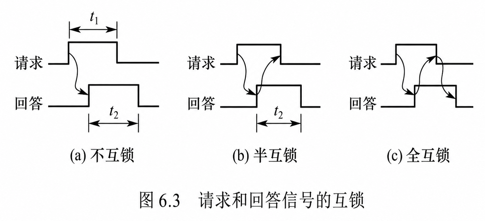

异步定时方式适用于连接速度差异大、对可靠性要求较高而对速率要求不苛刻的系统。

3. **半同步定时方式**

半同步定时方式结合了同步与异步的优点。地址、命令和数据的发送严格参照系统时钟前沿（如上升沿）；接收方通常在时钟后沿（如下降沿）进行识别。同时，系统增设一条 Wait 信号线，用于允许慢速从设备反馈准备状态。

主设备在时钟上升沿检测 Wait 信号状态：若 Wait 无效（高电平），表示数据未就绪，主设备插入等待周期；直到 Wait 有效（低电平），才从数据线读取数据。

半同步定时方式的特点如下：

- **优点**：在统一时钟下工作，控制比异步方式简单，可靠性较高。
- **缺点**：系统时钟频率受限于最慢设备，整体速度不高。
- **适用场景**：适用于包含多种速度差异较大设备、但性能要求不高的简单系统。

上述三种定时方式均采用“**独占式事务模型**”：从主设备发起请求到传送结束，总线全程被该事务占用。然而，在从设备准备数据阶段，总线虽被占用却处于空闲状态，造成资源浪费。

4. **分离式定时方式**

分离式定时方式将一个总线事务拆分为两个独立子阶段：请求阶段与应答阶段。源 PDF 第 285 页可见内容到“两个阶段之间”处结束，下一页直接进入第 7 章，因此本 act 不补写第 7 章内容。

---

> 当前进度：已处理《计算机组成原理-第5-7章-CPU至输入输出.pdf》第 33-45 页；本轮新增第 41-45 页内容，补全例 7.3 执行轨迹，完成 7.3.3 DMA 方式，并补充本章疑难点内容。第七章已全部完成，已检查 Markdown 顺序、图片路径、图片完整性和课后习题排除情况。
>
> 下次任务：无；本章内容已完成。

# 第七章 输入/输出系统

**考纲内容**

1. **I/O 接口（I/O 控制器）**：I/O 接口的功能和基本结构；I/O 端口及其编址。
2. **I/O 方式**：程序查询方式；程序中断方式，包括中断的基本概念、中断响应过程、中断处理过程、多重中断和中断屏蔽的概念；DMA 方式，包括 DMA 控制器的组成和 DMA 传送过程。

**复习提示**

I/O 方式是本章的重点和难点。考试不仅会以选择题考查基本概念和原理，也可能以综合题考查各种 I/O 方式的效率计算。需要重点掌握程序查询、中断方式、DMA 方式的特点、处理过程、效率计算及相互区别。

学习本章时，应重点思考：

1. I/O 设备有哪些编址方式？各有什么特点？
2. CPU 响应中断应具备哪些条件？

## 7.1 I/O 系统基本概念

### 7.1.1 输入/输出系统

从主机视角看，**输入**是指将信息从外部设备传送到主机，**输出**是指将信息从主机传送到外部设备。输入/输出系统的核心任务，是对各类信息的输入与输出过程进行有效控制。

I/O 系统涉及以下基本概念：

1. **外部设备**：包括输入设备、输出设备，以及需要通过 I/O 接口访问的外部存储设备。
2. **接口**：位于外设与主机之间的逻辑部件，负责协调数据传输过程中的速度匹配、电平转换和格式适配等工作。
3. **输入设备**：用于向计算机输入命令、文本或数据的装置，如键盘、鼠标等。
4. **输出设备**：用于将计算机处理结果输出到外部介质的装置，如显示器、打印机等。
5. **外存设备**：指除内存和 CPU 缓存以外的存储器，如硬磁盘、光盘、固态硬盘等。

通常，I/O 系统由 **I/O 硬件** 和 **I/O 软件** 两部分构成。

1. **I/O 软件**：主要包括设备驱动程序、I/O 管理程序以及用户应用程序等，负责实现 CPU 与 I/O 设备之间的信息交换。
2. **I/O 硬件**：包括外部设备、设备控制器、I/O 接口以及 I/O 总线等。其中，设备控制器负责控制外设的具体操作，I/O 接口则实现外设与主机总线之间的连接。

### 7.1.2 外部设备

常见的外部设备主要包括键盘、鼠标、显示器、打印机、磁盘存储器和光盘存储器等。

**1. 输入设备**

| 设备 | 作用 |
|---|---|
| 键盘 | 最常用的输入设备，用于输入字符、数字及各种控制命令。 |
| 鼠标 | 一种定位输入设备，能够将用户操作映射为屏幕上的光标位置，实现人机交互。 |

**2. 输出设备**

显示器可按类型分为阴极射线管（CRT）、液晶显示器（LCD）和发光二极管（LED）等。显示器以点阵方式工作，其主要性能参数如下。

| 参数 | 含义 |
|---|---|
| 屏幕尺寸 | 以对角线长度表示，单位为英寸，常见规格为 12-32 英寸。 |
| 分辨率 | 屏幕上可显示的像素总数，常表示为“宽度 × 高度”，如 1920 × 1080。 |
| 色彩深度 | 表示每个像素所能呈现的颜色数目。黑白显示器可表现为灰度级，如 8 位对应 256 级；彩色显示器中，通常采用 24 位真彩色，可显示约 1677 万种颜色，或更高。 |
| 刷新机制 | 由于像素发光持续时间短，必须周期性重绘整屏图像，以维持画面稳定。 |
| 刷新频率 | 指每秒刷新屏幕的次数。人眼通常在刷新频率高于 30Hz 时不会感知闪烁，现代显示器一般支持 60-120Hz。 |

> 考点追踪：显示刷新带宽的计算（2010）

显示存储器（VRAM，即刷新存储器）用于存储一帧完整的图像数据。其容量与带宽可按下列公式计算：

\[
\begin{aligned}
\text{VRAM 容量} &= \text{分辨率} \times \text{色彩深度（位数）} \\
\text{VRAM 带宽} &= \text{分辨率} \times \text{色彩深度（位数）} \times \text{帧频}
\end{aligned}
\]

打印机用于将计算机输出结果打印到纸张等介质上。按工作原理可分为以下几类。

| 类型 | 工作原理与特点 |
|---|---|
| 针式打印机 | 属于点阵击打式打印机，通过打印针撞击色带在纸张上形成字符。优点是支持多层复写（如发票打印）、耗材便宜；缺点是噪声大、分辨率低、速度慢。 |
| 喷墨式打印机 | 通过精确喷射微小墨滴形成图像，基于青、品红、黄三基色的混合原理实现高质量彩色打印，广泛用于家庭和办公场景。 |
| 激光打印机 | 结合激光扫描与静电成像技术，使计算机输出的数字信号经调制后控制激光在感光鼓上形成静电潜像，再经显影、转印和定影等步骤，将图像牢固地呈现在纸张上。特点是打印速度快、质量高、处理能力强，广泛应用于办公环境。 |

**3. 外部存储器（辅存）**

磁表面存储器利用磁性材料涂覆在金属或塑料基片上存储信息，典型代表包括硬盘、软盘、磁带和磁鼓等。

## 7.2 I/O 接口

### 7.2.1 I/O 接口的功能

> 考点追踪：I/O 接口的定义与特性（2021）

I/O 接口的主要功能如下。

1. **地址译码与设备选择**：当 CPU 发出 I/O 操作请求时，会同时提供目标外设的地址码。接口对地址进行译码，产生设备选择信号，确保主机仅与指定外设通信。
2. **通信联络与时序协调**：主机与外设的工作速度通常不匹配。接口通过握手信号或状态轮询机制，动态协调双方的操作节奏，确保数据传输可靠有序。
3. **数据缓冲**：接口设有数据缓冲寄存器，用于暂存传输数据，避免因速度不匹配而导致数据丢失。
4. **信号格式转换**：主机与外设在电平标准、数据格式或信号类型上可能存在差异。接口需要完成电平转换、并/串或串/并转换、模拟/数字转换等，以实现物理兼容。
5. **控制命令与状态信息传送**：CPU 通过向接口中的控制寄存器写入命令字（如“启动”）控制外设；外设通过状态寄存器反馈状态（如“就绪”）。当外设需要主动通知 CPU（如数据到达）时，接口可向 CPU 发出中断请求，由 CPU 适时响应处理。

### 7.2.2 I/O 接口的基本结构

> 考点追踪：I/O 端口与 CPU 交换的内容（2015）

图 7.1 所示为 I/O 接口的通用结构。I/O 接口在主机侧通过 I/O 总线与 CPU 和内存相连，其内部主要包括三类寄存器：

1. **数据缓冲寄存器**：用于暂存 CPU 与外设之间传送的数据。
2. **状态寄存器**：用于记录接口及外设的当前状态。
3. **控制寄存器**：用于保存 CPU 发给外设的控制命令。

由于状态寄存器只被 CPU 读取，控制寄存器只被 CPU 写入，二者访问方向相反且访问时间错开，因此在某些设计中可以复用同一端口地址：读操作访问状态，写操作访问控制。

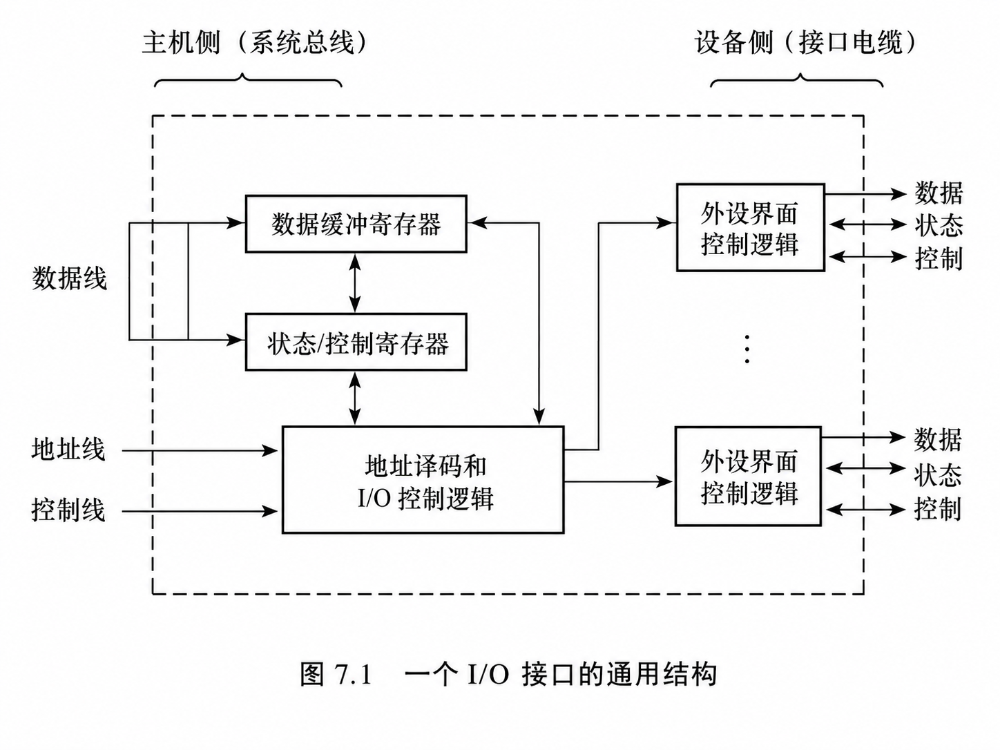

> 考点追踪：I/O 接口的数据线上传输的内容（2012）

I/O 接口中各类总线传送的内容如下。

| 总线 | 传送内容 |
|---|---|
| 数据线 | 读/写数据、状态信息、控制信息，以及中断类型号（在向量中断中）。 |
| 地址线 | 指定要访问的 I/O 接口内部寄存器的端口地址。 |
| 控制线 | 读/写控制信号（用于区分寄存器访问方向）、中断请求与响应信号、总线仲裁信号、设备握手信号等。 |

I/O 接口中的 I/O 控制逻辑主要完成以下功能：

1. 对控制寄存器中的命令字进行译码，并生成相应控制信号，经外设界面控制逻辑送至外设。
2. 输出时，将数据缓冲寄存器的内容发送给外设；输入时，将外设数据写入数据缓冲寄存器。
3. 实时采集外设状态，并更新至状态寄存器。

## 7.3 I/O 方式

### 7.3.1 程序查询方式

从本轮 PDF 第 36 页上方的可见内容看，程序查询方式的效率计算中，平均消耗 4 个时钟周期。若每秒用于 I/O 查询的次数为相应频率，则每秒用于 I/O 的时钟周期数可写为：

\[
5 \times 10^5 \times 10 \times 4 = 2 \times 10^7
\]

CPU 主频为 500MHz，即每秒约有 \(5 \times 10^8\) 个时钟周期，因此 I/O 时间占比为：

\[
\frac{2 \times 10^7}{5 \times 10^8}=4\%
\]

程序查询方式的优点是**设计简单、硬件开销少**；缺点是 CPU 需要耗费大量时间进行查询与等待，并且在同一时间段内只能与一台外设通信，导致 CPU 与外设串行工作，效率较低。

### 7.3.2 程序中断方式

**1. 程序中断的基本概念**

程序中断是指计算机在执行程序的过程中，若出现某些急需处理的外部事件或内部异常，CPU 暂停当前程序的执行，转去处理该事件或异常；处理完毕后，再返回原程序的断点处继续执行。中断技术最初用于实现主机与 I/O 设备之间的异步通信。

> 考点追踪：中断方式的特点（2022、2023）

随着计算机系统的发展，中断技术被赋予了多种重要功能，主要包括：

1. 实现 CPU 与 I/O 设备的并行工作。
2. 处理硬件故障和软件异常。
3. 支持人机交互，如键盘输入、鼠标点击。
4. 支持多道程序与分时操作系统的任务切换。
5. 满足实时系统对快速响应的需求。
6. 实现用户程序向操作系统的切换，如通过软中断或系统调用指令。
7. 在多处理器系统中协调各处理器之间的通信与任务迁移。

中断的基本工作思想如下：当前进程发起 I/O 操作时，会启动相应外设，并主动进入阻塞状态；CPU 随即转而执行就绪队列中的另一进程，实现外设与 CPU 的并行工作。外设完成数据准备后，主动向 CPU 发出中断请求。CPU 响应后，暂停当前指令流、保存现场，并转入中断服务程序完成主机与外设之间的数据传送。数据传送结束后，CPU 恢复被中断进程的现场，并返回断点处继续执行。此后，外设与 CPU 再次并行工作。

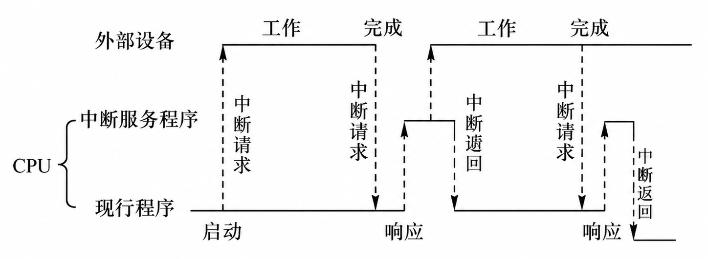

> 考点追踪：程序中断的效率分析及相关计算（2009、2014、2016、2018、2019）

**例 7.2** 设计算机主频为 500MHz，CPI 为 4，某外设的数据传输速率为 40MB/s，其 I/O 接口配备一个 32 位数据缓冲寄存器。在中断 I/O 方式下，若每次中断响应与中断处理共需至少 400 个时钟周期，则该外设能否采用中断 I/O 方式？为什么？

解：

中断响应与中断处理所需时间为：

\[
\frac{400}{500\text{M}}=0.8\mu s
\]

32 位缓冲寄存器容量为 4B，外设填满 4B 缓冲区所需时间为：

\[
\frac{4\text{B}}{40\text{MB/s}}=0.1\mu s
\]

由于外设准备数据的时间 \(0.1\mu s\) 远小于中断处理时间 \(0.8\mu s\)，若采用每 32 位触发一次中断的方式，则新数据将在 CPU 处理完前一次中断前到达，导致缓冲区被覆盖而丢失数据。因此，该高速外设不适合直接使用单字中断方式。

**2. 程序中断的工作流程**

> 考点追踪：中断工作流程中的相关细节（2017、2018、2021、2024）

**（1）中断请求**

中断源是指能够向 CPU 发出中断请求的设备或事件。一台计算机允许多个中断源同时存在，且各中断源发出请求的时间具有随机性。为记录并区分不同的中断请求，中断系统为每个中断源设置一个中断请求标记触发器。当状态为“1”时，表示该中断源有中断请求。这些触发器可组成中断请求标记寄存器，该寄存器可集中设置在 CPU 内部，也可分散在各个中断源中。

> 考点追踪：可屏蔽中断和不可屏蔽中断的特点（2020）

通过 INTR 信号线发出的是**可屏蔽中断**；通过 NMI 信号线发出的是**不可屏蔽中断**。可屏蔽中断的优先级较低，在关中断状态下不被响应；不可屏蔽中断用于处理紧急且关键的硬件事件，如电源掉电、总线错误等，其优先级最高，且不受中断允许标志影响。

**（2）中断响应判优**

中断响应优先级是指 CPU 响应多个同时发生的中断请求时的先后顺序。由于中断请求具有随机性，当多个中断源同时提出请求时，需要通过中断判优逻辑确定优先响应哪个中断源。中断响应的判优通常由硬件排队器或中断查询程序实现。

一般来说，中断响应的优先级具有如下规律：

1. 不可屏蔽中断高于可屏蔽中断。
2. 在 I/O 传送类中断请求中，高速设备高于低速设备。
3. 输入设备高于输出设备。
4. 实时设备高于普通设备。

> 注意：中断优先级包括**响应优先级**和**处理优先级**。响应优先级由硬件线路或查询顺序固定决定，不能动态更改；处理优先级可通过中断屏蔽技术动态调整，用于支持多重中断（中断嵌套）。只有未被屏蔽的中断请求，才会被送入中断判优电路参与响应优先级的判定。

**（3）CPU 响应中断的条件**

> 考点追踪：CPU 响应中断的条件（2023）

CPU 只有在满足特定条件时才会响应中断请求，并经过一系列特定操作，转去执行中断服务程序。CPU 响应中断必须满足以下三个条件：

1. 存在有效的中断请求。
2. CPU 处于开中断状态，即中断允许标志为 1；异常和不可屏蔽中断不受该条件限制。
3. 当前指令已经执行完毕；异常不受该条件限制，并且没有更高优先级任务待处理。

> 注意：I/O 设备的就绪时间是随机的，而 CPU 仅在每条指令执行结束时统一采样中断请求信号，前提是开中断。因此，CPU 响应 I/O 中断的时机总是发生在某条指令执行完成之后。本处所说中断特指 I/O 中断，不包括异常。

**（4）中断响应过程**

CPU 响应中断后，由硬件自动完成一系列操作，这些操作称为**中断隐指令**，随后转入中断服务程序。中断隐指令并不是指令系统中的真实指令，而是对硬件自动操作的统称，主要包括以下步骤：

1. **关中断**：CPU 响应中断后，首先关闭中断允许标志，禁止响应任何可屏蔽中断（包括更高优先级者），防止在保存断点和现场时被新中断打断。否则，现场信息可能不完整，导致中断返回后无法正确恢复原程序执行。
2. **保存断点**：为保证中断返回后能正确恢复原程序执行，需将程序计数器（PC）和程序状态字（PSW）等关键信息保存至栈或专用寄存器中。中断与异常在断点位置上存在差别：
   - 中断发生于指令执行完成之后，断点为下一条指令地址。
   - 故障类异常（如缺页、除零）由指令未完成引发，处理后需要重新执行当前指令，断点为当前指令地址。
   - 陷阱类异常（如系统调用）在指令成功执行后触发，断点为下一条指令地址。
3. **引出中断服务程序**：通过识别中断源，将相应中断服务程序的入口地址送入程序计数器 PC。识别方法主要有硬件向量法和软件查询法，本节主要讨论更常用的硬件向量中断法。

**（5）中断向量**

中断识别分为**向量中断**和**非向量中断**两类。非向量中断采用软件查询法。

> 考点追踪：中断向量表的数据结构（2023）

在向量中断中，每个中断源被分配一个唯一的中断类型号，该类型号对应一个中断服务程序的入口地址，此地址称为**中断向量**。系统将所有中断向量集中存放在内存的特定区域，该区域称为**中断向量表**。

CPU 响应中断后，首先在中断响应阶段从数据总线获得该中断源的中断类型号，然后据此计算出对应中断向量在中断向量表中的地址；接着从中断向量表中读取该中断向量，并送入程序计数器 PC，从而转入对应的中断服务程序。这种基于中断向量表实现转移的方法称为**中断向量法**，采用该方法的中断称为**向量中断**。

> 注意：中断请求和响应信号通过 I/O 总线的控制线传输，而中断类型号在中断响应阶段由中断控制器经数据总线提供给 CPU，用于定位中断向量表中的相应表项。

**（6）中断处理过程**

不同计算机的中断处理过程各具特色。图 7.4 所示为一个支持中断嵌套的典型处理流程。

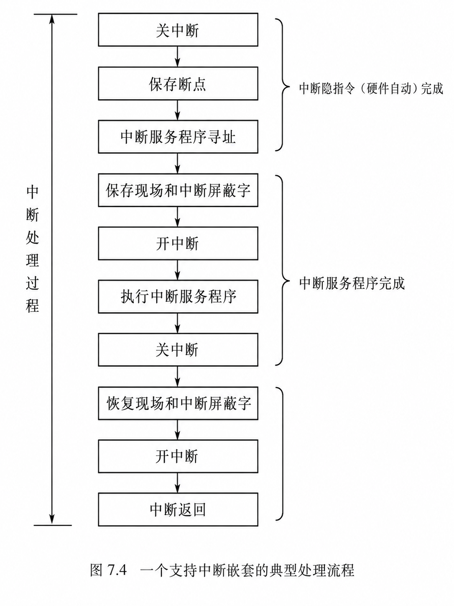

中断处理流程如下：

1. **关中断**：防止在保存关键信息过程中被新中断打断。
2. **保存断点**：由硬件自动将断点信息保存至栈或专用寄存器。
3. **中断服务程序寻址**：通过中断类型号获取服务程序入口地址，并送入 PC。
4. **保存现场和中断屏蔽字**：通过软件指令将现场信息和中断屏蔽字压入栈中，以便后续恢复。现场信息是指 CPU 中可能被中断服务程序修改且需要恢复的寄存器内容。

> 注意：断点与现场信息均不可被中断服务程序破坏。由于现场信息用指令可直接访问，因此由软件在进入中断服务程序时显式保存；而断点信息由硬件在中断响应阶段自动保存。

5. **开中断**：由开中断指令实现，允许更高优先级的中断请求被响应，从而实现中断嵌套。
6. **执行中断服务程序**。
7. **关中断**：由关中断指令实现，确保在恢复现场和中断屏蔽字的过程中不被中断。
8. **恢复现场和中断屏蔽字**：从栈中恢复寄存器内容及中断屏蔽状态。
9. **开中断、中断返回**：中断服务程序的最后一条指令通常为中断返回指令，用于恢复断点现场并返回原程序继续执行。

> 考点追踪：中断隐指令的功能（2012）
>
> 其中，步骤 1-3 由中断隐指令（硬件自动）完成；步骤 4-9 由中断服务程序（软件）完成。

> 考点追踪：单重中断的处理流程（2010）
>
> 对于单重中断（不支持嵌套），上述流程中省略步骤 5（开中断）和步骤 7（关中断）即可。

**3. 多重中断和中断屏蔽技术**

在 CPU 执行中断服务程序的过程中，若出现新的更高优先级中断请求，而 CPU 不予响应，则称为**单重中断**；若 CPU 暂停当前中断服务程序，转去处理新中断，则称为**多重中断**，也称为**中断嵌套**。

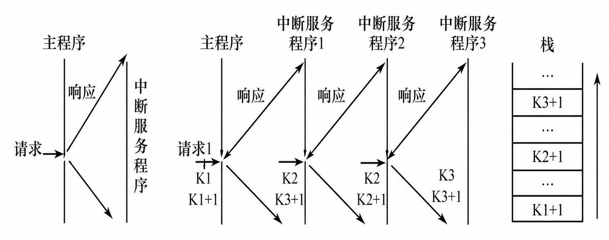

在图 7.5(b) 中，CPU 执行主程序时收到中断请求 1。由于主程序未屏蔽任何中断，CPU 响应该中断，将主程序断点保存至栈中，并转入中断服务程序 1。在执行中断服务程序 1 期间，若发生优先级更高的中断请求 2，CPU 会暂停中断服务程序 1，将其断点保存至栈中，并转入中断服务程序 2。类似地，更高优先级的中断请求 3 可打断中断服务程序 2。中断请求 3 处理完毕后，CPU 从栈顶恢复断点，返回至中断服务程序 2 的断点 \(K3+1\) 处继续执行。以此类推，直到所有中断处理完毕，最终返回主程序的断点 \(K1+1\) 处继续执行。

> 考点追踪：多重中断的中断屏蔽字相关性质（2017、2020、2021、2024）

中断处理优先级是指多重中断的实际处理顺序，可通过中断屏蔽技术动态调整。若不使用屏蔽技术，则处理优先级与响应优先级（中断请求被 CPU 识别的先后顺序）一致。现代计算机通常采用中断屏蔽技术，通过设置中断屏蔽字寄存器实现灵活的优先级控制。

图 7.6 所示为一个简单的可编程中断控制器。来自 I/O 总线的外设中断请求信号 \(IR_i\) 首先被记录在中断请求寄存器中。中断屏蔽字寄存器的每一位对应一个中断源：置 1 时屏蔽对应的中断请求，置 0 时允许其通过。在进入中断判优电路前，每个中断请求信号会与其对应屏蔽位的取反值进行逻辑“与”操作。只有屏蔽位为 0 时，该中断请求才被允许参与仲裁。因此，被屏蔽的中断不送入中断判优电路，而未被屏蔽的中断则按固定的响应优先级参与处理。

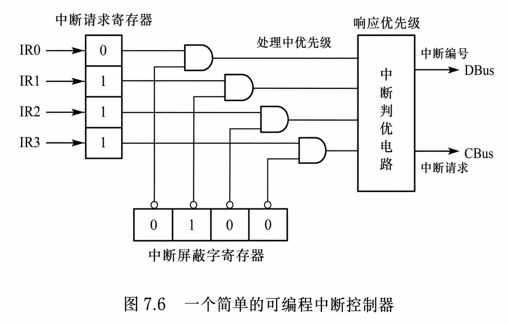

需要注意，中断屏蔽字通常在进入中断服务程序时由软件加载，用于控制后续中断的嵌套行为。因此，中断屏蔽仅在 CPU 执行中断服务程序期间生效；在主程序运行阶段，中断响应仍由主程序所设置的屏蔽状态决定，通常为全开放。即使在中断服务程序执行期间，若有多个未屏蔽中断同时到达，其处理顺序仍由中断判优电路的响应优先级决定。

**例 7.3** 设某机有 4 个中断源 A、B、C、D，其硬件响应优先级为 \(A>B>C>D\)。现要求通过中断屏蔽技术，将实际中断处理优先级调整为 \(A>D>C>B\)。

1. 写出每个中断源对应的中断屏蔽字。
2. 若 CPU 在执行用户程序时，A、C、D 同时发出中断请求；随后在执行 C 的中断服务程序期间，B 又发出中断请求。试分析 CPU 的程序执行轨迹。

解：

中断处理优先级调整为 \(A>D>C>B\) 后：A 的处理优先级最高，需要屏蔽所有中断（包括自身），屏蔽字为 1111；D 的优先级次之，只允许被 A 中断，屏蔽 B、C 和自身，屏蔽字为 0111；C 的优先级第三，允许被 A 和 D 中断，屏蔽 B 和自身，屏蔽字为 0110；B 的优先级最低，允许被 A、D、C 中断，仅屏蔽自身，屏蔽字为 0100。

表 7.1 中断源对应的中断屏蔽字：

| 中断源 | A | B | C | D |
|---|---:|---:|---:|---:|
| A | 1 | 1 | 1 | 1 |
| B | 0 | 1 | 0 | 0 |
| C | 0 | 1 | 1 | 0 |
| D | 0 | 1 | 1 | 1 |

解答第 2 问时，CPU 执行用户程序，A、C、D 同时发出中断请求。根据响应优先级，CPU 先响应 A。进入 A 的服务程序前，系统保存现场，加载 A 的中断屏蔽字 1111，并开中断。由于所有中断均被屏蔽，A 的服务程序独占 CPU 直至完成，然后返回用户程序。

返回用户程序后，C 和 D 尚未处理，根据响应优先级，先响应 C。但在执行 C 的服务程序前，系统加载其屏蔽字 0110，此时允许 D 打断 C，于是 CPU 响应 D。D 的处理过程中未出现更高处理优先级的中断请求，因此 D 顺序完成后返回 C 的服务程序。C 处理途中，B 又发出中断请求，但由于 C 的屏蔽字为 0110，B 被屏蔽，该请求不予响应。C 处理完成后返回用户程序。最后，CPU 响应 B，B 处理完成后再次返回用户程序。整个执行轨迹如图 7.7 所示。

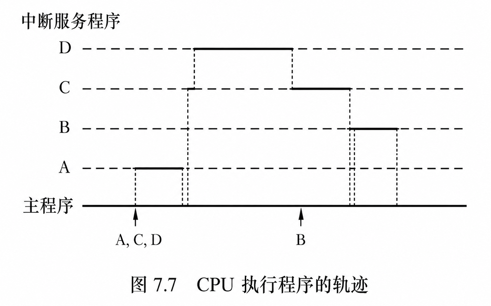

从宏观上看，程序中断方式克服了程序查询方式中 CPU 忙等待的问题，显著提高了 CPU 利用率；但从微观操作看，CPU 在处理中断时仍需要暂停原程序运行。尤其当高速设备频繁、成批地与主存交换数据时，如果不断打断 CPU 现行程序去执行中断服务程序，会造成较大开销。

### 7.3.3 DMA 方式

DMA 方式是一种完全由硬件控制的数据传输方式。它既具有程序中断方式的优点，即在数据准备阶段 CPU 与外设可以并行工作，又在外设与内存之间建立了一条直接的数据通路，使信息传送无须经过 CPU，从而显著降低 CPU 在数据传输过程中的负担。正因如此，DMA 方式又称为**直接存储器存取**，并避免了程序中断方式中保存与恢复 CPU 现场等复杂操作。

> 考点追踪：DMA 方式的使用场景（2025）

DMA 特别适用于磁盘、显卡、声卡、网卡等高速设备的大批量数据传输，但其硬件实现开销较高。在 DMA 方式中，中断的作用仅限于处理故障和正常传输完成后的通知。

> 考点追踪：DMA 方式中的数据传输通路（2024）

**1. DMA 方式的特点**

DMA 机制在主存与 DMA 控制器之间建立直接的数据通路。由于数据传输不经过 CPU，因此无须中断现行程序，从而实现 I/O 操作与 CPU 计算的并行执行。

DMA 方式的主要特点包括：

1. 打破主存与 CPU 的固定关联，主存既可被 CPU 访问，又可被外设直接访问。
2. 在块数据传输过程中，主存地址的生成与传送字数的计数均由硬件电路自动完成。
3. 主存中需要设置专用缓冲区，以支持高效的数据交换。
4. 支持高速数据传输，且 CPU 与外设可以并行工作，显著提升系统效率。
5. 传输开始前需由软件进行预处理，结束后则通过中断机制完成后处理。

**2. DMA 控制器的组成**

在 DMA 方式中，对数据传送过程进行控制的硬件称为 **DMA 控制器**，也称 **DMA 接口**。当 I/O 设备需要进行数据传送时，通过 DMA 控制器向 CPU 提出 DMA 请求；CPU 响应后让出系统总线，由 DMA 控制器接管总线并执行数据传送。其主要功能如下：

1. 接收外设发出的 DMA 请求，并向 CPU 发出总线请求信号。
2. 在 CPU 发出总线响应信号后，DMA 控制器接管总线控制权，进入 DMA 操作周期。
3. 确定数据传送的主存起始地址及长度，并自动更新主存地址计数器和传送长度计数器。
4. 指定数据在主存与外设间的传送方向，发出读/写等控制信号，完成数据传送。
5. 在 DMA 操作结束后，向 CPU 报告传送完成。

图 7.8 给出了一个简单的 DMA 控制器。

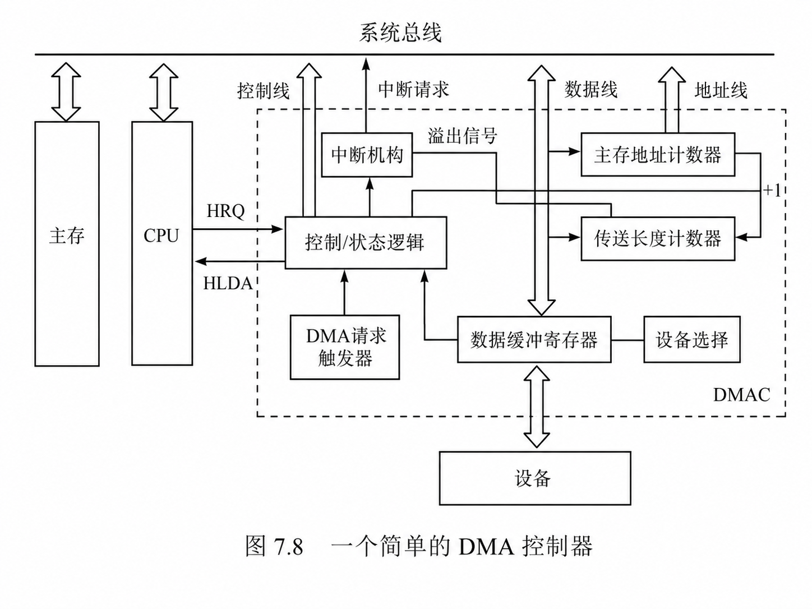

图 7.8 中各组成部件的作用如下。

| 部件        | 作用                                                       |
| --------- | -------------------------------------------------------- |
| 主存地址计数器   | 存放待传送数据的主存地址。传送前保存整批数据的起始地址；每传送一个字，其内容自动加 1，直到该批数据传送完毕。  |
| 传送长度计数器   | 记录待传送数据的总长度。传送前存入整批数据的总字数；每传送一个字，计数值减 1，当计数器为 0 时表示传送结束。 |
| 数据缓冲寄存器   | 暂存每次传送的数据。通常，DMA 控制器与主存之间以字为单位传送，而与外设之间可能以字节或字为单位传送。     |
| DMA 请求触发器 | 当 I/O 设备准备好数据时，发出 DMA 请求信号，使其置位。                         |
| 控制/状态逻辑   | 用于设定传送方向、更新传送参数，并协调 DMA 请求与 CPU 响应信号。                    |
| 中断机构      | 当一批数据传送完毕后，触发中断并向 CPU 发出中断请求。                            |
|           |                                                          |

在 DMA 传送过程中，DMA 控制器接管系统总线；传送结束后，将总线控制权交还给 CPU，由 CPU 继续执行后续操作。因此，DMA 控制器必须具备控制系统总线的能力。

**3. DMA 的传送方式**

主存与 I/O 设备之间交换信息时不经过 CPU。然而，当 I/O 设备和 CPU 同时访问主存时，可能发生冲突。为了高效利用主存，DMA 与 CPU 通常采用以下三种方式共享主存。

**（1）停止 CPU 访存**

当 I/O 设备发出 DMA 请求时，DMA 控制器向 CPU 发送停止信号，使 CPU 放弃总线控制权并暂停访存，直至 DMA 完成整块数据的传送。数据传送结束后，DMA 控制器通知 CPU 恢复主存访问，并交还总线控制权。

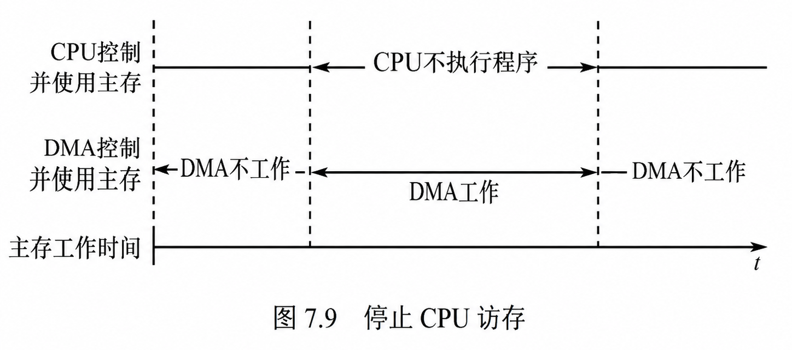

停止 CPU 访存方式的优点是控制逻辑简单，适用于数据传输速率很高的 I/O 设备进行成组数据传送；缺点是 DMA 访存期间 CPU 基本处于空闲状态，资源利用率较低。

**（2）周期挪用**

> 考点追踪：周期挪用的特点及挪用次数分析（2012、2020、2022）

对于高速 I/O 设备，若不及时访存可能导致数据丢失，因此其访存请求通常具有较高优先级。周期挪用允许 I/O 设备挪用一个主存存储周期，传送完一个数据字之后立即释放总线，属于单字传送方式。

当 I/O 设备发起 DMA 请求时，可能出现以下三种情况：

1. CPU 当前不在访存，I/O 请求不冲突，可直接使用总线。
2. CPU 正在访存，则需等待当前存储周期结束后，再释放总线控制权。
3. I/O 与 CPU 同时请求访存，发生冲突，此时 CPU 暂时放弃总线控制权。

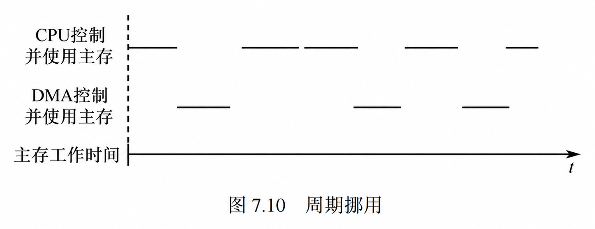

周期挪用方式的优点是既满足了 I/O 数据传送需求，又较好地发挥了 CPU 与主存的效率；缺点是每次挪用均需申请并释放总线控制权，带来一定开销。

**（3）DMA 与 CPU 交替访存**

将 CPU 工作周期划分为两个子周期：一个供 CPU 访存，另一个供 DMA 访存。这样，在每个 CPU 周期内，CPU 与 DMA 都可以轮流访问主存。该方式适用于 CPU 工作周期长于主存存储周期的场景。

例如，若 CPU 工作周期为 1.2μs，主存存储周期小于 0.6μs，则可将其划分为 \(C_1\) 和 \(C_2\) 两个子周期，其中 \(C_1\) 专供 DMA 访存，\(C_2\) 专供 CPU 访存。总线控制权通过 \(C_1\) 和 \(C_2\) 分时固定分配，无须动态申请或释放。

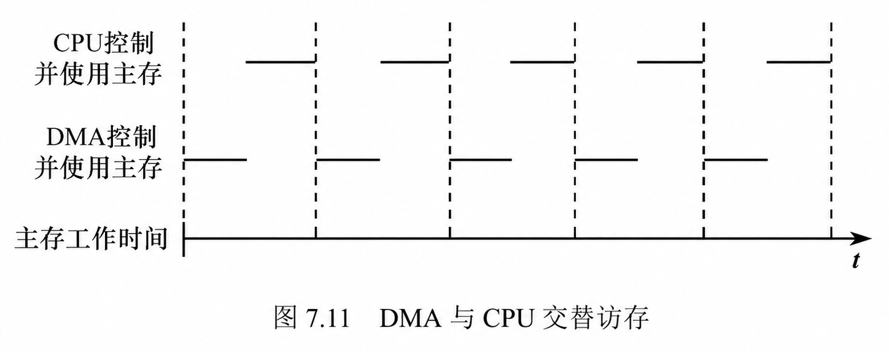

DMA 与 CPU 交替访存方式的优点是无须总线控制权的申请与释放过程，数据传送速率高；缺点是硬件控制逻辑较复杂。

> 考点追踪：DMA 方式的效率分析及相关计算（2011、2018）

**例 7.4** 假定计算机的主频为 500MHz，CPI 为 4，某外设的数据率为 40MB/s，I/O 接口中的数据端口为 32 位。采用 DMA 方式，每次 DMA 传送块大小为 1000B，且 DMA 预处理和后处理的总时钟周期数为 500，则 CPU 用于该外设 I/O 的时间占 CPU 总时间的百分比是多少？

解：

DMA 每秒次数为：

\[
40\text{MB/s} \div 1000\text{B}=40000
\]

在 DMA 方式中，只有预处理和后处理需要 CPU 处理，数据传送全程由 DMA 控制。CPU 用于外设 I/O 的总时钟周期数为：

\[
40000 \times 500=2\times 10^7
\]

CPU 主频为 500MHz，因此 I/O 时间占 CPU 总时间的百分比为：

\[
\frac{2\times 10^7}{500\text{M}}=4\%
\]

**4. DMA 的传送过程**

> 考点追踪：DMA 方式的传送过程（2019）

图 7.12 所示为 DMA 的数据传送流程，分为**预处理、数据传送和后处理**三个阶段。

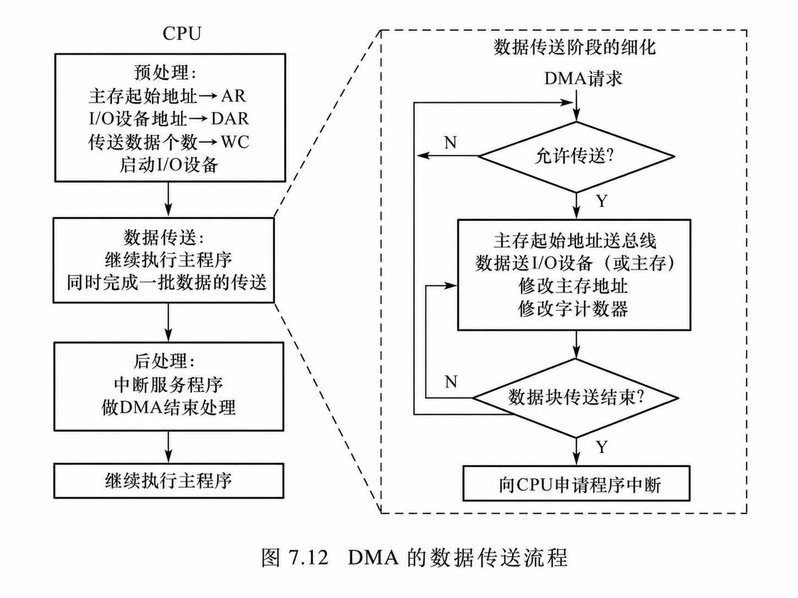

**（1）预处理**

由 CPU 完成必要的初始化工作，包括设置 DMA 控制器中的主存起始地址、传送方向、传送数据个数，并启动 I/O 设备。随后，CPU 继续执行原程序。当 I/O 设备准备好待发送（输入）或接收（输出）的数据时，会向 DMA 控制器发出 DMA 请求；DMA 控制器随即向 CPU 发出总线请求，申请总线控制权。

**（2）数据传送**

DMA 以数据块为单位进行传送。一旦获得总线控制权，DMA 控制器便通过硬件循环自动完成数据的输入或输出操作，整个过程无须 CPU 干预。

**（3）后处理**

> 考点追踪：DMA 传送结束时的处理（2025）

数据块传送完成后，DMA 控制器向 CPU 发出中断请求。CPU 响应后执行中断服务程序，进行后处理工作，如校验数据完整性，若出错则转入诊断程序等。

在 DMA 方式下，整个数据块的传送过程均由硬件完成，CPU 仅在预处理阶段进行初始化，在后处理阶段响应中断，因此用于 I/O 的开销极小。

## 本章疑难点

### 中断类型号、中断向量地址与向量中断

中断类型号也称中断号。中断向量地址可由中断类型号乘以表项长度计算得出。例如，若表项占 4 字节，中断类型号为 5，则向量地址为 \(5\times 4=20\)（假设表从 0 开始）。因此，向量地址是 CPU 用于定位中断向量的“索引位置”。

向量中断是一种能够自动识别中断源并快速转移到对应服务程序的中断处理方式。当中断发生时，中断源或中断控制器向 CPU 提供中断类型号，CPU 据此生成向量地址，并从向量表中取出对应的中断向量（入口地址），直接转移执行相应的中断服务程序。

### 程序中断和调用子程序的区别

虽然程序中断和子程序调用都会引起程序执行流程的转移，但二者在本质上存在显著差异，主要体现在以下几个方面：

1. **触发时机不同**：子程序调用由程序员通过 CALL 指令主动发起，发生时刻和位置是确定的；中断由外部设备或内部事件随机触发，CPU 只在每条指令执行结束时采样中断请求，一旦条件满足便转入中断处理，具有明显的异步性和不可预测性。
2. **服务关系不同**：子程序完全为主程序服务，二者构成主从关系；主程序在需要时调用子程序，执行完毕后返回主程序继续运行。中断服务程序通常与主程序无直接关联，是为响应外部事件（如数据到达、定时器溢出等）而执行的独立任务，二者属于平行关系。
3. **实现机制不同**：子程序调用是纯软件行为，只需利用堆栈保存返回地址，无须额外硬件支持；中断处理依赖软硬件协同，需要借助中断请求线、中断控制器和优先级判优电路等硬件，才能完成中断请求的接收、判优、响应和断点保护等操作。
4. **嵌套级别不同**：子程序可以多层嵌套，嵌套深度主要受限于系统堆栈空间；中断嵌套则受优先级机制约束，只有更高优先级的中断才能打断当前正在执行的中断服务程序。由于硬件复杂性和实时性考虑，实际系统中中断优先级通常较少，嵌套层次有限。
