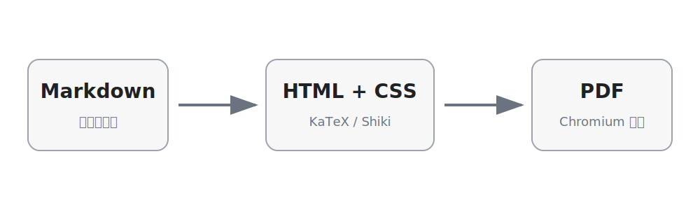

# Markdown 综合结构展示

> 这是一份用于测试 Markdown 到 PDF 渲染效果的综合文档，覆盖标题、段落、强调、列表、任务列表、引用、表格、链接、图片、公式、代码块、HTML、Obsidian 语法与分页边界等常见结构。

[跳转到公式部分](#8-数学公式) · [跳转到代码部分](#9-代码块) · [跳转到表格部分](#6-表格)

---

## 1. 标题层级

下面依次展示六级标题。实际写作中，建议一级标题作为文档标题，二级标题作为章节，三级及以下标题用于细分内容。

### 三级标题：章节小节

#### 四级标题：知识点

##### 五级标题：补充说明

###### 六级标题：最小标题

标题后的普通段落用于观察标题与正文之间的留白、字重、行高以及自动书签效果。

---

## 2. 段落与文本样式

这是一个普通段落。Markdown 会自动将连续文字组成段落；不同段落之间保留一个空行，可以让结构更加清晰。

这段文字包含 **粗体文本**、*斜体文本*、***粗斜体文本***、~~删除线文本~~、==Obsidian 高亮文本== 和 `inline code`。还可以组合使用，例如 **重点中的 `代码`**。

常见行内元素：

- 键盘按键：<kbd>Ctrl</kbd> + <kbd>Shift</kbd> + <kbd>P</kbd>
- 上标与下标：H<sub>2</sub>O，x<sup>2</sup>
- 拼音标注：<ruby>考研<rt>kǎo yán</rt></ruby>
- 强制换行：第一行<br>第二行
- 转义字符：\*不是斜体\*，\# 不是标题，\[不是链接开头

自动链接测试：https://example.com

显式链接测试：[示例链接](https://example.com "链接标题")

Obsidian 双链会被转为普通文本：[[概率论与数理统计|概率统计笔记]]。

---

## 3. 无序列表与嵌套列表

- 一级项目 A
- 一级项目 B
  - 二级项目 B.1
  - 二级项目 B.2
    - 三级项目 B.2.1
    - 三级项目 B.2.2
- 一级项目 C

列表项中也可以包含多个段落。

- 第一个段落说明主要内容。

  第二个段落继续补充细节，并保持在同一个列表项中。

- 下一个列表项恢复正常。

---

## 4. 有序列表与任务列表

1. 收集资料
2. 整理结构
3. 编写内容
   1. 编写标题
   2. 编写正文
   3. 插入示例
4. 导出并检查 PDF

从指定编号开始：

5. 第五项
6. 第六项
7. 第七项

任务列表：

- [x] 标题与段落
- [x] 列表与表格
- [x] 数学公式
- [x] 代码高亮
- [ ] 后续添加新的主题样式
- [ ] 继续完善边界测试

---

## 5. 引用、嵌套引用与提示块

> 这是一级引用。
>
> 引用中可以包含 **粗体**、`代码` 和行内公式 \( a^2+b^2=c^2 \)。
>
> > 这是二级嵌套引用。
> >
> > - 引用中的列表项一
> > - 引用中的列表项二

Obsidian 风格提示块：

> [!NOTE]
> 这是一条说明信息，用于观察提示块语法在当前渲染器中的降级效果。

> [!WARNING]
> 这是一条警告信息。即使没有专门的 Callout 插件，也应保持内容可读。

---

## 6. 表格

### 6.1 基础表格

| 模块 | 支持情况 | 示例 | 备注 |
|---|:---:|---:|---|
| 标题 | 支持 | 6 级 | 自动生成锚点 |
| 数学公式 | 支持 | KaTeX | 支持行内与块级公式 |
| 代码高亮 | 支持 | Shiki | 自动识别常见语言 |
| 任务列表 | 支持 | 已完成/未完成 | 可显示复选框 |

### 6.2 长文本表格

| 场景 | 说明 |
|---|---|
| 自动换行 | 当单元格内容较长时，应在页面宽度内自动换行，不能超出右侧页边距，也不能覆盖相邻列。 |
| 中英文混排 | English words、中文字符、数字 12345 与符号 `<>[]{}()` 应保持清晰。 |
| 行内格式 | 单元格中可以包含 **粗体**、*斜体*、`代码` 和 \( f(x)=x^2 \)。 |

---

## 7. 图片与图注

下面的 SVG 图片用于检查矢量图、中文文字、箭头和相对路径引用是否正常。



*图 1：Markdown 经过解析、样式处理与 Chromium 打印后生成 PDF。*

---

## 8. 数学公式

### 8.1 行内公式

勾股定理可写为 \( a^2+b^2=c^2 \)。正态分布的随机变量可记作 \( X\sim N(\mu,\sigma^2) \)，其数学期望为 \( E(X)=\mu \)。

### 8.2 块级公式

二次方程 \( ax^2+bx+c=0 \) 的求根公式为

\[
x=\frac{-b\pm\sqrt{b^2-4ac}}{2a}.
\]

积分示例：

\[
\int_0^1 x^n\,\mathrm{d}x=\frac{1}{n+1},\qquad n>-1.
\]

### 8.3 多行公式

\[
\begin{aligned}
(a+b)^2 &= a^2+2ab+b^2,\\
(a-b)^2 &= a^2-2ab+b^2,\\
(a+b)(a-b) &= a^2-b^2.
\end{aligned}
\]

矩阵与行列式：

\[
A=\begin{pmatrix}
1 & 2\\
3 & 4
\end{pmatrix},\qquad
\det(A)=1\times4-2\times3=-2.
\]

概率公式：

\[
P(A\mid B)=\frac{P(A\cap B)}{P(B)},\qquad P(B)>0.
\]

---

## 9. 代码块

### 9.1 Python

```python
from dataclasses import dataclass

@dataclass
class Student:
    name: str
    score: float


def average(students: list[Student]) -> float:
    if not students:
        raise ValueError("students must not be empty")
    return sum(item.score for item in students) / len(students)


students = [Student("Alice", 92.5), Student("Bob", 87.0)]
print(f"average = {average(students):.2f}")
```

### 9.2 TypeScript

```typescript
interface ApiResult<T> {
  data: T;
  error: string | null;
}

async function fetchJson<T>(url: string): Promise<ApiResult<T>> {
  try {
    const response = await fetch(url);
    if (!response.ok) throw new Error(`HTTP ${response.status}`);
    return { data: await response.json() as T, error: null };
  } catch (error) {
    return { data: null as T, error: String(error) };
  }
}
```

### 9.3 SQL

```sql
SELECT
  user_id,
  COUNT(*) AS task_count,
  AVG(duration_ms) AS avg_duration_ms
FROM workflow_tasks
WHERE created_at >= DATE '2026-07-01'
GROUP BY user_id
HAVING COUNT(*) >= 3
ORDER BY task_count DESC;
```

### 9.4 Bash 与 JSON

```bash
npm install
npm run test
npm run build:queue
```

```json
{
  "name": "markdown-structures",
  "theme": "chatgpt-light",
  "features": ["math", "tables", "code", "tasks"],
  "success": true
}
```

### 9.5 Diff

```diff
- const theme = "old-light";
+ const theme = "chatgpt-light";
+ const verifyOutput = true;
```

### 9.6 无语言代码块

```
Plain text code block
Line 2: symbols <> [] {} ()
Line 3: 中文与 English 混排
```

---

## 10. HTML 结构

<details>
<summary><strong>点击展开详细内容</strong></summary>

这里是折叠区域中的内容。PDF 中通常会按照浏览器打印时的展开状态渲染；该结构主要用于检查原生 HTML 的兼容性。

- 折叠区列表一
- 折叠区列表二

</details>

<div style="border-left: 4px solid #9ca3af; padding: 8px 12px; margin: 16px 0;">
这是一个使用原生 HTML 和内联样式创建的自定义信息块，用于检查 HTML 是否被保留。
</div>

---

## 11. 长文本与分页边界

下面是一段较长的文字，用于观察中英文混排、自动换行、标点避头尾和跨页时的段落表现。Markdown 文档导出为 PDF 时，最重要的不只是“能够生成文件”，还要确保标题不会被截断、表格不会溢出、代码不会覆盖页脚、数学公式不会错位、图片不会拉伸变形，同时还要保证页面背景、页边距、字体回退与书签结构保持一致。对于学习笔记而言，稳定的排版比复杂的装饰更加重要，因为长文档通常会频繁修改和重复构建，任何偶发的布局错误都会显著降低使用体验。

重复段落用于制造自然分页：当内容接近页面底部时，浏览器需要决定标题、引用、表格和代码块是否整体移动到下一页。理想情况下，短标题不应孤立在页尾，代码块不应出现大面积裁切，块级公式也应保持完整。当前项目使用 Chromium 生成 PDF，因此最终效果应以实际渲染后的页面图片为准，而不能只根据 HTML 预览判断。

### 11.1 边界检查清单

- 标题是否被截断
- 中文是否出现方框或缺字
- 公式是否错位或超出页边距
- 表格是否横向溢出
- 代码块是否完整显示
- 图片是否保持比例
- 页脚是否覆盖正文
- 书签是否包含主要标题

---

## 12. 综合小结

本文档覆盖了当前项目常用且明确支持的 Markdown 结构：

1. 六级标题与自动锚点
2. 粗体、斜体、删除线、高亮和行内代码
3. 有序、无序、嵌套和任务列表
4. 引用与 Obsidian 风格提示块
5. 对齐表格与长文本单元格
6. 本地 SVG 图片
7. KaTeX 行内、块级和多行公式
8. 多语言 Shiki 代码高亮
9. 原生 HTML 元素
10. 长文本和分页边界

> 构建完成后，应同时检查 PDF 文件、预览拼图、构建日志与书签信息，确保最终产物没有明显排版问题。
