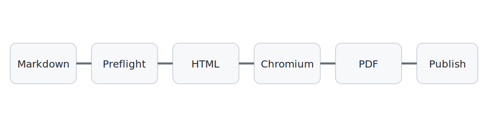

# PDF Pipeline Smoke Test

这是一份用于验证完整自动化链路的临时文档。构建成功后，源任务会从 `main` 的 `inbox` 中自动消费，PDF 和 HTML 会发布到 `output` 分支。

## 渲染组件

- Markdown-it 负责 Markdown 解析。
- KaTeX 负责数学公式渲染。
- Shiki 负责代码高亮。
- Chromium 负责最终 PDF 打印。

行内公式：\( E = mc^2 \)。

块级公式：

\[
\begin{aligned}
P(X=k) &= \binom{n}{k}p^k(1-p)^{n-k} \\
f(x) &= \int_0^x e^{-t^2}\,dt
\end{aligned}
\]



```javascript
const pipeline = ['Markdown', 'HTML', 'Chromium', 'PDF'];
console.log(pipeline.join(' -> '));
```

| 阶段 | 预期结果 |
|---|---|
| 资源预检 | 成功 |
| KaTeX 校验 | 成功 |
| HTML 渲染 | 成功 |
| PDF 生成 | 成功 |
| Artifact 上传 | 成功 |
| output 发布 | 成功 |
| inbox 消费 | 成功 |
