##  408模拟选择题详细解答

|     顺序 | 科目           | 题目数量 |
| -------: | -------------- | -------: |
|        1 | 数据结构       |      165 |
|        2 | 计算机组成原理 |      165 |
|        3 | 操作系统       |      150 |
|        4 | 计算机网络     |      120 |
| **合计** | **4 个科目**   |  **600** |


---

## 数据结构

### 第1章 绪论

#### 1.2 算法和算法评价

##### 1.2.1 算法的基本概念

<br>
<br>

1. **【王道·卷一-Q01】** 在下列选项中，不属于算法的主要特征的是（  ）。<br>
A. 有穷性
B. 可行性
C. 确定性
D. 可读性

- 答案：D
- 解析：算法的基本特征通常包括有穷性、确定性、可行性以及输入和输出。可读性是评价算法或程序质量的重要指标，但不是算法成立所必需的基本特征。因此，A、B、C 均属于算法的主要特征，D 不属于。

##### 1.2.2 算法效率的度量

<br>
<br>

1. **【王道·卷一-Q02】** 设 \(n\) 是描述问题规模的正整数，则下列程序段的时间复杂度是（  ）。<br>

```c
for(i=1;i<=n;i++){
    for(j=2*i;j<=n;j++){
        y += i*j;
    }
}
```
A. \(O(n)\)
B. \(O(n^{2})\)
C. \(O(n\log_{2}n)\)
D. \(O(\log_{2}n)\)

- 答案：B
- 解析：当 \(2i\le n\) 时，内层循环从 \(j=2i\) 执行到 \(j=n\)，执行次数为 \(n-2i+1\)；当 \(i>n/2\) 时，内层循环不执行。因此总执行次数为

  \[
  \begin{aligned}
  T(n)
  &=\sum_{i=1}^{\lfloor n/2\rfloor}(n-2i+1)\\
  &=\Theta(n^2)
  \end{aligned}
  \]

  故时间复杂度为 \(O(n^2)\)。A、C、D 均低估了内层语句的总执行次数。

<br>
<br>

2. **【王道·卷二-Q01】** 设二叉树共有 \(n\) 个结点，则下列程序段的时间复杂度是（  ）。<br>

```c
int maxFunc(TreeNode* root){
    if (root == NULL) return 0;
    return max(maxFunc(root->left), maxFunc(root->right)) + 1;
}
```
A. \(O(\log_{2}n)\)
B. \(O(n)\)
C. \(O(n\log_{2}n)\)
D. \(O(2^{n})\)

- 答案：B
- 解析：函数对每个非空结点恰好访问一次，并在该结点处完成常数次比较和加法操作。设左右子树的结点数分别为 \(n_L\) 和 \(n_R\)，则

  \[
  T(n)=T(n_L)+T(n_R)+O(1)
  \]

  将整棵树的所有结点累加后可得 \(T(n)=\Theta(n)\)。A 只考虑了平衡二叉树的递归深度，却忽略了所有结点都要被访问；C 多乘了一个对数因子；D 将递归调用误认为会对同一批结点反复展开，实际上每个结点只处理一次。

<br>
<br>

3. **【王道·卷三-Q01】** 设 \(n\) 是描述问题规模的正整数，则如下程序片段的时间复杂度是（  ）。<br>

```c
i = 2;
while (i < n / 3)
    i = i * 3;
```
A. \(O(\log_{2}n)\)
B. \(O(n)\)
C. \(O(\sqrt[3]{n})\)
D. \(O(n^{3})\)

- 答案：A
- 解析：循环执行 \(k\) 次后，变量 \(i\) 的值为

  \[
  i=2\times 3^k
  \]

  循环终止时有 \(2\times 3^k\ge n/3\)，因此

  \[
  k\ge \log_3\frac{n}{6}
  \]

  故循环次数为 \(\Theta(\log n)\)。对数的底数只影响常数因子，因此 \(O(\log_3 n)=O(\log_2 n)\)，选择 A。B、C、D 都是多项式量级，与变量按倍数增长的规律不符。

<br>
<br>

4. **【王道·卷四-Q01】** 设 \(n\) 是描述问题规模的正整数，则下列程序段的时间复杂度是（  ）。<br>

```c
i = n * n;
while (i != 1)
    i = i / 2;
```
A. \(O(\log_{2}n)\)
B. \(O(n)\)
C. \(O(\sqrt{n})\)
D. \(O(n^{2})\)

- 答案：A
- 解析：变量 \(i\) 初值为 \(n^2\)，每轮循环都通过整数除法缩小为原来的一半。执行 \(k\) 次后，其数量级约为

  \[
  \frac{n^2}{2^k}
  \]

  当该值降至 1 时停止，因此

  \[
  2^k\approx n^2
  \]

  从而

  \[
  k=\Theta(\log_2 n^2)=\Theta(2\log_2 n)=\Theta(\log n)
  \]

  所以选择 A。B、C、D 都高估了循环次数。

<br>
<br>

5. **【竟成·模拟一-01】** 下列C语言函数的时间复杂度是（）。

```c
int getK(int k) {
    int cnt = 0, left = 0;
    for (int right = 0; right < n; right++) {
        if (nums[right] == 1) cnt++;
        while (left <= right && cnt >= k) {
            if (nums[left] == 1) cnt--;
            left++;
        }
    }
}
```
A. \(O(\log_2 n)\)
B. \(O(n)\)
C. \(O(n\log_2 n)\)
D. \(O(n^2)\)

- 答案：B
- 解析：外层指针 `right` 从 0 增加到 \(n-1\)，共移动 \(n\) 次。虽然内部存在 `while` 循环，但指针 `left` 在整个函数执行过程中只会单调递增，不会回退，因此其累计移动次数最多也是 \(n\) 次。总操作次数至多与 \(2n\) 同阶，故时间复杂度为 \(\Theta(n)\)。D 将内外循环简单相乘，忽略了 `left` 的累计移动次数只有 \(O(n)\)；A、C 也不符合双指针滑动窗口的摊还分析结果。

<br>
<br>

6. **【竟成·模拟二-01】** C语言函数f1、f2是求解斐波那契数的两种方式，则f1、f2的空间复杂度分别为（）。

```c
int f1(int n) {
    if (n == 1) return 1;
    if (n == 0) return 0;
    return f1(n - 1) + f1(n - 2);
}
int f2(int n) {
    int dp[n + 2], i;
    dp[0] = 0; dp[1] = 1;
    for (i = 2; i <= n; i++) {
        dp[i] = dp[i - 1] + dp[i - 2];
    }
    return dp[n];
}
```
A. \(O(n)\)、\(O(1)\)
B. \(O(2^n)\)、\(O(1)\)
C. \(O(n)\)、\(O(n)\)
D. \(O(2^n)\)、\(O(n)\)

- 答案：C
- 解析：`f1` 的递归调用总数虽然是指数级的，但空间复杂度取决于同一时刻递归栈的最大深度。沿着 `f1(n) → f1(n-1) → … → f1(0)`，最大递归深度为 \(O(n)\)，因此 `f1` 的空间复杂度是 \(O(n)\)。`f2` 定义了长度为 \(n+2\) 的数组 `dp`，该数组占用 \(O(n)\) 的辅助空间，因此 `f2` 的空间复杂度也是 \(O(n)\)。B、D 将 `f1` 的指数级时间复杂度误当成空间复杂度；A 忽略了 `f2` 中线性长度的数组。

<br>
<br>

7. **【竟成·模拟五-01】** 下列程序段的时间复杂度可能是（）。

```c
int sum = 0;
for (int i = 2; i <= n; i *= i)
    for (int j = 1; j <= i; j++)
        sum++;
```
A. \(O(\log_2 n)\)
B. \(O(n)\)
C. \(O(n\log_2 n)\)
D. \(O(n^2)\)

- 答案：B
- 解析：外层循环中 \(i\) 的取值依次为

  \[
  2,\ 4,\ 16,\ 256,\ldots
  \]

  即满足 \(i_{t+1}=i_t^2\)。外层循环次数虽然只有 \(O(\log\log n)\)，但第 \(t\) 轮内层循环要执行 \(i_t\) 次。由于该序列增长极快，所有较小项之和由最后一个不超过 \(n\) 的项主导，因此

  \[
  2+4+16+\cdots+i_{\max}=O(i_{\max})=O(n)
  \]

  当 \(n\) 恰好等于序列中的某一项时，总执行次数又可达到 \(\Omega(n)\)，故题目所给选项中应选线性量级的 B。A 只看到了外层循环，忽略了内层循环；C、D 虽也是更宽松的上界，但不是题目要求的最合适复杂度。

<br>
<br>

8. **【竟成·模拟七-01】** 假设下列程序段的所有输入都是合法的，则下列程序段的空间复杂度是（）。

```c
int fun(int *arr, int m, int n) {
    if (m == n)
        return 1;
    else {
        int mid = (m + n) / 2;
        return fun(arr, m, mid) + fun(arr, mid + 1, n);
    }
}
```
A. \(O(\log_2 n)\)
B. \(O(n)\)
C. \(O(n\log_2 n)\)
D. \(O(2^n)\)

- 答案：A
- 解析：每次递归都把当前区间近似均分为两半，因此从长度为 \(n-m+1\) 的区间递归到单个元素，递归深度为

  \[
  O\bigl(\log_2(n-m+1)\bigr)=O(\log_2 n)
  \]

  每一层递归只保存参数、局部变量 `mid` 和返回地址等常数空间。两个递归调用是先后完成的，不会让两棵递归子树的全部栈帧同时存在，因此最大辅助空间由递归深度决定，为 \(O(\log_2 n)\)。B 把总调用次数与最大栈深度混淆；C、D 均进一步高估了同时占用的空间。

### 第2章 线性表

#### 2.3 线性表的链式表示

##### 2.3.2 单链表上基本操作的实现

<br>
<br>

1. **【王道·卷七-Q01】** 一个带头结点的单链表，头指针为 \(L\)，尾指针 \(r\) 指向最后一个结点，要保证插入的先后顺序与对应结点在链中的顺序相反，则插入 \(p\) 结点的操作为（  ）。<br>
A. \(L\rightarrow next = p; p\rightarrow next = L\rightarrow next\)
B. \(p\rightarrow next = L\rightarrow next; L\rightarrow next = p\)
C. \(r\rightarrow next = p; r = p\)
D. \(p\rightarrow next = r\)

- 答案：B
- 解析：要使结点在链中的顺序与插入顺序相反，应采用头插法，把新结点 \(p\) 插入头结点 \(L\) 之后。正确操作顺序为：先令 \(p\rightarrow next\) 指向原来的第一个数据结点，再令 \(L\rightarrow next\) 指向 \(p\)，即选项 B。A 先修改 \(L\rightarrow next\)，随后再令 \(p\rightarrow next=L\rightarrow next\)，会使 \(p\) 指向自身；C 是尾插法，得到的链表顺序与插入顺序相同；D 只修改了一个指针，既没有将 \(p\) 正确接入链表，也没有更新头结点或尾结点的链接关系。

<br>
<br>

2. **【竟成·模拟五-03】** 已知表头元素为c的单链表在内存中的存储状态如下表所示，现将元素a从链表中删除，则元素c、e的链接地址依次为（）。

| 地址  | 元素 | 链接地址 |
| ----- | ---- | -------- |
| 1000H | a    | 1010H    |
| 1004H | b    | 100CH    |
| 1008H | c    | 1000H    |
| 100CH | d    | NULL     |
| 1010H | e    | 1004H    |
| 1014H |      |          |

A. 1010H、1004H
B. 1004H、1010H
C. 1000H、1010H
D. 1000H、100CH

- 答案：A
- 解析：由表中链接地址可还原链表的逻辑次序：

  ```text
  c(1008H) → a(1000H) → e(1010H) → b(1004H) → d(100CH) → NULL
  ```

  删除结点 `a` 时，应令其前驱结点 `c` 直接指向其后继结点 `e`，所以 `c` 的链接地址由 `1000H` 改为 `1010H`。结点 `e` 的后继仍为 `b`，其链接地址保持 `1004H` 不变。因此依次为 `1010H、1004H`，选择 A。B 交换了两者的链接地址；C、D 中 `c` 仍指向已删除结点 `a`，均不正确。

##### 2.3.3 双链表

<br>
<br>

1. **【竟成·模拟七-02】** 已知一个带有表头结点的双向循环链表L，结点结构为`prev | data | next`，其中，prev和next分别是指向其直接前驱和直接后继结点的指针。现要添加一个结点（指针x指向该插入结点）到指针p所指的结点的前一位置，正确的语句序列是（）。
A. x->next = p; x->prev = p->prev; p->prev->next = x; p->prev = x;
B. x->next = p; x->prev = p->prev; p->prev = x; p->prev->next = x;
C. x->next = p; p->prev = x; x->prev = p->prev; p->prev->next = x;
D. p->prev = x; x->next = p; x->prev = p->prev; p->prev->next = x;

- 答案：A
- 解析：设插入前 `p` 的前驱为 `q = p->prev`。插入后应形成链接关系 `q ⇄ x ⇄ p`，因此必须完成四次修改：

  ```c
  x->next = p;
  x->prev = p->prev;
  p->prev->next = x;
  p->prev = x;
  ```

  选项 A 的执行顺序在覆盖 `p->prev` 之前，先利用旧的前驱指针完成 `q->next=x`，因此正确。B 在执行 `p->prev=x` 后，`p->prev->next=x` 实际变成 `x->next=x`，破坏链表；C 先覆盖 `p->prev`，随后 `x->prev=p->prev` 会使 `x->prev=x`；D 同样过早覆盖 `p->prev`，无法再取得原前驱结点。

##### 2.3.5 静态链表

<br>
<br>

1. **【王道·卷六-Q01】** 静态链表结点的类型定义如下，假设 \(S\) 表示静态链表的数组。<br>

```c
typedef struct node{
    DataType data;
    int link;
} SListNode;
```
若逻辑上第 \(k\) 个结点的下标是i，则逻辑上第 \(k+1\) 个结点的数据是（  ）。
A. \(S[i + 1].data\)
B. \(S[k + 1].link.data\)
C. \(S[S[i].link].data\)
D. \(S[S[k].link].data\)

- 答案：C
- 解析：静态链表利用数组下标代替指针。已知逻辑上第 \(k\) 个结点位于数组下标 \(i\)，则 `S[i].link` 保存其直接后继结点的数组下标。因此第 \(k+1\) 个结点为 `S[S[i].link]`，其数据域为 `S[S[i].link].data`，选择 C。A 错在静态链表的逻辑相邻结点不一定存放在连续下标中；B 的表达式本身不符合结构体访问规则；D 将逻辑序号 \(k\) 错当成了数组下标。

<br>
<br>

2. **【竟成·模拟一-02】** 某带头结点的静态链表初始状态如下表所示。next=-1时，表示当前结点是尾结点。静态链表头指针head下标为0，空闲链表头指针avail初始为9。删除当前静态链表中的第三个存储数据的元素、并将空闲位置采用头插法插入空闲链表后，各结点的next值更新的结果为（）。

| 数组下标 | 0   | 1   | 2   | 3   | 4   | 5   | 6   | 7   | 8   | 9   |
| -------- | --- | --- | --- | --- | --- | --- | --- | --- | --- | --- |
| data     | A   | B   | C   | D   | E   | F   | G   | H   | I   |     |
| next     | 1   | 3   | 5   | 7   | -1  | 6   | -1  | 8   | 2   |     |

A. 1,3,5,7,-1,6,-1,9,2,4
B. 1,3,5,8,-1,6,-1,4,2,7
C. 1,7,5,9,-1,6,-1,8,2,4
D. 1,3,5,7,-1,6,-1,2,9,4

- 答案：B
- 解析：从头结点下标 0 出发，原静态链表的数据结点下标依次为：

  ```text
  0 → 1 → 3 → 7 → 8 → 2 → 5 → 6 → -1
  ```

  因此第三个存储数据的结点是下标 7 的结点 `H`，其前驱为下标 3，后继为下标 8。删除时令 `next[3]=8`。

  空闲链表以 9 号位置作为头结点，原来 `next[9]=4`。将释放的 7 号位置采用头插法插入空闲链表，应执行：

  ```text
  next[7] = next[9] = 4
  next[9] = 7
  ```

  其余位置保持不变，更新后的 `next` 依次为：

  ```text
  1,3,5,8,-1,6,-1,4,2,7
  ```

  故选择 B。其余选项没有同时正确完成主链表的删除连接和空闲链表的头插连接。

##### 2.3.6 顺序表和链表的比较

<br>
<br>

1. **【竟成·模拟三-01】** 下列操作可以在\(O(1)\)的时间复杂度内完成的是（）。
A. 删除单链表的k个元素
B. 在单链表的末尾添加一个元素
C. 删除单向循环链表的头结点
D. 删除双向循环链表的头结点

- 答案：D
- 解析：双向循环链表能够通过头结点直接取得首个数据结点及尾结点。删除首个数据结点时，只需修改常数个前驱、后继指针，因此时间复杂度为 \(O(1)\)，D 正确。

  A 需要定位并逐个处理待删除结点，通常不能保证为 \(O(1)\)；B 若单链表没有额外的尾指针，需要从表头遍历到表尾，时间复杂度为 \(O(n)\)；C 在只给出头指针的单向循环链表中，删除头结点后还要找到尾结点并修改其 `next`，通常需要 \(O(n)\)。

### 第3章 栈、队列和数组

#### 3.1 栈

##### 3.1.1 栈的基本概念

<br>
<br>

1. **【王道·卷六-Q02】** 假设栈的容量为3，入栈的序列为1,2,3,4,5，则出栈的序列可能为（  ）。<br>
A. 3,2,1,5,4
B. 1,5,4,3,2
C. 5,4,3,2,1
D. 4,3,2,1,5

- 答案：A
- 解析：对 A，可按如下操作实现：

  ```text
  1入栈，2入栈，3入栈，3出栈，2出栈，1出栈，
  4入栈，5入栈，5出栈，4出栈
  ```

  任意时刻栈中元素个数均不超过 3，因此 A 是可能的出栈序列。

  B 在输出 1 后，要紧接着输出 5，必须让 2、3、4、5 同时入栈，栈容量至少为 4；C 要首先输出 5，必须先将 1～5 全部入栈，容量至少为 5；D 要首先输出 4，必须先将 1～4 全部入栈，容量至少为 4。因此 B、C、D 均不可能。

<br>
<br>

2. **【王道·卷七-Q03】** 6个元素以6,5,4,3,2,1的顺序进栈，下列不合法的出栈序列是（  ）。<br>
A. 5,4,3,6,1,2
B. 4,5,3,1,2,6
C. 3,4,6,5,2,1
D. 2,3,4,1,5,6

- 答案：C
- 解析：检验 C：为首先输出 3，需要依次将 6、5、4、3 入栈，再弹出 3；随后可以弹出 4。此时栈顶是 5，而序列要求下一个输出 6。由于 5 位于 6 的上方，不先弹出 5 就不可能弹出 6，因此 C 不合法。

  其余序列均可实现：A 可在每压入一个新元素后适时弹出，先得到 5、4、3，再弹出 6；B 可先压入到 4 并弹出 4、5，再继续操作；D 可先压入到 2 并依次弹出 2、3、4，再压入并弹出 1，最后弹出 5、6。它们均满足栈的后进先出规则。

<br>
<br>

3. **【竟成·模拟三-02】** 下列关于栈的说法错误的是（）。
A. 可以使用两个队列实现一个后入先出的栈
B. 可以使用一个队列实现一个后入先出的栈
C. 可以使用两个栈实现先入先出队列
D. 可以使用一个栈实现先入先出队列

- 答案：D
- 解析：两个队列可以通过在入栈或出栈时倒换元素实现栈；一个队列也可以在入队后通过循环移动前面的元素，使新元素位于队头，从而模拟后进先出，因此 A、B 正确。两个栈可采用“输入栈 + 输出栈”的方式实现队列，C 正确。

  在只允许使用一个普通栈及常数个辅助变量、且不借助递归调用或其他线性存储结构的标准模型下，无法长期保持先入先出的访问次序，因此 D 错误。若借助递归，递归调用栈实际上又提供了额外的栈空间，不能视为仅使用一个栈。

<br>
<br>

4. **【竟成·模拟四-02】** 若栈的输入序列是：1,2,3,···,n，输出序列是：p₁,p₂,···,pₙ。若存在k>1，使得pₖ=n。则当i>k时，pᵢ是（）。
A. n-i+1
B. 不定
C. n-i+k
D. n-i+k-1

- 答案：B
- 解析：当 \(p_k=n\) 时，元素 \(n\) 被弹出前，输入序列中的所有元素都已经入过栈。此后虽然不再有新元素入栈，但栈中剩余哪些元素，取决于前 \(k-1\) 次出栈时已经弹出了哪些元素，因此后续各项的具体取值不能由 \(n\)、\(i\)、\(k\) 唯一确定。

  例如取 \(n=6\)、\(k=3\)：

  ```text
  3,2,6,5,4,1
  ```

  是合法序列；

  ```text
  2,1,6,5,4,3
  ```

  也是合法序列。两者均有 \(p_3=6\)，但后续元素并不完全相同。因此只能确定后续元素将按当时栈内的顺序依次弹出，不能确定统一公式，选择 B。

<br>
<br>

5. **【竟成·模拟五-02】** 一个栈的入栈序列为1,2,3,···,n，其出栈序列为p₁,p₂,p₃,···,pₙ。若存在某个正整数k，使得p₂=k(k>3)，则p₃可能取值的个数是（）。
A. n-k+1
B. n-2
C. n-1
D. n-k+2

- 答案：D
- 解析：要使第二个出栈元素为 \(k\)，在弹出 \(k\) 前必须已将 1～\(k\) 入栈，并且第一个出栈元素只能来自 1～\(k-1\)。分情况讨论第三个出栈元素：

  1. 若第一个出栈元素不是 \(k-1\)，则弹出 \(k\) 后栈顶仍为 \(k-1\)，所以 \(p_3\) 可以是 \(k-1\)。
  2. 若第一个出栈元素正好是 \(k-1\)，则弹出 \(k\) 后栈顶为 \(k-2\)，所以 \(p_3\) 可以是 \(k-2\)。
  3. 弹出 \(k\) 后，还可以继续将 \(k+1,k+2,\ldots,s\) 入栈，再弹出 \(s\)。因此 \(p_3\) 还可以取 \(k+1,k+2,\ldots,n\)，共 \(n-k\) 个值。

  所以 \(p_3\) 的可能取值集合为

  \[
  \{k-2,\ k-1,\ k+1,\ldots,n\}
  \]

  可能取值个数为

  \[
  2+(n-k)=n-k+2
  \]

  故选择 D。A 少计了一个较小值；B、C 没有考虑 \(p_2=k\) 对可取值范围的限制。

<br>
<br>

6. **【竟成·模拟六-02】** 下列关于栈的说法错误的是（）。
I. 树的层序遍历必须使用栈
II. 图的深度优先遍历可以使用栈来实现
III. 图的广度优先遍历必须使用栈
IV. 树的后序遍历非递归实现中，栈内的结点元素是当前遍历到的结点的祖先元素集合
A. I、III、IV
B. II、IV
C. I、III
D. III、IV

- 答案：C
- 解析：逐项判断如下：

  - I 错误。树的层序遍历按照“从上到下、从左到右”的顺序访问结点，需要使用队列保存下一层待访问结点，而不是栈。
  - II 正确。图的深度优先遍历本质上沿一条路径不断深入，可以使用递归实现，也可以显式使用栈实现。
  - III 错误。图的广度优先遍历需要按发现先后依次扩展顶点，因此应使用队列，而不是栈。
  - IV 正确。树的非递归后序遍历在深入子树时，需要用栈保存尚未完成访问的祖先结点，以便左右子树处理结束后回溯访问根结点。

  因此错误的是 I、III，选择 C。

##### 3.1.2 栈的顺序存储结构

<br>
<br>

1. **【王道·卷五-Q02】** 现有一个共享栈 \(S\)，其低位是栈 \(S1\)，高位是栈 \(S2\)，低位栈的栈顶地址从低到高增长，高位栈的栈顶地址从高到低减小，要求该共享栈在一端非空时，栈指针指向当前元素的下一位置，则在下列说法中，（  ）是错误的。<br>
A. 该共享栈降低了溢出的可能性，提高了空间利用率
B. 当两端都非空且 \(S1.top + 1 == S2.top\) 时，共享栈满
C. \(S1\) 的入栈操作是 \(S[S1.top++] = x\)，出栈操作是 \(x = S[--S1.top]\)
D. \(S2\) 的入栈操作是 \(S[S2.top--] = x\)，出栈操作是 \(x = S[++S2.top]\)

- 答案：B
- 解析：两个栈分别从数组两端向中间增长，可以动态共享尚未使用的连续空间，只有两栈真正相遇时才发生上溢，因此 A 正确。

  题目规定栈顶指针指向当前栈顶元素沿增长方向的下一个空位置。对低位栈，入栈时先在 `S1.top` 所指位置存入元素，再令指针加 1；出栈时先令指针减 1，再读取元素，所以 C 正确。对高位栈，入栈时先在 `S2.top` 所指位置存入元素，再令指针减 1；出栈时先令指针加 1，再读取元素，所以 D 正确。

  当两栈之间已经没有空闲单元时，应满足

  \[
  S1.top=S2.top+1
  \]

  即 \(S1.top-S2.top=1\)。选项 B 的条件 \(S1.top+1=S2.top\) 表示两指针之间仍有空闲位置，并非栈满，因此 B 错误。

<br>
<br>

2. **【竟成·模拟四-01】** 数组A[n]被双栈共享空间，其中栈一的初始栈顶指针为top1=0，栈二的初始栈顶指针为top2=n-1。则双栈判满的条件为（）。
A. top1==top2
B. top1-top2==1
C. top2-top1==1
D. top1+top2==n

- 答案：B
- 解析：栈一从数组低地址向高地址增长，`top1` 指向其下一个可用单元；栈二从高地址向低地址增长，`top2` 指向其下一个可用单元。两栈之间没有剩余空间时，栈一的下一空位置恰好越过栈二的下一空位置，即

  \[
  top1=top2+1
  \]

  因而判满条件为 \(top1-top2=1\)，选择 B。A 表示两指针仍指向同一个可用单元，尚可再存入一个元素；C 的方向相反；D 与两栈实际占用情况没有固定对应关系。

##### 3.1.3 栈的链式存储结构

<br>
<br>

1. **【王道·卷七-Q02】** 假设用不带头结点的单链表 \(A\) 作为链式栈，其结点结构为 `| data | link |`，top是指向栈顶的指针。若要删除链式栈的栈顶结点，并将被删除结点的值保存到 \(x\) 中，则应执行的操作是（  ）。<br>
A. \(x = top\rightarrow data; top = top\rightarrow link;\)
B. \(top = top\rightarrow link; x = top\rightarrow data;\)
C. \(x = top; top = top\rightarrow link;\)
D. \(x = top\rightarrow data;\)

- 答案：A
- 解析：链式栈的栈顶就是单链表的首结点。出栈时应先保存当前栈顶结点的数据域，再使 `top` 指向原栈顶的后继结点，因此核心操作为：

  ```c
  x = top->data;
  top = top->link;
  ```

  故 A 正确。完整实现时还应先用临时指针保存原栈顶结点并释放其空间。B 先移动 `top`，保存的是新栈顶的数据；C 将结点地址而非数据值赋给 \(x\)；D 只读取数据，没有删除栈顶结点。

#### 3.2 队列

##### 3.2.1 队列的基本概念

<br>
<br>

1. **【竟成·模拟二-02】** 下列不属于队列基本操作的是（）。
A. 判断队列是否为空
B. 删除队尾元素
C. 队列初始化
D. 获取队头元素

- 答案：B
- 解析：队列是只允许在队尾插入、在队头删除的先进先出线性表。其基本操作通常包括初始化队列、判断队列是否为空、在队尾入队、从队头出队以及读取队头元素。因此 A、C、D 都属于队列的基本操作。

  删除队尾元素不符合普通队列“队头删除”的受限规则，属于双端队列等结构才可能提供的操作，故选择 B。

##### 3.2.2 队列的顺序存储结构

<br>
<br>

1. **【王道·卷六-Q03】** 循环队列用数组 \(A[0\dots m - 1]\) 存放其元素值，头尾指针分别为front和rear，front指向队头元素，rear指向队尾元素的下一个元素，其移动按数组下标增大的方向进行（\(rear != m - 1\)），则当前队列中的元素个数是（  ）。<br>
A. \((rear - front + m)\% m\)
B. \((rear - front + 1)\% m\)
C. \(rear - front - 1\)
D. \(rear - front\)

- 答案：A
- 解析：若 `rear` 位于 `front` 之后，则元素个数为 \(rear-front\)；若队列发生回绕，则元素个数为 \(m-front+rear\)。将两种情况统一，可得

  \[
  \text{队列长度}=(rear-front+m)\bmod m
  \]

  因此选择 A。B 多计算了一个元素；C、D 只适用于部分未回绕情形，不能统一处理循环队列。

<br>
<br>

2. **【竟成·模拟四-03】** 若循环队列使用数组A[m]存放数据元素。已知头指针front指向队首元素，尾指针rear指向队尾元素后的空单元，则当前队列中元素的个数为（）。
A. (rear-front+m)%m
B. rear-front+1
C. rear-front
D. rear-front-1

- 答案：A
- 解析：`front` 指向队首元素，`rear` 指向队尾元素后的空单元。未发生回绕时，队列长度为 \(rear-front\)；发生回绕时，队列长度为 \(m-front+rear\)。统一写成

  \[
  (rear-front+m)\bmod m
  \]

  故 A 正确。其余各式均不能同时适用于 `rear` 位于 `front` 前后两种情况。

##### 3.2.3 队列的链式存储结构

<br>
<br>

1. **【王道·卷三-Q02】** 假设链式队列 \(Q\) 采用不带头结点的循环单链表存储，并且只设队尾指针rear，若队列中有 \(n\) 个结点，则出队和进队操作的时间复杂度分别为（  ）。<br>
A. \(O(1), O(1)\)
B. \(O(1), O(n)\)
C. \(O(n), O(1)\)
D. \(O(n), O(n)\)

- 答案：A
- 解析：在不带头结点的循环单链表中，只设队尾指针 `rear` 时，队头结点可由

  \[
  rear\rightarrow next
  \]

  直接得到。出队时删除 `rear->next` 所指的队头结点，只需修改常数个指针；进队时将新结点插入 `rear` 之后并更新 `rear`，同样只需修改常数个指针。因此出队和进队的时间复杂度均为 \(O(1)\)，选择 A。

<br>
<br>

2. **【王道·卷八-Q01】** 假设有一个不带头结点的链式队列 \(Q\)，其队头指针和队尾指针分别为front和rear，新进队的元素结点为 \(s\)，则进队操作是（  ）。<br>
A. \(Q.front = s; Q.front = Q.front\to link\)
B. \(s\to link = Q.front; Q.front = s\)
C. \(s\to link = Q.rear; Q.rear = s\)
D. \(Q.rear\to link = s; s\to link = NULL; Q.rear = s\)

- 答案：D
- 解析：链式队列在队尾插入新结点。对于非空队列，应先让原队尾结点的 `link` 指向新结点，再令新结点的 `link` 为空，最后更新队尾指针：

  ```c
  Q.rear->link = s;
  s->link = NULL;
  Q.rear = s;
  ```

  因此 D 正确。A、B 修改的是队头指针，相当于在表头操作；C 让新结点指向原队尾，却没有把原队尾连接到新结点。若原队列为空，还需额外令 `Q.front = Q.rear = s`，但不影响本题对一般进队操作的判断。

#### 3.3 栈和队列的应用

##### 3.3.2 栈在表达式求值中的应用

<br>
<br>

1. **【王道·卷五-Q03】** 在将中缀表达式转换为等价的后缀表达式的过程中，要利用堆栈保存运算符。对于中缀表达式 \(A - (B + C / D) \times E\)，当扫描读到操作数 \(E\) 时，堆栈中保存的运算符依次是（  ）。<br>
A. -×
B. -(×
C. -+
D. -(+

- 答案：A
- 解析：按从左到右的顺序扫描：

  1. 扫描到 `-` 时，将其压入运算符栈。
  2. 扫描到 `(`、`+`、`/` 时依次按规则入栈。
  3. 扫描到 `)` 时，将括号内的 `/`、`+` 依次弹出，并删除左括号 `(`。
  4. 随后扫描到 `×`，其优先级高于栈顶的 `-`，因此将 `×` 压栈。
  5. 扫描到操作数 \(E\) 时，操作数直接输出，不改变运算符栈。

  此时栈内自栈底到栈顶依次为 `-`、`×`，故选择 A。B、D 错在右括号处理后左括号仍留在栈中；C 错在 `+` 已在遇到右括号时弹出。

<br>
<br>

2. **【王道·卷八-Q02】** 栈初始为空，将中缀表达式 \(a - (b\times c + d / e)\) 转化为等价的后缀表达式，运算符栈中元素最多时有（  ）个。<br>
A. 2
B. 3
C. 4
D. 5

- 答案：C
- 解析：按照中缀表达式转后缀表达式的规则从左到右扫描：

  1. 扫描到减号 `-`，运算符栈为 `-`，栈深为 1。
  2. 扫描到左括号 `(`，压栈后为 `-、(`，栈深为 2。
  3. 扫描到乘号 `×`，其前面是左括号，因此直接压栈，栈内为 `-、(、×`，栈深为 3。
  4. 扫描到加号 `+` 时，先弹出优先级更高的乘号，再将加号压栈，栈深仍为 3。
  5. 扫描到除号 `/` 时，其优先级高于栈顶加号，直接压栈，此时栈内为 `-、(、+、/`，栈深达到 4。

  后续遇到右括号时会依次弹出 `/`、`+` 和 `(`，不会产生更大的栈深。因此运算符栈中元素最多为 4 个，选择 C。

<br>
<br>

3. **【竟成·模拟二-03】** 若使用大小为3的操作数栈来求解表达式的数值，则下列表达式中会发生上溢的是（）。
A. A-B*(C-D)+E
B. (A-B)*C-D+E
C. (A-B*C+E)-D
D. (A-B)*(C-D)

- 答案：A
- 解析：使用操作数栈求值时，可先考查各表达式对应的后缀表达式在求值过程中的最大栈深。

  - A 的后缀表达式为 `A B C D - * - E +`。依次读入前四个操作数 `A、B、C、D` 时，栈中同时存在 4 个操作数，超过容量 3，因此发生上溢。
  - B 的后缀表达式为 `A B - C * D - E +`，最大栈深为 2。
  - C 的后缀表达式为 `A B C * - E + D -`，最大栈深为 3。
  - D 的后缀表达式为 `A B - C D - *`，最大栈深为 3。

  因此只有 A 会使大小为 3 的操作数栈上溢。

#### 3.4 数组和特殊矩阵

##### 3.4.3 特殊矩阵的压缩存储

<br>
<br>

1. **【王道·卷八-Q03】** 对于一个有10个顶点的无向图，可用一个 \(10\times 10\) 阶对称矩阵 \(A\) 来存储图中任意两个顶点之间的最短距离。矩阵元素 \(a_{ij}(1\leqslant i,j\leqslant 10)\) 存储的是i号和 \(j\) 号顶点之间的最短距离，现用一个一维数组 \(B\) 来对矩阵 \(A\) 进行压缩存储，\(B[0]\) 存储的是 \(A[1][1], B[1]\) 存储的是 \(A[1][2]\)，则 \(B[35]\) 存储的是（  ）顶点之间的最短距离。<br>
A. 4号和6号
B. 4号和7号
C. 6号和5号
D. 6号和7号

- 答案：C
- 解析：由 \(B[0]=A[1][1]\)、\(B[1]=A[1][2]\) 可知，矩阵按上三角部分逐行压缩存储。

  各行在数组中的下标范围为：

  - 第 1 行存放 10 个元素，对应 \(B[0]\sim B[9]\)；
  - 第 2 行存放 9 个元素，对应 \(B[10]\sim B[18]\)；
  - 第 3 行存放 8 个元素，对应 \(B[19]\sim B[26]\)；
  - 第 4 行存放 7 个元素，对应 \(B[27]\sim B[33]\)；
  - 第 5 行从 \(B[34]\) 开始，依次存放 \(A[5][5],A[5][6],\ldots,A[5][10]\)。

  因而

  \[
  B[35]=A[5][6]
  \]

  它表示 5 号与 6 号顶点之间的最短距离。对称矩阵中 \(A[5][6]=A[6][5]\)，故选择 C。

<br>
<br>

2. **【竟成·模拟一-03】** 已知大小为10×10×10的三维数组A的前两维构成对称矩阵（即A[i][j][k]=A[j][i][k]），按列优先顺序存储且仅存储下三角部分，每个元素占用4个存储单元。若元素A[2][3][4]的存储地址是3000，则元素A[5][5][5]的存储地址是（）。
A. 3292
B. 3296
C. 3300
D. 3304

- 答案：C
- 解析：数组下标按 0 开始计算。每个固定的第三维下标 \(k\) 对应一个 \(10\times10\) 对称矩阵，只存储下三角部分，因此每层实际存储的元素个数为

  \[
  \frac{10\times(10+1)}{2}=55
  \]

  对下三角矩阵按列优先压缩存储，元素 \(A[i][j]\)（\(i\geqslant j\)）在一层内的相对下标为

  \[
  f(i,j)=\frac{j(2n-j+1)}{2}+i-j
  \]

  由于前两维对称，\(A[2][3][4]=A[3][2][4]\)。取 \(n=10\)，有

  \[
  f(3,2)=\frac{2(20-2+1)}{2}+3-2=20
  \]

  而

  \[
  f(5,5)=\frac{5(20-5+1)}{2}+5-5=40
  \]

  从第 4 层到第 5 层先跨过 55 个元素，层内又向后移动 \(40-20=20\) 个元素，因此总共相差

  \[
  55+20=75
  \]

  个元素。每个元素占 4 个存储单元，所以目标地址为

  \[
  3000+75\times4=3300
  \]

  故选择 C。

<br>
<br>

3. **【竟成·模拟三-03】** 下三角矩阵A(n×n)按列优先顺序压缩在数组S[(n+1)×n/2]中，若非零元素aᵢⱼ(0≤i,j<n)存放在S[k]中，则i,j,k的关系为（）。
A. k=i×n+j
B. k=(2n-j+1)×j/2+i-j
C. k=(i+1)×i/2+j
D. k=(2n-j+1)×j/2+i

- 答案：B
- 解析：下三角矩阵按列优先存储时，第 \(0\) 列有 \(n\) 个非零元素，第 \(1\) 列有 \(n-1\) 个，依次类推。

  在第 \(j\) 列之前共有

  \[
  n+(n-1)+\cdots+(n-j+1)
  =\frac{j(2n-j+1)}{2}
  \]

  个元素。在第 \(j\) 列内部，元素 \(a_{ij}\) 前面还有 \(i-j\) 个元素，因此

  \[
  k=\frac{j(2n-j+1)}{2}+i-j
  \]

  与选项 B 相同。C 是下三角矩阵按行优先存储时的公式；D 少减了列内起始行号 \(j\)。

##### 3.4.4 稀疏矩阵

<br>
<br>

1. **【王道·卷四-Q02】** 假设一个 \(1000\times 850\) 稀疏矩阵有1000个非零元素。每个整数占2B，每个矩阵元素占4B，则用三元组表存储该矩阵时所需的字节数是（  ）。<br>
A. 4000
B. 7000
C. 8000
D. 18000

- 答案：C
- 解析：三元组表对每个非零元素记录三项信息：行号、列号和元素值。

  - 行号是整数，占 \(2\text{B}\)；
  - 列号是整数，占 \(2\text{B}\)；
  - 元素值占 \(4\text{B}\)。

  因此一个三元组占

  \[
  2+2+4=8\text{B}
  \]

  共有 1000 个非零元素，所需空间为

  \[
  1000\times8=8000\text{B}
  \]

  故选择 C。矩阵的总行数和总列数并不会使每个零元素也占用空间，这正是三元组压缩存储的意义。

### 第4章 串

#### 4.2 串的模式匹配

##### 4.2.2 串的模式匹配算法——KMP算法

<br>
<br>

1. **【王道·卷六-Q04】** 在使用KMP算法进行模式匹配的过程中，如果某趟匹配失败，i指示主串中失配的位置，j指示模式串中失配的位置，若 \(k = next[j], k^{\prime} = next[i]\)，则下一趟匹配比较时，模式串的第（  ）位与主串中的第i位对齐。<br>
A. \(j + 1\)
B. \(k\)
C. \(k^{\prime}\)
D. \(j - 1\)

- 答案：B
- 解析：KMP 算法发生失配时，主串指针 \(i\) 不回退，模式串指针由 \(j\) 调整为

  \[
  j=next[j]=k
  \]

  因此下一趟比较时，模式串的第 \(k\) 位与主串中当前失配位置的第 \(i\) 位对齐，选择 B。

  \(next\) 数组是根据模式串自身的前缀和后缀关系得到的，与主串下标 \(i\) 无关，所以 \(next[i]\) 在这里没有意义；A、D 也不能利用已经匹配成功的前后缀信息。

<br>
<br>

2. **【王道·卷七-Q04】** 串'acaba'的next数组值为（  ）。<br>
A. 01234
B. 01212
C. 01121
D. 01230

- 答案：C
- 解析：采用题目所用的 1 起始下标约定，令 \(next[1]=0\)，并根据当前位置之前子串的最长相等真前缀和真后缀确定其余值。

  - \(next[1]=0\)；
  - \(next[2]=1\)，这是约定的初始值；
  - 求 \(next[3]\) 时考查子串 `ac`，不存在非空的相等真前缀和真后缀，因此为 1；
  - 求 \(next[4]\) 时考查子串 `aca`，最长相等真前缀和真后缀均为 `a`，长度为 1，因此 \(next[4]=2\)；
  - 求 \(next[5]\) 时考查子串 `acab`，不存在非空的相等真前缀和真后缀，因此为 1。

  所以 next 数组为

  \[
  0,1,1,2,1
  \]

  即 `01121`，选择 C。

##### 4.2.3 KMP算法的进一步优化

<br>
<br>

1. **【王道·卷八-Q04】** 已知字符串 \(S\) 为"aabaabcabc"，模式串 \(T\) 为"aaabc"。使用nextval优化后的KMP算法进行匹配，匹配到 \(i = 2\) 且 \(j = 2\) 时，失配 \((S[i]\neq T[j])\)。则下次开始匹配时，i和 \(j\) 分别是（  ）。<br>
A. 2和2
B. 2和1
C. 3和0
D. 3和2

- 答案：C
- 解析：模式串 \(T=\text{"aaabc"}\) 的前 3 个字符均为 `a`。当 \(i=2,j=2\) 时，主串字符为 `b`，模式串字符为 `a`，发生失配。若按普通 next 数组逐级回退，还会重复拿同一个主串字符 `b` 与前面的 `a` 比较；nextval 的作用正是跳过这种必然再次失配的比较。

  对该位置有

  \[
  nextval[2]=-1
  \]

  失配后先令 \(j=-1\)，随后按照 KMP 主循环的规则，在 \(j=-1\) 时同时执行 \(i++\) 和 \(j++\)，于是下一次真正开始字符比较时

  \[
  i=3,\qquad j=0
  \]

  因此选择 C。

<br>
<br>

2. **【竟成·模拟一-08】** 已知模式串为"ababac"，主串为"cbabababac"。在KMP算法匹配过程中，第一次出现"失配"时，i=j=0。则下列描述正确的是（）。
A. 当主串第1个字符'c'与模式串第1个字符'a'发生失配时，模式串指针应移动到next[0]的位置，主串指针不变
B. 模式串"ababac"的nextval数组为[-1,0,0,1,2,3]
C. 当主串第8个字符'b'与模式串第6个字符'c'失配后，下次开始匹配时，主串指针i=7，模式串指针j=-1
D. 整个匹配过程中，字符比较的总次数为11次

- 答案：D
- 解析：模式串 `ababac` 的普通 next 数组为 `[-1,0,0,1,2,3]`，而优化后的 nextval 数组为

  \[
  [-1,0,-1,0,-1,3]
  \]

  因此 B 把普通 next 数组误当成了 nextval 数组。

  按 nextval 进行匹配并统计字符比较次数：

  1. 主串第 1 个字符 `c` 与模式串第 1 个字符 `a` 比较，失配，累计 1 次；随后有效状态变为 \(i=1,j=0\)。
  2. 主串第 2 个字符 `b` 与模式串第 1 个字符 `a` 比较，失配，累计 2 次；随后变为 \(i=2,j=0\)。
  3. 主串第 3～7 个字符 `ababa` 与模式串前 5 个字符 `ababa` 依次匹配，共增加 5 次，累计 7 次。
  4. 主串第 8 个字符 `b` 与模式串第 6 个字符 `c` 失配，累计 8 次。此时 \(j=nextval[5]=3\)，而不是 \(-1\)，所以 C 错误。
  5. 保持主串指针不变，主串第 8 个字符 `b` 再与模式串第 4 个字符 `b` 比较，随后第 9 个字符 `a`、第 10 个字符 `c` 继续匹配，共增加 3 次。

  因而总比较次数为

  \[
  8+3=11
  \]

  D 正确。A 只描述了将 \(j\) 暂时置为 \(next[0]=-1\) 的中间状态；下一次真正进行字符比较前，算法还会令主串指针前移并将 \(j\) 恢复为 0，因此不能说主串指针始终不变。

<br>
<br>

3. **【竟成·模拟六-03】** 已知字符串S为"abaacaadaafa"，模式串P为"aada"。采用KMP算法结合nextval数组进行匹配，匹配成功时共进行（）次比较。
A. 11
B. 12
C. 13
D. 14

- 答案：B
- 解析：模式串为 `aada`。采用从 1 开始编号的 KMP 约定，其 nextval 数组为

  \[
  nextval=[0,0,2,0]
  \]

  按题目所采用的算法判定口径，匹配过程如下：

  1. 主串第 1 个字符 `a` 与模式串第 1 个字符 `a` 匹配。
  2. 主串第 2 个字符 `b` 与模式串第 2 个字符 `a` 失配，模式串指针回退到 0；随后主串指针前移。
  3. 从主串第 3 个字符开始，`a`、`a` 分别与模式串前两个 `a` 匹配。
  4. 主串第 5 个字符 `c` 与模式串第 3 个字符 `d` 失配，模式串指针退到第 2 个字符；`c` 再与 `a` 失配，模式串指针再次退到 0，随后主串指针前移。
  5. 从主串第 6 个字符开始，子串 `aada` 与模式串完整匹配。

  整个过程中，按 KMP 主循环中的比较判定次数统计，共进行 12 次比较，因此选择 B。nextval 的作用是跳过模式串中必然会再次失配的位置，避免无意义的重复回退。

### 第5章 树与二叉树

#### 5.1 树的基本概念

##### 5.1.3 树的性质

<br>
<br>

1. **【王道·卷六-Q05】** 一棵树共有 \(n\) 个结点，其中所有分支结点的度均为 \(k\)，则该树中的叶结点数为（  ）。<br>
A. \(n(k - 1) / k\)
B. \(n / k\)
C. \((n + 1) / k\)
D. \((nk - n + 1) / k\)

- 答案：D
- 解析：设分支结点数为 \(n_k\)，叶结点数为 \(n_0\)。由于每个分支结点的度均为 \(k\)，树中所有结点的度数之和为

  \[
  kn_k
  \]

  而一棵含有 \(n\) 个结点的树共有 \(n-1\) 条边，所以

  \[
  kn_k=n-1
  \]

  又有

  \[
  n=n_k+n_0
  \]

  因此

  \[
  \begin{aligned}
  n_0
  &=n-n_k\\
  &=n-\frac{n-1}{k}\\
  &=\frac{nk-n+1}{k}
  \end{aligned}
  \]

  故选择 D。A 忽略了树的边数为 \(n-1\) 而不是 \(n\)；B、C 均不满足树的度数关系。

<br>
<br>

2. **【竟成·模拟五-05】** 下列关于树的相关叙述中，正确的是（）。
A. 在二叉树的先序遍历序列中，若已知根节点，则可以唯一确定该树
B. 二叉树的结点数可以为0
C. 高度为h的完全二叉树对应的森林所含树的个数一定是h
D. 并查集的集合不是一种树结构

- 答案：B
- 解析：二叉树可以为空树，因此其结点数可以为 0，B 正确。

  - A 错误：仅知道先序遍历序列及根结点，无法区分各结点属于左子树还是右子树，不能唯一确定二叉树。通常需要先序序列和中序序列，或后序序列和中序序列，才能唯一确定一棵结点关键字互异的二叉树。
  - C 错误：将二叉树转换为森林后，森林中树的棵数由二叉树根结点沿右孩子链上的结点数决定，与完全二叉树的高度不存在必然相等关系。
  - D 错误：并查集通常采用双亲表示法存储，本质上是一组互不相交的树，即森林结构。

#### 5.2 二叉树的概念

##### 5.2.1 二叉树的定义及其主要特性

<br>
<br>

1. **【王道·卷二-Q03】** 若一棵二叉树有100个结点，根结点为第1层，则第7层最多有（  ）个结点。<br>
A. 37
B. 48
C. 49
D. 64

- 答案：A
- 解析：二叉树第 \(i\) 层最多有 \(2^{i-1}\) 个结点，因此第 7 层的理论容量为

  \[
  2^{7-1}=64
  \]

  为了让第 7 层的结点尽可能多，应先使前 6 层全部排满。前 6 层最多共有

  \[
  1+2+4+8+16+32=2^6-1=63
  \]

  个结点。总结点数为 100，所以第 7 层最多还能放置

  \[
  100-63=37
  \]

  个结点，选择 A。虽然第 7 层自身最多可容纳 64 个结点，但题目总共只有 100 个结点。

<br>
<br>

2. **【王道·卷二-Q04】** 已知一棵完全二叉树有64个叶结点，根结点的深度为1，则该树可能达到的最大深度为（  ）。<br>
A. 7
B. 8
C. 9
D. 10

- 答案：B
- 解析：设完全二叉树共有 \(n\) 个结点。按从 1 开始的层序编号，编号为 \(\lfloor n/2\rfloor+1\) 到 \(n\) 的结点均为叶结点，因此叶结点数为

  \[
  n-\left\lfloor\frac n2\right\rfloor
  =\left\lceil\frac n2\right\rceil
  \]

  已知叶结点数为 64，则可能有

  \[
  n=127\quad\text{或}\quad n=128
  \]

  完全二叉树的深度为

  \[
  \left\lfloor\log_2 n\right\rfloor+1
  \]

  当 \(n=127\) 时深度为 7；当 \(n=128\) 时深度为 8。因此可能达到的最大深度为 8，选择 B。

<br>
<br>

3. **【王道·卷二-Q05】** 下列关于二叉树的说法中，错误的是（  ）。<br>
A. 若二叉排序树的一个结点有两个孩子，则它的中序后继结点没有左孩子，它的中序前驱结点没有右孩子
B. 若二叉排序树的一个结点 \(x\) 的右子树为空，且 \(x\) 有一个中序后继 \(y\)，则 \(y\) 一定是 \(x\) 的祖先，且其左孩子也是 \(x\) 的祖先（\(x\) 可视为自身的祖先）
C. 在中序线索树中，从最左边的结点开始不断地查找后继结点，不一定能遍历完树中的所有结点
D. 若 \(x\) 是二叉排序树的叶结点，\(y\) 是其父结点，则 \(y\) 的值要么是树中大于 \(x\) 的值的最小关键字，要么是树中小于 \(x\) 的值的最大关键字

- 答案：C
- 解析：中序线索二叉树已利用空指针建立了指向中序前驱或后继的线索。从中序序列的第一个结点，即最左结点出发，反复寻找中序后继，可以依次访问中序序列中的全部结点，因此 C 的说法错误。

  - A 正确：有两个孩子的结点，其中序后继是右子树中最左的结点，所以没有左孩子；中序前驱是左子树中最右的结点，所以没有右孩子。
  - B 正确：当 \(x\) 无右子树时，它的中序后继是从 \(x\) 向上寻找的第一个满足“\(x\) 位于其左子树中”的祖先 \(y\)。因此 \(y\) 是 \(x\) 的祖先，且 \(y\) 的左孩子位于通往 \(x\) 的路径上，也是 \(x\) 的祖先；若左孩子就是 \(x\)，按题意仍成立。
  - D 正确：若 \(x\) 是 \(y\) 的左孩子，则 \(y\) 是 \(x\) 的中序后继，即大于 \(x\) 的最小关键字；若 \(x\) 是右孩子，则 \(y\) 是其中序前驱，即小于 \(x\) 的最大关键字。

<br>
<br>

4. **【王道·卷四-Q03】** 下列二叉树中，（  ）的所有非叶结点的度均为2。<br>
I. 完全二叉树 II. 满二叉树 III. 平衡二叉树 IV. 哈夫曼树 V. 二叉排序树
A. II和IV
B. I和III
C. II、IV和V
D. II、III和IV

- 答案：A
- 解析：满二叉树的每个非叶结点都有左、右两个孩子，因此其度均为 2；二叉哈夫曼树在构造时，每次选取两棵树合并为一棵新树，新增的非叶结点必有两个孩子，因此也不存在度为 1 的结点。故 II、IV 正确，选择 A。

  - 完全二叉树的倒数第二层可能存在只有左孩子的结点，故 I 不一定成立。
  - 平衡二叉树只要求任一结点左右子树高度差不超过 1，允许结点只有一个孩子，故 III 不成立。
  - 二叉排序树只规定关键字的大小关系，不限制结点的度，故 V 不成立。

<br>
<br>

5. **【王道·卷五-Q04】** 对一棵完全二叉树的所有结点按层次自上向下、同一层次自左向右进行编号，根结点的编号为0，则判断结点 \(p\) 和 \(q\) 在同一层次的条件是（  ）。<br>
A. \(\lfloor\log_{2}(p + 1)\rfloor = \lfloor\log_{2}(q + 1)\rfloor\)
B. \(\lfloor\log_{2}p\rfloor = \lfloor\log_{2}q\rfloor\)
C. \(\lceil\log_{2}p\rceil = \lceil\log_{2}q\rceil\)
D. \(p / 2 = q / 2\)

- 答案：A
- 解析：根结点编号为 0 时，第 \(k\) 层（根所在层记为第 0 层）的编号范围为

  \[
  2^k-1\le p\le 2^{k+1}-2
  \]

  两边同时加 1，可得

  \[
  2^k\le p+1<2^{k+1}
  \]

  因而结点 \(p\) 所在层次为

  \[
  \left\lfloor\log_2(p+1)\right\rfloor
  \]

  所以 \(p\) 和 \(q\) 位于同一层的充要条件是

  \[
  \left\lfloor\log_2(p+1)\right\rfloor
  =
  \left\lfloor\log_2(q+1)\right\rfloor
  \]

  选择 A。B、C 对编号为 0 的根结点不适用；D 只能在某些情况下判断两个结点是否具有相同双亲，不能判断是否位于同一层。

<br>
<br>

6. **【王道·卷五-Q05】** 给定结点数 \(n\)，在下面的二叉树中，叶结点数不能确定的是（  ）。<br>
A. 满二叉树
B. 完全二叉树
C. 哈夫曼树
D. 二叉排序树

- 答案：D
- 解析：二叉排序树只要求任一结点满足“左子树关键字小于该结点、右子树关键字大于该结点”，其具体形态由关键字插入顺序决定。即使结点总数相同，也可能形成单支树或较为平衡的树，叶结点数并不固定，因此选择 D。

  - 满二叉树的结构由结点总数唯一确定，叶结点数可以确定。
  - 完全二叉树中，叶结点数为 \(\lceil n/2\rceil\)，可以确定。
  - 二叉哈夫曼树中不存在度为 1 的结点。设叶结点数为 \(n_0\)，度为 2 的结点数为 \(n_2\)，则 \(n_0=n_2+1\)，又有 \(n=n_0+n_2\)，故 \(n_0=(n+1)/2\)，可以确定。

<br>
<br>

7. **【王道·卷六-Q10】** 从二叉树的任一点出发到根的路径上，所经过的结点序列必按其关键字降序排列的是（  ）。<br>
A. 排序二叉树
B. 大顶堆
C. 小顶堆
D. 平衡二叉树

- 答案：C
- 解析：小顶堆要求任一非根结点的关键字均不小于其双亲结点的关键字，即沿着从根到某个结点的路径，关键字按非递减顺序排列。反过来，从任一点向根结点移动时，关键字便按非递增，即题目所说的降序排列，因此选择 C。

  大顶堆恰好相反，从任一点到根的关键字按升序排列。二叉排序树只规定左子树、根和右子树之间的大小关系，沿任意到根路径不一定单调；平衡二叉树仅限制高度差，也不保证关键字顺序。

<br>
<br>

8. **【竟成·模拟三-05】** 每个结点的度都是0或2的二叉树称正则二叉树，n个结点的正则二叉树中有（）个叶结点。
A. ⌈log₂n⌉
B. (n-1)/2
C. ⌈log₂(n+1)⌉
D. (n+1)/2

- 答案：D
- 解析：设度为 0 的结点数，即叶结点数为 \(n_0\)，度为 2 的结点数为 \(n_2\)。正则二叉树不存在度为 1 的结点，因此总结点数满足

  \[
  n=n_0+n_2
  \]

  二叉树中边数等于总结点数减 1；另一方面，每个度为 2 的结点向下引出两条边，所以

  \[
  2n_2=n-1
  \]

  也可利用二叉树的性质 \(n_0=n_2+1\)。联立可得

  \[
  \begin{aligned}
  n_0+n_2&=n\\
  n_0&=n_2+1
  \end{aligned}
  \]

  从而

  \[
  n_0=\frac{n+1}{2}
  \]

  故选择 D。B 给出的是度为 2 的结点数，而不是叶结点数；A、C 与正则二叉树的结点度数关系无关。

##### 5.2.2 二叉树的存储结构

<br>
<br>

1. **【王道·卷三-Q03】** 已知 \(A[1\dots N]\) 是一棵顺序存储的完全二叉树，9号结点和11号结点共同的祖先是（  ）。<br>
A. 4
B. 6
C. 2
D. 8

- 答案：C
- 解析：完全二叉树采用从 1 开始的顺序编号时，编号为 \(i\) 的结点的双亲编号为

  \[
  \left\lfloor\frac{i}{2}\right\rfloor
  \]

  9 号结点向上追溯的祖先为

  \[
  9\rightarrow 4\rightarrow 2\rightarrow 1
  \]

  11 号结点向上追溯的祖先为

  \[
  11\rightarrow 5\rightarrow 2\rightarrow 1
  \]

  二者最近的共同祖先是 2 号结点，故选择 C。4 只是 9 号结点的祖先，6、8 均不是二者的共同祖先。

<br>
<br>

2. **【王道·卷三-Q04】** 在二叉树的顺序存储中，每个结点的存储位置与其双亲、左右孩子结点的位置都存在一个简单映射关系，因此可与三叉链表对应。若某二叉树共有 \(n\) 个结点，采用三叉链表存储时，每个结点的数据域占用 \(d\) 字节，每个指针域占用 \(4B\)，采用顺序存储，且最后一个结点的下标为 \(k\)（起始下标为1），那么当（  ）时采用顺序存储更节省空间。<br>
A. \(d < 12n / (k - n)\)
B. \(d > 12n / (k - n)\)
C. \(d < 12n / (k + n)\)
D. \(d > 12n / (k + n)\)

- 答案：A
- 解析：三叉链表的每个结点包含一个数据域和三个指针域，因此每个结点占用

  \[
  d+3\times 4=d+12
  \]

  字节。共有 \(n\) 个结点时，三叉链表总空间为

  \[
  n(d+12)
  \]

  顺序存储时，为保留结点编号之间的映射关系，数组至少要开到下标 \(k\)，即需要 \(k\) 个数据单元，总空间为

  \[
  kd
  \]

  顺序存储更节省空间的条件是

  \[
  kd<n(d+12)
  \]

  整理得

  \[
  \begin{aligned}
  kd&<nd+12n\\
  d(k-n)&<12n\\
  d&<\frac{12n}{k-n}
  \end{aligned}
  \]

  因此选择 A。式中的 \(k-n\) 反映了顺序存储中因树形不完全而产生的空位置数量。

<br>
<br>

3. **【王道·卷八-Q05】** 在一棵二叉树中，度为0的结点数为 \(k\)，度为1的结点数为 \(m\)，则该二叉树采用二叉链表存储时，指向孩子结点的指针数量是（  ）。<br>
A. k
B. m
C. \(2k + m - 2\)
D. \(2k + m\)

- 答案：C
- 解析：设度为 2 的结点数为 \(n_2\)。二叉树具有性质

  \[
  n_0=n_2+1
  \]

  已知 \(n_0=k\)，所以

  \[
  n_2=k-1
  \]

  二叉链表中“指向孩子结点的指针”是非空的孩子指针。度为 1 的结点贡献 1 个非空孩子指针，度为 2 的结点贡献 2 个，因此非空孩子指针总数为

  \[
  m+2n_2=m+2(k-1)=2k+m-2
  \]

  故选择 C。该数量也等于二叉树的边数 \(n-1\)。D 是所有结点总数的相关表达式，不是非空孩子指针数；A、B 只统计了部分结点。

#### 5.3 二叉树的遍历和线索二叉树

##### 5.3.1 二叉树的遍历

<br>
<br>

1. **【王道·卷一-Q03】** 在有6个结点的二叉树中，结点编号为1，2，3，4，5，6，其中叶结点的编号为2，5，6。该二叉树的先序遍历结果为1，4，3，2，5，6，则遍历结果1，4，6，3，5，2可能采用的是（  ）。<br>
A. 先序遍历算法
B. 中序遍历算法
C. 后序遍历算法
D. 层次遍历算法

- 答案：D
- 解析：可以构造出满足条件的二叉树：根结点为 1，其左、右孩子分别为 4 和 6；结点 4 的左、右孩子分别为 3 和 5；结点 3 只有一个孩子 2。其结构可表示为

  ```text
          1
         / \
        4   6
       / \
      3   5
     /
    2
  ```

  该树的叶结点恰为 2、5、6。先序遍历为

  ```text
  1,4,3,2,5,6
  ```

  按层次遍历时，依次访问根结点、第二层、第三层和第四层，得到

  ```text
  1,4,6,3,5,2
  ```

  与题目给出的序列一致，因此选择 D。该序列显然不同于已知的先序序列；中序遍历和后序遍历都不会首先连续访问根结点 1、其左孩子 4、其右孩子 6。

<br>
<br>

2. **【王道·卷二-Q02】** 已知某二叉树共有5个结点，其先序遍历和中序遍历的序列都是“ooops”，则这样的二叉树共有（  ）种不同的形状。<br>
A. 1
B. 3
C. 5
D. 6

- 答案：C
- 解析：由于结点关键字存在重复，先序序列和中序序列不能唯一确定二叉树。先序序列的第一个字符必为根结点，即根为字符 `o`。在中序序列 `ooops` 中，根可以对应前三个 `o` 中的任意一个位置。

  按根在中序序列中的位置分类递归计数：

  1. 根取中序序列第 1 个 `o`，左子树为空，右子树的先序和中序均为 `oops`，可形成 3 种形状。
  2. 根取中序序列第 2 个 `o`，左子树为单结点 `o`，右子树的先序和中序均为 `ops`，可形成 1 种形状。
  3. 根取中序序列第 3 个 `o`，左子树的先序和中序均为 `oo`，右子树的先序和中序均为 `ps`。左子树只有 1 种满足方式，右子树也只有 1 种，因此形成 1 种形状。

  总数为

  \[
  3+1+1=5
  \]

  故选择 C。若所有结点关键字互不相同，则先序和中序能够唯一确定二叉树；本题的多解正是由重复关键字 `o` 引起的。

<br>
<br>

3. **【王道·卷七-Q05】** 前序遍历和中序遍历结果相同的二叉树为（  ）。<br>
I. 只有根结点的二叉树 II. 根结点无右孩子的二叉树
III. 所有结点只有左子树的二叉树 IV. 所有结点只有右子树的二叉树
A. 仅有I
B. I、II和IV
C. I和III
D. I和IV

- 答案：D
- 解析：前序遍历顺序为“根、左、右”，中序遍历顺序为“左、根、右”。要使二者完全相同，每个结点都不能存在非空左子树，否则中序遍历会先访问左子树，而前序遍历会先访问根结点。因此，整棵树中的所有结点只能有右子树，或者整棵树只有一个根结点。

  - I 正确：单结点树的前序和中序均只有根结点。
  - II 错误：根结点无右孩子并不意味着没有左孩子；只要存在左孩子，前序和中序就不同。
  - III 错误：所有结点只有左子树时，前序序列从根向下，而中序序列从最深的左叶结点向上，二者顺序相反。
  - IV 正确：所有结点只有右子树时，前序和中序都按从根到右下方的顺序访问。

  因此选择 D。

<br>
<br>

4. **【竟成·模拟四-04】** 下列关于二叉树的遍历的叙述中，正确的是（）。
A. 若二叉树的先序遍历序列是ABCD，则其中序遍历序列可以是DABC
B. 若二叉树的先序遍历序列的最后一个结点和中序序列的最后一个结点是同一个结点，则该结点应是二叉树最右边的叶结点
C. 若二叉树的先序遍历序列和后序遍历序列相反，则该二叉树为空或只有一个结点
D. 若需要删除一棵二叉树，一般使用先序遍历框架（根结点、左子树、右子树）进行递归地删除

- 答案：B
- 解析：中序遍历的最后一个结点是整棵树中最右侧的结点，该结点一定没有右孩子。若它同时还是先序遍历的最后一个结点，则它也不能有左孩子；否则先序遍历在访问该结点后还要继续访问其左子树。因此，该结点必为二叉树最右边的叶结点，B 正确。

  - A 错误：先序序列为 `ABCD` 时根结点为 `A`。若中序序列为 `DABC`，则 `A` 的左子树只含 `D`，因此先序访问根 `A` 后应先访问 `D`，不可能接着访问 `B`。
  - C 错误：当前序序列与后序序列互为逆序时，二叉树也可能是一棵所有结点均只有一个孩子的单支树，并非只能为空树或单结点树。
  - D 错误：删除整棵二叉树时必须先删除左右子树，再释放根结点，因此一般采用后序遍历框架，而不是先序遍历框架。

<br>
<br>

5. **【竟成·模拟六-01】** 设二叉树共有n个结点，下列程序段的时间复杂度是（）。

```c
int maxFunc(TreeNode* root) {
    if (root == NULL) return 0;
    return max(maxFunc(root->left), maxFunc(root->right)) + 1;
}
```
A. \(O(\log_2 n)\)
B. \(O(n)\)
C. \(O(n\log_2 n)\)
D. \(O(2^n)\)

- 答案：B
- 解析：该函数递归计算二叉树高度。对于每个非空结点，函数只执行常数次操作：判断是否为空、递归访问左右孩子、比较两个子树高度并加 1。

  在整个递归过程中，每个结点恰好被访问一次，空指针也只产生与结点数同阶的调用次数。因此总时间满足

  \[
  T(n)=T(n_L)+T(n_R)+O(1)
  \]

  其中 \(n_L+n_R=n-1\)。将所有结点的工作量相加，得到

  \[
  T(n)=O(n)
  \]

  故选择 B。即使二叉树是平衡的，递归深度为 \(O(\log n)\)，也仍需遍历全部 \(n\) 个结点；\(O(\log n)\) 描述的是递归栈空间而不是运行时间。

<br>
<br>

6. **【竟成·模拟七-03】** 下列关于二叉树的遍历的叙述中，正确的是（）。
I. 存在一棵二叉树的叶结点在先序、中序、后序遍历序列中相对位置可能不同
II. 要交换二叉树的所有分支结点的左右子树的位置，利用中序遍历框架解决最合适
III. 含有4个结点的二叉树最多有14种形态
IV. 一棵非空的二叉树的前序序列和中序序列正好相反，则该二叉树一定是只有一个叶结点
A. III、IV
B. II、III、IV
C. II、III
D. IV

- 答案：A
- 解析：逐项判断如下。

  - I 错误：无论采用先序、中序还是后序遍历，各叶结点之间的相对次序始终保持从左到右不变。三种遍历只是根结点相对于左右子树的访问时机不同，不会改变叶结点的左右相对顺序。
  - II 错误：交换左右子树时，若在中序递归过程中直接交换指针，容易使刚交换过去的子树被重复访问或使另一棵子树被遗漏。通常采用先序或后序框架更自然，先递归处理子树再交换，或先交换再递归处理交换后的左右子树。
  - III 正确：含有 \(n\) 个结点的不同二叉树形态数为第 \(n\) 个卡特兰数

    \[
    C_n=\frac{1}{n+1}\binom{2n}{n}
    \]

    当 \(n=4\) 时

    \[
    C_4=\frac{1}{5}\binom{8}{4}=14
    \]

  - IV 正确：若前序序列与中序序列正好相反，则每个结点都只能有左孩子，不能有右孩子，否则两序列不能保持完全逆序。因此该树是一棵左单支树，只有最下方的一个结点是叶结点。

  所以正确的是 III、IV，选择 A。

##### 5.3.2 线索二叉树

<br>
<br>

1. **【竟成·模拟四-05】** 二叉树在线索化后，仍不能有效求解的问题是（）。
A. 先序线索二叉树中求先后继
B. 中序线索二叉树中求中序后继
C. 中序线索二叉树中求中序前驱
D. 后序线索二叉树中求后序后继

- 答案：D
- 解析：线索二叉树利用原本为空的孩子指针记录某种遍历次序下的前驱或后继，但能否方便地求解，还取决于目标结点与其前驱、后继之间的结构关系。

  - 先序遍历顺序为“根、左、右”。若结点有左孩子，则先序后继为左孩子；否则若有右孩子，则后继为右孩子；若两者都没有，则可沿线索寻找后继。因此，先序线索二叉树能够有效求先序后继，A 可求。
  - 中序线索二叉树中，前驱与后继都能借助左右线索及孩子指针有效求得，B、C 均可求。
  - 后序遍历顺序为“左、右、根”。某结点的后序后继可能是其双亲，也可能位于双亲的右子树中。若结点结构中没有双亲指针，仅靠后序线索通常无法有效确定该后继。因此 D 不能有效求解。

  与此相对，后序线索二叉树较容易求后序前驱，而先序线索二叉树较难求先序前驱。

#### 5.4 树、森林

##### 5.4.1 树的存储结构

<br>
<br>

1. **【王道·卷四-Q04】** 右图是一棵双亲表示法存储的树。在以下说法中，错误的是（  ）。<br>
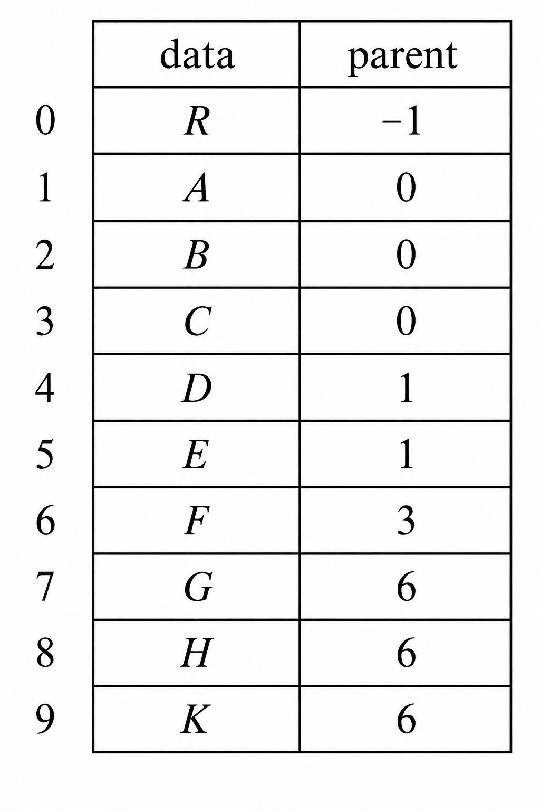
A. 这种存储结构用一组连续的空间来存储每个结点
B. 该树的结点共有4层
C. 该树共有5个叶结点
D. 该树转换为二叉树后共有8层

- 答案：C
- 解析：根据双亲域可还原树的层次关系：

  ```text
  R
  ├─ A
  │  ├─ D
  │  └─ E
  ├─ B
  └─ C
     └─ F
        ├─ G
        ├─ H
        └─ K
  ```

  - A 正确：双亲表示法通常用顺序表存放各结点，每个结点附加一个记录其双亲下标的域，因此结点存放在一组连续空间中。
  - B 正确：第 1 层为根结点 R，第 2 层为 A、B、C，第 3 层为 D、E、F，第 4 层为 G、H、K，共 4 层。
  - C 错误：叶结点为 B、D、E、G、H、K，共 6 个，而不是 5 个。
  - D 正确：转换为“左孩子—右兄弟”二叉树后，最长路径为

    ```text
    R → A → B → C → F → G → H → K
    ```

    共经过 8 个结点，因此转换后的二叉树共有 8 层。

<br>
<br>

2. **【竟成·模拟六-04】** 采用双亲表示法描述一棵树，则具有n个结点的树至少需要（）个指向双亲的指针。
A. n
B. n-2
C. n-1
D. 2n

- 答案：C
- 解析：一棵含有非空树中，除根结点外，每个结点都有且仅有一个双亲。因此，若共有 \(n\) 个结点，则需要记录双亲关系的非根结点共有

  \[
  n-1
  \]

  个，即至少需要 \(n-1\) 个指向双亲的指针，选择 C。根结点没有双亲，其双亲域可置为空或用特殊值表示，不形成有效的双亲指针。A 将根结点也计入了有效双亲指针；B 少计一个；D 则对应每个结点设置两个指针的情形，并非双亲表示法的最低需求。

##### 5.4.2 树、森林与二叉树的转换

<br>
<br>

1. **【王道·卷一-Q04】** 当有7个结点的树转换为二叉树后，总共可能有（  ）种不同的形态。<br>
A. 132
B. 154
C. 429
D. 无法确定

- 答案：A
- 解析：树转换成二叉树时采用“左孩子—右兄弟”表示法。由一棵树转换得到的二叉树，其根结点一定没有右孩子。因此，含 \(n\) 个结点的树的不同形态数，等于含 \(n-1\) 个结点的普通二叉树形态数，即第 \(n-1\) 个卡特兰数：

  \[
  C_{n-1}=\frac{1}{n}\binom{2n-2}{n-1}
  \]

  当 \(n=7\) 时，

  \[
  C_6=\frac{1}{7}\binom{12}{6}=132
  \]

  因此选择 A。429 是 \(C_7\)，对应 8 个结点的树或 7 个结点的普通二叉树形态数，不符合本题。

<br>
<br>

2. **【王道·卷三-Q05】** 设结点 \(x\) 是树 \(T\) 中的一个非根结点，树 \(T\) 的孩子从左往右计数，\(B\) 是 \(T\) 所对应的二叉树，在二叉树 \(B\) 中 \(x\) 是其双亲的右孩子，则下列说法中正确的是（  ）。<br>
A. 在树 \(T\) 中 \(x\) 是其双亲的第一个子女
B. 在树 \(T\) 中 \(x\) 一定有右兄弟
C. 在树 \(T\) 中 \(x\) 一定是叶结点
D. 在树 \(T\) 中 \(x\) 一定有左兄弟

- 答案：D
- 解析：在树与二叉树的“左孩子—右兄弟”转换中：

  - 二叉树中的左孩子指针，指向原树中该结点的第一个孩子；
  - 二叉树中的右孩子指针，指向原树中该结点的下一个右兄弟。

  题目指出 \(x\) 是其双亲的右孩子，这说明 \(x\) 在原树中是该二叉树双亲结点的右兄弟。因此，\(x\) 前面至少存在一个兄弟结点，即它一定有左兄弟，D 正确。

  A 错误：第一个孩子在转换后的二叉树中应表现为双亲的左孩子。B 错误：\(x\) 可能是最后一个兄弟，不一定还有右兄弟。C 错误：是否为叶结点取决于 \(x\) 是否有孩子，与其是不是某结点的右兄弟无关。

<br>
<br>

3. **【竟成·模拟七-04】** 设森林F中有3棵树，第一、第二、第三棵树的结点个数分别为M₁、M₂和M₃。将森林F转化成对应的二叉树T，若以第一棵树的根结点作为T的根结点，则T的根结点的右子树上的结点个数是（）。
A. M₁
B. M₂+M₂
C. M₃
D. M₂+M₃

- 答案：D
- 解析：森林转换为二叉树时，各棵树的根结点按兄弟关系依次通过右指针连接。第一棵树的根结点成为二叉树 \(T\) 的根，其右孩子是第二棵树的根；第二棵树根的右孩子又是第三棵树的根。

  因此，\(T\) 的根结点的右子树包含第二棵树和第三棵树转换后的全部结点，结点总数为

  \[
  M_2+M_3
  \]

  故选择 D。第一棵树除根外的结点位于 \(T\) 根结点的左子树中，不计入右子树。

#### 5.5 树与二叉树的应用

##### 5.5.1 哈夫曼树和哈夫曼编码

<br>
<br>

1. **【王道·卷一-Q05】** 在一次哈夫曼编码的过程中，若要求编码的长度小于或等于4，假设现已对两个字符编码为0和10，则最多还可对（  ）个字符进行编码。<br>
A. 3
B. 4
C. 5
D. 6

- 答案：B
- 解析：哈夫曼编码是前缀编码，任何字符的编码都不能是另一字符编码的前缀。已有编码 `0` 后，所有以 `0` 开头的编码均不能再使用；已有编码 `10` 后，`10` 的所有后继编码也不能再使用。

  剩余可用的编码空间均位于前缀 `11` 下。为使新增字符数最多，应将其扩展到允许的最大长度 4，可得到

  ```text
  1100、1101、1110、1111
  ```

  共 4 个编码，因此选择 B。也可用 Kraft 不等式说明：已有编码占用

  \[
  2^{-1}+2^{-2}=\frac{3}{4}
  \]

  剩余容量为 \(1/4\)。长度为 4 的每个编码占用 \(1/16\)，所以最多还能容纳

  \[
  \frac{1/4}{1/16}=4
  \]

  个字符。

<br>
<br>

2. **【王道·卷四-Q05】** 在度为 \(m\) 的哈夫曼树中，叶结点数为 \(n\)，则非叶结点数为（  ）。<br>
A. \(n - 1\)
B. \(\lfloor n / m\rfloor -1\)
C. \((n - 1) / (m - 1)\)
D. \((n - 1) / (m - 1) - 1\)

- 答案：C
- 解析：度为 \(m\) 的哈夫曼树是一棵严格的 \(m\) 叉树，每个非叶结点都有 \(m\) 个孩子。设非叶结点数为 \(I\)，叶结点数为 \(n\)。

  一方面，树的边数为结点总数减 1：

  \[
  E=I+n-1
  \]

  另一方面，每个非叶结点引出 \(m\) 条边，所以

  \[
  E=mI
  \]

  联立可得

  \[
  \begin{aligned}
  mI&=I+n-1\\
  (m-1)I&=n-1\\
  I&=\frac{n-1}{m-1}
  \end{aligned}
  \]

  因此选择 C。对于二叉哈夫曼树，令 \(m=2\)，便得到非叶结点数为 \(n-1\)。

<br>
<br>

3. **【王道·卷六-Q06】** 在下列关于哈夫曼树的说法中，正确的是（  ）。<br>
I. 哈夫曼树是排序二叉树 II. 哈夫曼树是完全二叉树
III. 哈夫曼树的叶结点数 = 非叶结点数 + 1
IV. 哈夫曼树上层结点的值一定大于或等于下层结点的值
A. III、IV
B. I、II、IV
C. III
D. I、II、IV

- 答案：A
- 解析：逐项判断如下。

  - I 错误：哈夫曼树的构造目标是使带权路径长度最小，不要求满足左子树关键字小于根、右子树关键字大于根，因此不是二叉排序树。
  - II 错误：哈夫曼树是严格二叉树，即非叶结点的度均为 2，但其形态不一定满足完全二叉树的层次排列要求。
  - III 正确：二叉哈夫曼树中不存在度为 1 的结点。由二叉树性质 \(n_0=n_2+1\)，可知叶结点数等于非叶结点数加 1。
  - IV 正确：哈夫曼树的非叶结点权值等于其两个孩子权值之和，因此双亲权值一定大于或等于任一孩子的权值。沿根到叶的方向，结点权值不会增大。

  所以正确的是 III、IV，选择 A。

<br>
<br>

4. **【竟成·模拟一-05】** 已知字符集{a,b,c,d,e}，若各字符出现的次数分别为5,3,13,12,9。进行哈夫曼编码时，生成的哈夫曼树采用顺序存储方式保存在数组R中，用-1表示结点不存在。哈夫曼树中左子树分支表示编码0，右子树分支表示编码1。数组R=[42,17,25,9,8,12,13,-1,-1,3,5]，则编码序列011011111000011010的译码结果为（）。
A. aacdca
B. aacdeab
C. bacbcba
D. bacedcb

- 答案：B
- 解析：数组 \(R\) 按完全二叉树的顺序存储规则表示哈夫曼树。由各结点权值可还原结构：

  ```text
                 42
              /      \
            17        25
           /  \      /  \
          9    8    12  13
              / \
             3   5
  ```

  根据字符频次 \(a=5\)、\(b=3\)、\(c=13\)、\(d=12\)、\(e=9\)，并规定左分支为 0、右分支为 1，可得编码：

  ```text
  e：00
  b：010
  a：011
  d：10
  c：11
  ```

  对编码串从左到右按前缀编码逐段译码：

  ```text
  011 | 011 | 11 | 10 | 00 | 011 | 010
   a  |  a  | c  | d  | e  |  a  |  b
  ```

  因此译码结果为 `aacdeab`，选择 B。其他选项均不能按照上述前缀编码完整分割并对应到给定字符序列。

<br>
<br>

5. **【竟成·模拟三-04】** 下列关于二叉哈夫曼树和哈夫曼编码的叙述中，正确的是（）。
A. 一个数据文件由8位固定长度的字符组成，字符集内所有的256个字符出现的频率大致相同，最高的频率低于最低频率的2倍，那么此时哈夫曼编码比8位固定长度编码更有效
B. 哈夫曼树中度为1的结点数等于度为2和度为0的结点数之差
C. 哈夫曼树的结点总数不能是偶数
D. 若从二叉树的任一点出发，到根结点的路径上所经结点的序列按其关键字有序，则该二叉树一定不是一棵哈夫曼树

- 答案：C
- 解析：二叉哈夫曼树是一棵严格二叉树，即每个非叶结点的度均为 2，不存在度为 1 的结点。设叶结点数为 \(n_0\)，度为 2 的结点数为 \(n_2\)，则

  \[
  n_0=n_2+1
  \]

  因而结点总数为

  \[
  \begin{aligned}
  n&=n_0+n_2\\
   &=(n_2+1)+n_2\\
   &=2n_2+1
  \end{aligned}
  \]

  结点总数一定为奇数，因此不可能是偶数，C 正确。

  - A 错误：字符数恰为 \(256=2^8\)，且各字符频率十分接近时，最优哈夫曼树通常接近满二叉树，各字符编码长度均为 8 左右，平均码长不一定小于固定的 8 位编码，不能断言哈夫曼编码更有效。
  - B 错误：任意二叉树均满足 \(n_0=n_2+1\)，所以 \(n_0-n_2=1\)。而二叉哈夫曼树中度为 1 的结点数为 0，并不等于 1。
  - D 错误：哈夫曼树的双亲权值等于两个孩子权值之和，因此从任一结点向根移动时，权值通常单调不减，路径上的权值序列完全可能有序，不能据此排除哈夫曼树。

<br>
<br>

6. **【竟成·模拟五-04】** 下列关于哈夫曼树的说法正确的是（）。
A. 一组权值构造的哈夫曼树可能不唯一，带权路径长度可能不唯一
B. 一组权值构造的哈夫曼树可能不唯一，高度唯一
C. 一组权值构造的哈夫曼树可能不唯一，高度可能不唯一
D. 一组权值构造的哈夫曼树唯一，高度唯一

- 答案：C
- 解析：当待合并权值中存在相同权值时，每次选择哪两个最小权值结点可能有多种方案；此外，左右子树也可以交换。因此，同一组权值对应的哈夫曼树形态可能不唯一。

  但所有合法构造所得哈夫曼树都具有最小带权路径长度，所以最小带权路径长度的数值是确定的，不会因为形态不同而改变。与此同时，不同的最优构造可能产生不同的树高，因此高度也可能不唯一。

  例如，对某些包含重复权值的集合，不同的同权结点合并顺序会改变叶结点在各层的分布，但仍保持相同的最小带权路径长度。故选择 C。A 错在带权路径长度的最优值是唯一确定的；B 错在高度不一定唯一；D 错在哈夫曼树形态不一定唯一。

##### 5.5.2 并查集

<br>
<br>

1. **【王道·卷七-Q06】** 在以下算法中，需要用到并查集的是（  ）。<br>
A. Floyd算法
B. Kruskal算法
C. Prim算法
D. Dijkstra算法

- 答案：B
- 解析：Kruskal 算法按照边权从小到大的顺序考察边。每次准备加入一条边 \((u,v)\) 时，需要迅速判断顶点 \(u\) 与 \(v\) 是否已经属于同一个连通分量：

  - 若属于同一集合，加入该边会形成环，应舍弃；
  - 若属于不同集合，可加入该边，并将两个集合合并。

  并查集恰好高效支持“查找所属集合”和“合并两个集合”两类操作，因此 Kruskal 算法通常使用并查集进行环路判断，选择 B。

  Floyd 算法使用动态规划求各顶点对最短路径；Prim 算法通过维护顶点到当前生成树的最小边权扩展生成树；Dijkstra 算法通过维护单源最短距离选择顶点，三者均不以并查集作为核心数据结构。

<br>
<br>

2. **【竟成·模拟一-06】** 并查集的秩指树的高度。并查集按“秩”优化指将秩较小的树合并到秩较大的树中，从而尽量保持树的平衡性。并查集按秩优化的Union函数C语言实现如下。在以下代码中，rank[x]指结点x的秩。若某个并查集有元素0~5，初始时各个元素的秩均为1，依次执行下列操作Union(0,1)，Union(2,3)，Union(1,3)，Union(3,4)后，元素4的根结点是（）。

```c
void Union(int x, int y) {
    x = find(x); y = find(y);
    if (x == y) return;
    if (rank[x] < rank[y]) {
        parent[x] = y;
    } else {
        parent[y] = x;
        if (rank[x] == rank[y]) {
            rank[x]++;
        }
    }
}
```
A. 0
B. 1
C. 3
D. 4

- 答案：A
- 解析：按照代码逐次执行合并操作。

  1. 执行 `Union(0,1)`：0 和 1 的秩均为 1，进入 `else` 分支，令 `parent[1]=0`，并将 `rank[0]` 增加为 2。此时集合为 \(\{0,1\}\)，根为 0。
  2. 执行 `Union(2,3)`：2 和 3 的秩均为 1，令 `parent[3]=2`，并将 `rank[2]` 增加为 2。此时集合为 \(\{2,3\}\)，根为 2。
  3. 执行 `Union(1,3)`：`find(1)=0`，`find(3)=2`。根 0 和根 2 的秩均为 2，因此令 `parent[2]=0`，并将 `rank[0]` 增加为 3。于是 \(\{0,1,2,3\}\) 的根为 0。
  4. 执行 `Union(3,4)`：`find(3)=0`，而 4 自成一棵秩为 1 的树。因为 \(rank[0]>rank[4]\)，令 `parent[4]=0`。

  因此元素 4 的根结点为 0，选择 A。

<br>
<br>

3. **【竟成·模拟二-04】** 下列关于并查集的说法正确的是（）。
A. 如果同时使用路径压缩算法和Union优化算法，在含有n个元素的并查集上进行m次查询和合并操作，其时间复杂度是 \(O(m\log_2 n)\)
B. 并查集不能处理是否存在环路的问题
C. 并查集可以用来验证树的边数加一等于结点数这个规律
D. 并查集可以用来计算两个结点间的最短路径长度

- 答案：C
- 解析：并查集可用于维护图中各顶点所属的连通分量。处理无向图的边时，若一条边的两个端点已经属于同一集合，则加入该边会形成环；若属于不同集合，则可合并两个集合。因此，并查集可以辅助判断图是否连通、是否存在环，并可据此验证树的相关性质：含 \(n\) 个结点的无环连通图恰有 \(n-1\) 条边，即边数加一等于结点数，C 正确。

  - A 错误：同时采用路径压缩和按秩合并后，\(m\) 次操作的总时间复杂度为 \(O(m\alpha(n))\)，其中 \(\alpha(n)\) 是增长极慢的反阿克曼函数，通常近似看作常数，而不是通常所说的 \(O(m\log_2 n)\)。
  - B 错误：并查集是检测无向图是否成环的常用工具。
  - D 错误：并查集只能判断两个结点是否处于同一连通分量，不能记录路径长度，不能直接求最短路径。

<br>
<br>

4. **【竟成·模拟三-09】** 在含有6个元素的并查集中，按序列{0,1},{0,2},{3,5},{4,3},{5,4}来进行查找合并的操作，最终形成的并查集内，（）这两个元素不在同一集合内。
A. {1,2}
B. {4,5}
C. {0,5}
D. {5,3}

- 答案：C
- 解析：依次合并各元素对：

  - 合并 \(\{0,1\}\) 后，0 和 1 属于同一集合；
  - 再合并 \(\{0,2\}\) 后，形成集合 \(\{0,1,2\}\)；
  - 合并 \(\{3,5\}\) 后，3 和 5 属于同一集合；
  - 再合并 \(\{4,3\}\) 后，形成集合 \(\{3,4,5\}\)；
  - 最后合并 \(\{5,4\}\) 时，两者已经处于同一集合，集合不再变化。

  最终共有两个集合：

  \[
  \{0,1,2\},\qquad \{3,4,5\}
  \]

  A 中 1、2 同属第一个集合；B 中 4、5 同属第二个集合；D 中 5、3 同属第二个集合；只有 C 中 0 和 5 分属不同集合，因此选择 C。

### 第6章 图

#### 6.1 图的基本概念

##### 6.1.1 图的定义

<br>
<br>

1. **【竟成·模拟三-06】** 下列关于图的叙述中，正确的是（）。
A. 若有向图G有两个不同的强连通分量C和C'，设顶点u,v∈C，顶点u',v'∈C'，若存在一条从u到u'的路径u→u'，则可能存在一条从v'到v的路径v'→v
B. 若在图G中加入一条新边，若该边的两个顶点都处于同一个连通分量，则可能会增加G的连通分量的个数
C. 若在图G中加入一条新边，若该边的两个顶点A和A'分别处于不同的连通分量，并且A和A'之间原先没有路径，则添加后可能会增加G的连通分量的个数
D. 若在有向图G中加入一条新边，若该边的两个顶点A和A'分别处于不同的强连通分量，并且A和A'之间原先有一条路径，则添加后可能会减少G的强连通分量的个数

- 答案：D
- 解析：将有向图的每个强连通分量缩成一个顶点后，所得分量图一定是有向无环图。若不同强连通分量 \(C_1\) 与 \(C_2\) 之间原来已经存在从 \(C_1\) 到 \(C_2\) 的路径，此时加入一条从 \(C_2\) 返回 \(C_1\) 的边，就会形成有向环，使路径上的若干强连通分量合并为一个更大的强连通分量，从而使强连通分量数减少。因此 D 正确。

  - A 错误：若已经存在从 \(C\) 到 \(C'\) 的路径，同时又存在从 \(C'\) 到 \(C\) 的路径，则两个分量中的顶点相互可达，\(C\) 与 \(C'\) 应属于同一强连通分量，与“不同分量”矛盾。
  - B 错误：在同一连通分量内部增加边，不会破坏原有连通关系，连通分量数不可能增加。
  - C 错误：在两个不同连通分量之间增加一条边，会将这两个分量连接起来，使连通分量数减少 1，而不是增加。

#### 6.2 图的存储及基本操作

##### 6.2.1 邻接矩阵法

<br>
<br>

1. **【王道·卷一-Q06】** 对有 \(n\) 个顶点的强连通图，若采用邻接矩阵存储，则其邻接矩阵中至少有（  ）个非零元素。<br>
A. \(n - 1\)
B. \(n\)
C. \(2n - 2\)
D. \(2n\)

- 答案：B
- 解析：强连通有向图要求任意两个顶点之间都相互可达。要使边数最少，可以让 \(n\) 个顶点构成一个有向环：

  \[
  v_1\to v_2\to\cdots\to v_n\to v_1
  \]

  该图仅有 \(n\) 条有向边，但从任意顶点沿环均可到达其他所有顶点，因此是强连通图。

  另一方面，强连通图中每个顶点的出度至少为 1，否则该顶点无法到达其他顶点，所以总边数至少为 \(n\)。邻接矩阵中每条有向边对应一个非零元素，因此至少有 \(n\) 个非零元素，选择 B。

<br>
<br>

2. **【王道·卷二-Q06】** 有向图的邻接矩阵 \(A\) 如下所示，在下列说法中，错误的是（  ）。<br>

\[
A=\begin{bmatrix}
0&1&0&0&0\\
0&0&0&1&0\\
0&0&0&1&0\\
0&0&0&0&1\\
1&0&0&0&0
\end{bmatrix}
\]

I. 图中没有环
II. 该图的强连通分量的数量为2
III. 拓扑序列存在
A. I
B. I、III
C. II、III
D. I、II、III

- 答案：B
- 解析：由邻接矩阵可读出有向边：

  \[
  1\to2,\quad 2\to4,\quad 3\to4,\quad 4\to5,\quad 5\to1
  \]

  其中存在有向环

  \[
  1\to2\to4\to5\to1
  \]

  因此 I“图中没有环”错误。由于存在有向环，该图不是有向无环图，所以不存在拓扑序列，III 错误。

  顶点 1、2、4、5 之间相互可达，构成一个强连通分量；顶点 3 可以到达该分量，但该分量中的顶点无法返回 3，因此顶点 3 单独构成另一个强连通分量。强连通分量总数为 2，II 正确。

  综上，错误的是 I、III，选择 B。

<br>
<br>

3. **【王道·卷四-Q06】** 对于有向图，其邻接矩阵表示相比邻接表表示更容易进行的操作是（  ）。<br>
A. 求一个顶点指向的邻接点
B. 求一个顶点的度
C. 深度优先遍历
D. 广度优先遍历

- 答案：B
- 解析：有向图采用邻接矩阵存储时，顶点 \(v_i\) 的出度等于第 \(i\) 行非零元素的个数，入度等于第 \(i\) 列非零元素的个数，因此扫描一行和一列即可求得该顶点的度，时间复杂度为 \(O(n)\)。

  若采用普通邻接表，某顶点的出度可由其边链表直接求得，但求入度需要扫描所有顶点的边链表，时间复杂度为 \(O(n+e)\)。因此，对于求有向图中一个顶点的总度，邻接矩阵更直接，选择 B。

  A 错误：邻接表可直接沿该顶点的边链表访问所有出邻接点，通常比扫描邻接矩阵的一整行更高效。C、D 错误：对稀疏图进行深度优先遍历和广度优先遍历时，邻接表的时间复杂度为 \(O(n+e)\)，通常优于邻接矩阵的 \(O(n^2)\)。

##### 6.2.2 邻接表法

<br>
<br>

1. **【王道·卷三-Q07】** 已知一个有向图的邻接表存储结构如右图所示，根据有向图的深度优先遍历算法，从顶点1出发，所得到的顶点序列是（  ）。<br>
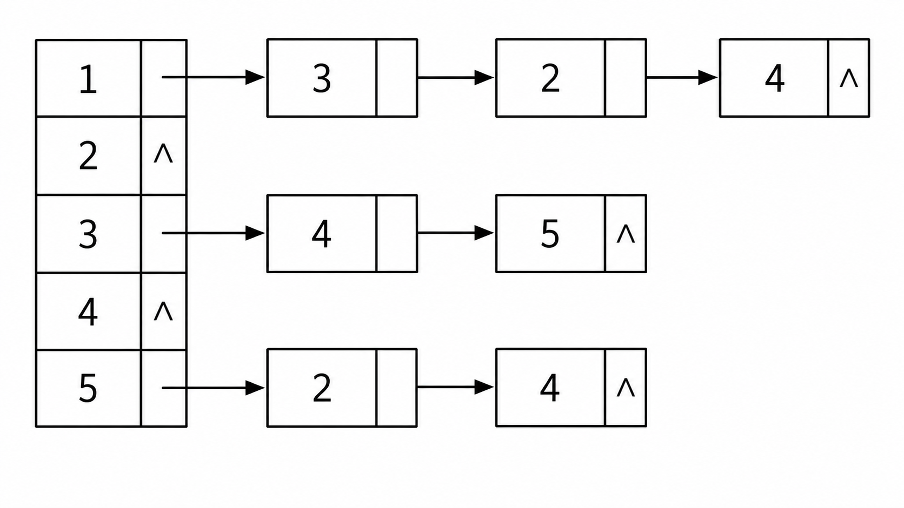
A. 1,2,3,5,4
B. 1,2,3,4,5
C. 1,3,4,5,2
D. 1,4,3,5,2

- 答案：C
- 解析：按图中各顶点邻接链表的先后次序进行深度优先遍历。

  顶点 1 的邻接点依次为 3、2、4，因此从 1 首先访问 3；顶点 3 的邻接点依次为 4、5，所以接着访问 4。顶点 4 没有未访问的邻接点，回溯到 3，再访问 5；顶点 5 的邻接点依次为 2、4，其中 4 已访问，因此访问 2。顶点 2 没有邻接点，随后逐层回溯，剩余邻接点均已访问。

  因此遍历序列为：

  \[
  1,3,4,5,2
  \]

  选择 C。深度优先遍历的具体序列不仅取决于图的结构，还取决于邻接表中邻接点的排列顺序。

<br>
<br>

2. **【竟成·模拟五-07】** 下列关于邻接表和邻接矩阵的叙述中，正确的是（）。
I. 若邻接表中有奇数个边结点，则对应的图一定是有奇数个结点
II. 若邻接表中有奇数个边结点，则对应的图一定是无向图
III. 拥有拓扑序列的图的邻接矩阵必然是一个三角矩阵
IV. 设有向图有n个顶点和e条边，那么由邻接表求一个顶点的入度的算法的时间复杂度是 \(O(n+e)\)
A. 若邻接表中有奇数个边结点，则对应的图一定是有奇数个结点
B. 若邻接表中有奇数个边结点，则对应的图一定是无向图
C. 拥有拓扑序列的图的邻接矩阵必然是一个三角矩阵
D. 设有向图有n个顶点和e条边，那么由邻接表求一个顶点的入度的算法的时间复杂度是 \(O(n+e)\)

- 答案：D
- 解析：在有向图的普通邻接表中，每条有向边只对应一个边结点。要计算某个顶点的入度，需要扫描所有顶点的邻接链表，统计该顶点作为弧头出现的次数。扫描顶点表与全部边结点的时间复杂度为：

  \[
  O(n+e)
  \]

  因此 IV 正确，选择 D。

  - I 错误：邻接表中边结点数的奇偶性与顶点数的奇偶性没有必然关系。
  - II 错误：无向图的每条边通常在两个端点的邻接链表中各出现一次，因此边结点总数为 \(2e\)，一定是偶数。边结点数为奇数时反而不可能是按常规邻接表存储的无向图。
  - III 错误：有拓扑序列只能说明该图是有向无环图。仅当按照某个拓扑序列重新排列顶点编号后，其邻接矩阵才可化为上三角矩阵；在原有任意编号下不一定是三角矩阵。

<br>
<br>

3. **【竟成·模拟六-05】** 下列关于邻接表和邻接矩阵的叙述中，错误的是（）。
A. 求有向图的结点的入度必须遍历整个邻接表
B. 在有向图的邻接表中，某个顶点v在链表中出现的次数等于该顶点的入度
C. 若邻接矩阵中的主对角线以下的元素为0，则该图必定存在一个拓扑排序序列
D. 因为有向无环图具有拓扑序列，所以它的邻接矩阵必定是上三角矩阵或下三角矩阵

- 答案：D
- 解析：有向无环图一定存在拓扑序列，但其邻接矩阵是否呈三角形取决于顶点的编号顺序。只有将各顶点按照某个拓扑序列重新编号后，所有边才都由序列中较前的顶点指向较后的顶点，此时邻接矩阵可成为上三角矩阵。因此，不能由“存在拓扑序列”直接推出原邻接矩阵必为上三角或下三角矩阵，D 错误。

  - A 正确：在未额外保存入度的普通邻接表中，求某顶点入度需要扫描所有边结点。
  - B 正确：顶点 \(v\) 每作为某条弧的弧头出现一次，其入度就增加 1，所以它在各邻接链表边结点中出现的次数等于其入度。
  - C 正确：若主对角线以下全为 0，则边只能由编号较小的顶点指向编号较大的顶点，不可能沿有向边回到编号更小的顶点，因而不存在有向环，编号从小到大就是一个拓扑序列。

#### 6.3 图的遍历

##### 6.3.1 广度优先搜索

<br>
<br>

1. **【王道·卷八-Q06】** 如右图所示，若从顶点 \(A\) 出发进行遍历，则下列序列中既不是深度优先遍历又不是广度优先遍历的序列为（  ）。<br>
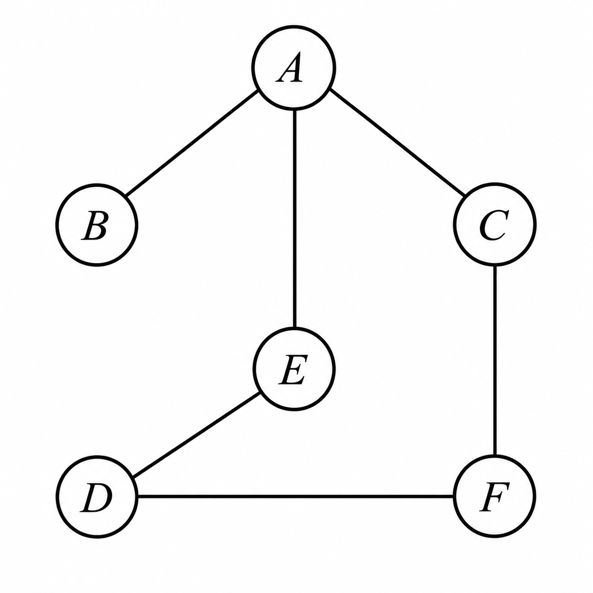
A. \(A,B,C,E,F,D\)
B. \(A,B,E,C,D,F\)
C. \(A,E,D,F,C,B\)
D. \(A,E,D,C,B,F\)

- 答案：D
- 解析：由图可知，顶点 \(A\) 的直接邻接点为 \(B,C,E\)，其他主要边为 \(C-F\)、\(E-D\)、\(E-F\)、\(D-F\)。

  对广度优先遍历而言，从 \(A\) 出发后必须先访问距离 \(A\) 为 1 的三个顶点 \(B,C,E\)，之后才能访问距离为 2 的 \(D,F\)。因此 A、B 都可通过选择不同的邻接点扫描次序得到；D 在尚未访问 \(B,C\) 时就访问了 \(D\)，不可能是 BFS 序列。

  对深度优先遍历而言，C 可沿路径

  \[
  A\to E\to D\to F\to C
  \]

  深入访问，再回溯访问 \(B\)，所以 C 可以是 DFS 序列。对于 D，访问到 \(A,E,D\) 后，顶点 \(D\) 尚有未访问邻接点 \(F\)，深度优先遍历必须先访问 \(F\)，不可能直接回到 \(A\) 再访问 \(C\)。

  因此 D 既不是 DFS 序列，也不是 BFS 序列。

<br>
<br>

2. **【王道·卷八-Q07】** 在下列关于连通图的BFS和DFS生成树的高度的说法中，正确的是（  ）。<br>
A. BFS生成树的高度小于DFS生成树的高度
B. BFS生成树的高度小于或等于DFS生成树的高度
C. BFS生成树的高度大于DFS生成树的高度
D. BFS生成树的高度大于或等于DFS生成树的高度

- 答案：B
- 解析：从同一个根顶点出发，BFS 按照到根的最短路径长度逐层访问顶点，因此在 BFS 生成树中，每个顶点的深度都等于它在原图中到根顶点的最短距离。于是 BFS 生成树的高度是以该根为起点的最大最短距离，是所有以该顶点为根的生成树所能达到的最小高度。

  DFS 会沿一条路径尽可能深入，其生成树中某些顶点到根的树路径可能不是原图中的最短路径，所以 DFS 生成树的高度不会小于 BFS 生成树的高度，即：

  \[
  h_{\mathrm{BFS}}\le h_{\mathrm{DFS}}
  \]

  两者可能相等，例如原图本身就是一条链或某些树形结构；因此不能使用严格小于，选择 B。

##### 6.3.3 图的遍历与图的连通性

<br>
<br>

1. **【王道·卷一-Q07】** 下列关于有向图 \(G\) 的强连通分量特性的叙述中，正确的是（  ）。<br>
A. 假设图 \(G\) 中有两个不同的强连通分量 \(C\) 和 \(C^{\prime}\)，顶点 \(\{u,v\} \in C\)，顶点 \(\{u^{\prime},v^{\prime}\} \in C^{\prime}\)，若存在一条从 \(u\) 到 \(u^{\prime}\) 的路径，则可能存在一条从 \(v^{\prime}\) 到 \(v\) 的路径
B. 在图 \(G\) 中加入一条新的有向边，若该边的两个顶点都处于同一个强连通分量中，则可能会增加图 \(G\) 的强连通分量数量
C. 在图 \(G\) 中加入一条新的有向边，若该边的两个顶点 \(A\) 和 \(A^{\prime}\) 分别处于不同的强连通分量中，且 \(A\) 和 \(A^{\prime}\) 之间原先没有路径，则添加后可能会增加图 \(G\) 的强连通分量数量
D. 在图 \(G\) 中加入一条新的有向边，若该边的两个顶点 \(A\) 和 \(A^{\prime}\) 分别处于不同的强连通分量中，且 \(A\) 和 \(A^{\prime}\) 之间原先有一条路径，则添加后可能会减少图 \(G\) 的强连通分量数量

- 答案：D
- 解析：将每个强连通分量缩成一个顶点后，得到的分量图一定是有向无环图。若不同强连通分量之间原来已有一条从 \(A\) 所在分量到 \(A'\) 所在分量的路径，再加入一条反向返回边，就可能形成有向环，使环上的多个强连通分量合并，从而减少强连通分量的数量。因此 D 正确。

  - A 错误：若从 \(C\) 可达 \(C'\)，同时从 \(C'\) 又可达 \(C\)，则两分量中的任意顶点都相互可达，它们本应属于同一个强连通分量。
  - B 错误：在同一强连通分量内部加边不会破坏原有的相互可达关系，强连通分量数不会增加。
  - C 错误：增加有向边只能增加可达关系，不可能把已有强连通分量拆开，因此强连通分量数不可能增加。

<br>
<br>

2. **【王道·卷三-Q06】** 若 \(G\) 是一个有36条边的非连通简单无向图，则图 \(G\) 的顶点数至少是（  ）。<br>
A. 11
B. 10
C. 9
D. 8

- 答案：B
- 解析：要在顶点数固定且图保持非连通的条件下容纳尽可能多的边，应让其中 \(n-1\) 个顶点构成完全图，剩余 1 个顶点孤立。此时非连通简单无向图的最大边数为：

  \[
  \binom{n-1}{2}=\frac{(n-1)(n-2)}{2}
  \]

  题目要求边数至少能达到 36，因此：

  \[
  \frac{(n-1)(n-2)}{2}\ge 36
  \]

  当 \(n=9\) 时，最大边数为

  \[
  \binom{8}{2}=28<36
  \]

  当 \(n=10\) 时，可由 9 个顶点构成完全图 \(K_9\)，另有 1 个孤立顶点，边数恰为

  \[
  \binom{9}{2}=36
  \]

  因此顶点数至少为 10，选择 B。

<br>
<br>

3. **【王道·卷六-Q07】** 在下列几种算法中，（  ）可以用于求无向图的连通分量。<br>
A. 广度优先遍历
B. 拓扑排序
C. 求最短路径
D. 求关键路径

- 答案：A
- 解析：对无向图中任意一个尚未访问的顶点执行一次 BFS，可以访问到与该顶点连通的全部顶点，这些顶点恰好组成一个连通分量。随后继续从另一个未访问顶点启动 BFS，每启动一次就得到一个新的连通分量，直到所有顶点均被访问。

  因此，遍历整个图时 BFS 的启动次数就是连通分量数，选择 A。DFS 同样可以完成该任务，但不在选项中。拓扑排序和关键路径只适用于有向无环图；最短路径算法的主要目标是计算距离，并非求连通分量的标准方法。

<br>
<br>

4. **【竟成·模拟七-07】** 下列关于图的说法错误的是（）。
A. 强连通的有向图的任何顶点到其他所有顶点都有弧
B. 有向完全图一定是强连通有向图
C. DFS生成树的高度一般不小于BFS生成树的高度
D. 当各边上的权值相同时，BFS算法可用来解决单源最短路径问题

- 答案：A
- 解析：强连通只要求任意两个顶点之间都存在有向路径，并不要求任意两个不同顶点之间都有直接的弧。例如，一个由所有顶点组成的有向环就是强连通图，但每个顶点通常只直接指向下一个顶点。因此 A 错误。

  - B 正确：有向完全图中任意两个不同顶点之间都存在双向弧，显然任意两点相互可达，因此一定强连通。
  - C 正确：BFS 生成树按最短距离分层，其高度是以起点为根的生成树可能达到的最小高度；DFS 生成树高度一般不小于它。
  - D 正确：当所有边权相等时，路径总权值与经过的边数成正比，BFS 按边数由少到多访问顶点，可以求单源最短路径。

#### 6.4 图的应用

##### 6.4.1 最小生成树

<br>
<br>

1. **【王道·卷五-Q06】** 使用Kruskal算法求解最小生成树时，为了设计高效的算法，数据结构方面可以（  ）。<br>
A. 利用最小堆存储边
B. 利用栈存储结点
C. 利用二维数组存储结点
D. 利用并查集存储边

- 答案：A
- 解析：Kruskal 算法需要反复从尚未处理的边中选择权值最小的边。若用最小堆存储全部边，则每次可在 \(O(\log e)\) 时间内删除并取得当前最小边，从而高效完成按边权递增的处理过程，因此 A 正确。

  Kruskal 算法还常用并查集判断一条候选边的两个端点是否已处于同一连通分量，但并查集存储和维护的是顶点所属的集合，而不是“存储边”，所以 D 的表述错误。栈和二维数组都不能高效支持反复取得最小权边这一核心操作。

<br>
<br>

2. **【王道·卷五-Q07】** 相比邻接矩阵，下列算法使用邻接表效率更高的是（  ）。<br>
I. 拓扑排序 II. 广度优先搜索 III. 深度优先搜索 IV. 普里姆算法
A. II、III
B. I、II
C. I、II、III、IV
D. II

- 答案：C
- 解析：邻接矩阵无论图中实际有多少条边，通常都需要按顶点数规模扫描矩阵；邻接表只保存实际存在的边，在稀疏图中可以避免大量无效检查。

  - 拓扑排序：采用邻接表时，每个顶点和每条边至多处理一次，时间复杂度为 \(O(n+e)\)；采用邻接矩阵时通常为 \(O(n^2)\)。
  - 广度优先搜索与深度优先搜索：邻接表的时间复杂度均为 \(O(n+e)\)，邻接矩阵为 \(O(n^2)\)。
  - Prim 算法：邻接矩阵的常见实现为 \(O(n^2)\)；邻接表结合最小堆时可达到 \(O(e\log n)\)，对稀疏图通常更高效。

  因此 I、II、III、IV 均符合，选择 C。需要注意，若图非常稠密，邻接矩阵实现的 Prim 算法也可能具有较好的实际效率，但题目比较的是邻接表在适用场景中的效率优势。

<br>
<br>

3. **【竟成·模拟一-07】** 对下图(a)使用Prim算法求最小生成树，对下图(b)使用Kruskal算法求最小生成树。若分别以结点a和结点f作为所得最小生成树的根结点，则这两个最小生成树（忽略权值）构成的森林对应的二叉树不可能是（）。
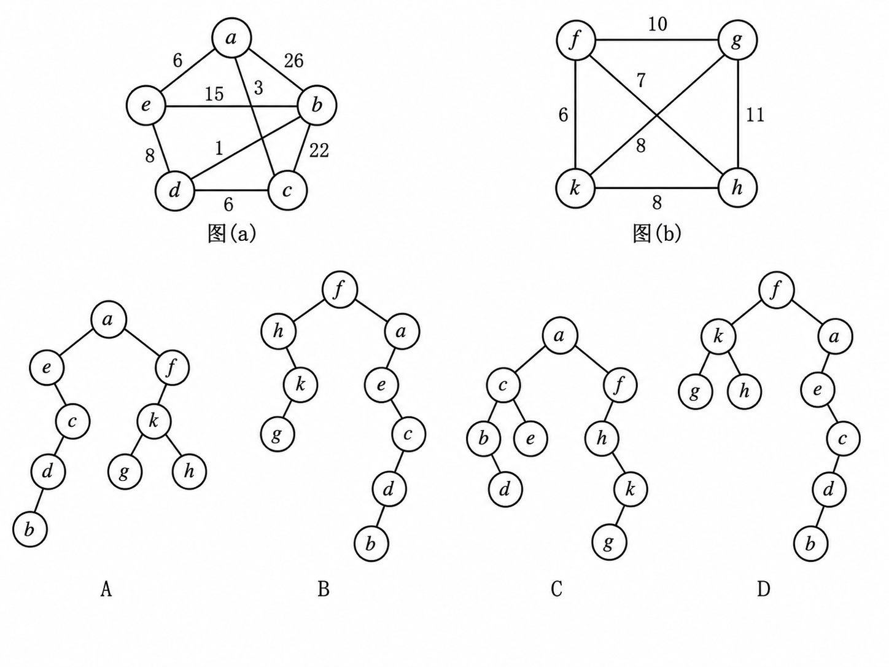

- 答案：C
- 解析：先分别求两幅图的最小生成树。

  对图 (a) 从结点 \(a\) 开始执行 Prim 算法，可选出的边为：

  \[
  (a,c),(a,e),(c,d),(d,b)
  \]

  对应的根树以 \(a\) 为根，其结构为：\(a\) 的孩子是 \(c,e\)，\(c\) 的孩子是 \(d\)，\(d\) 的孩子是 \(b\)。其中孩子之间的先后次序可以互换，但父子关系不能改变。

  对图 (b) 执行 Kruskal 算法，按边权从小到大选边：先选 \((f,k)\)，再选 \((f,h)\)，权值为 8 的 \((k,h)\) 会形成环而舍弃，随后选 \((k,g)\)。因此最小生成树的边为：

  \[
  (f,k),(f,h),(k,g)
  \]

  以 \(f\) 为根时，\(f\) 的孩子是 \(k,h\)，\(k\) 的孩子是 \(g\)。

  将森林转换为二叉树时采用“左孩子—右兄弟”规则：左指针指向第一个孩子，右指针指向下一个兄弟。A、B、D 均可通过调整森林中树的排列次序及同层孩子次序得到。C 所对应的第一棵根树中，结点 \(c\) 的孩子关系被表示成含有 \(b,d\)，与图 (a) 的最小生成树中 \(c\to d\to b\) 的父子链不一致，因此不可能得到 C。

<br>
<br>

4. **【竟成·模拟二-05】** 下列关于最小生成树的叙述中，错误的是（）。
I. 无向连通图中任何一个边数最少且连通所有顶点的子图都是该图的生成树
II. 不同的求最小生成树的方式得到的结果都是相同的
III. 在图G的最小生成树G'中，某条边的权值有可能会大于某条未入选边的权值
IV. 生成树就是最小生成树
A. IV
B. II、III、IV
C. II、IV
D. II

- 答案：C
- 解析：逐项判断如下。

  - I 正确。含有 \(n\) 个顶点的无向连通图中，连通全部顶点所需的最少边数为 \(n-1\)。边数为 \(n-1\) 且连通的生成子图不含环，因此就是生成树。
  - II 错误。当图中存在相同权值的边时，最小生成树可能不唯一，不同算法或不同的选边次序可能得到结构不同但总权值相同的最小生成树。
  - III 正确。某条未入选边只需在其对应环或割中不优于相关替代边，并不要求它大于最小生成树中的每一条边。因此，最小生成树中某条必选的较大权值边，完全可能大于另一处某条未入选的较小权值边。
  - IV 错误。生成树只要求连通所有顶点且无环；最小生成树还要求所有生成树中边权总和最小。

  因此错误的是 II、IV，选择 C。

<br>
<br>

5. **【竟成·模拟七-08】** 下列关于最小生成树的叙述中，错误的是（）。
A. 设(u,v)是连通图G中的权重最小的边，那么(u,v)是G的某棵最小生成树中的一条边
B. 设e是连通图G=(V,E)的某条环路上权重最大的边，那么图G中存在一棵不包含边e的最小生成树
C. 若图的所有边的权重有正有负，则任一连接所有结点且总权重最小的一个边集合必然形成一棵树
D. 若T是图G的一棵最小生成树，如果减小了T中的一条边的权重，那么T仍然是G的一棵最小生成树

- 答案：C
- 解析：C 错误。若允许在“连接所有结点的边集合”中保留环，而图中又存在负权边，则在已经连通的基础上继续加入某些负权边，可能使总权值进一步减小。此时总权值最小的连通边集合可能包含环，不一定是一棵树。最小生成树的定义本身要求选出的子图是树，而不能简单地将“任意最小权连通边集”等同于最小生成树。

  - A 正确。取包含该最小权边的一个割，根据割性质，该边可出现在某棵最小生成树中；若存在并列最小边，也至少能构造一棵包含它的最小生成树。
  - B 正确。根据环性质，环上权重最大的边可以从某棵最小生成树中排除；若最大权边不唯一，则至少存在一棵最小生成树不含指定的这条最大权边。
  - D 正确。设原最小生成树为 \(T\)，降低 \(T\) 中一条边的权值只会使 \(T\) 的总权值下降。任何其他生成树若也含该边，则下降量相同；若不含该边，则权值不变。因此不会出现其他生成树反而比 \(T\) 更优的情况。

##### 6.4.2 最短路径

<br>
<br>

1. **【王道·卷四-Q07】** Dijkstra算法（  ）求图中从某顶点到其余顶点的最短路径。<br>
A. 按长度递减的顺序
B. 按长度递增的顺序
C. 通过深度优先遍历
D. 通过广度优先遍历

- 答案：B
- 解析：Dijkstra 算法维护源点到各顶点的当前最短距离估计值。每一轮从尚未确定最短距离的顶点中，选择距离源点最近的顶点，将其最短距离正式确定，再利用该顶点对其他顶点进行松弛。

  因此，各顶点的最短路径长度是按照非递减顺序依次确定的，即按长度递增的顺序求出，选择 B。Dijkstra 算法并不是简单的 DFS 或 BFS；只有在所有边权相同时，BFS 才能直接求单源最短路径。

<br>
<br>

2. **【竟成·模拟二-06】** 下列关于最短路径的叙述中，错误的是（）。
I. 在Floyd算法求解各顶点间的最短路径时，每个表示两点间路径的pathᵏ⁻¹[i,j]的非无穷元素的集合一定是pathᵏ[i,j]的非无穷元素集合的子集
II. Floyd算法不能处理有负权回路的图
III. Floyd算法不能处理负权图
A. II、III
B. I、III
C. I、II、III
D. I、II

- 答案：B
- 解析：I、III 错误，II 正确。

  - I 错误。Floyd 算法在允许新增中间顶点 \(k\) 后，原来的最短路径可能被一条完全不同的新路径替代。新路径上的顶点或边集合不必包含旧路径上的顶点或边集合，因此具体最短路径集合并不存在必然的包含关系。应注意，若讨论的是距离矩阵，则 \(dist^{(k)}[i][j]\) 不会大于 \(dist^{(k-1)}[i][j]\)；但这不等于两条具体路径的组成元素具有子集关系。
  - II 正确。存在可达负权回路时，可以反复经过该回路使路径长度无限减小，有限的最短路径不再存在，因此 Floyd 算法不能给出正常的最短路径结果。实际可通过最终出现 \(dist[i][i]<0\) 来检测负权回路。
  - III 错误。Floyd 算法可以处理含负权边的图，只要不存在负权回路。

  因此错误的是 I、III，选择 B。

<br>
<br>

3. **【竟成·模拟三-07】** 用Floyd算法求下图的最短路径，得到的dist矩阵结果是（）。
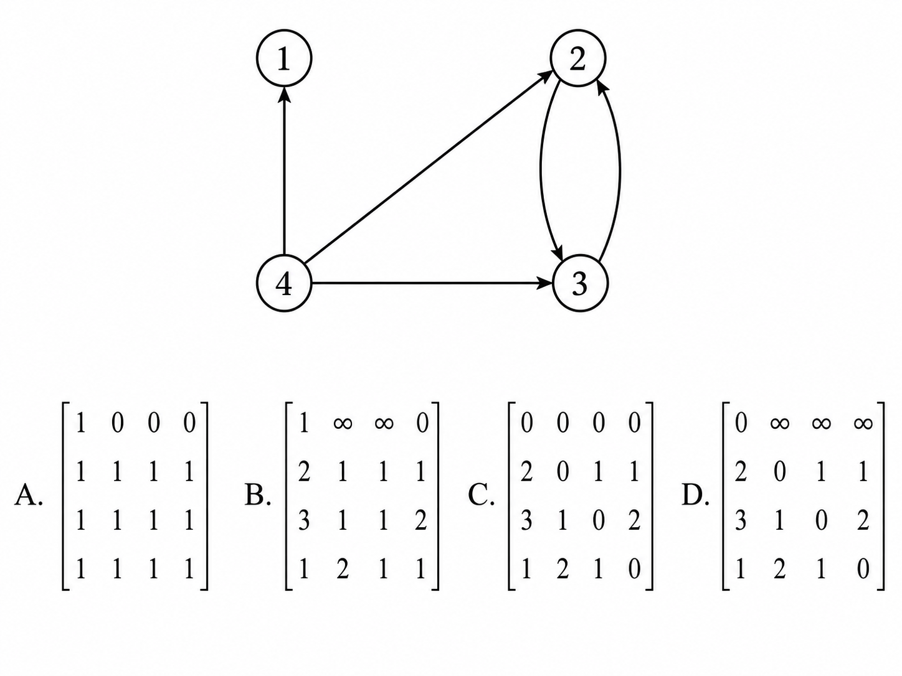

- 答案：D
- 解析：图中各有向边的权值均为 1，可读出有向边：

  \[
  4\to1,\quad 2\to4,\quad 2\to3,\quad 3\to2,\quad 4\to3
  \]

  分别计算各顶点到其他顶点的最短距离：

  - 从 1 出发不能到达其他顶点，因此第一行为 \((0,\infty,\infty,\infty)\)。
  - 从 2 出发：\(2\to4\to1\) 长度为 2，\(2\to3\) 长度为 1，\(2\to4\) 长度为 1。
  - 从 3 出发：\(3\to2\to4\to1\) 长度为 3，\(3\to2\) 长度为 1，\(3\to2\to4\) 长度为 2。
  - 从 4 出发：\(4\to1\) 长度为 1，\(4\to3\to2\) 长度为 2，\(4\to3\) 长度为 1。

  因此最终距离矩阵为：

  \[
  \begin{bmatrix}
  0 & \infty & \infty & \infty\\
  2 & 0 & 1 & 1\\
  3 & 1 & 0 & 2\\
  1 & 2 & 1 & 0
  \end{bmatrix}
  \]

  与选项 D 相同。

##### 6.4.4 拓扑排序

<br>
<br>

1. **【竟成·模拟四-06】** 下列有关拓扑排序的说法，正确的是（）。
I. 不是所有的AOV图都只有一个拓扑排序。
II. 若一个有向图无环，则它一定有唯一的拓扑序列。
III. 在拓扑序列中，任意两个相继结点Vᵢ和Vⱼ都存在从Vᵢ到Vⱼ的路径。
IV. 即使有向无环图拓扑序列唯一，也不能唯一确定该图。
A. I、II、IV
B. I、III、IV
C. I、II、III、IV
D. I、IV

- 答案：D
- 解析：逐项判断如下。

  - I 正确。一个 AOV 网可能同时存在多个入度为 0 的顶点，选择它们的先后次序不同，就可能得到多个拓扑序列。
  - II 错误。有向无环图一定存在拓扑序列，但不一定唯一。
  - III 错误。拓扑序列中相邻的两个顶点只表示它们在该线性序列中的位置相邻，不保证二者之间存在边或路径。
  - IV 正确。即使拓扑序列唯一，也只能确定所有顶点必须满足的先后关系，不能确定图中究竟存在多少条边。例如，在保持同一唯一拓扑次序的前提下，可以增加某些不改变偏序关系的传递边，得到不同的有向无环图。

  因此正确的是 I、IV，选择 D。

<br>
<br>

2. **【竟成·模拟五-06】** 下列关于拓扑排序的叙述正确的是（）。
A. 一个有向无环图的拓扑序列一定是唯一的
B. 有向连通图G拓扑序列中，若顶点Vᵢ在顶点Vⱼ之前，则存在弧<Vᵢ,Vⱼ>
C. 有向连通图G拓扑序列中，若顶点Vᵢ在顶点Vⱼ之前，则不存在Vᵢ到Vⱼ的路径
D. 有向连通图G拓扑序列中，若顶点Vᵢ在顶点Vⱼ之前，则不存在Vⱼ到Vᵢ的路径

- 答案：D
- 解析：在一个合法的拓扑序列中，若存在从 \(V_j\) 到 \(V_i\) 的路径，则路径上的每一条边都要求 \(V_j\) 排在 \(V_i\) 之前，这与题设中 \(V_i\) 排在 \(V_j\) 之前矛盾。因此不存在从 \(V_j\) 到 \(V_i\) 的路径，D 正确。

  - A 错误。有向无环图的拓扑序列可能有多个。
  - B 错误。\(V_i\) 排在 \(V_j\) 之前并不意味着二者之间一定有直接弧。
  - C 错误。\(V_i\) 排在 \(V_j\) 之前时，可能存在从 \(V_i\) 到 \(V_j\) 的路径，也可能不存在；拓扑序列只禁止逆向路径。

<br>
<br>

3. **【竟成·模拟七-09】** 给定如下图所示的有向图，该图的拓扑排序有序序列的个数是（）。
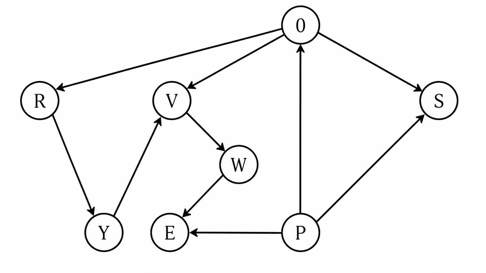
A. 5
B. 6
C. 7
D. 8

- 答案：B
- 解析：由图可读出主要先后约束：

  \[
  P\to0,\quad P\to E,\quad P\to S,
  \]

  \[
  0\to R,\quad 0\to V,\quad 0\to S,
  \]

  \[
  R\to Y,\quad Y\to V,\quad V\to W,\quad W\to E
  \]

  因为 \(P\) 是唯一的初始入度为 0 的顶点，所以第一个顶点只能是 \(P\)；随后只有顶点 0 的入度变为 0，因此第二个顶点只能是 0。此后形成固定链：

  \[
  R\to Y\to V\to W\to E
  \]

  顶点 \(S\) 在 \(P\) 和 0 均已出现后即可插入该链的任意位置。链中共有 5 个顶点，因此 \(S\) 可放在链前、任意两个相邻顶点之间或链后，共有：

  \[
  5+1=6
  \]

  个位置。因此拓扑序列共有 6 个，选择 B。

##### 6.4.5 关键路径

<br>
<br>

1. **【王道·卷二-Q07】** 在下面的AOE网中，时间余量最大的活动的时间余量是（  ）。<br>
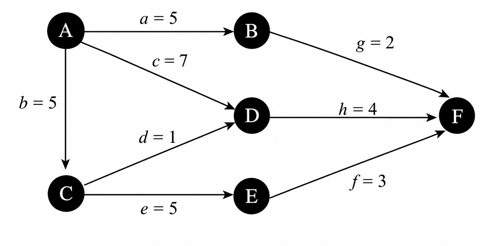
A. 5
B. 6
C. 3
D. 4

- 答案：B
- 解析：先计算各事件的最早发生时间和最迟发生时间。

  设源点事件为 A，汇点事件为 F。按拓扑顺序计算最早发生时间：

  \[
  \begin{aligned}
  ve(A)&=0,\\
  ve(B)&=0+5=5,\\
  ve(C)&=0+5=5,\\
  ve(D)&=\max\{0+7,\,5+1\}=7,\\
  ve(E)&=5+5=10,\\
  ve(F)&=\max\{5+2,\,7+4,\,10+3\}=13.
  \end{aligned}
  \]

  再逆拓扑计算各事件的最迟发生时间：

  \[
  \begin{aligned}
  vl(F)&=13,\\
  vl(B)&=13-2=11,\\
  vl(D)&=13-4=9,\\
  vl(E)&=13-3=10,\\
  vl(C)&=\min\{9-1,\,10-5\}=5,\\
  vl(A)&=\min\{11-5,\,5-5,\,9-7\}=0.
  \end{aligned}
  \]

  活动 \(\langle u,v\rangle\) 的时间余量为：

  \[
  d=vl(v)-w(u,v)-ve(u)
  \]

  各活动的时间余量分别为：

  | 活动         |      时间余量 |
  | ------------ | ------------: |
  | \(a:A\to B\) |  \(11-5-0=6\) |
  | \(b:A\to C\) |   \(5-5-0=0\) |
  | \(c:A\to D\) |   \(9-7-0=2\) |
  | \(d:C\to D\) |   \(9-1-5=3\) |
  | \(e:C\to E\) |  \(10-5-5=0\) |
  | \(f:E\to F\) | \(13-3-10=0\) |
  | \(g:B\to F\) |  \(13-2-5=6\) |
  | \(h:D\to F\) |  \(13-4-7=2\) |

  最大时间余量为 \(6\)，故选 B。

<br>
<br>

2. **【竟成·模拟四-09】** 下列关于关键路径的叙述中，正确的是（）。
I. 在AOE网中，关键路径上某个活动的时间缩短，整个工程的时间也必定缩短
II. 在AOE网中，关键路径上活动的时间延长多少，整个工程的时间也就延长多少
III. 缩短非关键路径上的活动的时间可能会影响工程的总体时间
A. I、II、III
B. II、III
C. III
D. II

- 答案：D
- 解析：逐项判断如下。

  - I 错误。若 AOE 网中存在多条关键路径，缩短其中一条关键路径上的某个活动后，其他未被缩短的关键路径仍决定工程总工期，因此工程时间不一定缩短。即使只有一条关键路径，缩短量超过该活动所在路径与次长路径之间的差值后，工程工期也不会继续按相同幅度缩短。
  - II 正确。关键路径长度就是工程的最短完成时间。关键路径上某个活动延长 \(x\) 个时间单位后，至少有一条原关键路径的长度增加为原工期加 \(x\)，而其他路径长度均不会超过该新长度，因此整个工程时间也延长 \(x\)。
  - III 错误。非关键路径的长度小于关键路径长度。单纯缩短非关键路径上的活动，只会使该路径更短，不会改变原关键路径的长度，因此不能缩短工程总工期。

  因此只有 II 正确，选择 D。

<br>
<br>

3. **【竟成·模拟六-06】** 下图的关键路径长度是（）。
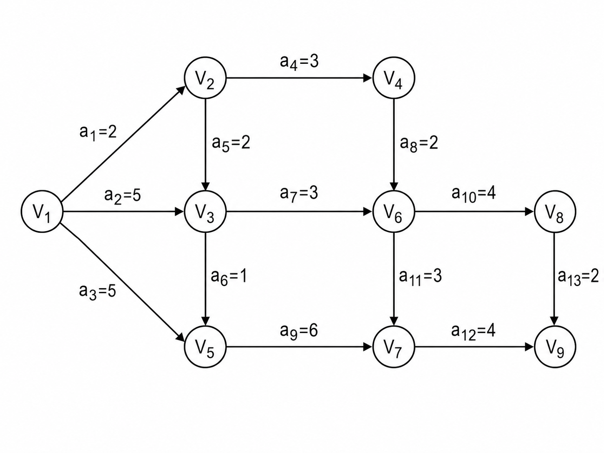
A. 16
B. 15
C. 18
D. 20

- 答案：A
- 解析：关键路径长度等于从源点到汇点的最长路径长度。按拓扑顺序计算各事件的最早发生时间。

  图中左下方结点应为 \(V_5\)，中间右侧结点为 \(V_6\)。计算如下：

  \[
  \begin{aligned}
  ve(V_1)&=0,\\
  ve(V_2)&=0+2=2,\\
  ve(V_3)&=\max\{0+5,\,2+2\}=5,\\
  ve(V_4)&=2+3=5,\\
  ve(V_5)&=\max\{0+5,\,5+1\}=6,\\
  ve(V_6)&=\max\{5+3,\,5+2\}=8,\\
  ve(V_7)&=\max\{6+6,\,8+3\}=12,\\
  ve(V_8)&=8+4=12,\\
  ve(V_9)&=\max\{12+4,\,12+2\}=16.
  \end{aligned}
  \]

  因而汇点 \(V_9\) 的最早发生时间为 \(16\)，即关键路径长度为 \(16\)。例如最长路径可取：

  \[
  V_1\to V_3\to V_5\to V_7\to V_9
  \]

  其长度为：

  \[
  5+1+6+4=16
  \]

  故选 A。

### 第7章 查找

#### 7.1 查找的基本概念

<br>
<br>

1. **【竟成·模拟二-10】** 在下列各种数据结构中，一般而言查找操作效率较低的是（）。
A. 二叉堆
B. 二叉排序树
C. B树
D. 红黑树

- 答案：A
- 解析：二叉堆只保证父结点与孩子结点之间满足堆序关系，并不保证左、右子树内部按关键字有序。因此，除查找堆顶最大值或最小值外，查找任意指定关键字通常需要遍历大量结点，最坏时间复杂度为 \(O(n)\)。

  - 二叉排序树在树形较平衡时，查找时间复杂度约为 \(O(\log n)\)，最坏退化为 \(O(n)\)。
  - B 树是一种多路平衡查找树，查找复杂度为 \(O(\log n)\)，特别适用于外存查找。
  - 红黑树能够保证树高为 \(O(\log n)\)，查找复杂度稳定为 \(O(\log n)\)。

  因此一般而言，二叉堆对任意关键字的查找效率最低，选择 A。

#### 7.2 顺序查找和折半查找

##### 7.2.2 折半查找

<br>
<br>

1. **【王道·卷三-Q08】** 在一个长度为12的有序顺序表中，每个元素的查找概率相等，则对其进行折半查找时，查找成功的平均查找长度是（  ）。<br>
A. 35/12
B. 31/12
C. 37/12
D. 39/12

- 答案：C
- 解析：采用折半查找并按中点向下取整构造判定树。长度为 \(12\) 的表中，各层内部结点数依次为：

  \[
  1,\quad 2,\quad 4,\quad 5
  \]

  对应比较次数分别为 \(1,2,3,4\)。由于各元素查找概率相等，查找成功的平均查找长度为：

  \[
  \begin{aligned}
  ASL_{\text{成功}}
  &=\frac{1\times1+2\times2+4\times3+5\times4}{12}\\
  &=\frac{1+4+12+20}{12}\\
  &=\frac{37}{12}.
  \end{aligned}
  \]

  故选 C。

<br>
<br>

2. **【王道·卷四-Q08】** 折半查找有序表{2,10,25,35,40,65,70,75,81,82,88,100}。若查找元素75，则可能的查找次序是（  ）。<br>
A. 65,82,75
B. 70,82,75
C. 65,81,75
D. 65,81,70,75

- 答案：D
- 解析：有序表共有 \(12\) 个元素，采用中点向下取整。

  1. 初始区间为第 \(1\)～\(12\) 个元素，中点为：

     \[
     \left\lfloor\frac{1+12}{2}\right\rfloor=6
     \]

     比较第 6 个元素 \(65\)。因为 \(75>65\)，转到右半区间第 \(7\)～\(12\) 个元素。

  2. 新中点为：

     \[
     \left\lfloor\frac{7+12}{2}\right\rfloor=9
     \]

     比较第 9 个元素 \(81\)。因为 \(75<81\)，转到区间第 \(7\)～\(8\) 个元素。

  3. 新中点为第 7 个元素 \(70\)。因为 \(75>70\)，继续查找第 8 个元素。

  4. 比较第 8 个元素 \(75\)，查找成功。

  因此查找次序为：

  \[
  65,81,70,75
  \]

  选择 D。

<br>
<br>

3. **【竟成·模拟一-10】** 对有序序列{1,2,3,4,5,6,7,8,9,10}，使用折半查找（判定树采用向下取整）。假设各元素的查找概率相等，则下列描述错误的是（）。
A. 该折半查找判定树是AVL树
B. 查找成功的平均查找长度为29/10
C. 查找失败的平均查找长度为39/11
D. 该折半查找判定树的后序遍历序列为{1,4,3,2,7,6,10,9,8,5}

- 答案：题目有误（A、B、C、D 均正确，无错误选项）
- 解析：采用中点向下取整构造折半查找判定树，根结点为关键字 5，结构可表示为：

  ```text
          5
        /   \
       2     8
      / \   / \
     1   3 6   9
          \  \   \
           4  7   10
  ```

  逐项验证如下。

  - A 正确。任一结点左右子树高度差的绝对值均不超过 1，因此该树是 AVL 树。
  - B 正确。各层结点数依次为 \(1,2,4,3\)，所以：

    \[
    ASL_{\text{成功}}
    =\frac{1\times1+2\times2+4\times3+3\times4}{10}
    =\frac{29}{10}.
    \]

  - C 正确。共有 \(11\) 个查找失败区间，各区间所需比较次数之和为：

    \[
    3+3+3+4+4+3+4+4+3+4+4=39
    \]

    因此：

    \[
    ASL_{\text{失败}}=\frac{39}{11}.
    \]

  - D 正确。该树的后序遍历为：

    \[
    1,4,3,2,7,6,10,9,8,5
    \]

  因此四个选项均正确，题目不存在“错误”的选项，应为原题或选项设置有误。

<br>
<br>

4. **【竟成·模拟二-08】** 若某折半查找判定树包含20个结点，则其查找失败的查找长度最小是（）。
A. 1
B. 2
C. 3
D. 4

- 答案：D
- 解析：折半查找判定树是根据每次取中点递归构造的近似完全二叉树。

  对于 \(20\) 个内部结点：

  \[
  2^4-1=15<20<2^5-1=31
  \]

  因此判定树有 5 层。前 4 层必须全部含有内部结点，第 5 层只含部分内部结点。查找失败时，需要沿查找路径到达一个空指针位置；最浅的失败位置出现在第 4 层内部结点的空孩子处，因此至少要比较 4 次。

  所以查找失败的最小查找长度为 \(4\)，选择 D。

##### 7.2.3 分块查找

<br>
<br>

1. **【竟成·模拟六-10】** 当采用分块查找时，数据的组织方式为（）。
A. 数据分成若干块，每块内数据有序
B. 数据分成若干块，每块内数据不必有序，但块间必须有序，每块内最大（或最小）的数据组成索引块
C. 数据分成若干块，每块内数据有序，每块内最大（或最小）的数据组成索引块
D. 数据分成若干块，每块（除最后一块外）中数据个数需要相同

- 答案：B
- 解析：分块查找又称索引顺序查找，其基本组织原则是“块间有序、块内无序”。

  - 块间有序：前一块中所有关键字均小于后一块中的所有关键字，或满足相应的统一有序关系。
  - 块内无序：同一块内的元素不要求按关键字排序，定位到目标块后可采用顺序查找。
  - 索引表通常保存每块的最大关键字或最小关键字，以及该块的起始地址。

  因而 B 正确。A、C 错在要求块内有序；D 错在各块元素个数不必完全相同。

#### 7.3 树形查找

##### 7.3.1 二叉排序树 BST

<br>
<br>

1. **【王道·卷一-Q08】** 在下列选项中，（  ）不可能构成任何二叉排序树的前序遍历序列。<br>
A. 4,2,3,5,6,7
B. 4,3,2,7,6,5
C. 6,5,4,2,3,7
D. 6,5,3,4,2,7

- 答案：D
- 解析：二叉排序树的前序序列满足：根结点之后先出现所有小于根的左子树结点，再出现所有大于根的右子树结点；这一规则对子树递归成立。

  - A：根为 4，左子树序列为 \(2,3\)，右子树序列为 \(5,6,7\)，可以构成二叉排序树。
  - B：根为 4，左子树序列为 \(3,2\)，右子树序列为 \(7,6,5\)，可以构成二叉排序树。
  - C：根为 6，左子树序列为 \(5,4,2,3\)，右子树为 7。左子树内部也满足前序序列约束，可以构成二叉排序树。
  - D：根为 6，左子树序列为 \(5,3,4,2\)。在以 3 为根的子树中，4 大于 3，说明已经进入 3 的右子树；此后又出现小于 3 的结点 2，不可能再回到 3 的左子树，因此该序列不可能是任何二叉排序树的前序遍历序列。

  故选 D。

<br>
<br>

2. **【王道·卷五-Q08】** 假设要在二叉排序树中查找关键码为52的结点，则在如下序列中，不可能是在二叉排序树中的查找顺序的是（  ）。<br>
A. 80,22,76,25,37,52
B. 95,59,84,25,70,52
C. 1,58,54,20,43,52
D. 90,22,82,63,52

- 答案：B
- 解析：在二叉排序树中查找关键字 52 时，每比较一个结点，都会进一步缩小后续结点允许出现的取值范围。

  - A：依次得到约束

    \[
    22<52<76<80
    \]

    后续的 25、37、52 均处于当前允许区间内，可能出现。
  - B：比较 95 后进入其左子树；比较 59 后还应继续进入 59 的左子树，因此后续结点必须小于 59。但下一结点为 84，违反约束，所以不可能出现。
  - C：查找区间依次收缩为

    \[
    43<52<54
    \]

    整个序列符合二叉排序树的查找规律。
  - D：查找区间依次收缩为

    \[
    22<52<63
    \]

    整个序列也可能出现。

  因此，不可能的查找序列是 B。

<br>
<br>

3. **【竟成·模拟五-08】** 若在一棵二叉排序树中查找关键字363，下列序列中，不可能是查找过的序列的是（）。
A. 5,256,441,368,340,354,367,363
B. 936,240,911,248,896,259,361,363
C. 985,200,911,240,912,258,363
D. 8,402,387,229,266,382,381,278,363

- 答案：C
- 解析：查找关键字 363 时，可用上下界检查每一步是否可能出现。

  - A：比较过程中的区间依次缩小，最终有

    \[
    354<363<367
    \]

    序列合法。
  - B：各结点始终位于当前查找区间内，最终由 361 进入其右子树找到 363，序列合法。
  - C：比较 911 时，因为

    \[
    363<911
    \]

    所以后续查找必须位于 911 的左子树，即后续关键字必须小于 911。然而下一结点是 912，不满足要求，因此该序列不可能出现。
  - D：上下界不断更新，所有结点均落在当前允许区间内，序列合法。

  故选 C。

<br>
<br>

4. **【竟成·模拟七-06】** 下列说法错误的是（）。
A. 若一棵二叉排序树中一个结点有两个孩子，则它的中序后继结点没有左孩子，它的中序前驱结点没有右孩子
B. 若二叉排序树中一个结点x的右子树为空，且x有一个中序后继y，则y一定是x的祖先，且y的左孩子也是x的祖先（结点本身也视为自己的一个祖先）
C. 中序线索树中，从最左边的结点开始不断的访问右孩子或者线索结点，一定能遍历树内所有的结点
D. 若x是二叉排序树的叶结点，y是其父结点，那么y的数值要么是树中大于x的数值的最小关键字，要么是树中小于x的数值的最大关键字

- 答案：C
- 解析：逐项分析如下。

  - A 正确。若结点有右子树，则其中序后继是右子树中最左边的结点，因此该后继不可能有左孩子；同理，其中序前驱是左子树中最右边的结点，不可能有右孩子。
  - B 正确。当结点 \(x\) 的右子树为空时，其中序后继是从 \(x\) 向上回溯时遇到的第一个“其左子树包含 \(x\)”的祖先 \(y\)。从 \(y\) 的左孩子到 \(x\) 存在一条向下路径，因此 \(y\) 的左孩子也是 \(x\) 的祖先，允许该左孩子就是 \(x\) 本身。
  - C 错误。在中序线索二叉树中，若当前结点的右指针为线索，可直接沿线索找到后继；但若右指针指向右孩子，则中序后继并不一定就是该右孩子，而应是该右子树中最左边的结点。因此不能仅通过“访问右孩子或线索”完成遍历。
  - D 正确。若 \(x\) 是 \(y\) 的左孩子，则 \(y\) 是 \(x\) 的中序后继；若 \(x\) 是 \(y\) 的右孩子，则 \(y\) 是 \(x\) 的中序前驱。由于 \(x\) 是叶结点，不存在更近的子树结点改变这一关系。

  因此错误的是 C。

##### 7.3.2 平衡二叉树

<br>
<br>

1. **【王道·卷一-Q09】** 在一棵有232个结点的AVL树中，每个非叶结点的平衡因子不是1就是-1，那么离根最远的叶结点所处的层次为（  ）。假设根结点所处的层次为1。<br>
A. 6
B. 8
C. 11
D. 13

- 答案：C
- 解析：设满足题意且高度为 \(h\) 的 AVL 树的最少结点数为 \(N_h\)。由于每个非叶结点的平衡因子只能是 \(1\) 或 \(-1\)，其左右子树高度必须恰好相差 1。为使结点数最少，根的两棵子树应分别取高度 \(h-1\) 和 \(h-2\)，因此：

  \[
  N_h=N_{h-1}+N_{h-2}+1
  \]

  初值为：

  \[
  N_1=1,\qquad N_2=2
  \]

  依次计算：

  \[
  \begin{aligned}
  N_3&=4,\quad N_4=7,\quad N_5=12,\quad N_6=20,\\
  N_7&=33,\quad N_8=54,\quad N_9=88,\quad N_{10}=143,\\
  N_{11}&=232.
  \end{aligned}
  \]

  题目给出的结点数恰好为 \(232=N_{11}\)，因此树的高度为 11，离根最远的叶结点位于第 11 层。故选 C。

<br>
<br>

2. **【王道·卷六-Q08】** 由元素序列(27,16,75,38,51)构造平衡二叉树时，首次出现的最小不平衡子树的根（离插入结点最近且平衡因子的绝对值为2的结点）是（  ）。<br>
A. 27
B. 38
C. 51
D. 75

- 答案：D
- 解析：按顺序插入各关键字：

  1. 插入 27，作为根结点。
  2. 插入 16，成为 27 的左孩子。
  3. 插入 75，成为 27 的右孩子，此时仍平衡。
  4. 插入 38，成为 75 的左孩子，此时各结点仍平衡。
  5. 插入 51，其查找路径为

     \[
     27\rightarrow75\rightarrow38
     \]

     因为 \(38<51<75\)，所以 51 成为 38 的右孩子。

  插入后，结点 38 的平衡因子绝对值为 1；结点 75 的左子树高度为 2，右子树高度为 0，因此其平衡因子绝对值为 2。沿插入结点向根回溯，首次遇到的不平衡结点是 75。

  故选 D。

<br>
<br>

3. **【王道·卷七-Q07】** 右图所示为一棵平衡二叉树（字母不是关键字），在结点 $D$ 的右子树上插入结点 $F$ 后，会导致该平衡二叉树失去平衡，则调整后的平衡二叉树中平衡因子的绝对值为1的分支结点数为（  ）。<br>
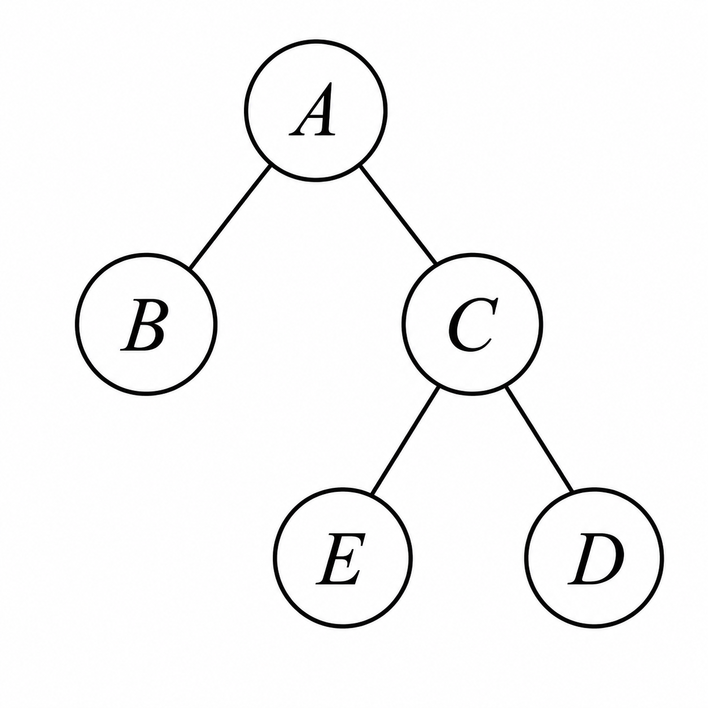
A. 0
B. 1
C. 2
D. 3

- 答案：B
- 解析：原树结构为：根结点 A 的左孩子为 B、右孩子为 C；C 的左孩子为 E、右孩子为 D。将 F 插入 D 的右子树后，结构为：

  ```text
          A
         / \
        B   C
           / \
          E   D
               \
                F
  ```

  此时 A 的右子树高度比左子树高 2，且新增结点位于 A 的右孩子 C 的右子树中，属于 RR 型失衡，因此对 A 做一次左旋。调整后为：

  ```text
          C
         / \
        A   D
       / \   \
      B   E   F
  ```

  各分支结点的平衡因子为：

  - C 的左右子树等高，平衡因子为 0；
  - A 的左右子树等高，平衡因子为 0；
  - D 只有右孩子 F，平衡因子的绝对值为 1。

  因此平衡因子绝对值为 1 的分支结点只有 1 个，选择 B。

<br>
<br>

4. **【王道·卷七-Q08】** 在平衡二叉树中插入一个结点后造成了不平衡，设最低的不平衡结点为 $a$，且已知插入前的左孩子的平衡因子为 $-1$，右孩子的平衡因子为0，则做（  ）调整有可能使其平衡。<br>
I. 左旋 II. 先左旋后右旋 III. 先右旋后左旋 IV. 右旋
A. I和III
B. II和IV
C. I和II
D. III和IV

- 答案：A
- 解析：设平衡因子定义为“左子树高度减右子树高度”。结点 \(a\) 是插入后最低的不平衡结点，因此从插入位置到 \(a\) 之间的孩子结点在插入后仍应保持平衡。

  插入前，\(a\) 的左孩子平衡因子为 \(-1\)，说明其右子树比左子树高 1。若在该左孩子的子树内插入并使其高度增加：

  - 插入左子树时，左右子树会变得等高，整个左孩子的高度不增加；
  - 插入右子树时，该左孩子会先失衡，与“\(a\) 是最低不平衡结点”矛盾。

  因此，\(a\) 不可能因左子树增高而成为最低不平衡结点，只可能因右子树增高而出现右侧失衡。

  \(a\) 的右孩子原平衡因子为 0，插入后可能出现两种情况：

  - 插入右孩子的右子树，形成 RR 型，需对 \(a\) 左旋，即 I；
  - 插入右孩子的左子树，形成 RL 型，需先右旋后左旋，即 III。

  所以可能的调整为 I 和 III，选择 A。

<br>
<br>

5. **【王道·卷八-Q08】** 在有15个结点的平衡二叉树上，查找关键字为28（存在该结点）的结点，则依次比较的关键字有可能是（  ）。<br>
A. 30,36
B. 38,48,28
C. 48,18,38,28
D. 60,20,50,40,38,28

- 答案：C
- 解析：首先检查二叉排序树查找过程的大小关系，再结合 AVL 树的高度限制判断。

  - A：比较 30 后，因为 \(28<30\)，下一结点必须位于 30 的左子树，关键字应小于 30；但下一关键字为 36，不可能。
  - B：比较 38 后，因为 \(28<38\)，下一关键字应小于 38；但下一关键字为 48，不可能。
  - C：查找过程为

    \[
    48\rightarrow18\rightarrow38\rightarrow28
    \]

    各步满足：

    \[
    18<28<38<48
    \]

    可以构造出满足该查找路径的 AVL 树。
  - D：该序列需要比较 6 次，即目标结点位于第 6 层。AVL 树高度为 6 时最少需要的结点数满足：

    \[
    N_1=1,\quad N_2=2,\quad N_h=N_{h-1}+N_{h-2}+1
    \]

    从而：

    \[
    N_6=20
    \]

    但题中只有 15 个结点，因此不可能具有 6 层查找路径。

  故选 C。

<br>
<br>

6. **【竟成·模拟一-04】** 对于关键字集合{1,4,5,10,16,17,21}，能够构成不同的平衡二叉树的数量是（）。
A. 7
B. 10
C. 13
D. 17

- 答案：D
- 解析：对一个给定的互异关键字集合，每一种满足 AVL 条件的二叉树形态都唯一对应一棵二叉排序树，因此只需统计含 7 个结点的不同 AVL 树形态。

  设 \(F(n,h)\) 表示含 \(n\) 个结点、高度为 \(h\) 的 AVL 树数量。根的左、右子树结点数之和为 \(n-1\)，且两棵子树高度差不超过 1。

  含 7 个结点的 AVL 树分为两类：

  1. 高度为 3。此时只能是满二叉树，形态数为 1。
  2. 高度为 4。高度为 4 的最少结点数为 7，因此根的两棵子树高度必须分别为 3 和 2。高度为 3、含 4 个结点的最小 AVL 子树共有 4 种形态；高度为 2、含 2 个结点的 AVL 子树共有 2 种形态。高、低子树还可左右互换，因此形态数为：

     \[
     2\times4\times2=16
     \]

  总数为：

  \[
  1+16=17
  \]

  因此选择 D。

<br>
<br>

7. **【竟成·模拟二-07】** 关于平衡二叉树，下述说法正确的是（）。
I. 在AVL树中，若某个结点的左右孩子的平衡因子均为0，则该结点的平衡因子也是0
II. 同时满足完全二叉树和二叉搜索树定义的二叉树也是AVL树
III. 一棵AVL树的任意两个叶结点的层次差的绝对值不大于1
A. II
B. I、II、III
C. II、III
D. I、III

- 答案：A
- 解析：逐项判断如下。

  - I 错误。左右孩子各自的平衡因子为 0，只能说明每个孩子内部的左右子树等高，并不能说明这两个孩子本身的高度相等。例如，左孩子可以是一棵高度为 2 的满二叉树，右孩子可以是一个叶结点，两者平衡因子都为 0，但其双亲的平衡因子为 1。
  - II 正确。完全二叉树中，任一结点的左右子树高度差都不超过 1，因此完全二叉树本身满足 AVL 树的平衡条件；若它同时又满足二叉搜索树的有序条件，则必然是一棵 AVL 树。
  - III 错误。AVL 树只要求每个结点的左右子树高度差不超过 1，并不要求整棵树中任意两个叶结点的层次差不超过 1。不同分支上的叶结点层次可能相差 2 或更多。

  因此只有 II 正确，选择 A。

##### 7.3.3 红黑树

<br>
<br>

1. **【王道·卷二-Q08】** 下列关于红黑树的说法中，正确的是（  ）。<br>
A. 任意一棵红黑树中红结点的数量和黑结点的数量一定相等
B. 红黑树的黑高可能正好是整棵红黑树高度的一半
C. 红黑树的查找效率要优于平衡二叉树
D. 一棵合法的红黑树应该也是一棵平衡二叉树

- 答案：B
- 解析：红黑树通过“任一结点到其所有后代空结点的路径上黑结点数相同”和“红结点不能有红孩子”等性质，将最长路径限制为最短路径的至多 2 倍。

  - A 错误。红黑树只约束路径上的黑结点数量，并不要求整棵树中红、黑结点总数相等。
  - B 正确。若一条最长路径上的结点颜色呈黑、红交替排列，则树高可以达到黑高的 2 倍，因此黑高可能恰好为整棵树高度的一半。
  - C 错误。AVL 树的平衡条件更严格，通常树高更低，单纯从查找路径长度看，AVL 树一般不劣于红黑树。红黑树的优势主要在于插入、删除时调整代价较小。
  - D 错误。红黑树只保证近似平衡，某些结点左右子树高度差可以大于 1，因此不一定满足 AVL 树的定义。

  故选 B。

<br>
<br>

2. **【王道·卷八-Q09】** 在关于红黑树和AVL树的如下说法中，正确的是（  ）。<br>
A. 红黑树查找比AVL树快
B. 红黑树插入和删除时旋转次数比AVL树多
C. 红黑树的结构比AVL树更加平衡
D. 红黑树和AVL树的插入、删除操作的时间复杂度都是 \(O(\log_{2}n)\)

- 答案：D
- 解析：红黑树和 AVL 树都属于自平衡二叉搜索树，其高度均为 \(O(\log n)\)，因此查找、插入和删除的最坏时间复杂度均为 \(O(\log n)\)。

  - A 错误。AVL 树平衡得更严格，通常查找路径更短，不能说红黑树查找一定更快。
  - B 错误。红黑树插入、删除时通常通过少量旋转配合变色完成调整，旋转次数一般少于 AVL 树。
  - C 错误。AVL 树要求任一结点左右子树高度差不超过 1，结构比红黑树更加平衡。
  - D 正确。两者的树高都为对数级，所以插入、删除操作的最坏时间复杂度均为 \(O(\log_{2}n)\)。

  故选 D。

<br>
<br>

3. **【竟成·模拟四-08】** 将关键字{41,38,31,12,19,8}依次插入空的红黑树后，关于得到的结果树，下列说法错误的是（）。
A. 有2个红色结点，4个黑色结点
B. 12和41在同一层
C. 8是12的孩子
D. 有相邻黑色内部结点

- 答案：B
- 解析：按红黑树插入规则依次插入关键字，最终得到：

  ```text
            38(B)
           /     \
        19(R)    41(B)
        /   \
     12(B) 31(B)
      /
    8(R)
  ```

  其中，括号内的 `B`、`R` 分别表示黑色和红色。

  - 红结点为 19、8，共 2 个；黑结点为 38、12、31、41，共 4 个，A 正确。
  - 41 位于第 2 层，12 位于第 3 层，二者不在同一层，B 错误。
  - 8 是 12 的左孩子，C 正确。
  - 38 与 41 是相邻的两个黑色内部结点，D 正确。

  因此错误的是 B。

<br>
<br>

4. **【竟成·模拟五-09】** 下列选项中，错误的是（）。
A. 若向一棵红黑树连续插入n(n>1)个结点，则该树至少有1个红结点
B. 在一棵红黑树中，如果一个结点是黑的，那么它的孩子结点（若存在）一定是红的
C. 在一棵红黑树中，如果所有结点都是黑的，那么它的形态一定是满二叉树
D. 红黑树的查找路径上不允许出现两个连续的红结点

- 答案：B
- 解析：

  - A 正确。红黑树插入的新结点初始为红色，插入调整可能变色或旋转，但从空树连续插入两个以上结点后，树中至少会保留一个红色内部结点。
  - B 错误。红黑树只规定红结点的孩子必须是黑色，并未规定黑结点的孩子必须是红色。黑结点的孩子既可以是红色，也可以是黑色。
  - C 正确。若所有内部结点均为黑色，则由任一结点到所有空结点的黑高相同可知，各叶层必须等深；同时任一内部结点不能只存在一侧非空子树，否则左右路径黑高不同。因此其形态必为满二叉树。
  - D 正确。红黑树明确禁止红结点拥有红孩子，因此任一查找路径上不能出现两个连续的红结点。

  故选 B。

<br>
<br>

5. **【竟成·模拟七-05】** 将关键字41，38，31，12，19，8依次插入空的红黑树后，下列对结果的树说法错误的是（）。
A. 有2个红色结点，4个黑色结点
B. 12和41的黑高相同
C. 8是31的孩子
D. 树中存在相邻的黑色内部结点

- 答案：C
- 解析：插入完成后的红黑树为：

  ```text
            38(B)
           /     \
        19(R)    41(B)
        /   \
     12(B) 31(B)
      /
    8(R)
  ```

  - 红结点为 19、8，黑结点为 38、12、31、41，A 正确。
  - 从 12 到其后代空结点的路径与从 41 到其后代空结点的路径所含黑结点数相同，因此二者黑高相同，B 正确。
  - 8 是 12 的左孩子，而不是 31 的孩子，C 错误。
  - 38 与 41 是相邻黑色内部结点，D 正确。

  因此错误的是 C。

#### 7.4 B树和B+树

##### 7.4.1 B树及其基本操作

<br>
<br>

1. **【王道·卷二-Q09】** 对于如下这棵3阶 \(B\) 树，完成“删除71”操作后应该是（  ）。<br>
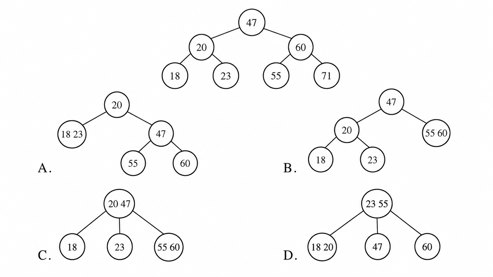
A. 见图中 A
B. 见图中 B
C. 见图中 C
D. 见图中 D

- 答案：C
- 解析：3 阶 B 树中，每个结点至多有 3 棵子树、至多有 2 个关键字；除根结点外，每个结点至少有 1 个关键字。

  1. 删除叶结点中的关键字 71 后，该叶结点变为空结点，发生下溢。
  2. 它的兄弟结点只含关键字 55，已经达到最少关键字数，不能借关键字，因此将 55、双亲中的关键字 60 与空结点合并，形成叶结点 \([55,60]\)。
  3. 原内部结点 60 因失去唯一关键字而继续下溢。其兄弟内部结点 20 也只有最少关键字，不能借，因此再将左子树、根关键字 47 和右子树合并。
  4. 原根结点变空，树高降低 1，新根为 \([20,47]\)，三个孩子依次为 \([18]\)、\([23]\)、\([55,60]\)。

  该结构对应图中 C，故选 C。

<br>
<br>

2. **【王道·卷六-Q09】** 往高度为 \(h\) 的 \(B\) 树中插入一个关键字时，若该关键字所在的结点已满，且其兄弟结点未满，则需要进行调整，调整后该结点与其兄弟结点各含有一半的关键字，其双亲结点也增加一个关键字；若该结点及其兄弟结点都已满，则需要分裂该结点，调整后树的高度可能会增加1。假设内存足够大，在插入过程中为查找插入位置读入的结点一直在内存中，则最坏情况下可能需要读/写磁盘次数为（  ）。（假设根结点的高度为1，且根结点初始未读入内存。）<br>
A. \(h + 1\)
B. \(2h + 1\)
C. \(3h + 1\)
D. \(4h + 2\)

- 答案：C
- 解析：最坏情况是从叶结点开始，分裂一直向上传播到根结点。

  1. 查找插入位置需要从根到叶访问 \(h\) 个结点，因此需要读磁盘 \(h\) 次。
  2. 对于除根以外的每一层，满结点分裂后要把分裂所得的两个结点写回磁盘，共有 \(h-1\) 层，因此需要：

     \[
     2(h-1)
     \]

     次写磁盘。
  3. 根结点最终也分裂时，需要写回分裂所得的两个子结点，并写入新根，共 3 次。

  因而最坏情况下总的磁盘读写次数为：

  \[
  h+2(h-1)+3=3h+1
  \]

  故选 C。

<br>
<br>

3. **【王道·卷七-Q09】** 在一棵含有 \(n\) 个关键字的 \(m\) 阶 \(B\) 树中进行查找，至多需要读磁盘（  ）次。<br>
A. \(\log_{2}n\)
B. \(1 + \log_{2}n\)
C. \(\log_{[m/2]}((n + 1) / 2) + 1\)
D. \(\log_{[n/2]}((m + 1) / 2) + 1\)

- 答案：C
- 解析：查找时，每访问一层通常需要读取一个磁盘块，因此最多读磁盘次数等于 B 树的最大高度。

  设非根结点的最少分支数为：

  \[
  t=\left\lceil\frac{m}{2}\right\rceil
  \]

  高度为 \(h\) 的 B 树，为使高度最大，应让各结点尽量少含关键字。此时根至少有 2 个孩子，其余内部结点至少有 \(t\) 个孩子，可得最少关键字数为：

  \[
  n_{\min}=2t^{h-1}-1
  \]

  因此：

  \[
  h\leqslant \log_t\frac{n+1}{2}+1
  \]

  选项中以 \([m/2]\) 表示最小分支数，故至多读磁盘次数为：

  \[
  \log_{[m/2]}\left(\frac{n+1}{2}\right)+1
  \]

  故选 C。

<br>
<br>

4. **【竟成·模拟二-09】** 高度为h的B树插入一个新关键字后最多可能生成（）个新结点（提示：本题的新结点指的是与原来B树内容不相同的结点）。
A. h+1
B. 2h
C. 3h
D. 2h+1

- 答案：D
- 解析：最坏情况下，插入导致从叶结点到根结点的每一层都发生分裂。

  - 对于原树中除根以外的 \(h-1\) 个路径结点，每个结点分裂后形成两个内容与原结点不同的结点，共产生：

    \[
    2(h-1)
    \]

    个“新结点”。
  - 原根结点分裂时，会形成两个内容改变的子结点，并额外生成一个新根，共计 3 个“新结点”。

  因而最多生成：

  \[
  2(h-1)+3=2h+1
  \]

  个新结点，故选 D。

<br>
<br>

5. **【竟成·模拟三-08】** 下列关于B树的说法错误的是（）。
I. 查找B树的一个结点的前驱结点就是查找其左孩子的最右结点
II. B树支持顺序查找
III. B树每次都需查询到叶结点，查询性能稳定
IV. 使用B树进行范围查找时，需要依赖中序遍历
A. I、II、III
B. III
C. III、IV
D. II、IV

- 答案：B
- 解析：逐项判断如下。

  - I 正确。对于位于内部结点中的某个关键字，其直接前驱是该关键字左侧子树中的最大关键字，即沿对应左孩子不断向最右侧查找所得的关键字。
  - II 正确。B 树中的关键字具有全序关系，通过中序遍历可以按关键字递增次序访问，因此支持顺序查找。
  - III 错误。B 树的关键字既可存放在内部结点，也可存放在叶结点。查找成功时可能在某个内部结点就结束，并非每次都必须查询到叶结点，所以成功查找的磁盘访问次数不完全固定。
  - IV 正确。B 树的所有层次都可能存放记录，且叶结点之间没有顺序链指针。进行范围查找时，通常需要从起始关键字位置出发，按照中序次序继续遍历。

  因此只有 III 错误，选择 B。

6. **【竟成·模拟四-07】** 有n个关键字的m阶B树的高度最大是（）。
A. 1+log₂n
B. 1+log₂m
C. 1+log₍⌈m/2⌋₎((n+1)/2)
D. 1+log₍⌈n/2⌋₎((m+1)/2)

- 答案：C
- 解析：设这棵 B 树的高度为 \(h\)，为使高度达到最大，应让每个结点所含关键字数和分支数尽可能少。

  对于一棵 \(m\) 阶 B 树，除根结点外的非叶结点至少有：

  \[
  t=\left\lceil\frac{m}{2}\right\rceil
  \]

  个分支，因此至少有 \(t-1\) 个关键字。根结点若不是叶结点，则至少有 2 个分支、1 个关键字。

  高度为 \(h\) 时，关键字总数的最小值为：

  \[
  n_{\min}=2t^{h-1}-1
  \]

  由 \(n\geqslant n_{\min}\)，得：

  \[
  \begin{aligned}
  n+1 &\geqslant 2t^{h-1} \\
  h &\leqslant 1+\log_t\frac{n+1}{2}
  \end{aligned}
  \]

  因此最大高度为：

  \[
  1+\log_{\lceil m/2\rceil}\left(\frac{n+1}{2}\right)
  \]

  故选 C。

<br>
<br>

7. **【竟成·模拟六-07】** 下列关于B树的说法错误的是（）。
A. 高度为h的m阶B树最多存储mʰ-1个关键字
B. 所有叶结点都在同一层次上
C. 含n个结点（不含失败结点）的m阶（m>2）B树至少包含(n-1)×(⌈m/2⌉-1)+1个关键字
D. 和二叉搜索树相同，B树高度的增加也是发生在底部

- 答案：D
- 解析：逐项判断如下。

  - A 正确。高度为 \(h\) 的 \(m\) 阶 B 树，每个结点最多有 \(m-1\) 个关键字，满树共有：

    \[
    1+m+m^2+\cdots+m^{h-1}=\frac{m^h-1}{m-1}
    \]

    个结点，因此最多包含：

    \[
    (m-1)\cdot\frac{m^h-1}{m-1}=m^h-1
    \]

    个关键字。
  - B 正确。B 树是一棵多路平衡查找树，所有叶结点都处于同一层次。
  - C 正确。根结点至少有 1 个关键字，其余 \(n-1\) 个结点至少各有 \(\lceil m/2\rceil-1\) 个关键字，因此至少有：

    \[
    1+(n-1)\left(\left\lceil\frac{m}{2}\right\rceil-1\right)
    \]

    个关键字。
  - D 错误。B 树插入时，结点分裂可能逐层向上传播；当根结点分裂并产生新根时，树高增加。因此 B 树高度的增加发生在根部，而不是底部。二叉搜索树通常通过在叶结点下方插入新结点而增加高度。

  故选 D。

<br>
<br>

##### 7.4.2 B+树的基本概念

1. **【王道·卷一-Q10】** 下列关于 \(B\) 树和 \(B+\) 树的描述中，正确的是（  ）。<br>
I. \(B\) 树的结点可以同时存储关键字和数据，而 \(B+\) 树的非叶结点仅可以存储关键字
II. \(B+\) 树的叶结点之间存在指针链接，这有利于进行范围查询
III. 在相同的磁盘 \(I/O\) 条件下，\(B+\) 树通常比 \(B\) 树更适用于数据库索引
IV. \(B\) 树在进行插入和删除操作时，可能需要合并或分裂结点以保持其平衡性
A. 仅I和IV
B. 仅I、II和IV
C. 仅I、III和IV
D. I、II、III和IV

- 答案：D
- 解析：四个说法均正确。

  - I 正确。B 树的内部结点可以直接保存关键字及其对应记录；B+ 树的非叶结点只保存索引关键字和子树指针，所有记录均存放在叶结点中。
  - II 正确。B+ 树的叶结点通常按关键字顺序通过链指针连接，定位范围起点后可沿链表顺序扫描，因此范围查询效率较高。
  - III 正确。B+ 树非叶结点不保存完整记录，在相同磁盘块大小下可容纳更多关键字和分支，树通常更矮；同时叶结点有序链接，适合数据库中的等值查询和范围查询。
  - IV 正确。B 树插入时结点可能溢出并发生分裂，删除时结点可能下溢，需要借关键字或合并结点，以维持各结点关键字数约束及所有叶结点等高。

  因此 I、II、III、IV 均正确，选择 D。

<br>
<br>

#### 7.5 散列 Hash 表

##### 7.5.3 处理冲突的方法

1. **【王道·卷三-Q09】** 散列表的表长为 \(m = 14\)，散列函数为 \(Hash(key) = key\% 11\)。表中已有4个结点，地址分别为 \(addr(15) = 4\)、\(addr(38) = 5\)、\(addr(61) = 6\) 和 \(addr(84) = 7\)，其余地址均为空。若采用二次探测法解决冲突，则关键码值为49的散列地址是（  ）。<br>
A. 8
B. 3
C. 5
D. 9

- 答案：D
- 解析：首先计算关键字 49 的初始散列地址：

  \[
  H(49)=49\bmod 11=5
  \]

  地址 5 已被占用。二次探测法的探测增量通常依次为：

  \[
  1^2,-1^2,2^2,-2^2,\ldots
  \]

  因而探测过程为：

  \[
  \begin{aligned}
  5+1^2 &\equiv 6\pmod {14} &&\text{已占用}\\
  5-1^2 &\equiv 4\pmod {14} &&\text{已占用}\\
  5+2^2 &\equiv 9\pmod {14} &&\text{为空}
  \end{aligned}
  \]

  所以关键字 49 应存放在地址 9，故选 D。

<br>
<br>

2. **【王道·卷四-Q09】** 在下列关于散列表的说法中，正确的个数是（  ）。<br>
I. 散列表的平均查找长度与处理冲突方法无关
II. 在散列表中，“比较”操作一般是不可避免的
III. 散列表查找成功时的平均查找长度只与表长有关
IV. 若在散列表中删除一个元素，则只需简单地将该元素删除即可
A. 1
B. 2
C. 3
D. 4

- 答案：A
- 解析：逐项判断如下。

  - I 错误。不同的冲突处理方法会形成不同的探测序列或链表结构，直接影响平均查找长度。
  - II 正确。散列函数只能确定候选地址；由于可能发生冲突，通常仍需比较关键字，才能判断查找成功或失败。
  - III 错误。查找成功的平均查找长度与散列函数、装填因子、关键字分布及冲突处理方法等均有关，并非只由表长决定。
  - IV 错误。采用开放定址法时，若直接把被删位置置为空，可能截断其他同义词的探测序列，因此通常要设置“已删除”标记；只有链地址法等结构中才能直接从链中删除结点。

  因此只有 II 正确，正确个数为 1，选择 A。

<br>
<br>

3. **【王道·卷五-Q09】** 散列表的装填因子 \(a\) 可以大于或等于1的情况仅发生在使用（  ）法处理冲突时。<br>
A. 线性探测
B. 二次探测
C. 双散列
D. 链地址

- 答案：D
- 解析：装填因子定义为：

  \[
  \alpha=\frac{\text{表中已存关键字数}}{\text{散列表地址空间长度}}
  \]

  线性探测、二次探测和双散列都属于开放定址法，每个表地址至多存放一个关键字，因此关键字数不能超过表长，必须满足：

  \[
  \alpha\leqslant 1
  \]

  链地址法允许多个同义关键字链接在同一个散列地址对应的链表中，所以关键字总数可以等于或超过表长，即 \(\alpha\geqslant 1\) 是可能的。

  故选 D。

<br>
<br>

4. **【王道·卷八-Q10】** 散列表的地址范围为 \(0\sim 17\)，散列函数为 \(H(k) = k\bmod 17\)。采用线性探测法处理冲突，将关键字序列26,25,72,38,8,18,59依次存储到散列表中。元素59存放在散列表中的地址是（  ）。<br>
A. 8
B. 9
C. 10
D. 11

- 答案：D
- 解析：依次插入各关键字：

  - \(26\bmod 17=9\)，存入地址 9。
  - \(25\bmod 17=8\)，存入地址 8。
  - \(72\bmod 17=4\)，存入地址 4。
  - \(38\bmod 17=4\)，地址 4 冲突，线性探测到地址 5。
  - \(8\bmod 17=8\)，地址 8、9 均被占用，存入地址 10。
  - \(18\bmod 17=1\)，存入地址 1。

  对关键字 59：

  \[
  H(59)=59\bmod 17=8
  \]

  地址 8、9、10 均已占用，继续线性探测到地址 11，该地址为空，因此 59 存入地址 11。

  故选 D。

<br>
<br>

5. **【竟成·模拟六-09】** 假定有k个关键字互为同义词，若用线性探测法把这k个关键字存入足够长的散列表中，至少要进行（）次探测。
A. k-1次
B. k次
C. k+1次
D. k(k+1)/2次

- 答案：D
- 解析：这 \(k\) 个关键字互为同义词，说明它们的初始散列地址相同。采用线性探测法时：

  - 第 1 个关键字探测 1 次即可插入；
  - 第 2 个关键字需探测 2 次；
  - 第 3 个关键字需探测 3 次；
  - ……
  - 第 \(k\) 个关键字需探测 \(k\) 次。

  因此总探测次数至少为：

  \[
  1+2+\cdots+k=\frac{k(k+1)}{2}
  \]

  故选 D。

<br>
<br>

##### 7.5.4 散列查找及性能分析的应用

1. **【竟成·模拟一-09】** 散列表HT长度为7、初始为空，散列函数H(k)=k%7。在HT中依次插入关键字11,21,39,46,55，然后再删除键值21。若分别采用拉链法（尾插法）和线性探测再散列法处理冲突，则下列描述错误的是（）。
A. 采用拉链法时，查找成功的平均查找长度为7/4，查找失败的平均查找长度为4/7
B. 采用线性探测再散列法时，查找成功的平均查找长度为9/4，查找失败的平均查找长度为22/7
C. 采用拉链法时，HT的装填因子为2/7，采用线性探测再散列法时，HT的装填因子为4/7
D. 采用线性探测再散列法时，在HT中查找关键字14，确认查找失败时的散列地址为2

- 答案：C
- 解析：先计算各关键字的散列地址：

  \[
  \begin{aligned}
  H(11)&=4, & H(21)&=0, & H(39)&=4,\\
  H(46)&=4, & H(55)&=6
  \end{aligned}
  \]

  删除 21 后，表中保留 11、39、46、55，共 4 个关键字。

  **拉链法：**

  - 地址 4 的链表为 \(11\to39\to46\)；
  - 地址 6 的链表为 \(55\)；
  - 地址 0 的链表因删除 21 而为空。

  查找成功的比较次数分别为 1、2、3、1，因此：

  \[
  ASL_{成功}=\frac{1+2+3+1}{4}=\frac{7}{4}
  \]

  查找失败时，各地址需要遍历的链长之和为 \(3+1=4\)，故：

  \[
  ASL_{失败}=\frac{4}{7}
  \]

  **线性探测法：** 插入后各关键字位置为：

  \[
  11\to4,\quad21\to0,\quad39\to5,\quad46\to6,\quad55\to1
  \]

  删除 21 后，地址 0 应保留“已删除”标记，不能直接置为空。四个关键字成功查找的探测次数分别为 1、2、3、3，因此：

  \[
  ASL_{成功}=\frac{1+2+3+3}{4}=\frac{9}{4}
  \]

  从地址 0～6 开始查找失败所需的探测次数依次为：

  \[
  3,2,1,1,6,5,4
  \]

  所以：

  \[
  ASL_{失败}=\frac{3+2+1+1+6+5+4}{7}=\frac{22}{7}
  \]

  查找关键字 14 时，\(H(14)=0\)，依次探测地址 0、1、2，在地址 2 遇到真正的空单元后确认失败，因此 D 正确。

  删除后两种方法中均有 4 个有效关键字，装填因子都为：

  \[
  \alpha=\frac{4}{7}
  \]

  因而 C 中“拉链法装填因子为 \(2/7\)”错误，故选 C。

<br>
<br>

### 第8章 排序

#### 8.2 插入排序

##### 8.2.2 折半插入排序

1. **【竟成·模拟五-10】** 下列关于直接插入排序和折半插入排序算法的叙述中，正确的有（）。
I. 直接插入排序的平均时间复杂度为\(O(n^2)\)
II. 折半插入排序的时间复杂度为\(O(n\log_2 n)\)
III. 希尔排序是不稳定的排序算法
IV. 折半插入排序算法每趟比较次数的数量级都是确定的，而直接插入排序每趟的比较次数不定
A. I、II、III、IV
B. I、III、IV
C. I、II、IV
D. II、III、IV

- 答案：B
- 解析：逐项判断如下。

  - I 正确。直接插入排序平均情况下需要进行数量级为 \(n^2\) 的比较和移动，因此平均时间复杂度为 \(O(n^2)\)。
  - II 错误。折半插入排序只能把查找插入位置的比较次数降为 \(O(\log n)\)，但每趟仍可能需要移动 \(O(n)\) 个元素，总移动次数仍为 \(O(n^2)\)，所以总体时间复杂度仍为 \(O(n^2)\)。
  - III 正确。希尔排序中相同关键字可能因跨组移动而改变相对次序，因此是不稳定排序。
  - IV 正确。第 \(i\) 趟折半查找插入位置时，比较次数的数量级固定为 \(O(\log i)\)，基本不受待排序序列初态影响；直接插入排序的比较次数则与待插入元素在有序子序列中的位置有关，因而每趟不定。

  因此正确的是 I、III、IV，选择 B。

<br>
<br>

#### 8.3 交换排序

##### 8.3.1 冒泡排序

<br>
<br>

1. **【竟成·模拟六-11】** 双向起泡排序过程可以理解为双向进行的冒泡排序，其排序过程描述如下：每一趟按照冒泡排序的方法，找到序列最大值/最小值，并将其放在序列最右端/最左端。第一趟从左往右，将最大值放在序列最右端；第二趟从右往左，将最小值放在序列最左端。下一趟缩小范围重复此过程，直到可以判断序列有序为止。对数组[4,7,8,3,5,6,10,9,1,2]进行双向起泡排序，排序趟数为（）。
A. 7
B. 6
C. 8
D. 9

- 答案：B
- 解析：按题意交替进行从左向右和从右向左的冒泡过程。

  初始序列为：

  ```text
  4, 7, 8, 3, 5, 6, 10, 9, 1, 2
  ```

  各趟结束后的序列如下。

  1. 第 1 趟从左向右，将最大值 10 移到最右端：

     ```text
     4, 7, 3, 5, 6, 8, 9, 1, 2, 10
     ```

  2. 第 2 趟从右向左，将最小值 1 移到最左端：

     ```text
     1, 4, 7, 3, 5, 6, 8, 9, 2, 10
     ```

  3. 第 3 趟从左向右，将当前最大值 9 放到右侧已确定区域之前：

     ```text
     1, 4, 3, 5, 6, 7, 8, 2, 9, 10
     ```

  4. 第 4 趟从右向左，将当前最小值 2 放到左侧已确定区域之后：

     ```text
     1, 2, 4, 3, 5, 6, 7, 8, 9, 10
     ```

  5. 第 5 趟从左向右，得到有序序列：

     ```text
     1, 2, 3, 4, 5, 6, 7, 8, 9, 10
     ```

  6. 还需进行第 6 趟反向扫描，确认本趟未发生交换，才能判定整个序列已经有序。

  因此共进行 6 趟，故选 B。

<br>
<br>

##### 8.3.2 快速排序

<br>
<br>

1. **【王道·卷一-Q11】** 对8个元素的线性表进行快速排序，在最好情况下，元素之间的比较次数为（  ）。<br>
A. 7
B. 8
C. 12
D. 13

- 答案：D
- 解析：快速排序最好情况下，每次划分都尽可能均匀。一次对含有 \(n\) 个元素的子表进行划分，需要将枢轴与其余 \(n-1\) 个元素进行比较。

  设最好情况下的比较次数为 \(C(n)\)。对 8 个元素，第一次划分后，除枢轴外的 7 个元素只能分成大小为 3 和 4 的两个子表，因此：

  \[
  C(8)=7+C(3)+C(4)
  \]

  其中：

  \[
  C(3)=2
  \]

  4 个元素最好可划分成大小为 1 和 2 的子表，所以：

  \[
  C(4)=3+C(1)+C(2)=3+0+1=4
  \]

  因此：

  \[
  C(8)=7+2+4=13
  \]

  故选 D。A、B 只考虑了首趟或少量比较；C 少计了某一层划分所需的比较次数。

<br>
<br>

2. **【王道·卷五-Q01】** 在下列数据结构中，不适用于快速排序的是（  ）。<br>
I. 数组 II. 单链表 III. 静态链表 IV. 双链表
A. II、IV
B. II、III、IV
C. I、II、IV
D. 全部适用

- 答案：B
- 解析：经典快速排序的划分过程通常需要设置两个指针，从待排序区间两端向中间移动，并频繁访问区间中的任意位置。

  - 数组支持按下标随机访问，也容易设置左右边界，因此适用于快速排序。
  - 单链表只能沿后继方向顺序访问，无法高效地从右端向左扫描。
  - 静态链表虽然用数组保存结点，但逻辑次序由游标链接形成，本质上仍是链式存储，不便于按逻辑位置双向扫描。
  - 双链表虽然能双向移动，但不能按序号在 \(O(1)\) 时间定位区间端点，交换和递归划分也不如顺序表方便，通常不采用经典快速排序。

  因此不适用的是 II、III、IV，故选 B。

<br>
<br>

3. **【竟成·模拟三-10】** 快速排序以序列中第一个元素作为枢纽。对下列关键字序列用快速排序法进行排序时，速度最快的情形是（）。
A. 21,25,5,17,9,23,30
B. 25,23,30,17,21,5,9
C. 21,9,17,30,25,23,5
D. 5,9,17,21,23,25,30

- 答案：C
- 解析：快速排序的效率主要取决于每趟划分是否均衡，以及划分过程中指针扫描和交换的次数。

  四个序列中，A、C 的首元素均为 21。21 在全部 7 个元素中处于中间位置，第一次划分后都可将其余元素分成 3 个较小元素和 3 个较大元素，首趟划分较均衡。B 的首元素 25 偏大，D 的首元素 5 是最小元素，均会造成较不均衡的划分，尤其 D 对应接近最坏情况。

  采用常见的首元素枢轴、双向扫描划分方法时，C 首趟可较快得到：

  ```text
  5, 9, 17, 21, 25, 23, 30
  ```

  其左右子表的后续划分所需扫描和交换较少；相比之下，A 在首趟及后续子表划分中需要更多指针移动。因此 C 的实际划分代价最小，速度最快。

  D 已经递增有序，而每次都取首元素为枢轴，会使枢轴始终落在子表一端，时间复杂度退化为 \(O(n^2)\)，是最慢情形。故选 C。

<br>
<br>

#### 8.4 选择排序

##### 8.4.2 堆排序

<br>
<br>

1. **【王道·卷二-Q11】** 堆排序分为两个阶段，其中一个阶段将给定的序列建成一个堆，第二个阶段逐次输出堆顶元素。设给定序列为{48,62,35,77,55,14,35,98}，若在堆排序的第一个阶段将该序列建成一个堆（大根堆），则交换元素的次数为（  ）。<br>
A. 5
B. 6
C. 7
D. 8

- 答案：B
- 解析：按顺序存储的完全二叉树，从最后一个非叶结点 \(\lfloor n/2\rfloor=4\) 开始，依次向前进行向下调整。

  初始序列为：

  ```text
  48, 62, 35, 77, 55, 14, 35, 98
  ```

  调整过程如下。

  1. 调整下标 4 的结点 77：与孩子 98 交换，交换 1 次。
  2. 调整下标 3 的结点 35：其孩子为 14、35，不需交换。
  3. 调整下标 2 的结点 62：
     - 先与较大的孩子 98 交换；
     - 62 下沉后再与孩子 77 交换。

     共交换 2 次。
  4. 调整根结点 48：
     - 与较大的孩子 98 交换；
     - 48 下沉后与 77 交换；
     - 继续下沉后与 62 交换。

     共交换 3 次。

  总交换次数为：

  \[
  1+0+2+3=6
  \]

  最终大根堆可表示为：

  ```text
  98, 77, 35, 62, 55, 14, 35, 48
  ```

  故选 B。

<br>
<br>

2. **【王道·卷三-Q10】** 对关键字序列{23,17,72,60,25,8,68,71,52}进行堆排序，输出两个最小关键字后的剩余堆是（  ）。<br>
A. {23,72,60,25,68,71,52}
B. {23,25,52,60,71,72,68}
C. {71,25,23,52,60,72,68}
D. {23,25,68,52,60,72,71}

- 答案：D
- 解析：题目要求依次输出最小关键字，因此应先建立小根堆。

  初始序列建成小根堆后为：

  ```text
  8, 17, 23, 52, 25, 72, 68, 71, 60
  ```

  第一次输出堆顶 8，将末尾元素 60 移至根并向下调整，得到：

  ```text
  17, 25, 23, 52, 60, 72, 68, 71
  ```

  第二次输出堆顶 17，将末尾元素 71 移至根并向下调整：

  - 71 与较小孩子 23 交换；
  - 71 继续与较小孩子 68 交换。

  得到剩余小根堆：

  ```text
  23, 25, 68, 52, 60, 72, 71
  ```

  与选项 D 一致，故选 D。其他选项均不满足小根堆中父结点关键字不大于孩子结点关键字的性质，或不是两次删除堆顶后的正确调整结果。

<br>
<br>

3. **【王道·卷五-Q10】** 如果从下图的堆中删除值为11的结点，那么值为70的结点将出现在图中的（  ）位置。<br>
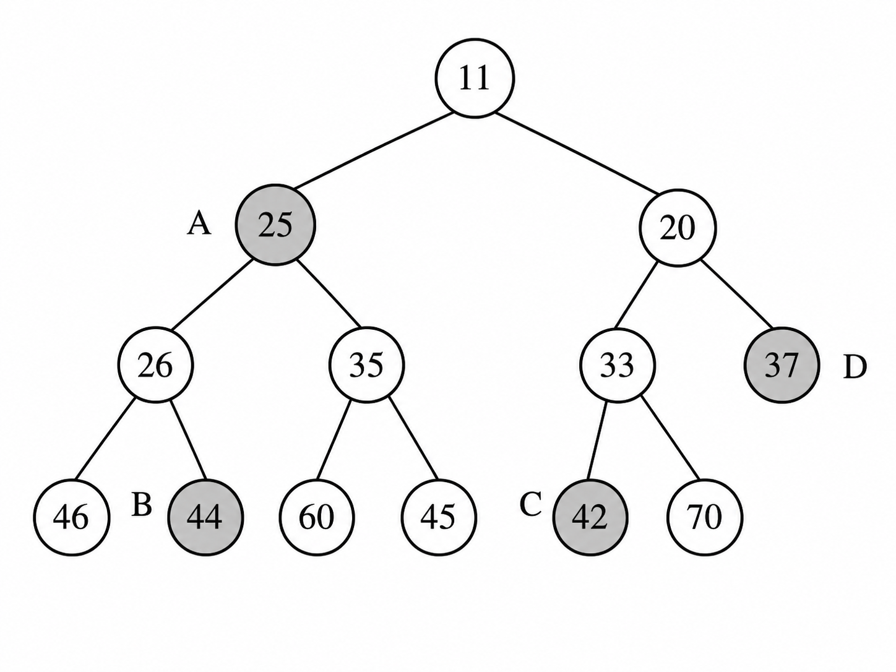
A. A
B. B
C. C
D. D

- 答案：C
- 解析：图中是一个小根堆，11 为堆顶。删除堆顶时，将堆的最后一个结点 70 移到根结点位置，并将堆的元素个数减 1，然后对 70 进行向下调整。

  调整过程如下：

  1. 根结点 70 的两个孩子为 25 和 20，应与较小的 20 交换。
  2. 70 下沉到原 20 的位置，其孩子为 33 和 37，应与较小的 33 交换。
  3. 70 继续下沉，其剩余孩子为 42，应再与 42 交换。

  因此 70 最终移动到原来 42 所在的位置，即图中的 C 位置，故选 C。

  A 位置最终仍位于左子树上；B 是结点 44 所在位置；D 是结点 37 所在位置，均不是 70 向下调整后的最终位置。

<br>
<br>

4. **【竟成·模拟四-11】** 下列关于堆的性质，正确的是（）。
I. 对于大根堆的每一个非根结点i来说，设其父结点是i.parent，关键字是i.key，那么对任意一个i有i.key≤i.parent.key
II. 一棵二叉哈夫曼树同时也是一个堆
III. 堆在维护时是按照从上往下的流程，每一步的调整一定需要两次结点的比较
IV. 在n个元素中选择前k个最小的元素(n≫k)，可以通过大小为k的小根堆实现
A. I
B. I、II
C. I、III
D. III、IV

- 答案：A
- 解析：逐项判断如下。

  - I 正确。大根堆满足任意父结点的关键字不小于其孩子结点，因此每个非根结点 \(i\) 都满足：

    \[
    i.key\le i.parent.key
    \]

  - II 错误。二叉哈夫曼树的内部结点权值虽然等于两个孩子权值之和，通常大于孩子，但哈夫曼树不一定是完全二叉树；而堆必须首先是一棵完全二叉树，因此哈夫曼树不一定是堆。
  - III 错误。向下调整时，若结点只有一个孩子，则无须比较两个孩子；若已满足堆序，也可能提前结束，所以并非每一步一定进行两次结点比较。
  - IV 错误。从 \(n\) 个元素中选出最小的 \(k\) 个元素，通常维护一个大小为 \(k\) 的大根堆，使堆顶保存当前 \(k\) 个最小元素中的最大者。遇到更小元素时替换堆顶。若使用小根堆，则难以在 \(O(\log k)\) 时间删除当前集合中的最大元素。

  因此只有 I 正确，故选 A。

<br>
<br>

5. **【竟成·模拟五-11】** 关于堆排序，下述叙述正确的是（）。
A. 假设一个最大堆的所有元素都不同，那么该堆的最小元素一定位于最后一层的结点内
B. 一个递增有序的数组一定是一个小根堆
C. 值为(23,17,14,6,13,10,1,5,8,12)的数组是一个大根堆
D. 用数组存储含有n个元素的堆时（数组从下标1开始存储），叶结点的下标范围是⌊n/2⌋~n

- 答案：B
- 解析：逐项分析如下。

  - A 错误。最大堆的最小元素必定位于叶结点，但完全二叉树的叶结点不一定全部位于最深一层；当最后一层未满时，倒数第二层也可能存在叶结点。因此不能断言最小元素一定位于最后一层。
  - B 正确。递增有序数组从下标 1 开始存储时，对任意父结点下标 \(i\)，其孩子下标为 \(2i\) 和 \(2i+1\)，均大于 \(i\)。由于数组递增，父结点值必不大于孩子结点值，满足小根堆性质。
  - C 错误。数组中下标 4 的元素为 6，其孩子分别为下标 8 的 5 和下标 9 的 8。大根堆要求父结点不小于孩子，但 \(6<8\)，因此不是大根堆。
  - D 错误。数组下标从 1 开始时，最后一个非叶结点下标为 \(\lfloor n/2\rfloor\)，叶结点下标范围应为：

    \[
    \lfloor n/2\rfloor+1,\ldots,n
    \]

  因此选 B。

<br>
<br>

6. **【竟成·模拟六-08】** 下列数据结构中，从根结点到任意叶结点的路径都是有序的是（）。
A. AVL
B. 二叉查找树
C. 红黑树
D. 堆

- 答案：D
- 解析：堆具有明确的父子关键字大小关系。

  - 对大根堆，任意父结点关键字均不小于孩子结点，因此从根到叶的路径按关键字非递增。
  - 对小根堆，任意父结点关键字均不大于孩子结点，因此从根到叶的路径按关键字非递减。

  所以堆中从根到任意叶结点的路径必然有序。

  AVL 树和红黑树本质上都是二叉查找树，它们保证左子树关键字小于根、右子树关键字大于根，但一条从根到叶的路径可能交替经过左孩子和右孩子，关键字不一定整体单调。普通二叉查找树同理。因此选 D。

#### 8.5 归并排序、基数排序和计数排序

##### 8.5.1 归并排序

<br>
<br>

1. **【竟成·模拟二-11】** 对采用单链表实现的线性表进行排序，要求只能通过调整链表指针的方式进行排序。则下列排序算法平均时间复杂度最低的是（）。
A. 冒泡排序
B. 归并排序
C. 快速排序
D. 插入排序

- 答案：B
- 解析：单链表只能顺序访问，且题目要求只能调整结点指针，不能通过交换结点中的数据完成排序。归并排序最适合这种存储结构。

  对单链表进行归并排序时，可以用快慢指针将链表分成两段，递归排序后再通过修改 `next` 指针合并两个有序链表。合并长度分别为 \(m\) 和 \(n\) 的两个有序链表只需 \(O(m+n)\) 时间，因此整体时间复杂度为：

  \[
  O(n\log_2 n)
  \]

  且不需要顺序表那样的辅助数组。

  - 冒泡排序和插入排序的平均时间复杂度均为 \(O(n^2)\)。
  - 快速排序虽然在顺序表上的平均时间复杂度也是 \(O(n\log_2 n)\)，但其经典划分过程依赖从区间两端扫描，不适合只能单向访问的单链表；在链表上实现时也不如归并排序自然、稳定。

  因此选 B。

#### 8.6 各种内部排序算法的比较及应用

##### 8.6.1 内部排序算法的比较

<br>
<br>

1. **【王道·卷二-Q10】** 假设在快速排序算法中总是选择待排序子序列中的最后一个元素作为基准，则这个算法的最坏情况出现在（  ）。<br>
A. 待排序序列初始有序时
B. 待排序序列呈现中间小并逐次向两边增大的情况
C. 待排序序列呈现中间大并逐次向两边减小的情况
D. 以上选项都不是

- 答案：A
- 解析：快速排序的性能取决于每次划分后两个子表是否均衡。若每次选取待排序子序列的最后一个元素作为枢轴，而原序列已经递增有序，则枢轴始终是当前子序列中的最大元素；若原序列递减有序，则枢轴始终是最小元素。

  此时每次划分只能确定一个元素的位置，两个子表的规模分别为 \(n-1\) 和 \(0\)，递归深度达到 \(n\)，比较次数为：

  \[
  (n-1)+(n-2)+\cdots+1=\frac{n(n-1)}{2}
  \]

  时间复杂度退化为 \(O(n^2)\)。选项 A 所述“初始有序”包含这种极端不均衡情形，故选 A。

<br>
<br>

2. **【王道·卷四-Q10】** 对一组数据(84,47,15,21,25)排序，数据在排序过程中的变化如下：<br>
1) 84 47 15 21 25; 2) 25 47 15 21 84; 3) 21 25 15 47 84; 4) 15 21 25 47 84
则所采用的排序方法是（  ）。
A. 堆排序
B. 冒泡排序
C. 快速排序
D. 插入排序

- 答案：A
- 解析：初始序列本身已经满足大根堆性质：

  ```text
          84
        /    \
      47      15
     /  \
   21   25
  ```

  堆排序每趟将堆顶最大元素与当前无序区的最后一个元素交换，再对剩余无序区进行向下调整。

  - 第 1 趟先交换 84 和 25，得到 `25 47 15 21 84`；调整后无序区重新成为大根堆。
  - 第 2 趟交换当前堆顶 47 与无序区末尾元素，得到题中第 3 个状态。
  - 后续继续交换和调整，最终得到 `15 21 25 47 84`。

  题目列出的状态是各趟将堆顶元素放到最终位置后的关键状态，符合堆排序过程，故选 A。

<br>
<br>

3. **【王道·卷六-Q11】** 已知待排序的 \(n\) 个元素可分为 \(n / k\) 组，每组包含 \(k\) 个元素，任一组内的各元素均分别大于前一组内的所有元素且小于后一组内的所有元素，若采用基于比较的排序，其时间下界为（  ）。<br>
A. \(O(n\log_{2}n)\)
B. \(O(n\log_{2}k)\)
C. \(O(k\log_{2}n)\)
D. \(O(k\log_{2}k)\)

- 答案：B
- 解析：各组之间的相对大小关系已经确定，因此无须比较不同组中的元素，只需分别将每组内部的 \(k\) 个元素排好序。

  对一组 \(k\) 个元素采用基于比较的排序，其时间下界为：

  \[
  \Omega(k\log_2 k)
  \]

  一共有 \(n/k\) 组，所以总时间下界为：

  \[
  \frac{n}{k}\cdot\Omega(k\log_2 k)
  =\Omega(n\log_2 k)
  \]

  因此选 B。选项 A 忽略了组间次序已经确定这一条件；C、D 均未正确计入全部 \(n/k\) 组的排序代价。

<br>
<br>

4. **【王道·卷七-Q10】** 在下列排序方法中，时间性能与待排序记录的初始状态无关的是（  ）。<br>
A. 插入排序和快速排序
B. 归并排序和快速排序
C. 选择排序和归并排序
D. 插入排序和归并排序

- 答案：C
- 解析：

  - 简单选择排序无论初始序列如何，都要在剩余无序区中寻找最小元素，关键字比较次数恒为：

    \[
    \frac{n(n-1)}{2}
    \]

  - 归并排序按固定层次不断划分并归并，整体时间复杂度始终为 \(O(n\log_2 n)\)，受初始有序程度影响很小。
  - 插入排序在序列基本有序时接近 \(O(n)\)，逆序时为 \(O(n^2)\)，明显依赖初始状态。
  - 快速排序在划分均衡时为 \(O(n\log_2 n)\)，在枢轴反复落在一端时退化为 \(O(n^2)\)，也依赖初始状态和枢轴选择。

  因此选 C。

<br>
<br>

5. **【王道·卷八-Q11】** 在最好情况下，时间复杂度可以达到线性时间的排序算法是（  ）。<br>
\(①\) 冒泡排序 \(②\) 堆排序 \(③\) 快速排序 \(④\) 归并排序 \(⑤\) 直接插入排序
A. \(①\)
B. \(①⑤\)
C. \(④⑤\)
D. \(②③\)

- 答案：B
- 解析：当序列已经有序时：

  - 使用“本趟是否发生交换”标志的冒泡排序只需扫描一趟即可结束，最好时间复杂度为 \(O(n)\)。
  - 直接插入排序中，每个元素只需与其前驱比较一次，无须移动大量元素，最好时间复杂度为 \(O(n)\)。
  - 堆排序的建堆和反复调整仍需 \(O(n\log_2 n)\) 量级的工作。
  - 经典快速排序即使划分较均衡，最好时间复杂度也是 \(O(n\log_2 n)\)。
  - 归并排序无论初始状态如何，都要完成各层归并，时间复杂度为 \(O(n\log_2 n)\)。

  因此能在最好情况下达到线性时间的是 \(①⑤\)，故选 B。

<br>
<br>

6. **【竟成·模拟一-11】** 对初始关键字序列{49,38,65,97,76,13,27}进行排序，若堆排序采用大根堆且已完成初始建堆，快速排序每次以序列中第一个元素为枢纽，下列关于两趟排序后的结果描述正确的是（）。
A. 堆排序后：{13,49,65,38,27,76,97}。快速排序后：{27,38,13,49,76,97,65}
B. 堆排序后：{13,49,65,38,27,76,97}。快速排序后：{13,27,38,49,65,76,97}
C. 堆排序后：{65,49,13,38,27,76,97}。快速排序后：{27,38,13,49,76,97,65}
D. 堆排序后：{65,49,13,38,27,76,97}。快速排序后：{13,27,38,49,65,76,97}

- 答案：D
- 解析：先分析堆排序。初始序列建成大根堆后为：

  ```text
  97, 76, 65, 38, 49, 13, 27
  ```

  第 1 趟将 97 与末尾 27 交换，并调整剩余 6 个元素，得到：

  ```text
  76, 49, 65, 38, 27, 13, 97
  ```

  第 2 趟将 76 与无序区末尾 13 交换并调整，得到：

  ```text
  65, 49, 13, 38, 27, 76, 97
  ```

  再分析快速排序。第 1 趟以 49 为枢轴进行划分，可得到：

  ```text
  27, 38, 13, 49, 76, 97, 65
  ```

  第 2 趟分别对枢轴两侧的子序列进行划分：左子序列整理为 `13,27,38`，右子序列整理为 `65,76,97`，于是得到：

  ```text
  13, 27, 38, 49, 65, 76, 97
  ```

  两种排序的结果均与 D 一致，故选 D。

<br>
<br>

7. **【竟成·模拟三-11】** 对元素个数相同的不同初始序列进行排序，总的比较次数相同的算法有（）。
A. 选择排序
B. 基数排序和归并排序
C. 冒泡排序和快速排序
D. 堆排序和希尔排序

- 答案：A
- 解析：简单选择排序第 \(i\) 趟都要在剩余 \(n-i+1\) 个元素中寻找最小元素，因此比较次数始终为：

  \[
  (n-1)+(n-2)+\cdots+1=\frac{n(n-1)}{2}
  \]

  与初始序列的排列状态无关。

  - 冒泡排序若带提前结束机制，其比较趟数会受初始有序程度影响。
  - 快速排序的比较次数与枢轴划分是否均衡密切相关。
  - 归并排序在合并两个有序段时，比较次数会因某一段何时耗尽而变化。
  - 堆排序和希尔排序的比较次数也受元素分布及调整过程影响。
  - 基数排序不是基于关键字比较的排序，不能与归并排序共同作为本题的正确组合。

  因此选 A。

<br>
<br>

8. **【竟成·模拟四-10】** 对于不同的初始序列，总的排序趟数会改变的算法有（）。
A. 冒泡排序和快速排序
B. 基数排序和归并排序
C. 插入排序
D. 堆排序

- 答案：A
- 解析：

  - 改进的冒泡排序可在某一趟未发生交换时提前结束，因此初始序列越接近有序，实际排序趟数可能越少。
  - 快速排序的递归划分结构取决于每次枢轴位置。划分均衡时递归层数较少，划分极不均衡时递归层数可达到 \(n\)，因此总划分趟数会随初始序列改变。
  - 基数排序的趟数由关键字的位数决定，与初始次序无关。
  - 归并排序的归并层数通常为 \(\lceil\log_2 n\rceil\)，与初始次序无关。
  - 直接插入排序固定进行 \(n-1\) 趟插入。
  - 堆排序固定进行建堆及 \(n-1\) 次输出堆顶的过程。

  因此选 A。

<br>
<br>

9. **【竟成·模拟七-11】** 对各种内部排序方法来说（）。
A. 快速排序时间性能最佳
B. 基数排序和归并排序是稳定的排序方法
C. 快速排序是一种选择排序
D. 堆排序所用的辅助空间较大

- 答案：B
- 解析：逐项判断如下。

  - A 错误。快速排序平均性能较好，但最坏时间复杂度为 \(O(n^2)\)，不能笼统地说其时间性能在所有情况下都最佳。
  - B 正确。归并时若关键字相等，优先取左侧有序段中的元素即可保持稳定性；基数排序在每一位上采用稳定的分配与收集过程，因此也是稳定排序。
  - C 错误。快速排序通过交换记录完成划分，属于交换排序，而不是选择排序。
  - D 错误。堆排序通常只需常数个辅助变量，辅助空间复杂度为 \(O(1)\)，并不大。

  因此选 B。

#### 8.7 外部排序

##### 8.7.3 多路平衡归并与败者树

<br>
<br>

1. **【王道·卷三-Q11】** 6路归并的败者树的深度为（  ）。<br>
A. 3
B. 5
C. 6
D. 4

- 答案：A
- 解析：败者树本质上是一棵用于从 \(k\) 个候选记录中反复选出最小记录的完全二叉比较树。对于 \(k\) 路归并，从叶结点到根结点所需的比较层数为：

  \[
  \left\lceil \log_2 k \right\rceil
  \]

  当 \(k=6\) 时：

  \[
  \left\lceil \log_2 6 \right\rceil=3
  \]

  因此 6 路归并的败者树深度为 3，选择 A。B、C、D 均未按二叉比较树的层数计算。

<br>
<br>

2. **【王道·卷四-Q11】** 18个初始归并段进行5路平衡归并，需要增加（  ）个虚拟归并段。<br>
A. 1
B. 2
C. 3
D. 4

- 答案：C
- 解析：为了构造严格的 \(k\) 路最佳归并树，叶结点数 \(n'\) 应满足：

  \[
  (n'-1)\bmod(k-1)=0
  \]

  本题中 \(n=18\)，\(k=5\)。设需增加 \(d\) 个虚拟归并段，则：

  \[
  \begin{aligned}
  (18+d-1)\bmod 4&=0\\
  (17+d)\bmod 4&=0
  \end{aligned}
  \]

  因为 \(17\bmod 4=1\)，所以最小的非负整数 \(d=3\)。增加 3 个虚拟归并段后，共有 21 个叶结点，满足：

  \[
  (21-1)\bmod 4=0
  \]

  因此选 C。

<br>
<br>

3. **【王道·卷五-Q11】** 外部排序过程中的主要开销是I/O操作，因此可以采取一些措施来缩短I/O时间，则下列说法中正确的是（  ）。<br>
A. 使用置换-选择排序是为了通过减小初始归并段的长度来减少元素之间的比较次数
B. 使用败者树可以优化置换-选择排序来减少元素之间的比较次数
C. 败者树是为了增大归并路数，败者树的路数越多，排序时间就越短
D. 构建的最佳归并树和哈夫曼树一样，只有度为0和2的结点

- 答案：B
- 解析：逐项判断如下。

  - A 错误。置换-选择排序的主要目的恰恰是**增大**初始归并段的平均长度，从而减少初始归并段的数量和后续归并趟数，降低磁盘 I/O 次数。
  - B 正确。在置换-选择排序中，需要反复从内存工作区中选出满足条件的最小记录。若直接顺序查找，每次选择代价较大；利用败者树后，每输出一个记录，只需沿一条从叶到根的路径重新比较，比较次数约为 \(O(\log_2 m)\)，其中 \(m\) 为工作区中的记录数。
  - C 错误。败者树可降低多路归并时选取最小记录的比较代价，从而为增加归并路数提供支持，但归并路数并非越多越好。路数增大还会增加输入缓冲区数量、内存需求及管理开销，不能保证总排序时间一定缩短。
  - D 错误。二路哈夫曼树只有度为 0 和 2 的结点；而 \(k\) 路最佳归并树经过补充虚拟归并段后，非叶结点通常为度 \(k\)，并非仅有度 0 和 2 的结点。

  因此选 B。

<br>
<br>

4. **【王道·卷七-Q11】** 若对29条记录只进行3趟多路平衡归并，则 \(x\) 选取的归并路数至少是（  ）。<br>
A. 2
B. 3
C. 4
D. 5

- 答案：C
- 解析：若将每条记录视为一个初始归并段，进行 \(x\) 路平衡归并，每完成一趟，归并段数量最多缩小为原来的 \(1/x\)。经过 3 趟后能够归并的初始段数最多为：

  \[
  x^3
  \]

  要使 29 个初始段在 3 趟内归并为一个有序段，需要：

  \[
  x^3\ge 29
  \]

  检验各整数：

  \[
  3^3=27<29,\qquad 4^3=64\ge 29
  \]

  因此归并路数至少为 4，选择 C。

##### 8.7.4 置换-选择排序

<br>
<br>

1. **【竟成·模拟七-10】** 下列关于选择-置换排序的说法正确的是（）。
I. 创建初始段文件过程中，需要不断地在内存工作区中选择不小于旧的MINIMAX的最小值，此过程需利用败者树实现
II. 选择新的MINIMAX记录时，为防止新加入的关键字值更小，每个叶结点都附加一个序号位。当进行关键字比较时，先比较序号，序号大的为胜者；序号相同的关键字值小的为胜者
III. 选择-置换排序算法得到的初始归并段的长度并不受内存容量的限制，且获得的归并段的平均长度为内存工作区大小的两倍
A. I、II
B. II、III
C. I、II、III
D. I、II

- 答案：C
- 解析：三项均正确。

  - I 正确。置换-选择排序生成当前初始归并段时，每次应从内存工作区中选择关键字不小于上一输出记录 \(\mathrm{MINIMAX}\) 的最小记录。利用败者树可以高效完成这种反复选择。
  - II 正确。为区分属于当前归并段和下一归并段的记录，可为叶结点附加序号位。按题目采用的比较约定，先比较序号，序号大的记录优先；序号相同时，再让关键字较小的记录获胜。这样即使新读入记录的关键字小于旧的 \(\mathrm{MINIMAX}\)，也不会被错误地输出到当前归并段。
  - III 正确。初始归并段的长度不再被内存工作区容量严格限制。对随机输入而言，置换-选择排序生成的初始归并段平均长度约为工作区容量的 2 倍；在特殊情况下，归并段还可能更长。例如输入本身有序时，一个归并段可包含全部记录。

  因此选择 C。需要注意，原题选项 A 与 D 的文字完全相同，应为题目选项排版重复，但不影响 C 为正确答案。

---

## 计算机组成原理

### 第1章 计算机系统概述

#### 1.2 计算机系统层次结构

##### 1.2.3 计算机软件

<br>
<br>

1. **【竟成·模拟二-12】** 下列软件中，不属于系统软件的是（）。
A. 编译程序
B. 操作系统
C. 文本处理程序
D. 数据库管理系统

- 答案：C
- 解析：

  系统软件用于管理计算机资源、控制系统运行，或为其他软件提供基础运行环境。编译程序属于语言处理程序，操作系统负责管理软硬件资源，数据库管理系统负责数据库的组织与管理，三者都属于系统软件。

  文本处理程序主要帮助用户完成文字录入、编辑和排版等具体任务，属于应用软件，因此选择 C。

  - A：编译程序是系统软件，负责将高级语言源程序翻译为目标程序。
  - B：操作系统是最基本的系统软件。
  - C：文本处理程序面向具体应用需求，属于应用软件。
  - D：数据库管理系统属于系统软件，为数据库应用提供基础服务。

<br>
<br>

2. **【竟成·模拟七-12】** 在高级语言源程序要执行时，将高级语言转换为机器语言，并且翻译一句执行一句，这样的程序为（）。
A. 汇编程序
B. 链接程序
C. 编译程序
D. 解释程序

- 答案：D
- 解析：

  解释程序的工作特点是对高级语言源程序逐句进行翻译，并立即执行已经翻译的语句，即“翻译一句，执行一句”，通常不生成可独立保存的目标程序。因此选择 D。

  - A：汇编程序将汇编语言源程序翻译成机器语言目标程序。
  - B：链接程序将多个目标模块及所需库文件组合成可执行文件。
  - C：编译程序通常一次性翻译整个高级语言源程序，生成目标程序后再执行。
  - D：解释程序边翻译边执行，与题意一致。

##### 1.2.6 计算机系统的工作原理

<br>
<br>

1. **【王道·卷三-Q13】** 某计算机采用小端方式存储，按字节编址，减法指令 `sub ax, imm` 的功能为 \((ax) - imm \rightarrow ax\)。imm表示立即数，该指令对应的机器码为2DXXXX，其中XXXX对应imm的机器码，如果 \(\mathrm{imm} = - 3\)，\((ax) = 7\)，则该指令对应的机器码和执行后 \(SF\) 标志位的值分别为（  ）。<br>
A. 2DFFFD, 0
B. 2DFFFD, 1
C. 2DFDFF, 0
D. 2DFDFF, 1

- 答案：C
- 解析：

  立即数为 16 位，\(-3\) 的 16 位补码为：

  \[
  (-3)_{补}=\mathrm{FFFDH}
  \]

  小端方式规定低有效字节存放在低地址处，因此立即数的两个字节按 \(\mathrm{FDH}\)、\(\mathrm{FFH}\) 的顺序出现在机器码中。操作码为 \(\mathrm{2DH}\)，故完整机器码为：

  \[
  \mathrm{2D\ FD\ FF}
  \]

  即 `2DFDFF`。

  指令执行结果为：

  \[
  (ax)=7-(-3)=10
  \]

  结果为正数，其最高位为 \(0\)，所以符号标志 \(SF=0\)。因此选择 C。

  - A、B：将立即数按大端字节顺序写入，不符合小端存储方式。
  - D：机器码正确，但正数结果的 \(SF\) 应为 \(0\)。

<br>
<br>

2. **【王道·卷三-Q18】** 通常将在部件之间进行数据传输的指令称为传输指令。在下列关于各类传输指令的功能的描述中，错误的是（  ）。<br>
A. 出/入栈指令（push/pop）实现CPU和栈顶之间的数据传输
B. 访存指令（load/store）实现CPU和存储单元之间的数据传输
C. I/O指令（in/out）实现CPU和I/O端口之间的数据传输
D. 寄存器传输指令（move）实现CPU和寄存器之间的数据传输

- 答案：D
- 解析：

  寄存器本身位于 CPU 内部，寄存器传送指令 `move` 实现的是寄存器之间，或寄存器与其他可作为操作数的部件之间的数据传送，而不能表述为“CPU 和寄存器之间”的传送。因此 D 的描述错误。

  - A：`push` 和 `pop` 分别完成 CPU 寄存器与栈顶存储单元之间的数据传送，描述正确。
  - B：`load` 和 `store` 用于 CPU 与主存单元之间的数据传送，描述正确。
  - C：`in` 和 `out` 用于 CPU 与 I/O 端口之间的数据传送，描述正确。
  - D：寄存器属于 CPU 内部部件，应表述为寄存器之间的数据传送。

<br>
<br>

3. **【王道·卷五-Q12】** 冯·诺依曼机可以区分指令和数据的部件是（  ）。<br>
A. 总线
B. 控制器
C. 控制存储器
D. 运算器

- 答案：B
- 解析：

  在冯·诺依曼机中，指令和数据都以二进制形式存放在同一存储器中，单从存储内容的形式上无法区分二者。计算机根据当前所处的工作阶段以及访问目的进行区分：取指周期中取出的内容被送入指令寄存器并由控制器译码，执行周期中取出的内容则作为操作数使用。因此，负责识别和解释指令的是控制器，选择 B。

  - A：总线只负责传输地址、数据和控制信息，不能自行判断内容是指令还是数据。
  - B：控制器负责取指、译码并发出控制信号，能够根据执行过程区分指令和数据。
  - C：控制存储器用于存放微程序控制器中的微指令，不负责区分主存中的指令和数据。
  - D：运算器负责算术和逻辑运算，不负责指令识别。

<br>
<br>

4. **【王道·卷七-Q12】** 在某32位计算机中，全局变量buf的声明为 `int buf[4]={-2,103,-10,-20}`；假定buf的地址为 \(0\times 8049320\)，则地址 \(0\times 804932a\) 中的内容为（  ）。<br>
A. 00000000
B. 11111010
C. 11110101
D. 11111111

- 答案：D
- 解析：

  32 位计算机中 `int` 通常占 4 字节。数组各元素的地址范围为：

  - `buf[0]`：\(0\times8049320\sim0\times8049323\)
  - `buf[1]`：\(0\times8049324\sim0\times8049327\)
  - `buf[2]`：\(0\times8049328\sim0\times804932B\)

  因此地址 \(0\times804932A\) 位于 `buf[2]`，其值为 \(-10\)。\(-10\) 的 32 位补码为：

  \[
  -10=\mathrm{FFFFFFF6H}
  \]

  在常见的小端存储方式下，四个字节按低地址到高地址依次为：

  \[
  \mathrm{F6H},\ \mathrm{FFH},\ \mathrm{FFH},\ \mathrm{FFH}
  \]

  地址 \(0\times804932A\) 是该整数的第 3 个字节，内容为 \(\mathrm{FFH}=11111111_2\)，故选择 D。

  - A：对应字节值为 \(00H\)，与负数补码的高字节不符。
  - B：\(11111010_2=FAH\)，不是 \(-10\) 补码在该地址处的字节。
  - C：\(11110101_2=F5H\)，同样不符。
  - D：\(11111111_2=FFH\)，正确。

<br>
<br>

5. **【竟成·模拟四-12】** 下列关于计算机的说法正确的是（）。
A. 计算机做的所有工作必须先编写成程序才能完成
B. 存储在存储器内部的指令和数据在形式上有所差别
C. CPU的时钟频率越高，计算机的运行速度越快
D. 计算机系统即为硬件系统

- 答案：A
- 解析：

  计算机采用存储程序工作方式，需要通过程序中的指令序列规定数据处理步骤。计算机能够完成的自动处理工作，都必须由程序加以描述并交由计算机执行，因此 A 正确。

  - A：程序是计算机自动完成任务的指令集合，表述正确。
  - B：指令和数据在存储器中都以二进制形式存放，在形式上没有本质差别。
  - C：计算机性能不仅由主频决定，还与指令条数、平均 \(CPI\)、存储系统和体系结构等因素有关。
  - D：完整的计算机系统由硬件系统和软件系统共同组成。

<br>
<br>

6. **【竟成·模拟五-12】** 下列属于冯·诺依曼结构计算机工作方式的基本特点的是（）。
A. 指令按地址访问并顺序执行
B. 采用十进制方式存储和处理数据
C. 指令存储器和数据存储器分离
D. 访问存储器时按内容读取数据

- 答案：A
- 解析：

  冯·诺依曼结构采用“存储程序”工作方式，程序和数据预先存入存储器，CPU 按程序计数器给出的地址取指。除转移指令改变执行顺序外，指令通常按地址顺序依次执行，因此选择 A。

  - A：体现了按地址取指和程序顺序执行的基本方式，正确。
  - B：计算机内部采用二进制表示和处理信息，而不是十进制。
  - C：冯·诺依曼结构的指令和数据存放在同一存储器中；指令存储器和数据存储器分离是哈佛结构的典型特征。
  - D：普通主存按地址访问；按内容访问是相联存储器的特征。

#### 1.3 计算机的性能指标

##### 1.3.1 计算机的主要性能指标

<br>
<br>

1. **【王道·卷一-Q12】** 假定执行一条指令 \(I\) 需要20个时钟周期，该指令在程序中出现的频率为 \(10\%\)，其他所有指令的平均 \(CPI\) 为5，则CPU执行指令 \(I\) 所用的时间占整个CPU时间的比例是多少？（  ）。如果对硬件进行改进能使指令 \(I\) 的执行时间缩短为10个时钟周期，但同时会使CPU时钟周期延长 \(10\%\)，那么是否值得采取这种改进措施？（  ）。<br>
A. \(30.77\%\)，值得
B. \(15.39\%\)，值得
C. \(30.77\%\)，不值得
D. \(15.39\%\)，不值得

- 答案：A
- 解析：

  设程序总指令条数为 \(N\)。指令 \(I\) 占 \(10\%\)，其他指令占 \(90\%\)。改进前程序的总时钟周期数为：

  \[
  N\times 10\%\times20+N\times90\%\times5
  =6.5N
  \]

  其中，执行指令 \(I\) 所用的时钟周期数为 \(2N\)，因此其所占 CPU 时间比例为：

  \[
  \frac{2N}{6.5N}\times100\%
  \approx30.77\%
  \]

  改进后，平均时钟周期数变为：

  \[
  N\times10\%\times10+N\times90\%\times5
  =5.5N
  \]

  但新的时钟周期长度是原来的 \(1.1\) 倍，因此新旧 CPU 执行时间之比为：

  \[
  \frac{T_{新}}{T_{旧}}
  =\frac{5.5N\times1.1T}{6.5N\times T}
  =\frac{6.05}{6.5}
  \approx0.931
  \]

  新执行时间小于原执行时间，约缩短 \(6.9\%\)，所以改进值得采用。故选择 A。

  - B、D：错误地按指令条数比例或其他方式计算了时间占比。
  - C：时间占比正确，但误判了改进后的总执行时间。

<br>
<br>

2. **【王道·卷二-Q12】** 下面给出了改善计算机性能的四种可能措施：<br>
I. 用更快速的处理器替换原来的慢速处理器
II. 增加同类处理器的个数，使不同的处理器能同时执行程序
III. 优化编译生成的代码，减少程序执行的总时钟周期数
IV. 缩短指令执行过程中访问内存的时间
其中能够缩短CPU执行时间的措施是（  ）。
A. I、II、III
B. I、II、IV
C. I、III、IV
D. I、II、III、IV

- 答案：D
- 解析：

  CPU 执行时间可表示为：

  \[
  T_{CPU}=\text{指令条数}\times CPI\times\text{时钟周期长度}
  \]

  也可写为：

  \[
  T_{CPU}=\frac{\text{指令条数}\times CPI}{\text{主频}}
  \]

  四项措施都可能缩短程序的执行时间：

  - I：更快速的处理器通常具有更高主频或更高单周期处理能力，可缩短执行时间。
  - II：对于可并行处理的程序，增加处理器数量可将任务分配给多个处理器同时执行，从而缩短完成时间。
  - III：编译优化可减少指令条数或总时钟周期数，直接缩短执行时间。
  - IV：缩短访存时间可减少存储器等待周期，降低平均 \(CPI\)，从而缩短执行时间。

  因此 I、II、III、IV 均正确，选择 D。

  - A、B、C：都遗漏了至少一种能够改善执行时间的有效措施。

<br>
<br>

3. **【王道·卷三-Q12】** 假定 \(M1\) 和 \(M2\) 是以不同方式实现同一个指令集的两种机器，\(M1\) 的时钟频率为 \(800\mathrm{MHz}, M2\) 的时钟频率为 \(400\mathrm{MHz}\)。该指令集中共有 \(A\)、\(B\) 和 \(C\) 三类指令。有两种不同的编译器 \(C1\) 和 \(C2\)，假设对同一个程序而言，两种编译器生成的代码中的指令总条数相等，但各类指令的组合情况不同。各类指令在 \(M1\) 和 \(M2\) 上运行时，所需的平均时钟周期数和两种编译器生成的代码中各类指令所占的比例如下表所示。若在 \(M1\) 和 \(M2\) 上都用 \(C1\) 编译器，则 \(M1\) 的执行速度约是 \(M2\) 的（  ）倍；若在 \(M1\) 和 \(M2\) 上都用 \(C2\) 编译器，则 \(M2\) 的执行速度约是 \(M1\) 的（  ）倍。<br>

| 指令类 | M1的CPI | M2的CPI | C1的程序 | C2的程序 |
| ------ | ------- | ------- | -------- | -------- |
| A      | 2       | 1       | 30%      | 30%      |
| B      | 3       | 2       | 50%      | 20%      |
| C      | 4       | 1.5     | 20%      | 50%      |

A. 1.2, 1.1
B. 1.1, 1.2
C. 1.1, 1.1
D. 1.2, 1.2

- 答案：C
- 解析：

  对于相同程序，若指令总条数为 \(N\)，则 CPU 执行时间为：

  \[
  T=\frac{N\times CPI}{f}
  \]

  使用编译器 \(C1\) 时，两台机器的平均 \(CPI\) 分别为：

  \[
  \begin{aligned}
  CPI_{M1,C1}
  &=2\times30\%+3\times50\%+4\times20\%\\
  &=2.9,\\
  CPI_{M2,C1}
  &=1\times30\%+2\times50\%+1.5\times20\%\\
  &=1.6.
  \end{aligned}
  \]

  因为“执行速度”与执行时间成反比，所以 \(M1\) 相对于 \(M2\) 的速度倍数为：

  \[
  \frac{V_{M1}}{V_{M2}}
  =\frac{T_{M2}}{T_{M1}}
  =\frac{1.6/400}{2.9/800}
  =\frac{3.2}{2.9}
  \approx1.1
  \]

  使用编译器 \(C2\) 时：

  \[
  \begin{aligned}
  CPI_{M1,C2}
  &=2\times30\%+3\times20\%+4\times50\%\\
  &=3.2,\\
  CPI_{M2,C2}
  &=1\times30\%+2\times20\%+1.5\times50\%\\
  &=1.45.
  \end{aligned}
  \]

  此时 \(M2\) 相对于 \(M1\) 的速度倍数为：

  \[
  \frac{V_{M2}}{V_{M1}}
  =\frac{T_{M1}}{T_{M2}}
  =\frac{3.2/800}{1.45/400}
  =\frac{1.6}{1.45}
  \approx1.1
  \]

  因此两空均约为 \(1.1\)，选择 C。

  - A、B、D：均至少有一个速度比计算错误。比较速度时不能只比较主频或平均 \(CPI\)，必须综合使用 \(T=N\times CPI/f\)。

<br>
<br>

4. **【王道·卷四-Q12】** 已知一台时钟频率为 \(2GHz\) 的计算机的CPI为1.2。某程序 \(P\) 在该计算机上的指令条数为 \(4\times 10^{9}\) 条。若在该计算机上程序 \(P\) 从开始启动到执行结束所经历的时间是4s，则运行 \(P\) 所用的CPU时间占整个CPU时间的百分比大约是（  ）。<br>
A. \(40\%\)
B. \(60\%\)
C. \(80\%\)
D. \(100\%\)

- 答案：B
- 解析：

  程序的 CPU 执行时间为：

  \[
  \begin{aligned}
  T_{CPU}
  &=\frac{\text{指令条数}\times CPI}{\text{主频}}\\
  &=\frac{4\times10^9\times1.2}{2\times10^9}\\
  &=2.4\mathrm{s}
  \end{aligned}
  \]

  程序从启动到结束的总经历时间为 \(4\mathrm{s}\)，其中可能还包含 I/O 等待、操作系统服务等非 CPU 执行时间。因此 CPU 时间所占比例为：

  \[
  \frac{2.4}{4}\times100\%=60\%
  \]

  故选择 B。

  - A、C：均不是根据指令条数、\(CPI\) 和主频计算得到的比例。
  - D：只有当程序的全部经历时间都用于占用 CPU 时才成立，本题 CPU 时间仅为 \(2.4\mathrm{s}\)。

<br>
<br>

5. **【王道·卷五-Q21】** 某支持猝发传输的同步总线的时钟频率为200MHz，带宽为32位，地址和数据线复用，每个时钟周期传输一个地址或数据。若一次存储器读总线事务传输用的时间为25ns，第一个周期传输地址和命令，则本次传输的有效数据位数是（  ）。<br>
A. 32位
B. 160位
C. 128位
D. 256位

- 答案：C
- 解析：

  总线时钟频率为 \(200\mathrm{MHz}\)，一个时钟周期为：

  \[
  T=\frac{1}{200\times10^6}=5\mathrm{ns}
  \]

  一次总线事务持续 \(25\mathrm{ns}\)，包含的时钟周期数为：

  \[
  \frac{25}{5}=5
  \]

  第一个周期用于传输地址和命令，因此真正用于传输数据的周期数为：

  \[
  5-1=4
  \]

  每个数据周期可传输 \(32\) 位，所以有效数据位数为：

  \[
  4\times32=128\text{位}
  \]

  因此选择 C。

  - A：只计算了一个数据周期传输的数据量。
  - B：将全部 5 个周期都误认为数据传输周期，忽略了首周期传输地址和命令。
  - D：相当于误算为 8 个数据周期。

<br>
<br>

6. **【王道·卷六-Q22】** 某计算机系统中的软盘以中断方式与CPU进行数据传输，CPU的主频为50MHz，传输单位为16bit，软盘的数据传输率为50KB/s。若每次传输的开销（包括中断）为100个时钟周期，则软盘工作时CPU用于软盘数据传输的时间占整个CPU时间的比例是（  ）。<br>
A. \(5\%\)
B. \(10\%\)
C. \(15\%\)
D. \(20\%\)

- 答案：A
- 解析：

  每次传输单位为 \(16\mathrm{bit}=2\mathrm{B}\)。按 \(1\mathrm{KB}=1024\mathrm{B}\) 计算，每秒传输次数为：

  \[
  \frac{50\times1024}{2}=25600\text{次/秒}
  \]

  每次传输需要 CPU 开销 \(100\) 个时钟周期，因此每秒用于软盘传输的时钟周期数为：

  \[
  25600\times100=2.56\times10^6
  \]

  CPU 每秒共有：

  \[
  50\mathrm{MHz}=50\times10^6\text{个时钟周期}
  \]

  因此占用比例为：

  \[
  \frac{2.56\times10^6}{50\times10^6}\times100\%
  =5.12\%
  \approx5\%
  \]

  故选择 A。若按 \(1\mathrm{KB}=1000\mathrm{B}\) 近似计算，则结果恰为 \(5\%\)，选项不变。

  - B、C、D：均高估了每秒中断次数或每次中断所占用的 CPU 周期数。

<br>
<br>

7. **【竟成·模拟一-12】** 某机器M的主频为100MHz。程序P中最初没有左移2位指令，对P进行优化，将程序中所有的乘4指令都换成左移2位指令，得到优化后的程序P1。已知在M上执行程序P时访问乘4指令的Cache命中率为90%，命中后的CPI为94，程序执行时间为12s。执行程序P1时访问左移2位指令的Cache命中率为99%，命中后的CPI为3，程序执行时间为10s。当Cache未命中时都需要额外的100个时钟周期进行访存取指，则P中乘4指令被换成左移2位指令的数量是（）。
A. 1×10⁶
B. 2×10⁶
C. 3×10⁶
D. 4×10⁶

- 答案：B
- 解析：

  乘 4 指令的 Cache 未命中率为 \(10\%\)，其平均 \(CPI\) 为：

  \[
  CPI_{乘4}=94+10\%\times100=104
  \]

  左移 2 位指令的 Cache 未命中率为 \(1\%\)，其平均 \(CPI\) 为：

  \[
  CPI_{左移}=3+1\%\times100=4
  \]

  每替换一条指令可减少的时钟周期数为：

  \[
  104-4=100
  \]

  优化前后程序执行时间减少：

  \[
  12-10=2\mathrm{s}
  \]

  主频为 \(100\mathrm{MHz}\)，对应减少的总时钟周期数为：

  \[
  2\times100\times10^6=2\times10^8
  \]

  设被替换的乘 4 指令共有 \(N\) 条，则：

  \[
  100N=2\times10^8
  \]

  解得：

  \[
  N=2\times10^6
  \]

  因此选择 B。

  - A、C、D：均与优化所减少的总时钟周期数不符。

<br>
<br>

8. **【竟成·模拟三-12】** 某基准程序在主频为200MHz的处理器上运行，编译生成的指令类型及数目如下表所示，该基准程序的执行时间和有效MIPS分别是（）。

| 指令类 | CPI | 指令条数 |
| ------ | --- | -------- |
| A      | 1   | 4500     |
| B      | 3   | 200      |
| C      | 1   | 500      |
| D      | 2   | 800      |

A. 8500ns、118
B. 170μs、235
C. 85μs、118
D. 17000ns、235

- 答案：题面无正确选项；按题面数据应为 \(36\mu\mathrm{s}\)、约 \(166.7\mathrm{MIPS}\)
- 解析：

  程序执行的总指令条数为：

  \[
  N=4500+200+500+800=6000
  \]

  总时钟周期数为各类指令的“指令条数乘以 \(CPI\)”之和：

  \[
  \begin{aligned}
  C
  &=4500\times1+200\times3+500\times1+800\times2\\
  &=4500+600+500+1600\\
  &=7200
  \end{aligned}
  \]

  主频为 \(200\mathrm{MHz}\)，一个时钟周期为：

  \[
  \frac{1}{200\times10^6}=5\mathrm{ns}
  \]

  因此程序执行时间为：

  \[
  T=7200\times5\mathrm{ns}=36000\mathrm{ns}=36\mu\mathrm{s}
  \]

  有效 MIPS 为：

  \[
  \begin{aligned}
  \mathrm{MIPS}
  &=\frac{6000}{36\times10^{-6}\times10^6}\\
  &=\frac{6000}{36}\\
  &\approx166.7
  \end{aligned}
  \]

  所以依据题面表格，正确结果应为 \(36\mu\mathrm{s}\)、约 \(166.7\mathrm{MIPS}\)，四个选项均不匹配，题目数据或选项应存在排版错误。

  - A、B、C、D：其执行时间均不等于 \(7200\) 个时钟周期在 \(200\mathrm{MHz}\) 主频下对应的 \(36\mu\mathrm{s}\)，相应 MIPS 也与总指令条数 \(6000\) 不符。

<br>
<br>

9. **【竟成·模拟六-12】** 假定计算机M₁和M₂具有相同的指令集体系结构(ISA)，M₁的主频为800MHz，某基准程序P在M₁和M₂上运行分别需要12s和8s，M₂的平均CPI为M₁的1.5倍，则M₂的主频为（）。
A. 800MHz
B. 1.2GHz
C. 1.5GHz
D. 1.8GHz

- 答案：D
- 解析：

  两台机器具有相同的 ISA，对同一个基准程序执行的指令条数相同。设指令条数为 \(N\)，\(M1\) 的平均 \(CPI\) 为 \(CPI_1\)，则：

  \[
  \begin{aligned}
  T_1&=\frac{N\times CPI_1}{f_1}=12\mathrm{s},\\
  T_2&=\frac{N\times1.5CPI_1}{f_2}=8\mathrm{s}.
  \end{aligned}
  \]

  两式相除：

  \[
  \frac{T_1}{T_2}
  =\frac{CPI_1/f_1}{1.5CPI_1/f_2}
  =\frac{f_2}{1.5f_1}
  \]

  代入 \(T_1/T_2=12/8=1.5\)、\(f_1=800\mathrm{MHz}\)：

  \[
  1.5=\frac{f_2}{1.5\times800\mathrm{MHz}}
  \]

  因而：

  \[
  f_2=1.5\times1.5\times800\mathrm{MHz}=1800\mathrm{MHz}=1.8\mathrm{GHz}
  \]

  故选择 D。

  - A、B、C：均不足以抵消 \(M2\) 平均 \(CPI\) 增大到 \(1.5\) 倍的影响，同时实现运行时间由 \(12\mathrm{s}\) 缩短到 \(8\mathrm{s}\)。

### 第2章 数据的表示和运算

#### 2.1 数制与编码

##### 2.1.2 定点数的编码表示

<br>
<br>

1. **【王道·卷二-Q13】** 在某8位计算机中，假定 \(x\) 和 \(y\) 是两个带符号整数变量，用补码表示有 \([x]_{补} = 44H, [y]_{补} = DCH\)，则 \(x / 2 + 2y\) 的机器数以及相应的溢出标志 \(OF\) 分别是（  ）。<br>
A. CAH、0
B. CAH、1
C. DAH、0
D. DAH、1

- 答案：C
- 解析：

  \([x]_{补}=44\mathrm{H}=0100\ 0100\mathrm{B}\)，符号位为 \(0\)，所以：

  \[
  x=68
  \]

  \([y]_{补}=\mathrm{DC H}=1101\ 1100\mathrm{B}\)，符号位为 \(1\)。其真值为：

  \[
  y=220-256=-36
  \]

  因此：

  \[
  \frac{x}{2}+2y=34-72=-38
  \]

  \(-38\) 的 8 位补码为：

  \[
  2^8-38=218=\mathrm{DA H}
  \]

  8 位补码的表示范围为 \([-128,127]\)，结果 \(-38\) 在范围内，未发生溢出，因此 \(OF=0\)。故选择 C。

  - A、B：机器数 CAH 表示的真值是 \(-54\)，与计算结果不符。
  - D：机器数 DAH 正确，但本题结果未溢出，\(OF\) 应为 \(0\)。

<br>
<br>

2. **【王道·卷六-Q17】** 某计算机按字节编址，采用小端方式存储，其中某指令的一个操作数为16位，该操作数采用基址寻址方式，指令中的形式地址（用补码表示）为FF00H，当前基址寄存器的内容为C0000000H，则该操作数的MSB存放的地址是（  ）。<br>
A. C000FF00H
B. C000FF01H
C. BFFFFF00H
D. BFFFFF01H

- 答案：D
- 解析：

  形式地址 \(\mathrm{FF00H}\) 是 16 位补码，最高位为 \(1\)，表示负数。符号扩展到 32 位后为：

  \[
  \mathrm{FFFFFF00H}=-256
  \]

  有效地址为基址寄存器内容与符号扩展后的形式地址之和：

  \[
  \begin{aligned}
  EA
  &=\mathrm{C0000000H}+\mathrm{FFFFFF00H}\\
  &=\mathrm{BFFFFF00H}
  \end{aligned}
  \]

  该操作数为 16 位，占两个字节。小端方式把最低有效字节 LSB 存放在低地址 \(EA\)，把最高有效字节 MSB 存放在高地址 \(EA+1\)。因此 MSB 的地址为：

  \[
  \mathrm{BFFFFF00H}+1=\mathrm{BFFFFF01H}
  \]

  故选择 D。

  - A、B：错误地把 \(\mathrm{FF00H}\) 当作无符号正数直接与基址相加。
  - C：这是操作数最低有效字节 LSB 的存放地址，而不是 MSB 的地址。

<br>
<br>

3. **【王道·卷七-Q18】** 假设相对寻址的转移指令占 \(2B\)，第一个字节是操作码，第二个字节是相对位移量，用补码表示。每当 \(CPU\) 从存储器中取出 \(1B\) 时，即自动完成 \((PC) + 1 \rightarrow PC\)。若当前 \(PC\) 值为 \(2000H, 2000H\) 处的指令为 \(JMP* - 9\)（\(*\) 为相对寻址特征），则执行这条指令后，\(PC\) 值为（  ）。<br>
A. 1FF7H
B. 1FF8H
C. 1FF9H
D. 1FFAH

- 答案：C
- 解析：

  当前 \(PC=2000\mathrm{H}\)。该转移指令占 \(2\mathrm{B}\)，CPU 每取出一个字节，\(PC\) 自动加 \(1\)。因此完成取指后：

  \[
  PC=2000\mathrm{H}+2=2002\mathrm{H}
  \]

  相对寻址的目标地址以“取完整条指令后的 \(PC\)”为基准，再加上带符号位移量。位移量为 \(-9\)，所以：

  \[
  \begin{aligned}
  PC_{目标}
  &=2002\mathrm{H}-9\\
  &=1FF9\mathrm{H}
  \end{aligned}
  \]

  故选择 C。

  - A：直接用取指前的 \(2000\mathrm{H}\) 加 \(-9\)，忽略了取指过程中 \(PC\) 已增加 \(2\)。
  - B、D：对指令长度或负位移量的计算存在偏差。

<br>
<br>

4. **【王道·卷八-Q12】** 某计算机按字节编址，采用小端方式存储信息。其中，某指令的一个操作数为16位，该操作数采用基址寻址方式，指令中的形式地址（用补码表示）为 \(FF00H\)，当前基址寄存器的内容为C0000000H，则该操作数的LSB中存放的地址是（  ）。<br>
A. BFFFFF00H
B. BFFFFF01H
C. C000FF00H
D. C000FF01H

- 答案：A
- 解析：

  形式地址 \(FF00H\) 是一个16位补码。由于最高位为 \(1\)，它表示负数，符号扩展到32位后为：

  \[
  \mathrm{FFFFFF00H}=-256
  \]

  基址寻址的有效地址为基址寄存器内容与符号扩展后的形式地址之和：

  \[
  \begin{aligned}
  EA
  &=\mathrm{C0000000H}+\mathrm{FFFFFF00H}\\
  &=\mathrm{BFFFFF00H}
  \end{aligned}
  \]

  该操作数为16位，占两个字节。小端方式把最低有效字节 LSB 存放在低地址，把最高有效字节 MSB 存放在高地址。因此，LSB 所在地址就是有效地址 \(EA\)，即 \(\mathrm{BFFFFF00H}\)。故选择 A。

  - B：是该16位操作数的 MSB 所在地址。
  - C、D：错误地将 \(FF00H\) 当作无符号正数参与地址计算。

<br>
<br>

5. **【王道·卷八-Q18】** 假定采用相对寻址方式的转移指令占2B，第一个字节是操作码，第二个字节是相对位移量（用补码表示）。取指令时，每次CPU从存储器中取出一个字节，并且自动完成 \(PC + 1\rightarrow PC\) 操作。假设执行到某条转移指令时（取指令前），\(PC\) 的内容为200CH，该指令的转移目标地址为1FB0H，则该转移指令的第二个字节的内容应是（  ）。<br>
A. 5CH
B. 5EH
C. 42H
D. 4AH

- 答案：源题选项有误，正确结果应为 A2H
- 解析：

  该指令共占 \(2\mathrm{B}\)。取指令前 \(PC=200CH\)，每取一个字节 \(PC\) 自动加 \(1\)，因此整条指令取完后：

  \[
  PC=200CH+2=200EH
  \]

  相对寻址满足：

  \[
  \text{目标地址}=\text{取指结束后的 }PC+\text{相对位移量}
  \]

  因而相对位移量为：

  \[
  \begin{aligned}
  \Delta
  &=1FB0H-200EH\\
  &=-5EH
  \end{aligned}
  \]

  第二个字节采用8位补码表示。\(-5EH\) 的8位补码为：

  \[
  100H-5EH=A2H
  \]

  所以第二个字节应为 \(A2H\)。原题给出的 A～D 四个选项均不等于 \(A2H\)，属于选项录入错误。合并题库后文的同题“竟成·模拟三-16”中给出了 \(A2H\) 这一正确选项，可相互印证。

  - A、B：分别是正数 \(5CH\)、\(5EH\)，没有按补码表示负位移。
  - C、D：对应的位移量也无法使 \(PC\) 从 \(200EH\) 转移到 \(1FB0H\)。

<br>
<br>

6. **【竟成·模拟七-14】** 一个8位的二进制整数由2个“0”和6个“1”组成，采用补码或者移码表示，则下列说法中正确的是（）。
A. 若采用移码表示，偏置值为127，则此整数最小为-64
B. 若采用移码表示，偏置值为128，则此整数最大为123
C. 若采用补码表示，则此整数最小为-96
D. 若采用补码表示，则此整数最大为252

- 答案：A
- 解析：

  该8位编码中恰有2个 \(0\) 和6个 \(1\)。

  **判断 A：**移码偏置值为127时，真值等于无符号编码值减去127。要使真值最小，应使编码值最小，即把两个 \(0\) 放在最高两位：

  \[
  00111111_2=63
  \]

  因此最小真值为：

  \[
  63-127=-64
  \]

  A 正确。

  **判断 B：**偏置值为128时，要使真值最大，应使编码值最大，即把两个 \(0\) 放在最低两位：

  \[
  11111100_2=252
  \]

  最大真值为：

  \[
  252-128=124
  \]

  不是123，B错误。

  **判断 C：**补码表示的最小值应为符号位为 \(1\) 时数值最小的编码。将两个 \(0\) 放在次高位和第三高位，得到：

  \[
  10011111_2=159
  \]

  对应真值为：

  \[
  159-256=-97
  \]

  不是 \(-96\)，C错误。

  **判断 D：**补码表示的最大正数必须符号位为 \(0\)。另一个 \(0\) 放在最低位时编码最大：

  \[
  01111110_2=126
  \]

  最大值是126，不是252，D错误。

##### 2.1.4 C语言中的整数类型及类型转换

<br>
<br>

1. **【王道·卷一-Q18】** 假定编译器对C语言程序中的变量和计算机中的寄存器做了以下分配：变量 \(f\)、\(g\)、\(h\)、\(i\) 和 \(j\) 分别分配到寄存器 \(s0\)、\(s1\)、\(s2\)、\(s3\) 和 \(s4\) 中，并将一条C语言赋值语句编译后，生成如下汇编代码序列，第一个操作数是目的操作数。<br>

```text
add t0, s1, s2
add t1, s3, s4
sub s0, t0, t1
```

这条C语言赋值语句是（  ）。
A. \(f = (g + i) - (h + j)\)
B. \(f = (g + h) - (i + j)\)
C. \(f = (g + j) - (h + i)\)
D. \(f = (h + j) - (g + i)\)

- 答案：B
- 解析：

  根据寄存器分配关系：

  \[
  s0\leftrightarrow f,\quad s1\leftrightarrow g,\quad s2\leftrightarrow h,\quad s3\leftrightarrow i,\quad s4\leftrightarrow j
  \]

  第一条指令：

  ```text
  add t0, s1, s2
  ```

  表示：

  \[
  t0=g+h
  \]

  第二条指令表示：

  \[
  t1=i+j
  \]

  第三条指令：

  ```text
  sub s0, t0, t1
  ```

  表示：

  \[
  f=t0-t1=(g+h)-(i+j)
  \]

  故选择 B。其余选项均与寄存器的对应关系或减法的操作数顺序不符。

<br>
<br>

2. **【王道·卷四-Q13】** 某C语言程序在一台32位机器上运行，程序中定义了一个`unsigned short`型变量 \(us = 2^{15}\)，一个`int`型变量 \(x\)，则执行赋值语句 \(x = us\) 后，\(x\) 的值变为（  ）。<br>
A. \(2^{15}\)
B. \(-2^{15}\)
C. \(2^{32} - 2^{15}\)
D. \(2^{31}\)

- 答案：A
- 解析：

  `unsigned short`通常为16位，其表示范围为：

  \[
  0\sim 2^{16}-1
  \]

  因此 \(us=2^{15}=32768\) 可以被准确表示。将16位无符号整数转换为32位 `int` 时，由于32位 `int` 的表示范围包含32768，系统进行零扩展，高位补 \(0\)：

  \[
  1000\ 0000\ 0000\ 0000
  \longrightarrow
  0000\ 0000\ 0000\ 0000\ 1000\ 0000\ 0000\ 0000
  \]

  转换后数值保持不变，所以：

  \[
  x=2^{15}
  \]

  故选择 A。

  - B：把原16位位模式错误地按有符号 `short` 解释。
  - C：是将负数转换为32位无符号整数时可能出现的模运算结果，本题不适用。
  - D：与本题的位扩展规则无关。

<br>
<br>

3. **【王道·卷五-Q14】** 在 \(C\) 语言的不同类型数据强制类型转换中，说法错误的是（  ）。<br>
A. 从int类型转换成float类型时，数据可能会溢出
B. 从int类型转换成double类型时，数据不会溢出
C. 从double类型转换成float类型时，数据可能会溢出，也可能舍入
D. 从double类型转换成int类型时，数据可能会舍入

- 答案：A
- 解析：

  在通常的32位 `int`、IEEE 754单精度 `float` 和双精度 `double` 环境中：

  - `int` 的数值范围约为 \([-2^{31},2^{31}-1]\)。
  - 单精度 `float` 的有限数表示范围约为 \(10^{-38}\sim 10^{38}\)，远大于32位 `int` 的范围。

  因此，`int` 转换为 `float` 时不会因范围不足而溢出，但由于 `float` 只有24位有效精度，某些较大的整数不能被精确表示，可能发生舍入。A 将“精度损失”错误地说成“溢出”，故 A 错误。

  - B：`double` 具有约53位二进制有效精度，能精确表示所有32位 `int`，不会溢出，正确。
  - C：`double` 的范围和精度都大于 `float`，转换为 `float` 时可能因超出范围而溢出，也可能因精度降低而舍入，正确。
  - D：`double` 转换为 `int` 时，小数部分按向零方向截断，可视为向零舍入；若数值超出 `int` 范围，还可能发生范围问题。因此该说法不属于本题错误项。

<br>
<br>

4. **【王道·卷六-Q12】** 已知 \(C\) 程序中，某int型变量 \(x\) 的值为-1088。程序执行时，\(x\) 先被存放在16位寄存器R1中，然后进行算术右移4位的操作，则此时R1中的内容（十六进制数表示）是（  ）。<br>
A. \(FBC0H\)
B. \(FFBCH\)
C. \(0FBCH\)
D. \(87BCH\)

- 答案：B
- 解析：

  先将 \(-1088\) 写成十六进制。因为：

  \[
  1088=440H
  \]

  16位补码为：

  \[
  10000H-440H=FBC0H
  \]

  所以算术右移前：

  \[
  R1=FBC0H=1111\ 1011\ 1100\ 0000_2
  \]

  算术右移时，高位补符号位 \(1\)。右移4位后得到：

  \[
  1111\ 1111\ 1011\ 1100_2=FFBCH
  \]

  故选择 B。

  - A：是右移前的原始补码。
  - C：相当于逻辑右移，高位补 \(0\)，不符合负数算术右移规则。
  - D：不是该补码算术右移4位的结果。

<br>
<br>

5. **【竟成·模拟一-13】** 某C语言编译器规定short类型为16位，int类型为32位，long long类型为64位，float采用IEEE754单精度浮点数表示。则执行下列C语言代码段后，t的值是（）。

```c
short s = -1;
unsigned int u = s;
float f = u;
long long t = f;
```

A. \(2^{31}\)
B. \(2^{31}-1\)
C. \(2^{32}\)
D. \(2^{32}-1\)

- 答案：C
- 解析：

  第一步，`short s = -1`。16位补码为全 \(1\)：

  \[
  s=FFFFH
  \]

  第二步，将有符号整数 \(-1\) 转换为32位 `unsigned int`。C语言按模 \(2^{32}\) 转换：

  \[
  u=2^{32}-1
  \]

  第三步，将 \(u\) 转换为IEEE 754单精度浮点数。单精度浮点数只有24位有效精度，而 \(2^{32}-1\) 需要32位有效二进制位，不能精确表示。按就近舍入，\(2^{32}-1\) 会舍入为：

  \[
  f=2^{32}
  \]

  第四步，将 \(f\) 转换为64位 `long long`。\(2^{32}\) 在64位有符号整数范围内，可准确转换，因此：

  \[
  t=2^{32}
  \]

  故选择 C。

  - D：是变量 \(u\) 的整数值，但转换成单精度浮点数时发生了舍入。
  - A、B：与32位无符号转换及浮点舍入结果均不符。

<br>
<br>

6. **【竟成·模拟四-13】** 以下C语言程序段，在执行完成后，输出的y的值为（）。

```c
int x = 131071;
unsigned short y = x;
printf("%u", y);
```

A. 131071
B. 65536
C. 65535
D. 32767

- 答案：C
- 解析：

  `unsigned short`为16位，表示范围为：

  \[
  0\sim 2^{16}-1=65535
  \]

  将32位 `int` 转换为16位 `unsigned short` 时，只保留低16位，相当于对 \(2^{16}\) 取模：

  \[
  \begin{aligned}
  y
  &=131071\bmod 65536\\
  &=65535
  \end{aligned}
  \]

  也可从十六进制观察：

  \[
  131071=0001FFFFH
  \]

  截断高16位后得到：

  \[
  y=FFFFH=65535
  \]

  故选择 C。

  - A：超出了16位无符号整数的表示范围。
  - B、D：均不是保留低16位后的结果。

#### 2.2 运算方法和运算电路

##### 2.2.2 定点数的移位运算

<br>
<br>

1. **【竟成·模拟二-13】** 对于一个4位二进制补码x₁x₂x₃x₄，其算术左移一位发生溢出的条件是（）。
A. x₁=1
B. x₁=x₂
C. x₁≠x₂
D. x₂=1

- 答案：C
- 解析：

  对4位补码 \(x_1x_2x_3x_4\) 进行算术左移一位时，最高位 \(x_1\) 被移出，原次高位 \(x_2\) 成为新的符号位，最低位补 \(0\)：

  \[
  x_1x_2x_3x_4\longrightarrow x_2x_3x_4\,0
  \]

  补码左移一位在数值上相当于乘以 \(2\)。若原符号位 \(x_1\) 与左移后的新符号位 \(x_2\) 不同，说明结果的符号发生异常变化，即发生溢出。因此溢出条件为：

  \[
  x_1\ne x_2
  \]

  故选择 C。

  - A、D：单独判断某一位是否为 \(1\) 不能确定是否溢出。
  - B：\(x_1=x_2\) 时，新旧符号一致，恰好表示未溢出。

##### 2.2.3 定点数的加减运算

<br>
<br>

1. **【竟成·模拟三-13】** 某计算机字长为8位，其CPU中有一个8位整数加减运算器。已知带符号数x=-69、y=38，若要在该运算器中完成x-y的运算，则该运算器的两个输入端信息和输入的低位进位信息分别为（）。
A. 10111011、11011001、1
B. 11000101、00100110、1
C. 11000101、11011001、0
D. 11000110、00100110、0

- 答案：A
- 解析：

  8 位加减运算器通常利用同一个加法器完成减法：

  \[
  x-y=x+\overline{y}+1
  \]

  其中，减数各位取反后送入加法器第二输入端，并令最低位进位输入为 \(1\)。

  首先求 \(x=-69\) 的 8 位补码：

  \[
  \begin{aligned}
  69&=01000101_2\\
  [-69]_{补}&=10111011_2
  \end{aligned}
  \]

  再求 \(y=38\) 的二进制表示及其按位取反结果：

  \[
  \begin{aligned}
  [38]_{补}&=00100110_2\\
  \overline{[38]_{补}}&=11011001_2
  \end{aligned}
  \]

  因而两个输入端分别为 \(10111011\) 和 \(11011001\)，低位进位为 \(1\)，故选择 A。

  - B：第一个输入并不是 \(-69\) 的补码，且第二输入未对减数取反。
  - C：两个数据输入正确，但低位进位应为 \(1\)，否则只能得到 \(x-y-1\)。
  - D：两个输入均不符合补码减法器的输入规则。

<br>
<br>

2. **【竟成·模拟七-15】** 已知整数A、B的机器数分别是BCH和71H，如果在8位加法器中计算A-B，那么运算后的溢出标志OF、符号标志SF、进/借位标志CF分别是（）。
A. 1、0、0
B. 1、0、1
C. 0、1、1
D. 0、0、0

- 答案：A
- 解析：

  将两个 8 位机器数按补码解释：

  \[
  \begin{aligned}
  A&=\mathrm{BCH}=10111100_2=-68\\
  B&=\mathrm{71H}=01110001_2=113
  \end{aligned}
  \]

  减法由加法器按下式完成：

  \[
  A-B=A+\overline{B}+1
  \]

  其中：

  \[
  \overline{B}+1=10001111_2
  \]

  因此：

  \[
  \begin{aligned}
  10111100+10001111
  &=(1)01001011
  \end{aligned}
  \]

  8 位结果为 \(01001011\)，最高位为 \(0\)，所以：

  \[
  SF=0
  \]

  从有符号数角度看，实际数学结果为：

  \[
  -68-113=-181
  \]

  该数超出 8 位补码的表示范围 \([-128,127]\)。负数减正数却得到正的机器结果，故发生有符号溢出：

  \[
  OF=1
  \]

  本次加法器最高位产生进位，即 \(C_{out}=1\)。减法控制信号 \(Sub=1\)，进/借位标志为：

  \[
  CF=Sub\oplus C_{out}=1\oplus1=0
  \]

  因此 \(OF=1\)、\(SF=0\)、\(CF=0\)，选择 A。

  - B：减法没有发生借位，因此 \(CF\) 不应为 \(1\)。
  - C、D：均错误地判定为未发生有符号溢出。

##### 2.2.4 定点数的乘除运算

<br>
<br>

1. **【王道·卷五-Q19】** 对汇编语言程序员来说，以下部件中不透明的是（  ）。<br>
I. 指令缓冲器 II. 移位器 III. 通用寄存器 IV. 中断字寄存器
V. 乘法器 VI. 先行进位链
A. I、II和III
B. IV、V和VI
C. III和IV
D. I、II、V和VI

- 答案：C
- 解析：

  在计算机系统中，“透明”是指某个部件或实现细节对程序员不可见，程序员无须感知其存在；“不透明”则表示程序员能够直接感知或通过指令访问。

  逐项判断：

  - I 指令缓冲器：属于处理器内部的取指实现部件，对汇编语言程序员透明。
  - II 移位器：属于实现移位指令的内部硬件，对汇编语言程序员透明。
  - III 通用寄存器：可在汇编指令中直接指定和访问，对汇编语言程序员不透明。
  - IV 中断字寄存器：用于反映中断及处理机状态，属于体系结构可见状态，对汇编语言程序员不透明。
  - V 乘法器：程序员只能使用乘法指令，无须知道乘法器的具体结构，对程序员透明。
  - VI 先行进位链：属于加法器内部实现细节，对程序员透明。

  因此不透明的是 III、IV，选择 C。

<br>
<br>

2. **【王道·卷八-Q14】** 假设一次ALU运算花费1个时钟周期，一次移位运算花费1个时钟周期，若忽略其他操作的时间，则计算机实现32位原码一位乘法花费的时钟周期数最多为（  ）。<br>
A. 32
B. 63
C. 64
D. 65

- 答案：C
- 解析：

  原码一位乘法将符号与数值部分分别处理，数值部分采用逐位乘法。32 位乘数需要进行 32 轮迭代，每轮完成以下两项操作：

  1. 根据乘数当前最低位决定部分积加上被乘数或加 \(0\)，需要一次 ALU 运算；
  2. 将部分积和乘数寄存器整体右移一位，需要一次移位运算。

  在最坏情况下，每一轮都需要进行一次有效加法。因此所需时钟周期数最多为：

  \[
  32\times(1+1)=64
  \]

  故选择 C。

  - A：只计算了 32 次迭代中的一种操作。
  - B：少计算了一次必要操作。
  - D：多计算了题目已说明可以忽略的其他控制操作。

<br>
<br>

3. **【竟成·模拟一-14】** 计算机字长为32位，在进行32位补码整数除法运算时，除数寄存器Y的初始值为FFFFFFFFH，余数寄存器R的初始值为FFFFFFFFH，余数/商寄存器Q的初始值为80000000H，则除法结果是（）。
A. 2³¹
B. -2³¹
C. 发生溢出
D. 除0异常

- 答案：C
- 解析：

  32 位补码中：

  \[
  \begin{aligned}
  Y&=\mathrm{FFFFFFFFH}=-1\\
  Q&=\mathrm{80000000H}=-2^{31}
  \end{aligned}
  \]

  余数寄存器 \(R=\mathrm{FFFFFFFFH}\) 是被除数符号扩展后的高位部分，因此被除数为 \(-2^{31}\)。所求商为：

  \[
  \frac{-2^{31}}{-1}=2^{31}
  \]

  但 32 位补码整数的表示范围为：

  \[
  -2^{31}\le x\le 2^{31}-1
  \]

  正数 \(2^{31}\) 超出最大可表示值 \(2^{31}-1\)，因此发生除法溢出，选择 C。

  - A：这是数学上的商，但无法用 32 位有符号补码表示。
  - B：商的符号应为正。
  - D：除数为 \(-1\)，并非 \(0\)。

<br>
<br>

4. **【竟成·模拟三-14】** 假定一次ALU运算用时1个时钟周期，一次移位用时1个时钟周期，辅助位与MQ最低位相同时需要先(ACC)+0后再右移，则最快的32位Booth乘法（补码一位乘法，包括一位符号位）所需的时钟周期数大约为（）。
A. 32
B. 63
C. 64
D. 65

- 答案：C
- 解析：

  Booth 一位乘法每轮检查乘数寄存器最低位与辅助位的组合：

  - \(01\)：部分积加被乘数；
  - \(10\)：部分积减被乘数；
  - \(00\) 或 \(11\)：部分积加 \(0\)。

  题目特别规定，即使辅助位与 MQ 最低位相同，也必须先执行 \((ACC)+0\)，再进行算术右移。因此每轮都固定需要：

  \[
  1\text{ 次 ALU 运算}+1\text{ 次移位}=2\text{ 个时钟周期}
  \]

  32 位 Booth 乘法需要进行 32 轮，故最快也需要：

  \[
  32\times2=64
  \]

  因此选择 C。

  - A：只计算了移位或 ALU 运算中的一种。
  - B：少计算了一个时钟周期。
  - D：多计算了题目忽略的其他操作时间。

#### 2.3 浮点数的表示与运算

##### 2.3.1 IEEE754标准的浮点数

<br>
<br>

1. **【王道·卷四-Q14】** 在IEEE754标准的规格化单精度浮点数中，所能表示的最接近0的负数是（  ）。<br>
A. \(-2^{-126}\)
B. \(-2^{(2-23)} \times 2^{-126}\)
C. \(-2^{(2-23)} \times 2^{-127}\)
D. \(-2^{-127}\)

- 答案：A
- 解析：

  IEEE 754 单精度浮点数的规格化形式为：

  \[
  (-1)^S\times(1.M)\times2^{E-127}
  \]

  对规格化数而言，阶码字段的最小非零值为 \(E=1\)，对应实际阶码：

  \[
  1-127=-126
  \]

  要得到最接近 \(0\) 的负规格化数，应令：

  - 符号位 \(S=1\)；
  - 阶码取最小规格化阶码 \(-126\)；
  - 尾数的小数部分全为 \(0\)，即有效数为 \(1.0\)。

  因而该数为：

  \[
  -1.0\times2^{-126}=-2^{-126}
  \]

  故选择 A。

  - D：实际阶码 \(-127\) 不属于单精度规格化数的正常阶码范围。
  - B、C：均不符合规格化数的最小有效数 \(1.0\) 与最小实际阶码 \(-126\) 的组合。

<br>
<br>

2. **【王道·卷五-Q13】** 在下列关于补码和浮点数运算的说法中，正确的是（  ）。<br>
I. 定点补码运算时，其符号位不参与运算
II. 浮点运算可由阶码运算和尾数运算两部分组成
III. 阶码在乘除运算时只进行加、减操作
IV. 浮点数的正负由阶码的正负符号决定
V. 尾数只进行乘除运算
A. I、II和III
B. I、II和V
C. II、III和IV
D. II和III

- 答案：D
- 解析：

  逐项判断：

  - I 错误。补码运算的优点之一就是符号位与数值位统一参与加减运算。
  - II 正确。浮点运算通常可分解为阶码处理和尾数处理，例如加减法需要对阶与尾数加减，乘除法需要阶码加减与尾数乘除。
  - III 正确。浮点乘法时阶码相加，浮点除法时阶码相减，并根据偏置值进行相应修正，本质仍是加减运算。
  - IV 错误。浮点数的正负由整个浮点数的符号位决定，与阶码的正负无关。
  - V 错误。尾数不仅进行乘除运算，在浮点加减法中还要进行尾数加减、移位、规格化和舍入。

  因此正确的是 II、III，选择 D。

<br>
<br>

3. **【王道·卷七-Q13】** 在IEEE754标准的单精度浮点数中，最大规格化负数的机器数为（  ）。<br>
A. 80C00000H
B. 80800000H
C. 80000000H
D. 80000001H

- 答案：B
- 解析：

  “最大负数”是指在所有负数中数值最大，即最接近 \(0\) 的负规格化数。IEEE 754 单精度格式中，该数为：

  \[
  -1.0\times2^{-126}
  \]

  对应各字段为：

  - 符号位：\(1\)；
  - 阶码字段：\(00000001\)；
  - 尾数字段：23 位全 \(0\)。

  因此机器数为：

  ```text
  1 00000001 00000000000000000000000
  ```

  写成十六进制即：

  \[
  \mathrm{80800000H}
  \]

  故选择 B。

  - A：尾数字段不全为 \(0\)，其绝对值更大，数值反而更小。
  - C：阶码和尾数均为全 \(0\)，表示负零，不是规格化数。
  - D：表示负的非规格化数，也不属于规格化数。

<br>
<br>

4. **【竟成·模拟二-14】** 如果浮点数的尾数改为用补码表示，则下列选项（）是规格化尾数形式（提示：以下各选项中，首位均为符号位）。
A. 1.1111111
B. 0.0000000
C. 0.0101010
D. 1.0110110

- 答案：D
- 解析：

  当浮点数尾数采用补码表示时，规格化尾数要求符号位与最高数值位不同：

  - 正数应为 \(0.1\cdots\)；
  - 负数应为 \(1.0\cdots\)。

  这是因为若符号位与最高数值位相同，则还可以继续左移尾数、减小阶码，说明当前形式尚未规格化。

  逐项判断：

  - A：\(1.1111111\) 的符号位和最高数值位均为 \(1\)，未规格化。
  - B：\(0.0000000\) 表示 \(0\)，不作为一般规格化尾数。
  - C：\(0.0101010\) 的符号位和最高数值位均为 \(0\)，未规格化。
  - D：\(1.0110110\) 的符号位为 \(1\)，最高数值位为 \(0\)，满足负数补码规格化形式。

  因此选择 D。

<br>
<br>

5. **【竟成·模拟五-13】** IEEE754单精度浮点格式表示的数中，最小的正数是（）。
A. 1.0×2⁻¹²⁶
B. 1.0×2⁻¹²⁷
C. 1.0×2⁻¹⁴⁹
D. 1.0×2⁻¹⁵⁰

- 答案：C
- 解析：

  IEEE 754 单精度浮点数由 1 位符号位、8 位阶码和 23 位尾数字段组成。

  题目问的是“最小的正数”，并未限定为规格化数，因此应考虑非规格化数。非规格化数的阶码字段全为 0，其实际阶码固定为 
  \(-126\)，且有效数没有隐藏的整数位 1，而是形如 \(0.f\)。

  最小正非规格化数的尾数字段只有最低位为 1，即：

  \[
  0.000\cdots001_2\times 2^{-126}
  =2^{-23}\times2^{-126}
  =2^{-149}
  \]

  因此，IEEE 754 单精度格式能够表示的最小正数为 \(2^{-149}\)，选择 C。

  - A：\(2^{-126}\) 是最小正规格化数。
  - B、D：均不符合单精度浮点数的阶码和尾数位数规定。

##### 2.3.2 浮点数的加减运算

<br>
<br>

1. **【王道·卷二-Q14】** 在IEEE754单精度浮点数的加减运算中，当对阶操作得到的两个阶码之差的绝对值 \(|\Delta E|\) 大于或等于（  ）时，就无须继续进行后续操作，此时运算结果直接取阶大的那个数。已知在对阶移位时保留两位附加位，在根据附加位进行舍入时采用就近舍入的方式。<br>
A. 24
B. 25
C. 126
D. 128

- 答案：B
- 解析：

  IEEE 754 单精度浮点数的尾数字段为 23 位，规格化数还有一个隐藏的最高位 1，因此有效数的实际精度为 24 位。

  浮点加减时，需要将阶码较小数的尾数右移，使两个数的阶码相同。若阶码差为 \(d\)，则小数的有效数相对于大数缩小为原来的 \(2^{-d}\)。

  当 \(d=25\) 时，小数对大数结果的最大影响严格小于：

  \[
  2\times2^{-25}=2^{-24}
  \]

  而 24 位有效数相邻可表示数的间隔为一个 ulp，即约为 \(2^{-23}\)，就近舍入的半个 ulp 为 \(2^{-24}\)。因此，当 \(|\Delta E|\ge 25\) 时，小数已不足以改变最终舍入结果，运算结果可直接取阶码较大的操作数。

  若 \(|\Delta E|=24\)，较小数仍可能达到或超过半个 ulp，从而影响舍入，不能直接忽略。

  所以选择 B。

<br>
<br>

2. **【王道·卷六-Q13】** 在IEEE754单精度浮点数的加、减运算中，两个浮点数分别记为 \([x]_{浮}\) 和 \([y]_{浮}\)，对阶操作时，需计算两个阶码 \(EX\) 和 \(EY\) 之差的补码 \([\Delta E]_{补}\)（结果用8位二进制补码表示），\([EX]_{补}\)、\([EY]_{补}\) 和 \([\Delta E]_{补}\) 的最高有效位分别记为 \(EXS\)、\(EYS\) 和 \(EBS\)，当 \([\Delta E]_{补}\) 发生溢出时，正确的处理方式是（  ）。<br>
A. 中止当前程序的执行，并转到相应的“溢出”异常处理程序
B. 当 \(EXS\) 为1时，置最终结果为 \([x]_{浮}\)；当 \(EXS\) 为0时，置最终结果为 \([y]_{浮}\)
C. 当 \(EYS\) 为1时，置最终结果为 \([x]_{浮}\)；当 \(EYS\) 为0时，置最终结果为 \([y]_{浮}\)
D. 当 \(EBS\) 为0时，置最终结果为 \([x]_{浮}\)；当 \(EBS\) 为1时，置最终结果为 \([y]_{浮}\)

- 答案：C
- 解析：

  对阶时计算：

  \[
  \Delta E=EX-EY
  \]

  8 位补码减法发生溢出，说明两个阶码异号，且它们的实际差值绝对值过大，已经超出 8 位补码的表示范围。此时两数的数量级相差极大，阶码较小的数对结果不再产生影响，可直接取阶码较大的操作数。

  分两种情况讨论：

  1. 若 \(EYS=1\)，则 \(EY\) 为负，而发生溢出时 \(EX\) 必为非负。因此 \(EX>EY\)，应直接取 \([x]_{浮}\)。
  2. 若 \(EYS=0\)，则 \(EY\) 为非负，而发生溢出时 \(EX\) 必为负。因此 \(EY>EX\)，应直接取 \([y]_{浮}\)。

  这正对应选项 C。

  - A：阶码差溢出并不是程序错误，而是说明两操作数数量级相差过大，可直接确定运算结果。
  - B：仅依据 \(EXS\) 给出的取值方向与实际大小关系相反。
  - D：\(EBS\) 是已经溢出的错误符号，不能用它判断真实阶码大小。

<br>
<br>

3. **【竟成·模拟一-15】** IEEE754双精度浮点格式表示的数中，最大的非规格化数与最大的负规格化数作和的结果是（）。
A. -2⁻¹⁰⁷⁵ - 2⁻¹⁰²³
B. -2⁻¹⁰⁷⁴ - 2⁻¹⁰²²
C. 2⁻¹⁰⁷⁴
D. -2⁻¹⁰⁷⁴

- 答案：D
- 解析：

  IEEE 754 双精度浮点数的尾数字段为 52 位，最小规格化实际阶码为 \(-1022\)。

  最大的正非规格化数为：

  \[
  \begin{aligned}
  x
  &=0.111\cdots111_2\times2^{-1022}\\
  &=(1-2^{-52})\times2^{-1022}\\
  &=2^{-1022}-2^{-1074}
  \end{aligned}
  \]

  “最大的负规格化数”是指最接近 0 的负规格化数，因此：

  \[
  y=-1.0\times2^{-1022}=-2^{-1022}
  \]

  两者相加：

  \[
  \begin{aligned}
  x+y
  &=(2^{-1022}-2^{-1074})-2^{-1022}\\
  &=-2^{-1074}
  \end{aligned}
  \]

  所以选择 D。该结果恰好是绝对值最小的负非规格化数。

<br>
<br>

4. **【竟成·模拟七-13】** 对于IEEE 754单精度浮点数加减运算，若运算结果直接取阶大的数，则两操作数的阶码之差的绝对值大于等于（）。
A. 24
B. 25
C. 126
D. 128

- 答案：B
- 解析：

  IEEE 754 单精度浮点数具有 23 位显式尾数和 1 位隐藏位，因此有效数精度为 24 位。

  对阶时，阶码较小数的尾数需要右移。当阶码差达到 25 时，较小数的最大有效尾数右移后也小于大数最低有效位权值的一半，即不足半个 ulp，在就近舍入规则下不会改变最终结果。

  因此，当：

  \[
  |\Delta E|\ge 25
  \]

  时，可直接取阶码较大的操作数，选择 B。

  阶码差为 24 时，较小数仍可能影响最低有效位的舍入，不能一概忽略。

##### 2.3.3 C语言中的浮点数类型

<br>
<br>

1. **【王道·卷一-Q14】** `double pow(double x, double y)` 是 \(C\) 语言标准库中的一个函数，用于计算一个数的幂，其返回值为 \(x^{y}\)，执行下列 \(C\) 语言程序片段后，变量 \(f\) 的值是（  ）。<br>

```c
float f = 2.5 + pow(2,33);
f = f - pow(2,33);
```
A. 0
B. 2.5
C. 2
D. 233

- 答案：A
- 解析：

  `pow(2,33)` 的返回类型为 `double`，其值为 \(2^{33}\)。第一条赋值语句右侧先按 `double` 类型计算：

  \[
  2^{33}+2.5
  \]

  随后赋给 `float` 型变量 \(f\)。单精度浮点数有效精度为 24 位，在 \(2^{33}\) 附近，相邻两个可表示 `float` 数之间的间隔为：

  \[
  2^{33-23}=2^{10}=1024
  \]

  因此 \(2.5\) 远小于半个间隔，转换为 `float` 时被舍去，最终：

  \[
  f=2^{33}
  \]

  执行第二条语句时，\(f\) 被提升为 `double`，与 `pow(2,33)` 相减：

  \[
  2^{33}-2^{33}=0
  \]

  再赋回 `float`，结果仍为 0。因此选择 A。

<br>
<br>

2. **【王道·卷三-Q14】** 某导弹系统有一个内置时钟，用计数器实现，每隔 \(0.1s\) 计数一次。0.1的二进制数是一个无限循环序列：0.00011[0011]...（方括号中的序列是无限循环的）。假定系统用一个float型的变量 \(x\) 表示0.1，尾数采用就近舍入方式，则变量 \(x\) 在机器中的表示是（  ）。<br>
A. 3D3CCCCH
B. 3D3CCCCDH
C. 3B3CCCCH
D. 3B3CCCCDH

- 答案：B（题面十六进制选项存在排版错误，标准机器数应为 3DCCCCCDH）
- 解析：

  十进制数 \(0.1\) 的二进制表示为无限循环小数：

  \[
  0.1=0.0001100110011\cdots_2
  \]

  规格化后为：

  \[
  1.1001100110011\cdots_2\times2^{-4}
  \]

  因此：

  - 符号位 \(S=0\)；
  - 实际阶码为 \(-4\)，阶码字段为 \(-4+127=123=01111011_2\)；
  - 尾数字段为循环的 `100110011001...`，按就近舍入后末位进 1。

  得到 32 位机器数：

  ```text
  0 01111011 10011001100110011001101
  ```

  转换为十六进制为：

  \[
  \mathrm{3DCCCCCDH}
  \]

  原题各选项存在字符排版异常；按其意图，应选择最接近标准结果的 B。

<br>
<br>

3. **【王道·卷八-Q13】** 在 \(C\) 语言中，若有如下定义：<br>

```c
int a = 5; b = 8;
float x = 4.2, y = 3.4;
```
则表达式 \((float)(a + b) / 2 + (int)x\%(int)y\) 的值是（  ）。
A. 7.500000
B. 7
C. 7.000000
D. 8

- 答案：A
- 解析：

  按题意将 \(a\)、\(b\) 均视为 `int` 型变量。

  第一部分：

  \[
  (float)(a+b)/2=(float)13/2=13.0/2=6.5
  \]

  因为 \(a+b\) 被强制转换为 `float`，所以这里进行的是浮点除法，而不是整数除法。

  第二部分：

  \[
  (int)x\%(int)y=4\%3=1
  \]

  整数 1 与浮点数 6.5 相加时会被转换为浮点数，因此：

  \[
  6.5+1=7.5
  \]

  表达式结果为浮点类型，按选项形式表示为 7.500000，选择 A。

<br>
<br>

4. **【王道·卷八-Q16】** 某台按字节编址的计算机采用小端方式存储，一维数组 \(a\) 中有100个元素，其类型为float，存放在以地址C0001000H开始的连续区域中，则最后一个数组元素的MSB（最高有效字节）所在的地址应该是（  ）。<br>
A. C0001396H
B. C0001399H
C. C000118CH
D. C000118FH

- 答案：D
- 解析：

  一个 `float` 元素占 4B，数组共有 100 个元素，下标范围为 0～99。最后一个元素 \(a[99]\) 的首地址为：

  \[
  \begin{aligned}
  \mathrm{C0001000H}+99\times4
  &=\mathrm{C0001000H}+396\\
  &=\mathrm{C0001000H}+\mathrm{18CH}\\
  &=\mathrm{C000118CH}
  \end{aligned}
  \]

  小端方式中，最低有效字节存放在低地址，最高有效字节存放在高地址。因此 4B 数据的 MSB 位于首地址加 3 的位置：

  \[
  \mathrm{C000118CH}+3=\mathrm{C000118FH}
  \]

  所以选择 D。

  - C 是最后一个元素的起始地址，即其最低有效字节所在地址。
  - A、B 的偏移量计算错误。

##### 2.3.4 数据的宽度和存储

<br>
<br>

1. **【王道·卷二-Q16】** 某按字节编址的计算机已配有 \(00000H\sim 07FFFFH\) 的ROM区，MAR为20位，现用 \(16K\times 8\) 位的RAM芯片构成剩下的RAM区 \(08000H\sim FFFFFH\)，则需要这样的RAM芯片（  ）片。<br>
A. 61
B. 62
C. 63
D. 64

- 答案：B
- 解析：

  MAR 为 20 位，按字节编址，因此整个主存地址空间大小为：

  \[
  2^{20}\mathrm{B}=1\mathrm{MB}=1024\mathrm{KB}
  \]

  已配置的 ROM 地址范围为 \(00000H\sim07FFFFH\)，其容量为：

  \[
  \mathrm{07FFFFH}-\mathrm{00000H}+1
  =\mathrm{08000H}
  =32\mathrm{KB}
  \]

  因此剩余 RAM 区容量为：

  \[
  1024\mathrm{KB}-32\mathrm{KB}=992\mathrm{KB}
  \]

  每片 RAM 芯片的容量为：

  \[
  16K\times8\text{位}=16\mathrm{KB}
  \]

  所需芯片数为：

  \[
  \frac{992\mathrm{KB}}{16\mathrm{KB}}=62
  \]

  因此选择 B。

  注意地址 \(07FFFFH\) 的最高有效十六进制位为 0，所以 ROM 区仅为 32KB，而不是 512KB。

<br>
<br>

2. **【王道·卷三-Q17】** 某计算机的主存地址位数为32位，按字节编址。L1 data Cache和L1 code Cache采用8路组相联方式，主存块大小为64B，采用回写（Write Back）方式和随机替换策略。两种Cache的数据区都是 \(32KB\)，L1 Cache总容量至少有（  ）。<br>
A. 530K位
B. 531K位
C. 533K位
D. 534K位

- 答案：D
- 解析：

  两个 Cache 的数据区均为 \(32KB\)，因此数据位总数为：

  \[
  2\times 32KB\times 8=512K\text{位}
  \]

  对每个 Cache，主存块大小为 \(64B=2^6B\)，故块内地址占 6 位。每个 Cache 的数据块数为：

  \[
  \frac{32KB}{64B}=512=2^9
  \]

  采用 8 路组相联，每组 8 块，因此组数为：

  \[
  \frac{512}{8}=64=2^6
  \]

  组号占 6 位，主存地址共 32 位，所以标记位数为：

  \[
  32-6-6=20\text{位}
  \]

  L1 data Cache 采用回写法，每个 Cache 行除 20 位标记外，还需要 1 位有效位和 1 位脏位：

  \[
  512\times(20+1+1)=11264\text{位}=11K\text{位}
  \]

  L1 code Cache 只用于取指，通常不发生写回，因此每行只需标记位和有效位：

  \[
  512\times(20+1)=10752\text{位}=10.5K\text{位}
  \]

  因而总容量至少为：

  \[
  512K+11K+10.5K=533.5K\text{位}
  \]

  至少需要按整 K 位计为 \(534K\) 位，选择 D。随机替换不需要额外保存 LRU 替换状态，这是题目特别说明随机替换策略的原因。

<br>
<br>

3. **【王道·卷五-Q16】** 假定主存地址位数为32位，按字节编址，主存和Cache之间采用全相联映射方式，主存块大小为1字，字32位，采用回写（Write Back）方式和随机替换策略，则能存放32K字数据的Cache的总容量至少应有（  ）位。<br>
A. 1536K
B. 1568K
C. 2016K
D. 2048K

- 答案：D
- 解析：

  主存块大小为 1 字，每字 32 位，即：

  \[
  1\text{字}=4B=2^2B
  \]

  因为按字节编址，所以块内地址占 2 位。采用全相联映射，不需要组号或行号字段，因此标记位数为：

  \[
  32-2=30\text{位}
  \]

  Cache 能存放 \(32K\) 字数据，且每块恰好 1 字，所以共有 \(32K\) 个 Cache 行。每行包括：

  - 数据位：32 位；
  - 标记位：30 位；
  - 有效位：1 位；
  - 脏位：1 位。

  随机替换策略不需要 LRU 状态位。因此每行总位数为：

  \[
  32+30+1+1=64\text{位}
  \]

  Cache 总容量至少为：

  \[
  32K\times64=2048K\text{位}
  \]

  所以选择 D。

<br>
<br>

4. **【王道·卷六-Q15】** 某计算机的主存大小为 \(8GB\)，按字节编址，主存块大小为 \(64B\)，Cache数据区为 \(64KB\)。若Cache采用8路组相联方式，则Cache中比较器的个数为（  ），一个主存地址在Cache中比较的总次数为（  ），若Cache采用直接映射方式，则Cache中比较器的个数为（  ），一个主存地址在Cache中比较总次数为（  ）。<br>
A. 1,1,1,1
B. 8,8,512,512
C. 8,8,1,1
D. 8,8,512,1

- 答案：C
- 解析：

  在 \(k\) 路组相联 Cache 中，一个主存块只能映射到指定组内的 \(k\) 个 Cache 行。查询时，需要将主存地址的标记同时与该组内 \(k\) 个标记进行比较，因此通常配置 \(k\) 个比较器。

  本题采用 8 路组相联，所以：

  - 比较器个数为 8；
  - 一个主存地址需要与组内 8 个标记比较，总比较次数为 8。

  直接映射中，一个主存块只能映射到唯一的 Cache 行，只需将地址标记与该行标记比较一次，因此：

  - 比较器个数为 1；
  - 总比较次数为 1。

  故四个空依次为 \(8,8,1,1\)，选择 C。

  选项 B、D 将直接映射误认为需要在大量 Cache 行之间查找。实际上直接映射可由地址中的行号直接定位目标行，无须遍历比较。

<br>
<br>

5. **【王道·卷七-Q15】** 在页面尺寸为4KB的页式存储器中，按字节编址，页表中的内容如下图所示，则物理地址32773对应的逻辑地址为（  ）。（本题中的所有数字均为十进制数。）<br>

| 虚页号 | 页框号 | 有效位 | 虚页号 | 页框号 | 有效位 |
| ------ | ------ | ------ | ------ | ------ | ------ |
| 0      | 2      | 1      | 3      | 8      | 1      |
| 1      | 1      | 1      | 4      | 7      | 0      |
| 2      | 7      | 0      | 5      | 1      | 1      |

A. 32773
B. 42773
C. 12293
D. 62773

- 答案：C
- 解析：

  页面大小为 \(4KB=4096B\)。将物理地址 32773 分解为页框号与页内偏移：

  \[
  32773=8\times4096+5
  \]

  因此：

  - 页框号为 8；
  - 页内偏移为 5。

  查页表可知，虚页号 3 映射到页框号 8，且有效位为 1。因此对应逻辑地址为：

  \[
  3\times4096+5=12293
  \]

  所以选择 C。

  A 将物理地址直接作为逻辑地址；其余选项均未按“虚页号乘页面大小再加页内偏移”的规则计算。

<br>
<br>

6. **【竟成·模拟五-14】** 某计算机采用大端存储方式并按照字节编址，int型数组a在内存中连续存储，其在该计算机内存中首地址为12340000H，若a[1]中存储的数为00011234H，则12340005H中的存储内容为（）。
A. 12H
B. 21H
C. 01H
D. 10H

- 答案：C
- 解析：

  `int` 型数据占 4B。数组首地址为 12340000H，因此第二个元素 \(a[1]\) 的起始地址为：

  \[
  12340000H+4=12340004H
  \]

  \(a[1]\) 的值为 00011234H，按字节拆分为：

  ```text
  00H  01H  12H  34H
  ```

  大端方式将最高有效字节存放在最低地址，因此各地址内容为：

  | 地址      | 内容 |
  | --------- | ---- |
  | 12340004H | 00H  |
  | 12340005H | 01H  |
  | 12340006H | 12H  |
  | 12340007H | 34H  |

  所以 12340005H 中存放 01H，选择 C。

<br>
<br>

7. **【竟成·模拟六-13】** 某32位计算机按字节编址，采用小端方式存放数据，有一个IEEE754单精度浮点格式表示的数，其值为\((-4.25)\times2^{17}\)，存放在FFFFC000H开始的连续存储单元中，则存储单元FFFFC002H中存放的是（）。
A. C9H
B. 08H
C. 00H
D. 20H

- 答案：B
- 解析：

  先将数值规格化：

  \[
  4.25=(100.01)_2=(1.0001)_2\times2^2
  \]

  因此：

  \[
  (-4.25)\times2^{17}=-(1.0001)_2\times2^{19}
  \]

  IEEE 754 单精度格式中：

  - 符号位为 1；
  - 阶码真值为 19，移码为 \(19+127=146=(10010010)_2\)；
  - 尾数字段为 00010000000000000000000。

  组合得到 32 位机器码：

  ```text
  1 10010010 00010000000000000000000
  ```

  写成十六进制为：

  ```text
  C9 08 00 00
  ```

  小端方式按“低有效字节存低地址”存放，因此：

  | 地址      | 内容 |
  | --------- | ---- |
  | FFFFC000H | 00H  |
  | FFFFC001H | 00H  |
  | FFFFC002H | 08H  |
  | FFFFC003H | C9H  |

  所以 FFFFC002H 中存放 08H，选择 B。

<br>
<br>

8. **【竟成·模拟六-14】** 假设某计算机采用小端方式存储，按字节编址。某一维数组有100个元素，类型为float，存放在地址以C0001000H开始的连续区域中，则最后一个数组元素的最高有效位(MSB)所在的地址应为（）。
A. C0001100H
B. C0001403H
C. C000118FH
D. C0001193H

- 答案：C
- 解析：

  一个 `float` 元素占 4B，最后一个元素为 \(a[99]\)，其首地址为：

  \[
  \begin{aligned}
  \mathrm{C0001000H}+99\times4
  &=\mathrm{C0001000H}+396\\
  &=\mathrm{C0001000H}+\mathrm{18CH}\\
  &=\mathrm{C000118CH}
  \end{aligned}
  \]

  小端方式中，最低有效字节位于最低地址，最高有效字节位于最高地址。因此该 4B 元素的 MSB 所在地址为：

  \[
  \mathrm{C000118CH}+3=\mathrm{C000118FH}
  \]

  所以选择 C。

### 第3章 存储系统

#### 3.1 存储器概述

##### 3.1.1 存储器的分类

<br>
<br>

1. **【竟成·模拟七-16】** 下列存储器中，属于易失性存储器的是（）。
A. Cache
B. EPROM
C. Flash Memory
D. CD-ROM

- 答案：A
- 解析：

  易失性存储器是指断电后所存信息会丢失的存储器。Cache 通常采用 SRAM 实现，SRAM 需要持续供电维持存储内容，断电后数据消失，因此属于易失性存储器。

  - EPROM 属于可擦除可编程只读存储器，断电后信息仍可保存。
  - Flash Memory 属于非易失性半导体存储器。
  - CD-ROM 属于光盘只读存储器，也具有非易失性。

  所以选择 A。

#### 3.2 主存储器

##### 3.2.1 半导体随机存取存储器

<br>
<br>

1. **【竟成·模拟四-15】** 下列同时具有行地址选通和列地址选通引脚的存储器芯片是（）。
A. EPROM
B. SRAM
C. SDRAM
D. Flash

- 答案：C
- 解析：

  DRAM 为减少地址引脚数量，通常将行地址和列地址分时复用同一组地址引脚，并分别使用：

  - 行地址选通信号 RAS；
  - 列地址选通信号 CAS。

  SDRAM 属于同步动态随机存取存储器，本质上仍是 DRAM，具有行地址选通和列地址选通信号，因此选择 C。

  SRAM 通常不采用行、列地址分时复用，不需要 RAS/CAS；EPROM 和 Flash 也不以这种 DRAM 行列选通方式工作。

##### 3.2.3 多模块存储器

<br>
<br>

1. **【王道·卷八-Q15】** 有一个八体低位交叉存储器，每个存储体的容量为 \(256M\times64\) 位，若每个存储体的存储周期为 \(80ns\)，采用轮流启动的方式，则该存储器能提供的最大带宽是（  ）。<br>
A. 426.67MB/s
B. 800MB/s
C. 213.33MB/s
D. 400MB/s

- 答案：B
- 解析：

  八体低位交叉存储器采用轮流启动时，相邻存储体的启动时间间隔为：

  \[
  \Delta t=\frac{80ns}{8}=10ns
  \]

  每次访问一个存储体可传送 64 位，即：

  \[
  64\text{位}=8B
  \]

  稳定流水传输时，每 \(10ns\) 可输出 8B，因此最大带宽为：

  \[
  \frac{8B}{10ns}=8\times10^8B/s=800MB/s
  \]

  所以选择 B。

  也可用公式：

  \[
  B_{\max}=\frac{mW}{T}=\frac{8\times8B}{80ns}=800MB/s
  \]

  其中 \(m=8\) 为存储体数，\(W=8B\) 为每体一次传输的数据量，\(T=80ns\) 为存储周期。

<br>
<br>

2. **【竟成·模拟一-16】** 某计算机采用4体低位交叉编址存储器。存取周期T=80ns，总线启动访问间隔Δt=20ns。CPU访问的主存地址序列为0,3,9,17,2,4,8,67,51,10。该序列访问过程中，若发生体冲突则后续访问都要随之延后，则发生体冲突的总次数是（）。
A. 1
B. 2
C. 3
D. 4

- 答案：C
- 解析：

  4 体低位交叉编址时，主存地址对应的存储体号为：

  \[
  \text{体号}=\text{地址}\bmod 4
  \]

  因此地址序列对应的存储体序列为：

  \[
  0,3,1,1,2,0,0,3,3,2
  \]

  每个存储体启动一次后，需要经过完整存取周期 \(80ns\) 才能再次启动。总线原本每隔 \(20ns\) 发起一次访问；若出现冲突，则本次及后续访问整体延后。

  逐次分析如下：

  1. 地址 0、3、9 分别访问体 0、3、1，启动时刻为 \(0ns\)、\(20ns\)、\(40ns\)，均无冲突。
  2. 地址 17 仍访问体 1，原计划在 \(60ns\) 启动，但体 1 从 \(40ns\) 起需忙到 \(120ns\)，发生第 1 次冲突，本次延后到 \(120ns\)。
  3. 后续地址 2、4 分别访问体 2、0，无冲突。
  4. 地址 8 再次访问体 0，原计划启动时体 0 尚未完成上一访问，发生第 2 次冲突。
  5. 地址 67 访问体 3，无冲突；地址 51 又访问体 3，发生第 3 次冲突。
  6. 最后地址 10 访问体 2，无冲突。

  因此总共发生 3 次体冲突，选择 C。

<br>
<br>

3. **【竟成·模拟二-15】** 某八体低位交叉存储器由容量为128M×32位的存储体组成，每个存储体的存储周期为800ns，存取时间为100ns，则该存储器提供的最大带宽为（）。
A. 40MB/s
B. 320MB/s
C. 5120TB/s
D. 5MB/s

- 答案：A
- 解析：

  八体低位交叉存储器在理想情况下可轮流启动各存储体，相邻两次启动的最短间隔为：

  \[
  \Delta t=\frac{800ns}{8}=100ns
  \]

  这与题给存取时间 \(100ns\) 一致，说明可以形成连续流水访问。

  每次传送的数据宽度为 32 位，即：

  \[
  32\text{位}=4B
  \]

  因此最大带宽为：

  \[
  B_{\max}=\frac{4B}{100ns}=4\times10^7B/s=40MB/s
  \]

  所以选择 A。

  容量 \(128M\times32\) 位只说明每个存储体的存储规模，并不直接决定连续传输带宽。

<br>
<br>

4. **【竟成·模拟七-17】** 一个八体低位交叉存储器，每个存储体的容量为256M×64位，若每个体的存储周期为80ns，那么该存储器能提供的最大带宽是（）。
A. 426.67MB/s
B. 800MB/s
C. 213.33MB/s
D. 400MB/s

- 答案：B
- 解析：

  八个存储体轮流启动时，相邻两次启动的时间间隔为：

  \[
  \Delta t=\frac{80ns}{8}=10ns
  \]

  每个存储体一次传送 64 位，即 8B，因此最大带宽为：

  \[
  B_{\max}=\frac{8B}{10ns}=8\times10^8B/s=800MB/s
  \]

  也可直接使用：

  \[
  B_{\max}=\frac{mW}{T}=\frac{8\times8B}{80ns}=800MB/s
  \]

  所以选择 B。

#### 3.3 主存储器与CPU的连接

##### 3.3.2 主存容量的扩展

<br>
<br>

1. **【王道·卷一-Q15】** 某DDR3 SDRAM芯片内部的核心频率为133.25MHz，通过芯片内部的 \(I/O\) 缓冲可以实现预取功能，芯片总线上每秒传输数据的次数达到芯片内部核心频率的8倍。存储器总线在时钟信号CLK的上升沿与下降沿共进行两次数据传输，每次传输8B，则下列说法中错误的是（  ）。<br>
A. 芯片内部的I/O缓冲采用8位预取技术
B. 存储器总线每秒传输 \(1066M\) 次数据
C. 存储器总线的时钟频率为 \(1066\mathrm{MHz}\)
D. 存储器总线的带宽约为 \(8.5GB/s\)

- 答案：C
- 解析：

  芯片总线的数据传输率为核心频率的 8 倍：

  \[
  133.25MHz\times8=1066MT/s
  \]

  因而：

  - I/O 缓冲采用 8n 预取，A 正确；
  - 每秒传输约 \(1066M\) 次数据，B 正确。

  DDR 在时钟上升沿和下降沿各传输一次数据，因此每个总线时钟周期完成两次传输。总线实际时钟频率为：

  \[
  f_{CLK}=\frac{1066MHz}{2}=533MHz
  \]

  所以 C 将“有效数据传输率”误写成“时钟频率”，错误。

  每次传输 8B，带宽为：

  \[
  1066\times10^6\times8B/s\approx8.528GB/s
  \]

  约为 \(8.5GB/s\)，D 正确。因此选择 C。

<br>
<br>

2. **【王道·卷一-Q16】** 假定用若干 \(8K\times 8\) 位的芯片组成一个 \(32K\times 32\) 位的存储器，存储字长为32位，内存按字编址，则地址 \(41F0H\) 所在芯片的最大地址是（  ）。<br>
A. 0000H
B. 4FFFH
C. 5FFFH
D. 7FFFH

- 答案：C
- 解析：

  目标存储器为 \(32K\times32\) 位，单片为 \(8K\times8\) 位：

  - 位扩展倍数为 \(32/8=4\)，即每组需 4 片并行组成 32 位字长；
  - 字扩展倍数为 \(32K/8K=4\)，共形成 4 个地址区间。

  每个地址区间包含 \(8K=2^{13}=2000H\) 个字地址，因此 4 组地址范围依次为：

  \[
  \begin{aligned}
  &0000H\sim1FFFH\\
  &2000H\sim3FFFH\\
  &4000H\sim5FFFH\\
  &6000H\sim7FFFH
  \end{aligned}
  \]

  地址 \(41F0H\) 落在第三组 \(4000H\sim5FFFH\) 中，因此与该地址对应的芯片组的最大地址为 \(5FFFH\)。选择 C。

<br>
<br>

3. **【王道·卷二-Q15】** 某计算机的字长为64位，采用64位定长指令字，存储器总线的宽度为64位，若用8个 \(64M\times 8\) 位的DRAM芯片扩展构成一个 \(64M\times 64\) 位的内存条，支持突发传输方式，则下列说法中正确的是（  ）。<br>
I. 在该内存条中，所有芯片行缓冲的总大小为 \(64KB\)
II. 采用多模块交叉编址方式
III. 每代DRAM芯片如果地址引脚数增加1个，那么容量至少增加4倍
IV. 该计算机的主存数据寄存器(MDR)的宽度为8位
A. I、III
B. I、II、III
C. II、III
D. I、II、III、IV

- 答案：A
- 解析：

  逐项判断：

  **I 正确。** 单片容量为 \(64M\times8\) 位，其中 \(64M=2^{26}\)。DRAM 通常将 26 位地址均分为 13 位行地址和 13 位列地址。选中一行后，单片行缓冲可保存：

  \[
  2^{13}\times8\text{位}=8KB
  \]

  8 片并行，所有芯片行缓冲总大小为：

  \[
  8\times8KB=64KB
  \]

  **II 错误。** 8 个芯片同时接收同一地址，每片提供 8 位，合起来构成一个 64 位存储字。这属于位扩展，而不是多模块交叉编址。交叉编址要求不同模块存放连续地址并轮流启动。

  **III 正确。** DRAM 的行地址和列地址复用同一组地址引脚。若地址引脚增加 1 根，则行地址和列地址通常都可各增加 1 位，存储单元数扩大为：

  \[
  2\times2=4
  \]

  即容量至少扩大 4 倍。

  **IV 错误。** MDR 的宽度通常与一次主存读写的数据宽度或存储器总线宽度一致，本题应为 64 位，而不是单个芯片的 8 位。

  因此正确的是 I、III，选择 A。

<br>
<br>

4. **【竟成·模拟三-15】** 某存储器按字节编址，地址0000H~FFFFH为RAM区，若采用16K×2位的RAM芯片进行设计，则在字方向和位方向上分别扩展了（）倍。
A. 4和2
B. 4和4
C. 2和4
D. 8和4

- 答案：B
- 解析：

  地址范围为 \(0000H\sim FFFFH\)，共包含：

  \[
  FFFFH-0000H+1=10000H=64K
  \]

  个字节地址。因此目标 RAM 的组织形式为：

  \[
  64K\times8\text{位}
  \]

  单片容量为 \(16K\times2\) 位：

  - 字方向扩展倍数为：

    \[
    \frac{64K}{16K}=4
    \]

  - 位方向扩展倍数为：

    \[
    \frac{8}{2}=4
    \]

  所以字方向和位方向均扩展 4 倍，选择 B。

<br>
<br>

5. **【竟成·模拟五-15】** 某容量为16K×8bit的存储器由若干4K×4bit的SRAM芯片通过字位扩展构成，则该存储器正常工作所需的最少输入地址线位数为（）。
A. 11
B. 12
C. 13
D. 14

- 答案：D
- 解析：

  目标存储器共有 \(16K=2^{14}\) 个可寻址存储字，因此从整个存储器的外部看，必须使用 14 根地址线才能唯一选择其中一个字：

  \[
  \log_2(16K)=\log_2(2^{14})=14
  \]

  单片 \(4K\times4\) 位芯片内部需要 12 根地址线；目标存储器在字方向上扩展 4 倍，还需用额外 2 位高位地址进行片选。故总地址输入位数为：

  \[
  12+2=14
  \]

  位方向扩展只增加并行芯片数量，不增加地址线。因此选择 D。

#### 3.4 外部存储器

##### 3.4.1 磁盘存储器

<br>
<br>

1. **【王道·卷三-Q16】** 下列关于磁盘术语的说法中，错误的是（  ）。<br>
A. 沿磁道方向单位长度记录的二进制信息位称为位密度，可以采用固定位密度方式，这样磁盘不同柱面的磁道上存储的信息量是不一样的
B. 沿磁盘半径方向单位长度的磁道数称为道密度，道密度是相邻磁道间距的倒数
C. 传输一个扇区数据的时间只取决于扇区大小和磁盘所允许的最大转速
D. 磁盘控制器是指用来控制磁盘读/写以及控制磁盘和主存之间传输数据的部件

- 答案：C
- 解析：

  逐项判断：

  - A 正确。位密度是沿磁道圆周方向单位长度上记录的位数。采用固定位密度时，外圈磁道周长更长，因此可记录的信息量更多。
  - B 正确。道密度是沿半径方向单位长度内的磁道数，等于相邻磁道间距的倒数。
  - C 错误。一个扇区的传输时间不仅与扇区大小和转速有关，还与每条磁道包含的扇区数、磁盘实际数据传输率等有关，不能只由题述两个因素决定。
  - D 正确。磁盘控制器负责控制磁盘的读写操作，并协调磁盘与主存之间的数据传送。

  因此选择 C。

<br>
<br>

2. **【王道·卷三-Q22】** 假设磁盘采用DMA方式与主机交换信息，其数据传输率为 \(8Mb/s\)，平均传输的数据块大小为4KB，若忽略预处理时间，则该磁盘机向CPU发出中断请求的时间间隔最少是（  ）。<br>
A. \(500\mu s\)
B. \(512\mu s\)
C. \(4000\mu s\)
D. \(4096\mu s\)

- 答案：D
- 解析：

  DMA 每传送完一个数据块，才向 CPU 发出一次中断请求。因此最小中断间隔等于传送一个平均数据块所需的时间。

  数据块大小为：

  \[
  4KB=4\times1024B=4096B=32768b
  \]

  数据传输率为 \(8Mb/s=8\times10^6b/s\)，故传输时间为：

  \[
  t=\frac{32768}{8\times10^6}s=0.004096s=4096\mu s
  \]

  所以选择 D。

  DMA 方式虽然减少了 CPU 对每个字节或字的干预，但每完成一个数据块仍需通过中断通知 CPU，因此中断间隔由块传输时间决定。

<br>
<br>

3. **【王道·卷五-Q15】** 磁盘阵列(RAID)做不到的是（  ）。<br>
A. 让多个磁盘并行工作
B. 加快数据的输入/输出
C. 提高存储器的可靠性
D. 减少数据冗余

- 答案：D
- 解析：

  RAID 的基本思想是将多个独立磁盘组织成一个逻辑磁盘，通过并行访问、数据条带化、镜像或校验信息等方式改善性能与可靠性。

  - A 正确。RAID 可将数据分散到多个磁盘上，使多个磁盘并行读写。
  - B 正确。采用条带化后，多块磁盘可同时传输数据，从而提高 I/O 吞吐率。
  - C 正确。RAID 1、RAID 5 等通过镜像或校验信息提供数据恢复能力，可提高可靠性。
  - D 错误。多数具有容错能力的 RAID 恰恰需要增加冗余数据，而不是减少数据冗余。RAID 0 虽然没有冗余，但也不能提供可靠性提升。

  因此选择 D。

<br>
<br>

4. **【王道·卷六-Q14】** 一个磁盘的转速为 \(6000rpm\)（转/分），平均寻道时间为 \(5ms\)，平均数据传输率为 \(4096000B/s\)，不考虑排队等待时间，则读一个 \(512B\) 扇区的平均时间约为（  ）。<br>
A. \(5.125ms\)
B. \(10.125ms\)
C. \(15.125ms\)
D. \(20.125ms\)

- 答案：B
- 解析：

  读取一个扇区的平均访问时间由三部分组成：

  \[
  T=T_{寻道}+T_{旋转延迟}+T_{传输}
  \]

  磁盘转速为 \(6000rpm\)，即每秒转数为：

  \[
  \frac{6000}{60}=100\text{转/秒}
  \]

  因此旋转一周所需时间为：

  \[
  \frac{1}{100}s=10ms
  \]

  平均旋转延迟为半周时间：

  \[
  T_{旋转延迟}=\frac{10}{2}=5ms
  \]

  传输一个 \(512B\) 扇区所需时间为：

  \[
  T_{传输}=\frac{512}{4096000}s=0.000125s=0.125ms
  \]

  所以平均访问时间为：

  \[
  T=5+5+0.125=10.125ms
  \]

  因此选择 B。

<br>
<br>

5. **【竟成·模拟五-16】** 下列关于RAID说法正确的是（）。
A. RAID0通过条带化来提高磁盘阵列可靠性
B. RAID1的读写性能在所有RAID中最高
C. RAID1采用奇偶校验来提高磁盘阵列可靠性
D. RAID1通过镜像存储来提高磁盘阵列可靠性

- 答案：D
- 解析：

  RAID 1 的核心机制是镜像：同一份数据同时写入两块或多块磁盘。当其中一块磁盘故障时，仍可从镜像盘读取完整数据，因此能够提高可靠性。

  - A 错误。RAID 0 采用条带化，可提升并行读写性能，但没有冗余信息，任一磁盘故障都可能导致整个阵列的数据丢失。
  - B 错误。RAID 1 的读性能可能因并行读取而提高，但写操作需要同时写入镜像盘，不能笼统地说其读写性能在所有 RAID 中最高。
  - C 错误。奇偶校验主要用于 RAID 3、RAID 4、RAID 5、RAID 6 等，RAID 1 不使用奇偶校验。
  - D 正确。RAID 1 通过镜像保存数据副本，以冗余换取可靠性。

  因此选择 D。

##### 3.4.2 固态硬盘

<br>
<br>

1. **【王道·卷四-Q15】** 在下列关于固态硬盘的说法中，错误的是（  ）。<br>
A. 固态硬盘的写速度慢，读速度快
B. 固态硬盘支持随机访问
C. 固态硬盘重复写同一个块可能会缩短寿命
D. 磨损均衡机制的目的是加快硬盘读/写速度

- 答案：D
- 解析：

  固态硬盘通常采用闪存作为存储介质，没有机械磁头和旋转盘片，因此支持快速随机访问。不过，闪存单元可擦写次数有限，写入前通常还需要先擦除相应块。

  - A 正确。相较于读取，闪存写入尤其是擦除操作通常更慢，因此一般表现为读快、写相对较慢。
  - B 正确。固态硬盘可直接按地址访问闪存页，不需要机械寻道和旋转等待，支持随机访问。
  - C 正确。若持续擦写同一物理块，会更快耗尽该块的擦写寿命。
  - D 错误。磨损均衡的主要目的是将写操作尽量均匀地分布到各闪存块，避免少数块过早损坏，从而延长固态硬盘的使用寿命；提高读写速度并不是其根本目的。

  因此选择 D。

#### 3.5 高速缓冲存储器

##### 3.5.2 Cache的基本工作原理

<br>
<br>

1. **【王道·卷四-Q16】** 对于存储器层次结构，在下列描述中，属于Cache-主存和主存-辅存这两个层次结构的不同点的是（  ）。<br>
A. 一个必须考虑慢速存储器和快速存储器之间的映射问题，另一个不需要
B. 二者的引入目的不同，一个是加快速度，另一个是增加系统的存储容量
C. 一个需要考虑将哪一块从快速存储器中替换出来，另一个不需要考虑替换
D. 当在快速存储器中找不到信息时，一个从慢速存储器中找，另一个直接从其他层次找

- 答案：B
- 解析：

  Cache—主存层次与主存—辅存层次都利用程序的局部性，将近期可能访问的信息保存在较快的存储层中，但二者的主要目的不同。

  - Cache—主存层次主要用于弥补 CPU 与主存之间的速度差距，提高访存速度。
  - 主存—辅存层次通过虚拟存储器机制，为程序提供比实际主存更大的逻辑地址空间，主要目的是扩大可用存储容量。

  逐项判断：

  - A 错误。两个层次都需要建立快、慢存储器之间的映射关系。
  - B 正确。二者的主要引入目的分别是提高速度和扩大容量。
  - C 错误。Cache 需要替换算法，虚拟存储器在主存页框不足时也需要页面置换算法。
  - D 错误。快速层未命中时，二者都需要到相应的较慢层查找并调入信息。

  因此选择 B。

<br>
<br>

2. **【王道·卷六-Q16】** 在下列关于Cache与TLB的描述中，说法错误的是（  ）。<br>
A. TLB与Cache中保存的数据是不同的
B. TLB缺失后，有可能直接在Cache中找到页表内容
C. TLB缺失会导致程序执行出错，但Cache缺失不会
D. TLB和Cache的命中率都与程序的局部性有关

- 答案：C
- 解析：

  TLB 是页表项的高速缓存，保存虚拟页号到物理页框号等地址转换信息；Cache 保存的是主存中指令或数据块的副本。

  - A 正确。TLB 保存页表项，Cache 保存普通存储数据或指令，二者内容和作用不同。
  - B 正确。TLB 未命中后，处理器需要访问主存中的页表。由于页表本身也位于主存，其页表项可能恰好已缓存在 Cache 中，因此可能直接命中 Cache。
  - C 错误。TLB 未命中并不等于地址转换失败，更不会必然导致程序出错；系统只需进行页表查询并将结果填入 TLB。只有查页表后发现页面不在主存时，才会产生缺页异常。Cache 未命中同样只是需要从下一级存储器取数。
  - D 正确。页表项和数据、指令访问都具有时间局部性和空间局部性，因此 TLB 与 Cache 的命中率都受程序局部性影响。

  因此选择 C。

<br>
<br>

3. **【王道·卷七-Q14】** 某计算机的存储系统由Cache—主存系统构成，Cache的存取周期为 \(10\mathrm{ms}\)，主存的存取周期为 \(50\mathrm{ms}\)。当CPU执行一段程序时，Cache完成存取的次数为4800次，主存完成存取的次数为200次，则该Cache—主存系统的效率是（  ）。（设Cache和主存不能同时访问。）<br>
A. 0.833
B. 0.856
C. 0.958
D. 0.862

- 答案：A
- 解析：

  总访存次数为：

  \[
  4800+200=5000
  \]

  Cache 命中率为：

  \[
  h=\frac{4800}{5000}=0.96
  \]

  因为 Cache 和主存不能同时访问，所以：

  - 命中时耗时为 \(10ms\)；
  - 未命中时先访问 Cache，再访问主存，耗时为 \(10+50=60ms\)。

  平均访问时间为：

  \[
  T_a=0.96\times10+0.04\times60=12ms
  \]

  Cache—主存系统效率定义为理想 Cache 访问时间与实际平均访问时间之比：

  \[
  e=\frac{10}{12}=0.833
  \]

  因此选择 A。

##### 3.5.3 Cache和主存的映射方式

<br>
<br>

1. **【竟成·模拟二-16】** 某计算机按字节编址，内部Cache由64组构成，每组包括4个Cache行，内存块大小为32B，主存共有8192个内存块，则主存地址中标记位长度为（）位。
A. 7
B. 8
C. 9
D. 10

- 答案：A
- 解析：

  Cache 共有 64 组，因此组号需要：

  \[
  \log_2 64=6\text{位}
  \]

  主存块大小为 \(32B=2^5B\)，且按字节编址，因此块内地址需要 5 位。

  主存共有 \(8192=2^{13}\) 个内存块，所以主存块号共需要 13 位。采用组相联映射时，主存块号由“标记位 + 组号”组成，因此标记位长度为：

  \[
  13-6=7\text{位}
  \]

  每组有 4 个 Cache 行只说明这是 4 路组相联，不会增加组号位数。

  因此选择 A。

##### 3.5.4 Cache中主存块的替换算法

<br>
<br>

1. **【王道·卷二-Q17】** Cache缺失会导致系统需要额外的时间开销去获取数据，通常以时钟周期为单位来衡量Cache缺失的开销，下列关于Cache缺失引起的开销的说法中，正确的是（  ）。<br>
A. 若Cache1比Cache2的缺失率高，则Cache1的总缺失开销一定比Cache2的大
B. 提高Cache的关联度一定能降低Cache的缺失率
C. 无论是直接映射还是组相联映射，都可能发生刚被替换出的数据又被访问的情况，导致缺失率为 \(100\%\)
D. Cache缺失所引起的时间开销只和Cache本身的结构有关

- 答案：C
- 解析：

  Cache 的总缺失开销不仅取决于缺失率，还取决于访存次数和单次缺失代价，可概括为：

  \[
  \text{总缺失开销}=\text{访存次数}\times\text{缺失率}\times\text{单次缺失代价}
  \]

  - A 错误。即使 Cache1 缺失率更高，如果访问次数更少或单次缺失代价更低，其总缺失开销仍可能更小。
  - B 错误。提高关联度通常能减少冲突缺失，但并不保证缺失率一定降低；缺失率还受容量、块大小、替换算法及访问序列影响，结果也可能不变。
  - C 正确。若访问序列反复访问会映射到同一组而该组容纳不下的若干块，就可能发生“刚换出又访问”的抖动现象。直接映射和组相联映射都可能因此每次访问均不命中，使缺失率达到 \(100\%\)。
  - D 错误。缺失代价还取决于下一级存储器的访问时间、总线宽度、块大小和传输方式等，并非只由 Cache 本身结构决定。

  因此选择 C。

<br>
<br>

2. **【王道·卷七-Q16】** 在下列关于Cache和虚拟存储器的说法中，错误的有（  ）。<br>
I. 当Cache失效（不命中）时，处理器将切换进程，以更新Cache中的内容
II. 当虚拟存储器失效（如缺页）时，处理器将切换进程，以更新主存中的内容
III. Cache和虚拟存储器由硬件和OS共同实现，对应用程序员均是透明的
IV. 虚拟存储器的容量等于主存和辅存的容量之和
A. I和IV
B. III和IV
C. I、II和III
D. I、III和IV

- 答案：D
- 解析：

  逐项判断：

  - I 错误。Cache 不命中时，通常由硬件自动从下一级存储器取回相应块并更新 Cache，不需要切换进程。
  - II 正确。发生缺页时，需要由操作系统从辅存调入所需页面。由于磁盘 I/O 耗时较长，当前进程通常会阻塞，处理器可切换执行其他就绪进程。
  - III 错误。虚拟存储器由硬件和操作系统共同实现；而 Cache 的查找、映射、替换和填充主要由硬件完成，通常不由操作系统参与。二者对应用程序员一般都透明，但前半句不正确，因此该项整体错误。
  - IV 错误。虚拟存储器的容量由虚拟地址空间、辅存可用空间以及系统结构共同限制，并不等于主存容量与辅存容量的简单相加。

  因此错误的是 I、III、IV，选择 D。

<br>
<br>

3. **【竟成·模拟五-17】** 假设某计算机按字编址，Cache有4个行，Cache和主存之间交换的块大小为1个字。若Cache的内容初始为空，采用2路组相联映射方式和LFU替换策略。访问的主存地址依次为：0、4、9、0、2、6、0、5、5、2时，则命中Cache的次数是（）。
A. 1
B. 2
C. 3
D. 4

- 答案：C
- 解析：

  Cache 共 4 行，采用 2 路组相联，因此共有：

  \[
  \frac{4}{2}=2\text{组}
  \]

  块大小为 1 个字，且按字编址，所以主存地址本身就是主存块号。映射组号为：

  \[
  \text{组号}=\text{主存块号}\bmod 2
  \]

  逐次访问过程如下：

  | 访问地址 | 所在组 | 命中情况 | 访问后的主要状态        |
  | -------: | -----: | -------- | ----------------------- |
  |        0 |      0 | 未命中   | 组 0 装入 0，频次为 1   |
  |        4 |      0 | 未命中   | 组 0 装入 4，频次为 1   |
  |        9 |      1 | 未命中   | 组 1 装入 9，频次为 1   |
  |        0 |      0 | 命中     | 0 的频次变为 2          |
  |        2 |      0 | 未命中   | 4 的频次最低，被 2 替换 |
  |        6 |      0 | 未命中   | 2 的频次最低，被 6 替换 |
  |        0 |      0 | 命中     | 0 的频次变为 3          |
  |        5 |      1 | 未命中   | 组 1 尚有空行，装入 5   |
  |        5 |      1 | 命中     | 5 的频次变为 2          |
  |        2 |      0 | 未命中   | 6 的频次最低，被 2 替换 |

  命中发生在第 4、7、9 次访问，共 3 次，因此选择 C。

##### 3.5.6 Cache容量的计算举例

<br>
<br>

1. **【竟成·模拟四-16】** 某计算机采用一级全相联Cache进行主存和CPU之间的数据交换，Cache采用写回方式和随机替换策略。计算机按照字节编址，主存地址为32位，主存块大小为16B，则包含16KB数据的Cache总容量至少有（）位。
A. 156K
B. 157K
C. 158K
D. 159K

- 答案：C
- 解析：

  Cache 数据区容量为 16KB，每个主存块为 16B，因此 Cache 行数为：

  \[
  \frac{16\text{KB}}{16\text{B}}=1024=2^{10}\text{行}
  \]

  主存按字节编址，块大小为 \(16\text{B}=2^4\text{B}\)，块内偏移需要 4 位。采用全相联映射，没有组号位，因此标记位长度为：

  \[
  32-4=28\text{位}
  \]

  每个 Cache 行需要保存：

  - 数据：\(16\text{B}=128\text{位}\)；
  - 标记位：28 位；
  - 有效位：1 位；
  - 写回方式所需的脏位：1 位。

  随机替换不需要为每行设置额外的替换状态位，所以每行总位数为：

  \[
  128+28+1+1=158\text{位}
  \]

  Cache 总容量为：

  \[
  1024\times158=158\text{K位}
  \]

  因此选择 C。

<br>
<br>

2. **【竟成·模拟六-15】** 假定主存地址为32位，按字节编址，主存和Cache之间采用全相联映射方式，主存块大小为1个字，每字32位，采用回写(Write Back)方式和随机替换策略，则能存放128KB数据的Cache的总容量至少应有（）位。
A. 1536K
B. 1568K
C. 2016K
D. 2048K

- 答案：D
- 解析：

  每字 32 位，即：

  \[
  1\text{字}=4\text{B}=2^2\text{B}
  \]

  Cache 数据区为 128KB，因此 Cache 行数为：

  \[
  \frac{128\text{KB}}{4\text{B}}=32768=2^{15}\text{行}
  \]

  采用全相联映射，不含组号字段。块内偏移为 2 位，所以标记位为：

  \[
  32-2=30\text{位}
  \]

  每行需要：

  - 数据位：32 位；
  - 标记位：30 位；
  - 有效位：1 位；
  - 脏位：1 位。

  因此每行总位数为：

  \[
  32+30+1+1=64\text{位}
  \]

  Cache 总容量为：

  \[
  2^{15}\times64=2^{21}\text{位}=2048\text{K位}
  \]

  因此选择 D。

##### 3.5.7 Cache的应用

<br>
<br>

1. **【竟成·模拟二-17】** 二维数组a的定义为：int a[32][64]。数组a在内存中按行优先存储，在16题所述计算机中执行下述程序段访问数组a。假设Cache初始为空，则访问a的Cache命中率为（）。

```c
for(int j = 0; j < 64; j++)
for(int i = 0; i < 32; i++)
a[i][j] = 1;
```
A. 0%
B. 12.5%
C. 75%
D. 87.5%

- 答案：D
- 解析：

  第 16 题中的 Cache 共有 64 组，每组 4 行，主存块大小为 32B。一个 `int` 占 4B，因此每个主存块可以容纳：

  \[
  \frac{32\text{B}}{4\text{B}}=8\text{个int}
  \]

  数组按行优先存储，每行有 64 个元素，即每行占：

  \[
  64\times4\text{B}=256\text{B}=8\text{个主存块}
  \]

  对于固定的 \(j\)，程序依次访问 32 行中的第 \(j\) 个元素。令：

  \[
  g=\left\lfloor\frac{j}{8}\right\rfloor
  \]

  则第 \(i\) 行所访问元素所在的主存块号为：

  \[
  8i+g
  \]

  其映射到的 Cache 组号为：

  \[
  (8i+g)\bmod64
  \]

  当 \(i=0\sim31\) 时，同一个组中恰好映入 4 个不同主存块，正好等于 4 路组相联的容量，因此不会发生冲突替换。

  同一主存块中的 8 个数组元素会在连续的 8 个外层循环中被访问。第一次访问该块时未命中，后续 7 次均命中，所以每 8 次访问中有 7 次命中：

  \[
  h=\frac{7}{8}=87.5\%
  \]

  因此选择 D。

<br>
<br>

2. **【竟成·模拟三-21】** 假定采用多模块交叉存储器组织方式，存储器芯片和总线支持突发传送，总线时钟频率500MHz，CPU通过存储器总线读取数据的过程为：发送首地址和读命令需1个时钟周期，存储器准备第一个数据需8个时钟周期（即CAS潜伏期为8），随后每个时钟周期总线上传送1个数据，可连续传送8个数据（即突发长度为8）。若主存和Cache之间交换的主存块大小为64B，存取宽度和总线宽度都为8B，则Cache的一次缺失处理至少用时（）。
A. 17ns
B. 34ns
C. 66ns
D. 130ns

- 答案：B
- 解析：

  总线频率为 500MHz，因此一个总线时钟周期为：

  \[
  T=\frac{1}{500\text{MHz}}=2\text{ns}
  \]

  主存块大小为 64B，总线每次传送 8B，因此需要传送：

  \[
  \frac{64\text{B}}{8\text{B}}=8\text{次数据}
  \]

  一次 Cache 缺失处理至少包括：

  - 发送首地址和读命令：1 个周期；
  - CAS 潜伏期：8 个周期；
  - 突发传送 8 个数据：8 个周期。

  总周期数为：

  \[
  1+8+8=17\text{个周期}
  \]

  因而总时间为：

  \[
  17\times2\text{ns}=34\text{ns}
  \]

  因此选择 B。

<br>
<br>

3. **【竟成·模拟四-17】** 某计算机的主存采用8体交叉存储的方式，每个存储体的存储字长为4B，存储器总线宽度为32位。Cache与主存间的数据交互支持突发传送方式，每次突发传送总数据量为32B，过程包括送地址和读命令（耗时1总线时钟周期）、存储器准备和发送数据（存储器准备第1个存储体的数据耗时8个总线时钟周期，之后每个总线时钟周期完成一个存储体的数据传输）。若主存与Cache间每次交换的主存块大小为32B，则一次Cache缺失的时间最少是（）个总线时钟周期。
A. 16
B. 17
C. 18
D. 73

- 答案：B
- 解析：

  总线宽度为 32 位，即每个总线时钟周期可传送：

  \[
  32\text{位}=4\text{B}
  \]

  主存块大小为 32B，因此共需传送：

  \[
  \frac{32\text{B}}{4\text{B}}=8\text{个数据}
  \]

  一次突发传送需要：

  - 发送地址和读命令：1 个周期；
  - 准备第一个存储体的数据：8 个周期；
  - 连续传送 8 个存储体的数据：8 个周期。

  因此最少需要：

  \[
  1+8+8=17\text{个总线时钟周期}
  \]

  8 体交叉存储使各存储体可以流水启动，从而做到之后每周期传送一个数据，但不能省略首个数据的准备时间和 8 次实际传输时间。因此选择 B。

<br>
<br>

4. **【竟成·模拟五-19】** 某计算机主频为1GHz，Cache命中时CPI为10，单次Cache未命中时的额外开销总共为100ns。该计算机需要执行100条指令，平均每条指令需进行1.5次访存，Cache缺失率为10%，则该计算机执行这100条指令一共耗时（）。
A. 2500ns
B. 2850ns
C. 3000ns
D. 11000ns

- 答案：A
- 解析：

  主频为 1GHz，因此一个时钟周期为：

  \[
  T=\frac{1}{1\text{GHz}}=1\text{ns}
  \]

  Cache 全部命中时，100 条指令的基本执行时间为：

  \[
  100\times10\times1\text{ns}=1000\text{ns}
  \]

  总访存次数为：

  \[
  100\times1.5=150\text{次}
  \]

  Cache 缺失次数为：

  \[
  150\times10\%=15\text{次}
  \]

  缺失带来的额外时间为：

  \[
  15\times100\text{ns}=1500\text{ns}
  \]

  因而总执行时间为：

  \[
  1000+1500=2500\text{ns}
  \]

  因此选择 A。

#### 3.6 虚拟存储器

##### 3.6.2 页式虚拟存储器

<br>
<br>

1. **【王道·卷五-Q17】** 某虚拟存储系统采用页式存储管理，只有 \(a\)、\(b\) 和 \(c\) 三个页框，页面访问顺序为 0,1,2,4,2,3,0,2,1,3,2,3,0,1,4。若采用 FIFO 算法，则命中率为（  ）。<br>
A. 20%
B. 26.7%
C. 15%
D. 50%

- 答案：B
- 解析：

  系统有 3 个页框，采用 FIFO 算法。命中时不改变页面进入内存的先后顺序。逐次访问如下：

  | 访问页面 | 页框内容（从最早进入到最晚进入） | 是否命中 |
  | -------: | -------------------------------- | -------- |
  |        0 | 0                                | 否       |
  |        1 | 0，1                             | 否       |
  |        2 | 0，1，2                          | 否       |
  |        4 | 1，2，4                          | 否       |
  |        2 | 1，2，4                          | 是       |
  |        3 | 2，4，3                          | 否       |
  |        0 | 4，3，0                          | 否       |
  |        2 | 3，0，2                          | 否       |
  |        1 | 0，2，1                          | 否       |
  |        3 | 2，1，3                          | 否       |
  |        2 | 2，1，3                          | 是       |
  |        3 | 2，1，3                          | 是       |
  |        0 | 1，3，0                          | 否       |
  |        1 | 1，3，0                          | 是       |
  |        4 | 3，0，4                          | 否       |

  共访问 15 次，其中命中 4 次，因此命中率为：

  \[
  \frac{4}{15}\times100\%\approx26.7\%
  \]

  因此选择 B。

<br>
<br>

2. **【竟成·模拟一-17】** 某系统依次进行4次访存读数据操作，这4次访存操作情况如下：第1次：TLB命中，未发生缺页，Cache命中；第2次：TLB未命中，未发生缺页，Cache未命中；第3次：TLB未命中，发生缺页，Cache未命中；第4次：TLB命中，未发生缺页，Cache未命中。已知缺页处理过程中会同时更新TLB和页表，并将整个缺页处理过程只视作一次访存，则这4次访存操作的总访存次数是（）。
A. 5
B. 6
C. 7
D. 8

- 答案：C
- 解析：

  分别统计 4 次读数据操作引起的访存次数：

  1. **TLB 命中、Cache 命中**：不需要访问页表，直接完成数据访问，共 1 次访存。
  2. **TLB 未命中、未缺页、Cache 未命中**：需要访问页表完成地址转换，再访问数据，共 2 次访存。
  3. **TLB 未命中、发生缺页、Cache 未命中**：先访问页表发现缺页；题目规定整个缺页处理过程只按 1 次访存计算；页面调入并更新 TLB、页表后，还需重新访问目标数据，共 3 次访存。
  4. **TLB 命中、Cache 未命中**：地址转换不需查页表，直接访问目标数据，共 1 次访存。

  因此总访存次数为：

  \[
  1+2+3+1=7
  \]

  Cache 是否命中只决定数据来自 Cache 还是下一级存储器，并不会在这里将一次数据访问重复计数。因此选择 C。

### 第4章 指令系统

#### 4.1 指令系统

##### 4.1.2 指令的基本格式

<br>
<br>

1. **【王道·卷三-Q20】** 某计算机采用微程序控制方式，微指令字长为24位，采用水平型编码控制的微指令格式；共有微命令30个，构成4个互斥类，各包含5个、8个、14个和3个微命令；外部条件共3个。则控制存储器的容量应该为（  ）。<br>
A. \(256\times 24bit\)
B. \(30\times 24bit\)
C. \(31\times 24bit\)
D. \(24\times 24bit\)

- 答案：A
- 解析：

  互斥类采用字段直接编码时，每个字段除需要表示该类中的各条微命令外，还需要保留一种“本字段不发出微命令”的状态。因此 4 个控制字段所需位数分别为：

  \[
  \begin{aligned}
  \lceil\log_2(5+1)\rceil &=3 \\
  \lceil\log_2(8+1)\rceil &=4 \\
  \lceil\log_2(14+1)\rceil&=4 \\
  \lceil\log_2(3+1)\rceil &=2
  \end{aligned}
  \]

  操作控制字段共需：

  \[
  3+4+4+2=13\text{位}
  \]

  3 个外部条件各设置一个判别位，共占 3 位。于是微地址字段位数为：

  \[
  24-13-3=8\text{位}
  \]

  8 位微地址最多可寻址：

  \[
  2^8=256\text{条微指令}
  \]

  每条微指令长 24 位，因此控制存储器容量应为：

  \[
  256\times24bit
  \]

  因此选择 A。B、C 仅按微命令数量确定控制存储器字数，忽略了微地址字段；D 则将微指令字长错误地当作存储字数。

<br>
<br>

2. **【王道·卷六-Q18】** 在下列关于定长指令字和变长指令字的说法中，错误的是（  ）。<br>
A. 定长指令字的读取非常简单，每次可以按照确定的字节从指令存储器中读出
B. 变长指令字每次可以按照最大的指令长度来读取
C. 定长指令字和变长指令字都需要一个专门的PC增量器来进行PC自增的计算
D. 从处理器设计的角度来看，定长指令字格式比变长指令字格式要好

- 答案：C
- 解析：

  定长指令字的长度固定，取指时每次读取确定数量的字节，下一条指令地址可直接按固定增量计算，因此取指、译码和流水线控制都较简单，A、D 正确。

  对于变长指令字，处理器可以一次读取一个按最大指令长度设计的取指块，再根据译码结果确定当前指令的实际长度，因此 B 所述可作为一种取指实现方式。

  C 的问题在于：定长指令的 PC 每次增加固定值，可使用固定增量的专用增量器；变长指令的 PC 增量取决于当前指令的实际长度，必须先识别指令长度，再完成可变增量计算，不能将二者都简单地描述为使用相同意义上的“专门 PC 增量器”进行固定自增。因此错误的是 C。

<br>
<br>

3. **【王道·卷七-Q21】** 在下列关于微指令格式的描述中，错误的是（  ）。<br>
A. 相对于直接控制法（不译法），字段直接编码法对控制存储器的利用率更高
B. 相对于字段直接编码法，直接控制法（不译法）的执行速度更快
C. 相对于断定法（下地址字段法），采用增量计数器法的微指令格式更短
D. 相对于水平型微指令，垂直型微指令包含的微命令更多

- 答案：D
- 解析：

  直接控制法中，每个微命令通常对应一个控制位，几乎不需要译码，执行速度快，但微指令字较长，控制存储器利用率较低。字段直接编码法将互斥微命令编码在同一字段中，可缩短微指令字，提高控制存储器利用率，因此 A、B 正确。

  断定法需要在微指令中设置较完整的下地址字段；增量计数器法通常默认下一条微指令地址为当前地址加 1，仅在需要转移时修改微地址，因此可减少下地址信息所占位数，C 正确。

  水平型微指令一次可并行发出较多微命令，并行操作能力强；垂直型微指令更接近机器指令，编码程度高，一条微指令包含的微命令较少。因此 D 将两者特点说反，错误。

<br>
<br>

4. **【王道·卷八-Q17】** 有一条双字长直接寻址的子程序调用CALL指令，其第一个字为操作码和寻址特征，第二个字为地址码 \(5000H\)。假设 \(PC\) 的当前值为 \(1000H, SP\) 的内容为 \(0100H\)，栈顶内容为 \(1234H\)，存储器按字编址，且进栈操作是先 \((SP) - 1\rightarrow SP\)，后存入数据，则CALL指令执行后，SP及栈顶的内容分别为（  ）。<br>
A. 00FFH,1000H
B. 0101H,1000H
C. 00FEH,1002H
D. 00FFH,1002H

- 答案：D
- 解析：

  CALL 指令需要将返回地址压入栈中，然后把目标地址装入 PC。

  该指令为双字长，且存储器按字编址。若取指前 \(PC=1000H\)，取完两个字后，PC 指向 CALL 指令之后的下一条指令：

  \[
  1000H+2=1002H
  \]

  因而压栈的返回地址为 \(1002H\)。题目规定进栈时先将 SP 减 1，再存入数据：

  \[
  0100H-1=00FFH
  \]

  所以执行后：

  - \(SP=00FFH\)；
  - 新栈顶内容为 \(1002H\)。

  因此选择 D。A 未考虑双字长指令使 PC 增加 2；B 的栈增长方向错误；C 将 SP 多减了 1。

<br>
<br>

5. **【王道·卷八-Q19】** 某微机的指令格式如下所示：<br>

| 15     | 10  | 9   | 8   | 7   | 0   |
| ------ | --- | --- | --- | --- | --- |
| 操作码 | X   | D   |

其中 \(D\) 为位移量，\(X\) 为寻址特征位。
\(X = 00\)：直接寻址； \(X = 01\)：用变址寄存器 \(X1\) 进行变址；
\(X = 10\)：用变址寄存器 \(X2\) 进行变址； \(X = 11\)：相对寻址。
设 \((PC) = 1234H, (X1) = 0037H, (X2) = 1122H\)，则指令 \(2222H\) 的有效地址是（  ）。
A. 22H
B. 1144H
C. 1256H
D. 0059H

- 答案：B
- 解析：

  将指令 \(2222H\) 写成二进制：

  \[
  2222H=0010\ 0010\ 0010\ 0010_2
  \]

  其中：

  - 第 \(9\sim8\) 位为寻址特征位 \(X=10\)，表示使用变址寄存器 \(X2\)；
  - 低 8 位位移量 \(D=22H\)。

  变址寻址的有效地址为：

  \[
  EA=(X2)+D=1122H+22H=1144H
  \]

  因此选择 B。A 只取了形式地址；C 错误地使用了 PC；D 错误地使用了 \(X1\)。

<br>
<br>

6. **【竟成·模拟一-18】** 某32位计算机采用小端方式存储，指令格式为定长32位。add指令的格式及部分编码为：`011001 rs(4位) 00 rd(4位) imm(16位)`，add指令的功能是：R[rd]←R[rs]+imm。其中，R[x]表示通用寄存器x的内容，imm为补码表示的立即数。通用寄存器r1~r15的编号为1H~FH。则指令"add r1,r2,-259"（(r1)←(r2)+(-259)）在内存中存储的机器码是（用十六进制表示）（）。
A. 6481FEFDH
B. FDFE8164H
C. 6442FEFDH
D. FDFE4264H

- 答案：B
- 解析：

  指令功能为 \(R[rd]\leftarrow R[rs]+imm\)，故：

  - 源寄存器 \(rs=r2=0010_2\)；
  - 目的寄存器 \(rd=r1=0001_2\)。

  \(-259\) 的 16 位补码为：

  \[
  259=0103H,
  \qquad
  [-259]_{补}=10000H-0103H=FEFDH
  \]

  按指令字段拼接：

  ```text
  011001 0010 00 0001 1111111011111101
  ```

  分成十六进制数得到处理器中的 32 位指令字：

  \[
  6481FEFDH
  \]

  但计算机采用小端方式，低地址存放低有效字节。因此四个字节在内存中依次为：

  ```text
  FD FE 81 64
  ```

  按内存中的字节排列写成十六进制即 \(FDFE8164H\)，选择 B。A 是指令字本身的通常书写顺序，没有按小端字节次序排列；C、D 混淆了源、目的寄存器字段。

##### 4.1.4 扩展操作码指令格式

<br>
<br>

1. **【竟成·模拟四-18】** 某计算机按字节编址，指令字长固定且只有两种指令格式：单地址指令和二地址指令。其中单地址指令260条，二地址指令12条，每个地址字段为6位，则指令字长至少应该是（）。
A. 16
B. 17
C. 24
D. 27

- 答案：B
- 解析：

  设二地址指令的基本操作码为 \(k\) 位。二地址指令含两个 6 位地址字段，因此指令字长为：

  \[
  L=k+6+6=k+12
  \]

  需要表示 12 条二地址指令，至少满足：

  \[
  2^k\ge 12
  \]

  先尝试 \(k=4\)，此时指令字长为 16 位。4 位操作码共有 16 种编码，12 条二地址指令占用 12 种，只剩 4 种可作为扩展操作码前缀。将一个 6 位地址字段扩展为操作码后，最多可表示的单地址指令数为：

  \[
  (16-12)\times2^6=4\times64=256
  \]

  但题目需要 260 条，不够。

  取 \(k=5\) 时，指令字长为：

  \[
  L=5+12=17
  \]

  此时剩余基本操作码数量为 \(32-12=20\)，可扩展出的单地址指令远多于 260 条。因此最小指令字长为 17 位，选择 B。

### 4.2 寻址方式

#### 4.2.2 常见的数据寻址方式

<br>
<br>

1. **【王道·卷四-Q17】** 在通用计算机指令系统的二地址指令中，操作数的物理位置可能安排在（  ）。<br>
I. 一个主存单元和缓冲存储器 II. 两个数据寄存器
III. 一个主存单元和一个数据寄存器 IV. 一个数据寄存器和一个控制存储器
V. 一个主存单元和一个外存单元
A. II、III和IV
B. II、III
C. I、II和III
D. I、II、III和V

- 答案：B
- 解析：

  机器指令能够直接指定并访问的操作数通常位于程序员可见的通用寄存器或主存中。因此二地址指令常见的操作数组合包括：

  - 寄存器—寄存器，即 II；
  - 主存—寄存器，即 III；
  - 某些指令系统也可能支持主存—主存，但本题组合中未列出。

  Cache（缓冲存储器）由硬件自动管理，对机器指令通常透明，不能作为指令显式指定的操作数位置，因此 I 错误。控制存储器用于存放微程序，不用于存放普通机器指令的操作数，IV 错误。外存不能由普通机器指令直接作为操作数访问，必须先通过 I/O 或操作系统调入主存，V 错误。

  因此只有 II、III 正确，选择 B。

<br>
<br>

2. **【王道·卷五-Q18】** 在下列关于基址寻址和变址寻址的说法中，正确的是（  ）。<br>
I. 两者都扩大指令的寻址范围
II. 变址寻址适合于编写循环程序
III. 基址寻址适合于多道程序设计
IV. 基址寄存器的内容由操作系统确定，在执行过程中可变
V. 变址寄存器的内容由用户确定，在执行过程中不可变
A. I、II和III
B. I、II和V
C. II和III
D. II、III、IV和V

- 答案：A
- 解析：

  基址寻址和变址寻址的有效地址通常都由寄存器内容与指令中的形式地址相加得到：

  \[
  EA=(R)+A
  \]

  借助寄存器提供更多地址位，两者都能扩大指令的寻址范围，因此 I 正确。

  变址寻址中，形式地址通常给出数组或表的首地址，变址寄存器保存可不断变化的下标或偏移量，适合循环访问数组元素，II 正确。

  基址寻址中，基址寄存器通常由操作系统或装入程序设置，用来实现程序重定位和多道程序在不同主存区域中的装入，III 正确。对一个程序的一次连续执行而言，基址寄存器一般保持不变，并非由用户程序随意修改，因此 IV 错误。

  变址寄存器通常由用户程序设置，并在循环执行过程中不断改变，因此 V 错误。

  正确的是 I、II、III，选择 A。

<br>
<br>

3. **【王道·卷七-Q17】** 设寄存器 \(R\) 中的数值为600，地址为600和700的主存单元中存放的内容分别是700和800，则（  ）得到的操作数为600。<br>
I. 直接寻址600 II. 寄存器间接寻址R III. 立即寻址600 IV. 寄存器寻址R
A. I
B. II、III
C. III、IV
D. IV

- 答案：C
- 解析：

  已知：

  \[
  (R)=600,
  \qquad
  M[600]=700,
  \qquad
  M[700]=800
  \]

  分别判断：

  1. 直接寻址 600：形式地址就是有效地址，操作数为 \(M[600]=700\)，不是 600。
  2. 寄存器间接寻址 R：有效地址为 \((R)=600\)，操作数仍为 \(M[600]=700\)，不是 600。
  3. 立即寻址 600：指令中的数值 600 本身就是操作数，正确。
  4. 寄存器寻址 R：操作数为寄存器内容 \((R)=600\)，正确。

  因此 III、IV 能得到操作数 600，选择 C。

<br>
<br>

4. **【竟成·模拟二-18】** 下列对于寻址方式的叙述正确的是（）。
A. 寄存器间接寻址方式的操作数存储在通用寄存器中
B. 程序执行过程中指令寻址和数据寻址往往交替进行
C. 堆栈寻址方式下数据的存储顺序是先进先出
D. 变址寻址方式下有效地址EA存储在内存中

- 答案：B
- 解析：

  A 错误。寄存器间接寻址时，通用寄存器中保存的是操作数的主存地址，真正的操作数位于主存单元中：

  \[
  EA=(R),
  \qquad
  操作数=M[EA]
  \]

  B 正确。CPU 先通过指令寻址确定下一条要执行的指令，取出并译码后，又可能通过数据寻址取得操作数；程序执行过程中两类寻址通常反复、交替出现。

  C 错误。堆栈的基本特征是后进先出，而不是先进先出。

  D 错误。变址寻址的有效地址由变址寄存器与形式地址相加计算得到：

  \[
  EA=(IX)+A
  \]

  EA 是地址运算结果，并不是预先存放在某个内存单元中的数据。因此选择 B。

<br>
<br>

5. **【竟成·模拟三-16】** 假定采用相对寻址方式的转移指令占两个字节，第一字节是操作码，第二字节是相对偏移量（用补码表示）。取指令时，每次CPU从存储器取出一个字节，并自动完成(PC)+1→PC。假设执行到某转移指令时（取指令前）PC的内容为200CH，该指令的转移目标地址为1FB0H，则该转移指令第二字节的内容应为（）。
A. 5CH
B. 5EH
C. A2H
D. A4H

- 答案：C
- 解析：

  相对寻址的有效转移地址通常按下式计算：

  \[
  \text{目标地址}=(PC)+\text{相对偏移量}
  \]

  该指令共占两个字节。取指前，\(PC=200\mathrm{C}H\)。每取出一个字节，PC 自动加 1，因此两个字节均取完后：

  \[
  PC=200\mathrm{E}H
  \]

  于是相对偏移量为：

  \[
  \begin{aligned}
  \text{偏移量}
  &=1\mathrm{FB}0H-200\mathrm{E}H\\
  &=-5\mathrm{E}H
  \end{aligned}
  \]

  第二字节只有 8 位，需要求 \(-5\mathrm{E}H\) 的 8 位补码：

  \[
  100H-5EH=A2H
  \]

  因此第二字节应为 A2H，选择 C。

#### 4.3 程序的机器级代码表示

##### 4.3.1 常用汇编指令介绍

<br>
<br>

1. **【竟成·模拟四-14】** 某机器有一个标志寄存器，其中有进位/借位标志CF、零标志ZF、符号标志SF和溢出标志OF，条件转移指令jl（有符号整数比较小于时转移）的转移条件是（）。
A. SF=1
B. SF⊕OF=1
C. SF⊕OF=1或者ZF=1
D. SF+OF=1

- 答案：B
- 解析：

  有符号整数比较通常先执行减法，例如判断 \(a<b\) 时计算 \(a-b\)。若没有溢出，结果为负可由 \(SF=1\) 判断；但发生有符号溢出时，结果符号位会失真，因此还必须结合溢出标志 OF。

  对于有符号“小于”条件，正确判据为：

  \[
  SF\oplus OF=1
  \]

  即 SF 与 OF 不相等时，说明被比较数小于另一个数。ZF 不参与严格“小于”的判断；若还要求“等于”，才需结合 ZF。因此选择 B。

<br>
<br>

2. **【竟成·模拟七-18】** 假定编译器对C源程序中的变量和MIPS中寄存器进行了以下对应：变量f、g、h、i、j分别对应寄存器$s0、$s1、$s2、$s3、$s4，一条C语言赋值语句编译后生成如下代码序列。这条C语言赋值语句是（）。

```
and $s0, $s1, $s2
sub $s1, $s3, $s4
sub $s0, $s1, $s0
```
A. f = (i - j) - (g & h)
B. f = (g & h) - (i - j)
C. f = (i - j) - (g + h)
D. f = (g + h) - (i - j)

- 答案：A
- 解析：

  按顺序分析三条指令：

  1. `and $s0, $s1, $s2`：

     \[
     f=g\mathbin{\&}h
     \]

  2. `sub $s1, $s3, $s4`：

     \[
     g=i-j
     \]

  3. `sub $s0, $s1, $s0`：

     \[
     f=g-f
     \]

  第三条指令使用的 \(g\) 已被第二条改写为 \(i-j\)，而其中的 \(f\) 是第一条得到的原始 \(g\mathbin{\&}h\)。因此最终结果为：

  \[
  f=(i-j)-(g\mathbin{\&}h)
  \]

  这里右侧的 \(g\) 表示执行该代码序列前变量 \(g\) 的原值。因此选择 A。

##### 4.3.4 过程调用的机器级表示

<br>
<br>

1. **【竟成·模拟六-16】** 一条双字长直接寻址的CALL指令，其第一个字为操作码和寻址特征，第二个字为地址码4000H。假设PC当前值为2000H，SP（栈顶指针）的内容为0100H，栈顶内容为1234H，存储器按字编址，栈向低地址增长，进栈操作是先修改SP，后存入数据。则CALL指令执行后，SP及栈顶的内容分别为（）。
A. 00FFH，4000H
B. 0101H，2002H
C. 00FEH，1234H
D. 00FFH，2002H

- 答案：D
- 解析：

  CALL 指令需要完成两项主要操作：

  1. 将返回地址压入栈中；
  2. 将 PC 修改为被调用过程的入口地址 4000H。

  本机按字编址，CALL 为双字长指令。若执行前 \(PC=2000H\)，则取完两个字后，下一条顺序指令地址为：

  \[
  2000H+2=2002H
  \]

  因而压栈的返回地址应为 2002H，而不是目标地址 4000H。

  栈向低地址增长，且进栈时先修改 SP、后存入数据，所以：

  \[
  SP=0100H-1=00FFH
  \]

  随后将返回地址 2002H 写入新栈顶。因此执行后 SP 为 00FFH，栈顶内容为 2002H，选择 D。

#### 4.4 CISC和RISC的基本概念

##### 4.4.2 精简指令系统计算机 RISC

<br>
<br>

1. **【王道·卷七-Q19】** 在下列几项中，不符合 RISC 指令系统特征的是（  ）。<br>
A. 控制器多采用微程序方式，以期更快的设计速度
B. 指令格式简单，不同指令数量少
C. 寻址方式少且简单
D. 所有指令的平均执行时间约为一个时钟周期

- 答案：A
- 解析：

  RISC 的核心思想是简化指令系统，使指令便于快速译码和流水执行，其典型特征包括：

  - 指令数量较少，指令格式规整；
  - 寻址方式少且简单；
  - 大多数指令在一个时钟周期内完成；
  - 通常采用硬布线控制器，以提高控制信号生成速度；
  - 大量使用通用寄存器，并强调编译优化。

  微程序控制器通常更适合指令复杂、控制步骤较多的 CISC。A 项所述不符合 RISC 特征，因此选择 A。

##### 4.4.3 CISC和RISC的比较

<br>
<br>

1. **【竟成·模拟五-18】** 下列关于CISC和RISC的说法正确的是（）。
A. CISC不使用指令流水线技术
B. RISC指令格式、寻址方式种类相对CISC更少
C. CISC容易采用优化编译生成高效的目标代码程序
D. CISC普遍采用硬布线控制器

- 答案：B
- 解析：

  B 正确。RISC 强调精简和规整，其指令格式种类、指令数量和寻址方式通常都少于 CISC，更利于快速译码与流水线执行。

  A 错误。CISC 也可以使用指令流水线，只是因指令长度和执行周期不够规整，流水线设计通常比 RISC 更复杂。

  C 错误。RISC 的指令规则、寄存器数量多，更便于编译器进行优化；CISC 指令功能复杂、长度和执行时间变化较大，不一定更容易生成高效代码。

  D 错误。传统 CISC 常采用微程序控制器，以较低硬件复杂度实现大量复杂指令；RISC 才更倾向于硬布线控制。

  因此选择 B。

### 第5章 中央处理器

#### 5.1 CPU的功能和基本结构

##### 5.1.2 CPU的基本结构

<br>
<br>

1. **【王道·卷三-Q19】** 下列部件中，不属于运算器的是（  ）。<br>
A. 状态寄存器
B. 通用寄存器
C. ALU
D. 数据高速缓存

- 答案：D
- 解析：

  运算器是 CPU 中完成算术、逻辑和数据暂存的部件，通常包括：

  - 算术逻辑单元 ALU；
  - 通用寄存器组；
  - 状态寄存器或程序状态字寄存器；
  - 移位器、暂存寄存器等辅助部件。

  数据高速缓存用于缓存近期使用的数据，属于存储层次结构，不属于运算器本身。因此选择 D。

##### 5.1.3 CPU中的寄存器

<br>
<br>

1. **【王道·卷一-Q20】** 执行如下指令序列（第一列为指令序号），其中t1、t2、a0和v0表示寄存器编号。<br>

```
1 add t1, 0, 20 //R[t1] ← 20
2 lw t2, 12(a0) //R[t2] ← M[R[a0]+12]
3 add v0, t1, t2 //R[v0] ← R[t1] + R[t2]
```
在以上指令序列中，第1条和第3条、第2条和第3条指令之间发生数据相关。假定采用“取指、译码/取数、执行、访存、写回”的五段式流水线，并控制在时钟的前半周期写寄存器堆，后半周期读寄存器堆，不采用“转发”技术，则至少需要在第3条指令前加入（  ）条空操作(nop)指令才能使这段程序不发生数据冒险。
A. 1
B. 2
C. 3
D. 4

- 答案：B
- 解析：

  五段流水线依次为 IF、ID、EX、MEM、WB。无转发时，消费者指令必须等生产者在 WB 阶段写回寄存器后，才能在 ID 阶段读到新值。

  若不插入 nop，各指令的关键时序为：

  | 周期  | 1   | 2   | 3   | 4   | 5   | 6   |
  | ----- | --- | --- | --- | --- | --- | --- |
  | 指令1 | IF  | ID  | EX  | MEM | WB  |     |
  | 指令2 |     | IF  | ID  | EX  | MEM | WB  |
  | 指令3 |     |     | IF  | ID  | EX  | MEM |

  第 3 条指令在原时序的第 4 周期进入 ID，但：

  - \(t1\) 要到第 5 周期由指令 1 写回；
  - \(t2\) 要到第 6 周期由指令 2 写回。

  题目规定寄存器堆在前半周期写、后半周期读，因此第 3 条指令可在第 6 周期的后半周期读取指令 2 刚写回的 \(t2\)。要把其 ID 阶段从第 4 周期推迟到第 6 周期，需要插入 2 条 nop。因此选择 B。

<br>
<br>

2. **【王道·卷二-Q19】** 在采用“取指、译码/取数、执行、访存、写回”五段式流水线的处理器中，执行如下指令序列（第一列为指令序号），其中r0、t1、s3、s4、s5表示寄存器编号。<br>

```
1 loop: add t1,s3,s3 //R[t1] ← R[s3] + R[s3]
2 add t1,t1,t1 //R[t1] ← R[t1] + R[t1]
3 lw t0,0(t1) //R[t0] ← M[R[t1] + 0]
4 bne t0,s5,exit //if(R[t0] ≠ R[s5]) then goto exit
5 add s3,s3,s4 //R[s3] = R[s3] + R[s4]
6 j loop //goto loop
7 exit:
```
在上述指令序列中，共有（  ）条指令会产生分支控制冒险。
A. 1
B. 2
C. 3
D. 4

- 答案：B
- 解析：

  控制冒险由改变控制流的指令引起，主要包括条件转移、无条件转移、调用和返回等。

  本序列中：

  - 第 4 条 `bne` 是条件分支指令，会根据比较结果决定是否转移到 `exit`；
  - 第 6 条 `j` 是无条件跳转指令，会跳回 `loop`。

  其余加法和访存指令都不会改变下一条指令地址。因此共有 2 条指令会产生控制冒险，选择 B。

<br>
<br>

3. **【王道·卷八-Q20】** 在以下硬件中，程序员不可见的是（  ）。<br>
A. 程序状态字寄存器
B. Cache
C. 程序计数器
D. 内存

- 答案：B
- 解析：

  “程序员可见”是指该部件或其状态属于指令集体系结构的一部分，程序可以直接或间接感知、使用。

  - 程序状态字寄存器中的条件码、控制位会影响程序执行，属于体系结构状态；
  - 程序计数器决定指令执行顺序，可被转移、调用等指令改变；
  - 内存是程序存放指令和数据的空间，显然对程序可见；
  - Cache 由硬件自动完成命中判断、装入与替换，对程序通常透明。程序使用的是主存地址空间，并不显式指定访问哪一行 Cache。

  因此程序员不可见的是 Cache，选择 B。

<br>
<br>

4. **【王道·卷八-Q21】** 假设执行最复杂的指令需要完成6个子功能，分别由对应的功能部件 \(A\sim F\) 来完成，每个功能部件所花的时间分别为 \(80\text{ps}, 40\text{ps}, 50\text{ps}, 70\text{ps}, 20\text{ps}, 30\text{ps}\)，流水段寄存器延时为 \(20\text{ps}\)，现将最后两个功能部件 \(E\) 和 \(F\) 合并，以产生一个五段式流水线，则该五段式流水线CPU的时钟周期至少是（  ）。<br>
A. 70ps
B. 80ps
C. 90ps
D. 100ps

- 答案：D
- 解析：

  流水线时钟周期必须不小于“最慢流水段的组合逻辑延迟与流水段寄存器延迟之和”。

  合并 \(E\) 和 \(F\) 后，五个流水段的组合逻辑延迟分别为：

  \[
  80\text{ps},\ 40\text{ps},\ 50\text{ps},\ 70\text{ps},\ 20\text{ps}+30\text{ps}=50\text{ps}
  \]

  最慢流水段为功能部件 \(A\)，延迟为 \(80\text{ps}\)。再加上流水段寄存器延迟 \(20\text{ps}\)，得到最小时钟周期：

  \[
  T_{\text{clk}}=80\text{ps}+20\text{ps}=100\text{ps}
  \]

  因此选择 D。A、B、C 均未完整计入最慢流水段和流水段寄存器的总延迟。

#### 5.2 指令执行过程

##### 5.2.1 指令执行的一般流程

<br>
<br>

1. **【王道·卷四-Q18】** 假定不采用Cache和指令预取技术，且机器处于开中断状态，则在下列有关指令的叙述中，错误的是（  ）。<br>
A. 每个指令周期中CPU都至少访问内存一次
B. 每个指令周期一定大于或等于一个CPU时钟周期
C. 空操作指令的指令周期中，任何寄存器的内容都不会改变
D. 当前程序在每条指令执行结束时都可能被外部中断打断

- 答案：C
- 解析：

  不采用 Cache 和指令预取时，每条指令都必须从主存取指，因此每个指令周期至少访问内存一次，A 正确。

  一个指令周期由一个或多个机器周期组成，而机器周期又包含一个或多个时钟周期，所以指令周期不可能短于一个 CPU 时钟周期，B 正确。

  空操作指令虽然不执行实际的数据处理，但取指后程序计数器 PC 仍需更新为下一条指令地址，指令寄存器 IR 也会装入该空操作指令。因此“任何寄存器的内容都不会改变”错误，C 符合题意。

  在开中断状态下，CPU 通常在一条指令执行结束后检查外部中断请求，因此每条指令结束时都可能转去响应外部中断，D 正确。

##### 5.2.4 处理器指令执行模型

<br>
<br>

1. **【王道·卷一-Q19】** 下列关于多周期处理器和单周期处理器的描述中，错误的是（  ）。<br>
A. 单周期处理器的CPI总是比多周期处理器的CPI大
B. 单周期处理器的时钟周期比多周期处理器的时钟周期长
C. 在一条指令的执行过程中，单周期处理器中的每个控制信号的值保持不变，而多周期处理器中的控制信号的值可能发生改变
D. 在一条指令的执行过程中，单周期处理器的数据通路中的每个部件只能使用一次，而在多周期处理器的数据通路中同一个部件可使用多次

- 答案：A
- 解析：

  单周期处理器要求每条指令在一个时钟周期内完成，因此其 \(CPI=1\)。多周期处理器将一条指令拆分到多个时钟周期中完成，不同指令所需周期数可能不同，通常 \(CPI>1\)。所以“单周期处理器的 CPI 总是更大”正好相反，A 错误。

  单周期处理器的时钟周期必须覆盖最复杂指令的完整执行路径；多周期处理器只需覆盖最慢的一个基本步骤，因此单周期处理器的时钟周期通常更长，B 正确。

  单周期指令在一个周期内完成，控制信号在该周期内保持稳定；多周期处理器在不同阶段需要执行不同微操作，同一控制信号可随周期改变，C 正确。

  单周期数据通路不能在同一时钟周期内分时复用同一部件；多周期数据通路则可在不同周期重复使用 ALU、存储器等部件，D 正确。

<br>
<br>

2. **【王道·卷六-Q20】** 在下列关于指令流水线CPU控制指令执行的说法中，正确的是（  ）。<br>
① 指令译码器产生相关的控制信号后，分别送到各个流水段中
② 取指和指令译码两个阶段的动作是一致的，因此不需要控制信号对其进行控制
③ 指令译码后，每个流水段中执行的动作一定要和特定的指令对应
④ 译码阶段得到的控制信号也以流水线的方式传输，每经过一个时钟周期，控制信号就往后一个流水段传输一次
A. ①②③
B. ①②④
C. ②③④
D. 全部

- 答案：C
- 解析：

  流水线中，多条指令同时处在不同阶段。控制信号必须与其对应的指令同步向后传递，才能保证某条指令进入后续流水段时使用的是自己的控制信息。

  - ①错误：译码阶段产生的控制信号通常先写入相邻的流水寄存器，再随指令逐级向后传递，并不是在产生后立即分别直送所有后续流水段。
  - ②正确：对基本五段流水线而言，各指令的取指和译码/读寄存器动作基本固定，可由统一时序完成，不需要像执行、访存、写回阶段那样按指令类型选择具体操作。
  - ③正确：译码完成后，后续各流水段的具体动作由当前指令类型决定，例如访存指令需要访问数据存储器，而普通算术指令通常不需要。
  - ④正确：控制信号与对应的数据、指令信息一起存入流水寄存器，并按时钟节拍逐段传递。

  因此正确的是②③④，选择 C。

#### 5.3 数据通路的功能和基本结构

##### 5.3.2 数据通路的组成

<br>
<br>

1. **【竟成·模拟二-19】** 下列关于数据通路叙述错误的是（）。
A. 通用寄存器包含在数据通路中
B. 控制器不包含在数据通路中
C. 单周期数据通路的每个部件在一条指令执行过程中只能使用一次
D. 数据通路包含状态元件ALU，负责进行逻辑和算术运算

- 答案：D
- 解析：

  数据通路是指令执行过程中数据流经的硬件路径，通常包括寄存器、寄存器堆、ALU、多路选择器、总线以及必要的暂存部件等。

  - 通用寄存器用于保存操作数和结果，属于数据通路，A 正确。
  - 控制器负责产生控制信号，属于控制部件，不属于数据通路本身，B 正确。
  - 单周期数据通路中一条指令在同一时钟周期内完成，同一硬件部件不能在该周期内分时重复使用，C 正确。
  - ALU 确实负责算术和逻辑运算，但它是组合逻辑元件，不保存信息，不是“状态元件”。寄存器、存储器等能够保存状态的部件才属于状态元件，D 错误。

  因此选择 D。

<br>
<br>

2. **【竟成·模拟六-18】** 数据通路中，包含以下哪些部件（）。
I. 指令译码器 II. 通用寄存器 III. 状态寄存器 IV. ALU
A. I、II、III
B. I、II、IV
C. II、III、IV
D. I、II、III、IV

- 答案：C
- 解析：

  数据通路负责数据的存储、传送和运算，包括：

  - 通用寄存器：存放操作数和运算结果；
  - 状态寄存器：保存运算产生的条件码或状态信息；
  - ALU：完成算术与逻辑运算。

  指令译码器的主要作用是分析操作码并为控制器产生控制依据，通常划入控制器而不是数据通路。因此 II、III、IV 属于数据通路，选择 C。

##### 5.3.3 数据通路的组织与分类

<br>
<br>

1. **【竟成·模拟三-18】** 下列关于处理器数据通路的叙述中，正确的是（）。
I. 多周期处理器不同指令的CPI可能不同
II. 单周期处理器的时钟周期比多周期处理器的时钟周期长
III. 在单周期数据通路中，一条指令的所有控制信号同时产生
IV. 在多周期数据通路中，同一个控制信号的取值在一个指令周期中可能改变多次
V. 在一条指令的执行过程中，单周期数据通路中每个部件只能被使用一次
A. I、II
B. I、II、IV
C. I、II、III、IV
D. I、II、III、IV、V

- 答案：D
- 解析：

  各项均正确：

  - I：多周期处理器按指令需要安排周期，例如寄存器运算指令和访存指令所需周期数不同，因此 CPI 可能不同。
  - II：单周期处理器必须让最复杂指令在一个周期内完成，时钟周期由最长组合路径决定，通常长于多周期处理器的时钟周期。
  - III：单周期数据通路中，整条指令的控制信号由当前指令一次性译码产生，并在该时钟周期内共同起作用。
  - IV：多周期处理器在不同周期执行不同微操作，因此同一个控制信号在一条指令执行期间可多次改变取值。
  - V：单周期内无法对同一部件进行时间复用，所以一条指令执行过程中每个部件至多使用一次；若需要同时完成两次同类功能，必须配置独立部件。

  因此 I～V 全部正确，选择 D。

##### 5.3.4 单总线结构的数据通路

<br>
<br>

1. **【竟成·模拟三-20】** 某计算机指令集中包含RR型运算指令、取数指令、存数指令、分支指令和跳转指令。若采用单周期数据通路实现该指令系统，各主要功能部件的操作时间为：指令存储器和数据存储器都是3ns；ALU运算是2ns；寄存器堆的读和写都是1ns。在不考虑多路复用器、控制单元、PC、符号扩展单元和传输线路等延迟的情况下，该计算机时钟周期至少为（）。
A. 6ns
B. 8ns
C. 10ns
D. 12ns

- 答案：C
- 解析：

  单周期处理器的时钟周期由执行时间最长的指令决定。给出的指令中，取数指令需要经过的主要路径最长：

  1. 从指令存储器取指：\(3\text{ns}\)；
  2. 从寄存器堆读取基址寄存器：\(1\text{ns}\)；
  3. ALU 计算有效地址：\(2\text{ns}\)；
  4. 访问数据存储器：\(3\text{ns}\)；
  5. 将数据写回寄存器堆：\(1\text{ns}\)。

  因而最小时钟周期为：

  \[
  T_{\text{clk}}=3+1+2+3+1=10\text{ns}
  \]

  RR 型指令、存数指令、分支和跳转指令的关键路径均不超过该值，因此选择 C。

<br>
<br>

2. **【竟成·模拟四-19】** 下列关于单周期数据通路的说法，错误的是（）。
A. 单周期数据通路中PC不需要写使能控制信号
B. 单周期数据通路CPI为1
C. 单周期数据通路中的每个部件在一条指令执行过程中只是使用一次
D. 单周期数据通路中的每个控制信号取值在一条指令执行过程中会改变多次

- 答案：D
- 解析：

  单周期数据通路中，每条指令都在一个完整时钟周期内完成，因此 \(CPI=1\)，B 正确。

  基本单周期处理器在每个周期末都要更新 PC，正常顺序执行、分支或跳转只是在不同候选地址之间进行选择，因此通常无须像多周期处理器那样设置 PC 写使能信号，A 正确。

  单周期内不能对同一功能部件进行分时复用，所以同一部件在一条指令执行过程中至多使用一次，C 正确。

  一条指令的控制信号在周期开始时由指令译码确定，并在整个周期内保持稳定，不会在该指令执行过程中反复改变。因此 D 错误。

#### 5.4 控制器的功能和工作原理

##### 5.4.1 控制器的结构和功能

<br>
<br>

1. **【竟成·模拟一-20】** 下列部件中，需要控制器提供显式控制信号的是（）。
I. 算术逻辑部件（ALU） II. 多路选择器（MUX） III. 三态门 IV. 程序计数器（PC）的自增加法器 V. 指令译码器
A. I、II、III
B. I、II、V
C. II、III、IV
D. III、IV、V

- 答案：A
- 解析：

  所谓显式控制信号，是指控制器需要主动给出某种选择、使能或操作编码，部件才能完成当前所需动作。

  - ALU 需要 ALU 操作控制信号，以选择加、减、与、或等功能，I 正确。
  - 多路选择器需要选择信号，以确定哪一路输入送到输出端，II 正确。
  - 三态门需要使能信号，以决定是否将某部件连接到公共总线上，III 正确。
  - PC 自增电路通常是固定执行 \(PC+1\) 或 \(PC+4\) 的专用组合逻辑，只要输入有效即可产生结果，不需要控制器指定其运算类型，IV 不选。
  - 指令译码器根据输入的操作码自动产生译码结果，本身不需要由控制器再提供控制信号，V 不选。

  因此需要显式控制信号的是 I、II、III，选择 A。

##### 5.4.2 硬布线控制器

<br>
<br>

1. **【竟成·模拟三-17】** 以下关于硬布线控制器与微程序控制器的叙述中，错误的是（）。
A. 与微程序控制器相比，硬布线控制器的结构复杂，不够规整
B. 硬布线控制器根据当前状态和操作码来输出控制信号
C. 精简指令集系统（RISC）通常采用微程序控制器
D. 微程序控制器的设计比较灵活，容易扩充指令系统

- 答案：C
- 解析：

  硬布线控制器直接利用组合逻辑和时序逻辑产生控制信号，速度快，但控制逻辑与指令系统紧密耦合，结构通常较复杂且不够规整，因此 A 正确。

  硬布线控制器的输出由机器指令的操作码、当前时序状态以及条件标志等共同决定，B 正确。

  RISC 指令系统通常指令种类少、格式规整、控制逻辑相对简单，更适合采用速度较快的硬布线控制器，而不是微程序控制器。因此 C 错误。

  微程序控制器通过修改控制存储器中的微程序即可调整控制功能，设计规整，便于增加或修改指令，D 正确。

##### 5.4.3 微程序控制器

<br>
<br>

1. **【王道·卷七-Q20】** 在微程序控制器中，微程序的入口地址是由（  ）形成的。<br>
A. 机器指令的地址码字段
B. 微指令的微地址字段
C. 机器指令的操作码字段
D. 微指令的操作码字段

- 答案：C
- 解析：

  一条机器指令对应一个实现其功能的微程序。完成公共取指微程序后，微程序控制器需要根据当前机器指令的操作码，经过微地址形成部件，将其转换为对应微程序的入口地址。

  - 机器指令的地址码用于表示操作数地址，与微程序入口无关，A 错误。
  - 微指令的下地址字段用于确定当前微程序内部的后继微指令地址，不能直接区分不同机器指令，B 错误。
  - 机器指令操作码能够唯一标识指令类型，因此用于形成相应微程序的入口地址，C 正确。
  - 微指令一般由操作控制字段和下地址字段等组成，不存在与机器指令操作码同义的“微指令操作码字段”，D 错误。

<br>
<br>

2. **【竟成·模拟二-20】** 某计算机采用微程序控制器，共有63条指令，各指令对应的微程序平均由4条微指令组成。若采用断定法确定下条微指令地址，微指令中下地址字段的位数为8位，则公共的取指令微程序包含的微指令条数最多为（）。
A. 2
B. 4
C. 64
D. 189

- 答案：B
- 解析：

  下地址字段为 8 位，因此控制存储器最多可编址：

  \[
  2^8=256
  \]

  63 条机器指令对应的执行微程序平均各含 4 条微指令，共占用：

  \[
  63\times 4=252
  \]

  除这些指令执行微程序外，控制存储器还要存放所有指令共用的取指令微程序，因此其最多可占用：

  \[
  256-252=4
  \]

  所以公共取指令微程序最多包含 4 条微指令，选择 B。

<br>
<br>

3. **【竟成·模拟六-17】** 下列有关指令、微指令和微程序之间的关系的叙述中，正确的是（）。
A. 每条指令用一条微指令来表示
B. 每条微指令用一个微程序来表示
C. 若干条指令组成一个微程序
D. 每条指令的执行过程用一个微程序来表示

- 答案：D
- 解析：

  微程序控制器中各概念的层次关系为：

  - 一条机器指令的执行过程由一个微程序实现；
  - 一个微程序由若干条微指令组成；
  - 一条微指令又包含若干个可并行或顺序执行的微命令。

  因此，每条机器指令通常对应一个微程序，D 正确。

  A 把“微程序”误写成“一条微指令”；B 颠倒了微程序与微指令的包含关系；C 将若干机器指令错误地视为一个微程序的组成部分。

<br>
<br>

4. **【竟成·模拟七-19】** 下列与微指令格式相关的描述中，正确的是（）。
A. 相对于字段直接编码法，直接控制法的控存利用率更高
B. 相对于直接控制法，字段直接编码法的执行速度更快
C. 相对于计数器法，下址字段法（断定法）的微指令格式更短
D. 相对于垂直型微指令，一条水平型微指令中包含的微命令更多

- 答案：D
- 解析：

  水平型微指令强调并行控制，一条微指令可同时给出较多微命令，因此并行能力强、执行速度快，但微指令字较长。垂直型微指令编码程度高，字长较短，但一条微指令包含的微命令较少。因此 D 正确。

  - 直接控制法通常每个微命令对应一个控制位，微指令字很长，控存利用率较低，A 错误。
  - 字段直接编码法需要译码后才能产生控制信号，通常比直接控制法慢，B 错误。
  - 下址字段法在微指令中直接设置后继地址字段，字长通常比依靠微程序计数器顺序加一的计数器法更长，C 错误。

<br>
<br>

5. **【竟成·模拟七-20】** 在微程序控制器中，执行指令微程序的首条微指令地址是由（）得到的。
A. 指令操作码
B. 程序计数器PC
C. 微指令下址字段
D. μPC+1

- 答案：A
- 解析：

  公共取指微程序取得机器指令并完成译码后，微地址形成部件根据机器指令的操作码，生成该指令对应执行微程序的入口地址，即首条微指令地址。因此选择 A。

  - PC 保存的是下一条机器指令地址，不能确定当前机器指令对应的微程序入口，B 错误。
  - 微指令下址字段和 \(\mu PC+1\) 主要用于确定一个微程序内部的后继微指令地址，C、D 错误。

#### 5.5 异常和中断机制

##### 5.5.2 异常和中断的分类

<br>
<br>

1. **【竟成·模拟一-19】** 在典型的多周期处理器中（包含取指、译码/取数、执行、访存、写回五个阶段），不同类别的异常和中断会在指令执行的特定阶段进行检测。下列描述正确的是（）。
A. "缺页"异常一定在访存阶段检测
B. "溢出"异常一定在访存阶段检测
C. "外部中断"一定在取指阶段检测
D. "无效指令操作码"异常一定在译码/取数阶段检测

- 答案：D
- 解析：

  无效指令操作码只有在指令完成取指并进入译码阶段后，才能由指令译码器识别，因此通常在译码/取数阶段检测，D 正确。

  - 缺页既可能发生在取指时，也可能发生在数据访存时，不能说一定在访存阶段，A 错误。
  - 算术溢出是在 ALU 执行运算时检测，属于执行阶段，B 错误。
  - 外部中断通常在一条指令执行结束后统一查询和响应，并不等同于“一定在取指阶段检测”，C 错误。

<br>
<br>

2. **【竟成·模拟六-21】** 下列事件中，无须相应的处理程序进行异常或中断处理的是（）。
A. 缺页
B. 访问Cache缺失
C. 地址越界
D. 除数为0

- 答案：B
- 解析：

  Cache 缺失属于存储层次中的正常硬件事件。Cache 控制器会自动从下一级存储器调入所需存储块，CPU 通常只表现为等待时间增加，无须转入操作系统的异常或中断处理程序，因此 B 正确。

  - 缺页需要由缺页异常处理程序将页面调入主存，A 不选。
  - 地址越界属于存储保护异常，需要异常处理程序处理，C 不选。
  - 除数为 0 会触发算术异常，需要异常处理程序处理，D 不选。

##### 5.5.3 异常和中断响应过程

<br>
<br>

1. **【王道·卷一-Q13】** 下面是一个用来计算数组 \(a\) 中各元素之和的程序，当参数 \(len\) 为0时，返回值应该是0，但在执行时发生了存储器访问异常，请问程序应如何修改？（  ）。<br>

```c
float sum_elements(float a[], unsigned len) {
    int i;
    float result = 0;
    for(i = 0; i <= len - 1; i++)
        result += a[i];
    return result;
}
```
A. 将变量result定义为double类型
B. 将变量result定义为int类型
C. 将变量len定义为int类型
D. 将数组 \(a\) 定义为int类型

- 答案：C
- 解析：

  问题来自无符号整数下溢。原程序中 \(len\) 为 `unsigned` 类型，当 \(len=0\) 时：

  \[
  len-1=2^w-1
  \]

  其中 \(w\) 为该无符号类型的位数。结果并不是 \(-1\)，而是无符号数的最大值。比较 `i <= len - 1` 时，`i` 还会被转换为无符号数，于是循环会执行大量次数并访问数组边界之外的存储单元，最终发生存储器访问异常。

  若将 \(len\) 改为有符号 `int`，则当 \(len=0\) 时有 \(len-1=-1\)，初始 \(i=0\) 不满足 \(0\leq -1\)，循环不会执行，函数正确返回 0。因此选择 C。

  改变 `result` 或数组元素类型并不能消除循环边界中的无符号下溢，A、B、D 均错误。

<br>
<br>

2. **【王道·卷一-Q22】** 在一个支持多重中断的系统中，已知中断源A的处理优先级高于中断源B的处理优先级，中断源B的响应优先级高于中断源A的响应优先级。在下列关于中断响应和处理的说法中，错误的是（  ）。<br>
A. 在“中断响应”周期，CPU将中断允许触发器清零，以使CPU关中断
B. 在“中断响应”周期，CPU把后继指令地址作为返回地址保存在固定的地方
C. 当CPU正在执行中断源A的中断服务程序时，中断源B发出中断请求，则CPU在当前指令周期结束后能检测到中断源B发出的中断请求信号
D. 若中断源A和B同时发出中断请求，且都未被屏蔽，则CPU先响应中断源B的中断请求，但先完成中断源A的中断处理过程

- 答案：C
- 解析：

  响应优先级决定多个中断同时提出请求时 CPU 先响应谁；处理优先级决定进入某个中断服务程序后，哪些中断能够嵌套进入。

  - 中断响应时，CPU 通常先自动关中断，以保护断点和现场，A 正确。
  - CPU 保存下一条待执行指令的地址作为中断返回地址，以便服务结束后继续执行，B 正确。
  - A 的处理优先级高于 B，因此执行 A 的中断服务程序时，B 应被屏蔽。即使 B 提出请求，也不能在当前指令结束后作为可响应中断被 CPU 接受，故 C 错误。
  - A、B 同时请求时，由于 B 的响应优先级较高，CPU 先进入 B 的服务程序；但 A 的处理优先级较高，A 可嵌套打断 B，先完成 A 的处理，再返回继续完成 B，D 正确。

<br>
<br>

3. **【王道·卷二-Q18】** 下列各种类型的指令中，（  ）执行后一定会改变程序的执行顺序。<br>
\(①\) 条件跳转指令 \(②\) 无条件跳转指令 \(③\) 过程调用指令
\(④\) 过程返回指令 \(⑤\) 自陷指令 \(⑥\) 中断返回指令
A. \(②③④⑤⑥\)
B. \(②③⑤⑥\)
C. \(①②③④⑤\)
D. \(③④⑤⑥\)

- 答案：A
- 解析：

  判断关键是区分“可能改变”与“一定改变”。

  - 条件跳转指令只有在条件成立时才转移；条件不成立时仍顺序执行，因此 \(①\) 不一定改变程序执行顺序。
  - 无条件跳转指令必然把 PC 改为目标地址，\(②\) 一定改变顺序。
  - 过程调用指令需要转入被调用过程，\(③\) 一定改变顺序。
  - 过程返回指令需要从栈或链接寄存器中恢复返回地址，\(④\) 一定改变顺序。
  - 自陷指令会主动进入异常处理程序，\(⑤\) 一定改变顺序。
  - 中断返回指令会恢复中断前的执行现场和返回地址，\(⑥\) 一定改变顺序。

  因此一定改变程序执行顺序的是 \(②③④⑤⑥\)，选择 A。

<br>
<br>

4. **【王道·卷二-Q22】** 开中断和关中断两种操作都用于对（  ）进行设置。<br>
A. 中断允许触发器
B. 中断屏蔽寄存器
C. 中断请求寄存器
D. 中断向量寄存器

- 答案：A
- 解析：

  开中断和关中断的本质，是修改 CPU 中的中断允许标志（中断允许触发器）。

  - 开中断：将中断允许标志置为允许状态，使 CPU 可以响应可屏蔽中断。
  - 关中断：将中断允许标志清零，使 CPU 暂时不响应可屏蔽中断。

  中断屏蔽寄存器用于分别屏蔽某些中断源；中断请求寄存器记录中断请求；中断向量寄存器与中断服务程序入口定位有关。故选择 A。

<br>
<br>

5. **【王道·卷四-Q21】** 设CPU与I/O设备以中断方式进行数据传输，当CPU响应中断时，该I/O设备接口控制器送给CPU的中断向量表（中断向量表中存放中段向量）的指针是0800H，0800H单元中的值为1200H。则该I/O设备的中断服务程序在主存中的入口地址为（  ）。<br>
A. 0800H
B. 0801H
C. 1200H
D. 1201H

- 答案：C
- 解析：

  题目给出的 0800H 是中断向量表项的地址，即指向中断向量的指针；0800H 单元中保存的 1200H 才是中断向量，也就是中断服务程序的入口地址。

  可表示为：

  \[
  \text{中断向量表项地址}=0800\mathrm{H},\qquad M[0800\mathrm{H}]=1200\mathrm{H}
  \]

  因此中断服务程序入口地址为 1200H，选择 C。A 是向量表项的位置，而不是服务程序入口；B、D 均无依据。

<br>
<br>

6. **【王道·卷四-Q22】** 当下列情况出现时，引起CPU自动查询有无中断请求，进而可能进入中断响应周期的是（  ）。<br>
A. 一条指令执行结束
B. 一次I/O操作结束
C. 一次中断处理结束
D. 一次DMA操作结束

- 答案：A
- 解析：

  CPU 通常在一条指令执行结束后、取下一条指令之前，统一检查是否存在满足响应条件的外部中断请求。若有未被屏蔽且优先级满足要求的请求，CPU 才进入中断响应周期。

  I/O 操作结束或 DMA 操作结束可能使设备提出中断请求，但这只是“中断源提出请求”的时刻，并不等于 CPU 立即查询和响应。CPU 的自动查询时机仍是当前指令执行结束。因此选择 A。

<br>
<br>

7. **【王道·卷五-Q22】** 当外设发生异常事件或完成特定任务时，一般通过“外部中断”请求CPU执行相应的中断服务程序来处理。在以下情形中，（  ）会引起外部中断。<br>
A. 访问内存时缺页
B. Cache没有命中
C. 磁盘寻道结束
D. 运算发生溢出

- 答案：C
- 解析：

  外部中断来自 CPU 当前执行指令之外的外部设备或硬件事件。磁盘寻道结束由磁盘控制器向 CPU 发出完成通知，属于典型的外部中断，因此 C 正确。

  - 缺页由当前指令访问的虚拟地址无法完成转换引起，属于异常（内中断），A 错误。
  - Cache 未命中由 Cache 控制器自动处理，一般不转入中断服务程序，B 错误。
  - 运算溢出由当前算术指令执行产生，属于异常，D 错误。

<br>
<br>

8. **【竟成·模拟四-22】** 下列操作只能由硬件完成的是（）。
A. DMA方式进行I/O
B. 保存断点
C. 中断处理
D. 保存现场

- 答案：B
- 解析：

  中断发生后，CPU 必须先保存断点，即保存下一条待执行指令的地址，才能可靠地转入中断服务程序。该动作属于中断响应过程的一部分，必须由硬件自动、原子地完成，因此 B 正确。

  - DMA 数据传送主要由 DMA 控制器硬件完成，但仍需要软件进行初始化和管理，不能笼统地说整个操作只能由硬件完成，A 不选。
  - 中断处理主要由中断服务程序完成，属于软件行为，C 错误。
  - 保存现场通常由中断服务程序用指令保存通用寄存器等内容，属于软件完成；硬件一般只自动保存少量关键状态，D 错误。

<br>
<br>

9. **【竟成·模拟五-21】** 下列关于中断的叙述中错误的是（）。
A. 中断向量是中断服务程序入口地址
B. 单级中断系统中CPU响应中断后首先进行关中断操作
C. 中断处理程序在中断周期执行
D. 中断方式下外设数据直接和CPU交互

- 答案：C
- 解析：

  中断周期是 CPU 完成中断响应的硬件阶段，主要完成关中断、保存断点、获得中断服务程序入口地址并转移控制等操作。真正的中断处理程序是在随后按普通指令执行方式运行的，而不是“在中断周期内执行”，因此 C 错误。

  - 中断向量通常表示中断服务程序入口地址，A 正确。
  - 单级中断不允许中断嵌套，CPU 响应中断时应先关中断，B 正确。
  - 在程序中断方式下，数据通常经过 CPU 寄存器在外设接口和主存之间传送，即外设数据需要与 CPU 交互，D 正确。

#### 5.6 指令流水线

##### 5.6.1 指令流水线的基本概念

<br>
<br>

1. **【王道·卷六-Q19】** 在下列关于指令流水线设计的说法中，错误的是（  ）。<br>
A. 指令执行过程中的各个子功能都需要包含在某个流水段中
B. 所有子功能都必须按一定的顺序经过流水段
C. 虽然各子功能所用的实际时间可能不同，但经过每个流水段的时间都一样
D. 任何时候各个流水段的功能部件都不可能执行空（nop）操作

- 答案：D
- 解析：

  流水线将一条指令的执行过程划分为若干顺序衔接的流水段，各段在统一时钟控制下并行处理不同指令。

  - 指令所需的各项子功能必须被安排到某个流水段中，A 正确。
  - 指令依照设计好的流水段顺序向前推进，B 正确。
  - 各段实际组合逻辑延迟可能不同，但流水线时钟周期统一，通常由最慢流水段及寄存器开销决定，因此每段占用一个相同长度的时钟周期，C 正确。
  - 遇到数据冒险、控制冒险、结构冒险或流水线排空时，会在某些流水段中插入气泡，即执行 nop 操作，所以 D 错误。

##### 5.6.2 流水线的基本实现

<br>
<br>

1. **【王道·卷一-Q17】** 在一个五段式指令流水线的CPU中，当执行lw指令（从内存中取数据）或sw指令（往内存中写数据）时，TLB缺失和Cache缺失有可能在（  ）时钟周期被检测到。<br>
\(①\) IF(取指) \(②\) ID(译码/取数) \(③\) EX(执行) \(④\) Mem(存储器访问) \(⑤\) WB(写回)
A. \(①\) 和 \(②\)
B. \(①\) 和 \(④\)
C. \(②\)、\(④\) 和 \(⑤\)
D. \(①\)、\(④\) 和 \(⑤\)

- 答案：B
- 解析：

  `lw` 和 `sw` 都可能在两个阶段访问存储系统：

  1. IF 阶段需要根据 PC 取机器指令，因此可能访问指令 TLB 和指令 Cache，此时可能检测到 TLB 缺失或 Cache 缺失。
  2. Mem 阶段需要访问数据存储器，因此可能访问数据 TLB 和数据 Cache，此时也可能检测到相应缺失。

  ID 阶段主要完成译码和寄存器读取，EX 阶段计算有效地址，WB 阶段完成寄存器写回，通常不会首次检测 TLB 或 Cache 缺失。因此选择 \(①\) 和 \(④\)，即 B。

<br>
<br>

2. **【竟成·模拟六-19】** 以下关于流水段寄存器的叙述中，错误的是（）。
A. 流水段寄存器用来存放从当前流水段传到后面所有流水段的信息
B. 指令译码得到的控制信号需通过流水段寄存器传递到下一个流水段
C. 每个流水段之间的流水段寄存器位数一定相同
D. 用户无法通过指令访问某个流水段寄存器

- 答案：C
- 解析：

  流水段寄存器位于相邻流水段之间，用于保存当前阶段产生、后续阶段仍需使用的数据和控制信息。由于不同阶段需要传递的信息种类和数量不同，各流水段寄存器的位数通常不同，因此 C 错误。

  - A 表述的是流水段寄存器保存并向后续阶段传递必要信息的作用，正确。
  - 译码阶段生成的控制信号必须随对应指令一起向后传递，通常保存在流水段寄存器中，B 正确。
  - 流水段寄存器属于处理器内部实现细节，对指令集程序员透明，不能被普通机器指令直接访问，D 正确。

##### 5.6.4 流水线的冒险与处理

<br>
<br>

1. **【王道·卷四-Q19】** 下面是一段指令序列：<br>

```
add eax,20 //eax ← eax + 20
shl ecx,1 //ecx ← ecx<<1
mov edx,ecx //edx ← ecx
```
在以上指令序列中，第三条指令发生数据相关问题。假定采用“取指、译码/取数、执行、访存、写回”这种五段流水线方式。假定不采用“转发”，那么为了使这段程序的执行不被阻塞，需要在第三条指令前加入（  ）条nop指令（空操作）。
A. 1
B. 2
C. 3
D. 4

- 答案：B
- 解析：

  第三条指令 `mov edx,ecx` 需要读取第二条指令 `shl ecx,1` 产生的新 `ecx` 值，二者存在写后读（RAW）数据相关。

  在五段流水线中，第二条指令的执行时序为：

  
  
  | 时钟周期 | 1   | 2   | 3   | 4   | 5   |
  | -------- | --- | --- | --- | --- | --- |
  | `shl`    | IF  | ID  | EX  | MEM | WB  |

  不采用转发时，第三条指令必须等到第二条指令在 WB 阶段将结果写回寄存器后，才能在 ID 阶段正确读出该值。通常约定同一时钟周期内先写寄存器、后读寄存器，因此第三条指令的 ID 阶段可以与第二条指令的 WB 阶段处于同一周期。

  若在第三条指令前插入 2 条 `nop`，则第三条指令的 ID 阶段被推迟到第二条指令的 WB 周期，数据冒险消除。因此选择 B。

<br>
<br>

2. **【竟成·模拟一-21】** 在采用"取指、译码/取数、执行、访存、写回"5段流水线的RISC处理器中，执行如下指令序列，其中s0、s1、s2、t1和t2表示寄存器编号，每个流水段周期为1个时钟周期。

```
I1: add s2, s1, s0    // R[s2]←R[s1]+R[s0]
I2: sub t2, s0, s3    // R[t2]←R[s0]-R[s3]
I3: lw t1, 0(t2)      // R[t1]←M[R[t2]+0]
I4: add t1, t1, t2    // R[t1]←R[t1]+R[t2]
```
若采用转发（旁路）技术和硬件阻塞处理数据冒险，则执行上述4条指令的CPI是（）。
A. 2
B. 2.25
C. 2.5
D. 3.5

- 答案：B
- 解析：

  理想五段流水线执行 4 条指令所需周期数为：

  \[
  4+5-1=8
  \]

  分析数据相关：

  - I2 产生 `t2`，I3 在 EX 阶段用 `t2` 计算访存地址。I2 的 ALU 结果可直接转发给 I3 的 EX 阶段，无须停顿。
  - I3 是加载指令，直到 MEM 阶段结束才获得 `t1`。紧随其后的 I4 在 EX 阶段就需要 `t1`，即使采用转发，也存在典型的 load-use 冒险，必须插入 1 个停顿周期。

  因此总周期数为：

  \[
  8+1=9
  \]

  CPI 为：

  \[
  \mathrm{CPI}=\frac{9}{4}=2.25
  \]

  所以选择 B。

<br>
<br>

3. **【竟成·模拟三-19】** 在采用"取指、译码/取数、执行、访存、写回"的5段流水线处理器中，执行如下指令序列。

```
I1 loop: sll R1, R2, 2    // (R2)<<2→R1
I2      add R1, R1, R3    // (R1)+(R3)→R1
I3      load R4, 0(R1)    // ((R1)+0)→R4
I4      bne R4, R0, exit  // if (R4)!=(R0) goto exit
I5      add R2, R2, 1     // (R2)+1→R2
I6      j loop            // goto loop
I7 exit:
```
其中可能会产生控制冒险的指令是（）。
A. I1
B. I3
C. I4
D. I4和I6

- 答案：D
- 解析：

  控制冒险发生在改变程序控制流的指令上，因为处理器在确定下一条指令地址之前，可能已经按顺序取入了错误路径上的指令。

  - I4 是条件分支指令 `bne`，是否跳转取决于比较结果，会产生控制冒险。
  - I6 是无条件跳转指令 `j`，它会修改 PC，同样会产生控制冒险。
  - I1 为移位指令，I3 为加载指令，二者不会改变控制流。

  因此可能产生控制冒险的是 I4 和 I6，选择 D。

<br>
<br>

4. **【竟成·模拟四-20】** 以下关于流水线及其相关冒险的说法，正确的是（）。
A. 转发技术可用于解决部分控制冒险
B. 结构冒险只能通过设置多个独立的部件来解决
C. 数据相关不会引起流水线阻塞
D. 预测错误时必须冲刷掉流水线上错误执行的指令

- 答案：D
- 解析：

  分支预测错误后，流水线中已经取入和部分执行的指令属于错误路径，必须将这些指令作废，即进行流水线冲刷，因此 D 正确。

  - 转发技术用于缓解数据冒险，将前面指令的结果直接送给后续指令使用，不能解决控制冒险，A 错误。
  - 结构冒险既可以通过增加独立硬件资源解决，也可以通过暂停流水线、调整指令调度等方式解决，“只能”表述错误，B 错误。
  - 数据相关可能形成 RAW 等数据冒险；若不能通过转发或调度消除，就会引起流水线阻塞，C 错误。

<br>
<br>

5. **【竟成·模拟六-20】** 以下指令序列中，发生了数据相关。假定采用"取指、译码/取数、执行、访存、写回"这种5段流水线方式，不采用"转发"技术，需要在第3条指令前加入（）条空操作(nop)指令才能使这段程序不发生数据冒险。

```
I1: addi R1, 30           // (R1)←30
I2: lw R2, R0, 16         // (R2)←M((R0)+16)
I3: add R3, R1, R2        // (R3)←(R1)+(R2)
```
A. 1
B. 2
C. 3
D. 4

- 答案：B
- 解析：

  I3 同时依赖 I1 产生的 `R1` 和 I2 加载得到的 `R2`。由于 I2 紧邻 I3，且不采用转发，主要约束来自 I2：I3 必须等到 I2 在 WB 阶段写回 `R2` 后，才能在 ID 阶段读取。

  I2 的流水时序为：

  
  
  | 时钟周期 | 2   | 3   | 4   | 5   | 6   |
  | -------- | --- | --- | --- | --- | --- |
  | I2       | IF  | ID  | EX  | MEM | WB  |

  原本 I3 的 ID 阶段位于第 4 周期。若插入 2 条 `nop`，I3 的 ID 阶段推迟至第 6 周期，可利用“同周期先写后读”的寄存器堆时序读取 I2 刚写回的数据。同时，I1 已在第 5 周期写回 `R1`，也满足要求。

  因此需要插入 2 条空操作指令，选择 B。

<br>
<br>

6. **【竟成·模拟七-21】** 下列选项中，不会引起指令流水线阻塞的是（）。
A. 外部中断
B. 执行空操作指令
C. Cache缺失
D. 访存冲突

- 答案：B
- 解析：

  空操作指令 `nop` 本身是一条合法指令，它不改变程序可见状态，但可以像普通指令一样顺利流过流水线，因此不会因自身产生新的流水线阻塞，B 正确。

  - 外部中断到来后，处理器通常需要停止或清空流水线并转入中断处理，A 会影响流水线连续执行。
  - Cache 缺失需要等待下一级存储器调入数据或指令，会造成流水线停顿，C 错误。
  - 访存冲突属于结构冒险，多个流水段竞争同一存储资源时需要暂停部分指令，D 错误。

##### 5.6.5 高级流水线技术

<br>
<br>

1. **【王道·卷六-Q21】** 在下列关于超标量技术的描述中，错误的是（  ）。<br>
A. 超标量技术是指在流水线中采用更多的流水段数
B. 超标量技术执行指令时，可以同时发射多条指令至流水线中
C. 采用超标量技术的CPU必须配置多个不同的功能部件
D. 采用超标量技术的目的是利用部件的并行性来提高指令吞吐率

- 答案：A
- 解析：

  超标量技术的核心是在同一时钟周期内并行发射并执行多条指令，通过配置多个执行部件来发掘指令级并行性，从而提高指令吞吐率。因此 B、C、D 均符合超标量处理器的基本特征。

  在流水线中增加流水段数、将每个流水段进一步细分，以缩短时钟周期并提高主频，属于超流水线技术，而不是超标量技术。因此 A 错误。

<br>
<br>

2. **【竟成·模拟五-20】** 下列关于超标量和动态流水线说法正确的是（）。
I. 超标量技术通过利用部件的并行性来提高流水线性能
II. 超标量处理器通过硬件动态进行流水线调度来完成指令打包和冒险处理
III. 超标量技术通过细化流水，提高主频来提高流水线性能
A. I
B. I、II
C. II、III
D. I、II、III

- 答案：B
- 解析：

  - I 正确。超标量处理器配置多个功能部件，在一个时钟周期内发射多条指令，利用部件并行性提高吞吐率。
  - II 正确。动态超标量处理器通常由硬件完成指令相关性检测、动态调度、发射和冒险处理，可在运行时选择可并行执行的指令。
  - III 错误。细化流水段、缩短时钟周期、提高主频是超流水线技术的思路，不是超标量技术的定义。

  因此正确的是 I、II，选择 B。

#### 5.7 多处理器的基本概念

##### 5.7.2 硬件多线程的基本概念

<br>
<br>

1. **【王道·卷五-Q20】** 硬件多线程技术是一种共享单个处理器核内功能部件的技术，在下列关于硬件多线程的描述中，错误的是（  ）。<br>
A. 每个线程实际上相当于一个指令序列
B. 多个线程可共享处理器核内的通用寄存器组和PC
C. 细粒度和粗粒度多线程指的都是线程并发执行
D. 同时多线程(SMT)是一种多线程并行执行技术

- 答案：B
- 解析：

  硬件多线程通过在一个处理器核中保存多个线程的体系结构状态，使多个线程共享执行部件、流水线、Cache 等资源。为了使每个线程能够独立继续执行，每个线程必须拥有独立的程序计数器 PC 和独立的体系结构寄存器状态，因此不能共享同一套通用寄存器组和 PC，B 错误。

  - 每个线程对应一条独立的指令流，A 正确。
  - 粗粒度和细粒度多线程均通过在多个线程间切换或交替发射指令，实现宏观上的并发执行，C 正确。
  - SMT 可在同一周期从多个线程发射指令，使多个线程在处理器内部并行推进，D 正确。

##### 5.7.4 共享内存多处理器的基本概念

<br>
<br>

1. **【王道·卷二-Q20】** 下列关于多处理器系统的描述中，错误的是（  ）。<br>
A. 多处理器系统是共享存储多处理器系统的简称
B. 多处理器系统中所有主存储器都属于单一地址空间
C. 多处理器系统必须解决共享存储器的同步控制问题
D. 多处理器系统中各处理器对所有存储单元的访问时间是一致的

- 答案：D
- 解析：

  共享内存多处理器系统向各处理器提供统一的共享地址空间，处理器之间通过共享存储器交换数据，因此需要解决互斥、同步和 Cache 一致性等问题，A、B、C 均正确。

  多处理器系统既可能采用统一存储访问结构（UMA），也可能采用非统一存储访问结构（NUMA）。在 NUMA 系统中，处理器访问本地存储器和远程存储器的时间不同，因此不能认为各处理器访问所有存储单元的时间都一致，D 错误。

### 第6章 总线

#### 6.1 总线概述

##### 6.1.3 总线的性能指标

<br>
<br>

1. **【王道·卷四-Q20】** 在总线上，（  ）信息的传输为单向传输。<br>
I. 地址 II. 数据 III. 控制 IV. 状态
A. I、II和IV
B. III和IV
C. I和II
D. I、III和IV

- 答案：D
- 解析：

  总线上不同类型信息的典型传输方向如下：

  - 地址信息由主设备发往从设备，用于指出要访问的存储单元或 I/O 端口，因此是单向传输。
  - 数据信息既可能由主设备写入从设备，也可能由从设备返回主设备，因此通常是双向传输。
  - 控制信息通常由主设备发往从设备，如读、写、启动等命令，属于单向传输。
  - 状态信息由从设备返回主设备，如就绪、忙、出错等状态，属于单向传输。

  因此单向传输的是 I、III、IV，选择 D。需要注意，控制总线由多根方向可能不同的信号线组成，但每一种具体控制或状态信号都有确定的传输方向。

<br>
<br>

2. **【竟成·模拟五-22】** 设备A和设备B之间采用全双工同步串行总线进行数据交互，每个总线周期内双方同时传输24位信息（16位数据位和8位校验位）。总线时钟频率为1GHz，一个总线周期包括两个总线时钟周期，则该总线有效带宽为（）。
A. 1GB/s
B. 1.5GB/s
C. 2GB/s
D. 3GB/s

- 答案：C
- 解析：

  总线时钟频率为 1GHz，一个总线周期包含两个时钟周期，因此每秒总线周期数为：

  \[
  \frac{1\times 10^9}{2}=5\times 10^8\text{次/秒}
  \]

  每个方向在一个总线周期内传输 24 位信息，其中只有 16 位是有效数据。全双工意味着 A、B 双方可以同时发送，因此每个总线周期双向合计传输的有效数据量为：

  \[
  16\times 2=32\text{位}=4\text{B}
  \]

  有效带宽为：

  \[
  4\text{B}\times 5\times 10^8=2\times 10^9\text{B/s}=2\text{GB/s}
  \]

  因此选择 C。若只计算单方向有效速率，则为 1GB/s；题目强调全双工总线的总有效带宽，应将两个方向相加。

##### 6.1.4 总线的结构

<br>
<br>

1. **【王道·卷三-Q21】** 下列关于存储器总线的说法中，错误的是（  ）。<br>
A. 并行传输方式可以同时传输多位数据
B. 总线中有地址、数据和控制三组传输线
C. 一定有时钟信号线用于总线操作的定时
D. 每个时钟周期内只能并行传输一次数据

- 答案：C
- 解析：

  存储器总线通常包含地址线、数据线和控制线；采用并行传输时，多根数据线可以同时传输多位数据，因此 A、B 正确。

  总线定时既可以采用同步方式，也可以采用异步方式。同步总线依靠统一时钟信号协调主从设备，而异步总线通过请求—应答握手信号完成定时，不要求设置统一的时钟信号线。因此，存储器总线并非“一定”具有时钟信号线，C 错误。

  D 描述的是传统单数据率同步总线的基本传输方式，即一次时钟周期完成一次并行数据传送；现代双倍数据率总线可在一个时钟周期内传输多次，但本题考查的是总线结构和定时方式中的绝对表述，最明确的错误项是 C。

<br>
<br>

2. **【竟成·模拟四-21】** 下列关于总线的说法，错误的是（）。
A. 存在既可以采用同步方式，也可以采用异步方式进行通信的总线
B. 一条总线同一时刻不可以有多对主、从设备进行通信
C. 采用信号线复用技术不能提高总线带宽
D. 每条存储器总线，每个总线时钟周期最多只能传输一次数据

- 答案：D
- 解析：

  - A 正确。同一种用途的总线可根据具体设计采用同步定时或异步定时。
  - B 正确。共享总线任一时刻只能由一个主设备控制并与相应从设备完成一次事务，否则会发生总线冲突。
  - C 正确。信号线复用的主要作用是减少引脚和物理连线数量、降低成本，并不直接增加单位时间内传输的有效数据量；由于地址和数据需要分时传送，甚至可能增加传输开销。
  - D 错误。现代存储器总线可采用双倍数据率或更高倍数据率技术，在一个总线时钟周期的多个边沿完成多次数据传输，因此总线工作频率可以高于总线时钟频率。

  因此选择 D。

#### 6.2 总线事务和定时

##### 6.2.2 总线定时

<br>
<br>

1. **【王道·卷二-Q21】** 在下列各种情况中，最应采用异步传输方式的是（  ）。<br>
A. I/O接口与打印机交换信息
B. CPU与主存交换信息
C. CPU和PCI总线交换信息
D. 由统一时序信号控制方式下的设备

- 答案：A
- 解析：

  异步传输不依赖统一时钟，而是通过请求、应答等握手信号协调双方，适合工作速度相差较大、响应时间不固定的设备之间通信。

  打印机属于低速机械外设，其工作速度远低于 I/O 接口，而且每次就绪时间可能波动，因此 I/O 接口与打印机之间最适合采用异步传输方式，A 正确。

  CPU 与主存、CPU 与 PCI 总线通常追求较高传输速率，并采用统一时序或标准同步协议；D 已明确由统一时序信号控制，应采用同步方式。

### 第7章 输入/输出系统

#### 7.2 I/O接口

##### 7.2.1 I/O接口的功能

<br>
<br>

1. **【竟成·模拟七-22】** 以下有关I/O接口的叙述中，错误的是（）。
A. I/O接口就是像显卡或网卡之类的一种外设控制逻辑
B. I/O接口中主机侧数据宽度与设备侧数据宽度不一定相同
C. 采用统一编址时，根据指令类型可区分访问主存还是访问I/O端口
D. 采用统一编址时，可利用主存的存储保护措施对I/O端口进行存储保护

- 答案：C
- 解析：

  统一编址又称存储器映射 I/O，I/O 端口与主存单元共同占用统一的地址空间，并使用相同的访存指令访问。CPU 根据地址所在的范围判断访问目标是主存还是 I/O 端口，而不是根据指令类型区分，因此 C 错误。

  - I/O 接口是连接主机总线与外设的控制逻辑，显卡、网卡等设备中包含相应接口与控制电路，A 正确。
  - 接口可以完成串并转换、数据缓冲和格式转换，因此主机侧与设备侧数据宽度不必相同，B 正确。
  - 统一编址后，I/O 端口位于存储地址空间中，可以借助页表权限、地址空间隔离等存储保护机制限制访问，D 正确。

##### 7.2.2 I/O接口的基本结构

<br>
<br>

1. **【王道·卷一-Q21】** 主机和外设之间的正确连接通路是（  ）。<br>
A. CPU和主存 - I/O总线 - I/O接口(外设控制器) - 通信总线(电缆) - 外设
B. CPU和主存 - I/O接口(外设控制器) - I/O总线 - 通信总线(电缆) - 外设
C. CPU和主存 - I/O总线 - 通信总线(电缆) - I/O接口(外设控制器) - 外设
D. CPU和主存 - I/O接口(外设控制器) - 通信总线(电缆) - I/O总线 - 外设

- 答案：A
- 解析：

  I/O 接口位于主机与外设之间，负责地址译码、数据缓冲、控制命令传送、状态检测以及信号格式转换。正确的数据通路为：

  \[
  \text{CPU和主存}\rightarrow\text{I/O总线}\rightarrow\text{I/O接口}\rightarrow\text{通信总线}\rightarrow\text{外设}
  \]

  其中，I/O 总线属于主机内部总线，用于连接 CPU、主存与 I/O 接口；通信总线或电缆位于接口和外设之间。因此选择 A，其余选项均将接口、I/O 总线或通信总线的位置颠倒。

##### 7.2.4 I/O端口及其编址

<br>
<br>

1. **【竟成·模拟二-21】** 下列关于I/O端口和I/O接口的说法错误的是（）。
A. 一个I/O端口对应一个地址
B. 一个I/O接口可能对应多个地址
C. 数据端口和命令端口都属于I/O端口
D. 独立编址方式下CPU不需要设置专门的输入/输出指令访问I/O端口

- 答案：D
- 解析：

  I/O 端口是 I/O 接口中可由 CPU 访问的寄存器，如数据寄存器、状态寄存器和控制寄存器。通常每个可独立寻址的端口对应一个端口地址，而一个 I/O 接口可能包含多个端口，因此对应多个地址，A、B 正确。数据端口和命令端口均属于 I/O 端口，C 正确。

  独立编址方式为 I/O 端口设置独立于主存的地址空间，普通访存指令不能访问该空间，CPU 必须提供专门的输入、输出指令，如 `IN`、`OUT`。因此 D 错误。

#### 7.3 I/O方式

##### 7.3.2 程序中断方式

<br>
<br>

1. **【王道·卷七-Q22】** 在下列关于各种 I/O 控制方式的说法中，错误的是（  ）。<br>
I. 在中断周期中，置“0”允许中断触发器是由关中断指令完成的
II. 中断服务程序的最后一条指令是无条件转移指令
III. CPU通过中断来控制DMA接口的传输工作
IV. 程序中断和DMA方式都由硬件和软件结合来实现数据的传输
A. I、II、IV
B. III、IV
C. I、II、III
D. I、II、III、IV

- 答案：C
- 解析：

  - I 错误。CPU 响应中断后，硬件执行中断隐指令，自动将中断允许标志置为 0，实现关中断；这不是由程序中的关中断指令完成的。
  - II 错误。中断服务程序最后应执行专用的中断返回指令，以恢复断点和程序状态，而不是普通的无条件转移指令。
  - III 错误。DMA 的数据传送由 DMA 控制器直接控制，CPU 只负责传送前的初始化，并在整批数据传输结束后通过中断获知结果，不能说 CPU 通过中断控制 DMA 的具体传输过程。
  - IV 正确。程序中断方式由硬件完成中断请求、响应等操作，由软件中断服务程序完成数据处理；DMA 方式由软件进行初始化和结束处理，由 DMA 硬件完成成批数据传送，二者均体现软硬件结合。

  因此错误的是 I、II、III，选择 C。

<br>
<br>

2. **【竟成·模拟六-22】** 在采用中断方式进行打印控制时，在打印控制接口（打印适配器）和打印部件之间交换的信息不包括以下的（）。
A. 打印字符点阵信息
B. 打印控制信息
C. 打印机状态信息
D. 中断请求信号

- 答案：D
- 解析：

  打印控制接口与打印部件之间需要交换以下信息：

  - 打印字符或图形的点阵数据，用于形成实际输出内容；
  - 启动、走纸、复位等打印控制信息；
  - 缺纸、忙、就绪、故障等打印机状态信息。

  中断请求信号是打印控制接口在需要 CPU 处理时发往 CPU 的信号，传输方向是接口到主机，而不是接口与打印部件之间交换的信息。因此选择 D。

##### 7.3.3 DMA方式

<br>
<br>

1. **【王道·卷三-Q15】** 现代计算机通常采用以存储器为中心的工作方式来提高系统性能，在下列 \(I/O\) 控制方式中，（  ）可以实现以存储器为中心的工作方式。<br>
A. 中断方式
B. 程序查询方式
C. DMA方式
D. 无条件查询方式

- 答案：C
- 解析：

  “以存储器为中心”要求外设能够在尽量少占用 CPU 的情况下，直接与主存交换成批数据。DMA（Direct Memory Access，直接存储器访问）方式由 DMA 控制器暂时取得系统总线控制权，使数据直接在 I/O 设备与主存之间传送，CPU 只负责传送前的初始化和传送结束后的处理，因此选择 C。

  - A：中断方式仍由 CPU 执行中断服务程序，通常以字或少量数据为单位在接口与主存之间搬运数据。
  - B：程序查询方式需要 CPU 不断查询设备状态并亲自完成数据传送，CPU 占用率高。
  - C：DMA 方式实现外设与主存之间的直接成批传送，符合以存储器为中心的思想。
  - D：无条件传送方式只适用于能够随时交换数据的简单设备，仍需 CPU 执行传送指令。

<br>
<br>

2. **【王道·卷八-Q22】** DMA方式的接口电路中有程序中断部件，其作用包括（  ）。<br>
I. 实现数据传输 II. 向CPU提出总线使用权 III. 向CPU提出传输结束
IV. 检查数据是否出错
A. 仅III
B. III和IV
C. I、III和IV
D. I和II

- 答案：B
- 解析：

  DMA 接口中的程序中断部件，主要在一批数据传送结束或传送过程中检测到错误时，向 CPU 发出中断请求。因此其作用包括：

  - III：通知 CPU 本次 DMA 传输已经结束；
  - IV：在检测到数据校验错误、设备故障等异常时请求 CPU 处理。

  I“实现数据传输”由 DMA 控制器中的地址寄存器、字计数器、数据缓冲寄存器及控制逻辑等完成，并非程序中断部件的职责。II“向 CPU 提出总线使用权”属于 DMA 请求与总线仲裁逻辑的功能，也不属于程序中断部件。因此选择 B。

<br>
<br>

3. **【竟成·模拟一-22】** 某计算机的主频为1GHz，CPI为4。若该计算机中配置的磁盘每个磁道有16个512B的扇区。磁盘旋转一圈的时间是8.192ms，忽略寻道和旋转延迟。采用DMA方式传送数据，每次DMA传送块大小为500B，且DMA预处理和后处理的总开销为500个时钟周期，则CPU用于该磁盘输入/输出的时间占CPU总时间的百分比最大是（）。
A. 0.05%
B. 0.1%
C. 0.15%
D. 0.2%

- 答案：B
- 解析：

  每个磁道的数据量为：

  \[
  16\times 512\text{B}=8192\text{B}
  \]

  磁盘旋转一圈需要 \(8.192\text{ms}\)，忽略寻道和旋转等待后，连续传输速率为：

  \[
  \frac{8192\text{B}}{8.192\times 10^{-3}\text{s}}
  =10^6\text{B/s}
  \]

  每次 DMA 传送 \(500\text{B}\)，因此每秒需要进行的 DMA 传送次数为：

  \[
  \frac{10^6}{500}=2000\text{次/秒}
  \]

  每次 DMA 的预处理和后处理共占用 CPU \(500\) 个时钟周期，故每秒 CPU 为 DMA 管理所消耗的时钟周期数为：

  \[
  2000\times 500=10^6\text{个时钟周期}
  \]

  CPU 主频为 \(1\text{GHz}=10^9\text{Hz}\)，所以 CPU 时间占比为：

  \[
  \frac{10^6}{10^9}\times 100\%=0.1\%
  \]

  因此选择 B。题目给出的 \(\mathrm{CPI}=4\) 在此处无须使用，因为开销已经直接以“时钟周期数”给出；若给出的是指令条数，才需要乘以 CPI。

<br>
<br>

4. **【竟成·模拟二-22】** 下列关于DMA说法正确的是（）。
A. DMA读入数据需要经过CPU才可以到达内存
B. DMA请求是希望让CPU让出总线控制权
C. DMA方式可用于键盘输入
D. DMA方式下数据传送由软硬件共同完成

- 答案：B
- 解析：

  DMA 控制器需要通过系统总线直接在外设与主存之间传送数据，而系统总线通常由 CPU 控制。因此，DMA 控制器发出 DMA 请求的实质，是请求 CPU 暂时让出总线控制权，选择 B。

  - A 错误。DMA 的核心特点正是数据不经过 CPU，而是由 DMA 控制器直接在 I/O 设备和主存之间传送。
  - B 正确。DMA 请求本质上是总线请求，CPU 在适当时机响应后让出总线。
  - C 错误。键盘属于低速、零散数据输入设备，通常采用程序中断方式；DMA 主要用于磁盘、网卡等高速设备的大批量数据传送。
  - D 错误。DMA 传送前的初始化和传送后的处理需要软件参与，但实际的数据搬运过程由 DMA 硬件完成。题目强调“数据传送”，不能笼统说由软硬件共同完成。

<br>
<br>

5. **【竟成·模拟三-22】** 下列关于DMA控制器和CPU关系的叙述中，错误的是（）。
A. DMA控制器向CPU请求的是总线使用权
B. DMA控制器和CPU都要使用总线时，CPU优先级更高
C. CPU可通过执行I/O指令来访问DMA控制器中的寄存器
D. 周期挪用方式下，CPU在一个总线事务结束时，一旦发现有DMA请求，就立即释放总线

- 答案：B
- 解析：

  DMA 控制器和 CPU 都可能成为总线主设备。当 DMA 控制器需要传送数据时，会向 CPU 提出总线请求；CPU 在完成当前总线事务后交出总线控制权。在总线竞争中，通常 DMA 的优先级高于 CPU，以防高速外设因数据不能及时传送而发生丢失，因此 B 错误。

  - A 正确。DMA 请求的对象是系统总线的使用权，而不是 CPU 的运算资源。
  - B 错误。发生竞争时通常优先保证 DMA 传送，DMA 的总线优先级高于 CPU。
  - C 正确。CPU 需要通过 I/O 指令或存储器映射方式访问 DMA 控制器的地址寄存器、字计数器和控制/状态寄存器，以完成初始化和状态检查。
  - D 正确。周期挪用方式下，DMA 控制器只占用一个或若干存储周期；CPU 在当前总线事务完成后检测到 DMA 请求，便暂时释放总线，DMA 完成一次传送后再归还总线。

---

## 操作系统

### 第1章 计算机系统概述

#### 1.1 操作系统的基本概念

##### 1.1.1 操作系统的概念

<br>
<br>

1. **【王道·卷一-Q27】** 下列关于进程的相关说法中，正确的是（  ）。<br>
A. 一个进程的状态发生变化总会引起其他一些进程的状态发生变化
B. wait、signal操作可以解决一切互斥问题
C. 在进程对应的代码中使用wait、signal操作后，可以防止系统发生死锁
D. 程序的顺序执行具有不可再现性

- 答案：B
- 解析：wait、signal 操作是信号量机制的基本操作。只要合理设置并正确使用信号量，就可以实现进程之间的互斥访问，因此 B 正确。A 错误，一个进程的状态变化不一定影响其他进程，例如运行进程因时间片用完转为就绪态时，其他进程的状态未必变化。C 错误，wait、signal 使用不当仍可能产生死锁，例如多个进程以不同顺序申请多个资源。D 错误，程序顺序执行具有顺序性、封闭性和可再现性；不可再现性通常是并发执行且缺少正确同步时可能出现的特征。

<br>
<br>

2. **【王道·卷五-Q24】** 系统中有 $n(n > 2)$ 个进程，且当前未执行进程调度程序，则（  ）不可能发生。<br>
A. 有1个运行进程，没有就绪进程，剩下的 $n - 1$ 个进程处于等待状态
B. 有1个运行进程和 $n - 1$ 个就绪进程，但没有进程处于等待状态
C. 有1个运行进程和1个就绪进程，剩下的 $n - 2$ 个进程处于等待状态
D. 没有运行进程但有2个就绪进程，剩下的 $n - 2$ 个进程处于等待状态

- 答案：D
- 解析：在单处理机系统中，任一时刻至多有一个进程处于运行态。若当前没有进程运行，但就绪队列中已有进程，则处理机应由调度程序选取一个就绪进程投入运行。题目明确说明当前未执行进程调度程序，因此“不存在运行进程、却存在就绪进程”的状态不可能稳定出现，D 正确。A、B、C 均可能出现：只要有一个进程占用处理机，其余进程可以全部就绪、全部等待，或部分就绪部分等待。

<br>
<br>

3. **【王道·卷六-Q30】** 在下列选项中，（  ）不能提高对文件的访问速度。<br>
A. 改进文件的目录结构和检索目录的方法来减少对目录的查找时间
B. 选取好的文件存储结构，以提高对文件的访问速度
C. 提高磁盘的I/O速度，文件中的数据能快速地从磁盘传输到内存，或者相反
D. 优化进程的调度算法，提高CPU的利用率

- 答案：D
- 解析：文件访问时间主要由目录检索时间、文件块定位时间以及磁盘 I/O 传输时间构成。A 可缩短文件名查找和目录检索时间；B 可通过合理的连续、链接或索引等文件存储结构减少寻道和块定位开销；C 可直接缩短磁盘与内存之间的数据传输时间。D 优化的是处理机分配与 CPU 利用率，并不能直接缩短文件目录查找、磁盘寻道或数据传输时间，因此不能提高文件本身的访问速度。

<br>
<br>

4. **【王道·卷八-Q26】** 假设系统有5个进程，以及 $A$、$B$、$C$ 三类资源。某时刻进程和资源状态如下：<br>

|     | Allocation |     |     | Max |     |     | Available |     |     |
| --- | ---------- | --- | --- | --- | --- | --- | --------- | --- | --- |
|     | A          | B   | C   | A   | B   | C   | A         | B   | C   |
| P1  | 2          | 1   | 2   | 5   | 5   | 9   | 2         | 3   | 3   |
| P2  | 4          | 0   | 2   | 5   | 3   | 6   |           |     |     |
| P3  | 4          | 0   | 5   | 4   | 0   | 11  |           |     |     |
| P4  | 2          | 0   | 4   | 4   | 2   | 5   |           |     |     |
| P5  | 3          | 1   | 4   | 4   | 2   | 4   |           |     |     |

在下列叙述中，正确的是（  ）。
A. 系统不安全
B. 该时刻系统安全，安全序列为 $< P_1, P_2, P_3, P_4, P_5>$
C. 该时刻系统安全，安全序列为 $< P_2, P_3, P_4, P_5, P_1>$
D. 该时刻系统安全，安全序列为 $< P_4, P_5, P_1, P_2, P_3>$

- 答案：D
- 解析：先计算各进程尚需资源向量 \(Need=Max-Allocation\)：

  | 进程 | Need(A,B,C) |
  | ---- | ----------- |
  | P1   | \((3,4,7)\) |
  | P2   | \((1,3,4)\) |
  | P3   | \((0,0,6)\) |
  | P4   | \((2,2,1)\) |
  | P5   | \((1,1,0)\) |

  初始可用资源为 \(Work=(2,3,3)\)。此时 P4 和 P5 均可满足。按照选项 D 检查：

  \[
  \begin{aligned}
  P4\text{ 完成后： }Work&=(2,3,3)+(2,0,4)=(4,3,7)\\
  P5\text{ 完成后： }Work&=(4,3,7)+(3,1,4)=(7,4,11)\\
  P1\text{ 完成后： }Work&=(7,4,11)+(2,1,2)=(9,5,13)\\
  P2\text{ 完成后： }Work&=(9,5,13)+(4,0,2)=(13,5,15)\\
  P3\text{ 完成后： }Work&=(13,5,15)+(4,0,5)=(17,5,20)
  \end{aligned}
  \]

  每一步均满足当前进程的 Need 不超过 Work，因此 \(<P4,P5,P1,P2,P3>\) 是安全序列，系统处于安全状态。B 中 P1 初始不能获得所需资源，C 中 P2 初始也不能获得所需的 C 类资源。

##### 1.1.2 操作系统的功能和目标

<br>
<br>

1. **【王道·卷一-Q23】** 操作系统可以管理计算机系统的各类资源，并对资源进行虚拟化。下列关于虚拟化的说法中，正确的是（  ）。<br>
I. 时间片轮转调度算法是一种对CPU资源的虚拟化
II. 内存分区是一种对内存资源的虚拟化
III. SPOOLing是一种设备虚拟技术，采用了类似于脱机输入/输出的思想
IV. 虚拟机管理程序一定运行在内核态
A. I、II、III
B. I、II
C. II、III
D. I、II、III、IV

- 答案：A
- 解析：I 正确，时间片轮转通过时分复用，使多个进程在逻辑上分别拥有自己的“虚拟 CPU”。II 正确，内存分区属于空间复用，将一块物理内存划分为多个相互独立的逻辑存储区域，供多个进程使用。III 正确，SPOOLing 利用磁盘作为输入井和输出井，把独占设备改造为多用户可共享的逻辑设备，其思想源于脱机输入/输出。IV 错误，第一类虚拟机管理程序直接运行在硬件上，处于最高特权级；第二类虚拟机管理程序则作为宿主操作系统上的应用程序运行，不一定直接运行在内核态。

<br>
<br>

2. **【竟成·模拟六-23】** 下列关于操作系统功能的说法中，错误的是（）。
A. 操作系统是一种系统软件，用于控制和管理计算机的各种硬件资源并为用户提供服务
B. 分时系统可以同时支持多个用户访问系统，而用户通常可以获得独立的计算资源
C. 操作系统允许将进程的逻辑地址空间映射到物理内存中的不连续区域
D. 作业调度是指操作系统如何分配CPU时间给不同的进程

- 答案：D
- 解析：A 正确，操作系统负责管理处理机、存储器、设备和文件等资源，并向用户和应用程序提供服务。B 正确，分时系统通过时间片轮转支持多个用户交互使用系统，各用户在逻辑上感觉自己独占计算机。C 正确，分页等存储管理方式可把连续的逻辑地址空间映射到不连续的物理页框中。D 错误，作业调度又称高级调度，负责从外存后备队列中选择作业调入内存并建立进程；把 CPU 分配给不同就绪进程的是进程调度或低级调度。

#### 1.2 操作系统发展历程

<br>
<br>

1. **【竟成·模拟二-23】** 下列说法正确的是（）。
I. 设备与设备之间可以不借助处理机就完成通信
II. 分时操作系统中，所有的任务必须在约定时间内完成
III. 在多道批处理系统中，各程序的执行过程存在不确定性
IV. 多任务操作系统需要多CPU支持才能工作
A. I、II
B. I、III
C. II、III
D. II、IV

- 答案：B
- 解析：I 正确，借助设备控制器、DMA 控制器或通道等专门硬件，设备间的数据传送可以不由 CPU 逐字节直接干预。II 错误，要求任务必须在规定截止时间内完成的是硬实时系统；分时系统主要强调交互性和及时响应。III 正确，多道程序并发执行时，各程序会因调度、I/O 和资源竞争等因素以不可预知的速度推进，因此执行过程具有异步性和不确定性。IV 错误，多任务并不要求多 CPU；单 CPU 也可通过快速切换和时间片轮转实现多个任务的并发执行。

#### 1.3 操作系统的运行环境

##### 1.3.1 操作系统内核

<br>
<br>

1. **【王道·卷七-Q23】** 多用户系统有必要保证进程的独立性，保证操作系统本身的安全，但为了向用户提供更大的灵活性，应尽可能少地限制用户进程。在下面列出的各操作中，（  ）是必须加以保护的。<br>
A. 从内核态转换到用户态
B. 从存放操作系统内核的空间读取数据
C. 从存放操作系统内核的空间读取指令
D. 打开定时器

- 答案：D
- 解析：定时器是操作系统实现时间片轮转和防止用户进程长期独占 CPU 的关键硬件。若用户进程可以任意打开、设置或重新装载定时器，就可能改变定时中断的发生时刻，破坏操作系统的调度与计时机制，因此对定时器的操作必须加以保护，D 正确。A 是从高特权级切换到低特权级，不会扩大用户权限。B、C 都属于对内核只读内容的读取，在保证不能修改内核且不能借此执行特权操作的前提下，不是本题所强调的必须保护操作。

##### 1.3.2 处理机的双重工作模式

<br>
<br>

1. **【王道·卷二-Q24】** 在操作系统中，以下过程通常不需要切换到内核态执行的是（  ）。<br>
A. 执行I/O指令
B. 系统调用
C. 通用寄存器清零
D. 修改页表

- 答案：C
- 解析：I/O 指令直接控制外部设备，修改页表会改变地址映射和内存保护机制，这两类操作均属于特权操作，必须在内核态执行。系统调用由用户程序执行陷入指令进入内核，其服务程序也在内核态运行。通用寄存器清零只是普通的数据处理操作，不涉及系统资源或特权状态，通常可在用户态直接完成，因此选 C。

<br>
<br>

2. **【王道·卷三-Q23】** 在下列关于CPU内核态和用户态两种运行模式的说法中，正确的是（  ）。<br>
I. 外部设备I/O操作完成时，就会发出中断信号，然后CPU立即切换到内核态
II. 假设系统采用虚拟内存管理，当进行地址转换时，若页号大于页表长度，则CPU需要切换到内核态
III. 假设系统采用虚拟内存管理，若要访问的页面不在内存，则CPU需要切换到内核态
IV. 当CPU响应并处理中断时，此时一定发生了进程切换
A. I、II、III
B. I、II
C. II、III
D. I、II、III、IV

- 答案：A
- 解析：I 正确，I/O 完成后设备控制器发出中断请求，CPU 在响应中断时由硬件切换到内核态，并进入相应的中断处理程序。II 正确，页号超过页表长度属于地址越界，会引发异常，CPU 转入内核态由操作系统处理。III 正确，页面不在内存会产生缺页异常，必须进入内核态执行缺页处理程序。IV 错误，中断处理并不必然引起进程切换；例如某些中断处理完成后，原进程仍可恢复执行，只有调度条件满足且调度器决定切换时才会发生进程切换。

<br>
<br>

3. **【王道·卷六-Q23】** 在操作系统中，有些指令只能在系统的内核态下运行，而不允许普通用户程序使用。在下列操作中，可以运行在用户态下的是（  ）。<br>
A. 设置定时器的初值
B. 触发Trap指令
C. 内存单元复位
D. 关闭中断允许位

- 答案：B
- 解析：Trap 指令又称访管指令，是用户程序主动请求操作系统服务的受控入口，因此它必须允许在用户态执行。执行 Trap 指令后，处理器产生自陷异常，由硬件完成从用户态到内核态的切换，再由内核处理系统调用。A 中设置定时器初值会影响系统计时与进程调度，C 中内存单元复位可能破坏系统或其他进程的数据，D 中关闭中断会影响操作系统重新取得处理机控制权，这三项均属于特权操作，只能在内核态执行。

<br>
<br>

4. **【王道·卷八-Q23】** 在以下操作中，不能在用户态运行的是（  ）。<br>
A. 算术运算指令
B. 从内存取数指令
C. 输入/输出指令
D. 将结果送入内存指令

- 答案：C
- 解析：输入/输出指令会直接控制外部设备，若允许用户程序任意执行，可能造成设备冲突、越权访问或破坏系统运行，因此通常被规定为特权指令，只能由内核执行。算术运算、从合法用户地址取数以及向合法用户地址写入结果，都是普通用户程序运行所必需的操作，可以在用户态执行；硬件仍会通过地址界限、页表权限等机制检查其内存访问是否合法。

<br>
<br>

5. **【竟成·模拟二-24】** 下列选项执行或发生过程中，导致用户态切换到内核态的指令是（）。
A. 关中断指令
B. 访管指令
C. 将计算结果送进内存
D. 输入/输出指令

- 答案：B
- 解析：访管指令是用户程序可执行的特殊指令，用于主动发起系统调用。执行访管指令时，处理器产生自陷，并由硬件将运行状态从用户态切换到内核态，因此 B 正确。关中断指令和输入/输出指令本身属于特权指令，用户程序不能合法直接执行；若强行执行，产生的是非法指令或特权级异常，而不是通过这些指令正常完成系统调用。将计算结果写入合法的用户内存属于普通操作，不需要切换到内核态。

<br>
<br>

6. **【竟成·模拟三-23】** 下列操作中，可以在用户态执行的有（）。
I. 执行除法指令 II. 初始化中断向量表 III. 执行Trap指令 IV. 从内存中取数 V. 改变程序计数器(PC)的值 VI. 关闭中断允许位
A. 2种
B. 3种
C. 4种
D. 5种

- 答案：C
- 解析：可以在用户态执行的共有 I、III、IV、V 四种。I 中除法属于普通算术指令；III 中 Trap 指令是用户程序请求内核服务的合法入口；IV 中从合法用户地址取数是普通访存操作；V 中转移、调用、返回等普通控制转移指令都会改变程序计数器的值，因此用户态程序可以在自身代码范围内改变 PC。II 中初始化中断向量表会修改中断处理入口，VI 中关闭中断会影响系统对处理机的控制，二者均属于特权操作，只能在内核态执行。

<br>
<br>

7. **【竟成·模拟四-26】** 系统在用户态下运行时，以下说法正确的有（）。
I. 可以执行访管指令
II. 可以执行命令解释程序
III. 可以设置时钟寄存器
IV. 不可以执行缺页处理程序
A. I、II、III
B. I、II、IV
C. I、III、IV
D. II、III、IV

- 答案：B
- 解析：I 正确，访管指令必须能够在用户态执行，用户程序借此触发系统调用并进入内核。II 正确，命令解释程序通常是运行在用户态的系统程序，它解析用户命令，并在需要内核服务时通过系统调用提出请求。III 错误，设置时钟寄存器会影响系统计时、时间片和调度，属于特权操作。IV 正确，缺页处理程序需要修改页表、分配页框并启动磁盘 I/O，必须在内核态执行，用户态不能直接运行。

##### 1.3.3 中断和异常的概念

<br>
<br>

1. **【王道·卷二-Q31】** 在下列 I/O 方式中，会导致用户进程进入阻塞态的是（  ）。<br>
I. 程序直接控制 II. 中断控制方式 III. DMA 控制方式
A. I、II
B. I、III
C. II、III
D. I、II、III

- 答案：D
- 解析：用户进程发出 I/O 请求后，通常无法继续执行依赖该 I/O 结果的后续操作，因此操作系统会将其由运行态转为阻塞态，待 I/O 完成后再将其唤醒。程序直接控制、中断控制和 DMA 控制的区别，主要在于设备数据传送过程中 CPU 的参与程度不同，并不改变发出同步 I/O 请求的用户进程需要等待这一事实。因此三种方式均可能使用户进程进入阻塞态。

<br>
<br>

2. **【王道·卷五-Q23】** 中断是操作系统赖以生存的基础，在下列关于中断的说法中，正确的是（  ）。<br>
I. 中断在操作系统中有着特殊的地位，它是多道程序得以实现的基础，没有中断，就不可能实现多道程序，因为进程之间的切换是通过中断来完成的
II. 为了提高处理机的利用率以及实现CPU与I/O设备的并行，必须有中断的支持
III. 中断处理程序是I/O系统中最低的一层，它是整个I/O系统的基础
A. I、II
B. II、III
C. I、III
D. I、II、III

- 答案：D
- 解析：I 正确，中断和异常使操作系统能够在设备完成、时间片到期或进程请求服务时重新获得 CPU 控制权，并据此完成进程调度和切换，是多道程序并发运行的重要基础。II 正确，采用中断后，CPU 启动 I/O 设备即可转去执行其他程序，设备完成时再通知 CPU，从而减少忙等并实现 CPU 与 I/O 设备并行工作。III 正确，中断处理程序直接承接设备控制器发出的中断请求，完成最基本、最紧迫的现场保护、状态读取和应答等工作，处于 I/O 软件层次的最底层，是上层设备驱动和设备独立性软件正常工作的基础。

<br>
<br>

3. **【王道·卷五-Q27】** 在下列叙述中，错误的是（  ）。<br>
I. 在请求分页存储管理中，若将页面的大小增加一倍，则缺页中断次数减少一半
II. 分页存储管理方案在逻辑上扩充了主存容量
III. 在分页存储管理中，减小页面可减少内存的浪费，因此页面越小越好
IV. 一个虚拟存储器的地址空间的大小等于辅存的容量加上主存的容量
A. I、III和IV
B. II、III和IV
C. III和IV
D. I、II、III和IV

- 答案：D
- 解析：四个说法均错误。I 错误，缺页次数取决于程序访问局部性、分配页框数、置换算法和页面大小等多种因素，页面扩大一倍并不意味着缺页次数必然减半。II 错误，普通分页存储管理只改变内存的分配和地址映射方式，并未在逻辑上扩充主存；具有请求调页功能的虚拟存储系统才向进程提供大于物理内存的逻辑地址空间。III 错误，页面变小虽可减少页内碎片，但会增大页表、地址转换和 I/O 管理开销，因此页面并非越小越好。IV 错误，虚拟地址空间大小主要由虚拟地址位数和系统结构决定，并不等于主存容量与辅存容量之和，同时还会受到系统可用交换空间等条件的限制。

<br>
<br>

4. **【王道·卷五-Q28】** 在请求分页存储管理系统中，地址变换过程可能会因为（  ）而产生中断。<br>
I. 地址越界 II. 缺页 III. 访问权限错误 IV. 内存溢出
A. I和II
B. I、II、III和IV
C. 仅II
D. I、II和III

- 答案：D
- 解析：地址变换时，若逻辑页号超过进程页表允许的范围，会产生地址越界异常；若页表项的存在位表明页面尚未调入内存，会产生缺页异常；若访问类型与页表项中的读、写、执行权限不符，会产生访问保护异常。因此 I、II、III 都可能使处理器进入内核处理。所谓内存溢出通常是内存申请失败、栈空间不足等更高层问题，并不是地址变换部件在查页表过程中直接检测出的固定异常类型，IV 不选。

<br>
<br>

5. **【竟成·模拟五-31】** 下列选项中，叙述错误的是（）。
A. 在多重中断系统中，在操作系统保存现场后需要开中断
B. 点击鼠标会引起外部中断
C. 中断响应阶段是由指令系统中的中断隐指令完成的
D. 当外部中断返回后，程序返回到发生中断的指令的下一条指令处执行

- 答案：C
- 解析：C 错误。中断响应阶段确实由所谓“中断隐指令”完成，但中断隐指令不是指令系统中一条可由程序显式编写和执行的普通机器指令，而是 CPU 硬件在检测并响应中断时自动完成的一组操作，例如关中断、保存断点和转入中断服务程序。A 正确，在允许中断嵌套的多重中断系统中，进入中断服务程序后应先保护必要现场，再适时开中断，以便响应更高优先级中断。B 正确，鼠标事件经设备控制器向 CPU 发出外部中断请求。D 正确，外部中断通常在一条指令执行结束后被响应，保存的断点是下一条待执行指令的地址，因此中断返回后从下一条指令继续执行。

##### 1.3.4 系统调用

<br>
<br>

1. **【王道·卷二-Q23】** 在同一台计算机上，运行Windows、Linux、UNIX等不同的操作系统，它们的系统调用一般是通过执行（  ）的系统调用指令来实现的；运行在不同硬件平台上的相同Linux操作系统，它们执行的系统调用指令一般是（  ）的。<br>
A. 相同，相同
B. 相同，不同
C. 不同，不同
D. 不同，相同

- 答案：B
- 解析：系统调用指令属于处理器指令系统的一部分，其具体形式由硬件体系结构决定，而不是由操作系统自行任意规定。因此，在同一台计算机、即同一硬件平台上运行不同操作系统时，它们通常都要使用该处理器提供的同一种陷入或系统调用指令，第一空为“相同”。同一个 Linux 移植到不同硬件平台后，需要分别使用各平台指令系统提供的系统调用入口指令，例如不同体系结构可能采用不同的 Trap、SVC 或专用系统调用指令，第二空为“不同”。故选 B。

<br>
<br>

2. **【王道·卷五-Q29】** 大多数操作系统中都引入了“打开”文件系统调用，在下列关于打开文件操作的说法中，错误的是（  ）。<br>
A. “打开”是指系统将指定文件的属性（包括该文件在外存上的物理位置）从外存复制到内存打开文件表的一个表中，并将该表目的编号（也称索引号）返回给用户
B. “打开”是指在用户和指定文件之间建立一个连接，此后用户可以通过该连接直接得到文件信息，从而避免再次通过目录检索文件
C. 文件被打开后，用户对文件的任何操作都只需使用文件描述符fd而非路径名
D. 与打开文件相对应的是“关闭”文件系统调用，每个用户使用完文件后，都会执行“关闭”文件系统调用，并将文件的控制信息写回外存

- 答案：D
- 解析：“打开”文件时，操作系统根据路径名检索目录，将文件控制信息装入内存中的打开文件表，并向进程返回文件描述符，因此 A、B 正确。文件打开后，后续读、写、定位等操作通常以文件描述符作为参数，无须反复进行路径检索，因此 C 正确。D 的表述过于绝对：关闭文件时，系统通常先释放进程打开文件表项、减少系统打开文件表中的引用计数；只有在需要且满足相应条件时，才把被修改的文件元数据或缓存内容写回外存，并非每个用户每次关闭文件都必然立即将全部控制信息写回外存。此外，进程异常结束时，操作系统也可代为关闭文件。因此 D 错误。

<br>
<br>

3. **【竟成·模拟一-24】** 当用户进程通过系统调用陷入内核态时，下列描述正确的是（）。
A. CPU需保存用户态寄存器到当前进程的PCB中，并切换至共享内核栈执行
B. 若此时发生磁盘中断，处理程序一定会直接复用当前进程的内核栈保存上下文
C. 系统调用返回前若进程被阻塞，需将用户栈内容复制到PCB以便后续恢复
D. 中断处理程序执行期间，进程调度器可能将CPU分配给其他就绪进程

- 答案：D
- 解析：系统调用陷入内核后，硬件和内核会保存必要的用户态现场，并切换到内核执行环境。A 错在“共享内核栈”，现代操作系统通常为每个进程或线程配置独立的内核栈，而不是让所有进程共同使用同一个栈；寄存器现场也不一定直接保存到 PCB 的固定字段中，常先压入内核栈。B 中“一定”错误，中断上下文可使用当前内核栈，也可能使用专用中断栈，具体取决于体系结构和操作系统实现。C 错误，进程阻塞时只需保存 CPU 上下文及相关内核状态，用户栈本身已位于该进程的虚拟地址空间，无须整体复制到 PCB。D 正确，中断或系统调用处理过程中若出现调度时机，例如当前进程阻塞或更高优先级进程就绪，调度器可以选择其他就绪进程运行。

#### 1.4 操作系统结构

<br>
<br>

1. **【竟成·模拟一-23】** 下列关于操作系统内核设计与内存管理的描述中，正确的是（）。
A. 微内核将文件系统置于用户态，通过进程间通信，性能优于宏内核
B. 外核允许用户态直接管理物理内存，但需内核提供虚拟地址映射
C. 虚拟内存通过分页机制实现进程地址隔离，同时支持内存超量分配
D. 宏内核的模块间通过消息传递通信，耦合度低但扩展性更强

- 答案：C
- 解析：C 正确。虚拟内存通常借助分页和页表，为不同进程建立相互隔离的虚拟地址空间，并可通过请求调页、交换等机制使进程使用的虚拟内存总量超过当前可用物理内存。A 错误，微内核将文件系统等服务移至用户态，提高了可靠性和可扩展性，但客户进程与服务器之间需要频繁消息传递及特权级切换，性能通常不优于宏内核。B 错误，外核只负责物理资源的安全分配与保护，将虚拟内存等高级抽象交由用户态库操作系统实现，不能笼统地说必须由外核提供虚拟地址映射。D 错误，宏内核各功能模块处于同一内核地址空间，通常通过直接过程调用协作，耦合度较高，而不是主要通过消息传递通信。

##### 微内核

<br>
<br>

1. **【竟成·模拟四-23】** 下列关于微内核的说法，错误的是（）。
A. 微内核保留中断和陷入处理等功能
B. 相较于宏内核，微内核具有更好的安全性和可靠性
C. Unix属于微内核操作系统
D. 采用微内核的操作系统，用户程序不会直接和文件服务器通信

- 答案：C
- 解析：微内核只在内核态保留最基本的机制，如中断与陷入处理、基本调度、低级地址空间管理和进程间通信，因此 A 正确。文件系统、设备驱动等服务运行在用户态，即使某个服务故障，通常也不会直接导致整个内核崩溃，所以微内核在隔离性、安全性和可靠性方面一般优于宏内核，B 正确。传统 UNIX 采用宏内核结构，并不属于微内核操作系统，因此 C 错误。微内核系统中的用户程序通过微内核提供的消息传递机制向文件服务器请求服务，通信必须受到微内核的转发和保护，用户程序不能绕过微内核直接调用文件服务器内部代码，D 正确。

#### 1.5 操作系统引导

<br>
<br>

1. **【王道·卷一-Q24】** 操作系统第一个要运行的程序是引导扇区中存放的代码，这是一个汇编程序文件，引导扇区中存放的代码是（  ）。<br>
A. 由BIOS写进去的
B. 安装操作系统时写进去的
C. 格式化硬盘时写进去的
D. 所有硬盘都固有一段代码

- 答案：B
- 解析：引导扇区中的启动代码属于操作系统启动链的一部分，通常由操作系统安装程序或专门的引导程序安装工具写入，因此 B 正确。BIOS 固化在主板的 ROM 或闪存中，它负责通电后的初始化、自检以及读取启动设备的引导扇区，但不会在每次启动时把引导代码写入硬盘，A 错误。格式化主要建立文件系统等磁盘数据结构，不等同于安装操作系统引导程序，C 错误。新硬盘并不天然带有适用于所有操作系统的固定引导代码，D 错误。

<br>
<br>

2. **【竟成·模拟五-23】** 计算机开机后，需要进行BIOS引导，该过程的第一步是（）。
A. 硬件自检
B. 将主引导记录加载到内存
C. 将分区引导记录加载到内存
D. 将OS内核加载到内存

- 答案：A
- 解析：计算机通电后，CPU 首先执行固化在 ROM 或闪存中的 BIOS 程序。BIOS 首先进行通电自检，即 POST，检查 CPU、内存及基本外设是否能够正常工作，因此 A 正确。自检完成并确定启动设备后，BIOS 才将该设备的主引导记录加载到内存；随后由主引导记录定位活动分区并加载分区引导记录；最后再由启动管理器装入操作系统内核。因此 B、C、D 均位于 A 之后。

#### 1.7 本章疑难点

<br>
<br>

1. **【竟成·模拟七-23】** 下列说法中，正确的有（）个。
I. 配备了虚拟存储器的多道程序环境中，运行的进程越多，CPU利用率越高。
II. 外核是不同于微内核和宏内核的一种操作系统内核架构。
III. 操作系统提供的接口包括联机接口和脱机接口。图形用户界面(GUI)是一种脱机接口。
IV. 内存映射文件技术结合了虚拟内存管理技术与文件管理技术，方便易用，节省空间。
A. 1
B. 2
C. 3
D. 4

- 答案：B
- 解析：正确的是 II、IV，共 2 个。I 错误，适当提高多道程序度可以在某进程等待 I/O 时让其他进程使用 CPU，但进程过多会造成内存紧张、频繁缺页甚至抖动，CPU 利用率反而可能下降。II 正确，外核将物理资源安全地暴露给用户态库操作系统，是区别于宏内核和微内核的另一种内核架构。III 前半句正确，但 GUI 属于交互式的联机用户接口，而不是脱机接口，所以整个说法错误。IV 正确，内存映射文件把文件内容映射到进程虚拟地址空间，使文件访问可转化为普通内存访问，并可由多个进程共享映射页，兼具使用方便和减少重复拷贝、节省内存空间等优点。

### 第2章 进程与线程

#### 2.1 进程与线程简介

##### 2.1.3 进程的内存映像

<br>
<br>

1. **【竟成·模拟一-27】** 在进程的虚拟地址空间中，以下可能位于同一存储段的变量是（）。
A. 全局变量、函数内的局部指针变量、指针指向的动态分配的变量
B. 全局常量、函数代码
C. 函数内的局部非静态变量、全局指针变量
D. 函数参数、指针指向的静态变量

- 答案：B
- 解析：进程虚拟地址空间通常包括代码段、只读数据区、已初始化数据段、未初始化数据段、堆和栈等区域。全局常量通常存放在只读数据区，函数机器代码存放在代码段；在实际可执行文件和虚拟内存映射中，二者都可能被放入具有只读属性的同一装入段，因此 B 表述为“可能”时正确。A 中全局变量通常位于数据段或 BSS，局部指针变量位于栈，其动态分配对象位于堆，不在同一段。C 中局部非静态变量位于栈，全局指针变量位于数据段或 BSS。D 中函数参数通常位于栈或寄存器，而静态变量位于静态数据区，二者也不在同一存储段。

##### 2.1.4 进程的状态与转换

<br>
<br>

1. **【王道·卷一-Q26】** 下列关于进程状态转换的说法中，错误的是（  ）。<br>
A. 进程状态的转换和对资源的需求都会记录在进程控制块中，进程结束时进程控制块需要回收
B. 信号量的signal()和wait()操作其实是对系统调用的封装，会导致进程在运行态、就绪态和阻塞态之间转换
C. 当进行进程调度时，一个高优先级的进程抢占低优先级进程的CPU后，低优先级进程的状态转为就绪态
D. 成功执行完创建原语后，进程的状态转为创建态

- 答案：D
- 解析：创建原语执行期间，操作系统为新进程申请 PCB、分配资源并建立初始运行环境；创建工作成功完成后，新进程应从创建态转入就绪态，等待处理机调度，而不是仍停留在创建态，因此 D 错误。A 正确，PCB 是进程存在及被操作系统管理的依据，其中保存进程状态、资源需求等信息，进程终止后需要回收。B 正确，wait 操作在资源不足时可使运行进程阻塞，signal 操作可能唤醒阻塞进程并使其转为就绪态；在用户程序中使用时通常需要借助操作系统提供的同步原语或系统服务。C 正确，在抢占式调度中，低优先级进程被高优先级进程抢占后并未等待某个事件，其状态应由运行态转为就绪态。

<br>
<br>

2. **【王道·卷二-Q25】** 下列关于进程状态的说法中，正确的是（  ）。<br>
I. 进程主动让出CPU，可能会导致该进程由执行态变为就绪态
II. 从阻塞态到就绪态的转换是由协作进程决定的
III. 一次I/O操作的结束，将会导致一个进程由就绪态变为运行态
IV. 一个运行的进程用完分配给它的时间片后，其状态变为阻塞态
V. 在进程状态转换中，“就绪 $\twoheadrightarrow$ 阻塞”是不可能发生的
A. I、II和III
B. I、II和V
C. I、II和IV
D. I、II、III和V

- 答案：B
- 解析：I 正确。运行进程主动放弃处理机时，若它并未等待某个事件或资源，则会由运行态转入就绪态，等待下一次调度。II 正确，阻塞进程自身不能主动转为就绪态，必须由引起其阻塞的事件完成后，由操作系统在相关进程、设备中断或事件通知的触发下将其唤醒；题目将这种外部唤醒概括为由协作方决定。III 错误，I/O 操作完成通常使等待该 I/O 的进程由阻塞态转为就绪态，是否立即转为运行态还取决于调度程序。IV 错误，时间片用完表示进程仍具备继续执行的条件，只是暂时失去 CPU，因此应由运行态转为就绪态。V 正确，就绪进程尚未占有 CPU，不能执行产生阻塞的操作，所以不能直接由就绪态转为阻塞态，通常必须先被调度到运行态。

<br>
<br>

3. **【王道·卷三-Q24】** 进程从运行态到等待（阻塞）态可能是（  ）。<br>
A. 运行进程执行了 $P$ 操作
B. 进程调度程序的调度
C. 运行进程的时间片用完
D. 运行进程执行了 $V$ 操作

- 答案：A
- 解析：执行信号量的 P 操作时，若所申请的资源当前不可用，则进程会被插入相应信号量的等待队列，由运行态转为阻塞态，因此 A 正确。B 中调度程序重新分配 CPU，通常使被抢占或主动让出的进程由运行态转为就绪态。C 中时间片用完也只会使进程转为就绪态，因为它仍具备运行条件。V 操作用于释放资源并可能唤醒其他阻塞进程，执行 V 操作的当前进程本身一般不会因此阻塞，所以 D 错误。

<br>
<br>

4. **【竟成·模拟五-27】** 当同时满足以下哪些条件时，进程就可以从就绪态切换到运行态（）。
I. 当前CPU空闲 II. 新进程被创建 III. 进程请求I/O操作 IV. 该进程的优先级是就绪进程中最高的
A. I、III
B. I、IV
C. II、IV
D. III、IV

- 答案：B
- 解析：就绪态进程已经具备除 CPU 之外的全部运行条件。它要转为运行态，首先必须有可供分配的 CPU，即满足 I；其次，在题目给出的优先级调度条件下，该进程应当是就绪队列中优先级最高的进程，即满足 IV。II 只表示系统创建了新进程，新进程通常先进入就绪态，并不必然立即运行。III 是运行进程发起的操作，请求 I/O 后通常会由运行态转为阻塞态，与就绪态转运行态无关。

##### 2.1.5 进程控制

<br>
<br>

1. **【王道·卷一-Q25】** 下列关于进程创建和进程撤销的说法中，错误的是（  ）。<br>
A. 引起进程创建的主要事件有用户登录、作业调度、提供用户需要的服务、应用请求等
B. 引起进程撤销的最主要的因素是进程的正常结束
C. 在进程运行期间，可能出现某些错误迫使进程终止，包括越界错误、保护错、非法指令、算术运算错、I/O故障等
D. 进程有可能受操作员或操作系统干预而终止运行，但是父进程不能终止子进程运行

- 答案：D
- 解析：D 错误。父进程通常可以通过操作系统提供的进程控制接口终止其子进程，例如子进程超出资源限制、任务已无继续执行的必要，或父进程自身即将终止时，都可能撤销子进程。A 正确，用户登录、作业调度、系统提供服务以及应用程序显式请求，都是典型的进程创建原因。B 正确，多数进程最终通过正常执行完毕而终止。C 正确，地址越界、保护错误、非法指令、除零等算术错误以及严重 I/O 故障，都可能使操作系统强制终止进程。

<br>
<br>

2. **【竟成·模拟四-24】** 下列关于原语的说法，错误的是（）。
A. 原语具有不可分割性
B. 原语在管态下执行
C. P、V操作为原语操作
D. 原语由进程组成

- 答案：D
- 解析：原语是由若干条机器指令组成、用于完成某种特定系统功能的操作序列，其执行过程具有原子性，不能被分割或被其他并发活动干扰，因此 A 正确。原语涉及进程控制、同步和资源管理等关键操作，通常在内核态（管态）执行，B 正确。信号量的 P、V 操作必须不可分割地完成，否则多个进程并发修改信号量会造成竞态，因此属于典型原语，C 正确。D 错误，原语由指令组成，而不是由进程组成；进程是程序的一次执行过程，二者概念层次不同。

<br>
<br>

3. **【竟成·模拟五-24】** 进程创建成功后首先会将进程控制块插入（）。
A. 创建队列
B. 就绪队列
C. 运行队列
D. 阻塞队列

- 答案：B
- 解析：进程创建原语完成 PCB 初始化、资源分配和运行环境建立后，新进程已经具备运行条件，但尚未获得 CPU，因此应进入就绪态，其 PCB 被插入就绪队列，故选 B。创建态只表示创建过程尚未完成，创建成功后不会继续停留在所谓“创建队列”。运行态只能有已被调度并获得 CPU 的进程。阻塞队列用于存放正在等待某个事件或资源的进程，新创建进程通常不存在这种等待条件。

<br>
<br>

4. **【竟成·模拟六-24】** 下列操作中，会导致进程终止的有（）。
I. C语言程序main函数执行return 0;
II. 用户进程执行特权指令
III. 执行系统调用
IV. 时钟中断
A. I、II
B. I、III
C. II、IV
D. III、IV

- 答案：A
- 解析：I 会导致进程正常终止。C 语言程序的 `main` 函数执行 `return 0;` 后，运行库最终会调用进程退出接口，由操作系统回收进程资源。II 通常会导致异常终止，用户态进程无权执行特权指令，硬件将产生保护性异常，操作系统一般据此终止非法进程。III 不一定导致终止，系统调用只是用户进程请求内核服务的正常途径，执行完成后通常返回用户态继续运行。IV 也不会必然终止进程，时钟中断主要用于计时和触发调度，当前进程可能被抢占并转为就绪态，但仍可在以后继续执行。

##### 2.1.6 进程的通信

<br>
<br>

1. **【竟成·模拟二-25】** 下列说法正确的是（）。
A. 线程是资源分配的基本单位
B. 管道的一端用于读、一端用于写，因此管道是单工通信
C. 如果父进程比子进程先结束，则子进程拥有的资源将一直不会被释放
D. 间接消息通信方式下，进程会借助消息邮箱完成收发操作

- 答案：D
- 解析：D 正确。间接消息传递不要求发送进程和接收进程直接以对方标识通信，而是把消息发送到共享的邮箱或端口，接收方再从该邮箱中取出消息。A 错误，进程是资源分配的基本单位，线程通常是处理机调度的基本单位，同一进程内的线程共享进程资源。B 错误，普通管道通常提供一个方向的数据传输，一条管道常被称为半双工通信机制；若要实现稳定的双向通信，一般需要建立两条管道，不能据此简单认定为严格意义上的单工通信。C 错误，父进程先结束后，子进程可能成为孤儿进程并由系统中的特定进程接管，其资源仍会在子进程终止时由操作系统回收，不会永久占用。

##### 2.1.7 线程和多线程模型

<br>
<br>

1. **【王道·卷二-Q26】** 在下列描述中，哪个不是多线程系统的特长？（  ）。<br>
A. 利用线程并行地执行矩阵乘法运算
B. Web服务器利用线程请求HTTP服务
C. 键盘驱动程序为每个正在运行的应用配备一个线程，用来响应相应的键盘输入
D. 基于GUI的调试程序用不同线程处理用户的输入、计算、跟踪等操作

- 答案：C
- 解析：C 不是多线程系统的典型优势。键盘输入通常由统一的设备驱动和中断处理机制接收，再由操作系统根据当前焦点窗口、终端或输入队列将事件分发给相应应用，没有必要为每个正在运行的应用各配置一个专门的键盘驱动线程。A 可以把矩阵运算划分为多个相互独立的子任务，并在多核处理器上并行执行。B 中 Web 服务器可使用不同线程同时处理多个客户端的 HTTP 请求，提高吞吐量和响应能力。D 中 GUI 程序可用不同线程分别处理界面交互、后台计算和调试跟踪，避免某项任务阻塞整个应用。

<br>
<br>

2. **【王道·卷四-Q25】** 在下列关于进程和线程的叙述中，正确的是（  ）。<br>
I. 一个进程可以包含多个线程，各个线程共享进程的逻辑地址空间
II. 一个进程可以包含多个线程，各个线程共享栈空间
III. 当一个多线程进程（采用一对一线程模型）中的某个线程被阻塞后，其他线程将继续工作
IV. 当一个多线程进程中的某个线程被阻塞后，该阻塞线程将被撤销
A. I、II、III
B. I、III
C. II、III
D. II、IV

- 答案：B
- 解析：I 正确，同一进程中的多个线程共享该进程的代码段、数据段、堆、打开文件等资源，因而处于同一个逻辑地址空间。II 错误，每个线程必须拥有独立的栈，用于保存自身的函数调用链、局部变量、返回地址和线程上下文；若共享同一栈，线程并发调用函数时会互相破坏现场。III 正确，在一对一模型中，每个用户线程都对应一个内核线程，某个线程因系统调用或 I/O 阻塞时，内核仍可调度同一进程中的其他内核线程运行。IV 错误，阻塞只表示线程暂时等待事件，并不意味着线程被撤销；事件完成后，该线程可被唤醒并继续执行。

<br>
<br>

3. **【竟成·模拟四-25】** 多线程程序中被线程独享的资源有（）。
A. 打开的文件的文件描述符
B. 寄存器
C. 程序代码
D. 静态变量

- 答案：B
- 解析：每个线程都具有独立的运行现场，因此必须独享程序计数器、通用寄存器、栈指针等寄存器状态，线程切换时这些内容需要分别保存和恢复，故 B 正确。同一进程内的线程共享进程拥有的资源，包括程序代码、全局变量、静态变量、堆空间以及打开文件的文件描述符表，因此 A、C、D 均属于线程共享资源。需要特别注意：线程共享进程地址空间，但每个线程拥有独立的栈和寄存器上下文。

<br>
<br>

4. **【竟成·模拟五-25】** 下列叙述正确的是（）。
A. 同一进程的各个线程共享同一片栈空间
B. 同一进程下，切换用户级线程的开销比切换内核级线程的开销小
C. 命名管道通信只能用于具有血缘关系的进程间通信
D. 同一进程下，一个内核级线程的阻塞会导致其他内核级线程都阻塞

- 答案：B
- 解析：用户级线程的创建、撤销和切换通常由用户态线程库完成，无须陷入内核，也不必进行用户态与内核态切换，因此开销通常小于内核级线程切换，B 正确。A 错误，同一进程内的线程共享代码段、数据段和堆等资源，但每个线程必须拥有独立栈，以保存自己的局部变量、返回地址和函数调用关系。C 错误，命名管道在文件系统中具有名称，可用于无亲缘关系进程之间的通信；只能在有亲缘关系进程间方便使用的是匿名管道。D 错误，内核能够分别调度各个内核级线程，一个线程阻塞时，同一进程中的其他内核级线程仍可继续运行。

<br>
<br>

5. **【竟成·模拟七-25】** 下列关于线程的描述中，正确的是（）。
A. 在一个进程中创建一个新线程比创建一个新进程所需的工作量多
B. 进程间通信和同一进程中的线程间通信差不多
C. 多处理机系统适合使用多线程技术
D. 用户级线程的调度由操作系统完成

- 答案：C
- 解析：多处理机或多核系统可以把同一进程中的多个线程分配到不同处理器上并行执行，因此特别适合采用多线程技术，C 正确。A 错误，线程共享所属进程的大部分资源，创建线程通常只需建立线程控制信息和独立栈，工作量明显小于创建具有独立地址空间和资源集合的新进程。B 错误，进程拥有相互独立的地址空间，进程间通信通常需要管道、消息队列、共享内存等专门机制；同一进程中的线程共享地址空间，可直接读写共享变量，通信更方便，但需要同步互斥。D 错误，用户级线程对内核不可见，其调度由用户态线程库完成；内核级线程才由操作系统直接调度。

#### 2.2 CPU调度

##### 2.2.5 CPU调度算法

<br>
<br>

1. **【王道·卷二-Q27】** 在时间片轮转调度算法中确定合理的时间片大小很重要，下列哪些因素应当被考虑在内？（  ）。<br>
I. 系统对响应时间的要求 II. 就绪队列中进程的数量
III. 系统的处理能力 IV. 各个进程所需的运行时间
A. I、II、III
B. II、III、IV
C. I、III、IV
D. I、II、III、IV

- 答案：D
- 解析：四项都应考虑。I：响应时间要求越高，时间片通常应越小，使各进程能更快获得 CPU。II：就绪进程越多，在相同时间片下，一个进程再次获得 CPU 前的等待时间越长，因此时间片大小需结合队列长度确定。III：处理器速度越快，在相同实际时间内可完成的工作越多，可以相应调整时间片。IV：时间片还应参考典型 CPU 执行区间或进程所需运行时间；若时间片过小，会频繁切换，增加开销；若过大，则会退化为近似先来先服务，交互响应变差。因此选 D。

<br>
<br>

2. **【王道·卷三-Q26】** 下图为单处理器系统中各个进程运行时占用CPU的时间。当 \(T_0 = 0\text{s}\) 时，进程 \(A\)、\(D\) 被创建并进入就绪队列，调度程序首先为进程 \(A\) 分配CPU；当 \(T_1 = 3\text{s}\) 时，进程 \(A\) 执行结束，同时进程 \(D\) 被调度程序选中，不考虑调度开销；当 \(T_2 = 3.5\text{s}\) 时，进程 \(D\) 执行结束；当 \(T_3 = 4\text{s}\) 时，进程 \(B\) 被创建，并进入就绪队列开始执行；当 \(T_4 = 6\text{s}\) 时，进程 \(C\) 被创建并进入就绪队列，进程 \(C\) 的优先级高于进程 \(B\)，系统是可抢占的，进程 \(C\) 抢占进程 \(B\) 的CPU；当 \(T_5 = 8\text{s}\) 时，进程 \(C\) 执行结束，调度程序重新调度进程 \(B\)；当 \(T_6 = 10\text{s}\) 时，进程 \(B\) 执行结束。<br>
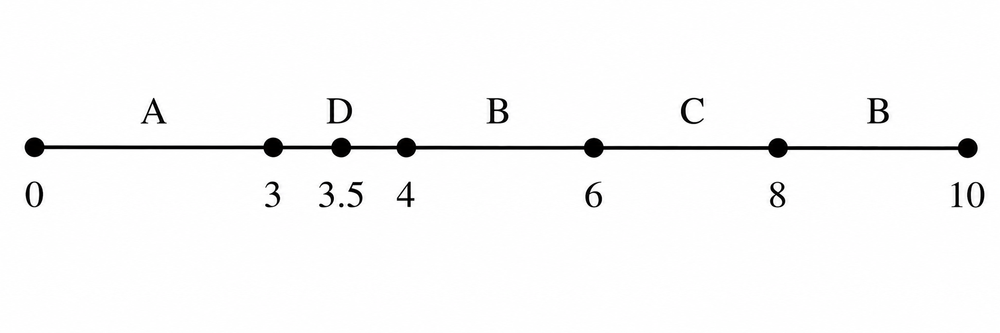
下列说法中，正确的是（  ）。
I. 在这段时间内，CPU的利用率是 \(95\%\)
II. 进程 \(A\)、\(B\)、\(C\) 和 \(D\) 的平均周转时间是3.625s
III. 进程 \(D\) 的等待时间最长
IV. 进程 \(A\)、\(B\)、\(C\) 和 \(D\) 的平均带权周转时间是2.625s
A. I、II
B. II、III
C. I、II、III
D. I、II、III、IV

- 答案：D
- 解析：在 \(0\sim 10\text{s}\) 内，CPU 仅在 \(3.5\sim 4\text{s}\) 空闲 \(0.5\text{s}\)，因此忙碌时间为 \(9.5\text{s}\)，利用率为
  \[
  \frac{9.5}{10}\times 100\%=95\%
  \]
  故 I 正确。各进程周转时间为：\(A:3-0=3\text{s}\)，\(D:3.5-0=3.5\text{s}\)，\(B:10-4=6\text{s}\)，\(C:8-6=2\text{s}\)。平均周转时间为
  \[
  \frac{3+3.5+6+2}{4}=3.625\text{s}
  \]
  故 II 正确。各进程等待时间分别为：\(A=0\)，\(D=3\text{s}\)，\(B=2\text{s}\)（被 \(C\) 抢占期间等待），\(C=0\)，因此 \(D\) 最长，III 正确。各进程实际运行时间分别为 \(3\text{s}\)、\(0.5\text{s}\)、\(4\text{s}\)、\(2\text{s}\)，带权周转时间依次为 \(1\)、\(7\)、\(1.5\)、\(1\)，平均值为
  \[
  \frac{1+7+1.5+1}{4}=2.625
  \]
  故 IV 正确，选 D。

<br>
<br>

3. **【王道·卷四-Q26】** 在下列各种调度算法中，属于基于时间片的调度算法的是（  ）。<br>
I. 时间片轮转法 II. 多级反馈队列调度算法 III. 抢占式调度算法
IV. FCFS(先来先服务)调度算法 V. 高响应比优先调度算法
A. I和II
B. I、II和IV
C. I、III和IV
D. I、II和III

- 答案：A
- 解析：时间片轮转算法显式为每个进程分配固定时间片，时间片用完后进程被放回就绪队列，因此 I 正确。多级反馈队列通常在各级队列中设置不同大小的时间片，进程用完本级时间片后降入下一级队列，因此 II 正确。III“抢占式调度算法”只是一类调度方式的总称，抢占可能由更高优先级进程到达等事件触发，并不一定以时间片为依据。FCFS 按到达先后运行，通常是非抢占式，不使用时间片。高响应比优先根据响应比选择作业，也不依赖时间片。因此仅 I、II 正确，选 A。

<br>
<br>

4. **【王道·卷五-Q25】** 在关于优先级的如下论述中，错误的是（  ）。<br>
I. 计算型作业的优先级一定高于I/O型作业的优先级
II. 短作业的优先级一定高于长作业的优先级
III. 用户进程的优先级一定高于系统进程的优先级
IV. 对资源要求多的作业的优先级一定高于对资源要求少的作业的优先级
A. I和IV
B. III和IV
C. I、III和IV
D. I、II、III和IV

- 答案：D
- 解析：四个说法都把某种调度倾向绝对化为“一定”，因而均错误。I：为了提高设备和 CPU 的并行度，系统往往会适当提高 I/O 型进程的优先级，而不是必然优先计算型作业。II：只有短作业优先等特定算法才偏向短作业，其他算法中短作业未必优先。III：系统进程承担内核服务或关键管理任务，其优先级通常不低于用户进程，更不能说用户进程一定更高。IV：资源需求多的作业可能加重系统负担，系统有时反而优先满足资源需求少、易于完成的作业。因此 I、II、III、IV 全部错误，选 D。

<br>
<br>

5. **【王道·卷六-Q24】** 在单处理器系统中，5个进程同时被创建，CPU调度程序采用某种调度策略安排这些进程的并发执行。假设这五个进程单独占用CPU时的执行时间分别为2,4,6,8,10。当这五个并发进程全部执行完毕后，它们的最小平均等待时间是（  ）。<br>
A. 2
B. 8
C. 6
D. 10

- 答案：B
- 解析：所有进程同时到达时，要使平均等待时间最小，应采用短作业优先顺序，即按运行时间 \(2,4,6,8,10\) 依次执行。五个进程的等待时间分别为
  \[
  0,\quad 2,\quad 2+4=6,\quad 2+4+6=12,\quad 2+4+6+8=20
  \]
  因此平均等待时间为
  \[
  \frac{0+2+6+12+20}{5}=8
  \]
  故选 B。其他执行顺序会使较长作业提前占用 CPU，从而增大后续多个进程的累计等待时间。

<br>
<br>

6. **【王道·卷八-Q32】** 在磁盘调度算法中，（  ）算法可能会随时改变磁头臂的运动方向。<br>
A. C-LOOK
B. SCAN
C. C-SCAN
D. 最短寻道时间优先

- 答案：D
- 解析：最短寻道时间优先（SSTF）每次选择与当前磁头位置距离最近的请求，下一次所选请求可能位于当前磁头的任意一侧，因此磁头可能随时改变移动方向，D 正确。SCAN 算法像电梯一样沿一个方向服务请求，到达端点后才反向。C-SCAN 始终按单一方向扫描，到达一端后快速返回另一端再继续同向服务。C-LOOK 与 C-SCAN 类似，只移动到当前方向上最远的请求位置后便回到另一侧，不会因每个局部请求而随时反向。

<br>
<br>

7. **【竟成·模拟二-26】** 在一个单处理器操作系统中，存在以下3个进程，其到达时间和运行时间如下表所示。使用多级反馈队列调度算法，队列设置如下表所示，则这三个进程的周转时间之和为（）。

| 进程     | 到达时间   | 运行时间   |
| -------- | ---------- | ---------- |
| A        | 0          | 5          |
| B        | 1          | 3          |
| C        | 3          | 1          |
| 队列级数 | 调度策略   | 时间片大小 |
| ---      | ---        | ---        |
| 1        | 先来先服务 | 1          |
| 2        | 先来先服务 | 2          |
| 3        | 时间片轮转 | 4          |

A. 13
B. 14
C. 15
D. 16

- 答案：D
- 解析：新到达进程进入最高优先级队列；高优先级队列中的进程可抢占低优先级队列中的进程。调度过程如下：
  1. \(0\sim1\)：A 在第 1 级队列运行 1 个时间单位，剩余 4，降到第 2 级队列。
  2. \(1\sim2\)：B 到达并在第 1 级队列运行 1 个时间单位，剩余 2，降到第 2 级队列。
  3. \(2\sim3\)：A 在第 2 级队列运行；\(t=3\) 时 C 到达最高级队列并抢占 A。A 在本级时间片还剩 1 个时间单位。
  4. \(3\sim4\)：C 运行 1 个时间单位后完成。
  5. \(4\sim5\)：A 继续用完第 2 级队列剩余时间片，尚余 2，降到第 3 级队列。
  6. \(5\sim7\)：B 在第 2 级队列运行 2 个时间单位后完成。
  7. \(7\sim9\)：A 在第 3 级队列运行并完成。

  因而完成时刻分别为 \(A=9\)、\(B=7\)、\(C=4\)，周转时间分别为
  \[
  T_A=9-0=9,\qquad T_B=7-1=6,\qquad T_C=4-3=1
  \]
  周转时间之和为
  \[
  9+6+1=16
  \]
  故选 D。

<br>
<br>

8. **【竟成·模拟三-24】** 在单CPU和两台I/O设备I₁、I₂的多道程序环境中，同时投入以下三个作业运行，三者的执行轨迹分别如下：
Job1: I₂(30ms)，CPU(10ms)，I₁(30ms)，CPU(10ms)，I₂(10ms)
Job2: I₁(20ms)，CPU(20ms)，I₂(40ms)，CPU(10ms)
Job3: CPU(30ms)，I₁(30ms)
其中，CPU使用抢占式优先级调度算法，I₁、I₂按照优先级分配但不可抢占，三个作业的优先级从高到低为Job1>Job2>Job3。不考虑调度和切换时间，则作业全部完成时，CPU利用率、Job1的等待时间、Job3的等待时间分别为（）。
A. 80%，10ms，40ms
B. 89%，0ms，40ms
C. 80%，0ms，30ms
D. 89%，10ms，30ms

- 答案：C
- 解析：按优先级和设备不可抢占规则绘制执行过程：
  1. \(0\sim20\text{ms}\)：Job1 使用 I₂，Job2 使用 I₁，Job3 使用 CPU。
  2. \(20\sim30\text{ms}\)：Job2 完成 I₁ 操作后抢占 Job3，使用 CPU；Job3 尚余 \(10\text{ms}\) 的 CPU 时间。
  3. \(30\sim40\text{ms}\)：Job1 完成 I₂ 操作后，以最高优先级抢占 Job2，使用 CPU；Job2 尚余 \(10\text{ms}\) 的本次 CPU 时间。
  4. \(40\sim50\text{ms}\)：Job1 转去使用 I₁，Job2 继续完成剩余 CPU 段，随后请求 I₂。
  5. \(50\sim60\text{ms}\)：Job3 完成剩余 CPU 段，随后请求 I₁，但 I₁ 正被 Job1 使用。
  6. \(60\sim70\text{ms}\)：没有作业处于 CPU 就绪状态，CPU 空闲。
  7. \(70\sim80\text{ms}\)：Job1 完成 I₁ 操作后使用 CPU；Job3 同时开始使用 I₁。
  8. \(80\sim90\text{ms}\)：Job1 请求 I₂，但 I₂ 仍被 Job2 使用，CPU 再次空闲。
  9. \(90\sim100\text{ms}\)：Job2 使用 CPU，Job1 使用 I₂，Job3 继续使用 I₁，三者均在 \(100\text{ms}\) 时完成。

  CPU 总忙碌时间为各作业 CPU 时间之和：
  \[
  (10+10)+(20+10)+30=80\text{ms}
  \]
  从作业投入到全部完成共 \(100\text{ms}\)，故 CPU 利用率为
  \[
  \frac{80}{100}\times100\%=80\%
  \]
  调度问题中的等待时间指进程在**就绪队列中等待 CPU**的时间，不包括因等待 I/O 设备而处于阻塞状态的时间。Job1 每次需要 CPU 时都立即获得 CPU，其等待时间为 \(0\text{ms}\)；Job3 在 \(20\sim50\text{ms}\) 期间因被高优先级作业抢占而处于就绪队列，等待时间为 \(30\text{ms}\)。因此选 C。

<br>
<br>

9. **【竟成·模拟五-26】** 以下叙述中，正确的是（）。
I. 时间片轮转算法会导致饥饿问题
II. 高响应比优先算法可以满足短作业优先
III. 短作业优先算法的平均等待时间和平均周转时间在可实现的经典调度算法中是最短的
A. I、II
B. I、III
C. II、III
D. I、II、III

- 答案：C
- 解析：I 错误。时间片轮转算法按就绪队列顺序为各进程轮流分配时间片，只要进程仍在就绪队列中，就能周期性地获得 CPU，通常不会发生某个进程长期得不到运行机会的饥饿现象。II 正确。高响应比优先算法使用
  \[
  R=\frac{等待时间+要求服务时间}{要求服务时间}
  =1+\frac{等待时间}{要求服务时间}
  \]
  作为选择依据。在等待时间相同的情况下，要求服务时间越短，响应比越高，因此兼顾了短作业优先；随着等待时间增加，长作业的响应比也会不断提高，可避免长期饥饿。III 正确。在已知作业运行时间的经典调度模型中，按运行时间由短到长安排作业，能够使平均等待时间和平均周转时间达到最小。因此正确的是 II、III，选 C。

##### 2.2.6 多处理机调度

<br>
<br>

1. **【王道·卷四-Q23】** 在下列关于多处理机系统的说法中，错误的是（  ）。<br>
A. 引入多处理机系统的原因之一是靠提高CPU时钟频率来提高系统性能的方法已接近极限
B. 随着处理机数量的增加，系统的处理能力也相应增强，利用 \(n\) 个处理机所获得的加速比是1个处理机的n倍
C. 采用n个处理机的系统与采用n台独立的计算机相比，可以节省投资
D. 多处理机系统与单处理机系统相比，可以大大提高系统的可靠性

- 答案：B
- 解析：B 错误。增加处理机数量通常能够提高系统处理能力，但实际加速比很难达到理想的 \(n\) 倍。程序中往往存在不能并行执行的串行部分，同时还会产生任务划分、进程同步、通信、负载均衡和缓存一致性等额外开销。根据 Amdahl 定律，串行部分会限制并行系统的最大加速比。A 正确，单纯依靠提高主频会受到功耗、散热和器件物理极限的制约，多核和多处理机成为提升性能的重要途径。C 正确，多处理机系统可共享内存、外设和其他基础设施，通常比配置同等数量的完整独立计算机更节省成本。D 正确，在合理设计下，某个处理机发生故障后，其余处理机仍可继续承担部分任务，系统具有一定的容错能力和更高可靠性。

#### 2.3 同步与互斥

##### 2.3.1 同步与互斥的基本概念

<br>
<br>

1. **【王道·卷二-Q28】** 对于下面的四条语句，（  ）是对应的前驱图。<br>

```
S1:a=x+y;
S2:b=z+1;
S3:c=a-b;
S4:w=c+1;
```
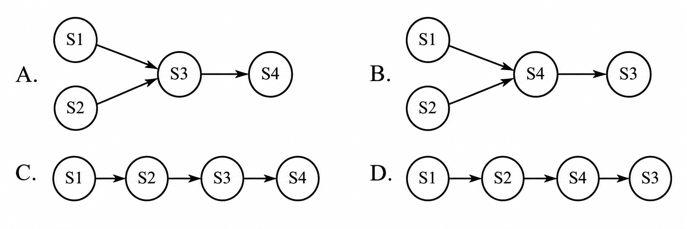
A. 见图中 A
B. 见图中 B
C. 见图中 C
D. 见图中 D

- 答案：A
- 解析：语句 S1 计算变量 \(a\)，语句 S2 计算变量 \(b\)。S3 的表达式 \(c=a-b\) 同时需要 S1 产生的 \(a\) 和 S2 产生的 \(b\)，因此必须满足两条前驱关系：
  \[
  S1\rightarrow S3,\qquad S2\rightarrow S3
  \]
  S4 的表达式 \(w=c+1\) 需要 S3 产生的 \(c\)，故还有
  \[
  S3\rightarrow S4
  \]
  S1 与 S2 之间不存在数据依赖，可以并发执行。图 A 正好表示 S1、S2 共同指向 S3，再由 S3 指向 S4，因此选 A。B 将 S4 错误地放在 S3 之前；C、D 又错误地强制规定了本可并发执行的语句之间的先后次序。

##### 2.3.2 实现临界区互斥的基本方法

<br>
<br>

1. **【王道·卷七-Q24】** 关于临界区问题的一个算法（假设只有进程 \(P_0\) 和 \(P_1\) 可能会进入该临界区）如下（i 为 0 或 1），该算法（  ）。<br>

```
Repeat
    retry: if(turn!=-1) turn=i;
    if(turn!=i) goto retry;
    turn=-1;
临界区
    turn=0;
剩余区
```
A. 不能保证进程互斥进入临界区，且会出现“饥饿”
B. 不能保证进程互斥进入临界区，但不会出现“饥饿”
C. 保证进程互斥进入临界区，但会出现“饥饿”
D. 保证进程互斥进入临界区，不会出现“饥饿”

- 答案：B
- 解析：该算法不能保证互斥。假设 \(P_0\) 判断 `turn!=-1` 成立，但尚未执行 `turn=0` 就被切换出去；此时 \(P_1\) 也判断条件成立，将 `turn` 置为 1，并通过后续检查进入临界区。在 \(P_1\) 尚未退出临界区时，若 CPU 又切换回 \(P_0\)，则 \(P_0\) 可以继续执行 `turn=0`，通过检查并进入临界区。这样两个进程可能同时位于临界区，互斥性被破坏。该算法的问题在于“检查并修改 `turn`”不是不可分割的原子操作。按本题算法的判定，由于两个进程都存在进入临界区的机会，不构成某一进程永久无法进入的饥饿情形，因此选 B。

<br>
<br>

2. **【竟成·模拟一-26】** 下列关于进程同步机制的描述中，正确的是（）。
I. 关中断同步方式通过屏蔽中断实现互斥，仅适用于单CPU系统
II. 忙等待的同步方式会导致CPU资源浪费
III. 信号量机制是操作系统提供的高级同步工具，可跨进程、跨CPU核心实现安全互斥与同步
IV. 管程作为编程语言级同步机制，仅适用于单线程环境
V. 硬件实现的Test-and-Set指令可在多CPU系统中实现原子性互斥
A. I、II、III
B. I、II、III、IV
C. II、III、V
D. I、II、III、V

- 答案：D
- 解析：I 正确。在单处理器系统中，进程关闭中断后不会被时钟中断等事件抢占，可保护临界区；在多处理器系统中，关闭当前 CPU 的中断并不能阻止其他 CPU 同时访问共享资源，因此不能单独依靠这种方法实现全局互斥。II 正确。自旋锁等忙等待机制会让等待进程持续占用 CPU 执行循环检查，造成处理机时间浪费。III 正确。信号量的 P、V 操作由操作系统保证原子性，可用于同一处理器或多处理器环境中的线程、进程同步与互斥。IV 错误，管程正是为并发环境设计的高级同步机制，通过条件变量和互斥进入规则协调多个线程或进程，并非只适用于单线程环境。V 正确，Test-and-Set 是硬件提供的原子读—改—写指令，可作为多处理器环境中实现自旋锁和互斥的基础。因此 I、II、III、V 正确，选 D。

<br>
<br>

3. **【竟成·模拟四-27】** 进程P0和P1访问临界资源的伪代码实现如下，以下说法正确的是（）。

```c
bool flag[2] = {false, false};
// P0进程：
while(flag[1]);
flag[0] = true;
critical section;
flag[0] = false;
remainder section;
// P1进程：
while(flag[0]);
flag[1] = true;
critical section;
flag[1] = false;
remainder section;
```
A. 不能保证进程互斥进入临界区，且违背了忙则等待原则
B. 不能保证进程互斥进入临界区，但是遵循忙则等待原则
C. 能保证进程互斥进入临界区，但是违背了忙则等待原则
D. 能保证进程互斥进入临界区，且遵循忙则等待原则

- 答案：B
- 解析：该算法把“检查对方标志”和“设置自己的标志”分成了两个非原子步骤。若 P0、P1 几乎同时执行，两者都可能先观察到对方的 `flag` 为 `false`，于是都通过 `while`；随后分别把自己的 `flag` 置为 `true`，并同时进入临界区，因此不能保证互斥。另一方面，若某进程已经把自己的 `flag` 置为 `true` 并进入临界区，则另一进程会在 `while` 中等待，体现了“临界资源忙时申请者等待”的忙则等待原则。故选 B。正确的软件互斥算法必须保证意愿标志的设置与冲突处理能够覆盖这种同时检查的竞争情形，例如 Peterson 算法还需引入 `turn` 变量。

<br>
<br>

4. **【竟成·模拟六-25】** 两个线程使用以下算法处理对打印机设备的共享，可能出现的问题是（）。

```c
int turn = 1;
void Thread1() {
// 其他操作...
while (turn != 1);
// 操作打印机
turn = 2;
// 其他操作...
}
void Thread2() {
// 其他操作...
while (turn != 2);
// 操作打印机
turn = 1;
// 其他操作...
}
```
A. 两个线程都无法使用打印机，发生饥饿现象
B. 两个线程同时使用打印机，打印出现错误
C. 若线程1没有使用打印机，转而执行其他操作，则线程2也无法使用
D. 不会发生错误，两线程正常使用打印机

- 答案：C
- 解析：该算法采用严格轮换方式：只有 `turn=1` 时线程 1 才能使用打印机，只有 `turn=2` 时线程 2 才能使用打印机。它能够避免两个线程同时进入临界区，但违背“空闲让进”原则。初始时 `turn=1`，若线程 1 此时不需要打印而一直执行其他操作，它就不会把 `turn` 改为 2；即使打印机处于空闲状态，线程 2 仍会永久停在 `while(turn != 2)` 处。因此可能出现 C 所述情况。A 错误，至少线程 1 初始能够进入；B 错误，严格轮换不会让二者同时使用打印机；D 忽略了这种不必要等待问题。

##### 2.3.4 信号量

<br>
<br>

1. **【王道·卷六-Q25】** 有一个计数信号量 \(S\)，若干进程对 \(S\) 进行28次 \(P\) 操作和18次 \(V\) 操作后，信号量 \(S\) 的值为0，然后又对信号量 \(S\) 进行3次 \(V\) 操作，则此时有（  ）个进程等待在信号量 \(S\) 的队列中。<br>
A. 2
B. 0
C. 3
D. 7

- 答案：B
- 解析：记录型信号量的值小于 0 时，其绝对值表示在该信号量等待队列中的进程数；信号量值大于或等于 0 时，没有进程因该信号量而阻塞。题目已知完成 28 次 P 操作和 18 次 V 操作后 \(S=0\)，说明此时等待队列为空。再执行 3 次 V 操作后，信号量依次变为 1、2、3。由于每次 V 操作后 \(S>0\)，均无须唤醒等待进程，最终等待队列中仍有 0 个进程，故选 B。也可由净变化求得初值：
  \[
  S_0-28+18=0\quad\Rightarrow\quad S_0=10
  \]

<br>
<br>

2. **【王道·卷八-Q24】** 对记录型信号量 \(S\) 执行 \(V\) 操作后，下列选项中错误的是（  ）。<br>
I. 当 \(S.value \leq 0\) 时，唤醒一个阻塞队列进程
II. 只有当 \(S.value \leq 0\) 时，才唤醒一个阻塞队列进程
III. 当 \(S.value \leq 0\) 时，唤醒一个就绪队列进程
IV. 当 \(S.value > 0\) 时，系统不做额外操作
A. I、III
B. I、IV
C. I、II、III
D. II、III

- 答案：D（按命题原意）
- 解析：记录型信号量的 V 操作通常为：先执行 \(S.value++\)，然后在 \(S.value\leq0\) 时，从该信号量的**阻塞队列**中移出一个进程并将其唤醒，使其进入就绪态；若 \(S.value>0\)，则无须执行额外唤醒操作。因此 I、IV 正确，III 错误，因为就绪队列中的进程本来就已处于就绪态，真正被唤醒的是阻塞队列中的进程。

  当前题面中的 II 写成了“只有当 \(S.value\leq0\) 时”，它与 I 基本等价，按字面理解应为正确陈述，此时只有 III 错误，而四个选项中没有对应答案。结合选项 D 可知，II 的比较符应为 \(S.value<0\)：若写成“只有当 \(S.value<0\) 时才唤醒”，则该说法错误，因为执行 V 后恰好有 \(S.value=0\) 时也需要唤醒一个阻塞进程。故按命题原意，错误的是 II、III，选 D；原题当前文本存在比较符转录错误。

<br>
<br>

3. **【竟成·模拟七-24】** 某时刻，某计算机系统中共有10个进程和3台打印机，使用信号量管理打印机的互斥访问，则该信号量的取值范围是（）。
A. -10到3
B. -6到3
C. -7到3
D. -3到10

- 答案：C
- 解析：用一个计数信号量管理 3 台同类打印机时，信号量初值为 3。每执行一次 P 操作，信号量值减 1；若结果小于 0，则相应进程进入阻塞队列。系统共有 10 个进程，因此最极端情况下，10 个进程都已执行 P 操作，其中 3 个进程获得打印机，另外 7 个进程阻塞，此时
  \[
  S_{\min}=3-10=-7
  \]
  当 3 台打印机均空闲且没有进程等待时，信号量取得最大值
  \[
  S_{\max}=3
  \]
  因而信号量的取值范围为 \(-7\) 到 \(3\)，选 C。A 将最小值错误地写成进程总数的相反数，忽略了信号量的初值为 3；B、D 均不符合计数信号量的实际变化规律。

##### 2.3.5 经典同步问题

<br>
<br>

1. **【王道·卷四-Q27】** 生产者进程和消费者进程的代码如下。生产者进程有一个局部变量nextProduced，以存储新产生的项；消费者进程有一个局部变量nextConsumed，以存储所要使用的项。<br>

```c
while(1){ //producer
    /* produce an item in nextProduced */
    while((in + 1) % BUFFER_SIZE == out);
    /* do nothing */
    buffer[in] = nextProduced;
    in = (in+1) % BUFFER_SIZE;
}
while(1){ //Consumer
    while(in == out);
    /* do nothing */
    nextConsumed = buffer[out];
    out = (out+1) % BUFFER_SIZE;
    /* consume the item in nextConsumed */
}
```
条件 \(in == out\) 和 \((in + 1)\% BUFFER_SIZE == out\) 成立时，缓冲区中item的数量分别是（  ）。
A. 0, BUFFER_SIZE
B. 0, BUFFER_SIZE-1
C. BUFFER_SIZE-1, 0
D. BUFFER_SIZE, 0

- 答案：B
- 解析：该循环缓冲区采用“牺牲一个存储单元”的方法区分队空与队满。`in` 指向下一次生产者写入的位置，`out` 指向下一次消费者读出的位置。

  当
  \[
  in=out
  \]
  时，生产者和消费者指针重合，表示缓冲区为空，item 数量为 0。

  当
  \[
  (in+1)\bmod BUFFER\_SIZE=out
  \]
  时，`in` 再前进一步就会与 `out` 重合，表示缓冲区已满。由于必须保留一个空单元用于区分队空和队满，因此最多只能存放
  \[
  BUFFER\_SIZE-1
  \]
  个 item。故两种条件对应的数量分别为 0 和 \(BUFFER\_SIZE-1\)，选 B。A、D 错误地认为所有数组单元都可用于存放元素；C 将队空和队满的含义颠倒。

<br>
<br>

2. **【王道·卷六-Q26】** 在某个十字路口，每个车道只允许一辆车通过，允许直行、左拐和右拐，如下图所示。若将各个方向的车视为进程，则需要对这些进程进行同步并保证尽可能多的车通过。这里的临界资源个数至少应该是（  ）个。<br>
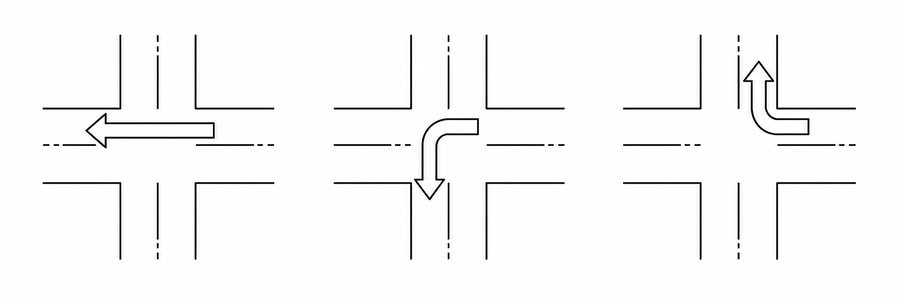
A. 1
B. 2
C. 4
D. 3

- 答案：C
- 解析：为保证安全，车辆轨迹相交的区域不能被两辆车同时占用；为提高并发度，又不能把整个路口简单地看作一个临界资源，否则任一时刻只能通过一辆车。可将十字路口中心划分为 4 个互不重叠的冲突区域，即 4 个象限，每个象限分别作为一个临界资源。

  不同方向和转向的车辆在进入路口前，申请其行驶路径将经过的一个或多个象限：右转通常只占用一个象限，直行占用两个象限，左转占用三个象限。轨迹不冲突的车辆可同时获得不同象限并并发通过，轨迹冲突的车辆则会因竞争同一象限而互斥。若少于 4 个临界资源，就无法独立表示路口的 4 个基本冲突区域，会不必要地降低并发度或无法准确排除冲突。因此至少需要 4 个临界资源，选 C。

#### 2.4 死锁

##### 2.4.1 死锁的概念

<br>
<br>

1. **【王道·卷一-Q28】** 假定某系统中有3台设备 \(R1\)、4台设备 \(R2\)，它们被 \(P_1\)、\(P_2\)、\(P_3\) 和 \(P_4\) 四个进程互斥共享，且已知这四个进程均以下面所示的顺序使用现有设备：申请 \(R1 \rightarrow\) 申请 \(R2 \rightarrow\) 申请 \(R1 \rightarrow\) 释放 \(R1 \rightarrow\) 释放 \(R2 \rightarrow\) 释放 \(R1\)。在系统运行过程中，是否可能产生死锁？（  ）。<br>
A. 不会产生死锁
B. 有可能产生死锁，因为 \(R1\) 资源不足
C. 有可能产生死锁，因为 \(R2\) 资源不足
D. 有可能其中的三个进程进入死锁状态，而另一个进程正常运行

- 答案：B
- 解析：每个进程要完成运行，最多需要先后占有 2 台 \(R1\) 和 1 台 \(R2\)。系统可能出现如下状态：\(P_1\)、\(P_2\)、\(P_3\) 各自先获得 1 台 \(R1\)，随后又各获得 1 台 \(R2\)，然后都申请第 2 台 \(R1\)。此时 3 台 \(R1\) 已分别被这 3 个进程占有，且它们在获得新的 \(R1\) 前都不会释放现有资源，因此三者相互等待，形成死锁。

  系统中尚有 1 台空闲的 \(R2\)，但死锁进程所缺少的是 \(R1\)，所以空闲的 \(R2\) 无法解除死锁。第 4 个进程也会因得不到第 1 台 \(R1\) 而阻塞，不能“正常运行”，故 D 不正确。死锁的根本原因是 \(R1\) 数量不足，选 B。

<br>
<br>

2. **【王道·卷七-Q26】** 设 \(m\) 为同类资源数，\(n\) 为系统中的并发进程数。当 \(n\) 个进程共享 \(m\) 个互斥资源时，每个进程的最大需求是 \(w\)，则在下列情况中，会出现系统死锁的是（  ）。<br>
A. \(m = 2, n = 1, w = 2\)
B. \(m = 2, n = 2, w = 1\)
C. \(m = 4, n = 3, w = 2\)
D. \(m = 4, n = 2, w = 3\)

- 答案：D
- 解析：对于 \(n\) 个进程共享同类资源、每个进程最多需要 \(w\) 个资源的情形，只要系统资源数满足
  \[
  m\ge n(w-1)+1
  \]
  就至少能保证有一个进程获得其所需的最后一个资源并完成，完成后释放资源，使其他进程依次完成，从而不会发生死锁。

  分别判断：
  - A：所需安全下限为 \(1\times(2-1)+1=2\)，现有 \(m=2\)，不会死锁。
  - B：每个进程最多只需 1 个资源，获得资源后无须继续等待，不会死锁。
  - C：所需安全下限为 \(3\times(2-1)+1=4\)，现有 \(m=4\)，不会死锁。
  - D：所需安全下限为 \(2\times(3-1)+1=5\)，但只有 4 个资源。可能出现两个进程各占有 2 个资源并同时等待第 3 个资源的情况，此时无空闲资源可分配，形成死锁。

  因此选 D。

##### 2.4.2 死锁预防

<br>
<br>

1. **【王道·卷三-Q27】** 为了破坏“请求和保持”条件，提出了两种方法：第一种方法是在进程运行前，必须一次性地申请其在整个运行期间所需的全部资源；第二种方法是允许进程只获得运行初期所需的资源后便可开始运行，进程在运行期间再逐步释放已分配给自己且已使用完毕的全部资源后，才能请求新的资源。在关于这两种方法的说法中，错误的是（  ）。<br>
A. 第一种方法简单、易行且安全，但是降低了资源的利用率
B. 第二种方法能使进程更快地完成任务，提高设备的利用率
C. 第一种方法发生饥饿的概率很大，第二种方法不会发生饥饿
D. 第二种方法是对第一种方法的改进，减小了进程发生饥饿的概率

- 答案：C
- 解析：第一种方法要求进程在开始前一次性获得全部资源，能够彻底破坏“请求和保持”条件，实现简单且安全；但某些暂时不用的资源也会被长期占有，因此资源利用率较低，而且需要资源较多的进程可能长期无法同时获得全部资源，饥饿概率较大，A 正确。

  第二种方法允许进程先取得初期资源开始运行，使用完已有资源后先全部释放，再申请下一阶段资源。与第一种方法相比，它缩短了资源被无效占用的时间，有助于提高资源利用率并减小饥饿概率，因此 B、D 正确。但“减小饥饿概率”不等于“绝不会饥饿”；若某进程所需的新资源长期被其他进程占用，它仍可能长期等待。因此 C 的后半句错误，选 C。

##### 2.4.3 死锁避免

<br>
<br>

1. **【王道·卷七-Q25】** 当利用银行家算法进行安全序列检查时，不需要的参数是（  ）。<br>
A. 系统资源总数
B. 满足系统安全的最少资源数
C. 用户最大需求数
D. 用户已占有的资源数

- 答案：B
- 解析：银行家算法进行安全性检查时，需要维护或计算以下数据：
  - 系统各类资源的总数，用于结合已分配资源求出当前可用资源数；
  - 每个进程对各类资源的最大需求量 `Max`；
  - 每个进程已经获得的资源量 `Allocation`；
  - 由前两者计算尚需资源量
    \[
    Need=Max-Allocation
    \]
  - 当前可用资源量 `Available`。

  安全性算法通过反复寻找满足 \(Need_i\le Available\) 的进程，模拟其完成并释放资源，以判断是否存在安全序列。算法并不存在“满足系统安全的最少资源数”这一输入参数，因此选 B。

<br>
<br>

2. **【竟成·模拟五-28】** 假设4个进程共享三类资源A、B、C，这些资源总数分别为10、6、7。T₀时刻的资源分配情况如下表所示，以下叙述正确的是（）。

| 进程 | 已分配资源 | 资源最大需求 |
| ---- | ---------- | ------------ |
|      | A B C      | A B C        |
| P1   | 1 1 1      | 2 2 2        |
| P2   | 3 1 0      | 3 2 1        |
| P3   | 2 2 1      | 4 5 2        |
| P4   | 3 1 3      | 4 3 4        |

A. 该时刻系统不安全
B. 该时刻系统安全，存在一条安全序列
C. 该时刻系统安全，存在两条安全序列
D. 该时刻系统安全，存在四条安全序列

- 答案：无正确选项（按题面计算，系统安全且存在 8 条安全序列）
- 解析：各类资源的已分配总量为
  \[
  Allocation_{sum}=(9,5,5)
  \]
  因此初始可用资源为
  \[
  Available=(10,6,7)-(9,5,5)=(1,1,2)
  \]
  各进程尚需资源为
  \[
  \begin{aligned}
  Need_1&=(1,1,1)\\
  Need_2&=(0,1,1)\\
  Need_3&=(2,3,1)\\
  Need_4&=(1,2,1)
  \end{aligned}
  \]
  初始时只有 P1、P2 满足 \(Need\le Available\)。逐步枚举可得到 8 条安全序列：
  \[
  \begin{aligned}
  &P1,P2,P3,P4;\quad P1,P2,P4,P3;\\
  &P1,P4,P2,P3;\quad P1,P4,P3,P2;\\
  &P2,P1,P3,P4;\quad P2,P1,P4,P3;\\
  &P2,P4,P1,P3;\quad P2,P4,P3,P1。
  \end{aligned}
  \]
  因而系统处于安全状态，但安全序列共有 8 条，题目所给 B、C、D 的数量均不正确，A 也错误。该题的选项或数据应存在转录问题。

##### 2.4.4 死锁检测与解除

<br>
<br>

1. **【王道·卷八-Q25】** 利用死锁定理简化得到下列进程资源图，则处于死锁状态的是（  ）。<br>
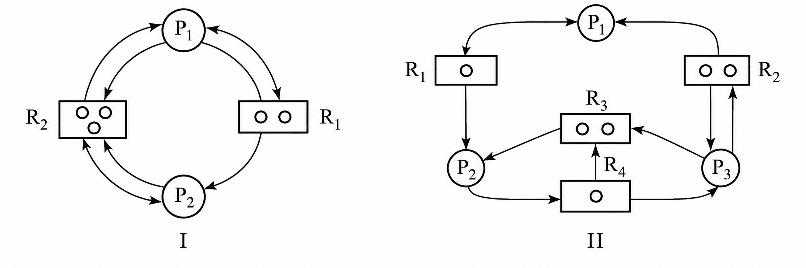
A. I
B. II
C. I和II
D. 都不处于死锁状态

- 答案：B
- 解析：对资源分配图应用死锁检测思想：若某个进程当前的全部资源请求都能由可用资源满足，则可假定该进程完成并释放其已占有资源，再继续化简。

  在图 I 中，\(R_2\) 有 3 个实例，其中只有 2 个已分配，尚有 1 个空闲实例。可先满足 P2 对 \(R_2\) 的请求，使 P2 完成并释放其占有的 \(R_1\)、\(R_2\)；随后 P1 的请求也可得到满足。因此图 I 可以被完全化简，不存在死锁。

  在图 II 中：P1 等待由 P2 占有的 \(R_1\)；P2 等待由 P3 占有的 \(R_4\)；P3 等待 \(R_2\)，而 \(R_2\) 的两个实例分别被 P1 和 P3 占有。虽然 \(R_3\) 尚有可用实例，但 P3 还同时缺少 \(R_2\)，仍不能完成。此时没有任何进程的全部请求能够得到满足，资源图无法继续化简，P1、P2、P3 构成循环等待，处于死锁状态。因此只有图 II 死锁，选 B。

<br>
<br>

2. **【竟成·模拟三-25】** 某一系统在某时刻的资源分配表和进程等待表如下表所示，每种资源都独一无二、无法共享且无法剥夺，则下列说法中正确的是（）。

资源分配表

| 进程 | 资源 |
| ---- | ---- |
| P1   | R1   |
| P2   | R3   |
| P3   | R2   |
| P3   | R5   |
| P4   | R4   |

进程等待表

| 进程 | 资源 |
| ---- | ---- |
| P1   | R2   |
| P2   | R1   |
| P3   | R3   |
| P3   | R4   |
| P4   | R5   |

A. 系统中不存在死锁。
B. 系统中存在死锁，且终止任意一个进程都可以解除死锁。
C. 系统中存在死锁，但终止任意一个进程不一定能解除死锁。
D. 无法判断系统中是否存在死锁。

- 答案：C
- 解析：根据资源分配与等待关系可得到：
  \[
  \begin{aligned}
  &P1\rightarrow R2\rightarrow P3\\
  &P3\rightarrow R3\rightarrow P2\\
  &P2\rightarrow R1\rightarrow P1
  \end{aligned}
  \]
  因而 P1、P2、P3 构成一个循环等待。此外还有
  \[
  P3\rightarrow R4\rightarrow P4\rightarrow R5\rightarrow P3
  \]
  因而 P3、P4 又构成另一个循环等待。每种资源都只有一个实例，所以资源分配图中存在环即可判定系统发生死锁。

  但终止任意一个进程并不一定能解除全部死锁。例如，终止 P1 只能破坏 P1—P2—P3 这一环，P3 与 P4 之间的环仍然存在；终止 P4 只能破坏 P3—P4 这一环，P1—P2—P3 的环仍然存在。只有选择能同时破坏两个环的进程，例如 P3，才可一次解除全部死锁。因此系统存在死锁，但终止任意一个进程不一定能解除死锁，选 C。

#### 2.5 本章疑难点

<br>
<br>

1. **【竟成·模拟一-25】** 下列关于进程、线程与同步机制的描述中，错误的是（）。
A. 多线程进程中，某个线程执行信号量的P操作可能导致其他线程阻塞
B. 管程的wait操作必须与signal成对出现，否则可能破坏条件变量的状态
C. 同一进程的线程共享文件描述符表，但各自拥有独立的用户栈和寄存器
D. 死锁的四个必要条件中，抢占式调度可破坏"不可剥夺条件"

- 答案：B
- 解析：管程中的条件变量用于等待某个条件成立。线程执行 `wait` 时，会释放管程的互斥访问权并进入相应条件变量的等待队列；其他线程执行 `signal` 时，若该条件变量上存在等待线程，则唤醒其中一个。`wait` 与 `signal` 并不要求在程序结构上严格成对出现，而且条件变量通常不保存“多余的唤醒次数”：没有线程等待时执行 `signal`，该信号通常直接失效，并不会因此“破坏条件变量的状态”。因此 B 错误。

  A 中，线程执行 P 操作会减少可用资源数；当资源不足时，执行 P 操作的线程会阻塞，也可能使随后申请该资源的其他线程阻塞，故其表述可以成立。C 正确，同一进程内的线程共享代码段、数据段、打开文件等进程级资源，但每个线程拥有独立的程序计数器、寄存器和用户栈。D 的表述不够严谨：严格来说，仅抢占 CPU 并不能剥夺进程已持有的其他资源；但若“抢占”泛指允许系统强制收回相关资源，则确实可以破坏死锁的不可剥夺条件。本题按单选题意，最明确的错误项为 B。

### 第3章 内存管理

#### 3.1 内存管理概念

##### 3.1.1 内存管理的基本原理和要求

<br>
<br>

1. **【王道·卷四-Q24】** 在下列关于内存管理的说法中，正确的是（  ）。<br>
A. 不同进程对应的页表中可能包含内容相同的页表项
B. 虚拟地址空间总是大于物理地址空间
C. 在页式存储管理中，页面越小越有利于消除外部碎片，从而提高内存利用率
D. 在段式存储管理中，分段大小可以不同，从而可以消除外部碎片，提高内存利用率

- 答案：A
- 解析：不同进程的页表项完全可能具有相同内容。例如，两个进程共享同一段只读代码时，它们的某些虚页可映射到同一个物理页框；即使不共享，也可能因页框号及控制位恰好相同而出现内容相同的页表项，因此 A 正确。

  B 错误，虚拟地址空间的大小由虚拟地址位数决定，物理地址空间由物理地址位数决定，二者不存在“虚拟空间总是更大”的必然关系。C 错误，分页本身就不存在外部碎片，减小页面主要有助于减小平均内部碎片，但会增大页表规模和管理开销。D 错误，分段的段长可变，内存中会形成大小不一的空闲区，因此仍会产生外部碎片，不能将其消除。

<br>
<br>

2. **【王道·卷六-Q28】** 总体上说，按需调页（Demand-paging）是一种很好的虚拟内存管理策略。但是，有些程序设计技术并不适合这种环境。例如，（  ）。<br>
A. 堆栈
B. 线性搜索
C. 向量运算
D. 二分搜索

- 答案：D
- 解析：请求分页依赖程序的局部性原理。堆栈操作通常集中在栈顶附近，具有很强的时间局部性和空间局部性；线性搜索和向量运算一般按连续地址访问数据，空间局部性较好，均较适合请求分页环境。

  二分搜索每次都跳到当前搜索区间的中点，连续两次访问的地址可能相距很远。当数据规模较大、跨越多个页面时，访问序列可能频繁跳转到不同页面，空间局部性较差，容易增加缺页次数。因此 D 最不适合。

<br>
<br>

3. **【竟成·模拟一-28】** 下列关于内存管理方法的描述中，正确的是（）。
A. 动态分区分配中的最佳适应算法通过按地址排序空闲块来提高分配速度
B. 伙伴算法在释放内存时立即合并相邻块以减少外部碎片
C. 分页管理消除了外部碎片，但可能存在内部碎片
D. 虚拟内存的页面置换算法中，FIFO算法不会出现Belady现象

- 答案：C
- 解析：分页管理把物理内存划分为大小相等的页框，任意空闲页框都可分配给进程的任意页面，因此不会产生外部碎片；但进程最后一页通常不能恰好装满一个页框，页框中未使用的部分形成内部碎片，所以 C 正确。

  A 错误，最佳适应算法通常按空闲分区大小递增组织空闲分区，以便尽快找到能满足请求的最小空闲块；按地址排序主要服务于首次适应算法。B 错误，伙伴算法只在相邻空闲块互为“伙伴”、大小相同且满足地址关系时才可递归合并，并非释放后将所有相邻空闲块都立即合并。D 错误，FIFO 页面置换算法可能出现分配页框数增加而缺页次数反而增加的 Belady 异常。

<br>
<br>

4. **【竟成·模拟四-28】** 形成逻辑地址和物理地址的阶段分别为（）。
A. 编译，装入
B. 编译，装入或程序运行时
C. 链接，装入
D. 链接，装入或程序运行时

- 答案：D
- 解析：编译阶段通常把各源程序模块翻译成目标模块，其中的地址多为模块内的相对地址。链接程序把多个目标模块及库模块连接成一个完整的装入模块，并完成外部符号解析和地址调整，从而形成程序统一的逻辑地址空间，所以逻辑地址主要在链接阶段形成。

  物理地址何时确定取决于重定位方式：采用静态重定位时，在程序装入内存时确定物理地址；采用动态重定位时，装入后仍保留逻辑地址，程序运行过程中由地址变换机构将其转换为物理地址。因此物理地址可在装入时或运行时形成，选 D。

<br>
<br>

5. **【竟成·模拟六-28】** 把作业使用的逻辑地址变成内存中物理地址的过程称为（）。
A. 挂载
B. 装入
C. 物理化
D. 重定位

- 答案：D
- 解析：程序编译、链接后使用的是逻辑地址。将逻辑地址转换为主存中的实际物理地址，这一地址变换过程称为重定位，也称地址映射。重定位可分为装入时完成的静态重定位和运行时由硬件地址变换机构完成的动态重定位。因此选 D。

  装入是把程序和数据调入内存的过程，可能包含静态重定位，但二者概念并不等同；挂载通常用于把文件系统接入目录树；“物理化”不是操作系统内存管理中的规范术语。

##### 3.1.2 连续分配管理方式

<br>
<br>

1. **【王道·卷三-Q28】** 若存储单元的长度为 \(n\)，存放在该存储单元中的程序长度为 \(m\)，则剩下的长度为 \(n-m\) 的空间称为该单元的内部碎片。在下面的存储分配方法中，哪种存在内部碎片？（  ）。<br>
I. 固定式分区 II. 动态分区 III. 页式管理 IV. 段式管理
V. 段页式管理 VI. 请求段式管理
A. I和II
B. I、III和V
C. IV、V和VI
D. III和V

- 答案：B
- 解析：内部碎片是已经分配给进程、但进程实际没有使用的存储空间。

  - 固定分区的分区大小预先确定，作业小于所在分区时，分区内部的剩余空间不能再分配给其他作业，因此 I 存在内部碎片。
  - 动态分区按作业实际需要划分空间，主要产生分区之间的外部碎片，II 通常不计内部碎片。
  - 分页管理按固定大小的页框分配，进程最后一页往往不能装满，III 存在内部碎片。
  - 分段和请求分段按逻辑段的实际长度分配，主要产生外部碎片，IV、VI 不属于本题所述内部碎片。
  - 段页式管理中每个段再分页，仍可能在各段最后一页产生内部碎片，因此 V 存在内部碎片。

  故存在内部碎片的是 I、III、V，选 B。

<br>
<br>

2. **【王道·卷四-Q28】** 某操作系统采用可变分区分配存储管理方法，操作系统占用低地址部分的 \(126KB\)，用户区大小为 \(386KB\)，且用户区的起始地址为 \(126KB\)，用空闲分区表管理空闲分区。若分配时采用分配空闲区高地址部分的方案，且初始时用户区的 \(386KB\) 空间空闲，对申请序列：作业1申请80KB，作业2申请56KB，作业3申请120KB，作业1释放80KB，作业3释放120KB，作业4申请156KB，作业5申请81KB。若采用首次适应算法处理上述序列，则最小空闲块的大小为（  ）。<br>
A. 12KB
B. 13KB
C. 89KB
D. 56KB

- 答案：B
- 解析：用户区地址范围为 \([126,512)KB\)，分配时从所选空闲分区的高地址端切出空间。

  1. 作业1申请 \(80KB\)：从高端分配，剩余空闲区为 \([126,432)\)，大小 \(306KB\)。
  2. 作业2申请 \(56KB\)：剩余空闲区为 \([126,376)\)，大小 \(250KB\)。
  3. 作业3申请 \(120KB\)：剩余空闲区为 \([126,256)\)，大小 \(130KB\)。
  4. 作业1释放：形成高地址空闲区 \([432,512)\)，大小 \(80KB\)。
  5. 作业3释放：其区域 \([256,376)\) 与低地址空闲区 \([126,256)\) 相邻，合并为 \([126,376)\)，大小 \(250KB\)。
  6. 作业4申请 \(156KB\)：首次适应选中 \(250KB\) 空闲区，并从高端分配，留下 \(94KB\)。
  7. 作业5申请 \(81KB\)：再次从该 \(94KB\) 空闲区高端分配，留下 \(13KB\)。

  最终另有一个 \(80KB\) 空闲区，因此最小空闲块为 \(13KB\)，选 B。

<br>
<br>

3. **【王道·卷六-Q27】** 某台计算机采用动态分区来分配内存，经过一段时间的运行后，内存中按地址从小到大存在100KB、450KB、250KB、200KB和600KB的空闲分区。分配指针现在指向地址起始点，继续运行还会有212KB、417KB、112KB和426KB的进程申请使用内存，则能够完全完成分配任务的算法是（  ）。<br>
A. 首次适应算法
B. 邻近适应算法
C. 最佳适应算法
D. 最坏适应算法

- 答案：C
- 解析：分别模拟各算法即可判断。

  **最佳适应算法**每次选择能够满足请求的最小空闲分区：
  
  
  \[
  \begin{aligned}
  212KB &: 选择250KB，剩余38KB；\\
  417KB &: 选择450KB，剩余33KB；\\
  112KB &: 选择200KB，剩余88KB；\\
  426KB &: 选择600KB，剩余174KB。
  \end{aligned}
  \]
  
  四个请求均可成功分配，因此最佳适应算法能够完成全部任务。

  首次适应算法在依次分配 \(212KB\)、\(417KB\)、\(112KB\) 后，没有能容纳 \(426KB\) 的空闲分区；邻近适应算法同样会因前面切割大分区而无法满足最后一个请求；最坏适应算法先后切割最大的 \(600KB\) 和 \(450KB\) 分区，也会导致最后的 \(426KB\) 请求无法满足。因此选 C。

<br>
<br>

4. **【王道·卷七-Q27】** 支持程序存放在不连续内存中的存储管理方法有（  ）。<br>
I. 动态分区分配 II. 固定分区分配 III. 分页式分配 IV. 段页式分配 V. 分段式分配
A. I和II
B. III和IV
C. III、IV和V
D. I、III、IV和V

- 答案：C
- 解析：连续分配方式要求一个进程整体占用一块连续的物理内存。固定分区和动态分区都属于连续分配管理，因此 I、II 不支持同一程序分散存放在多个不连续区域中。

  分页式管理以页面为单位，把进程各页装入任意空闲页框；分段式管理允许各逻辑段分别装入不同的物理区域；段页式管理先分段、段内再分页，物理存放同样可以不连续。因此 III、IV、V 均支持程序存放在不连续内存中，选 C。

<br>
<br>

5. **【竟成·模拟二-27】** 下列存储管理方式中，可实现紧凑技术的存储管理方式为（）。
A. 动态重定位分区分配
B. 单一连续分配
C. 固定分区分配
D. 分页存储管理

- 答案：A
- 解析：紧凑是把内存中已分配的多个作业向一端移动，使原来分散的小空闲区合并成一个较大的连续空闲区。移动作业后，其物理地址会改变，因此系统必须能够在程序运行期间重新完成地址映射，也就是需要动态重定位的支持。

  动态重定位分区分配同时具备可变分区和运行时地址变换能力，可以在外部碎片较多时实施紧凑，故 A 正确。单一连续分配中只有一个用户作业区，没有通过移动多个分区进行紧凑的必要；固定分区的边界预先确定，不能靠移动作业改变分区结构；分页管理不存在外部碎片，页框本身也无须通过紧凑合并。

<br>
<br>

6. **【竟成·模拟三-28】** 某计算机按字节编址，使用动态分区分配方式管理内存。当某一作业完成、系统回收其内存空间时，会造成空闲分区数减1的情况是（）。
A. 既无上邻空闲分区，又无下邻空闲分区。
B. 虽无上邻空闲分区，但有下邻空闲分区。
C. 虽有上邻空闲分区，但无下邻空闲分区。
D. 既有上邻空闲分区，又有下邻空闲分区。

- 答案：D
- 解析：设回收前空闲分区数为 \(k\)。

  - 若上下都不是空闲分区，回收区独立成为一个新空闲分区，数量变为 \(k+1\)。
  - 若只有上邻或只有下邻为空闲分区，回收区与该相邻空闲分区合并，空闲分区总数仍为 \(k\)。
  - 若上下邻均为空闲分区，原来存在两个独立空闲分区；回收后，三段空间合并为一个空闲分区，数量由两个变为一个，因此总数从 \(k\) 变为 \(k-1\)。

  故会使空闲分区数减 1 的情况是上下邻均为空闲分区，选 D。

##### 3.1.3 基本分页存储管理

<br>
<br>

1. **【王道·卷一-Q32】** 信息在外存空间中的排列也会影响存取等待时间。考虑几条逻辑记录 \(A,B,C,\ldots,J\)，它们被存放于磁盘上，每个磁盘存放10条记录，安排如表1所示。<br>
表1 每个磁盘存放10条记录

| 物理块   | 1   | 2   | 3   | 4   | 5   | 6   | 7   | 8   | 9   | 10  |
| -------- | --- | --- | --- | --- | --- | --- | --- | --- | --- | --- |
| 逻辑记录 | A   | B   | C   | D   | E   | F   | G   | H   | I   | J   |

假定要经常顺序处理这些记录，磁道旋转用时为 \(20\mathrm{ms}/\) 转，处理程序读出每条记录后花 \(4\mathrm{ms}\) 进行处理。考虑对信息的分布进行优化，如表2所示。相比之前的信息分布，优化后的时间缩短了（  ）。
表2 优化后磁盘存放的10条记录

| 物理块   | 1   | 2   | 3   | 4   | 5   | 6   | 7   | 8   | 9   | 10  |
| -------- | --- | --- | --- | --- | --- | --- | --- | --- | --- | --- |
| 逻辑记录 | A   | H   | E   | B   | I   | F   | C   | J   | G   | D   |

A. \(60\mathrm{ms}\)
B. \(104\mathrm{ms}\)
C. \(144\mathrm{ms}\)
D. \(204\mathrm{ms}\)

- 答案：C
- 解析：一条磁道有 10 个物理块，旋转一周用时 \(20\mathrm{ms}\)，因此经过一个物理块的时间为
  \[
  \frac{20\mathrm{ms}}{10}=2\mathrm{ms}。
  \]

  读出一条记录需经过一个物理块，即用时 \(2\mathrm{ms}\)；随后 CPU 处理该记录需 \(4\mathrm{ms}\)。从开始读取一条记录到处理结束共经过 \(6\mathrm{ms}\)，此时磁盘已转过 3 个物理块。

  原排列中相邻逻辑记录也位于相邻物理块。例如读取 A 后，磁盘在处理 A 的 \(4\mathrm{ms}\) 内又转过两个物理块，等到程序准备读取 B 时，B 所在的第 2 块已经错过，需要再等待 8 个物理块，即
  \[
  8\times 2\mathrm{ms}=16\mathrm{ms}。
  \]
  10 条记录之间共有 9 次这样的额外等待，因此原排列的总时间为
  \[
  10\times(2+4)+9\times16=204\mathrm{ms}。
  \]

  优化后的排列使相邻逻辑记录在旋转方向上相隔 3 个物理块。每读完并处理一条记录后，下一条逻辑记录恰好转到磁头下方，无须额外等待，总时间为
  \[
  10\times(2+4)=60\mathrm{ms}。
  \]
  因而缩短的时间为
  \[
  204-60=144\mathrm{ms}，
  \]
  选 C。

<br>
<br>

2. **【王道·卷五-Q30】** 在UNIX系统中，一个盘块的大小为1KB，每个盘块号占4B，采用混合索引的文件分配方式。在FCB中，第 \(0\sim 9\) 个地址为直接地址，第10个地址为一次间接地址，第11个地址为二次间接地址，第12个地址为三次间接地址，一个文件的字节偏移量为420000，则在关于其物理地址的转化过程的描述中，正确的是（  ）。<br>
A. 通过二次间接索引在第11个地址中得到一次间接地址，由此得到二次间接地址，再找到物理块号，其块内偏移量为160
B. 通过二次间接索引在第11个地址中得到一次间接地址，由此得到二次间接地址，再找到物理块号，其块内偏移量为44
C. 通过一次间接索引在第10个地址中得到物理块号，其块内偏移量为160
D. 通过一次间接索引在第10个地址中得到物理块号，其块内偏移量为44

- 答案：A
- 解析：盘块大小为 \(1KB=1024B\)，因此字节偏移量 420000 对应的文件逻辑块号和块内偏移量为
  \[
  \begin{aligned}
  420000&=410\times1024+160,\\
  \text{逻辑块号}&=410,\\
  \text{块内偏移量}&=160。
  \end{aligned}
  \]

  每个间接索引块可保存的盘块号数为
  \[
  \frac{1024}{4}=256。
  \]

  10 个直接地址覆盖逻辑块 \(0\sim 9\)；一次间接地址再覆盖 256 个逻辑块，即 \(10\sim265\)。逻辑块 410 已超过一次间接索引范围，因此必须使用第 11 个地址所指向的二次间接索引。查找时先由第 11 个地址找到一级索引块，再由其中的地址找到二级索引块，最后获得数据盘块号，块内偏移量为 160，故选 A。

<br>
<br>

3. **【王道·卷八-Q28】** 某虚拟存储器的用户空间为1024个页面，每页 \(1KB\)，主存为 \(64KB\)。假设某时刻系统为用户的第0,1,2,3页分别分配的物理块为5,10,4,7，则虚拟地址 \(0x0046F\) 对应的物理地址是（  ）。<br>
A. \(0x126F\)
B. \(0x166F\)
C. \(0x246F\)
D. \(0x1E6F\)

- 答案：题面无正确选项（按题面计算应为 \(0x286F\)；若第 1 页映射的物理块号“10”系“9”之误，则选 C）
- 解析：页大小为 \(1KB=0x400B\)。对虚拟地址 \(0x0046F\) 分解：
  \[
  \begin{aligned}
  \text{页号}&=\left\lfloor\frac{0x46F}{0x400}\right\rfloor=1,\\
  \text{页内偏移}&=0x46F-0x400=0x06F。
  \end{aligned}
  \]

  按题面，第 1 页映射到 10 号物理块，因此物理地址应为
  \[
  10\times0x400+0x06F=0x286F。
  \]
  四个选项均不等于 \(0x286F\)，故题面与选项不一致。选项 C 的 \(0x246F\) 等于 9 号物理块的起始地址加偏移 \(0x06F\)，因此若题面中的“10”应为“9”，则原题预期答案为 C。

<br>
<br>

4. **【竟成·模拟三-26】** 某计算机系统可以由用户选择是否开启分页功能：若不开启，则视为使用单一连续分配方式管理内存；若开启，则视为使用分页方式管理内存，并且配备了TLB用于加速访存（TLB与内存同时查找）。假设TLB的查找时间为1ns，关闭分页功能时一次访存时间为100ns，若希望开启分页功能时平均访存时间不大于110ns，则TLB命中率必须达到（）。
A. 87.5%
B. 88.9%
C. 90%
D. 90.9%

- 答案：D
- 解析：设 TLB 命中率为 \(h\)。TLB 命中时，先查 TLB 用时 \(1ns\)，再访问目标内存用时 \(100ns\)，总计 \(101ns\)。

  TLB 与内存中的页表同时查找。未命中时，TLB 在 \(1ns\) 后得知失败，但页表查询仍继续，到 \(100ns\) 时取得页框号，随后再访问目标内存一次，因此未命中用时为
  \[
  100+100=200ns。
  \]

  平均访存时间满足
  \[
  \begin{aligned}
  101h+200(1-h)&\le110,\\
  200-99h&\le110,\\
  h&\ge\frac{90}{99}\approx90.9\%。
  \end{aligned}
  \]
  因此选 D。

<br>
<br>

5. **【竟成·模拟五-29】** 采用二级页表的分页系统中，一级页表页表项中的内容是（）。
A. 用于二级页表索引的页号
B. 对应二级页表所在的页框号
C. 页目录号
D. 程序文件所在的页框号

- 答案：B
- 解析：二级页表把页表再分页。逻辑地址中的一级页号用于索引一级页表，查得的一级页表项必须指出相应二级页表当前存放在哪个物理页框中；随后再用二级页号索引该二级页表，取得目标页面的物理页框号。因此一级页表项的核心内容是对应二级页表所在的页框号，选 B。

  A 错误，二级页表索引号来自逻辑地址中的二级页号字段，并不是一级页表项保存的内容。C 只是一级索引字段的名称。D 所述程序文件盘块与运行时页表的物理页框映射不是同一概念。

<br>
<br>

6. **【竟成·模拟七-26】** 某计算机系统按字节寻址，物理地址空间为1MB，虚拟地址空间由32个2KB的页组成。页表中只考虑访问位、修改位和状态位，则虚拟地址长度为（），页表总长度为（）。
A. 20位，32B
B. 20位，48B
C. 16位，32B
D. 16位，48B

- 答案：D
- 解析：虚拟地址空间大小为
  \[
  32\times2KB=2^5\times2^{11}B=2^{16}B，
  \]
  因此按字节编址时虚拟地址长度为 16 位。

  物理地址空间为 \(1MB=2^{20}B\)，页大小为 \(2KB=2^{11}B\)，所以物理页框数为
  \[
  2^{20-11}=2^9，
  \]
  页框号需要 9 位。每个页表项还需访问位、修改位和状态位各 1 位，因此页表项共
  \[
  9+3=12\text{ 位}。
  \]
  页表共有 32 项，总长度为
  \[
  32\times12=384\text{ 位}=48B。
  \]
  故选 D。

##### 3.1.4 基本分段存储管理

<br>
<br>

1. **【王道·卷一-Q29】** 下列关于共享段的说法中，错误的是（  ）。<br>
A. 在共享段表中，存在共享进程计数变量count，它记录有多少个进程正在共享该分段，只有当count值为0时，才由系统回收该段所占用的内存区
B. 共享段表中有一个存取控制字段，可以为不同的进程赋予不同的存取权限
C. 对于一个共享段，在不同的进程中有不同的段号
D. 每个进程都拥有一张共享段表

- 答案：D
- 解析：共享段由操作系统统一管理，系统为所有共享段建立共享段表，其中记录共享段的段长、内存始址、共享计数和访问权限等信息。各进程自己的段表中设置相应表项，指向同一个共享段，而不是每个进程都各自拥有一张共享段表，因此 D 错误。

  A 正确，共享计数 \(count\) 表示当前共享该段的进程数，只有计数降为 0 时才可回收其物理内存。B 正确，共享代码通常只读，而共享数据可能需要读写，系统可为不同进程设置相应访问权限。C 正确，段号属于进程自身逻辑地址空间中的编号，同一共享段在不同进程中可以对应不同段号。

<br>
<br>

2. **【竟成·模拟六-26】** 某计算机系统采用分段方式管理内存，段表存储在寄存器中，只存储段基址，不存储段长。某时刻段表内容如下所示：

| 段寄存器 | 段基址  |
| -------- | ------- |
| CS       | 0x00000 |
| DS       | 0x07C00 |
| SS       | 0x65000 |
| ES       | 0x8B000 |

则段内偏移0x1327（段基址在CS中）和0x1592（段基址在ES中）对应的物理地址分别为（）。
A. 0x01327，0xB9592
B. 0x01327，0x09292
C. 0x66327，0xB9592
D. 0x66327，0x09292

- 答案：题面无正确选项（按题面计算应为 0x01327、0x8C592；若 ES 段基址“0x8B000”系“0xB8000”之误，则选 A）
- 解析：分段地址变换的基本关系为
  \[
  \text{物理地址}=\text{段基址}+\text{段内偏移}。
  \]

  对 CS 段：
  \[
  0x00000+0x1327=0x01327。
  \]

  对 ES 段：
  \[
  0x8B000+0x1592=0x8C592。
  \]

  因而按题面应得到 0x01327、0x8C592，但四个选项均不匹配。选项 A 的第二个地址满足
  \[
  0xB8000+0x1592=0xB9592，
  \]
  因此若题面 ES 的段基址应为 0xB8000，则原题预期答案为 A。B、D 的第二个地址与给定 ES 段基址也不相符，C 的第一个地址则错误地使用了 SS 附近的基址。

#### 3.2 虚拟内存管理

##### 3.2.2 请求分页管理方式

<br>
<br>

1. **【王道·卷三-Q29】** 在请求分页系统中，因为进程在运行时经常发生页面换入换出的情况，所以一个明显的事实是，页面换入换出所付出的开销将对系统性能产生重大影响，于是就有了相应的页面缓冲算法，其核心思想是在内存中设置相应的链表缓冲区。在下列有关页面缓冲算法的说法中，错误的是（  ）。<br>
A. 显著地降低了页面换入换出的频率，使磁盘 \(I/O\) 次数大为减少
B. 因为页面缓冲算法使得换入换出的开销大幅减小，所以能让系统采用一种比较简单的置换策略，如先进先出算法
C. 系统可以设置空闲页面链表并修改页面链表，这两个链表都设置在外存中
D. 空闲页面链表是系统掌握的空闲物理块，修改页面链表是由已修改页面形成的链表

- 答案：C
- 解析：页面缓冲算法在**内存中**设置空闲页面链表和修改页面链表，用于暂时保留被淘汰的页面，而不是把这两个链表设置在外存中，因此 C 错误。

  当一个未修改页面被淘汰时，可直接挂入空闲页面链表；当一个已修改页面被淘汰时，则先挂入修改页面链表，待系统成批写回外存。若进程不久后又访问刚被淘汰的页面，且该页仍在缓冲链表中，就可直接重新分配，无须立即从磁盘调入。因此，该算法可以降低实际页面换入、换出的频率和磁盘 \(I/O\) 次数，A 正确。

  页面缓冲机制削弱了置换算法选择不佳所带来的影响，因此系统可配合 FIFO 等实现简单、开销较低的置换策略，B 正确。D 对两个链表的含义描述正确。

<br>
<br>

2. **【王道·卷五-Q26】** 某指令系统允许一级间接寻址，采用请求分页的内存管理方式。若不考虑页面共享，则在一个进程分配页帧时，至少分配（  ）个页帧。<br>
A. 1
B. 2
C. 3
D. 4

- 答案：D
- 解析：请求分页系统必须保证一条指令能够完整执行，否则可能出现执行一条指令时不断缺页、却始终无法完成的情况。

  本题需要考虑最不利情形：

  1. 一条指令可能跨越两个页面，因此取指令最多需要 2 个页帧；
  2. 一级间接寻址还需要访问一个存放间接地址的页面，需要 1 个页帧；
  3. 根据间接地址访问真正的操作数，该操作数可能位于另一个页面，还需要 1 个页帧。

  因此至少需要
  
  \[
  2+1+1=4
  \]

  个页帧，选 D。

<br>
<br>

3. **【竟成·模拟六-27】** 某分页虚拟存储管理系统中，内存存取时间为1μs。在处理缺页中断时，若还有可用的空页框或被替换的页未被修改，则处理一个缺页中断需要1ms；若被替换的页已被修改，则处理一个缺页中断需要10ms。假设缺页中断处理结束后CPU已获取目的页框号，60%的替换页被修改过。为保证有效存取时间不超过3μs，可接受的最大缺页率是（）。
A. 1/164
B. 1/64
C. 1/16400
D. 1/6400

- 答案：D
- 解析：未发生缺页时，一次分页地址访问通常需要先访问页表，再访问目标单元，共需
  
  \[
  1\mu s+1\mu s=2\mu s。
  \]

  缺页中断的平均处理时间为
  
  \[
  \begin{aligned}
  T_f
  &=40\%\times1ms+60\%\times10ms\\
  &=6.4ms=6400\mu s。
  \end{aligned}
  \]

  设缺页率为 \(p\)。缺页处理结束后 CPU 已取得目的页框号，随后只需访问目标内存。按选项所采用的近似计算，有效存取时间满足
  
  \[
  2+6400p\le3。
  \]

  因此
  
  \[
  p\le\frac{1}{6400}。
  \]

  故最大可接受缺页率为 \(1/6400\)，选 D。缺页处理时间远大于普通访存时间，所以即使很小的缺页率也会显著降低系统性能。

##### 3.2.4 页面置换算法

<br>
<br>

1. **【王道·卷二-Q29】** 如下程序在页式虚存系统中执行，程序代码位于虚空间0页中，\(A\) 为 \(128 \times 128\) 的数组，在虚空间以行为主序存放，每页存放128个数组元素。工作集大小为2个页框（开始时程序代码已在内存中，占1个页框），用LRU算法，下面两个对 \(A\) 初始化的程序引起的页故障数约为（  ）。<br>
程序1:

```c
for(j = 1; j <= 128; j++)
    for(i = 1; i <= 128; i++)
        A[i][j] = 0;
```
程序2:

```c
for(i = 1; i <= 128; i++)
    for(j = 1; j <= 128; j++)
        A[i][j] = 0;
```
A. \(128 \times 128, 128\)
B. \(128, 128 \times 128\)
C. \(64, 64 \times 64\)
D. \(64 \times 64, 64\)

- 答案：A
- 解析：工作集共有 2 个页框，其中程序代码固定占用 1 个页框，所以数组数据实际上只有 1 个可用页框。数组按行优先存放，且每页恰好存放 128 个元素，因此数组的每一行对应一个页面。

  程序 1 的访问顺序是按列扫描：
  
  \[
  A[1][1],A[2][1],\ldots,A[128][1],A[1][2],\ldots
  \]

  连续访问的元素属于不同的行，也就属于不同页面。由于数据区只有 1 个页框，几乎每次访问都要换页，故页故障数约为
  
  \[
  128\times128。
  \]

  程序 2 按行扫描。同一行的 128 个元素都在同一页面中，每访问一行只在首次访问时缺页一次，因此 128 行共约发生
  
  \[
  128
  \]

  次页故障，选 A。

<br>
<br>

2. **【王道·卷四-Q29】** 系统为某个进程分配了3个页框，访问页号序列为5,4,3,2,4,3,1,4,3,2,1,5。采用 LRU 和 FIFO 算法的缺页次数分别为（  ）。<br>
A. 9和10
B. 6和6
C. 5和7
D. 8和10

- 答案：D
- 解析：页框数为 3，分别模拟两种算法。

  **LRU：**每次淘汰最近最久未使用的页面。

  | 访问页 | 页框状态 | 是否缺页  |
  | ------ | -------- | --------- |
  | 5      | 5        | 是        |
  | 4      | 5,4      | 是        |
  | 3      | 5,4,3    | 是        |
  | 2      | 2,4,3    | 是，淘汰5 |
  | 4      | 2,4,3    | 否        |
  | 3      | 2,4,3    | 否        |
  | 1      | 1,4,3    | 是，淘汰2 |
  | 4      | 1,4,3    | 否        |
  | 3      | 1,4,3    | 否        |
  | 2      | 2,4,3    | 是，淘汰1 |
  | 1      | 2,1,3    | 是，淘汰4 |
  | 5      | 2,1,5    | 是，淘汰3 |

  LRU 共缺页 8 次。

  **FIFO：**每次淘汰最早进入内存的页面。按顺序模拟可得，在访问 5、4、3、2、1、4、3、2、1、5 时发生缺页，共 10 次。

  因此 LRU 和 FIFO 的缺页次数分别为 8 和 10，选 D。

<br>
<br>

3. **【王道·卷七-Q28】** 在一个请求分页系统中，当采用LRU页面置换算法时，假设一个作业的页面走向为1,3,2,1,1,3,5,1,3,2,1,5。当分配给该作业的物理块数分别为3和4时，在访问过程中发生的缺页率分别为（  ）。<br>
A. \(50\%\) 和 \(33\%\)
B. \(25\%\) 和 \(100\%\)
C. \(25\%\) 和 \(33\%\)
D. \(50\%\) 和 \(75\%\)

- 答案：A
- 解析：页面访问序列共有 12 次。

  当分配 3 个物理块时，按 LRU 模拟，在访问页 1、3、2、5、2、5 时发生缺页，共 6 次，因此缺页率为
  
  \[
  \frac{6}{12}=50\%。
  \]

  当分配 4 个物理块时，序列中只出现页面 1、2、3、5 四种页面。每种页面第一次访问时缺页，之后均可驻留在内存中，因此共缺页 4 次，缺页率为
  
  \[
  \frac{4}{12}=\frac13\approx33\%。
  \]

  故选 A。

<br>
<br>

4. **【竟成·模拟三-27】** 某请求分页内存管理系统采用固定分配局部替换策略。某进程某一时刻的页表如下所示：

| 页号 | 页框号 | 装入时间 | 最近访问时间 | 访问位 | 修改位 |
| ---- | ------ | -------- | ------------ | ------ | ------ |
| 0    | 2      | 27       | 93           | 1      | 0      |
| 1    | 3      | 22       | 92           | 1      | 1      |
| 2    | 0      | 5        | 69           | 1      | 0      |
| 3    | 1      | 34       | 39           | 0      | 0      |

进程访问第4页时发生缺页，则使用FIFO、LRU和改进的CLOCK算法时，换出页面的页号分别应当为（）。
A. 0，3，2
B. 1，2，2
C. 2，2，3
D. 1，3，3

- 答案：题面无正确选项（按表中数据应依次换出页面 2、3、3）
- 解析：三种算法分别判断如下。

  1. **FIFO** 淘汰最早装入内存的页面。各页装入时间中最小的是页面 2 的 5，因此应换出页面 2。
  2. **LRU** 淘汰最近最久未访问的页面。各页最近访问时间中最小的是页面 3 的 39，因此应换出页面 3。
  3. **改进型 CLOCK** 优先选择访问位为 0、修改位为 0 的页面。页面 3 的访问位和修改位均为 0，是最优淘汰对象，因此应换出页面 3。

  所以正确组合应为“2，3，3”，但四个选项中没有该组合。若仅按给定表格数据判断，原题选项存在错误。

##### 3.2.9 地址翻译的示例

<br>
<br>

1. **【王道·卷八-Q27】** 在一台64位的计算机系统中，地址线宽为64位，实际使用的虚拟地址空间大小是 \(2^{48}\)，若采用虚拟页式存储管理，每页的大小为 \(2^{13}\)，即 \(8KB\)，页表表项长为 \(8B\)，采用多级页表进行管理，则多级页表的级次最小是（  ）。<br>
A. 3
B. 4
C. 5
D. 6

- 答案：B
- 解析：实际虚拟地址长度为 48 位，页大小为 \(2^{13}B\)，因此页内偏移量占 13 位，虚拟页号占
  
  \[
  48-13=35
  \]

  位。

  一个页表页可容纳的页表项数为
  
  \[
  \frac{2^{13}B}{8B}=\frac{2^{13}}{2^3}=2^{10}。
  \]

  因而每一级页表最多索引 10 位虚拟页号。要覆盖 35 位虚拟页号，所需最少级数为
  
  \[
  \left\lceil\frac{35}{10}\right\rceil=4。
  \]

  故选 B。题目中的“64 位计算机”不意味着实际使用全部 64 位虚拟地址；应以题目给出的 \(2^{48}\) 虚拟地址空间为准。

<br>
<br>

2. **【竟成·模拟四-29】** 某计算机的编址方式为按字节编址，采用二级页表分页存储方式，虚拟地址格式如下：

| 页目录号（10位） | 页号（10位） | 页内偏移量（12位） |

计算机在某指令周期先后访问虚拟地址0100000H、01112048H、01112333H，则该计算机在指令转换过程中共访问（）个二级页表。
A. 1
B. 2
C. 3
D. 4

- 答案：B
- 解析：页目录号是 32 位虚拟地址的最高 10 位，可通过将虚拟地址右移 22 位得到。

  对三个地址分别分解：

  \[
  \begin{aligned}
  0x00100000\div2^{22}&=0,\\
  0x01112048\div2^{22}&=4,\\
  0x01112333\div2^{22}&=4。
  \end{aligned}
  \]

  因此前一个地址的页目录号为 0，后两个地址的页目录号均为 4。不同页目录项分别指向不同的二级页表，所以这三个地址共涉及页目录号 0 和 4 对应的两张二级页表，选 B。

<br>
<br>

3. **【竟成·模拟七-27】** 某分页存储管理系统中，逻辑地址长度为16位，物理地址长度为18位，每页的大小为2KB，部分页表如下表所示。则逻辑地址0x1234对应的物理地址为（）。

| 页号 | 页框号 |
| ---- | ------ |
| 0    | 10     |
| 1    | 6      |
| 2    | 8      |
| 3    | 5      |
| ...  | ...    |

A. 0x12334
B. 0x12234
C. 0x43210
D. 0x22234

- 答案：题面无正确选项（按题面计算应为 0x04234）
- 解析：页大小为
  
  \[
  2KB=2048B=0x800B，
  \]

  因而逻辑地址 \(0x1234\) 的页号和页内偏移为
  
  \[
  \begin{aligned}
  \text{页号}&=\left\lfloor\frac{0x1234}{0x800}\right\rfloor=2,\\
  \text{页内偏移}&=0x1234-2\times0x800=0x234。
  \end{aligned}
  \]

  查页表可知，逻辑页 2 映射到物理页框 8，因此物理地址为
  
  \[
  8\times0x800+0x234=0x4234。
  \]

  按 18 位物理地址补前导零可写为 \(0x04234\)。四个选项均不等于该结果，因此题面选项存在错误。

### 第4章 文件管理

#### 4.1 文件系统基础

##### 4.1.2 文件系统结构

<br>
<br>

1. **【竟成·模拟四-31】** 下列关于文件系统的说法，正确的是（）。
A. 文件系统可使用的容量大小一定等于其所在的磁盘空间大小
B. 文件系统中单个文件的大小只受其所在磁盘空间大小的限制
C. 一个文件系统只能将数据存放在一个磁盘上
D. 文件系统可以管理的文件数量受限于该文件系统的文件控制块数量

- 答案：D
- 解析：文件系统通过文件控制块（FCB）或索引节点等数据结构记录并管理文件。每创建一个文件，通常都需要分配一个相应的文件控制块，因此文件系统能够管理的文件总数会受到可用文件控制块数量的限制，D 正确。

  A 错误。文件系统的可用容量通常小于其所在分区或存储设备的物理容量，因为超级块、空闲空间管理结构、日志、文件控制块区等元数据也会占用空间；此外，文件系统还可能只使用磁盘的一部分空间。

  B 错误。单个文件的最大长度不仅受磁盘剩余空间限制，还受文件系统格式、文件长度字段位数和文件物理结构中地址项数量等因素限制。例如，混合索引结构可寻址的数据块数量有限，即使磁盘尚有空间，文件也可能已经达到最大长度。

  C 错误。一个逻辑文件系统或卷可以建立在多个磁盘之上，例如通过磁盘阵列、逻辑卷管理等方式将多个物理磁盘组合为统一的存储空间。

##### 4.1.3 文件的逻辑结构

<br>
<br>

1. **【竟成·模拟二-28】** 索引顺序文件需要将文件记录进行分组，下列关于文件分组，组间和组内关键字顺序的说法正确的是（）。
A. 分组组间关键字有序，组内关键字有序
B. 分组组间关键字有序，组内关键字可以无序
C. 分组组间关键字可以无序，组内关键字有序
D. 分组组间关键字可以无序，组内关键字可以无序

- 答案：B
- 解析：索引顺序文件将记录划分为若干组，并为各组建立索引项。为了通过索引确定目标记录所在的组，各组之间必须按照关键字范围保持有序；但在已经确定目标组后，可以在组内进行顺序查找，因此组内记录不要求严格有序，可以无序。

  这种组织方式与分块查找的思想相同：先利用有序索引确定记录所在的块，再在块内查找。A 将组内也限定为有序，要求过强；C、D 允许组间无序，会使索引无法根据关键字快速确定目标组。

#### 4.2 目录与文件

##### 4.2.2 文件控制块和索引节点

<br>
<br>

1. **【王道·卷六-Q29】** 在下面的选项中，不属于文件索引节点（inode）的特征的是（  ）。<br>
A. 维护对应文件的逻辑结构
B. 索引节点是实现文件共享的一种方式
C. 内存索引节点和磁盘索引节点的内容并不完全相同
D. 索引节点中存放文件的存取控制权限的相关信息

- 答案：A
- 解析：索引节点主要保存文件的属性信息以及文件数据块的物理地址信息，例如文件类型、访问权限、所有者、文件长度、时间信息和数据块指针等。文件的逻辑结构是用户或应用程序观察到的记录组织方式，并不是由 inode 负责维护的，因此 A 不属于索引节点的特征。

  B 正确。多个目录项可以保存同一个 inode 编号，从而使多个文件名指向同一个文件实体，这正是硬链接实现文件共享的基础。

  C 正确。磁盘 inode 保存需要持久化的文件属性；内存 inode 除包含磁盘 inode 的主要内容外，通常还增加引用计数、锁、状态标志等运行时管理信息，因此二者内容不完全相同。

  D 正确。文件的读、写、执行等存取控制权限通常保存在 inode 中。

<br>
<br>

2. **【王道·卷七-Q30】** 在某个文件系统中，每个盘块的大小为512B，文件控制块占64B，其中文件名占6B。若索引节点编号占2B，对一个存放在磁盘上的256个目录项的目录，试比较引入索引节点前后，为了找到其中一个文件的FCB，平均启动磁盘的次数减少了（  ）次。<br>
A. 4.5
B. 8.5
C. 13
D. 16.5

- 答案：C
- 解析：引入索引节点前，目录项中保存完整的 FCB，每个目录项占 64B。一个盘块可容纳

  \[
  \frac{512}{64}=8
  \]

  个目录项，因此 256 个目录项共占

  \[
  \frac{256}{8}=32
  \]

  个盘块。顺序检索且目标文件等概率出现时，平均需要读取

  \[
  \frac{1+32}{2}=16.5
  \]

  个盘块。

  引入索引节点后，目录项只需保存文件名和索引节点编号，每项大小为

  \[
  6B+2B=8B。
  \]

  一个盘块可容纳 64 个目录项，整个目录占 4 个盘块。平均检索目录需要

  \[
  \frac{1+4}{2}=2.5
  \]

  次磁盘访问，找到目录项后还需再访问 1 次磁盘读取对应 inode，因此平均共需

  \[
  2.5+1=3.5
  \]

  次。平均减少的磁盘启动次数为

  \[
  16.5-3.5=13，
  \]

  故选 C。

<br>
<br>

3. **【竟成·模拟二-29】** 以下关于文件控制块（FCB）的描述中，正确的是（）。
I. 文件控制块是操作系统创建的、用来控制和管理一个文件属性信息的数据结构
II. 文件控制块是一个文件存在的唯一证明
III. 文件控制块存储了文件访问控制信息
IV. 文件被首次打开时，仅文件控制块的信息会被读入内存
A. I、II、III
B. I、II、IV
C. I、III、IV
D. I、II、III、IV

- 答案：A
- 解析：I 正确。FCB 是操作系统为管理文件而建立的数据结构，其中记录文件名、文件长度、物理位置、所有者和时间信息等属性。

  II 正确。操作系统依靠 FCB 识别和管理文件，因此 FCB 是文件存在的标志；没有相应的 FCB，操作系统便无法将一组磁盘数据块识别为一个受管理的文件。

  III 正确。FCB 中通常包含文件的访问权限、所有者等访问控制信息，用于判断用户是否有权读、写或执行该文件。

  IV 错误。文件首次打开时，系统不仅需要将相关 FCB 或 inode 信息调入内存，还要在系统打开文件表、进程打开文件表等内存数据结构中建立表项，并维护文件偏移量、引用计数和访问方式等运行时信息。因此不能表述为“仅文件控制块的信息会被读入内存”。

<br>
<br>

4. **【竟成·模拟三-30】** 某文件系统的一个磁盘块大小为512B，FCB的大小为64B，其中文件名占12B。此文件系统的第一版中，目录项包含FCB的全部内容。为加速目录访问，此文件系统的第二版引入了索引节点，索引节点编号长度为4B。现有一个存放在磁盘上，包含有256个文件的目录，则两版文件系统在此目录中检索一个文件平均各需访问磁盘（）次。
A. 32，9
B. 32，8
C. 16.5，5.5
D. 16.5，4.5

- 答案：C
- 解析：第一版中每个目录项就是完整 FCB，占 64B。每个 512B 磁盘块可存放

  \[
  \frac{512}{64}=8
  \]

  个目录项，256 个目录项占 32 个磁盘块。采用顺序检索时，平均访问磁盘块数为

  \[
  \frac{1+32}{2}=16.5。
  \]

  第二版中，目录项只含 12B 文件名和 4B inode 编号，每项占 16B。每个盘块可存放

  \[
  \frac{512}{16}=32
  \]

  个目录项，因此目录共占 8 个盘块。平均检索目录需要

  \[
  \frac{1+8}{2}=4.5
  \]

  次磁盘访问；找到目录项后，还需再访问 1 次磁盘读取 inode，所以平均共需

  \[
  4.5+1=5.5
  \]

  次。故两版分别为 16.5 次和 5.5 次，选 C。

<br>
<br>

5. **【竟成·模拟四-30】** 设某文件系统中每个盘块占1KB，索引节点编号占4B，文件名也占4B。则对一个具有640个文件的目录而言，为了访问某个文件的索引节点平均需要启动（）次磁盘。
A. 3
B. 4
C. 5
D. 6

- 答案：B
- 解析：引入索引节点后，每个目录项由文件名和 inode 编号组成，大小为

  \[
  4B+4B=8B。
  \]

  一个 1KB 的盘块可存放

  \[
  \frac{1024}{8}=128
  \]

  个目录项。640 个文件对应的目录共占

  \[
  \frac{640}{128}=5
  \]

  个盘块。

  顺序检索且各文件被访问的概率相同时，查到目标目录项平均需要读取

  \[
  \frac{1+5}{2}=3
  \]

  个目录盘块。找到 inode 编号后，还需启动磁盘 1 次以读取相应的索引节点，因此平均启动次数为

  \[
  3+1=4。
  \]

  故选 B。

##### 4.2.3 目录结构

<br>
<br>

1. **【竟成·模拟五-30】** 由于不同文件可能存在相同的名称，一般采用（）来保证按名存取的不冲突。
A. 混合索引方式
B. 多级目录结构
C. 多级页表
D. 重定位

- 答案：B
- 解析：多级目录结构将文件组织在不同目录中，文件的完整标识由路径名确定。即使不同目录中存在同名文件，只要其路径不同，就可以被唯一定位，因此能够避免按名存取时发生冲突，B 正确。

  A 的混合索引方式解决的是文件数据块的物理组织和大文件寻址问题；C 的多级页表用于虚拟地址到物理地址的转换；D 的重定位用于将逻辑地址转换或调整为实际内存地址，三者均不能解决文件重名问题。

##### *4.2.5 目录实现

<br>
<br>

1. **【竟成·模拟一-30】** 某文件系统采用树形目录结构，目录项包含文件名、文件大小和指向文件数据块的指针。若系统使用哈希表加速由文件名到目录项的查找，即在每个目录中维护独立的哈希表，用于加速该目录下所有目录项的查找。并采用LRU算法管理内存中的文件缓存，下列描述错误的是（）。
A. 哈希表冲突处理方式会影响目录项查找的平均时间复杂度，最坏情况下对于规模为n的单层目录下的目录项查找时间复杂度为\(O(n)\)
B. 若文件数据块采用链式存储，则存取效率低于顺序存储
C. LRU算法通过维护一个双向链表和哈希表实现
D. 在树形目录结构中，若某个目录的子目录过多，一定导致目录项的查找时间复杂度从\(O(1)\)退化到\(O(n)\)

- 答案：D
- 解析：D 错误。某目录包含的子目录或目录项较多，并不必然使哈希查找从平均 \(O(1)\) 退化为 \(O(n)\)。只要哈希函数、装载因子和冲突处理策略设计合理，并在需要时扩容，平均查找时间仍可保持在接近 \(O(1)\)。只有在大量关键字发生冲突等最坏情况下，才可能退化为 \(O(n)\)。

  A 正确。开放定址法、链地址法等冲突处理策略会影响哈希表性能；当大量目录项映射到同一位置时，最坏查找时间可达到 \(O(n)\)。

  B 正确。顺序分配的数据块物理相邻，支持高效的顺序访问和随机访问；链式分配需要沿块指针逐块查找，并且数据块可能分散在磁盘各处，通常会增加寻道和访问开销。

  C 正确。经典 LRU 缓存通常使用“哈希表 + 双向链表”实现：哈希表负责在平均 \(O(1)\) 时间内定位缓存项，双向链表负责在 \(O(1)\) 时间内调整最近使用次序和淘汰最久未使用项。

##### 4.2.6 文件的物理结构

<br>
<br>

1. **【竟成·模拟一-29】** 某文件系统采用索引结点存放文件的属性和地址信息，其中包含10个直接地址项、1个一级间接项和1个二级间接项。磁盘块大小为2KB，每个地址项占4B。若采用混合索引分配方式，索引表内仅存储地址项，并采用顺序查找方式。对于某达到理论最大长度的文件，访问索引结点中直接地址项对应数据的概率为40%，访问一级间接项对应数据的概率为20%，访问二级间接项对应数据的概率为40%，对于不同层次内部对应的数据等概率进行访问，则该文件的长度以及访问该文件的平均访问索引表项数分别为（）。
A. 20KB+512KB+512MB，256.5个索引表项
B. 20KB+513MB，256.5个索引表项
C. 20KB+512KB+512MB，256个索引表项
D. 20KB+513MB，256个索引表项

- 答案：B
- 解析：每个索引块能够存放的地址项数为

  \[
  \frac{2KB}{4B}=\frac{2048}{4}=512。
  \]

  10 个直接地址项可寻址的数据量为

  \[
  10\times2KB=20KB。
  \]

  一级间接项通过一个索引块可寻址 512 个数据块，对应

  \[
  512\times2KB=1024KB=1MB。
  \]

  二级间接项可寻址

  \[
  512^2
  \]

  个数据块，对应

  \[
  512^2\times2KB=512MB。
  \]

  因此文件理论最大长度为

  \[
  20KB+1MB+512MB=20KB+513MB。
  \]

  对索引表采用顺序查找时，在一个含 512 个地址项的索引块中等概率查找一个地址项，平均检查

  \[
  \frac{1+512}{2}=256.5
  \]

  个表项。访问直接地址项对应的数据时不需要查找间接索引表；访问一级间接数据时平均检查 256.5 个索引表项；访问二级间接数据时需要在两级索引表中分别顺序查找，平均检查

  \[
  2\times256.5=513
  \]

  个表项。因此总体平均访问索引表项数为

  \[
  0.4\times0+0.2\times256.5+0.4\times513=256.5。
  \]

  故选 B。

<br>
<br>

2. **【竟成·模拟二-30】** 某树形目录结构文件系统，采用混合索引的方式管理外存空间。该文件系统的每个目录项占128B，其中8B存放索引节点号，120B存放文件名。索引节点中含有13个地址项，其中直接地址项为10个，一级、二级、三级地址项各1个，磁盘块大小为8KB，一个磁盘块中可放置1024个地址。则该文件系统能创建的文件数量上限为（）。
A. 2⁶⁴
B. 2¹²⁰
C. 10+1K+1M+1G
D. 1024×(10+1K+1M+1G)

- 答案：A
- 解析：文件系统能够创建多少个不同文件，首先受“可用索引节点编号数量”的限制。每个目录项用 8B 存放索引节点号，因此索引节点号共有 64 位，理论上最多可表示

  \[
  2^{64}
  \]

  个不同编号，所以文件数量上限为 \(2^{64}\)，选 A。

  120B 的文件名字段决定的是单个文件名可占用的空间，并不表示可创建 \(2^{120}\) 个文件。C、D 中的表达式反映的是混合索引结构能够寻址的数据块数量或文件最大长度，与整个文件系统可创建的文件总数不是同一概念。

<br>
<br>

3. **【竟成·模拟三-29】** 某文件系统采用索引分配方法存储文件，磁盘块的大小为4KB，盘块号为32位，每个索引节点(inode)存储有10个地址索引，则该文件系统采用一级索引分配方法和二级索引分配方法时，最大的文件长度分别为（）。
A. 40KB，40MB
B. 40MB，40GB
C. 40KB，160MB
D. 40MB，160GB

- 答案：B
- 解析：盘块号为 32 位，即每个地址项占

  \[
  32\text{ bit}=4B。
  \]

  一个 4KB 索引块可存放的地址项数为

  \[
  \frac{4KB}{4B}=\frac{4096}{4}=1024。
  \]

  inode 中共有 10 个地址索引。

  采用一级索引分配时，每个地址索引指向一个一级索引块，每个一级索引块可指向 1024 个数据块，因此最大文件长度为

  \[
  10\times1024\times4KB=40MB。
  \]

  采用二级索引分配时，每个地址索引可经过两级索引寻址 \(1024^2\) 个数据块，因此最大文件长度为

  \[
  10\times1024^2\times4KB=40GB。
  \]

  故选 B。

<br>
<br>

4. **【竟成·模拟六-29】** 某文件系统的inode中含有直接索引指针12个，一级、二级和三级索引指针各一个，磁盘块大小为4KB，每个索引指针占4B。若某文件的inode已在内存中，则读取该文件第9876字节和第543210字节时，各需读取磁盘（）次。
A. 0、1
B. 1、2
C. 1、3
D. 2、3

- 答案：B
- 解析：磁盘块大小为 4KB，即

  \[
  4KB=4096B。
  \]

  12 个直接索引指针可直接寻址文件的前

  \[
  12\times4096=49152B
  \]

  数据。

  第 9876 字节位于前 49152B 范围内，因此由直接索引指针定位。由于 inode 已在内存中，不需要再读 inode，但仍需从磁盘读取目标数据块，共需读取磁盘 1 次。

  第 543210 字节所在的数据块序号约为

  \[
  \left\lfloor\frac{543210-1}{4096}\right\rfloor=132。
  \]

  去掉前 12 个直接索引块后，该数据仍位于一级间接索引的寻址范围内。访问时需先读取一级间接索引块，再读取目标数据块，共需读取磁盘 2 次。

  因此两次访问分别需要 1 次和 2 次磁盘读取，选 B。

<br>
<br>

5. **【竟成·模拟七-28】** 某文件系统使用FAT方式组织文件。若块大小为4KB，FAT表项长度为32位，其中用1位表示已占用，1位表示损坏，其余用于表示块号，则分区的最大长度为（），4GB大小分区的FAT表长度为（）。
A. 8TB，4KB
B. 4TB，4KB
C. 8TB，4MB
D. 4TB，4MB

- 答案：D
- 解析：FAT 表项共 32 位，其中 2 位分别表示“已占用”和“损坏”，剩余

  \[
  32-2=30
  \]

  位用于表示块号，因此理论上最多可编号 \(2^{30}\) 个磁盘块。每块大小为 4KB，即 \(2^{12}B\)，所以分区最大长度为

  \[
  2^{30}\times2^{12}B=2^{42}B=4TB。
  \]

  对于 4GB 分区，磁盘块数为

  \[
  \frac{4GB}{4KB}=\frac{2^{32}}{2^{12}}=2^{20}。
  \]

  每个 FAT 表项占 32 位，即 4B，因此 FAT 表长度为

  \[
  2^{20}\times4B=2^{22}B=4MB。
  \]

  故选 D。

##### 4.2.7 文件的操作

<br>
<br>

1. **【竟成·模拟七-30】** 下列关于文件操作的描述中，正确的是（）。
I. 文件创建操作需要用户提供文件名和文件路径。
II. 文件打开操作会将文件的FAT从磁盘中复制到内存中。
III. 文件打开操作可能会失败。
IV. 任何文件系统中，文件删除操作都会立即从磁盘上删除文件的内容。
V. 链接操作能够创建网络中文件的硬链接。
A. I、III
B. I、III、IV
C. II、IV、V
D. I、V

- 答案：A
- 解析：I 正确。创建文件时，系统至少需要根据文件名及其所在目录路径确定应在哪个目录中建立目录项。

  II 错误。打开文件时，系统通常根据路径找到文件的 FCB 或 inode，并在内存中的打开文件表中建立表项；不会因为打开某一个文件就把该文件系统的整个 FAT 从磁盘重新复制到内存中。

  III 正确。若文件不存在、路径错误、权限不足、打开文件表已满或设备故障，文件打开操作都可能失败。

  IV 错误。删除文件通常先删除目录项并回收 inode、数据块等资源标记，磁盘中的原有数据内容未必立即被物理擦除。

  V 错误。硬链接要求多个目录项指向同一文件系统中的同一个 inode，通常不能跨文件系统，更不能直接对网络中其他文件系统的文件建立硬链接。远程文件共享一般通过网络文件系统或符号链接等机制实现。

  因此只有 I、III 正确，选 A。

##### 4.2.8 文件共享

<br>
<br>

1. **【王道·卷二-Q30】** 文件共享可以基于索引节点，也可以基于符号链。在下列关于这两种文件共享方式的说法中，正确的是（  ）。<br>
A. 采用索引节点的文件共享方式，文件增加的部分不能被共享
B. 在索引节点中，设置有链接计数值 count，表示本索引节点被打开的次数
C. 符号链接能够用于链接世界上任何地方的计算机中的文件，只需提供该文件所在机器的网络地址以及该机器中的文件路径即可
D. 采用符号链接时，所有共享该文件的用户都拥有指向其索引节点的指针

- 答案：C
- 解析：C 正确。符号链接中保存的是目标文件的路径信息。若系统支持网络文件访问，则路径还可以包含目标机器的网络地址和该机器中的文件路径，因此能够用于共享远程文件。

  A 错误。基于索引节点的硬链接使多个目录项共同指向同一个 inode，本质上访问的是同一个文件。文件内容增加或修改后，所有硬链接访问到的都是更新后的同一份内容。

  B 错误。inode 中的链接计数 \(count\) 表示有多少个目录项（硬链接）指向该 inode，而不是文件当前被打开的次数。打开次数通常由内存中的打开文件表及引用计数记录。

  D 错误。符号链接文件中保存的是目标文件的路径名，而不是直接指向目标 inode 的指针；只有硬链接目录项才直接引用同一个 inode。

<br>
<br>

2. **【王道·卷三-Q30】** 在下列选项中，属于符号链接和硬链接实现文件共享时所共有的问题的是（  ）。<br>
A. 每次访问共享文件的开销很大
B. 有可能出现空指针异常导致文件访问错误
C. 要将一个目录中的所有文件都转储到磁带上时，可能对一个共享文件产生多份副本
D. 以上说法均正确

- 答案：C
- 解析：C 是两种共享方式都可能面临的问题。同一文件可能通过多个目录项或多个路径出现在目录树中，若备份程序未识别这些共享关系，而是按目录逐项复制，就可能把同一共享文件转储多次，产生多份副本。

  A 不是共有问题。符号链接每次访问时通常需要再次解析目标路径，开销相对较大；硬链接直接通过目录项中的 inode 编号访问文件，通常没有这种额外的路径解析开销。

  B 主要是符号链接可能出现的问题。目标文件被删除或移动后，符号链接可能成为悬空链接；而硬链接只要链接计数仍大于 0，inode 和文件数据就不会被回收，不会因原文件名被删除而失效。

  因此选 C。

<br>
<br>

3. **【竟成·模拟一-31】** UNIX文件系统中，某文件的绝对路径为/home/user/docs/report.txt，若当前目录为/home/user/project，report.txt的软链接文件link.txt位于该目录下。下列描述错误的是（）。
A. 通过路径./link.txt可正确读取目标文件内容
B. 删除原文件report.txt会导致link.txt访问失败
C. 若挂载远程NFS文件系统到/home/user/docs，原report.txt文件仍可继续访问
D. link.txt的inode中记录的是目标文件的绝对路径

- 答案：C
- 解析：A 正确。当前目录为 `/home/user/project`，而 `link.txt` 就位于该目录下，因此 `./link.txt` 能定位到该符号链接；系统再根据链接中保存的目标路径访问 `report.txt`。

  B 正确。符号链接只保存目标文件的路径。删除原文件后，该路径不再对应有效文件，`link.txt` 将成为悬空链接，访问失败。

  C 错误。将远程 NFS 文件系统挂载到 `/home/user/docs` 后，原来该本地目录中的内容会被挂载点覆盖而暂时不可见。此时通过 `/home/user/docs/report.txt` 访问的是远程文件系统中的同名路径，而不能继续访问原来的本地 `report.txt`；只有卸载该 NFS 文件系统后，原目录内容才重新可见。

  D 正确。符号链接本身是一个独立文件，其 inode 指向的内容保存目标路径；本题目标采用绝对路径，因此链接内容记录 `/home/user/docs/report.txt`。

#### 4.3 文件系统

##### 4.3.1 文件系统布局

<br>
<br>

1. **【王道·卷四-Q30】** 文件系统的全局信息第一次写入磁盘的时机发生在（  ）时。<br>
A. 磁盘物理格式化
B. 磁盘分区
C. 磁盘逻辑格式化
D. 操作系统初始化

- 答案：C
- 解析：磁盘逻辑格式化也称创建文件系统。在这一阶段，系统会在分区中建立文件系统所需的管理结构，如引导块、超级块、空闲空间管理结构、根目录等。超级块等结构保存文件系统类型、容量、块大小、空闲块数量等全局信息，因此文件系统的全局信息是在逻辑格式化时首次写入磁盘的，选 C。

  A 的物理格式化主要将磁盘划分为扇区并写入扇区校验信息；B 的磁盘分区只是划分若干逻辑分区；D 的操作系统初始化发生在文件系统已经建立之后，均不是首次写入文件系统全局信息的时机。

<br>
<br>

2. **【王道·卷七-Q29】** 在下列关于文件系统的说法中，正确的是（  ）。<br>
A. 文件系统负责文件存储空间的管理，但不能实现文件名到物理地址的转换
B. 在多级目录结构中，对文件的访问是通过路径名和用户目录名进行的
C. 文件可以被划分成大小相等的若干物理块，且物理块大小可任意指定
D. 逻辑记录是对文件进行存取操作的基本单位

- 答案：D
- 解析：D 正确。逻辑记录是从用户观点出发组织文件信息的基本单位，也是用户程序对有结构文件进行读写和处理的基本单位；磁盘块则是设备与文件系统进行数据传输和空间分配的物理单位。

  A 错误。文件系统不仅负责文件存储空间管理，还通过目录、FCB 或 inode 以及文件分配结构，实现从文件名到文件物理存储位置的映射。

  B 错误。多级目录结构中，文件通常由绝对路径名或相对于当前目录的相对路径名定位。“用户目录名”是两级目录结构中的概念，不是多级目录访问文件时必须与路径名并列提供的独立标识。

  C 错误。文件可被划分为大小相等的物理块，但物理块大小由磁盘结构和文件系统在格式化时统一规定，不能由用户或单个文件任意指定。

<br>
<br>

3. **【王道·卷八-Q29】** 某文件系统物理结构采用三级索引分配方法，若每个磁盘块的大小为 \(1024B\)，每个盘块索引号占用 \(4B\)，则在该文件系统中，最大的文件长度约为（  ）。<br>
A. \(16GB\)
B. \(32GB\)
C. \(8GB\)
D. 以上均不对

- 答案：A
- 解析：每个索引块能够存放的盘块索引号数量为：

  \[
  \frac{1024B}{4B}=256=2^8
  \]

  采用三级索引分配时，三级索引共可定位的数据块数为：

  \[
  256^3=2^{24}
  \]

  每个数据块大小为 \(1024B=2^{10}B\)，因此最大文件长度为：

  \[
  2^{24}\times 2^{10}B=2^{34}B=16GB
  \]

  故选 A。B、C 与计算结果不符，D 也错误。

##### 4.3.2 文件存储空间管理

<br>
<br>

1. **【王道·卷一-Q30】** 在现代操作系统中，文件分配表中引入了“簇”的概念，下列关于“簇”的说法中，错误的是（  ）。<br>
A. 磁盘容量不断增大，因此不再以盘块而以簇为基本单位进行盘块分配，一簇应包含的扇区数量与磁盘容量大小直接相关
B. 以簇为基本分配单位，可以减少FAT表的表项数，在相同的磁盘容量下，FAT表的表项数与簇的大小是成正比的
C. 以簇为基本分配单位，可以使FAT表占用更少的存储空间
D. 以簇为基本分配单位，可以减少访问FAT表的存取开销

- 答案：B
- 解析：FAT 中通常每个簇对应一个表项。设磁盘分区容量为 \(S\)，簇大小为 \(C\)，则 FAT 表项数近似为：

  \[
  N=\frac{S}{C}
  \]

  因而在磁盘容量相同的条件下，簇越大，FAT 表项数越少，二者成反比，而不是成正比，所以 B 错误。

  A 正确。随着磁盘容量增大，为控制 FAT 的规模，通常会适当增大每簇所包含的扇区数。C 正确，表项数减少可降低 FAT 的存储空间开销。D 正确，文件所占簇数减少后，沿 FAT 链查找时需要访问的表项通常也会减少。

<br>
<br>

2. **【竟成·模拟六-30】** 某文件系统采用位示图（1024行，32列）表示空闲盘块情况。位示图的行、列以及盘块号都从0开始编号，则盘块号为4567的盘块位于位示图的第（）行，第（）列。<br>
A. 22，142
B. 142，23
C. 23，143
D. 143，23

- 答案：B
- 解析：位示图每行有 \(32\) 位，盘块号从 \(0\) 开始。对盘块号 \(4567\) 作整除和取余：

  \[
  \begin{aligned}
  \text{行号} &= \left\lfloor\frac{4567}{32}\right\rfloor=142 \\
  \text{列号} &= 4567\bmod 32=23
  \end{aligned}
  \]

  因此该盘块位于第 \(142\) 行、第 \(23\) 列，选 B。其余选项均未正确使用“行号为整除结果、列号为余数”的映射关系。

##### 4.3.3 虚拟文件系统

<br>
<br>

1. **【王道·卷三-Q25】** 在操作系统中，虚拟文件系统(VFS)的主要作用是（  ）。<br>
A. 提供物理存储设备的直接管理功能
B. 为不同类型的文件系统（如EXT4、NTFS、FAT32）提供统一的抽象接口
C. 仅用于加速文件读取和写入操作
D. 替代具体文件系统，直接处理用户文件的存储和检索

- 答案：B
- 解析：VFS 位于系统调用接口与具体文件系统之间，通过定义统一的文件、目录、inode、超级块等抽象对象及操作接口，使应用程序可使用同一组系统调用访问 EXT4、NTFS、FAT32 等不同类型的文件系统，因此 B 正确。

  A 错误，物理设备的直接控制主要由设备驱动程序和块设备层负责。C 错误，VFS 的核心目标是统一抽象和接口兼容，而不是单纯加速 I/O。D 错误，VFS 不替代具体文件系统；具体的空间分配、目录组织和数据存取仍由相应文件系统实现。

##### 4.3.4 文件系统挂载

<br>
<br>

1. **【竟成·模拟七-29】** 某Unix系统中，多个单独设备上的多个文件系统被挂载到一个统一的文件系统中。假设某光盘文件系统中包含一个路径名为/usr/bin/vim的文件，且光盘被挂载到/media/disk处，则整个文件系统中这个文件的路径名是（）。<br>
A. /usr/bin/vim
B. /media/vim
C. /media/usr/bin/vim
D. /media/disk/usr/bin/vim

- 答案：D
- 解析：挂载后，被挂载文件系统的根目录对应宿主目录树中的挂载点 `/media/disk`。光盘文件系统内部的路径 `/usr/bin/vim` 应接在该挂载点之后，因此统一目录树中的完整路径为：

  ```text
  /media/disk/usr/bin/vim
  ```

  故选 D。A 忽略了挂载点；B、C 均遗漏了路径中的部分目录层次。

### 第5章 输入/输出管理

#### 5.1 I/O管理概述

##### 5.1.2 I/O控制方式

<br>
<br>

1. **【王道·卷六-Q31】** 在下列关于各种I/O控制方式的说法中，错误的是（  ）。<br>
A. 程序直接控制I/O方式适用于结构简单、只需少量硬件的电路，不需要设备驱动程序来完成数据的传输工作
B. 中断驱动I/O方式适用于具有中断机构的系统，用于处理中低速的I/O操作和随机事件
C. DMA方式适用于具有DMA控制器的系统，用于高速外设的大批量数据传输
D. 设备驱动程序和各种I/O控制方式之间密切相关

- 答案：A
- 解析：程序直接控制 I/O 又称轮询方式，CPU 需要不断查询设备状态并通过设备控制器寄存器传送数据。尽管其硬件结构简单，但操作系统仍需通过相应设备驱动程序封装设备相关的寄存器操作和控制流程，因此“不需要设备驱动程序”错误，A 为答案。

  B 正确。中断驱动方式可避免 CPU 持续轮询，适合中低速设备及异步、随机到达的事件。C 正确。DMA 控制器能够在设备与内存之间成批传送数据，适合高速外设。D 正确。驱动程序需要根据设备采用的程序查询、中断或 DMA 等控制方式组织具体 I/O 操作。

<br>
<br>

2. **【竟成·模拟三-32】** 某计算机系统主频为500MHz，CPI为3。现为该计算机系统开发鼠标驱动程序，假设采用I/O中断方式，鼠标回报率为200Hz（即：鼠标每秒向计算机发送200次数据），开发目标是CPU用于鼠标I/O的时间低于CPU总时间的0.1%。为实现这一目标，中断响应和中断处理过程中执行的指令数不得超过（）。<br>
A. 166
B. 333
C. 833
D. 1000

- 答案：C
- 解析：CPU 主频为 \(500MHz\)，平均每条指令需要 \(3\) 个时钟周期，因此每秒可执行的指令数为：

  \[
  \frac{500\times 10^6}{3}\approx 1.6667\times 10^8
  \]

  鼠标 I/O 最多占用 CPU 总时间的 \(0.1\%=0.001\)，因此每秒最多可用于鼠标中断处理的指令数约为：

  \[
  1.6667\times 10^8\times 0.001\approx 166666.7
  \]

  鼠标每秒产生 \(200\) 次中断，则每次中断响应和处理最多可执行：

  \[
  \frac{166666.7}{200}\approx 833.33
  \]

  指令数必须取不超过该值的整数，因此最多为 \(833\) 条，选 C。

<br>
<br>

3. **【竟成·模拟六-32】** 下列关于DMA的描述中，正确的是（）。<br>
A. DMA是一种通过CPU来控制设备进行数据传输的技术
B. DMA整个传输过程中不需要操作系统，完全由硬件来处理
C. DMA整个传输过程中无需中断的参与
D. DMA的使用需要特殊的硬件支持，不能在所有计算机上使用

- 答案：D
- 解析：DMA 需要 DMA 控制器或具备总线主控能力的设备控制器支持，由其在外设与主存之间直接成批传送数据，因此需要专门硬件，并非所有计算机或设备都天然支持，D 正确。

  A 错误。CPU 只负责初始化 DMA 参数并在传输完成后进行后续处理，数据传输过程主要由 DMA 控制器负责。B 错误。操作系统和设备驱动程序仍需申请缓冲区、设置 DMA 控制器、管理权限并处理完成事件。C 错误。DMA 通常在一批数据传输完成或发生异常时通过中断通知 CPU，只是避免了逐字节或逐字中断。

##### 5.1.4 应用程序I/O接口

<br>
<br>

1. **【竟成·模拟四-32】** 下列关于输入输出应用程序接口的说法，错误的是（）。<br>
A. 流设备接口用于控制字符设备的输入和输出
B. 块设备接口不支持随机访问
C. 块设备接口可以将抽象命令映射为底层操作
D. 网络设备接口用于描述具体网络设备属性和操作

- 答案：B
- 解析：块设备以固定大小的数据块为单位进行读写，通常支持按块号定位，因而能够随机访问，B 的表述错误。

  A 正确。键盘、串口等字符设备常通过字符流或流设备接口顺序读写。C 正确。块设备接口将读块、写块等抽象请求映射到具体设备的底层操作。D 正确。网络设备接口用于向上层提供网络设备的属性、控制和数据收发等操作接口。

#### 5.2 设备独立性软件

##### 5.2.1 设备独立性软件

<br>
<br>

1. **【王道·卷七-Q31】** 在下列关于设备独立性的论述中，正确的是（  ）。<br>
A. 设备独立性是I/O设备具有独立执行I/O功能的一种特性
B. 设备独立性是指用户程序独立于具体使用的物理设备的一种特性
C. 设备独立性是指独立实现设备共享的一种特性
D. 设备独立性是指设备驱动独立于具体使用的物理设备的一种特性

- 答案：B
- 解析：设备独立性也称设备无关性，是指用户程序使用逻辑设备名和统一 I/O 接口，而不依赖某个具体物理设备。系统可通过逻辑设备表、设备分配及驱动程序，将逻辑设备请求映射到实际物理设备，因此更换同类设备时通常无须修改用户程序，B 正确。

  A 描述的是设备能否独立工作，不是设备独立性的含义。C 将设备独立性误解为设备共享机制。D 错误，设备驱动程序恰恰与具体设备或设备控制器的硬件特性密切相关。

##### 5.2.2 高速缓存与缓冲区

<br>
<br>

1. **【王道·卷二-Q32】** 下列关于磁盘高速缓存的说法中，错误的是（  ）。<br>
A. 磁盘高速缓存是指在磁盘中设置的一个缓冲区，用于保存某些内存块的副本
B. 当出现访问磁盘的请求时，先查看磁盘高速缓存，如果盘块内容已在磁盘高速缓存中，就省去了启动磁盘的操作
C. 设计磁盘高速缓存时，需考虑如何将磁盘高速缓存中的数据传给请求进程
D. 设计磁盘高速缓存时，需考虑采用什么样的置换策略以及已修改的盘块数据何时写回磁盘

- 答案：A
- 解析：磁盘高速缓存通常利用**内存中的一部分空间**，保存最近访问或可能再次访问的磁盘块副本，而不是在磁盘中设置缓冲区，更不是保存“内存块的副本”。因此 A 的描述将缓存的位置和数据副本关系都说反了，A 错误。

  B 正确。若所需盘块已在内存中的磁盘高速缓存中，可直接读取，无须再次启动磁盘。C 正确。命中缓存后，系统需要把缓存中的数据复制或映射给请求进程。D 正确。缓存容量有限，必须考虑置换算法；对于被修改的脏块，还要确定写回磁盘的时机。

<br>
<br>

2. **【王道·卷三-Q32】** 提前读和延迟写是有效提高磁盘 I/O 速度的两种方法。在下列关于提前读和延迟写的说法中，错误的是（  ）。<br>
A. 若用户对文件进行访问时采用的是随机访问方式，则不存在提前读
B. 提前读是通过减少磁盘 I/O 次数来等价地提高磁盘 I/O 速度的
C. 若用户对文件进行写操作时采用的是随机访问方式，则不存在延迟写
D. 延迟写是通过在内存中设置一个空闲缓冲区队列来实现的

- 答案：C
- 解析：延迟写是指进程修改缓冲区中的数据后，系统不立即将其写回磁盘，而是先标记为延迟写或脏块，待缓冲区需要被重新分配、系统统一刷新或满足其他写回条件时再写盘。该技术与文件采用顺序写还是随机写没有必然冲突，因此“随机写时不存在延迟写”错误，选 C。

  A 正确。提前读主要利用顺序访问的局部性，预先读入后续相邻盘块；随机访问无法可靠预测下一访问位置，通常不能实施有效提前读。B 正确。提前读可在一次磁盘启动中顺带读入多个连续盘块，从而减少后续实际磁盘 I/O 次数。D 正确。传统实现中，延迟写缓冲区可先挂入空闲缓冲区队列，待其再次被选中使用时再完成必要的写回。

<br>
<br>

3. **【王道·卷四-Q31】** 某操作系统采用双缓冲区传输磁盘上的数据。设一次将数据从磁盘传输到缓冲区的时间为 \(T_1\)，一次将缓冲区中的数据传输到用户区所用的时间可忽略不计，CPU处理一次数据的时间为 \(T_2\)，读入并处理该数据共重复 \(n\) 次该过程，需要的总时间为（  ）。<br>
A. \(n(T_1 + T_2)\)
B. \(nT_2 + T_1\)
C. \(nT_1 + T_2\)
D. \((n - 1)\max(T_1, T_2) + T_1 + T_2\)

- 答案：D
- 解析：采用双缓冲后，磁盘向一个缓冲区输入第 \(i+1\) 块数据的过程，可以与 CPU 处理第 \(i\) 块数据的过程并行。

  第 1 块数据必须先由磁盘读入缓冲区，耗时 \(T_1\)；此后中间的 \(n-1\) 个流水阶段，每阶段耗时由较慢的一方决定，即 \(\max(T_1,T_2)\)；最后一块数据读入后，还需由 CPU 处理，耗时 \(T_2\)。因此总时间为：

  \[
  T=T_1+(n-1)\max(T_1,T_2)+T_2
  \]

  故选 D。A 未考虑双缓冲产生的并行；B、C 只分别适用于某些特定大小关系，不能作为一般表达式。

<br>
<br>

4. **【王道·卷六-Q32】** 磁盘将一块数据传输到缓冲区所用的时间为 \(80\mu s\)，将缓冲区中的数据传输到用户区所用的时间为 \(40\mu s\)，CPU处理一个块数据所用的时间为 \(30\mu s\)。若需要连续处理多块数据，采用单缓冲区传输磁盘数据，则处理一块数据所用的平均时间约为（  ）。<br>
A. \(110\mu s\)
B. \(150\mu s\)
C. \(120\mu s\)
D. \(70\mu s\)

- 答案：C
- 解析：设磁盘输入缓冲区的时间为 \(T=80\mu s\)，缓冲区向用户区传送数据的时间为 \(M=40\mu s\)，CPU 处理时间为 \(C=30\mu s\)。

  单缓冲中，磁盘输入下一块数据可与 CPU 处理上一块数据并行，但缓冲区向用户区传送数据时必须独占该缓冲区。因此稳定处理一块数据的平均时间为：

  \[
  \max(T,C)+M=\max(80,30)+40=120\mu s
  \]

  故选 C。A 漏加了缓冲区到用户区的传送时间；B 将三个阶段完全串行相加；D 不符合单缓冲的时序关系。

<br>
<br>

5. **【竟成·模拟二-32】** 下列不属于缓冲池组成部分的是（）。
A. 空白缓冲队列
B. 输入队列
C. 输出队列
D. 循环缓冲

- 答案：D
- 解析：缓冲池通常将多个缓冲区按状态组织为三类队列：空缓冲队列、输入队列和输出队列，因此 A、B、C 都属于缓冲池的组成部分。

  循环缓冲是一种独立的多缓冲组织方式，它将若干缓冲区首尾相连形成环，并通过输入、输出指针进行管理，不是缓冲池内部的一类队列，故选 D。

<br>
<br>

6. **【竟成·模拟六-31】** 某计算机系统采用双缓冲技术传送磁盘数据，假设磁盘将数据传送到缓冲区所用的时间为100ns，缓冲区中数据传送到用户区所用的时间为5ns，CPU处理数据所用的时间为90ns，则该系统从读取10个数据块开始到分析完成所需的全部时间是（）。
A. 1000ns
B. 1050ns
C. 1095ns
D. 1140ns

- 答案：C
- 解析：设磁盘输入时间为 \(T=100ns\)，缓冲区传送时间为 \(M=5ns\)，CPU 处理时间为 \(C=90ns\)。双缓冲中，磁盘输入一块数据可以与“上一块数据传送到用户区并由 CPU 处理”的过程并行，后者耗时：

  \[
  M+C=5+90=95ns
  \]

  因为 \(T=100ns>95ns\)，流水阶段的周期为 \(100ns\)。处理 \(10\) 块数据的总时间为首块读入、其余 \(9\) 个流水周期以及最后一块的传送和处理：

  \[
  100+9\times100+95=1095ns
  \]

  故选 C。

##### 5.2.3 设备分配与回收

<br>
<br>

1. **【竟成·模拟二-31】** 在设备分配与回收过程中，计算机需要访问的数据结构有：设备控制表DCT、控制器控制表COCT、通道控制表CHCT和系统设备表SDT，它们在设备分配流程中访问的先后顺序为（）。
A. DCT→COCT→CHCT→SDT
B. SDT→DCT→COCT→CHCT
C. SDT→COCT→CHCT→DCT
D. DCT→COCT→SDT→CHCT

- 答案：B
- 解析：进程提出逻辑设备请求后，系统首先查询系统设备表 SDT，根据逻辑设备名或设备类型找到相应物理设备及其 DCT；随后检查设备控制表 DCT，完成设备层的分配；设备分配成功后，再沿硬件连接层次依次检查和分配其所属控制器 COCT 与通道 CHCT。

  因此访问顺序为：

  ```text
  SDT → DCT → COCT → CHCT
  ```

  故选 B。其余选项均未从全局设备信息开始，或打乱了“设备—控制器—通道”的从属关系。

##### 5.2.4 SPOOLing技术

<br>
<br>

1. **【王道·卷三-Q31】** 在一台支持 SPOOLing 技术的打印机设备中，对管理输出数据的输出进程来说，错误的是（  ）。<br>
A. 输出进程管理磁盘上的输出与打印机设备之间的直连通道
B. 输出进程在内核态下运行
C. 输出进程与用户进程并发执行
D. 输出进程需要至少两种设备驱动程序的支持

- 答案：A
- 解析：SPOOLing 输出过程并不存在磁盘与打印机之间不经系统干预的“直连通道”。输出进程需要先通过磁盘驱动程序从输出井读取数据，经内存中的输出缓冲区，再通过打印机驱动程序送往打印机，因此 A 的描述错误。

  B 正确。输出进程属于操作系统管理的系统进程，其关键 I/O 操作在内核态完成。C 正确。后台输出进程可与提交打印请求的用户进程并发执行。D 正确。至少需要磁盘设备驱动程序和打印机设备驱动程序两类驱动的支持。

<br>
<br>

2. **【王道·卷五-Q32】** 在下列关于虚拟设备的叙述中，正确的是（  ）。<br>
A. 虚拟设备是指允许用户使用比系统中具有的物理设备更多的设备
B. 虚拟设备是指允许用户以标准方式来使用物理设备
C. 虚拟设备是指将一个物理设备变成多个对应的逻辑设备
D. 虚拟设备是指允许用户程序不必全部装入内存就可使用系统中的设备

- 答案：C
- 解析：虚拟设备技术通过软件手段将一台物理独占设备改造为多台逻辑设备，使多个进程都感觉自己独占该设备。SPOOLing 将一台打印机虚拟成多台逻辑打印机就是典型实例，因此 C 正确。

  A 只描述了用户表面上可使用的设备数量增加，但没有揭示虚拟设备的本质，且虚拟出来的是逻辑设备而非新增物理设备。B 描述的是设备独立性或统一接口。D 描述的是虚拟存储器思想，与虚拟设备无关。

<br>
<br>

3. **【竟成·模拟五-32】** SPOOLing技术属于（）。
A. 用户层I/O软件
B. 设备独立软件
C. 设备驱动程序
D. 中断处理程序

- 答案：B
- 解析：SPOOLing 通过输入井、输出井、输入/输出进程和缓冲区，将独占设备虚拟为可共享的逻辑设备。它向上层屏蔽具体设备的独占性和低速特征，属于设备独立性软件所实现的公共 I/O 管理功能，故选 B。

  A 错误，用户层 I/O 软件主要包括库函数和用户态 I/O 接口。C 错误，设备驱动程序负责把抽象 I/O 命令转换为具体设备操作。D 错误，中断处理程序只处理设备中断事件，不负责实现完整的假脱机机制。

##### 5.2.5 设备驱动程序接口

<br>
<br>

1. **【王道·卷一-Q31】** 设备驱动程序主要是指由请求I/O的进程与设备控制器之间的一个通信和转化程序，下列有关设备驱动程序的特点，说法错误的是（  ）。<br>
A. 设备驱动程序与设备控制器和I/O设备的硬件特性密切相关
B. 设备驱动程序应允许可重入，即允许多个进程进行访问但不允许任何进程修改
C. 设备驱动程序应允许系统调用
D. 设备驱动程序的一部分须用汇编语言编写，目前许多设备驱动程序的基本部分已经固化在ROM中

- 答案：C
- 解析：系统调用是操作系统提供给用户程序的受控入口，用户进程通过系统调用请求内核服务；设备驱动程序本身运行在内核态，是系统调用服务过程可能进一步调用的内核模块，不能表述为“设备驱动程序应允许系统调用”，故 C 错误。

  A 正确。驱动程序需要直接控制设备控制器，并处理设备寄存器、命令格式及工作状态，因此与具体硬件特性密切相关。B 正确。驱动程序通常应设计为可重入代码，使多个进程能够并发调用同一驱动，但共享代码本身不能被任一进程修改。D 正确。驱动程序中直接操作硬件的底层部分可能使用汇编语言实现，部分基础功能也可能由设备固件或 ROM 提供。

<br>
<br>

2. **【王道·卷五-Q31】** 主机 \(A\) 上的应用1给局域网内的主机 \(B\) 上的应用2发送信息，在下列过程中，需要用到设备驱动程序的是（  ）。<br>
A. 操作系统将TCP报文段封装成IP数据报并放入内核空间
B. 操作系统将内核空间中的IP数据报封装成数据链路层的数据帧
C. 将封装好的数据帧送入网卡并发送
D. 支持应用1的进程 \(P\) 将想要发送的信息封装成TCP报文段并放入进程空间

- 答案：C
- 解析：设备驱动程序负责将上层提出的抽象 I/O 请求转换为具体设备能够执行的低层操作。将已经封装好的数据帧写入网卡缓冲区、设置网卡寄存器并启动发送，必须通过网卡驱动程序完成，因此选 C。

  A、B 分别属于网络层和数据链路层协议软件的封装处理，尚未直接控制物理网卡。D 属于应用程序及传输层协议处理，也不需要直接调用设备驱动程序。

<br>
<br>

3. **【王道·卷八-Q30】** 设备驱动程序层是与硬件密切相关的I/O软件层，在下列关于设备驱动程序功能的说法中，错误的是（  ）。<br>
A. 接收由与设备无关的软件发来的命令和参数，并将命令中的抽象要求转换为与设备相关的低层操作序列
B. 检查用户I/O请求的合法性，了解I/O设备的工作状态，传递与I/O设备操作有关的参数，设置设备的工作方式
C. 发出I/O命令，若设备空闲，则立即启动I/O设备，完成指定的I/O操作；若设备忙碌，则将请求者的请求块挂在设备队列上等待
D. 具有统一的处理方式，和具体的I/O控制方式关系不大

- 答案：D
- 解析：设备驱动程序与具体设备及其 I/O 控制方式密切相关。采用程序查询、中断驱动、DMA 或通道控制时，驱动程序的启动方式、参数设置和完成处理均可能不同，因此不能认为其处理方式统一且与具体控制方式关系不大，D 错误。

  A 是驱动程序最核心的功能，即完成抽象命令到设备操作序列的转换。B 属于驱动程序对请求、设备状态和工作参数的检查与设置。C 描述了驱动程序启动设备或将请求加入设备等待队列的过程，均正确。

#### 5.3 磁盘和固态硬盘

##### 5.3.1 磁盘

<br>
<br>

1. **【王道·卷四-Q32】** 某磁盘组共有80个柱面，每个柱面有12条磁道，每条磁道划分为16个扇区，现有一个8000条逻辑记录的文件，逻辑记录的大小与扇区大小相等，该文件按顺序结构存放在磁盘组上，柱面、磁道、扇区均从0开始编址，逻辑记录的编号从0开始，文件数据从0号柱面、0号磁道、0号扇区开始存放，则该文件的5687号逻辑记录应存放在（  ）。<br>
A. 第29个柱面的第7个磁道的第6个扇区
B. 第30个柱面的第8个磁道的第7个扇区
C. 第29个柱面的第7个磁道的第7个扇区
D. 第28个柱面的第7个磁道的第7个扇区

- 答案：C
- 解析：每个柱面可存放的记录数为：

  \[
  12\times16=192
  \]

  对逻辑记录号 \(5687\) 依次求柱面号、磁道号和扇区号：

  \[
  \begin{aligned}
  5687 &= 29\times192+119 \\
  119 &= 7\times16+7
  \end{aligned}
  \]

  因此柱面号为 \(29\)，该柱面内的磁道号为 \(7\)，磁道内的扇区号为 \(7\)。题目规定均从 \(0\) 开始编号，故选 C。

##### 5.3.2 磁盘的管理

<br>
<br>

1. **【竟成·模拟七-32】** 以下关于格式化的描述中，正确的是（）。
A. 低级格式化会将磁盘分成多个逻辑分区
B. 低级格式化后，磁盘可以直接存储数据
C. 高级格式化可以被用户随时执行，而不会破坏数据
D. 高级格式化会为指定分区分配文件系统，并初始化其元数据结构

- 答案：D
- 解析：高级格式化又称逻辑格式化，其作用是在指定分区中建立文件系统，初始化引导块、空闲空间管理结构、根目录及文件控制信息等元数据，因此 D 正确。

  A 错误。低级格式化负责把磁盘表面划分为磁道和扇区，逻辑分区由分区操作完成。B 错误。低级格式化后通常还需分区和高级格式化，才能按文件系统方式存储文件。C 错误。高级格式化会重建文件系统元数据，通常会导致原有文件无法正常访问，不能在不破坏数据的前提下随时执行。

##### 5.3.3 磁盘调度算法

<br>
<br>

1. **【王道·卷八-Q31】** 磁头当前位于第100道，正向磁道序号增加的方向移动。现有一个磁道访问请求序列55,58,39,18,90,160,150,38,184，则采用SCAN算法得到的磁道访问序列是（  ）。<br>
A. 55,58,39,18,90,160,150,38,184
B. 90,58,55,39,38,18,150,160,184
C. 150,160,184,90,58,55,39,38,18
D. 150,160,184,18,38,39,55,58,90

- 答案：C
- 解析：SCAN 算法按当前移动方向依次服务沿途请求，到达该方向端部后再反向。磁头从 \(100\) 号磁道向编号增大的方向移动，因此先按升序访问所有大于 \(100\) 的请求：

  ```text
  150 → 160 → 184
  ```

  随后反向，按降序访问剩余请求：

  ```text
  90 → 58 → 55 → 39 → 38 → 18
  ```

  所以访问序列为 \(150,160,184,90,58,55,39,38,18\)，故选 C。D 是循环扫描方向下可能出现的次序，不符合 SCAN 的反向服务规则。

<br>
<br>

2. **【竟成·模拟一-32】** 某磁盘系统共有4096个磁盘块，块大小1KB，使用位示图管理空闲块。若采用CSCAN算法调度磁头请求，当前磁头位于100号柱面（共200个柱面），请求序列为50、150、10、180、30，磁头初始移动方向为增大。同时，系统使用成组链接法管理空闲块组，每组记录100个块。下列描述正确的是（）。
A. 位示图大小为512字节，CSCAN磁头移动距离为290
B. 位示图大小为512字节，CSCAN移动距离为390
C. 成组链接法需额外存储每组的链表指针，但减少了目录查询时间
D. 成组链接法结合了空闲块组的批量分配与链式检索，优于单一链表

- 答案：D
- 解析：成组链接法将若干空闲块号集中记录成一组，并用组间链接将各组连接起来，既能一次取得或回收一批空闲块，又保留了链式扩展能力，相比逐块链接的空闲链表可显著减少访问空闲管理信息的次数，因此 D 正确。

  位示图大小确实为：

  \[
  \frac{4096}{8}=512\text{B}
  \]

  但按标准 CSCAN 算法，磁头向增大方向服务 \(150、180\)，继续到末端 \(199\)，再回到 \(0\)，随后服务 \(10、30、50\)，移动距离为：

  \[
  (199-100)+(199-0)+(50-0)=348
  \]

  因而 A、B 给出的移动距离均不正确。C 错误，成组链接法优化的是空闲盘块的分配与回收，与目录查询时间没有直接关系。

<br>
<br>

3. **【竟成·模拟三-31】** 某磁盘共200个磁道，编号从0到199。现有一个磁盘请求序列为：142，82，197，90，108，当前磁头的位置为100，正在向磁道号增加的方向移动。则按照最短寻道时间优先算法(SSTF)和改进的扫描算法(SCAN)，处理完以上请求后，磁头扫过的磁道数分别为（）。
A. 149，212
B. 149，216
C. 342，212
D. 342，216

- 答案：A
- 解析：先计算 SSTF。每次选择距当前磁头最近的请求，访问次序为：

  ```text
  100 → 108 → 90 → 82 → 142 → 197
  ```

  总移动量为：

  \[
  8+18+8+60+55=149
  \]

  题中的“改进的扫描算法”指 LOOK 算法，只移动到当前方向上最远的请求处便反向，不必到达物理端点。初始向磁道号增大的方向移动，访问次序为：

  ```text
  100 → 108 → 142 → 197 → 90 → 82
  ```

  总移动量为：

  \[
  8+34+55+107+8=212
  \]

  因此两种算法的移动量分别为 \(149\) 和 \(212\)，选 A。

##### 5.3.4 固态硬盘

<br>
<br>

1. **【王道·卷七-Q32】** 在下列关于固态硬盘(SSD)的说法中，正确的是（  ）。<br>
A. 固态硬盘属于磁表面存储器
B. 固态硬盘的闪存翻译层相当于磁盘中的磁盘控制器，起到地址转换的作用
C. 固态硬盘的随机读时延远低于常规硬盘，但随机写时延和常规硬盘的相差不大
D. 在对固态硬盘的某块写入信息时，不必按照块内页的顺序写入信息

- 答案：B
- 解析：SSD 中的闪存翻译层（FTL）负责把主机看到的逻辑块地址映射为闪存芯片中的物理页地址，并承担垃圾回收、磨损均衡等管理功能，其地址转换作用类似传统磁盘控制器，故 B 正确。

  A 错误。SSD 使用 Flash 半导体存储器，不属于磁表面存储器。C 错误。SSD 没有机械寻道和旋转等待，随机读写时延通常都显著低于机械硬盘，只是写操作还涉及擦除、垃圾回收等额外开销。D 错误。NAND Flash 通常以页为单位写入、以块为单位擦除，同一擦除块内的页写入还受到顺序等限制，不能任意改写已写页面。

<br>
<br>

2. **【竟成·模拟七-31】** 下列关于固态硬盘（SSD）的说法中，错误的是（）。
A. 固态硬盘不受震动和物理冲击的影响，更适合移动设备使用
B. 写入固态硬盘时，应优先选择较老的块，而保留较新的块备用
C. 固态硬盘的数据存储于Flash芯片之中
D. 机械硬盘使用的硬盘调度算法不一定适用于固态硬盘

- 答案：B
- 解析：SSD 的 Flash 块具有有限的擦写寿命，控制器通过磨损均衡使各块的擦写次数尽量接近。写入时不应持续优先选择已经使用较久、擦写次数较多的“较老块”，否则会加速这些块损坏，因此 B 错误。

  A 正确。SSD 无机械磁头和旋转盘片，抗震动、抗冲击能力通常强于机械硬盘，适合移动设备。C 正确，SSD 的核心存储介质是 Flash 芯片。D 正确，机械硬盘调度算法主要用于减少寻道和旋转延迟，而 SSD 没有机械寻道过程，因此这些算法未必适用或收益很小。

---

## 计算机网络

### 第1章 计算机网络体系结构

#### 1.1 计算机网络概述

##### 1.1.1 计算机网络的概念

<br>
<br>

1. **【王道·卷七-Q35】** 一个 \(2Mb/s\) 的网络，线路长度为1km，传输速度为 \(20m/ms\)，分组大小为 \(100B\)，应答帧大小可以忽略。若采用停止-等待协议，则实际数据率是（  ）。<br>
A. \(2Mb/s\)
B. \(1Mb/s\)
C. \(8kb/s\)
D. \(16kb/s\)

- 答案：C
- 解析：

  数据帧长度为：

  \[
  L=100\mathrm{B}=800\mathrm{bit}
  \]

  数据帧的发送时延为：

  \[
  T_t=\frac{800}{2\times 10^6}\mathrm{s}=0.4\mathrm{ms}
  \]

  链路单向传播时延为：

  \[
  T_p=\frac{1000\mathrm{m}}{20\mathrm{m/ms}}=50\mathrm{ms}
  \]

  停止-等待协议中，发送方发完一个数据帧后，要等待确认帧返回。确认帧发送时延忽略，因此一个发送周期为：

  \[
  T=T_t+2T_p=0.4+2\times 50=100.4\mathrm{ms}
  \]

  实际数据率为：

  \[
  R=\frac{800\mathrm{bit}}{100.4\mathrm{ms}}\approx 7.97\mathrm{kb/s}\approx 8\mathrm{kb/s}
  \]

  因此选择 C。A 是链路的标称数据传输率，并非停止-等待协议下的实际数据率；B、D 均与计算结果不符。

##### 1.1.4 电路交换、报文交换与分组交换

<br>
<br>

1. **【王道·卷一-Q33】** 假设要传输的报文共 \(x\) 位，从源点到终点共经过 \(k\) 段链路，每段链路的传播时延为 \(d\) 秒，数据传输率为 \(b\) b/s，各节点的排队等待时间忽略不计。当采用电路交换时，电路的建立时间为 \(c\) 秒。当采用分组交换时，分组长度为 \(p\) 位，每个分组所必须添加的首部都很短，每个分组都是等长的，对分组的发送时延的影响在本题中可不考虑。在满足（  ）条件时，分组交换的时延比电路交换的要小。<br>
A. \((k - 1)p / b < c\)
B. \(kp / b < c\)
C. \((k - 1)p / b < c + d\)
D. \(kp / b < c + d\)

- 答案：A
- 解析：

  电路交换先建立连接，再连续发送整个报文，其总时延为：

  \[
  T_c=c+\frac{x}{b}+kd
  \]

  分组交换采用存储转发。报文共需发送的总数据量仍为 \(x\)，因此源主机发送全部分组需要 \(x/b\)；最后一个分组还需在后续 \(k-1\) 段链路上继续转发，每段增加一个分组发送时延 \(p/b\)。故总时延为：

  \[
  T_p=\frac{x}{b}+(k-1)\frac{p}{b}+kd
  \]

  要使分组交换时延更小，应满足：

  \[
  \begin{aligned}
  T_p&<T_c\\
  \frac{x}{b}+(k-1)\frac{p}{b}+kd&<c+\frac{x}{b}+kd\\
  (k-1)\frac{p}{b}&<c
  \end{aligned}
  \]

  因此选择 A。两种交换方式经历的总传播时延均为 \(kd\)，比较时会相互抵消，所以条件中不应出现 \(d\)。

<br>
<br>

2. **【王道·卷一-Q38】** 在基于TCP/IP模型的分组交换网络中，每个分组都可能走不同的路径，所以在分组到达目的主机后应该重新排序；又由于不同类型的物理网络的MTU不同，因此一个分组在传输的过程中也可能需要分段，这些分段在到达目的主机后也必须重组。对于分组的排序和分段的重组，下列说法中正确的是（  ）。<br>
A. 排序和重组工作都由网络层完成
B. 排序和重组工作都由传输层完成
C. 排序工作由网络层完成，而重组工作由传输层完成
D. 排序工作由传输层完成，而重组工作由网络层完成

- 答案：D
- 解析：

  IP 网络层提供的是无连接、尽力而为的数据报服务，不保证各个 IP 数据报按序到达。若上层采用 TCP，则 TCP 根据字节序号在传输层完成乱序报文段的缓存和重新排序。

  IPv4 数据报在传输途中可能因链路 MTU 较小而被分片。分片属于 IP 数据报自身的处理，因此由目的主机的网络层根据标识、片偏移和 MF 标志完成重组，中间路由器不负责重组。

  因此，排序由传输层完成，分片重组由网络层完成，选择 D。A、B 将两项工作错误地归到同一层；C 正好颠倒了两者的职责。

<br>
<br>

3. **【王道·卷二-Q33】** 在某分组交换网中，各设备的发送速率相同，通信两端要经过2段链路。设报文长度为 \(0.2MB\)，分组的首部长度为 \(20B\)，传播时延和节点排队时间均可忽略不计；假设各设备的发送速率为 \(s\)，分组的数据载荷长度为 \(x\)，分组数量恰好为整数个，为使总时延最小，分组的数据载荷长度应约为（  ）。<br>
A. 1024B
B. 2048B
C. 3072B
D. 4096B

- 答案：B
- 解析：

  设报文长度为 \(M\)，每个分组的数据载荷为 \(x\)，首部长度为 \(h=20\mathrm{B}\)，则分组数量为：

  \[
  n=\frac{M}{x}
  \]

  每个分组总长度为 \(x+h\)。经过两段链路并采用存储转发时，所有分组流水发送的总发送时延为：

  \[
  T=\left(n+1\right)\frac{x+h}{s}
  =\left(\frac{M}{x}+1\right)\frac{x+h}{s}
  \]

  忽略与 \(x\) 无关的常数项，只需最小化：

  \[
  f(x)=\frac{Mh}{x}+x
  \]

  根据均值不等式或令导数为零，有：

  \[
  x=\sqrt{Mh}
  \]

  按 \(0.2\mathrm{MB}=0.2\times 1024\times 1024\mathrm{B}\) 计算：

  \[
  x=\sqrt{0.2\times 1024\times 1024\times 20}\approx 2048\mathrm{B}
  \]

  因此选择 B。分组过小时，首部数量过多；分组过大时，最后一个分组在第二段链路上的流水尾部时延增大，二者需要折中。

<br>
<br>

4. **【竟成·模拟三-35】** 要传输的数据长度一共X比特，传输路径由n段链路构成，每段链路的传播时延为D秒，数据传输速率为B(bps)，忽略链路的处理时延和排队时延。电路交换时，建立电路的时间为S秒；分组交换时，分组的长度为P比特（假设X是P的整数倍），要使分组传输的时延和电路交换的时延相等，则电路建立的时间S为（）。
A. nP/B
B. (n-1)P/B
C. nX/B
D. (n-1)X/B

- 答案：B
- 解析：

  电路交换的总时延为：

  \[
  T_c=S+\frac{X}{B}+nD
  \]

  分组交换中，源主机发送全部分组需要 \(X/B\)，最后一个分组还要在后续 \(n-1\) 段链路中继续存储转发，因此总时延为：

  \[
  T_p=\frac{X}{B}+(n-1)\frac{P}{B}+nD
  \]

  令二者相等：

  \[
  \begin{aligned}
  S+\frac{X}{B}+nD
  &=\frac{X}{B}+(n-1)\frac{P}{B}+nD\\
  S&=(n-1)\frac{P}{B}
  \end{aligned}
  \]

  因此选择 B。传播时延和发送整个报文的时间在等式两边均相同，最终只剩分组在后续链路上的流水转发开销。

<br>
<br>

5. **【竟成·模拟四-34】** 下列有关数据报交换方式和虚电路交换方式的叙述中，错误的是（）。
A. 数据交换方式不保证分组的按序到达，虚电路交换方式的分组按序到达目的节点
B. 数据交换方式的中间结点对每个分组都需要进行路由选择，虚电路交换方式只需要在建立虚电路时确认虚电路的路由
C. 数据交换方式和虚电路交换方式的中间结点故障时都能重新选择路由进行传输
D. 数据交换方式中的转发依据是目的IP地址，虚电路交换方式的转发依据是虚电路号

- 答案：C
- 解析：

  数据报交换中，每个分组独立携带完整目的地址，中间结点可分别为每个分组选择路由。因此某个中间结点或链路发生故障后，后续分组有可能改走其他路径。

  虚电路交换在通信前建立固定的逻辑路径，后续分组根据虚电路号沿既定路径转发。若该路径上的中间结点发生故障，原虚电路通常会失效，需要重新建立虚电路，不能直接保证在原虚电路上重新选路继续传输。因此 C 错误。

  A 正确：数据报可能乱序，虚电路中的分组通常沿同一路径按序到达。B 正确：数据报逐分组路由，虚电路主要在建立阶段确定路径。D 正确：数据报依据目的地址转发，虚电路依据虚电路标识转发。

<br>
<br>

6. **【竟成·模拟六-35】** 主机甲和主机乙通过一条链路进行连接，链路中只有一个路由器进行连接，每段链路的传输速率均为10kbps，忽略所有的传播时延、分组头开销和分组拆装时间。主机甲采用10kb的分组大小向乙发送了一个大小为20kb的报文，花费了t秒。在t秒内，主机甲采用报文交换的方式能传输的报文大小为（）。
A. 10kb
B. 15kb
C. 20kb
D. 25kb

- 答案：B
- 解析：

  甲到乙之间有一个路由器，因此共经过两段链路。采用分组交换时，20kb 报文被拆成两个 10kb 分组。每个分组在一段链路上的发送时延为：

  \[
  \frac{10\mathrm{kb}}{10\mathrm{kb/s}}=1\mathrm{s}
  \]

  利用流水传输：第一个分组在第 \(2\mathrm{s}\) 到达乙，第二个分组在第 \(3\mathrm{s}\) 到达乙，因此：

  \[
  t=3\mathrm{s}
  \]

  若采用报文交换，设报文大小为 \(L\)。整个报文必须在路由器处完整接收后再发送，因此经过两段链路的总时延为：

  \[
  2\times \frac{L}{10\mathrm{kb/s}}=3\mathrm{s}
  \]

  解得：

  \[
  L=15\mathrm{kb}
  \]

  因此选择 B。报文交换不能像分组交换那样在不同链路上形成分组级流水。

##### 1.1.6 计算机网络的性能指标

<br>
<br>

1. **【王道·卷一-Q34】** 某信道的长度为 \(1\mathrm{km}\)，信道带宽为 \(160\mathrm{MHz}\)，信号功率为 \(0.6W\)，噪声功率为 \(0.0193W\)，信号在该信道中的传播速率为 \(200000\mathrm{km/s}\)。在该信道中，主机 \(A\) 向 \(B\) 连续传输一个 \(6000bit\) 的文件，则该链路上的比特数量的最大值是（  ）。<br>
A. \(500bit\)
B. \(512bit\)
C. \(1024bit\)
D. \(4000bit\)

- 答案：D
- 解析：

  先用香农公式计算有噪声信道的极限数据传输率：

  \[
  C=W\log_2\left(1+\frac{S}{N}\right)
  \]

  其中：

  \[
  \frac{S}{N}=\frac{0.6}{0.0193}\approx 31.09
  \]

  因而：

  \[
  C\approx 160\times 10^6\times \log_2(32.09)\approx 8.0\times 10^8\mathrm{bit/s}
  \]

  单向传播时延为：

  \[
  T_p=\frac{1\mathrm{km}}{200000\mathrm{km/s}}=5\times 10^{-6}\mathrm{s}
  \]

  链路上同时存在的最大比特数，即带宽时延积：

  \[
  C T_p\approx 8.0\times 10^8\times 5\times 10^{-6}=4000\mathrm{bit}
  \]

  文件共有 6000bit，足以使链路被填满，因此最大在途比特数约为 4000bit，选择 D。

<br>
<br>

2. **【王道·卷二-Q36】** 如下图所示，主机 \(H1\) 通过 CSMA/CD 协议与主机 \(H2\) 进行通信，主机 \(H1\) 向主机 \(H2\) 发送 \(ARP\) 请求帧，数据帧的大小为 \(64B\)（最小帧长），且不考虑以太网帧的前导码，信道的数据传输率为 \(100Mb/s\)，信号传播速率为 \(200m/\mu s\)，数据帧通过每个集线器时有 \(0.48\mu s\) 的延迟，则主机 \(H1\) 和主机 \(H2\) 理论上的最远距离为（  ）。<br>
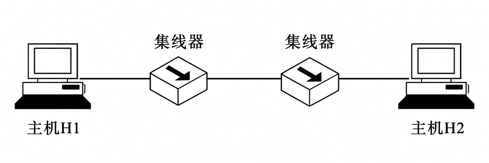
A. \(512m\)
B. \(256m\)
C. \(416m\)
D. \(320m\)

- 答案：D
- 解析：

  CSMA/CD 要求发送方在发送最短帧的时间内仍能检测到最远端发生的冲突，因此必须满足：

  \[
  T_{\text{帧发送}}\geq T_{\text{往返传播}}
  \]

  最小帧长为 64B，其发送时延为：

  \[
  T_t=\frac{64\times 8}{100\times 10^6}\mathrm{s}=5.12\mu\mathrm{s}
  \]

  图中有两个集线器。信号往返时，每个集线器各经过两次，因此集线器总延迟为：

  \[
  T_h=2\times 2\times 0.48=1.92\mu\mathrm{s}
  \]

  设两主机间所有电缆的总长度为 \(L\)。电缆造成的往返传播时延为：

  \[
  T_p=\frac{2L}{200}=\frac{L}{100}\mu\mathrm{s}
  \]

  临界情况下：

  \[
  \begin{aligned}
  \frac{L}{100}+1.92&=5.12\\
  L&=320\mathrm{m}
  \end{aligned}
  \]

  因此选择 D。若忽略集线器延迟，会错误得到更大的距离。

<br>
<br>

3. **【王道·卷三-Q33】** 假定从站点 \(A\) 发送一个很短的分组到站点 \(B\)，站点 \(B\) 收到后立即发送很短的应答分组给站点 \(A\)（双方的发送时延均可忽略不计），站点 \(A\) 测量出往返时间 \(RTT\)，则（  ）。<br>
A. 该 \(RTT\) 的值就是站点 \(A\) 和站点 \(B\) 之间的传输媒体的往返传播时延
B. 该 \(RTT\) 的值有可能小于站点 \(A\) 和站点 \(B\) 之间的传输媒体的往返传播时延
C. 该 \(RTT\) 的值一定大于站点 \(A\) 和站点 \(B\) 之间的传输媒体的往返传播时延
D. 该 \(RTT\) 的值大于或等于站点 \(A\) 和站点 \(B\) 之间的传输媒体的往返传播时延

- 答案：D
- 解析：

  即使分组很短、双方发送时延可以忽略，测得的 RTT 仍可能包含：

  - 信号在传输媒体中的往返传播时延；
  - 中间结点的处理时延；
  - 可能存在的排队时延；
  - 目的站点生成应答时产生的极少量处理时间。

  因此：

  \[
  RTT\geq 2T_p
  \]

  当处理时延和排队时延均为零时，RTT 可以恰好等于往返传播时延；存在其他时延时，RTT 会更大。因此 D 正确。A 忽略了处理和排队等额外时延；B 不可能成立；C 中“一定大于”过强，因为理想情况下可以相等。

<br>
<br>

4. **【王道·卷三-Q39】** 使用类似于TCP滑动窗口的可靠传输字节流的某种协议，数据传输率为 \(2.5Gb/s\)。假定PDU的最大生存时间为51.2s，若要尽可能快地传输数据，则PDU首部中序号字段的长度至少应设计为（  ）（注：\(G = 2^{30}\)）。<br>
A. 64b
B. 37b
C. 34b
D. 32b

- 答案：C
- 解析：

  该协议传输的是可靠字节流，因此序号按字节编号。为了防止序号在旧 PDU 尚未从网络中消失时发生循环复用，序号空间至少要覆盖一个 PDU 最大生存时间内可能发送的字节数。

  数据传输率为：

  \[
  2.5\mathrm{Gb/s}=2.5\times 2^{30}\mathrm{bit/s}
  \]

  在 51.2s 内最多发送的字节数为：

  \[
  \begin{aligned}
  N
  &=\frac{2.5\times 2^{30}\times 51.2}{8}\\
  &=16\times 2^{30}\\
  &=2^{34}\mathrm{B}
  \end{aligned}
  \]

  因此，序号字段至少需要 34 位，才能提供不少于 \(2^{34}\) 个不同序号，选择 C。32 位序号空间过小，会在最大生存时间内发生序号回绕；37 位和 64 位虽然足够，但不是最小长度。

<br>
<br>

5. **【王道·卷四-Q35】** 一个信道的数据传输率为 \(4000b/s\)，单向传播时延是 \(200ms\)，确认帧的长度忽略不计。要使停止-等待协议有 \(50\%\) 以上的信道利用率，最小帧长应为（  ）。<br>
A. 200B
B. 300B
C. 100B
D. 150B

- 答案：A
- 解析：

  设数据帧的发送时延为 \(T_t\)，单向传播时延为 \(T_p=0.2\mathrm{s}\)。确认帧发送时延忽略时，停止-等待协议的信道利用率为：

  \[
  U=\frac{T_t}{T_t+2T_p}
  \]

  要使利用率不低于 \(50\%\)，应满足：

  \[
  \begin{aligned}
  \frac{T_t}{T_t+0.4}&\geq 0.5\\
  2T_t&\geq T_t+0.4\\
  T_t&\geq 0.4\mathrm{s}
  \end{aligned}
  \]

  因此最小帧长为：

  \[
  L=RT_t=4000\times 0.4=1600\mathrm{bit}=200\mathrm{B}
  \]

  当帧长为 200B 时，利用率恰好为 \(50\%\)，符合“\(50\%\) 以上”的要求，因此选择 A。其余小于 200B 的选项均不能达到要求；300B 虽然可以，但不是最小帧长。

<br>
<br>

6. **【王道·卷五-Q33】** 信道的信号状态数为4，信噪比为30dB时的极限数据传输率为 \(8kb/s\)，则其带宽约为（  ）。<br>
A. 0.8kHz
B. 2kHz
C. 0.4kHz
D. 1kHz

- 答案：B
- 解析：

  信道同时受到码元传输速率和信噪比的限制，需要分别考查奈奎斯特公式与香农公式。

  信号状态数为 \(M=4\)，由奈奎斯特公式：

  \[
  C_N=2W\log_2M=2W\log_24=4W
  \]

  信噪比为 30dB，对应的线性信噪比为：

  \[
  \frac{S}{N}=10^{30/10}=1000
  \]

  由香农公式：

  \[
  C_S=W\log_2\left(1+\frac{S}{N}\right)
  =W\log_2(1001)\approx 9.97W
  \]

  实际极限数据传输率由两者中较小者决定，即：

  \[
  C=\min(4W,9.97W)=4W
  \]

  已知 \(C=8\mathrm{kb/s}\)，所以：

  \[
  W=\frac{8\mathrm{kb/s}}{4}=2\mathrm{kHz}
  \]

  因此选择 B。若只使用香农公式，会忽略信号状态数只有 4 所造成的奈奎斯特限制。

<br>
<br>

7. **【王道·卷五-Q35】** 主机 \(A\) 和 \(B\) 采用CSMA/CA协议进行通信，SIFS为 \(28\mu s\)，DIFS为 \(120\mu s\)，RTS、CTS、ACK的发送时延分别为 \(3\mu s\)、\(2\mu s\)、\(2\mu s\)，忽略所有传播时延，主机 \(A\) 要向主机 \(B\) 发送 \(1000B\) 的数据，数据传输率为 \(50Mb/s\)，\(AP\) 收到RTS帧后，要向主机 \(A\) 发送一个CTS帧，则在该CTS帧中，至少要将网络分配向量 \(NAV\) 的值设置为（  ）。<br>
A. \(218\mu s\)
B. \(248\mu s\)
C. \(251\mu s\)
D. \(371\mu s\)

- 答案：A
- 解析：

  CTS 帧中的持续时间字段应表示从 CTS 帧发送完毕后，到本次数据交换结束所需保留的剩余时间。此时 RTS 已经发送完成，CTS 自身的发送时间也不计入 CTS 中的 NAV 值。

  1000B 数据帧的发送时延为：

  \[
  T_{DATA}=\frac{1000\times 8}{50\times 10^6}\mathrm{s}=160\mu\mathrm{s}
  \]

  CTS 发送完成后，剩余交换过程依次为：

  ```text
  SIFS → DATA → SIFS → ACK
  ```

  因此 CTS 中至少应设置：

  \[
  \begin{aligned}
  NAV
  &=T_{SIFS}+T_{DATA}+T_{SIFS}+T_{ACK}\\
  &=28+160+28+2\\
  &=218\mu\mathrm{s}
  \end{aligned}
  \]

  所以选择 A。DIFS 用于竞争信道前的等待，不属于已预约交换过程的剩余时间；RTS 和 CTS 的发送时延也已经发生或正在发生，均不应再次计入 CTS 的 NAV。

<br>
<br>

8. **【王道·卷六-Q33】** 一个传输数字信号的模拟信道的信号功率是 \(0.62W\)，噪声功率是 \(0.02W\)，频率范围是 \(3.5\sim 3.9\mathrm{MHz}\)，则该信道的最高数据传输率是（  ）。<br>
A. \(1M/s\)
B. \(2M/s\)
C. \(4M/s\)
D. \(8M/s\)

- 答案：B
- 解析：

  信道带宽为：

  \[
  W=3.9-3.5=0.4\mathrm{MHz}
  \]

  信噪比为：

  \[
  \frac{S}{N}=\frac{0.62}{0.02}=31
  \]

  根据香农公式，信道的极限数据传输率为：

  \[
  \begin{aligned}
  C
  &=W\log_2\left(1+\frac{S}{N}\right)\\
  &=0.4\times 10^6\times \log_2(32)\\
  &=0.4\times 10^6\times 5\\
  &=2\times 10^6\mathrm{bit/s}
  \end{aligned}
  \]

  即最高数据传输率为 \(2\mathrm{Mb/s}\)，选择 B。A、C、D 均不符合香农公式的计算结果。

<br>
<br>

9. **【王道·卷六-Q34】** 主机甲、乙间采用停止等待协议，发送帧长为 \(50B\) 的数据帧，确认帧采用捎带确认，数据传输率为 \(2kb/s\)，RTT约为 \(200ms\)，则最大信道利用率约为（  ）。<br>
A. \(50\%\)
B. \(33\%\)
C. \(60\%\)
D. \(100\%\)

- 答案：B
- 解析：

  每个 50B 数据帧的发送时延为：

  \[
  T_t=\frac{50\times 8}{2000}\mathrm{s}=0.2\mathrm{s}=200\mathrm{ms}
  \]

  确认采用捎带确认，意味着返回的确认信息附加在反向发送的数据帧中。由于反向数据帧也是 50B，因此它同样需要 200ms 的发送时间，不能像独立短确认帧那样忽略。

  从甲开始发送一个数据帧，到甲收到乙捎带确认的数据帧并能继续发送，周期时间约为：

  \[
  T=T_t+RTT+T_t=200+200+200=600\mathrm{ms}
  \]

  对甲到乙这一方向而言，每个周期内有效发送数据的时间为 200ms，因此最大信道利用率为：

  \[
  U=\frac{200}{600}=\frac{1}{3}\approx 33\%
  \]

  所以选择 B。若把捎带确认误认为发送时延可忽略的短 ACK，才会错误得到 \(50\%\)。

#### 1.2 计算机网络体系结构与参考模型

##### 1.2.1 计算机网络分层结构

<br>
<br>

1. **【王道·卷四-Q33】** 在下列关于 TCP/IP 体系结构的各层使用的服务的说法中，正确的是（  ）。<br>
A. 如果下层使用面向连接的服务，那么紧邻的上层必须使用相同性质的服务
B. 如果下层使用无连接的服务，那么紧邻的上层必须使用相同性质的服务
C. 在所有层上都有服务方式的选择问题
D. 并非在所有层上都有服务方式的选择问题，有些层只提供一种服务

- 答案：D
- 解析：

  网络分层后，每一层向其上一层提供服务，但相邻层所采用的服务类型并不存在必须相同的约束。上层可以在下层服务的基础上，通过确认、重传、排序等机制形成性质不同的服务。

  因此，即使下层提供无连接服务，上层仍可在其基础上实现面向连接的服务；即使下层提供面向连接服务，上层也不必继续提供面向连接服务，A、B 均错误。

  此外，不是每一层都同时提供面向连接和无连接两种服务。例如 TCP/IP 体系结构中的网际层主要提供无连接、尽最大努力交付的 IP 数据报服务，并不存在任意选择两种服务的问题。因此 D 正确，C 错误。

<br>
<br>

2. **【王道·卷七-Q33】** 正确描述网络体系结构中的分层概念的是（  ）。<br>
A. 分层机制使得网络灵活且易于修改
B. 所有的网络体系结构都使用相同的层次名称和功能
C. 把相关的网络功能组合在一层中
D. 定义各层的功能以及功能的具体实现

- 答案：A、C（原题选项设计有误，无唯一正确选项）
- 解析：

  分层的基本思想是将庞大、复杂的通信任务划分为若干相对独立的功能层，并把性质相近、联系紧密的功能组织在同一层中。因此 C 正确。

  各层之间通过明确的接口协作。只要层间接口保持不变，某一层内部协议或实现方式的修改通常不会影响其他层，从而提高网络体系结构的灵活性、可维护性和可扩展性，因此 A 也正确。

  不同网络体系结构的层数、层名和功能划分可能不同，例如 OSI 参考模型与 TCP/IP 参考模型并不完全相同，所以 B 错误。

  网络体系结构描述的是各层功能及协议等抽象规范，不规定功能的具体实现细节，所以 D 错误。

  综上，按当前题面 A、C 同时正确，题目作为单选题没有唯一答案。该题常见的规范版本会把“ A 和 C ”设置为一个组合选项。

<br>
<br>

3. **【竟成·模拟七-33】** 在网络体系结构中，各层的PDU由SDU和PCI构成，OSI参考模型自下而上的第一层、第二层、第三层的SDU分别为（）。
A. 比特流、数据帧、数据分组
B. 数据帧、数据分组、报文段
C. 比特流、数据分组、报文段
D. 报文段、数据分组、数据帧

- 答案：B
- 解析：

  第 \(n\) 层从第 \(n+1\) 层接收的服务数据单元 SDU，本质上就是上一层交下来的 PDU。该层再为 SDU 添加本层协议控制信息 PCI，形成自己的 PDU：

  \[
  \mathrm{PDU}_n=\mathrm{SDU}_n+\mathrm{PCI}_n
  \]

  OSI 参考模型自下而上前三层依次是物理层、数据链路层、网络层：

  1. 物理层接收数据链路层的 PDU，因此其 SDU 是数据帧。
  2. 数据链路层接收网络层的 PDU，因此其 SDU 是数据分组。
  3. 网络层接收传输层的 PDU，因此其 SDU 是报文段。

  所以三者依次为“数据帧、数据分组、报文段”，选择 B。A、C 将物理层自身传送的比特流误当成了物理层 SDU；D 的层次顺序颠倒。

##### 1.2.2 计算机网络协议、服务、接口的概念

<br>
<br>

1. **【王道·卷四-Q40】** HTTP服务器收到GET请求后执行相应的操作，这属于网络协议三要素中的（  ）。<br>
A. 透明
B. 时序
C. 语义
D. 语法

- 答案：C
- 解析：

  网络协议的三要素是语法、语义和同步（时序）：

  - 语法规定报文的格式、字段排列和编码方式，即“数据怎样组织”。
  - 语义规定各字段表示什么，以及接收方收到相应信息后应执行什么操作，即“信息是什么意思、应如何处理”。
  - 时序规定通信事件的先后顺序、速度匹配和状态转换，即“什么时候发送、先做什么后做什么”。

  HTTP 服务器收到 GET 请求后，根据该请求的含义读取并返回指定资源，这描述的是收到某类协议报文后应采取的动作，属于语义，因此选择 C。

  A“透明”不是协议三要素；B 涉及通信顺序或时间关系；D 只涉及 GET 请求的报文格式，而不是执行的操作。

<br>
<br>

2. **【竟成·模拟三-33】** 下列有关协议的要素的说法中，正确的是（）。
I. 有关TCP报文的结构的说明，描述了协议要素中的语法
II. 对于比特流的每一位的含义的解释，描述了协议要素中的语义
III. 通信双方的通信顺序，描述了协议要素中的时序
A. I、II
B. I、III
C. II、III
D. I、II、III

- 答案：D
- 解析：

  I 正确。TCP 报文段中各字段的长度、排列顺序和编码格式属于报文结构规范，描述的是协议的语法。

  II 正确。解释各比特或各字段所代表的含义，以及接收方应据此采取的动作，属于协议的语义。

  III 正确。通信双方何时发送、何时应答、各事件按何种顺序发生，属于协议的时序。

  因此 I、II、III 均正确，选择 D。

<br>
<br>

3. **【竟成·模拟四-33】** 下列有关网络体系结构概念的叙述中，错误的是（）。
A. 协议是不同结点对等实体之间通信的规则
B. 面向连接的服务一定可靠
C. 在网络分层体系结构中，第n层的实体是n-1层的用户，是n+1层的服务提供者
D. 网络体系结构中，主要描述的是网络的层次、各层的功能、协议等，不关心协议的内部实现细节

- 答案：B
- 解析：

  A 正确。协议约束的是不同结点中同一层对等实体之间的通信，包括语法、语义和时序等规则。

  B 错误。面向连接只表示通信前需要建立连接、通信后释放连接，并不必然意味着可靠。可靠性还需要通过确认、序号、超时重传、差错检测等机制保证。因此“面向连接”和“可靠”是两个不同维度的概念。

  C 正确。第 \(n\) 层使用第 \(n-1\) 层提供的服务，因此它是第 \(n-1\) 层的用户；同时第 \(n\) 层又向第 \(n+1\) 层提供服务，因此它是第 \(n+1\) 层的服务提供者。

  D 正确。网络体系结构是抽象的功能与协议规范，不涉及各层功能的具体代码、电路或算法实现细节。

##### 1.2.3 OSI参考模型和TCP/IP模型

<br>
<br>

1. **【竟成·模拟五-33】** 下列选项中，关于OSI参考模型和TCP/IP参考模型提供的服务，说法正确的是（）。
A. OSI模型的网络层提供无连接服务和面向连接的服务，其传输层提供面向连接的服务
B. TCP/IP模型的网络层提供无连接服务和面向连接的服务，其传输层只提供面向连接的服务
C. OSI模型的网络层只提供无连接的服务，其传输层只提供面向连接的服务
D. TCP/IP模型的网络层只提供无连接的服务，其传输层只提供面向连接的服务

- 答案：A
- 解析：

  OSI 参考模型的网络层既可提供面向连接的虚电路服务，也可提供无连接的数据报服务；其传输层主要提供面向连接的可靠传输服务，因此 A 正确。

  TCP/IP 参考模型的网际层以 IP 为核心，只提供无连接、尽最大努力交付的数据报服务；传输层则同时具有面向连接的 TCP 和无连接的 UDP。因此：

  - B 错在 TCP/IP 网际层不提供面向连接服务，且传输层并非只提供面向连接服务。
  - C 错在 OSI 网络层并非只提供无连接服务。
  - D 前半句正确，但后半句忽略了无连接的 UDP 服务。

<br>
<br>

2. **【竟成·模拟六-33】** 下列有关TCP/IP参考模型和OSI模型说法中，正确的是（）。
I. TCP/IP参考模型自下而上分别是物理层、数据链路层、网络层、传输层、应用层
II. OSI参考模型自下而上分别是物理层、数据链路层、网络层、传输层、会话层、表示层、应用层
III. TCP/IP参考模型将表示层和会话层合并到了应用层
A. I、II
B. I、III
C. II、III
D. I、II、III

- 答案：C
- 解析：

  I 错误。经典 TCP/IP 参考模型自下而上通常划分为网络接口层、网际层、传输层和应用层，共四层。题干所列的物理层、数据链路层、网络层、传输层、应用层属于教学中常用的五层协议体系结构，不是经典 TCP/IP 四层参考模型的严格表述。

  II 正确。OSI 参考模型自下而上依次为物理层、数据链路层、网络层、传输层、会话层、表示层和应用层，共七层。

  III 正确。TCP/IP 模型没有单独设置会话层和表示层，这两层的相关功能由应用层协议或应用程序负责实现，可理解为合并到了应用层。

  因此正确的是 II、III，选择 C。

### 第2章 物理层

#### 2.1 通信基础

##### 2.1.1 基本概念

<br>
<br>

1. **【王道·卷三-Q34】** 下图为一段差分曼彻斯特编码的信号波形，其编码的比特流是（  ）。<br>
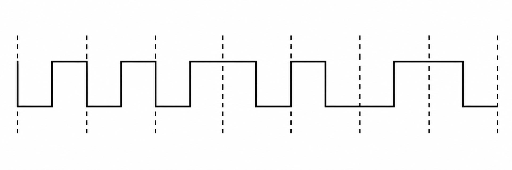
A. 0001101
B. 0001011
C. 1011110
D. 1001110

- 答案：B
- 解析：

  差分曼彻斯特编码的每个码元中间必定发生一次电平跳变，以便接收端提取时钟；码元开始处是否跳变则用于表示数据。按本题采用的约定：

  - 码元开始处发生跳变表示二进制 0；
  - 码元开始处不发生跳变表示二进制 1。

  从左到右观察 7 个码元边界：

  1. 第 1 个码元开始处有跳变，表示 0；
  2. 第 2 个码元开始处有跳变，表示 0；
  3. 第 3 个码元开始处有跳变，表示 0；
  4. 第 4 个码元开始处无跳变，表示 1；
  5. 第 5 个码元开始处有跳变，表示 0；
  6. 第 6 个码元开始处无跳变，表示 1；
  7. 第 7 个码元开始处无跳变，表示 1。

  因而编码的比特流为 0001011，选择 B。A 将第 6、7 位判反；C、D 则相当于采用了相反的起始跳变判定规则，且与本题波形不符。

<br>
<br>

2. **【王道·卷四-Q34】** 在下列关于物理层功能的说法中，正确的是（  ）。<br>
I. 物理层需要考虑具体的传输媒体
II. 物理层上传送数据的单位是比特
III. 物理层不需要考虑哪些比特具体代表什么含义
IV. 物理层需要确定连接电缆的插头应当有多少根引脚以及各引脚如何连接
A. I、II、IV
B. II、III、IV
C. III、IV
D. I、IV

- 答案：B
- 解析：

  I 错误。物理层研究的是如何利用传输媒体传送原始比特流，并规定与传输媒体有关的接口特性，但具体传输媒体本身通常不属于物理层协议的组成部分。不能把“物理层需要在媒体上传输比特”理解成“具体媒体属于物理层”。

  II 正确。物理层的协议数据单元是比特，负责将 0、1 比特转换为相应的电信号、光信号或无线信号进行传输。

  III 正确。物理层只负责透明传送比特流，不解释这些比特所表示的帧、地址或应用数据含义。

  IV 正确。物理层需要规定机械特性、电气特性、功能特性和过程特性。插头的形状、引脚数量以及各引脚连接方式属于机械特性和功能特性的内容。

  因此正确的是 II、III、IV，选择 B。

<br>
<br>

3. **【王道·卷八-Q35】** 数据链路层采用GBN协议传输数据，使用3比特给帧编号，发送方的发送窗口取最大值，不考虑流量控制，假设发送方发送的第一个帧的序号为0，且序号落入发送窗口内的所有帧都已发送出去。当计时器超时的时候，若发送方只收到了1、3号帧的确认，则发送方需要重发的帧的数量以及发送窗口内的最后一个序号分别是（  ）。<br>
A. 1, 2
B. 2, 0
C. 3, 2
D. 7, 0

- 答案：C
- 解析：

  GBN 协议使用 3 比特给帧编号，序号空间大小为：

  \[
  2^3=8
  \]

  GBN 的发送窗口最大值为：

  \[
  W_T=2^3-1=7
  \]

  因此初始发送窗口包含序号 0、1、2、3、4、5、6，题目说明这些帧均已发送。

  GBN 采用累计确认。发送方收到 3 号帧的确认，说明 0～3 号帧均已被正确接收；此前收到的 1 号确认已被 3 号确认覆盖。因此尚未确认的是 4、5、6 号帧。

  计时器超时时，GBN 从最早未确认帧开始，将其后所有已发送但未确认的帧全部重传，所以需重传 4、5、6 号帧，共 3 帧。

  窗口基序号滑动到 4 后，发送窗口依次包含：

  \[
  4,5,6,7,0,1,2
  \]

  窗口内最后一个序号为 2。因此选择 C。

##### 2.1.2 信道的极限容量

<br>
<br>

1. **【王道·卷二-Q34】** 在下列关于香农定理和信噪比的说法中，正确的是（  ）。<br>
A. 在实际的传输环境中，信噪比是可以做到任意大的
B. 对于一定的信噪比，码元的传输率越小就越容易出现接收时的判决错误
C. 如果减小信噪比，那么码元的传输率就可以提高而不至于使判决错误的概率增大
D. 香农公式的意义在于，只要信息传输率低于信道的极限信息传输率，就一定可以找到某种办法来实现无差错的传输

- 答案：D
- 解析：

  香农公式给出的有噪声信道极限信息传输率为：

  \[
  C=W\log_2(1+S/N)
  \]

  其中，\(W\) 为信道带宽，\(S/N\) 为信噪比。

  A 错误。实际环境中噪声不可能完全消除，发送功率也不能无限增大，因此信噪比不可能任意大。

  B 错误。在其他条件相同的情况下，降低码元传输速率可使每个码元占用更长时间，接收端通常更容易判决，而不是更容易出错。

  C 错误。信噪比减小意味着噪声影响增强，信道容量下降。此时若反而提高码元传输率，判决错误概率通常会增大。

  D 正确。香农定理说明，当实际信息传输率低于信道容量时，理论上存在合适的编码方法，可使误码率任意小；教材通常将其概括为能够实现无差错传输。

<br>
<br>

2. **【竟成·模拟一-34】** 某无噪声信道的带宽为1MHz，采用8种相位的PSK调制。若实际数据传输速率为该信道理论最大数据传输速率的50%，传输一个24KB的数据块，单向传播时延为20ms。忽略处理时延和确认时间，则总时延是（注：K=10³，M=10⁶）（）。
A. 28ms
B. 84ms
C. 86ms
D. 148ms

- 答案：B
- 解析：

  无噪声理想低通信道采用奈奎斯特公式：

  \[
  C_{\max}=2W\log_2 M
  \]

  其中：

  \[
  W=1\mathrm{MHz}=10^6\mathrm{Hz},\qquad M=8
  \]

  因此理论最大数据传输速率为：

  \[
  C_{\max}=2\times10^6\times\log_2 8
  =2\times10^6\times3
  =6\mathrm{Mb/s}
  \]

  实际数据传输速率为理论最大值的 50%，即：

  \[
  R=3\mathrm{Mb/s}
  \]

  数据块大小为 24KB，题目规定 \(K=10^3\)，所以：

  \[
  L=24\times10^3\times8=192000\mathrm{bit}
  \]

  发送时延为：

  \[
  T_t=\frac{192000}{3\times10^6}\mathrm{s}
  =0.064\mathrm{s}=64\mathrm{ms}
  \]

  加上单向传播时延 20ms，总时延为：

  \[
  T=64+20=84\mathrm{ms}
  \]

  因此选择 B。A 忽略了大部分发送时延；C、D 均不符合发送时延与传播时延之和。

<br>
<br>

3. **【竟成·模拟六-34】** 下列有关奈奎斯特定理和香农定理的说法中，错误的是（）。
A. 奈奎斯特定理适用于无噪声理想低通环境，香农定理适用于有噪声信道
B. 奈奎斯特定理和香农定理都定义了理想状态下的最大数据传输速率
C. 在有噪声的环境中，影响信道的最大传输速率的因素主要是信道带宽和信噪比
D. 在无噪声理想低通环境中，影响信道的最大传输速率的因素主要是信道带宽和码元波形种类

- 答案：B
- 解析：

  A 正确。奈奎斯特定理讨论无噪声理想低通信道中的码元传输极限；香农定理则考虑信道中存在高斯白噪声时的信息传输容量。

  B 错误。奈奎斯特公式建立在无噪声理想低通条件下，而香农公式恰恰把噪声因素纳入模型。因此不能笼统地说两者都定义了“理想无噪声状态”下的最大数据传输速率。

  C 正确。香农公式为：

  \[
  C=W\log_2(1+S/N)
  \]

  可见有噪声信道的容量主要由带宽 \(W\) 和信噪比 \(S/N\) 决定。

  D 正确。奈奎斯特公式为：

  \[
  C=2W\log_2 M
  \]

  其中 \(M\) 是码元可取的离散状态数，即码元波形种类数，所以无噪声理想低通信道的极限速率主要取决于信道带宽和码元状态数。

<br>
<br>

4. **【竟成·模拟七-34】** 链路的带宽约为10kHz，信噪比为30dB，信号采用64个幅值的ASK调制，信道的极限码元传输速率约为（）。
A. 16.67Baud
B. 20Baud
C. 16.67kBaud
D. 20kBaud

- 答案：C
- 解析：

  信噪比为 30dB，先换算为普通比值：

  \[
  10\log_{10}(S/N)=30
  \]

  所以：

  \[
  S/N=10^3=1000
  \]

  根据香农公式，信道极限数据传输速率约为：

  \[
  \begin{aligned}
  C&=W\log_2(1+S/N)\\
   &=10\times10^3\log_2(1001)\\
   &\approx 10\times10^3\times9.97\\
   &\approx99.7\mathrm{kb/s}
  \end{aligned}
  \]

  64 个幅值表示每个码元携带：

  \[
  \log_2 64=6\mathrm{bit}
  \]

  因此由香农容量限制得到的最大码元传输速率约为：

  \[
  B=\frac{99.7\mathrm{kb/s}}{6\mathrm{bit/Baud}}
  \approx16.62\mathrm{kBaud}
  \]

  奈奎斯特定理给出的码元速率上限为：

  \[
  2W=20\mathrm{kBaud}
  \]

  实际极限应同时满足两种限制，因此取较小者，约为 \(16.67\mathrm{kBaud}\)，选择 C。D 只考虑了奈奎斯特限制，没有考虑信噪比造成的香农容量约束；A、B 的单位数量级错误。

##### 2.1.3 编码与调制

<br>
<br>

1. **【王道·卷五-Q34】** [题目有错误] 共有 \(A,B,C,D\) 四个站点进行码分多址(CDMA)通信，\(A,B,C,D\) 的码片序列分别是 \((- 1 - 1 - 1 + 1 + 1 - 1 + 1 + 1)\)，\((- 1 - 1 + 1 - 1 + 1 + 1 + 1 - 1)\)，\((- 1 + 1 - 1 - 1 + 1 + 1 - 1 - 1)\)，若收到的码片序列是 \((- 1 + 1 - 3 + 1 - 1 - 3 + 1 + 1)\)，则各个站点发送的数据是（  ）。<br>
A. 1,1,0,1
B. 1,0,无数据,1
C. 0,0,0,1
D. 1,0,0,1

- 答案：B（按命题意图；题面本身存在错误）
- 解析：

  CDMA 解码时，将接收码片序列分别与各站点的码片序列作规格化内积。若结果为 \(+1\)，表示发送数据 1；若结果为 \(-1\)，表示发送数据 0；若结果为 0，表示该站点未发送数据。

  设接收序列为 \(S\)，则对站点 A：

  \[
  \frac{S\cdot A}{8}=1
  \]

  因而 A 发送数据 1。

  对站点 B：

  \[
  \frac{S\cdot B}{8}=-1
  \]

  因而 B 发送数据 0。

  对题面给出的站点 C 序列：

  \[
  \frac{S\cdot C}{8}=-\frac{1}{4}
  \]

  结果既不是 \(+1\)、\(-1\)，也不是 0。这说明题面所给码片序列并不满足标准 CDMA 所要求的两两正交条件，无法据此正常判断 C 的数据。

  此外，题目声称给出了 A、B、C、D 四个站点的码片序列，但实际只列出了三个序列，D 的码片序列缺失，因此也不能按照标准内积法独立解出 D。

  从选项和命题意图判断，预期结果应为 A 发送 1、B 发送 0、C 无数据、D 发送 1，即选择 B。但严格依据当前题面，题目没有完整且自洽的唯一解。

<br>
<br>

2. **【竟成·模拟三-34】** 若采用编码方案1和编码方案2获得的结果均如下图所示，方案1对应的比特流为10100010，方案2对应的比特流为10010110，方案1和方案2的编码方案分别为（）。
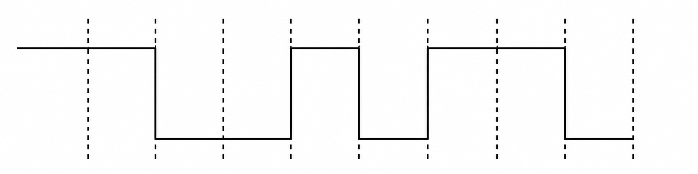
A. NRZ、NRZI
B. NRZI、NRZ
C. RZ、NRZI
D. NRZI、RZ

- 答案：B
- 解析：

  先按每个码元区间直接观察电平。图中 8 个码元的电平依次为：

  \[
  \text{高、低、低、高、低、高、高、低}
  \]

  若采用 NRZ 编码，并约定高电平表示 1、低电平表示 0，则得到：

  \[
  10010110
  \]

  这正好对应方案 2，因此方案 2 是 NRZ。

  再观察相邻码元边界是否发生电平跳变。按题目采用的 NRZI 规则，数据 0 使电平翻转，数据 1 保持电平不变。以图中初始高电平为基准，各码元依次得到：

  \[
  10100010
  \]

  这正好对应方案 1，因此方案 1 是 NRZI。

  所以方案 1、方案 2 分别为 NRZI、NRZ，选择 B。图中每个码元并非都在码元结束前回到零电平，因此 C、D 中的 RZ 不成立。

<br>
<br>

3. **【竟成·模拟五-34】** 采用曼彻斯特编码和差分曼彻斯特编码（上一个码元的后半个码元为低电平）的编码波形图如下图所示，其表示的比特流分别为（）。
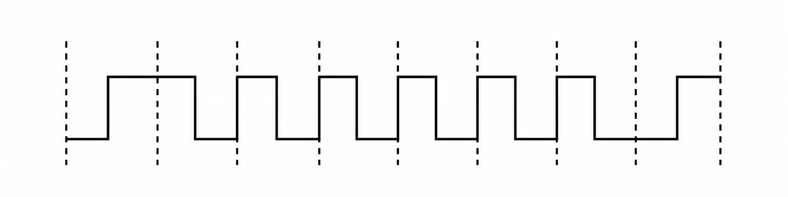
A. 10000001、01111110
B. 11000001、01111110
C. 01111110、11000001
D. 01110001、11000001

- 答案：C
- 解析：

  对曼彻斯特编码，每个码元中点都发生跳变。本题采用的约定是：

  - 码元中点由低电平跳变到高电平表示 0；
  - 码元中点由高电平跳变到低电平表示 1。

  从左到右观察 8 个码元，中点跳变方向依次为：

  \[
  \text{低到高、高到低、高到低、高到低、高到低、高到低、高到低、低到高}
  \]

  因而曼彻斯特编码对应的比特流为：

  \[
  01111110
  \]

  对差分曼彻斯特编码，码元中点的跳变仅用于同步，码元开始处是否跳变表示数据。本题已知上一个码元的后半个码元为低电平，并采用：

  - 码元开始处有跳变表示 0；
  - 码元开始处无跳变表示 1。

  逐个判断 8 个码元开始处，结果为：

  \[
  11000001
  \]

  因此两种编码分别表示 01111110、11000001，选择 C。A、B 的差分曼彻斯特结果不符合码元起始边界的跳变情况；D 对曼彻斯特波形中间若干码元的跳变方向判断错误。


#### 2.3 物理层设备

##### 2.3.1 中继器

<br>
<br>

1. **【王道·卷八-Q34】** 在数字信号传输中，当传输距离超过一定的长度时，传输介质中的数据就会衰减。如果需要比较长的传输距离，就需要安装（  ）设备。<br>
A. 放大器
B. 中继器
C. 路由器
D. 交换机

- 答案：B
- 解析：

  数字信号在传输介质中传播时会因衰减、失真和噪声干扰而逐渐变差。中继器工作在物理层，其作用是接收已经衰减或失真的数字信号，对其进行整形、放大和再生，然后继续向下一段链路转发，从而延长数字信号的有效传输距离。

  各选项分析如下：

  - A 项：放大器通常用于模拟信号，只会把输入信号连同噪声一起放大，不能恢复数字信号原有的标准波形。
  - B 项：中继器能够对数字信号进行再生，适合延长数字链路的传输距离，正确。
  - C 项：路由器工作在网络层，主要根据网络层地址选择分组转发路径，不负责单纯的信号再生。
  - D 项：交换机通常工作在数据链路层，主要依据 MAC 地址转发帧，也不是本题所问的物理信号再生设备。

<br>
<br>

2. **【王道·卷八-Q36】** 考虑建立一个CSMA/CD网络，电缆长度为1km，不使用中继器，传输率为1Gb/s，电缆中信号的传播速率是200000km/s，则该网络中的最小帧长是（  ）。<br>
A. 10000bit
B. 1000bit
C. 5000bit
D. 20000bit

- 答案：A
- 解析：

  CSMA/CD 要求发送站在发送完整个最短帧之前，仍能检测到网络最远端产生的冲突。因此，最短帧的发送时延至少应等于信号在网络中的往返传播时延：

  
  \[
  T_{\min}=2\tau
  \]

  电缆长度为 \(1\text{ km}\)，信号传播速率为 \(200000\text{ km/s}\)，单向传播时延为：

  \[
  \tau=\frac{1\text{ km}}{200000\text{ km/s}}=5\times10^{-6}\text{ s}=5\,\mu\text{s}
  \]

  因而往返传播时延为：

  \[
  2\tau=10\,\mu\text{s}
  \]

  传输率为 \(1\text{ Gb/s}=10^9\text{ bit/s}\)，最小帧长为：

  \[
  L_{\min}=10^9\times10\times10^{-6}=10000\text{ bit}
  \]

  因此选择 A。B、C 都小于检测最远端冲突所需的最小长度；D 虽然也能满足冲突检测要求，但它不是理论上的最小帧长。

##### 2.3.2 集线器

<br>
<br>

1. **【竟成·模拟一-33】** 下列关于集线器的描述中，正确的是（）。
A. 集线器可连接不同速率的以太网段进行正常工作
B. 集线器连接的多个网段必须工作在半双工模式
C. 集线器通过隔离冲突域减少广播风暴
D. 集线器能够识别MAC地址并过滤无效帧

- 答案：B
- 解析：

  集线器本质上是一个多端口中继器，工作在物理层。它收到某个端口传来的比特信号后，会将信号再生并转发到其他所有端口，不检查帧的内容，也不识别 MAC 地址。

  集线器连接的所有站点共享同一条逻辑信道，处于同一个冲突域中。为了使用 CSMA/CD 检测冲突，各端口必须采用半双工方式工作，不能同时发送和接收，因此 B 正确。

  各错误选项分析如下：

  - A 项：普通集线器各端口属于同一共享介质，通常必须采用相同速率；它不能像交换机那样在不同速率端口之间缓存和转换帧。
  - C 项：集线器不隔离冲突域，也不隔离广播域，反而使所有端口共同处于一个冲突域中。
  - D 项：识别 MAC 地址并有选择地转发帧是交换机或网桥的功能；集线器只处理物理比特信号。

### 第3章 数据链路层

#### 3.3 差错控制

##### 3.3.1 检错编码

<br>
<br>

1. **【竟成·模拟二-34】** 下列关于检错码和纠错码的说法，错误的是（）。
A. 在线路误码率较低时，纠错码一般比检错码编码效率更高
B. 奇偶校验码属于检错码
C. 海明码属于纠错码
D. 以太网使用的检错码不能保证发送的数据帧一定成功交付

- 答案：A
- 解析：

  在线路误码率较低时，发生差错的帧数量较少。此时采用“检错码 + 出错后重传”的方案，只需附加较少的校验信息，偶尔重传即可，通常比持续加入大量冗余位的纠错码更高效。因此 A 的说法错误。

  各选项分析如下：

  - B 项：奇偶校验码通过增加一个校验位判断收到的比特序列中 1 的个数是否符合约定，属于检错码。
  - C 项：典型海明码可以定位并纠正一位错误，属于纠错码。
  - D 项：以太网帧尾的 FCS 采用 CRC 检错，但以太网的数据链路层通常只丢弃检测出差错的帧，不负责确认与重传，因此不能保证帧一定成功交付。

<br>
<br>

2. **【竟成·模拟六-36】** 下列有关数据链路层的差错控制的方法中，说法错误的是（）。
A. 采用循环冗余校验码的差错控制方法后，数据链路层向网络层提供了可靠的传输
B. 奇偶校验码是一种检错编码，能检验奇数个比特出错的情况
C. 海明码是一种纠错编码，既能够检测出差错，又能够纠正错误
D. 使用海明码，信息位若为10位，则检验码的位数至少为4位

- 答案：A
- 解析：

  CRC 只能以很高概率检测传输差错，不能仅凭自身保证出错帧被恢复，更不能保证丢帧、重复帧等问题得到处理。只有将检错机制与确认、超时重传、序号等可靠传输机制结合，数据链路层才可能向上层提供可靠服务。因此 A 错误。

  各选项分析如下：

  - B 项：单个奇偶校验位能够检测任意奇数个比特发生翻转，但无法检测偶数个比特同时翻转，正确。
  - C 项：基本海明码的最小码距为 3，能够检测并纠正一位差错，正确。
  - D 项：设信息位数为 \(m=10\)，校验位数为 \(r\)。海明码要能够表示“无差错”以及所有可能的单比特错误位置，需满足：

    \[
    2^r\geq m+r+1
    \]

    当 \(r=3\) 时，\(2^3=8<14\)，不满足；当 \(r=4\) 时，\(2^4=16\geq15\)，因此至少需要 4 位校验位，D 正确。

<br>
<br>

3. **【竟成·模拟七-36】** 主机要发送的字符序列为101110，双方约定的生成多项式P(x)=x³+1，则发送方需要添加的FCS应为（）。
A. 100
B. 11
C. 011
D. 0011

- 答案：C
- 解析：

  生成多项式为：

  \[
  P(x)=x^3+1
  \]

  对应的二进制除数为 \(1001\)。其最高次数为 3，因此应在原始数据 \(101110\) 后补 3 个 0，得到：

  \[
  101110000
  \]

  用模 2 除法计算：

  ```text
  101110000 ÷ 1001
  ```

  所得 3 位余数为：

  \[
  011
  \]

  因此发送方添加的 FCS 为 011，选择 C。FCS 的位数必须等于生成多项式的最高次数，即 3 位，所以 B 的 2 位和 D 的 4 位首先可以排除；A 不是本次模 2 除法的余数。

##### 3.3.2 纠错编码

<br>
<br>

1. **【竟成·模拟一-35】** 下列关于海明码的叙述中，正确的是（）。
A. 海明码的校验位必须位于二进制位的奇数位置
B. 对于4位数据位，至少需要3位校验位才能实现纠错
C. 海明码的编码过程中，每个校验位仅负责校验一个数据位
D. 接收端检测到码距为3的海明码错误时，最多能纠正2位同时发生的错误

- 答案：B
- 解析：

  设数据位数为 \(m=4\)，校验位数为 \(r\)。要实现一位纠错，需要满足：

  \[
  2^r\geq m+r+1
  \]

  当 \(r=2\) 时，\(2^2=4<7\)，不满足；当 \(r=3\) 时，\(2^3=8\geq8\)，恰好满足。因此至少需要 3 位校验位，B 正确。

  其他选项分析如下：

  - A 项：海明码校验位通常放在序号为 \(1,2,4,8,\ldots\) 的位置，即 2 的整数次幂位置，并不是所有奇数位置。
  - C 项：每个校验位负责校验一组码位，多个校验组相互交叠，从而利用综合校验结果定位错误位置；并非只校验一个数据位。
  - D 项：最小码距为 3 的编码最多纠正：

    \[
    \left\lfloor\frac{3-1}{2}\right\rfloor=1
    \]

    位错误，不能纠正两位同时发生的错误。

<br>
<br>

2. **【竟成·模拟三-37】** 主机收到的海明序列为101110100111011（序列从右向左编号，右边为最低位），有效数据为11位，经过检测后，发现出现了差错，错误的位置为（）。
A. 第1位
B. 第2位
C. 第4位
D. 第8位

- 答案：D
- 解析：

  该海明码共有 15 位，其中校验位位于第 \(1,2,4,8\) 位。题目说明从右向左编号，因此最右端是第 1 位。采用偶校验，分别计算 4 个校验组的校验结果。

  - 第 1 位校验组覆盖编号二进制最低位为 1 的位置：\(1,3,5,7,9,11,13,15\)，校验结果为 0。
  - 第 2 位校验组覆盖：\(2,3,6,7,10,11,14,15\)，校验结果为 0。
  - 第 4 位校验组覆盖：\(4,5,6,7,12,13,14,15\)，校验结果为 0。
  - 第 8 位校验组覆盖：\(8,9,10,11,12,13,14,15\)，校验结果为 1。

  将校验结果按 \(S_8S_4S_2S_1\) 排列，得到：

  \[
  1000_2=8
  \]

  因而错误发生在第 8 位，选择 D。A、B、C 分别对应综合校验结果为 \(0001\)、\(0010\)、\(0100\)，均与实际校验结果不符。

#### 3.4 流量控制与可靠传输机制

##### 3.4.1 流量控制与滑动窗口机制

<br>
<br>

1. **【王道·卷一-Q35】** 数据链路层采用SR协议传输数据，使用4bit给帧编号，接收窗口的尺寸取值为5，发送窗口的尺寸取最大值，发送窗口内的起始序号为0，数据帧的初始序号为0，假设发送方已发送了 \(0\sim 6\) 号数据帧，现已收到1，3，5号帧的确认，而0，2，4号数据帧依次超时，则此时发送方最多能发送的数据帧数量为（  ）。<br>
A. 8
B. 7
C. 5
D. 4

- 答案：D
- 解析：

  帧序号字段为 4 bit，因此序号空间大小为：

  \[
  2^4=16
  \]

  SR 协议为了避免新旧帧序号混淆，发送窗口与接收窗口之和应满足：

  \[
  W_T+W_R\leq 2^n
  \]

  已知接收窗口 \(W_R=5\)，发送窗口取最大值，因此：

  \[
  W_T=16-5=11
  \]

  发送窗口起始序号为 0，所以当前发送窗口覆盖的序号为：

  \[
  0,1,2,3,4,5,6,7,8,9,10
  \]

  发送方已经发送了 0～6 号帧，其中 1、3、5 号帧已确认；0、2、4 号帧超时后需要分别重传，但这些重传并不使发送窗口前移。由于 0 号帧尚未被确认，发送窗口的左边界仍停留在 0。

  因此，在当前发送窗口内尚未发送的新帧只有：

  \[
  7,8,9,10
  \]

  共 4 帧，故选择 D。

  A、B、C 均超过了当前窗口中尚未使用的 4 个序号位置。

<br>
<br>

2. **【王道·卷二-Q35】** 主机 \(A\)、\(B\) 之间建立了一条 TCP 连接，发送窗口的大小是3，序号范围是 \([0,15]\)，传输媒介保证在接收方能够按序收到分组。在某个时刻，接收方期望收到的下一个序号是5，则发送窗口可能出现的序号组合有（  ）个。<br>
A. 2
B. 3
C. 4
D. 5

- 答案：C
- 解析：

  接收方期望收到的下一个序号为 5，说明序号 0～4 的分组均已按序到达接收方。

  发送窗口大小为 3。由于确认报文在返回途中可能存在传播延迟，发送方掌握的确认状态可能落后于接收方，因此发送窗口左边界不一定已经移动到 5。

  但为了使接收方已经收到序号 4 的分组，发送方此前必须能够发送序号 4。窗口大小为 3，所以发送窗口左边界最小只能为 2；若左边界小于 2，则窗口中不包含序号 4。

  发送方可能已经收到不同程度的确认，因此发送窗口可能为：

  \[
  \begin{aligned}
  &[2,3,4] \\
  &[3,4,5] \\
  &[4,5,6] \\
  &[5,6,7]
  \end{aligned}
  \]

  共 4 种组合，故选择 C。

  发送窗口不可能从 6 或更大的序号开始，因为这意味着发送方已经确认序号 5 以前的数据，而接收方当前仍在等待序号 5。

##### 3.4.2 可靠传输机制

<br>
<br>

1. **【竟成·模拟二-35】** 主机甲和主机乙在数据链路层采用停止-等待协议进行数据帧的发送，RTT为100ms，数据传输速率为20kbps，忽略确认帧的传输时延。主机甲的最大信道利用率约为33.3%，则数据帧的长度为（）。
A. 125B
B. 250B
C. 1000B
D. 2000B

- 答案：A
- 解析：

  停止-等待协议中，忽略确认帧的发送时延时，信道利用率为：

  \[
  U=\frac{T_f}{T_f+RTT}
  \]

  其中，\(T_f\) 为数据帧发送时延。题目给出：

  \[
  U=33.3\%\approx\frac{1}{3},\qquad RTT=100\text{ ms}=0.1\text{ s}
  \]

  代入得：

  \[
  \frac{T_f}{T_f+0.1}=\frac{1}{3}
  \]

  解得：

  \[
  3T_f=T_f+0.1
  \]

  \[
  T_f=0.05\text{ s}
  \]

  数据传输速率为 \(20\text{ kbps}=20000\text{ bit/s}\)，因此数据帧长度为：

  \[
  L=RT_f=20000\times0.05=1000\text{ bit}
  \]

  换算为字节：

  \[
  1000\div8=125\text{ B}
  \]

  因此选择 A。

<br>
<br>

2. **【竟成·模拟三-36】** 假设主机甲和主机乙数据链路层采用GBN协议传输数据，数据传输速率为10kbps，数据帧和确认帧都是1000B，单向传播时延为700ms，帧序列的比特数为2。主机甲向主机乙发送数据，则甲的最大信道利用率为（）。
A. 40%
B. 60%
C. 80%
D. 100%

- 答案：C
- 解析：

  帧序号字段为 2 bit。在 GBN 协议中，发送窗口的最大值为：

  \[
  W_T=2^2-1=3
  \]

  数据帧和确认帧的长度均为：

  \[
  1000\text{ B}=8000\text{ bit}
  \]

  数据传输速率为 \(10\text{ kbps}=10000\text{ bit/s}\)，所以数据帧和确认帧的发送时延均为：

  \[
  T_f=T_{ACK}=\frac{8000}{10000}=0.8\text{ s}
  \]

  单向传播时延为：

  \[
  T_p=0.7\text{ s}
  \]

  从发送一个数据帧开始，到该帧的确认完整返回发送方，所需时间为：

  \[
  T_f+T_p+T_{ACK}+T_p
  =0.8+0.7+0.8+0.7
  =3.0\text{ s}
  \]

  一个发送窗口最多连续发送 3 个数据帧，发送方实际发送数据的时间为：

  \[
  W_TT_f=3\times0.8=2.4\text{ s}
  \]

  因此最大信道利用率为：

  \[
  U=\frac{2.4}{3.0}=0.8=80\%
  \]

  故选择 C。

  由于窗口中的 3 个帧发送完毕后，最早的确认尚未完整返回，发送方仍会出现等待，因此利用率不能达到 100%。

<br>
<br>

3. **【竟成·模拟七-35】** 主机的数据链路层采用GBN协议传输数据，并采用3bit给帧进行编号。从0时刻开始，主机开始发送数据，当主机发送了5号数据帧后，收到了3号数据帧的确认，在t时段内未收到任何确认帧且发送的帧未超时，在t时段内主机可发送的数据帧数为（）。
A. 2
B. 3
C. 4
D. 5

- 答案：D
- 解析：

  GBN 协议采用 3 bit 帧序号，因此序号空间大小为：

  \[
  2^3=8
  \]

  GBN 发送窗口的最大值为：

  \[
  W_T=2^3-1=7
  \]

  主机已经发送了 0～5 号帧。收到 3 号帧的确认时，GBN 的累计确认表示 0～3 号帧均已正确收到，因此发送窗口左边界移动到 4。

  此时发送窗口覆盖 7 个序号：

  \[
  4,5,6,7,0,1,2
  \]

  其中 4、5 号帧已经发送但尚未被确认，因此窗口中仍可用于发送新数据帧的序号为：

  \[
  6,7,0,1,2
  \]

  共 5 帧。在 \(t\) 时段内没有新的确认且已发送帧未超时，因此窗口不会继续前移，也不需要重传，最多可发送 5 个新数据帧，选择 D。

#### 3.5 介质访问控制

##### 3.5.1 信道划分介质访问控制

<br>
<br>

1. **【竟成·模拟三-38】** 站点H1、H2、H3、H4、H5通过CDMA共享通信链路，H1~H4各自的码片序列为(1,-1,1,-1)、(1,1,-1,-1)、(1,1,1,1)、(1,-1,-1,1)。H5收到一个序列为(0,2,2,0,0,-2,-2,0,2,0,0,2)，解析得到的数据为011，则发送该数据的站点为（）。
A. H1
B. H2
C. H3
D. H4

- 答案：D
- 解析：

  每个站点的码片序列长度为 4，因此将 H5 收到的序列按每 4 个码片分为 3 组：

  \[
  \begin{aligned}
  R_1&=(0,2,2,0)\\
  R_2&=(0,-2,-2,0)\\
  R_3&=(2,0,0,2)
  \end{aligned}
  \]

  CDMA 解码时，将接收序列与某站点的码片序列做规格化内积。结果为 \(1\) 表示发送比特 1，为 \(-1\) 表示发送比特 0，为 0 表示该站点未发送相应信号。

  H4 的码片序列为：

  \[
  C_4=(1,-1,-1,1)
  \]

  分别计算三组内积：

  \[
  \frac{R_1\cdot C_4}{4}
  =\frac{0\times1+2\times(-1)+2\times(-1)+0\times1}{4}
  =-1
  \]

  \[
  \frac{R_2\cdot C_4}{4}
  =\frac{0\times1+(-2)\times(-1)+(-2)\times(-1)+0\times1}{4}
  =1
  \]

  \[
  \frac{R_3\cdot C_4}{4}
  =\frac{2\times1+0\times(-1)+0\times(-1)+2\times1}{4}
  =1
  \]

  解码结果为 \((-1,1,1)\)，对应数据比特 \(011\)。因此发送该数据的站点是 H4，选择 D。

  H1、H2 与各接收分组的规格化内积均为 0；H3 的解码结果为 \(101\)，均不符合题意。

##### 3.5.2 随机访问介质访问控制

<br>
<br>

1. **【王道·卷三-Q35】** 假设一个以太网只有两个站点，它们同时发送数据，并且产生了碰撞，于是按截断二进制指数退避算法进行重传，则重传第二次才成功的概率是（  ）。<br>
A. 0.5
B. 0.375
C. 0.125
D. 0.325

- 答案：B
- 解析：

  两个站点第一次发送时已经发生碰撞。

  第一次重传前，碰撞次数 \(k=1\)，每个站点从集合 \(\{0,1\}\) 中等概率选择一个退避时间。两个站点再次碰撞的条件是选择相同的退避值，其概率为：

  \[
  P_1=\frac{2}{2^2}=\frac{1}{2}
  \]

  第二次重传前，碰撞次数 \(k=2\)，每个站点从 \(\{0,1,2,3\}\) 中等概率选择退避值。两个站点选择不同退避值时，第二次重传成功，其概率为：

  \[
  P_2=1-\frac{4}{4^2}=1-\frac14=\frac34
  \]

  因此，“第一次重传仍碰撞，第二次重传才成功”的概率为：

  \[
  P=P_1P_2=\frac12\times\frac34=\frac38=0.375
  \]

  故选择 B。A 只考虑了一次退避；C、D 均不符合联合概率计算结果。

<br>
<br>

2. **【王道·卷六-Q35】** CSMA协议可利用多种监听算法来减小发生冲突的概率。在下面关于各种监听算法的描述中，错误的是（  ）。<br>
I. 非坚持型监听算法有利于缩短网络空闲时间
II. 1-坚持型监听算法有利于减小冲突的概率
III. \(p-\) 坚持型监听算法无法缩短网络的空闲时间
IV. 1-坚持型监听算法能够及时抢占信道
A. I、II和III
B. II和III
C. I、II和IV
D. II和IV

- 答案：A
- 解析：

  逐项判断如下。

  I 错误。非坚持 CSMA 在监听到信道忙时，不持续监听，而是等待一个随机时间后再监听。即使信道已经空闲，站点也可能仍在等待，因此可能造成额外的信道空闲时间，不能说它有利于缩短网络空闲时间。

  II 错误。1-坚持 CSMA 在信道空闲时立即发送。若多个站点都在等待信道，它们会在信道刚空闲时同时发送，反而容易发生冲突，因此不利于减小冲突概率。

  III 错误。\(p\)-坚持 CSMA 在划分时隙的信道中，监听到信道空闲后，以概率 \(p\) 发送，以概率 \(1-p\) 推迟到下一时隙继续尝试。它在信道利用率和冲突概率之间进行折中，并非“无法缩短”网络空闲时间。

  IV 正确。1-坚持 CSMA 一旦检测到信道空闲就立即发送，能够及时抢占信道，但代价是竞争站点较多时冲突概率较高。

  因此错误的是 I、II、III，选择 A。

<br>
<br>

3. **【竟成·模拟五-35】** 下列有关CSMA协议的描述中，错误的是（）。
A. 非坚持CSMA协议相较于1-坚持CSMA协议，发生冲突的可能性更低
B. p-坚持CSMA协议只适用于划分时隙的信道
C. 1-坚持CSMA协议、非坚持CSMA协议和p-坚持CSMA协议在当信道空闲时，都会立即发送数据
D. p-坚持CSMA协议既能充分利用信道，又能有效减少冲突

- 答案：C
- 解析：

  A 正确。非坚持 CSMA 在发现信道忙时随机等待一段时间后再监听，使多个等待站点不易在信道刚空闲时同时发送，因此冲突概率通常低于 1-坚持 CSMA。

  B 正确。\(p\)-坚持 CSMA 的处理过程以时隙为单位：在信道空闲时，以概率 \(p\) 在当前时隙发送，以概率 \(1-p\) 延迟一个时隙，因此它适用于划分时隙的信道。

  C 错误。1-坚持 CSMA 检测到信道空闲时立即发送；非坚持 CSMA 若本次监听到信道空闲也会发送；但 \(p\)-坚持 CSMA 并非必然立即发送，而是仅以概率 \(p\) 发送，以概率 \(1-p\) 推迟到下一时隙。

  D 正确。\(p\)-坚持 CSMA 通过调整 \(p\) 值，在及时利用空闲信道和避免多个站点同时发送之间取得折中，因此既可提高信道利用率，又能降低冲突概率。

  故选择 C。

<br>
<br>

4. **【竟成·模拟六-37】** 下列关于随机访问介质访问控制方法的说法中，错误的是（）。
A. CSMA/CD适用于有线网络，CSMA/CA适用于无线网络，都用于实现链路共享
B. CSMA/CA对数据帧进行确认，而CSMA/CD不对数据帧进行确认
C. CSMA/CA采用RTS/CTS机制对信道进行预约
D. 当发生冲突时，CSMA/CD和CSMA/CA采用相同的二进制指数退避算法解决碰撞

- 答案：D
- 解析：

  A 正确。传统共享式以太网采用 CSMA/CD，通过载波监听和冲突检测共享有线信道；IEEE 802.11 无线局域网采用 CSMA/CA，通过冲突避免机制共享无线信道。

  B 正确。无线站点难以在发送过程中可靠检测碰撞，因此 CSMA/CA 使用确认帧判断数据帧是否成功到达；CSMA/CD 依靠发送方在发送过程中检测碰撞，MAC 层不采用逐帧确认机制。

  C 按教材常规表述可视为正确。CSMA/CA 可使用 RTS/CTS 机制预约信道，以缓解隐蔽站导致的碰撞。RTS/CTS 并非所有帧都必须采用，但属于 CSMA/CA 的典型辅助机制。

  D 错误。CSMA/CD 能在发送过程中检测碰撞，检测到碰撞后停止发送，再按截断二进制指数退避算法重传。CSMA/CA 无法直接检测碰撞，它在发送前进行随机退避，若发送后未收到 ACK，则推断帧可能丢失并扩大竞争窗口后重传。二者虽然都具有指数扩大退避窗口的思想，但触发条件、退避过程和计时规则并不相同，不能说采用“相同”的算法解决碰撞。

  因此选择 D。

#### 3.6 局域网

##### 3.6.2 以太网与IEEE 802.3

<br>
<br>

1. **【王道·卷二-Q40】** 下列报文封装成帧后在以太网中传输，封装成IP数据报和MAC帧时，目的地址既使用广播IP地址又使用广播MAC地址的是（  ）。<br>
I. DHCP发现报文 II. ARP请求报文 III. HTTP请求报文 IV. IGMP报文
A. I
B. I、II
C. II、III
D. III、IV

- 答案：A
- 解析：

  DHCP 客户端刚接入网络时通常还没有可用的 IP 地址，也不知道 DHCP 服务器的位置，因此 DHCP Discover 报文采用两层广播：

  - IP 数据报的目的地址为受限广播地址 `255.255.255.255`；
  - 以太网帧的目的 MAC 地址为广播地址 `FF-FF-FF-FF-FF-FF`。

  因此 I 符合题意。

  II 中，ARP 请求帧确实使用广播 MAC 地址，但 ARP 报文不是封装在 IP 数据报中的网络层报文，因而不存在“广播目的 IP 地址”这一说法。

  III 中，HTTP 请求通常发往具体服务器，目的 IP 地址和目的 MAC 地址均不是广播地址。

  IV 中，IGMP 报文使用组播 IP 地址，并映射为组播 MAC 地址，而不是广播地址。

  故选择 A。

<br>
<br>

2. **【王道·卷四-Q37】** 一个长度为 \(3200\text{ bit}\) 的TCP报文段传输到IP层，加上 \(160\text{ bit}\) 的首部后成为IP数据报。下面的互联网由两个局域网通过路由器连接，但第二个局域网所能传输的最长数据帧中的数据部分只有 \(1200\text{ bit}\)，因此数据报在路由器中必须进行分片，则第二个局域网要向其上层传输（  ）的数据（这里的“数据”是指局域网看见的数据）。<br>
A. \(3160\text{ bit}\)
B. \(3840\text{ bit}\)
C. \(4240\text{ bit}\)
D. \(3200\text{ bit}\)

- 答案：B
- 解析：

  原 IP 数据报的数据部分是 TCP 报文段，共：

  \[
  3200\text{ bit}=400\text{ B}
  \]

  IP 首部长度为：

  \[
  160\text{ bit}=20\text{ B}
  \]

  第二个局域网帧的数据部分最多为：

  \[
  1200\text{ bit}=150\text{ B}
  \]

  因而每个 IP 分片的总长度不能超过 \(150\text{ B}\)。除最后一个分片外，分片的数据长度还必须是 \(8\text{ B}\) 的整数倍，因此每个非末尾分片最多携带：

  \[
  \left\lfloor\frac{150-20}{8}\right\rfloor\times 8
  =16\times 8
  =128\text{ B}
  \]

  原数据部分 \(400\text{ B}\) 被分为：

  \[
  128+128+128+16=400\text{ B}
  \]

  共形成 4 个 IP 分片，每个分片都要添加一个 \(20\text{ B}\) 的 IP 首部。第二个局域网看到并向上层交付的数据总量为：

  \[
  400+4\times20=480\text{ B}=3840\text{ bit}
  \]

  故选择 B。需要注意，分片会复制 IP 首部，因此链路上传输的数据总量大于原 IP 数据报长度。

<br>
<br>

3. **【王道·卷四-Q38】** 一个自治系统分配到的IP地址块为30.138.118.0/23，包括5个局域网，每个局域网的主机数量如下图所示，则在关于该自治系统的两种地址分配方案的说法中，正确的是（  ）。<br>
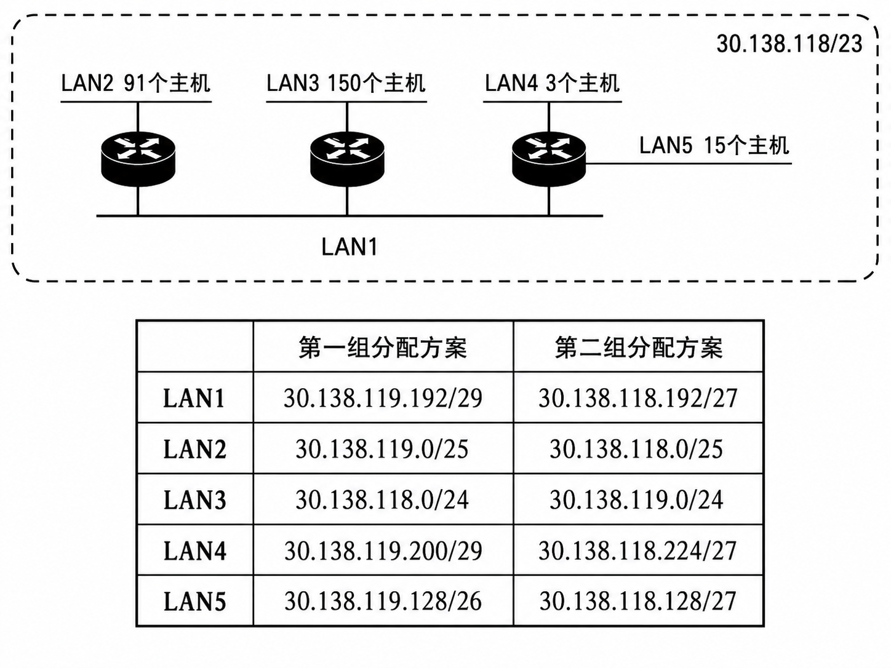

|      | 第一组分配方案    | 第二组分配方案    |
| ---- | ----------------- | ----------------- |
| LAN1 | 30.138.119.192/29 | 30.138.118.192/27 |
| LAN2 | 30.138.119.0/25   | 30.138.118.0/25   |
| LAN3 | 30.138.118.0/24   | 30.138.119.0/24   |
| LAN4 | 30.138.119.200/29 | 30.138.118.224/27 |
| LAN5 | 30.138.119.128/26 | 30.138.118.128/27 |

A. 第一组方案合理，第二组方案不合理
B. 第一组方案不合理，第二组方案合理
C. 两组方案都合理
D. 两组方案都不合理

- 答案：C
- 解析：

  地址块 `30.138.118.0/23` 的范围为：

  ```text
  30.138.118.0 ～ 30.138.119.255
  ```

  图中各局域网的主机需求为：LAN2 有 91 台主机，LAN3 有 150 台主机，LAN4 有 3 台主机，LAN5 有 15 台主机；LAN1 是连接 3 台路由器的骨干局域网，至少需要 3 个可用地址。

  第一组方案的可用主机数分别为：

  - LAN1：`/29`，可用 \(2^3-2=6\) 个地址；
  - LAN2：`/25`，可用 \(2^7-2=126\) 个地址；
  - LAN3：`/24`，可用 \(2^8-2=254\) 个地址；
  - LAN4：`/29`，可用 6 个地址；
  - LAN5：`/26`，可用 \(2^6-2=62\) 个地址。

  各子网均满足主机数量要求，地址范围互不重叠，而且均位于给定的 `/23` 地址块内。

  第二组方案中，LAN2 的 `/25`、LAN3 的 `/24` 以及 LAN1、LAN4、LAN5 的 `/27` 也都能满足各自的地址需求；各网段边界合法、互不重叠，并且仍全部位于 `30.138.118.0/23` 内。

  因此两组分配方案都合理，选择 C。地址分配未必必须做到绝对节省，只要满足容量、边界、互斥和所属地址块等要求即可。

<br>
<br>

4. **【王道·卷六-Q36】** ARP的作用是由IP地址求MAC地址，某结点响应其他结点的ARP请求是通过（  ）发送的。<br>
A. 单播
B. 组播
C. 广播
D. 点播

- 答案：A
- 解析：

  ARP 请求方不知道目标结点的 MAC 地址，因此 ARP 请求必须使用广播方式发送，使同一广播域中的所有结点都能收到。

  目标结点收到请求后，可以从 ARP 请求报文中获得请求方的源 IP 地址和源 MAC 地址，因此其 ARP 响应可以直接发给请求方，目的 MAC 地址明确，采用单播发送。

  所以 ARP 的典型过程是“请求广播、响应单播”，选择 A。组播用于特定组成员通信；“点播”不是这里的标准传输方式术语。

<br>
<br>

5. **【王道·卷八-Q33】** 在网络参考模型中，上层协议实体与下层协议实体之间的逻辑接口称为服务访问点(SAP)。在以太网帧中，（  ）属于数据链路层的服务访问点。<br>
A. 类型字段
B. 目的地址字段
C. 协议字段
D. 端口号字段

- 答案：A
- 解析：

  数据链路层的服务访问点用于标识帧中承载的是哪一种网络层协议，使接收方能够把数据交给正确的上层协议实体。

  在以太网 II 帧中，类型字段具有这一作用。例如：

  - `0x0800` 表示 IPv4；
  - `0x0806` 表示 ARP；
  - `0x86DD` 表示 IPv6。

  因此类型字段可看作数据链路层面向网络层的 SAP，选择 A。

  B 的目的地址字段标识接收网卡；C 的协议字段位于 IP 首部，用于标识上层传输层协议；D 的端口号位于传输层，用于标识应用进程。

##### 3.6.3 IEEE 802.11无线局域网

<br>
<br>

1. **【竟成·模拟一-36】** 下列关于IEEE 802.11无线局域网的协议机制的描述中，正确的是（）。
A. 无线MAC帧的帧首部必须包含SSID以标识接入的无线网络，而BSSID仅用于管理帧
B. 站点与AP建立关联可通过主动扫描（发送探测请求帧）或被动扫描（监听信标帧）实现
C. 802.11标准规定点协调功能PCF必须实现，分布协调功能DCF可以选择实现
D. 802.11的MAC层中的DCF层通过RTS/CTS可以完全避免隐蔽站问题

- 答案：B
- 解析：

  B 正确。无线站点发现 AP 通常有两种扫描方式：

  - 主动扫描：站点发送 Probe Request（探测请求）帧，等待 AP 返回 Probe Response；
  - 被动扫描：站点监听 AP 周期性发送的 Beacon（信标）帧。

  扫描后，站点可进一步完成认证和关联。

  A 错误。SSID 用于标识无线网络，但并非所有无线数据帧首部都必须携带 SSID；BSSID 通常对应基本服务集中的 AP MAC 地址，在管理帧和数据帧地址字段中都可能发挥作用。

  C 错误。DCF 是 IEEE 802.11 的基本、必选协调功能；PCF 是可选的集中式协调功能，实际应用较少。

  D 错误。RTS/CTS 可以显著缓解隐蔽站问题，但不能保证完全消除所有碰撞，例如 RTS 帧本身仍可能发生碰撞。

  因此选择 B。

<br>
<br>

2. **【竟成·模拟七-37】** 如下图所示，H1的MAC地址为01-23-45-67-89-0a，AP1的MAC地址为01-23-45-67-89-0b，AP2的MAC地址为01-23-45-67-89-0c，H2的MAC地址为01-23-45-67-89-0d，H1沿着图中链路发送一个封装访问Internet的IP分组的IEEE802.11数据帧给H2，则AP1发送的帧的地址1、地址2、地址3和地址4分别是（）。
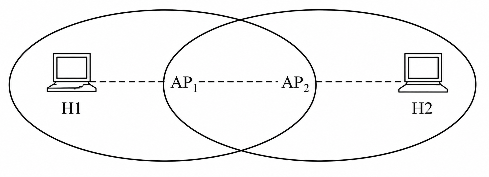
A. 01-23-45-67-89-0c、01-23-45-67-89-0b、01-23-45-67-89-0d、01-23-45-67-89-0a
B. 01-23-45-67-89-0a、01-23-45-67-89-0d、01-23-45-67-89-0b、01-23-45-67-89-0c
C. 01-23-45-67-89-0a、01-23-45-67-89-0b、01-23-45-67-89-0c、01-23-45-67-89-0a
D. 01-23-45-67-89-0d、01-23-45-67-89-0c、01-23-45-67-89-0b、01-23-45-67-89-0a

- 答案：A
- 解析：

  AP1 向 AP2 转发该帧时，数据帧从一个分布系统节点传向另一个分布系统节点，此时 `To DS=1`、`From DS=1`，使用 IEEE 802.11 的四地址格式。

  四个地址字段的含义为：

  - 地址 1：直接无线接收方 RA，即 AP2；
  - 地址 2：直接无线发送方 TA，即 AP1；
  - 地址 3：最终目的地址 DA，即 H2；
  - 地址 4：原始源地址 SA，即 H1。

  因此：

  ```text
  地址1 = AP2 = 01-23-45-67-89-0c
  地址2 = AP1 = 01-23-45-67-89-0b
  地址3 = H2  = 01-23-45-67-89-0d
  地址4 = H1  = 01-23-45-67-89-0a
  ```

  故选择 A。判断四地址帧时，应区分“当前一跳的收发设备”和“端到端的源、目的主机”。

##### 3.6.4 VLAN基本概念与基本原理

<br>
<br>

1. **【王道·卷四-Q36】** 在下面关于VLAN的描述中，正确的是（  ）。<br>
A. 一个VLAN是一个广播域
B. 一个VLAN是一个冲突域
C. 一个VLAN必须连接同一台交换机
D. 不同VLAN之间不能通信

- 答案：A
- 解析：

  VLAN 通过逻辑划分交换网络，将一个物理局域网划分成多个相互隔离的广播域。因此，一个 VLAN 对应一个广播域，A 正确。

  B 错误。现代交换式以太网中，每个交换机端口通常构成一个独立冲突域，一个 VLAN 可以包含多个交换机端口，因此并不等同于一个冲突域。

  C 错误。借助中继链路和 IEEE 802.1Q 标签，同一个 VLAN 可以跨越多台交换机。

  D 错误。不同 VLAN 在数据链路层不能直接通信，但可通过路由器或三层交换机进行 VLAN 间路由，因此并非绝对不能通信。

  故选择 A。

#### 3.7 广域网

##### 3.7.2 点对点协议

<br>
<br>

1. **【王道·卷三-Q36】** 在下列关于PPP（点对点协议）的说法中，错误的是（  ）。<br>
A. 接收方每收到一个帧就进行CRC，检验错误就丢弃这个帧
B. PPP支持多种网络层协议在同一条物理链路上运行
C. PPP不对帧进行编号
D. PPP有确认机制

- 答案：D
- 解析：

  A 正确。PPP 帧包含帧检验序列 FCS，接收方通过 CRC 检测差错；若检测到错误，则直接丢弃该帧。

  B 正确。PPP 通过协议字段区分其数据部分承载的网络层协议，因此可以支持 IPv4、IPv6 等多种网络层协议。

  C 正确。PPP 不设置帧序号，不提供滑动窗口、按序接收和重传控制。

  D 错误。PPP 只提供差错检测，不提供数据帧确认和重传机制，因此属于不可靠传输协议。链路建立阶段虽然存在 LCP、NCP 等控制报文交互，但不能据此认为 PPP 对普通数据帧提供确认机制。

  故选择 D。

<br>
<br>

2. **【竟成·模拟四-35】** 下列有关PPP协议的说法中，错误的是（）。
A. PPP协议是具有差错检测能力的数据链路层协议
B. 在同步链路中，PPP协议采用字节填充法；在异步链路中，PPP协议采用零比特填充法
C. PPP协议既支持多种网络层的协议，同时支持多种数据链路层的协议
D. PPP协议提供有连接不可靠的服务

- 答案：B（按该题通常考查的填充方式；按选项 C 的字面表述，C 也存在错误，原题表述不严谨）
- 解析：

  A 正确。PPP 位于数据链路层，帧尾设置 FCS，可利用 CRC 检测传输差错，但不负责确认和重传。

  B 错误，题目将两种填充方法写反。PPP 的透明传输规则是：

  - 在异步传输链路中采用字节填充法；
  - 在同步传输链路中采用零比特填充法。

  因此 B 是命题者最明显、通常预期选择的错误项。

  C 按字面同样不准确。PPP 能够通过协议字段支持多种网络层协议，也能运行在多种类型的物理链路上，但 PPP 本身就是一种数据链路层协议，不能表述为“支持多种数据链路层协议”。若原题本意是“支持多种类型的物理链路”，则该项才成立。

  D 可按教材常见表述视为正确。PPP 在传输数据前需要经过链路建立、配置和认证等阶段，因此具有连接建立过程；但它不提供数据帧确认与重传，属于不可靠服务。

  综上，按照单选题的常见命题意图应选 B；严格按当前题面判断，B、C 均有问题，应注意原题瑕疵。

#### 3.8 数据链路层设备

##### 3.8.2 以太网交换机

<br>
<br>

1. **【王道·卷一-Q37】** 某网络的拓扑结构如下图所示，假设交换机当前已学习到了主机 \(E\) 的MAC地址，主机 \(A\) 向主机 \(E\) 发送ARP请求报文，主机 \(E\) 收到后，向主机 \(A\) 发送ARP响应报文，则能收到ARP请求报文和ARP响应报文的主机数量分别是（  ）。<br>
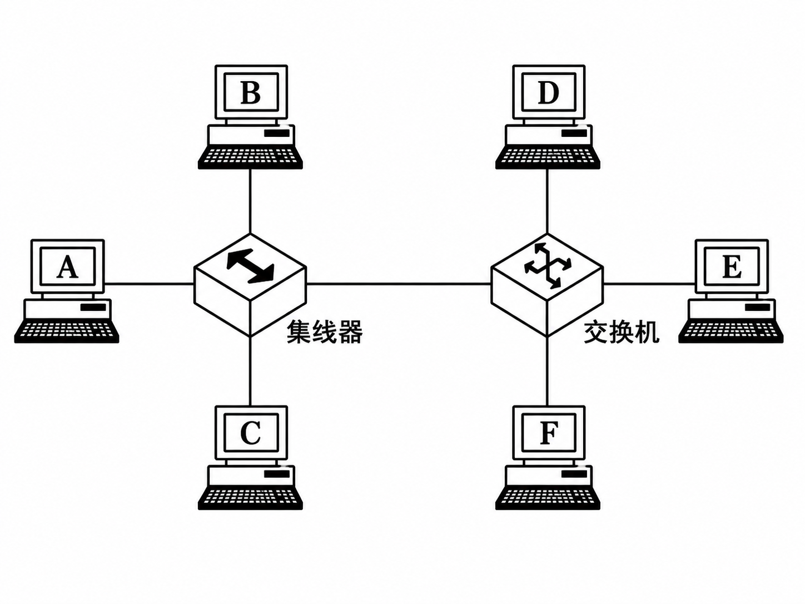
A. 5,3
B. 5,1
C. 3,5
D. 1,1

- 答案：A
- 解析：

  ARP 请求帧的目的 MAC 地址是广播地址，因此会在当前广播域内扩散。

  主机 A 首先把 ARP 请求发送到集线器。集线器工作在物理层，会把收到的信号复制到除入端口外的所有端口，所以主机 B、C 和交换机都能收到该帧。交换机收到广播帧后，一方面根据帧的源 MAC 地址学习到“主机 A 位于连接集线器的端口”，另一方面将该广播帧从其余端口泛洪，因此主机 D、E、F 也能收到。

  除发送方 A 外，收到 ARP 请求报文的主机共有：

  \[
  B、C、D、E、F，共\ 5\ 台
  \]

  主机 E 返回的 ARP 响应是单播帧，目的 MAC 地址为 A。交换机此前已通过 ARP 请求学习到 A 所在端口，因此只把响应帧转发到连接集线器的端口。集线器不能识别目的地址，会将该帧复制给 A、B、C，所以能在物理上收到该响应帧的主机共有 3 台；其中只有 A 会向上交付，B、C 检查目的 MAC 地址后丢弃。

  因此，收到请求帧和响应帧的主机数量分别为 5 和 3，选择 A。

<br>
<br>

2. **【王道·卷七-Q36】** 以太网交换机的自学习算法是指，它根据帧中的（  ）进行地址学习。<br>
A. 源MAC地址
B. 目的MAC地址
C. 源MAC地址和目的MAC地址
D. 源IP地址

- 答案：A
- 解析：

  交换机收到一个以太网帧后，能够确定两项信息：

  1. 该帧从哪个端口进入；
  2. 该帧的源 MAC 地址是什么。

  因此，交换机会在转发表中记录“源 MAC 地址—入端口”的对应关系，并刷新该表项的老化计时器。例如，若源 MAC 地址为 M 的帧从端口 3 到达，则交换机可推断主机 M 可经端口 3 到达。

  交换机不能根据目的 MAC 地址学习其所在端口，因为目的主机并不一定就在该帧的入端口方向；目的 MAC 地址只用于查询转发表并决定转发、过滤或泛洪。

  IP 地址属于网络层信息，也不是普通二层交换机进行 MAC 地址自学习的依据。因此选择 A。

### 第4章 网络层

#### 4.1 网络层的功能

##### 4.1.4 SDN的基本概念

<br>
<br>

1. **【竟成·模拟一-37】** 下列与OpenFlow 1.0交换机中流表的匹配字段设计相关的网络层次是（）。
I. 应用层 II. 运输层 III. 网络层 IV. 链路层
A. I、II、III
B. II、III、IV
C. II、III
D. III、IV

- 答案：B
- 解析：

  OpenFlow 1.0 的流表可依据分组首部中的多个字段进行匹配，典型字段包括：

  - 链路层：入端口、源/目的 MAC 地址、以太网类型、VLAN 标识等；
  - 网络层：源/目的 IP 地址、IP 协议号、服务类型等；
  - 运输层：TCP/UDP 的源端口和目的端口等。

  因而其匹配字段与运输层、网络层和链路层均有关，即 II、III、IV 正确。

  OpenFlow 1.0 通常不解析 HTTP、DNS 等应用层报文内容，应用层字段不是其标准流表匹配项，所以 I 错误。故选择 B。

#### 4.2 IPv4

##### 4.2.1 IPv4分组

<br>
<br>

1. **【王道·卷一-Q36】** 某应用程序发送一个UDP数据报，在网络层把IP数据报划分为4个报片发送出去，结果前两个报片丢失，后两个报片正确到达目的站。过段时间后，应用程序重传该UDP数据报，网络层仍将其划分为4个报片来传送，结果这次前两个报片正确到达目的站，而后两个报片丢失。假定目的站第一次收到的后两个报片仍保存在目的站的缓存中，则下列说法中，正确的是（  ）。<br>
A. 因UDP不保证可靠传输，故目的站能将两次传输的4个报片组装成IP数据报
B. 因IP不保证可靠传输，故目的站能将两次传输的4个报片组装成IP数据报
C. 因首部标识字段不同，故目的站不能将两次传输的4个数据报片组装成IP数据报
D. 因首部源IP地址不同，故目的站不能将两次传输的4个数据报片组装成IP数据报

- 答案：C
- 解析：

  IP 分片重组时，接收方需要判断若干分片是否属于同一个原始 IP 数据报。通常依据以下信息进行归组：源 IP 地址、目的 IP 地址、上层协议以及首部中的标识字段 Identification。

  同一个 IP 数据报产生的所有分片具有相同的标识字段；应用程序重传 UDP 数据报时，网络层会重新生成一个新的 IP 数据报，通常为其分配新的标识值。因此，两次发送产生的分片虽然承载相同的 UDP 内容，源地址、目的地址和协议也相同，但标识字段不同，不能混合重组。

  A、B 错误。UDP 和 IP 是否提供可靠传输，与分片能否跨两个不同 IP 数据报拼接无关。

  D 错误。两次传输仍由同一源主机发送，源 IP 地址并未改变。

  因此选择 C。

<br>
<br>

2. **【王道·卷二-Q38】** 下图给出了一个移动IP的示例，移动主机A的归属网络地址、外地网络地址、永久地址以及漫游到外地网络后从外地代理获得的一个属于该外地网络的转交地址都已在图中标注。假设图中的固定主机B要给处于外地网络的主机A发送一个IP数据报，则该IP数据报从主机B发送出来时的目的IP地址和从配置有归属代理的路由器转发出来时的目的IP地址分别是（  ）。<br>
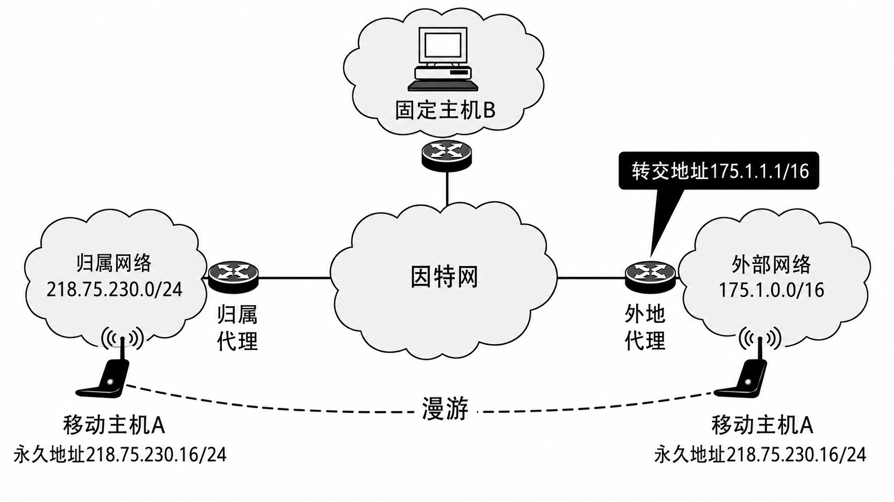
A. 218.75.230.16, 175.1.1.1
B. 175.1.1.1, 218.75.230.16
C. 218.75.230.16, 0.0.0.0
D. 255.255.255.255, 218.75.230.16

- 答案：A
- 解析：

  移动 IP 的目标之一，是使通信对端无须知道移动主机当前所处的位置。主机 A 的永久地址为 218.75.230.16，转交地址为 175.1.1.1。

  固定主机 B 向 A 发送数据报时，仍把 A 的永久地址作为原始 IP 数据报的目的地址，因此从 B 发出时：

  \[
  \text{目的地址}=218.75.230.16
  \]

  数据报到达 A 的归属网络后，被归属代理截获。归属代理通过 IP 隧道封装，将原数据报作为载荷封装进一个新的 IP 数据报。外层数据报的目的地址应为 A 当前注册的转交地址，即：

  \[
  \text{外层目的地址}=175.1.1.1
  \]

  外地代理收到后解除封装，再把原数据报交给移动主机 A。故选择 A。

<br>
<br>

3. **【王道·卷五-Q36】** 某路由器的路由表如下所示。如果它收到一个目的地址为192.168.10.23的IP数据报，那么它为该数据报选择的下一路由器地址为（  ）。<br>

| 要达到的网络 | 下一路由器   |
| ------------ | ------------ |
| 192.168.1.0  | 直接投递     |
| 192.168.2.0  | 直接投递     |
| 192.168.3.0  | 192.168.1.35 |
| 0.0.0.0      | 192.168.2.66 |

A. 192.168.1.35
B. 192.168.2.66
C. 直接投递
D. 丢弃

- 答案：B
- 解析：

  路由器采用最长前缀匹配原则查找目的网络。表中前三项分别对应 192.168.1.0、192.168.2.0 和 192.168.3.0 网络，而目的地址 192.168.10.23 不属于这三个网络，因此均不能匹配。

  表项 0.0.0.0 表示默认路由。当没有更具体的路由表项匹配时，路由器使用默认路由，把数据报交给下一跳 192.168.2.66。

  A 是前往 192.168.3.0 网络时使用的下一跳；C 只适用于与路由器直接连接且已列出的网络；路由表中存在默认路由，因此不应直接丢弃。故选择 B。

<br>
<br>

4. **【王道·卷五-Q37】** 当IP分组经过路由器进行分片时，其首部发生变化的字段有（  ）。<br>
I. 标识IDENTIFICATION II. 标志FLAG III. 片偏移 IV. 总长度 V. 检验和
A. I、II和III
B. II、III、IV和V
C. II、III和IV
D. II和III

- 答案：B
- 解析：

  一个原始 IP 数据报被分片后，各分片仍属于同一个原始数据报，因此标识字段 Identification 必须保持相同，I 不变。

  其余字段的变化如下：

  - 标志字段：除最后一个分片外，其他分片的 MF 位需要置 1，故 II 可能变化；
  - 片偏移：用于指明各分片数据在原数据报中的相对位置，各分片取值不同，故 III 变化；
  - 总长度：每个分片的首部与数据长度通常小于原数据报，故 IV 变化；
  - 首部检验和：首部字段发生改变后必须重新计算，故 V 变化。

  所以发生变化的是 II、III、IV、V，选择 B。

<br>
<br>

5. **【王道·卷六-Q37】** IP数据报的首部检验和采用二进制反码求和取反，而不采用CRC检验码的主要原因是（  ）。<br>
A. 二进制反码求和的方式比采用CRC检验码更可靠
B. 不采用CRC检验码可以缩短路由器进行检验的时间
C. IP数据报首部太长，只能采用二进制反码求和检验，不能采用CRC检验
D. IP数据报的首部长度在路由器转发过程中是可变的，不适合采用CRC检验

- 答案：B
- 解析：

  IP 首部中的 TTL 等字段在每经过一个路由器时都会变化，因此每台路由器都必须重新计算首部检验和。二进制反码求和实现简单、计算速度快，适合由路由器频繁更新，可降低转发处理开销。

  A 错误。CRC 的检错能力通常强于简单的反码求和，选择反码求和并不是因为它更可靠。

  C 错误。CRC 可以处理任意长度的比特串，不存在“首部太长而不能使用 CRC”的限制。

  D 错误。数据长度可变并不妨碍 CRC 的计算；不用 CRC 的主要考虑是路由器逐跳重算时的效率，而不是首部长度可变。

  因此选择 B。

<br>
<br>

6. **【王道·卷八-Q37】** 在下列关于 IPv6 分组和 IPv4 分组首部的相关说法中，正确的有（  ）。<br>
I. IPv6 取消了首部检验和字段，因此可以加快路由器处理 IPv6 分组的速度
II. IPv6 取消了首部长度字段，因为 IPv6 分组的首部长度是固定的20B
III. IPv6 取消了标识、标志、片偏移这三个字段，因此 IPv6 没有分片功能
IV. IPv6 分组的数据载荷中可以包含扩展首部，取代了 IPv4 首部中的可选字段
A. I
B. I, IV
C. II, III
D. II, III, IV

- 答案：B
- 解析：

  I 正确。IPv6 基本首部取消了首部检验和字段，路由器转发分组时无须像 IPv4 那样因跳数限制等字段发生变化而逐跳重新计算检验和，因此可降低路由器的处理开销。

  II 错误。IPv6 的基本首部长度确实固定，所以不再需要首部长度字段，但其固定长度是 40B，而不是 20B。20B 是不含选项时 IPv4 首部的最小长度。

  III 错误。IPv6 基本首部中取消了 IPv4 的标识、标志和片偏移字段，并规定中间路由器不能对 IPv6 分组进行分片；但源主机仍可使用“分片扩展首部”完成分片。因此，IPv6 并非完全没有分片功能。

  IV 正确。IPv6 将 IPv4 首部中的选项功能改由扩展首部实现。扩展首部位于 IPv6 基本首部与上层协议数据之间，并计入 IPv6 的有效载荷长度。

  因此正确的是 I、IV，选择 B。

##### 4.2.2 IPv4地址

<br>
<br>

1. **【王道·卷二-Q37】** 若将某个“/17”地址块划分为9（不多也不少）个子块，则可能的最小子块中所包含的IP地址数量为（  ）。<br>
A. 126
B. 128
C. 2046
D. 2048

- 答案：B
- 解析：

  一个“/17”地址块共有：

  \[
  2^{32-17}=2^{15}
  \]

  个 IP 地址。

  CIDR 地址块每次只能将一个地址块等分为两个前缀长度增加 1 的子块。每进行一次二分，子块总数增加 1。要恰好得到 9 个子块，需要进行 8 次二分。

  为使最小子块尽可能小，可每次都继续划分前一次得到的某个最小子块，使其前缀长度连续增加 8 位。于是最小子块的前缀长度为：

  \[
  17+8=25
  \]

  其中包含的 IP 地址数为：

  \[
  2^{32-25}=2^7=128
  \]

  A 中的 126 是扣除网络地址和广播地址后的传统可用主机地址数，而题目问的是子块所包含的全部 IP 地址数量。故选择 B。

<br>
<br>

2. **【王道·卷三-Q38】** 一台主机的IP地址为11.1.1.100，子网掩码为255.0.0.0。现在，用户需要配置该主机的默认路由。观察发现，与该主机直接相连的路由器有如下4个IP地址和子网掩码：<br>
I. IP地址：11.1.1.1，子网掩码：255.0.0.0
II. IP地址：11.1.2.1，子网掩码：255.0.0.0
III. IP地址：12.1.1.1，子网掩码：255.0.0.0
IV. IP地址：13.1.2.1，子网掩码：255.0.0.0
IP地址和子网掩码可能是该主机默认路由的是（  ）。
A. I和II
B. I和III
C. I、III和IV
D. III和IV

- 答案：A
- 解析：

  默认网关必须是与主机位于同一直接连接网络中的路由器接口，否则主机无法在本地链路上通过 ARP 获得该网关接口的 MAC 地址。

  主机地址为 11.1.1.100，掩码为 255.0.0.0，即前缀长度为 /8，因此主机所在网络为：

  \[
  11.0.0.0/8
  \]

  逐项判断：

  - I：11.1.1.1/8 属于 11.0.0.0/8，可以作为默认网关；
  - II：11.1.2.1/8 也属于 11.0.0.0/8，可以作为默认网关；
  - III：12.1.1.1/8 属于 12.0.0.0/8，与主机不同网；
  - IV：13.1.2.1/8 属于 13.0.0.0/8，与主机不同网。

  因此可能作为默认路由的是 I 和 II，选择 A。

<br>
<br>

3. **【王道·卷六-Q40】** 一台主机希望解析域名www.cskaoyan.com，若这台主机配置的DNS地址为A，Internet根域名服务器为B，而存储域名www.cskaoyan.com与其IP地址对应关系的域名服务器为C，则这台主机通常先查询（  ）。<br>
A. 域名服务器A
B. 域名服务器B
C. 域名服务器C
D. 以上都不对

- 答案：A
- 解析：

  普通主机通常不直接向根域名服务器或权威域名服务器发起完整的域名解析过程，而是先把查询请求发送给本机配置的本地域名服务器，即题目中的 DNS 服务器 A。

  若 A 的缓存中已有 www.cskaoyan.com 的解析结果，则可直接返回；若没有，A 再根据配置采用递归或迭代方式查询根域名服务器 B、顶级域名服务器以及最终保存该映射关系的权威域名服务器 C。

  因此，主机通常首先查询域名服务器 A，选择 A。

<br>
<br>

4. **【王道·卷七-Q37】** 若子网掩码是255.255.192.0，则在下列主机中，必须通过路由器才能与主机129.23.144.16通信的是（  ）。<br>
A. 129.23.191.21
B. 129.23.127.222
C. 129.23.130.33
D. 129.23.148.127

- 答案：B
- 解析：

  子网掩码 255.255.192.0 对应前缀长度 /18。第三个字节的块大小为：

  \[
  256-192=64
  \]

  因此第三个字节的子网范围依次为 0～63、64～127、128～191、192～255。

  主机 129.23.144.16 的第三个字节为 144，位于 128～191 范围内，所以其网络地址为：

  \[
  129.23.128.0/18
  \]

  各选项中：

  - A 的第三个字节为 191，与目标主机同一子网；
  - B 的第三个字节为 127，属于 129.23.64.0/18，与目标主机不同子网；
  - C 的第三个字节为 130，与目标主机同一子网；
  - D 的第三个字节为 148，与目标主机同一子网。

  同一子网内可直接交付，不同子网间必须经过路由器。因此选择 B。

<br>
<br>

5. **【竟成·模拟二-36】** 下列IP地址中，只能作为IP分组的目的地址而不能作为源地址的是（）。
A. 0.0.0.0
B. 223.255.255.250
C. 192.168.101.1
D. 230.1.1.1

- 答案：D
- 解析：

  230.1.1.1 位于 224.0.0.0～239.255.255.255 的 IPv4 多播地址范围。多播地址表示一组接收主机，只能出现在 IP 分组的目的地址字段中，不能作为某台发送主机的源地址，因此 D 正确。

  A 中的 0.0.0.0 表示“本网络上的本主机”或未指定地址。在主机尚未获得正式 IP 地址时，例如 DHCP 客户端发送初始请求时，它可以作为源地址，因此不符合“只能作为目的地址”。

  B 是普通单播地址；C 是私有单播地址，二者均可作为合法主机的源地址或目的地址。

  因此选择 D。

##### 4.2.4 网络层转发分组的过程

<br>
<br>

1. **【竟成·模拟三-39】** 某网络的拓扑如下图所示，R1、R2和R3之间的链路的子网掩码均为255.255.255.252，当H1向H3发送一个IP分组时，R3发出的分组的源IP和R2收到的分组的目的IP分别为（）。
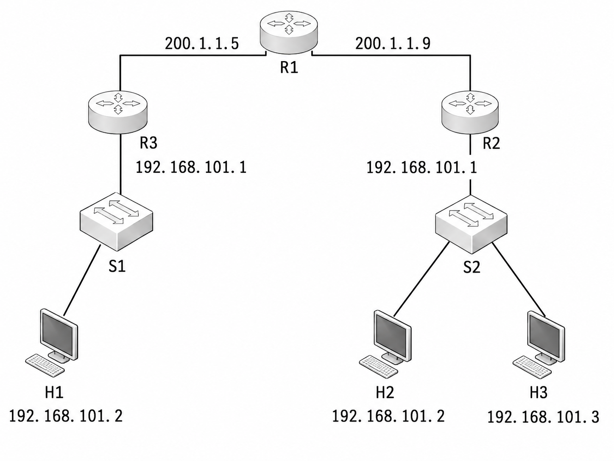
A. 192.168.101.2，200.1.1.10
B. 200.1.1.6，200.1.1.10
C. 200.1.1.6，192.168.101.3
D. 192.168.101.2，192.168.101.3

- 答案：D
- 解析：

  H1 向 H3 发送的是普通 IP 分组，途中仅经过路由器转发，题目没有说明存在 NAT 或隧道封装。因此，IP 首部中的源 IP 地址和目的 IP 地址在端到端传输过程中保持不变：

  - 源 IP 始终是 H1 的地址 192.168.101.2；
  - 目的 IP 始终是 H3 的地址 192.168.101.3。

  路由器在每一跳主要更换的是数据链路层帧的源 MAC 地址和目的 MAC 地址，同时会修改 IP 首部的 TTL 并重新计算首部检验和，但不会把 IP 源地址改为路由器接口地址，也不会把 IP 目的地址改为下一跳接口地址。

  所以，R3 发出的分组源 IP 为 192.168.101.2，R2 收到的分组目的 IP 为 192.168.101.3，选择 D。

##### 4.2.5 地址解析协议 ARP

<br>
<br>

1. **【竟成·模拟六-38】** 如下图所示，路由器R通过E1接口连接交换机S1，通过E2接口连接交换机S2。交换机S1和交换机S2分别连接主机H1和主机H2，各端口的IP地址和MAC地址如下图所示。若网络中并无任何ARP缓存，当H1想给H2发送一个IP分组，则R从E1端口收到的两次以太网帧的目的MAC地址分别是（）。
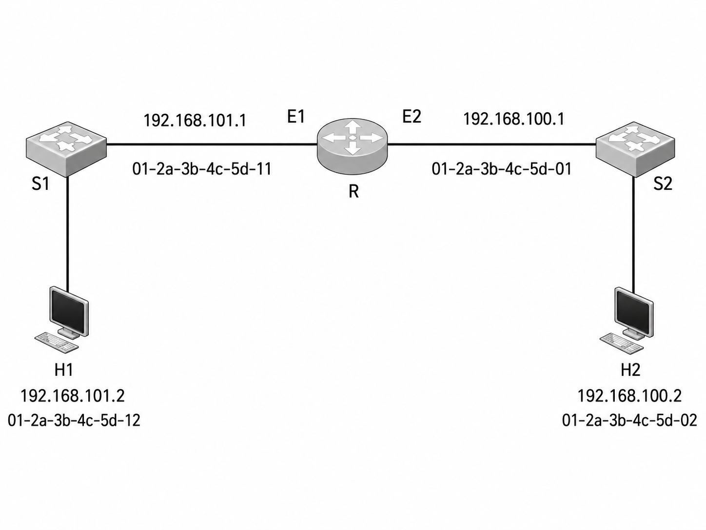
A. ff-ff-ff-ff-ff，01-2a-3b-4c-5d-11
B. 01-2a-3b-4c-5d-11，01-2a-3b-4c-5d-02
C. ff-ff-ff-ff-ff，01-2a-3b-4c-5d-02
D. 01-2a-3b-4c-5d-01，01-2a-3b-4c-5d-02

- 答案：A
- 解析：

  H1 的地址为 192.168.101.2，H2 的地址为 192.168.100.2，二者不在同一子网。因此，H1 不能直接把以太网帧发送给 H2，而应先把 IP 分组交给默认网关，即路由器 R 的 E1 接口 192.168.101.1。

  网络中没有任何 ARP 缓存时，H1 首先广播 ARP 请求，以查询默认网关 192.168.101.1 对应的 MAC 地址。该 ARP 请求帧的目的 MAC 地址为广播地址：

  ```text
  ff-ff-ff-ff-ff-ff
  ```

  因而这是 R 从 E1 收到的第一个以太网帧。

  R 返回 ARP 响应后，H1 得知 E1 的 MAC 地址为 01-2a-3b-4c-5d-11。随后 H1 把承载该 IP 分组的以太网帧单播给 E1，因此第二个帧的目的 MAC 地址为：

  ```text
  01-2a-3b-4c-5d-11
  ```

  选项 A 中广播地址少写了一个 `ff`，应理解为标准的 6 字节广播 MAC 地址。故选择 A。

##### 4.2.6 动态主机配置协议 DHCP

<br>
<br>

1. **【竟成·模拟二-33】** DHCP协议属于OSI参考模型中的（）。
A. 数据链路层
B. 网络层
C. 传输层
D. 应用层

- 答案：D
- 解析：

  DHCP 用于为主机动态分配 IP 地址、子网掩码、默认网关和 DNS 服务器地址等网络配置参数，其协议逻辑属于应用层。

  DHCP 报文由 UDP 承载，服务器端口为 67，客户端端口为 68。UDP 属于运输层，IP 属于网络层，以太网等属于数据链路层，但“由某层协议承载”不等于该协议本身属于该层。

  因此 DHCP 属于应用层协议，选择 D。

##### 4.2.7 网际控制报文协议 ICMP

<br>
<br>

1. **【竟成·模拟四-36】** 关于ICMP协议，下面描述错误的是（）。
A. ICMP用于IP协议的补充，传送IP通信过程中的错误信息
B. TCP直接为ICMP提供服务
C. ping命令采用ICMP回送请求与回答报文
D. 数据报出错不一定会产生ICMP差错报告报文

- 答案：B
- 解析：

  B 错误。ICMP 报文直接封装在 IP 数据报中，由 IP 提供承载服务，其 IPv4 协议号为 1。ICMP 不使用 TCP，也不使用 UDP。

  A 正确。ICMP 是 IP 协议的重要补充，可报告目的不可达、超时、参数问题等控制和差错信息。

  C 正确。`ping` 命令通常使用 ICMP 回送请求报文和回送回答报文来测试目的主机的可达性及往返时间。

  D 正确。并非所有出错数据报都会触发 ICMP 差错报告。例如，对 ICMP 差错报告报文本身通常不再发送 ICMP 差错报告；对广播或多播数据报、非首片分片等情况也存在限制，以避免差错报文泛滥。

  因此错误的是 B。

#### 4.3 IPv6

##### 4.3.1 IPv6的特点

<br>
<br>

1. **【竟成·模拟四-37】** 有关IPv6的描述中，错误的是（）。
A. IPv4采用32位地址，IPv6则采用128位的地址
B. IPv4的网段和IPv6的网段可以通过双协议栈和隧道技术通信
C. IPv6取消了校验和字段
D. 一个IPv6地址为8000:0000:0000:0000:D000:1230:CDEF:89A0，其缩写为8::D0:123:CDEF:89A

- 答案：D
- 解析：

  A 正确。IPv4 地址长度为 32 位，IPv6 地址长度为 128 位，因此 IPv6 能提供极其庞大的地址空间。

  B 正确。IPv4 与 IPv6 不能直接按同一种网络层格式互通，实际过渡时常采用双协议栈、隧道技术和协议转换等机制。双协议栈使设备同时支持 IPv4 与 IPv6；隧道技术则可将一种协议的分组封装在另一种协议中传输。

  C 正确。IPv6 基本首部取消了首部校验和字段，避免路由器在每一跳修改跳数限制后重新计算校验和，从而简化路由器处理。数据完整性可由数据链路层以及 TCP、UDP 等上层协议的检验机制保障。

  D 错误。IPv6 地址压缩有两条主要规则：一是每个 16 位字段只能省略前导 0，不能省略末尾 0；二是连续的全 0 字段可用一次 `::` 代替。原地址应缩写为：

  ```text
  8000::D000:1230:CDEF:89A0
  ```

  选项 D 将 `8000` 错写为 `8`、将 `D000` 错写为 `D0`、将 `1230` 错写为 `123`、将 `89A0` 错写为 `89A`，这些都删除了字段末尾的 0，改变了地址数值。

  因此错误的是 D。

#### 4.4 路由算法与路由协议

##### 4.4.2 分层次的路由选择协议

<br>
<br>

1. **【竟成·模拟七-38】** 下列有关网络的路由算法中，说法正确的是（）。
I. RIP、OSPF、BGP均为工作在网络层的协议
II. RIP更适合小型的、静态的网络，OSPF更适合大型的、动态的网络
III. RIP限制了最多经过15个路由器，OSPF无限制
IV. RIP交换的路由信息为完整的路由表，OSPF交换的路由信息为直连的链路状态
A. I、II、III
B. I、II、IV
C. II、III、IV
D. I、II、III、IV

- 答案：C
- 解析：

  I 错误。若按协议封装所在层次判断，RIP 使用 UDP 传输，BGP 使用 TCP 传输，二者通常视为应用层协议；OSPF 直接封装在 IP 数据报中，属于网络层协议。因此不能说三者均工作在网络层。

  II 正确。RIP 采用距离向量算法，结构简单、开销较小，但收敛速度慢且可度量的网络规模有限，适合规模较小、拓扑较稳定的网络。OSPF 采用链路状态算法，收敛快、支持分层区域，适合规模较大、拓扑变化较频繁的网络。

  III 正确。RIP 以跳数作为主要距离度量，可达路由的最大跳数为 15，跳数 16 表示不可达。OSPF 不以固定的最大跳数限制路由范围，其度量值是链路代价，因此不存在 RIP 这种 15 跳上限。

  IV 正确。RIP 路由器周期性地向相邻路由器发送自己的距离向量，通常包含完整路由表信息；OSPF 路由器通过链路状态通告传播本路由器的直连链路及其状态，由各路由器据此建立链路状态数据库并运行最短路径算法。

  因此 II、III、IV 正确，选择 C。

##### 4.4.3 路由信息协议

<br>
<br>

1. **【王道·卷三-Q37】** R1和R2是一个自治系统中采用RIP路由协议的两个相邻路由器，R1的路由表如表1所示，R1收到R2发送的报文（见表2）后，R1更新的3个路由表项中距离值从上到下依次为（  ）。<br>
表1 R1的路由表

| 目的网络 | 距离 | 路由 |
| -------- | ---- | ---- |
| 10.0.0.0 | 0    | 直接 |
| 20.0.0.0 | 7    | R2   |
| 30.0.0.0 | 4    | R2   |

表2 R2发送的报文

| 目的网络 | 距离 |
| -------- | ---- |
| 10.0.0.0 | 3    |
| 20.0.0.0 | 4    |
| 30.0.0.0 | 3    |

A. 0, 4, 3
B. 0, 4, 4
C. 0, 5, 3
D. 0, 5, 4

- 答案：D
- 解析：

  R1 收到相邻路由器 R2 的距离向量后，应先将 R2 通告的每个距离加 1，得到经 R2 到各目的网络的候选距离：

  | 目的网络 | R2通告距离 | R1经R2的候选距离 |
  | -------- | ---------: | ---------------: |
  | 10.0.0.0 |          3 |                4 |
  | 20.0.0.0 |          4 |                5 |
  | 30.0.0.0 |          3 |                4 |

  对 10.0.0.0，R1 当前为直接连接，距离为 0，显然优于经 R2 的距离 4，因此保持 0。

  对 20.0.0.0，原路由的下一跳就是 R2。RIP 的更新规则要求：若新信息来自当前下一跳，即使距离变大，也应按该相邻路由器的新通告更新。因此距离由 7 更新为 5。

  对 30.0.0.0，原路由下一跳也是 R2，经 R2 的新候选距离为 4，与原距离相同，因此仍为 4。

  所以更新后的距离依次为 0、5、4，选择 D。

##### 4.4.5 边界网关协议

<br>
<br>

1. **【王道·卷七-Q34】** 在下列关于边界网关协议(BGP)的叙述中，正确的是（  ）。<br>
I. 从eBGP对等方收到的BGP路由，可通过iBGP告知同一个AS内的对等方
II. 从iBGP对等方收到的BGP路由，可通过eBGP告知不同AS内的对等方
III. 从iBGP对等方收到的BGP路由，不能转告给同一个AS内不同iBGP的对等方
IV. 一个AS内的所有iBGP必须是全连通的，即使两个路由器之间没有直接的物理连接
A. 仅I、II
B. 仅III、IV
C. 仅II、III、IV
D. I、II、III、IV

- 答案：D
- 解析：

  I 正确。自治系统边界路由器通过 eBGP 从其他自治系统学习外部路由后，可通过 iBGP 将这些路由传播给本自治系统中的其他 BGP 路由器。

  II 正确。路由器从本自治系统内的 iBGP 对等方学习到外部路由后，可以依据出口策略，通过 eBGP 将该路由通告给其他自治系统。

  III 正确。传统 iBGP 的防环规则规定：从一个 iBGP 对等方学到的路由，不能再通告给另一个 iBGP 对等方。这是因为在同一自治系统内通告时，AS_PATH 不会增加本 AS 编号，无法仅靠 AS_PATH 检测此类内部环路。

  IV 正确。为使所有 iBGP 路由器都能获得完整路由，传统 iBGP 要求自治系统内的 BGP 路由器建立逻辑全连接。这里的“全连接”是 BGP 会话层面的逻辑连接，不要求路由器之间存在直接物理链路；只要底层 IGP 能保证 IP 可达，就可建立 TCP 连接。实际大型网络还可使用路由反射器或联盟来降低全连接开销。

  因此四项均正确，选择 D。

<br>
<br>

2. **【王道·卷八-Q38】** 某网络的拓扑结构如下图所示，假设 \(AS_1\) 和 \(AS_4\) 之间运行 \(RIP, AS_2\) 和 \(AS_3\) 之间运行OSPF，AS之间运行eBGP和iBGP。目前，先假定 \(AS_2\) 和 \(AS_4\) 之间没有物理连接。<br>
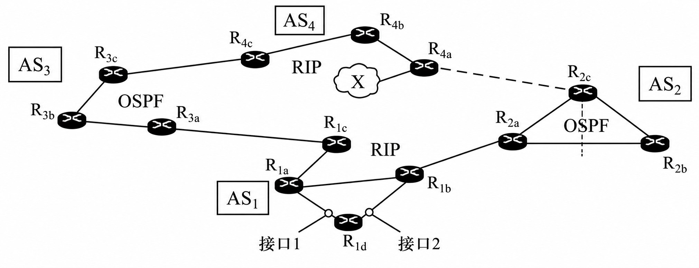
路由器 \(R_{3c}, R_{3a}, R_{1c}, R_{1d}\) 分别使用（  ）协议知道网络前缀 \(X\)（\(X\) 在 \(AS_4\) 中）。
A. eBGP、OSPF、eBGP、RIP
B. iBGP、eBGP、iBGP、eBGP
C. eBGP、iBGP、eBGP、iBGP
D. RIP、iBGP、OSPF、iBGP

- 答案：C
- 解析：

  前缀 X 位于 AS4 内部。题目问的是各路由器“通过什么协议获知前缀 X”，应区分自治系统内部的 IGP 与传递外部前缀的 BGP。

  1. AS4 的边界路由器 R4c 将前缀 X 通告给 AS3 的 R3c。两者属于不同自治系统，因此 R3c 通过 eBGP 获知 X。
  2. R3c 与 R3a 都在 AS3 内。R3c 将从外部获得的 BGP 路由通过 iBGP 告知 R3a，因此 R3a 通过 iBGP 获知 X。OSPF 主要用于保证 AS3 内部下一跳可达，不负责把该外部前缀作为 BGP 路由传给 R3a。
  3. R3a 与 AS1 的 R1c 分属不同自治系统，因此 R1c 通过 eBGP 从 R3a 获知 X。
  4. R1c 再通过 iBGP 将外部前缀 X 告知 AS1 内的 R1d，因此 R1d 通过 iBGP 获知 X。RIP 用于 AS1 内部到 BGP 下一跳的可达性计算。

  故依次为 eBGP、iBGP、eBGP、iBGP，选择 C。

<br>
<br>

3. **【王道·卷八-Q39】** 网络拓扑结构同38题，路由器 \(R_{1d}\) 知道前缀 \(X\)，并将前缀 \(X\) 写入转发表。试问路由器 \(R_{1d}\) 应从（  ）转发分组。现在假定 \(AS_2\) 和 \(AS_4\) 之间有物理连接，即图中的虚线变成了实线。假定路由器 \(R_{1d}\) 知道到达前缀 \(X\) 可经过 \(AS_2\)，但也可经过 \(AS_3\)，问路由器 \(R_{1d}\) 应从（  ）转发分组。<br>
A. 接口1, 接口1
B. 接口1, 接口2
C. 接口2, 接口1
D. 接口2, 接口2

- 答案：B
- 解析：

  第一种情况下，AS2 与 AS4 之间没有物理连接，AS1 到前缀 X 的外部路径只能经 AS3：

  ```text
  AS1 → AS3 → AS4
  ```

  AS1 的出口路由器是 R1c。由图可知，R1d 到 R1c 应先经 R1a，而 R1d 与 R1a 相连的端口是接口1，因此第一次应从接口1转发。

  第二种情况下，AS2 与 AS4 的虚线变为实线，R1d 可获得两条到 X 的 BGP 路径：

  ```text
  AS1 → AS3 → AS4
  AS1 → AS2 → AS4
  ```

  两条路径的 AS_PATH 长度相同。在其他 BGP 属性也相同的前提下，路由器会采用“热土豆路由”原则，选择本自治系统内部代价较小、距离自己更近的出口。

  - 经 AS3 需要到达出口 R1c，R1d 要先经 R1a，内部路径较长；
  - 经 AS2 的出口是 R1b，R1d 与 R1b 直接相连，对应接口2。

  因而第二次选择更近的 R1b，从接口2转发。两空依次为接口1、接口2，选择 B。

<br>
<br>

4. **【王道·卷八-Q40】** 网络拓扑结构同38题，问RIP、OSPF、eBGP、iBGP分别使用（  ）协议进行传输。<br>
A. IP、UDP、TCP、TCP
B. UDP、IP、TCP、UDP
C. UDP、TCP、IP、TCP
D. UDP、IP、TCP、TCP

- 答案：D
- 解析：

  各路由协议的封装方式如下：

  - RIP 使用 UDP 传输，端口号为 520；
  - OSPF 不使用 TCP 或 UDP，而是直接封装在 IP 数据报中，IP 协议号为 89；
  - eBGP 使用 TCP 建立可靠连接，端口号为 179；
  - iBGP 同样使用 TCP，端口号也为 179。

  因此依次为 UDP、IP、TCP、TCP，选择 D。

#### 4.5 IP多播

##### 4.5.3 在局域网上进行硬件多播

<br>
<br>

1. **【竟成·模拟五-36】** IP地址238.212.24.5映射后的以太网MAC地址是（）。
A. 01:00:5E:EE:D4:18
B. 01:00:5E:D4:18:05
C. 01:00:5E:54:18:05
D. 01:00:EE:D4:18:05

- 答案：C
- 解析：

  IPv4 多播地址映射到以太网多播 MAC 地址时，MAC 地址前 25 位固定为：

  ```text
  00000001 00000000 01011110 0
  ```

  即十六进制前缀 `01:00:5E`，随后取 IPv4 多播地址的低 23 位。

  地址 238.212.24.5 的十六进制表示为：

  ```text
  EE:D4:18:05
  ```

  取低 23 位时，应舍弃第二个字节 D4 的最高位。D4 的二进制为 `11010100`，去掉最高位后为 `1010100`，对应十六进制 54。因此后三个 MAC 字节为：

  ```text
  54:18:05
  ```

  最终映射结果为：

  ```text
  01:00:5E:54:18:05
  ```

  所以选择 C。由于只映射 IPv4 地址的低 23 位，多个不同的 IPv4 多播地址可能映射到同一个以太网多播 MAC 地址。

##### 4.5.4 IGMP与多播路由协议

<br>
<br>

1. **【王道·卷七-Q38】** 下列关于网际组管理协议(IGMP)的说法中，正确的是（  ）。<br>
A. IGMP知道IP多播组包含的成员数
B. IGMP在互联网范围内对所有多播组成员进行管理
C. 当某个主机加入新的多播组时，该主机应向多播组的多播地址发送一个IGMP报文
D. 多播组的组成员关系一旦固定，就不能改变

- 答案：C
- 解析：

  C 正确。主机加入某个多播组时，会发送 IGMP 成员关系报告报文，通告本地多播路由器自己希望接收该组的数据。该报告通常发送到相应多播组的多播地址。

  A 错误。IGMP 的主要作用是让本地多播路由器知道某个局域网上是否存在某多播组的成员，而不是精确统计该组有多少成员。

  B 错误。IGMP 只负责主机与本地多播路由器之间的组成员关系管理。互联网范围内的多播路径建立由多播路由协议完成，而不是由 IGMP 完成。

  D 错误。多播组成员关系是动态的，主机可随时加入或离开多播组。路由器会通过查询和报告机制维护当前成员关系。

  因此选择 C。

#### 4.6 移动IP

##### 4.6.2 移动IP通信过程

<br>
<br>

1. **【竟成·模拟二-37】** 下列关于移动IP的描述中，错误的是（）。
A. 移动IP可以让移动设备用户从一个网段移动到另一个网段，仍保持原有设备的IP地址不变
B. 归属地址是永久的，转交地址是暂时的
C. 在数据的传送中，其他主机若想和在其它网段的移动主机通信，需要将数据先发送给归属代理，再通过外地代理转交给移动主机
D. 在数据的传送中，在其它网段的移动主机想要与远程主机通信，需要将数据先通过外地代理交给归属代理

- 答案：D
- 解析：

  A 正确。移动 IP 的目标是使移动结点离开归属网络后，仍能使用固定的归属地址与外界通信，从而保持上层连接的连续性。

  B 正确。归属地址是移动结点长期使用的固定 IP 地址；转交地址反映移动结点当前所在外地网络的位置，通常只在移动期间临时有效。

  C 正确。在基本移动 IPv4 的三角路由过程中，通信对端仍把数据发送到移动结点的归属地址。归属代理截获该数据后，将其通过隧道转发到移动结点当前的转交地址；若使用外地代理转交地址，则由外地代理再交付给移动结点。

  D 错误。移动结点向远程主机发送数据时，通常可以通过当前外地网络直接路由到通信对端，不必先绕回归属代理。于是下行方向可能经过“通信对端→归属代理→外地代理→移动结点”，而上行方向则可直接从移动结点到通信对端，形成三角路由。

  因此错误的是 D。

#### 4.7 网络层设备

##### 4.7.3 路由表与分组转发

<br>
<br>

1. **【竟成·模拟五-37】** 下列有关路由器和路由表的说法中，正确的是（）。
I. 路由器可以抑制广播风暴
II. 经过路由器后，数据报的源IP地址一定会发生变化
III. 路由器的路由表通常包含到达目的网络的下一跳的路径信息
IV. 当所有路由表项均不匹配时，按照默认路由进行转发
A. I、II、III
B. I、III、IV
C. II、III、IV
D. I、II、III、IV

- 答案：B
- 解析：

  I 正确。路由器不会像集线器或二层交换机那样转发链路层广播帧，不同路由器接口通常属于不同广播域，因此路由器能够隔离广播域，抑制广播风暴跨网段扩散。

  II 错误。在普通路由转发过程中，IP 数据报的源 IP 地址和目的 IP 地址通常保持不变。路由器会修改 TTL，并重新计算 IPv4 首部检验和；只有经过 NAT 等地址转换设备时，源 IP 地址才可能变化，因此“一定会发生变化”错误。

  III 正确。路由表项通常记录目的网络、子网掩码或前缀长度、下一跳地址、出接口以及度量值等信息。路由器根据目的 IP 地址执行最长前缀匹配，然后按照相应下一跳或出接口转发分组。

  IV 正确。当所有更具体的路由表项都不匹配时，若路由表中配置了默认路由，则按照默认路由转发；若没有默认路由，则丢弃该分组，并可能返回 ICMP 目的不可达报文。题目按通常已配置默认路由的情形表述。

  因此正确的是 I、III、IV，选择 B。

### 第5章 传输层

#### 5.2 UDP

##### 5.2.1 UDP数据报

<br>
<br>

1. **【王道·卷五-Q38】** 一个用十六进制格式存储的UDP首部为CB84000D001C001C，则在下列关于该UDP首部的说法中，正确的是（  ）。<br>
I. 源端口号为52096 II. 目的端口号为13
III. 该UDP数据报的数据载荷长度为28B IV. 该UDP数据报是客户端到服务器方向的
A. II
B. I、III
C. II、IV
D. II、III、IV

- 答案：C
- 解析：

  UDP 首部固定为 8B，4 个字段各占 2B。将给出的首部按每 4 个十六进制数字分组：

  ```text
  CB84 | 000D | 001C | 001C
  源端口 目的端口 长度   检验和
  ```

  各字段解释如下：

  - 源端口号为 `0xCB84`，十进制值为：

    \[
    203\times 256+132=52100
    \]

    因此 I 错误。
  - 目的端口号为 `0x000D=13`，II 正确。端口 13 是 Daytime 等服务可使用的熟知端口。
  - 长度字段 `0x001C=28` 表示 UDP 首部与数据载荷的总长度，而不是仅指数据载荷。数据载荷长度为：

    \[
    28-8=20\text{B}
    \]

    因此 III 错误。
  - 源端口 52100 属于临时端口，目的端口 13 是服务器熟知端口，表明该报文通常由客户端发往服务器，IV 正确。

  因此正确的是 II、IV，选择 C。

<br>
<br>

2. **【王道·卷六-Q38】** 在下列关于传输层的伪首部的理解中，正确的是（  ）。<br>
A. 只有UDP数据报计算检验和时才需要伪首部，TCP不需要
B. 伪首部指的是UDP数据报和TCP报文段的首部中的一个字段
C. 源主机需要额外发送伪首部给目的主机
D. 伪首部既不向下传输也不向上递交，仅用于计算传输层的检验和

- 答案：D
- 解析：

  伪首部并不是真正封装在 TCP 报文段或 UDP 数据报中的首部，而是计算传输层检验和时临时构造的一组信息，通常包括源 IP 地址、目的 IP 地址、协议号以及 TCP 或 UDP 长度。

  A 错误。TCP 和 UDP 在计算检验和时都要加入伪首部。

  B 错误。伪首部不是 TCP 或 UDP 首部中的实际字段，它只在检验和计算过程中临时参与运算。

  C 错误。伪首部不会作为数据的一部分在网络中传输。接收方可根据收到的 IP 首部和传输层报文自行构造相同的伪首部。

  D 正确。伪首部既不会向下交付给网络层进行传输，也不会向上交付给应用层，其唯一作用是让检验和能够同时检查部分网络层关键信息，降低报文被误投到错误主机或错误传输层协议的风险。

  因此选择 D。

##### 5.2.2 UDP检验

<br>
<br>

1. **【王道·卷四-Q39】** 在下列关于UDP检验和的说法中，正确的是（  ）。<br>
I. 如果发送方决定不使用检验和，就将检验和的值全置为0
II. 如果检验和的计算结果刚好为全0，就将它设置为全1
III. 如果检验和的计算结果刚好为全1，就将它保持为全1
A. I、II
B. II、III
C. I、III
D. I、II、III

- 答案：D
- 解析：

  在 IPv4 的 UDP 中，检验和字段全 0 表示发送方未使用 UDP 检验和，因此 I 正确。IPv6 要求 UDP 检验和必须使用，通常不能以全 0 表示省略。

  UDP 检验和采用反码运算。发送方先对伪首部、UDP 首部和数据进行反码求和，再对结果按位取反。

  - 若最终计算出的检验和为全 0，为避免与“未使用检验和”的全 0 表示混淆，发送时应将其改为全 1，因此 II 正确。
  - 若计算结果本身为全 1，则直接将全 1 写入检验和字段，不需要修改，因此 III 正确。

  所以 I、II、III 均正确，选择 D。

<br>
<br>

2. **【竟成·模拟一-40】** 下列关于校验和机制的描述中，正确的是（）。
A. IP首部校验和覆盖整个数据报，而TCP/UDP校验和仅覆盖首部
B. TCP校验和的计算与IP首部无关，而UDP校验和必须包含IP首部
C. UDP校验和的计算需要依赖IP首部中的源IP地址、目的IP地址和协议字段
D. IP校验和采用伪首部机制

- 答案：C
- 解析：

  C 正确。UDP 检验和的计算要使用伪首部，伪首部中的源 IP 地址、目的 IP 地址、协议号和 UDP 长度等信息来自网络层，因此 UDP 检验和依赖 IP 首部中的部分字段。注意，参与运算的是这些字段构成的伪首部，并不是把整个 IP 首部直接加入计算。

  A 错误。IPv4 首部检验和只覆盖 IPv4 首部，不覆盖数据部分；TCP 和 UDP 检验和则覆盖传输层首部、数据载荷以及伪首部。

  B 错误。TCP 和 UDP 都要利用伪首部计算检验和，因此二者都与源、目的 IP 地址等网络层信息有关。

  D 错误。伪首部机制用于 TCP 和 UDP 检验和。IPv4 首部检验和直接对 IPv4 首部本身进行计算，不使用伪首部；IPv6 则取消了 IP 首部检验和。

  因此选择 C。

<br>
<br>

3. **【竟成·模拟二-38】** 下列关于UDP的叙述中，正确的是（）。
I. TCP和UDP的端口号相互独立，可以存在于同一台主机
II. 用户程序在传输层采用UDP协议时，传输的可靠性全部由应用层协议承担
III. UDP计算校验和时使用的伪首部需要传输给应用层和网络层
A. I、II
B. I、III
C. II、III
D. I、II、III

- 答案：A
- 解析：

  I 正确。TCP 和 UDP 各自具有独立的端口号空间。例如，同一台主机上可同时存在 TCP 端口 53 和 UDP 端口 53，它们分别标识不同传输层协议中的进程端点，不会冲突。

  II 正确。UDP 本身不提供确认、超时重传、按序交付、流量控制和拥塞控制。若应用需要可靠传输，就必须由应用层自行实现确认、重传、编号、去重等机制，或改用 TCP 等可靠传输协议。

  III 错误。伪首部仅在发送端和接收端计算 UDP 检验和时临时构造，不属于实际 UDP 数据报，不会传输给网络层，也不会递交给应用层。

  因此正确的是 I、II，选择 A。

#### 5.3 TCP

##### 5.3.2 TCP报文段

<br>
<br>

1. **【王道·卷一-Q40】** 下列关于HTTP的说法中，正确的是（  ）。<br>
I. 当用户点击某个包含1个文本文件和3张图片的网页时，如果HTTP使用持续连接，那么只需发送1个请求报文就能收到4个响应报文
II. 可以使用同一个HTTP/1.1持续连接传输对x.com/1.html和x.com/2.html的请求和响应
III. 当HTTP使用非持续连接时，一个TCP报文段也可装入两个不同的请求报文
IV. 响应报文中的实体主体部分永远不会是空的
A. I、II
B. 仅II
C. III、IV
D. II、IV

- 答案：B
- 解析：

  I 错误。网页中的 HTML 文本和每一张图片通常都是独立对象，客户端需要分别发送 HTTP 请求。持续连接只是允许多个请求和响应复用同一条 TCP 连接，并不意味着一个请求可以自动换回多个对象。该页面通常需要 4 个请求报文和 4 个响应报文。

  II 正确。`x.com/1.html` 和 `x.com/2.html` 属于同一主机。HTTP/1.1 默认采用持续连接，可以在同一条 TCP 连接上依次传输对这两个资源的请求和响应。

  III 错误。非持续 HTTP 通常为每个请求—响应过程建立一条独立 TCP 连接，一条连接完成一个对象的传输后关闭，因而不会在同一个非持续连接的 TCP 报文段中承载两个不同对象的请求报文。

  IV 错误。HTTP 响应报文的实体主体可能为空。例如，对 `HEAD` 请求的响应不携带实体主体；状态码 204、304 等响应也可以没有实体主体。

  因此仅 II 正确，选择 B。

<br>
<br>

2. **【王道·卷二-Q39】** 不考虑接收双方的容量限制，在下列关于TCP报文段的长度的理解中，正确的是（  ）。<br>
A. TCP报文段的总长度有最小值，没有最大值
B. TCP报文段的总长度最小可以是零，最大值没有上限
C. TCP报文段的总长度最小不能是零，最大不能超过65515B
D. TCP报文段的总长度最小可以是零，最大不能超过65515B

- 答案：C
- 解析：

  TCP 报文段至少要包含 TCP 首部。TCP 基本首部长度为 20B，即使不携带应用数据，仅发送 ACK、SYN 或 FIN 等控制报文段，其总长度也不能为 0，因此最小长度不能是零。

  TCP 报文段封装在 IP 数据报中。IPv4 总长度字段占 16 位，IPv4 数据报最大总长度为 65535B。在使用最小 20B IPv4 首部且不考虑其他扩展限制时，能够承载的 TCP 报文段最大长度为：

  \[
  65535-20=65515\text{B}
  \]

  因此 TCP 报文段总长度最小不能为 0，最大不能超过 65515B，选择 C。实际网络中还会受链路 MTU、TCP 最大报文段长度 MSS 等因素限制，通常远小于该理论上限。

<br>
<br>

3. **【王道·卷七-Q39】** 下列关于TCP的端口号的说法中，正确的是（  ）。<br>
I. 一台主机可用的端口号数量不超过65536
II. 一台主机上能同时存活的连接数量不超过65536
III. 连接释放后，端口号可以再次使用
IV. 一台主机可在一个端口建立多个TCP连接
A. I、II
B. II、III
C. I、II、III、IV
D. I、II、IV

- 答案：原题无匹配选项，正确组合应为 I、III、IV
- 解析：

  I 正确。TCP 端口号字段为 16 位，端口号范围为 0～65535，一共存在：

  \[
  2^{16}=65536
  \]

  个端口号，因此一台主机的 TCP 端口号种类不超过 65536。

  II 错误。TCP 连接由四元组唯一标识：

  ```text
  （源IP地址，源端口号，目的IP地址，目的端口号）
  ```

  同一个本地端口可以同时与多个不同的远程 IP 地址或远程端口建立连接。因此，一台主机同时存在的 TCP 连接数并不简单受限于 65536，还会受到地址数量、内核资源、文件描述符和内存等因素限制。

  III 正确。TCP 连接释放后，端口号可以再次使用。主动关闭一方通常会经历 TIME-WAIT 状态，在等待期结束后，相应四元组即可安全复用；采用端口复用机制时还可有更灵活的使用方式。

  IV 正确。例如 Web 服务器可在本地 TCP 端口 80 上同时服务多个客户端。虽然本地 IP 地址与本地端口相同，但各连接的远程 IP 地址或远程端口不同，因此四元组仍然不同。

  所以正确组合是 I、III、IV，但题目给出的 A～D 均不包含该组合，属于选项缺失或排版错误。不能为匹配选项而将 II 误判为正确。

<br>
<br>

4. **【竟成·模拟四-39】** 下列有关TCP的首部字段的描述中，正确的是（）。
I. 总长度、首部长度、片偏移的单位分别为1B、4B、8B
II. RST字段为1，表示必须重新建立连接
III. 首部信息为（SYN=1、ACK=0、seq=1001、ack=1001），表示主机想要收到对方的下一部分数据的首字节序号为1001
A. II
B. I、III
C. II、III
D. I、II、III

- 答案：A
- 解析：

  I 错误。总长度、首部长度和片偏移是 IPv4 首部中的字段，而不是 TCP 首部字段。它们的计量单位分别确实是 1B、4B 和 8B，但题目问的是“TCP 的首部字段”，因此将这些 IPv4 字段归入 TCP 首部是不正确的。TCP 首部中的“数据偏移”字段才用于表示 TCP 首部长度，单位为 4B。

  II 正确。RST 为复位标志。当收到不属于任何现有连接的报文段、连接出现严重错误或需要拒绝非法连接时，可发送 RST 报文段立即终止或拒绝连接。若双方还要继续通信，就必须重新建立 TCP 连接。

  III 错误。ACK=0 表示确认号字段无效，因此 `ack=1001` 不具有“期望收到下一字节序号”的含义。SYN=1、ACK=0 表明这是连接建立时的首次 SYN 报文；`seq=1001` 表示发送方选择的初始序号。对方若确认该 SYN，应返回的确认号通常为：

  \[
  1001+1=1002
  \]

  因为 SYN 标志本身要占用一个序号。

  因此仅 II 正确，选择 A。

##### 5.3.3 TCP连接管理

<br>
<br>

1. **【王道·卷一-Q39】** TCP使用很多的计时器来实现相关的功能，TCP使用的计时器有（  ）。<br>
I. 重传计时器 II. 持续计时器 III. 保活计时器 IV. 时间等待计时器
A. I、II、III
B. I、II、IV
C. I、III、IV
D. I、II、III、IV

- 答案：D
- 解析：

  TCP 为保证可靠传输、处理流量控制中的特殊情况以及维护连接状态，需要使用多种计时器。

  I 正确。**重传计时器**用于检测报文段是否可能丢失。发送方发送一个需要确认的报文段后启动重传计时器，若超时前未收到有效确认，则重传相应数据。

  II 正确。**持续计时器**用于防止零窗口死锁。当接收方通告窗口为 0 后，发送方定期发送零窗口探测报文，以便在接收窗口重新打开而窗口更新报文丢失时仍能恢复传输。

  III 正确。**保活计时器**用于检测长时间无数据交换的连接对端是否仍然存活，避免失效连接长期占用资源。

  IV 正确。**时间等待计时器**用于 TIME-WAIT 状态。主动关闭连接的一方通常等待两倍最长报文段寿命，即 \(2\mathrm{MSL}\)，以保证旧报文段从网络中消失，并在最终 ACK 丢失时能够再次确认对方重传的 FIN。

  因此 I、II、III、IV 均正确，选择 D。

<br>
<br>

2. **【王道·卷六-Q39】** TCP在连接关闭的过程中，为了避免旧TCP报文段对后续连接产生错误干扰而使用的状态是（  ）。<br>
A. TIME-WAIT
B. FIN-WAIT-2
C. FIN-WAIT-1
D. CLOSED

- 答案：A
- 解析：

  主动关闭 TCP 连接的一方在发送对对方 FIN 的最终确认后，不会立即进入 CLOSED，而是先进入 TIME-WAIT 状态，并保持 \(2\mathrm{MSL}\) 的时间。

  这样做有两个主要目的：

  1. 保证本连接中的迟到、重复报文段在网络中全部消失，避免它们被后续使用相同四元组的新连接误收。
  2. 若最终 ACK 丢失，被动关闭方会重传 FIN；主动关闭方仍处于 TIME-WAIT，因而能够再次发送 ACK。

  FIN-WAIT-1 和 FIN-WAIT-2 都是主动关闭过程中等待对方确认或 FIN 的中间状态，并不承担清除旧报文段的主要作用；CLOSED 表示连接已经不存在。

  因此选择 A。

<br>
<br>

3. **【竟成·模拟一-38】** 假设主机H与服务器已建立一个TCP连接，最大段长MSS为1000B，往返时间RTT为10ms，最长报文段寿命MSL=30s，拥塞控制的初始阈值是8MSS，忽略TCP的传输时延。主机H以MSS段向主机乙发送一个大小为24000B的文件F，发送完成后H主动请求断开连接。该过程中服务器发送的确认报文段首部的窗口字段值为6000B。若从H开始发送文件F的时刻起，到服务器进入CLOSED状态为止，所需的时间至少是（）。
A. 65ms
B. 75ms
C. 60.06s
D. 60.07s

- 答案：A
- 解析：

  文件大小为 \(24000\mathrm{B}\)，而 \(\mathrm{MSS}=1000\mathrm{B}\)，因此共需发送 24 个满长度报文段。接收方通告窗口为 \(6000\mathrm{B}=6\mathrm{MSS}\)，所以实际发送窗口不能超过 6 个报文段。

  初始拥塞窗口按 \(1\mathrm{MSS}\) 计算，慢开始门限为 \(8\mathrm{MSS}\)。忽略传输时延后，每经过一个 RTT，发送方可根据确认继续发送。各轮最多发送的数据段数为：

  
  
  
  
  
  
  
  ```text
  t =  0 ms：发送 1 段，累计  1 段
  t = 10 ms：发送 2 段，累计  3 段
  t = 20 ms：发送 4 段，累计  7 段
  t = 30 ms：受接收窗口限制，发送 6 段，累计 13 段
  t = 40 ms：发送 6 段，累计 19 段
  t = 50 ms：发送剩余 5 段，累计 24 段
  ```

  主机 H 在发送最后一批数据时，可在最后一个数据报文段中同时置 FIN，或紧接着发送 FIN，因此不必等待最后一批数据的确认后才开始释放连接。

  设单向传播时延为：

  \[
  \frac{\mathrm{RTT}}{2}=5\mathrm{ms}
  \]

  最后数据及 FIN 在 \(55\mathrm{ms}\) 到达服务器。服务器已无数据需要继续发送，可立即返回 ACK 和 FIN；它们在 \(60\mathrm{ms}\) 到达 H。H 随即发送最终 ACK，该 ACK 在 \(65\mathrm{ms}\) 到达服务器，此时服务器进入 CLOSED 状态。

  题目问的是**服务器**进入 CLOSED 的时间。被动关闭方不需要等待 \(2\mathrm{MSL}\)；只有主动关闭方 H 要进入 TIME-WAIT。因此最短时间为 \(65\mathrm{ms}\)，选择 A。

<br>
<br>

4. **【竟成·模拟四-38】** 客户端H和服务器建立了TCP连接。当H发起连接释放报文时，服务器还有2MSS的一个图片文件还未传输。通信的往返时间RTT=100ms，最长报文段寿命为500ms，忽略主机的处理时间，服务器进入CLOSED状态后客户端H进入CLOSED还需要（）。
A. 500ms
B. 100ms
C. 900ms
D. 950ms

- 答案：D
- 解析：

  H 是主动关闭方。服务器收到 H 的 FIN 后，先确认该 FIN，但由于服务器还有 \(2\mathrm{MSS}\) 数据未发送，因此服务器不能立即发送自己的 FIN，必须先完成剩余数据传输并得到确认。

  单向传播时延为：

  \[
  \frac{\mathrm{RTT}}{2}=50\mathrm{ms}
  \]

  在最短情况下，服务器进入 CLOSED 的时刻，是它收到 H 对服务器 FIN 的最终 ACK 时。H 在发送该最终 ACK 的同时已经进入 TIME-WAIT，而该 ACK 再经过 \(50\mathrm{ms}\) 才到达服务器。

  H 在 TIME-WAIT 状态中需要等待：

  \[
  2\mathrm{MSL}=2\times 500=1000\mathrm{ms}
  \]

  当服务器收到最终 ACK 并进入 CLOSED 时，H 已经在 TIME-WAIT 中经过了一个单向传播时延 \(50\mathrm{ms}\)。因此，从服务器进入 CLOSED 到 H 进入 CLOSED 还需：

  \[
  1000-50=950\mathrm{ms}
  \]

  所以选择 D。

<br>
<br>

5. **【竟成·模拟五-38】** 主机H与服务器S已经建立了TCP连接，当数据传输结束后，H发送了一个(FIN=1,ACK=1,seq=1000,ack=2000)的TCP报文，则当H的TCP状态由FIN_WAIT_2转化为TIME_WAIT时发出的TCP报文的seq字段为（）。
A. 1000
B. 1001
C. 1002
D. 1003

- 答案：B
- 解析：

  H 发送的 FIN 报文段序号为 \(1000\)。TCP 中 SYN 和 FIN 虽然通常不携带应用数据，但都要各占用一个序号，因此发送 FIN 后，H 的下一个可用序号为：

  \[
  1000+1=1001
  \]

  H 从 FIN-WAIT-2 转换到 TIME-WAIT，说明它收到了服务器 S 的 FIN，并向 S 发送最终 ACK。若此期间 H 未再发送其他数据，则该 ACK 报文段的 `seq` 字段使用当前下一个序号 \(1001\)。

  因此选择 B。

<br>
<br>

6. **【竟成·模拟六-39】** 主机H和服务器S在建立TCP连接时，S发送的一个TCP段为(SYN=1,ACK=1,seq=1000,ack=2000)，当主机H释放连接时，H发送的一个TCP段为(FIN=0,ACK=1,seq=5001,ack=6001)，则H收到的S发送的应用层数据的字节数为（）。
A. 4998
B. 4999
C. 5000
D. 5001

- 答案：C
- 解析：

  服务器 S 在建立连接时发送 SYN，初始序号为 \(1000\)。SYN 会占用一个序号，所以 S 发送的第一个应用层数据字节的序号为：

  \[
  1000+1=1001
  \]

  后续 H 发送的报文段中 `ack=6001`，表示 H 已正确收到 S 发送到序号 \(6000\) 为止的所有字节，并期望下一字节序号为 \(6001\)。

  因此，H 已收到的应用层数据字节序号范围是 \(1001\sim 6000\)，字节数为：

  \[
  6001-1001=5000
  \]

  所以选择 C。题干中该报文段的 `FIN=0` 不影响根据确认号计算已接收的数据量。

##### 5.3.4 TCP可靠传输

<br>
<br>

1. **【王道·卷五-Q39】** 当使用TCP数据传输时，假设有一个确认报文段丢失了，则（  ）。<br>
A. 一定会引起与该确认报文段对应的数据的重传
B. 一定不会引起与该确认报文段对应的数据的重传
C. 若这个确认报文段对应的数据段是本次传输的最后一个数据段，则一定会引起数据的重传
D. 如果发送方还未重传数据就收到了对更低序号的确认，则一定不会引起数据的重传

- 答案：C
- 解析：

  TCP 采用累计确认。某个确认报文段丢失后，若发送方随后收到了确认号更大的 ACK，则较大的累计确认已经同时确认了此前的数据，因而不一定发生重传。因此 A 错误。

  反过来，若没有后续更大的累计确认到达，发送方的重传计时器可能超时，从而重传数据，所以 B 错误。

  若丢失的 ACK 对应本次传输的最后一个数据段，则本次传输中不会再产生用于覆盖该 ACK 的更大累计确认。在通常假设下，发送方最终会因重传计时器超时而重传最后一个数据段，因此 C 正确。

  D 错误。收到“更低序号”的确认并不能确认丢失 ACK 所对应的更高序号数据，因此不能保证避免重传。只有确认号不小于该数据末尾序号的累计 ACK 才能完成确认。

  所以选择 C。

<br>
<br>

2. **【竟成·模拟一-39】** 下列关于TCP可靠传输机制的描述中，正确的是（）。
A. 接收方必须采用累计确认和捎带确认
B. 对不按序到达的数据段，TCP规定必须立即丢弃
C. 快重传机制通过冗余ACK触发，接收方收到失序报文段时需立即发送确认
D. 捎带确认必须与数据段同时发送，否则无法实现累计确认

- 答案：C
- 解析：

  A 错误。TCP 通常采用累计确认，但捎带确认不是必须的。仅当接收方恰好有反向数据要发送时，才可以把 ACK 携带在数据报文段中；若没有反向数据，则应单独发送确认。

  B 错误。TCP 标准允许接收方缓存失序到达的报文段，也允许具体实现选择丢弃，协议并未规定必须立即丢弃。

  C 正确。收到失序报文段时，接收方通常立即发送重复 ACK，确认当前仍连续收到的最高字节位置。发送方连续收到若干重复 ACK 后，可在重传计时器超时前启动快重传，重传推测丢失的报文段。

  D 错误。捎带确认只是确认报文的一种发送方式，与累计确认是不同概念。ACK 完全可以单独发送，仍然能够使用累计确认。

  因此选择 C。

##### 5.3.6 TCP拥塞控制

<br>
<br>

1. **【竟成·模拟二-39】** 主机甲和主机乙建立了一个TCP连接，且不支持快重传。MSS=1KB，RTT=2ms，主机甲初始慢开始门限为32kB。t时刻甲的慢开始门限再次变为32kB，从主机甲从第3次握手建立连接的时刻开始计算，整个过程直到第一次拥塞窗口达到慢开始门限前未发生拥塞（超时），则t至少为（）。
A. 50ms
B. 52ms
C. 74ms
D. 76ms

- 答案：D
- 解析：

  初始拥塞窗口按 \(1\mathrm{MSS}=1\mathrm{KB}\) 计算，初始慢开始门限为 \(32\mathrm{KB}\)。慢开始阶段拥塞窗口每经过一个 RTT 近似翻倍：

  ```text
  0 RTT：1KB
  1 RTT：2KB
  2 RTT：4KB
  3 RTT：8KB
  4 RTT：16KB
  5 RTT：32KB
  ```

  因此经过 5 个 RTT，即 \(10\mathrm{ms}\) 后，拥塞窗口首次达到慢开始门限。随后进入拥塞避免阶段，拥塞窗口每个 RTT 增加约 \(1\mathrm{MSS}=1\mathrm{KB}\)。

  若超时后慢开始门限“再次变为 \(32\mathrm{KB}\)”，根据超时处理规则，超时前拥塞窗口至少应为：

  \[
  2\times 32=64\mathrm{KB}
  \]

  从 \(32\mathrm{KB}\) 线性增长到 \(64\mathrm{KB}\) 还需 32 个 RTT，因此在：

  \[
  (5+32)\times 2=74\mathrm{ms}
  \]

  时，拥塞窗口才达到 \(64\mathrm{KB}\)，并可发送这一窗口的数据。由于不支持快重传，只能等重传计时器超时后才能判定拥塞。最短也要再经过一个 RTT，即：

  \[
  74+2=76\mathrm{ms}
  \]

  此时新的慢开始门限才能设置为 \(64/2=32\mathrm{KB}\)。所以选择 D。

<br>
<br>

2. **【竟成·模拟五-39】** 主机甲和主机乙建立了一个TCP连接，MSS=1KB，经过20个RTT后，主机甲第一次收到三个重复的ACK，且此时刻前未发生超时，此时的拥塞控制阈值与初始拥塞控制阈值相同，则初始的拥塞控制阈值为（）。
A. 4KB
B. 8KB
C. 16KB
D. 32KB

- 答案：C
- 解析：

  设初始慢开始门限为 \(S\mathrm{KB}\)。初始拥塞窗口为 \(1\mathrm{KB}\)。在慢开始阶段，拥塞窗口按 \(1,2,4,8,\ldots\) 翻倍；达到门限后，进入拥塞避免阶段，每个 RTT 增加 \(1\mathrm{KB}\)。

  收到三个重复 ACK 时，新的慢开始门限通常设置为当前拥塞窗口的一半。题目说明此时新门限与初始门限相同，因此发生拥塞时应有：

  \[
  \mathrm{cwnd}=2S
  \]

  逐项检验：

  - 若 \(S=4\)，2 个 RTT 达到 4KB，再线性增长 18 个 RTT，得到 22KB，一半不是 4KB。
  - 若 \(S=8\)，3 个 RTT 达到 8KB，再增长 17 个 RTT，得到 25KB，一半不是 8KB。
  - 若 \(S=16\)，4 个 RTT 达到 16KB，再增长 16 个 RTT，恰好得到 32KB，其一半为 16KB。
  - 若 \(S=32\)，5 个 RTT 达到 32KB，再增长 15 个 RTT，得到 47KB，一半不是 32KB。

  因而初始慢开始门限为 \(16\mathrm{KB}\)，选择 C。

<br>
<br>

3. **【竟成·模拟七-39】** 主机甲和主机乙已经建立了TCP连接。主机甲以MSS=1KB进行数据传输，主机乙对每个接收到的报文段发送确认。主机乙的初始接收窗口为30KB，主机乙只有当接收窗口满时才会将数据提交给应用层。初始的拥塞控制阈值为4KB，达到拥塞控制阈值后拥塞窗口大小按照传输轮次递增，在第6个RTT主机甲收到3个重复ACK（之前未发生拥塞）并且之后只重传了一个报文段。第7个RTT后，如果主机甲收到了对所有已发送报文段的确认，则甲的发送窗口为（）。
A. 1KB
B. 2KB
C. 4KB
D. 5KB

- 答案：C
- 解析：

  发送窗口由拥塞窗口和接收窗口共同限制：

  \[
  W_s=\min(\mathrm{cwnd},\mathrm{rwnd})
  \]

  初始 \(\mathrm{cwnd}=1\mathrm{KB}\)，慢开始门限为 \(4\mathrm{KB}\)。前几个 RTT 的发送量依次为：

  ```text
  第1个RTT：1KB
  第2个RTT：2KB
  第3个RTT：4KB
  第4个RTT：5KB
  第5个RTT：6KB
  第6个RTT：7KB
  ```

  前 6 个 RTT 共发送：

  \[
  1+2+4+5+6+7=25\mathrm{KB}
  \]

  接收方尚未达到 \(30\mathrm{KB}\) 的满窗口条件，因此不会向应用层提交数据。第 7 个 RTT 后，接收方剩余接收窗口为：

  \[
  \mathrm{rwnd}=30-25=5\mathrm{KB}
  \]

  第 6 个 RTT 收到 3 个重复 ACK，说明触发快重传而非超时。发生拥塞时，新的慢开始门限取当前拥塞窗口的一半：

  \[
  \mathrm{ssthresh}=\frac{7}{2}\approx 4\mathrm{KB}
  \]

  重传报文段得到确认、退出快恢复后，拥塞窗口恢复为新的慢开始门限，即 \(4\mathrm{KB}\)。因此：

  \[
  W_s=\min(4,5)=4\mathrm{KB}
  \]

  所以选择 C。

### 第6章 应用层

#### 6.1 网络应用模型

##### 6.1.1 客户/服务器模型

<br>
<br>

1. **【竟成·模拟七-40】** 下列关于网络应用模型的叙述中，错误的是（）。
A. DNS、FTP均基于C/S模式进行设计
B. C/S模型中，用户之间必须通过服务器进行通信
C. P2P模型中，每个节点既可以充当客户端又可以充当服务器
D. P2P模型相较于C/S模型更加安全和稳定

- 答案：D
- 解析：

  A 正确。DNS 由客户程序向域名服务器发起查询，FTP 由 FTP 客户端向 FTP 服务器请求服务，二者均采用客户/服务器模型。

  B 正确。在典型 C/S 模型中，客户之间通常不直接通信，而是分别与服务器交互，由服务器集中提供资源和服务。

  C 正确。P2P 模型中的对等方既可以请求资源，也可以向其他节点提供资源，因此一个节点可同时充当客户端和服务器。

  D 错误。P2P 模型去中心化、可扩展性较好，但节点动态加入和退出，管理与安全控制更加困难，其安全性和稳定性通常不如集中管理的 C/S 模型。

  因此选择 D。

#### 6.2 域名系统

##### 6.2.2 域名服务器

<br>
<br>

1. **【王道·卷三-Q40】** 在下列关于DNS域名系统的说法中，正确的是（  ）。<br>
A. 若整个互联网的DNS都瘫痪了，即使知道某个站点的IP地址，也无法发送数据
B. 为提高DNS的查询效率，减轻根域名服务器的负荷，并减少互联网上的DNS查询报文数量，在域名服务器中广泛地使用了高速缓存
C. DNS是基于TCP进行传输的，目的是保证可靠传输
D. 当进行一次DNS查询时，假设查询到了某个权限域名服务器，若其不能给出最后的查询回答，就告诉发出查询请求的DNS客户本次查询失败

- 答案：B
- 解析：

  A 错误。DNS 的作用是把域名解析为 IP 地址。若已经知道目标站点的 IP 地址，仍可直接使用 IP 地址进行网络通信，不必经过域名解析。

  B 正确。域名服务器和主机都可缓存近期的域名解析结果，从而缩短查询时间，减少逐级查询次数，并降低根域名服务器及网络的负担。

  C 错误。普通 DNS 查询和响应通常使用 UDP 的 53 号端口；区域传送以及响应过大等情况才可能使用 TCP。因此不能笼统地说 DNS 基于 TCP。

  D 错误。权限域名服务器若不是所查询名称的最终权威服务器，可能返回下一步应查询的服务器信息，或根据实际情况返回权威的否定回答，并非简单地宣告整个查询失败。

  所以选择 B。

##### 6.2.3 域名解析过程

<br>
<br>

1. **【竟成·模拟六-40】** 假设所有的域名服务器均采用递归方式进行域名查询，当主机想要解析域名www.aaa.bbb.com时，本地域名服务器发送的DNS查询的最少和最多次数为（）。
A. 0，1
B. 0，4
C. 1，1
D. 1，4

- 答案：A
- 解析：

  若本地域名服务器的高速缓存中已经保存了该域名的有效解析结果，则它可直接向主机返回答案，不需要向其他域名服务器发送查询，因此最少次数为 \(0\)。

  若本地域名服务器没有缓存结果，由于题目规定所有域名服务器均采用递归查询，本地域名服务器只需向上级域名服务器（通常是根域名服务器）发送一次递归查询。后续对顶级域名服务器、权限域名服务器的查询由接到请求的域名服务器继续完成，而不是由本地域名服务器逐个发送。

  因而本地域名服务器最多只发送 \(1\) 次 DNS 查询，选择 A。

#### 6.3 文件传输协议

##### 6.3.1 FTP的工作原理

<br>
<br>

1. **【王道·卷七-Q40】** 某同学利用校园网访问因特网，在从该同学打开计算机电源到使用命令ftp连通到文件服务器202.38.70.25的过程中，（  ）协议可能未用到。<br>
A. IP
B. ICMP
C. ARP
D. DHCP

- 答案：B
- 解析：

  IP 是主机在互联网中传送分组的基础协议，连接远程 FTP 服务器必须使用，A 不选。

  主机通常需要通过 ARP 获得默认网关或同一局域网目标的 MAC 地址，因此 ARP 通常会被使用，C 不选。

  主机开机接入校园网时，可能通过 DHCP 自动获取 IP 地址、子网掩码、默认网关等网络参数，因此 DHCP 也可能被使用，D 不选。

  ICMP 主要用于差错报告和网络探测。若整个连接过程正常，且用户没有执行 `ping` 等诊断操作，则可以完全不产生 ICMP 报文。因此“可能未用到”的是 ICMP，选择 B。

<br>
<br>

2. **【竟成·模拟五-40】** 下列有关FTP的叙述中，错误的是（）。
A. FTP基于C/S模式进行设计
B. 主动模式下服务器默认使用20号端口进行数据连接，21号端口进行控制连接
C. FTP不允许客户指明文件的类型和格式
D. 控制连接用于传输控制信息，在传输过程中长期保持开启状态

- 答案：C
- 解析：

  A 正确。FTP 由客户端向 FTP 服务器发起文件传输请求，采用 C/S 模型。

  B 正确。在主动模式中，服务器端控制连接使用 TCP 21 号端口，数据连接通常由服务器的 TCP 20 号端口主动建立。

  C 错误。FTP 允许客户通过相应命令指定文件类型和传输表示方式，例如 ASCII 类型和二进制图像类型，以适应不同文件的传输需求。

  D 正确。FTP 使用两条独立的 TCP 连接。控制连接在整个会话期间保持，负责传送命令和响应；数据连接则按文件传输或目录传输的需要临时建立。

  因此选择 C。

#### 6.5 万维网

##### 6.5.2 超文本传输协议

<br>
<br>

1. **【王道·卷五-Q40】** 在下列关于客户端/服务器模型的描述中，错误的是（  ）。<br>
I. 客户端和服务器必须都事先知道对方的地址，以提供请求和服务
II. HTTP基于客户端/服务器模型，客户端和服务器端的默认端口号都是80
III. 浏览器显示的内容来自服务器
IV. 客户端是请求方，即使连接建立后，服务器端也不能主动发送数据
A. I和IV
B. II和IV
C. I、II和IV
D. 只有IV

- 答案：C
- 解析：

  I 错误。客户端在发起连接前必须知道服务器的地址和服务端口，但服务器无须预先知道某个具体客户端的地址；客户端连接到达后，服务器即可从连接信息中获知对端地址。

  II 错误。HTTP 服务器的默认端口是 80，而客户端通常使用操作系统临时分配的动态端口，并非固定使用 80 号端口。

  III 正确。浏览器作为客户端，请求服务器上的网页及相关对象，并将服务器返回的内容进行解释和显示。

  IV 错误。客户端通常负责主动建立连接和发起请求，但连接建立后，服务器能够向客户端发送响应数据；在支持相应机制的协议版本或应用中，服务器还可主动推送数据。因此“服务器端不能主动发送数据”的绝对表述错误。

  所以错误的是 I、II、IV，选择 C。

<br>
<br>

2. **【竟成·模拟二-40】** 下列关于HTTP的说法正确的是（）。
A. HTTP协议是有状态协议
B. HTTP服务端默认端口号是80
C. HTTP/1.1默认使用非持续连接
D. HTTP请求报文的Host字段是客户端的主机名和端口号

- 答案：B
- 解析：

  A 错误。HTTP 本身是无状态协议，各次请求之间默认不保存用户状态；Cookie、Session 等机制用于在应用层补充状态管理。

  B 正确。HTTP 服务器默认监听 TCP 80 号端口；HTTPS 默认使用 TCP 443 号端口。

  C 错误。HTTP/1.1 默认使用持续连接，一个 TCP 连接可连续传输多个请求和响应，除非通过首部字段明确要求关闭连接。

  D 错误。`Host` 字段用于指出所请求资源所在的服务器主机名及可选端口号，而不是客户端的主机名和端口号。

  因此选择 B。

<br>
<br>

3. **【竟成·模拟三-40】** 假设主机H采用非流水线式的HTTP/1.1协议进行工作，一次请求-响应的时间为RTT，主机请求访问web服务器的jingcheng408.html文件，文件的大小为1MSS，同时文件引用了4个JPEG图像，图像的大小为0.5MSS，从H发出TCP连接请求到收到所有的文件为止，需要时间为（）。
A. 5RTT
B. 6RTT
C. 3RTT
D. 4RTT

- 答案：B
- 解析：

  HTTP/1.1 默认使用持续连接，但题目明确采用非流水线方式，即只有收到前一个对象的响应后，才能发送下一个对象的请求。

  从发送 TCP 连接请求到完成三次握手需要 \(1\mathrm{RTT}\)。随后：

  1. 请求并收到 HTML 基础文件需要 \(1\mathrm{RTT}\)。
  2. HTML 中引用 4 个 JPEG 图像，非流水线方式下必须依次请求，每个图像各需 \(1\mathrm{RTT}\)，共 \(4\mathrm{RTT}\)。

  文件均不超过 \(1\mathrm{MSS}\)，题目以一次请求—响应为一个 RTT，故忽略额外的数据传输时间。总时间为：

  \[
  1+1+4=6\mathrm{RTT}
  \]

  因此选择 B。

<br>
<br>

4. **【竟成·模拟四-40】** 某浏览器发出的HTTP请求如下，下列叙述中错误的是（）。

```
POST /index.htm HTTP/1.1
Host: www.test.edu.cn
Connection: keep-alive
Cookie: 123456
```
A. HTTP本身有连接
B. 该浏览器期望建立持续连接
C. 服务器可以识别该浏览器用户身份
D. 该浏览器期望给服务器添加信息

- 答案：A
- 解析：

  A 错误。HTTP 是应用层协议，其报文传输依赖下层 TCP 连接；连接由 TCP 建立和维护，不能说 HTTP 协议本身建立了传输连接。

  B 正确。`Connection: keep-alive` 表示浏览器希望保持底层 TCP 连接，以便后续继续发送 HTTP 请求，避免频繁建立新连接。

  C 正确。请求中带有 `Cookie: 123456`，服务器可据此识别或关联该浏览器的会话与用户状态。

  D 正确。`POST` 方法通常用于向服务器提交数据、增加信息或触发服务器端处理，与仅获取资源的 `GET` 方法不同。

  因此选择 A。
