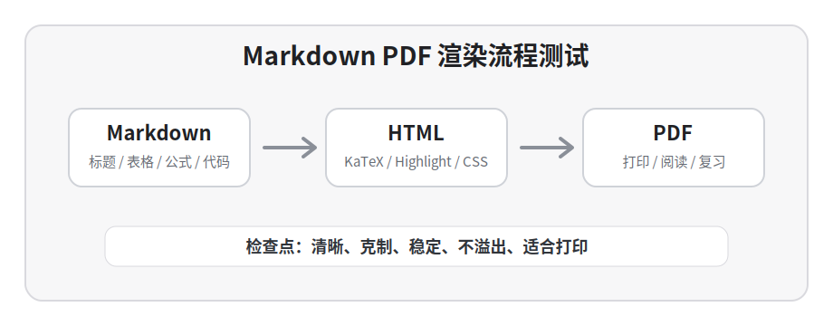

# Markdown PDF 全语法压力测试文档

这份文档专门用于测试 Markdown → HTML → PDF 的完整渲染效果。目标不是写成正式笔记，而是尽量覆盖常见 Markdown、GFM、Obsidian 风格语法与少量 HTML 混排，方便检查主题在 **标题、正文、列表、表格、代码块、公式、图片、Callout、分页** 等场景下是否稳定。

> [!NOTE] 测试原则
> 这份文档应尽量保持内容丰富，但视觉上仍要适合打印阅读。测试时重点看：是否乱码、是否溢出、是否过度拥挤、是否分页断裂、代码和公式是否清晰。

---

## 1. 标题层级测试

标题用于测试字号、字重、上下间距、分页避让，以及 `markdown-it-anchor` 生成的标题锚点是否会错误显示为普通链接。

### 1.1 三级标题

三级标题用于小节，应该比正文醒目，但不要压过二级标题。

#### 1.1.1 四级标题

四级标题适合放知识点、小结、局部说明。

##### 五级标题

五级标题通常用于补充标签或更深层次说明。

###### 六级标题

六级标题应克制，颜色可以略淡，但不能看不清。

---

## 2. 段落、强调、链接与行内元素

普通段落用于观察中文、English words、数字 123456、标点符号、行距与字间距。This sentence checks English and Chinese mixed typography. 一份好的 PDF 应该像可以打印的讲义，而不是网页截图。

这句话包含 **加粗文本**、*斜体文本*、***加粗斜体***、~~删除线~~、==高亮文本==、`inline code`、<kbd>Ctrl</kbd> + <kbd>Shift</kbd> + <kbd>P</kbd>，以及普通链接：[Obsidian](https://obsidian.md)。

行内代码应保持紧凑，例如 `npm run build:pdf`、`const value = 42`、`/home/runner/work/project`。行内公式也应自然融入正文：\( x^2 + y^2 = r^2 \)，\( T(n)=O(n\log n) \)。

长段落压力测试：这里故意写一段比较长的中文内容，用于观察连续阅读时的排版密度。正文行距过大会浪费纸张，行距过小会显得拥挤；字体太花会影响学习资料的严肃感，字体太淡又会降低可读性。理想效果是白底、清晰、克制、稳定，标题能快速定位，表格不会撑破页面，代码块不会变成很重的黑色大块，公式不会与正文割裂。

---

## 3. 列表与任务列表

### 3.1 无序列表

- 第一层项目：普通短文本。
- 第一层项目：这是一条比较长的列表项，用于测试换行后的缩进是否稳定，第二行不应该跑到项目符号下面。
  - 第二层项目：嵌套列表测试。
  - 第二层项目：包含 `inline code`、**强调**、\( O(n) \)。
    - 第三层项目：更深层级。
    - 第三层项目：继续测试缩进与行距。

### 3.2 有序列表

1. 打开仓库并阅读 `notes.md`。
2. 修改 Markdown 测试内容。
3. 运行构建脚本生成 HTML 和 PDF。
4. 渲染 PDF 页面并检查：
   1. 标题是否正常。
   2. 表格是否溢出。
   3. 代码块是否清晰。
   4. 公式是否正常。
5. 合并到 `main` 后保存 artifact。

### 3.3 任务列表

- [x] 支持中文正文。
- [x] 支持标题锚点但不显示下划线。
- [x] 支持浅色代码块。
- [x] 支持 KaTeX 数学公式。
- [x] 支持 GFM 表格与任务列表。
- [ ] 继续观察复杂 Obsidian 语法兼容性。

### 3.4 定义式列表的替代写法

**Name**：Markdown PDF Test  
**Purpose**：覆盖常见 Markdown 渲染场景  
**Output**：`dist/notes.html` 与 `dist/notes.pdf`

---

## 4. 引用与 Obsidian Callout

普通引用：

> 这是一段普通 blockquote。引用块应与正文有轻微区分，但不要太重。引用中的 **重点词**、`代码`、\( a+b=c \) 也应正常显示。
>
> 引用可以有多段内容，用来测试段落间距与左边框高度。

Obsidian Callout：

> [!NOTE] Note / 普通提示
> 用于补充说明、术语解释、背景信息。

> [!INFO] Info / 信息
> 用于放与正文相关但不必背诵的信息。

> [!TIP] Tip / 技巧
> 用于放口诀、做题技巧、快捷操作。

> [!IMPORTANT] Important / 重点
> 用于放考试重点、关键结论、必须记住的规则。

> [!WARNING] Warning / 易错
> 用于放容易漏条件、容易算错、容易混淆的点。

> [!QUESTION] Question / 自测
> 用于放自测题或复习前问题。

> [!DANGER] Danger / 严重错误
> 用于放会导致整体结论错误的陷阱。

> [!EXAMPLE] Example / 示例
> 用于放一个短例子：若 \( f(x)=x^2 \)，则 \( f'(x)=2x \)。

---

## 5. 表格测试

### 5.1 基础表格

| 类型 | Markdown 写法 | PDF 检查点 |
|---|---|---|
| 标题 | `#`、`##`、`###` | 层级清楚，标题不应像链接 |
| 段落 | 普通文本 | 行距稳定，中文英文混排自然 |
| 公式 | `\(...\)`、`\[...\]` | KaTeX 正常渲染 |
| 代码 | fenced code block | 浅色代码块，字体等宽 |
| Callout | `> [!NOTE]` | 背景、标题、边框正常 |
| 图片 | `` | 不溢出页面，居中显示 |

### 5.2 对齐表格

| 左对齐 | 居中对齐 | 右对齐 |
|:---|:---:|---:|
| alpha | beta | 123 |
| 中文内容 | 居中内容 | 456 |
| long text wraps naturally | center text | 789 |

### 5.3 混合内容表格

| 场景 | 示例 | 说明 |
|---|---|---|
| 行内代码 | `npm run build:pdf` | 长命令应能自动换行 |
| 行内公式 | \( O(n\log n) \) | 公式不能撑破列宽 |
| 链接 | [GitHub](https://github.com) | 链接样式不要太突兀 |
| 长文本 | 这一格故意写得比较长，用于观察表格自动换行后是否仍然美观。 | 单元格不应溢出页面 |
| 中英混排 | Markdown、Obsidian、PDF、中文测试 | 字距与换行应自然 |

### 5.4 宽表格压力测试

| 编号 | 模块 | 输入文件 | 输出文件 | 状态 | 备注 |
|---:|---|---|---|---|---|
| 1 | Markdown 解析 | `notes.md` | `notes.html` | success | 检查标题、列表、表格 |
| 2 | 公式渲染 | `\(...\)` / `\[...\]` | KaTeX HTML | success | 检查行内与块级公式 |
| 3 | PDF 打印 | Chromium print | `notes.pdf` | success | 检查分页、页码、边距 |
| 4 | Artifact 上传 | `dist/` | GitHub Actions artifact | success | 检查文件大小与完整性 |

---

## 6. 代码块测试

### 6.1 Plain text / 目录结构

```text
repo/
├─ notes.md
├─ style.css
├─ themes/
│  └─ obsidian-inspired.css
├─ scripts/
│  ├─ build-pdf.mjs
│  └─ build-with-log.mjs
└─ images/
   └─ md-test-diagram.svg
```

### 6.2 Bash

```bash
set -euo pipefail
npm ci
npm run build:html
npm run build:pdf
ls -lh dist/notes.pdf dist/notes.html
```

### 6.3 JSON

```json
{
  "run_id": "28447402593",
  "status": "success",
  "artifact": {
    "name": "obsidian-style-pdf",
    "path": "dist/notes.pdf"
  }
}
```

### 6.4 YAML

```yaml
name: Build Obsidian Style PDF
on:
  push:
    branches: [main]
jobs:
  build:
    runs-on: ubuntu-latest
```

### 6.5 JavaScript

```javascript
function normalizeTitle(title) {
  return String(title)
    .trim()
    .replace(/\s+/g, '-')
    .toLowerCase();
}

const heading = normalizeTitle('Markdown PDF 全语法压力测试文档');
console.log({ heading, ok: heading.length > 0 });
```

### 6.6 TypeScript

```typescript
type BuildStatus = 'pending' | 'running' | 'success' | 'failure';

interface BuildRecord {
  runId: string;
  status: BuildStatus;
  artifactName?: string;
}

const record: BuildRecord = {
  runId: '28447402593',
  status: 'success',
  artifactName: 'obsidian-style-pdf'
};
```

### 6.7 Python

```python
from pathlib import Path

root = Path('dist')
for file in root.glob('*'):
    print(file.name, file.stat().st_size)

def clamp(value: float, low: float, high: float) -> float:
    return max(low, min(value, high))
```

### 6.8 C++

```cpp
#include <bits/stdc++.h>
using namespace std;

int main() {
    vector<int> a = {1, 1, 2, 3, 5, 8};
    long long sum = 0;
    for (int x : a) sum += x;
    cout << "sum = " << sum << '\n';
    return 0;
}
```

### 6.9 SQL

```sql
SELECT act_id, status, updated_at
FROM workflow_acts
WHERE status IN ('running', 'failed')
ORDER BY updated_at DESC
LIMIT 20;
```

### 6.10 CSS

```css
.markdown-preview-view h2 {
  margin-top: 1.2em;
  border-bottom: 1px solid #e5e5e7;
}

pre code {
  font-family: "JetBrains Mono", "Cascadia Code", Consolas, monospace;
}
```

### 6.11 HTML

```html
<details>
  <summary>点击查看说明</summary>
  <p>这里测试 HTML 片段在 Markdown PDF 中的渲染。</p>
</details>
```

### 6.12 Markdown 原文

```markdown
> [!TIP] 做题技巧
> 先看条件，再选方法，最后检查边界。

| 名称 | 复杂度 |
|---|---:|
| 快速排序 | \( O(n \log n) \) |
```

### 6.13 Diff

```diff
- 标题显示为普通链接，带下划线。
+ 标题继承标题样式，不显示链接下划线。
+ 代码块使用浅色背景，适合打印。
```

---

## 7. 数学公式测试

行内公式：\( x^2 + y^2 = r^2 \)，\( \alpha + \beta = \gamma \)，\( T(n)=O(n\log n) \)，\( \frac{a}{b}+\sqrt{x}=1 \)。

块级公式：

\[
\begin{aligned}
E &= mc^2 \\
f(x) &= \int_0^x e^{-t^2}\,dt \\
\nabla \cdot \mathbf{F} &= \frac{\partial P}{\partial x}+\frac{\partial Q}{\partial y}+\frac{\partial R}{\partial z}
\end{aligned}
\]

分段函数：

\[
f(x)=
\begin{cases}
x^2, & x \ge 0, \\
-x, & x < 0.
\end{cases}
\]

矩阵：

\[
A = \begin{bmatrix}
1 & 2 & 3 \\
0 & 1 & 4 \\
5 & 6 & 0
\end{bmatrix},
\qquad
\det(A)=1.
\]

长公式换行：

\[
\begin{aligned}
L(\theta)
&= \prod_{i=1}^{n} p(x_i \mid \theta) \\
\ell(\theta)
&= \sum_{i=1}^{n} \log p(x_i \mid \theta) \\
\hat{\theta}
&= \arg\max_{\theta} \ell(\theta)
\end{aligned}
\]

求和与极限：

\[
\sum_{k=1}^{n} k = \frac{n(n+1)}{2},
\qquad
\lim_{n\to\infty}\left(1+\frac{1}{n}\right)^n=e.
\]

---

## 8. 图片、链接与 Obsidian 语法

标准 Markdown 图片：



图片下面的普通段落用于检查图片后的间距是否自然。图片应居中显示，不应撑破页面，也不应出现异常黑边。

Obsidian 图片语法：

![[images/md-test-diagram.svg|Obsidian 图片别名]]

Obsidian 双链会被简化为普通文本，例如：`[[机器学习]]`、`[[大数据#Spark|Spark 章节]]`、`[[408/操作系统/内存管理]]`。

外部链接测试：[GitHub](https://github.com)、[KaTeX](https://katex.org)、[Markdown Guide](https://www.markdownguide.org)。

---

## 9. HTML 小组件测试

键盘按键：<kbd>Ctrl</kbd> + <kbd>Shift</kbd> + <kbd>P</kbd>，<kbd>Alt</kbd> + <kbd>Tab</kbd>。

<details>
<summary>展开区域示例</summary>

这里用于测试原生 HTML 在 PDF 中的样式。导出 PDF 时至少不能破坏页面布局，文字不能重叠，边距不能异常。

</details>

<div class="custom-box">
<strong>HTML div 测试：</strong> 这是一段内联 HTML，用于检查主题是否会破坏普通块级元素。
</div>

---

## 10. 分页与长内容压力测试

下面连续放几段文字，模拟真实复习资料里的长文档。主题需要在跨页时保持稳定，尤其是标题不要单独落在页尾，表格和代码块不要被切得太难看，公式不要出现上下拥挤。

第一段：Markdown 文档通常由标题、段落、列表、表格、代码和公式混合构成。如果只测试单个组件，很容易看不出整体排版问题。因此本测试文档故意把多种元素放在一起，观察连续阅读时是否自然。

第二段：PDF 的目标和网页不同。网页可以依赖滚动和交互，PDF 更强调固定页面、清晰留白、可打印性和稳定分页。一个适合学习资料的主题，不应该过度使用彩色背景，也不应该让代码块、表格、Callout 抢走正文的注意力。

第三段：如果某个主题在第一页看起来还可以，但到表格、代码块、长公式、图片之后变得混乱，就说明它不适合作为通用 Markdown PDF 主题。真正可用的主题应该在所有常见语法下都保持克制和一致。

---

## 11. 最终检查清单

- [ ] 标题层级清晰，标题锚点不显示为普通链接。
- [ ] 正文中文、英文、数字混排自然。
- [ ] 加粗、斜体、删除线、高亮、行内代码正常。
- [ ] 无序列表、有序列表、嵌套列表缩进稳定。
- [ ] 任务列表 checkbox 正常显示。
- [ ] 引用块和 Obsidian Callout 有区分度但不过度花哨。
- [ ] 表格边框清楚，长文本能换行，不溢出页面。
- [ ] 多语言代码块高亮正常，浅色背景适合打印。
- [ ] 行内公式、块级公式、矩阵、分段函数正常渲染。
- [ ] Markdown 图片与 Obsidian 图片语法正常。
- [ ] HTML 小组件不会破坏页面布局。
- [ ] PDF 页脚、页码、边距、分页正常。